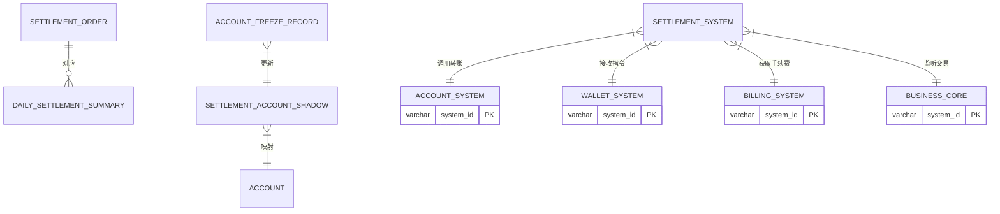

# DocuFlow-AI Project - 软件设计文档
生成时间: 2026-01-16 17:26:44

## 目录
1. [概述说明](#1-概述说明)
   - 1.1 [术语与缩略词](#11-术语与缩略词)
2. [系统设计](#2-系统设计)
3. [模块设计](#3-模块设计)
   - 3.1 [账户系统](#31-账户系统)
   - 3.2 [认证系统](#32-认证系统)
   - 3.3 [计费中台](#33-计费中台)
   - 3.4 [业务核心](#34-业务核心)
   - 3.5 [三代系统](#35-三代系统)
   - 3.6 [清结算系统](#36-清结算系统)
   - 3.7 [电子签约平台](#37-电子签约平台)
   - 3.8 [行业钱包系统](#38-行业钱包系统)
   - 3.9 [对账单系统](#39-对账单系统)
   - 3.10 [钱包APP/商服平台](#310-钱包APP/商服平台)
4. [接口设计](#4-接口设计)
5. [数据库设计](#5-数据库设计)

---
# 1 概述说明

## 1.1 术语与缩略词


## 角色

- **天财** (别名: 天财商龙): 一个特定的商户或机构（推测为餐饮SaaS服务商“天财商龙”），是本需求文档中分账、结算等服务的核心发起方和使用方。
- **总部** (别名: 总店, 发起方): 在天财分账业务场景中，指品牌方或管理方，通常是归集资金的收取方、批量付款和会员结算的发起及付款方。角色类型为“企业”。
- **门店**: 在天财分账业务场景中，指具体的经营门店，可以是归集资金的付出方，也可以是会员结算的接收方。

## 业务实体

- **天财专用账户**: 为满足天财特定业务需求（分账、会员结算、批量付款）而开立的特殊账户类型，在账户系统底层有特殊标记，包括天财收款账户和天财接收方账户。
- **天财收款账户** (别名: 收款账户): 天财专用账户的一种，是收单商户用于接收交易结算资金的账户。类型为行业钱包（非小微钱包），分为总部和门店角色。
- **天财接收方账户** (别名: 接收方账户, 入账方账户): 天财专用账户的一种，用于接收从天财收款账户分账而来的资金，支持绑定多张银行卡并设置默认提现卡。
- **收单商户** (别名: 商户): 通过支付机构（如拉卡拉）进行收款业务的商户实体。在本系统中，可根据业务模式分为主动结算商户和被动结算商户。
- **待结算账户** (别名: 01账户): 用于临时存放收单交易待结算资金的内部账户，编号常为01。
- **退货账户** (别名: 04账户): 用于处理交易退货资金的内部账户，编号常为04。

## 技术术语

- **三代**: 指代拉卡拉内部的某一代业务系统，负责商户管理、开户、配置、接口调用等核心业务处理。
- **行业钱包系统** (别名: 钱包系统): 处理钱包类账户业务（如天财专用账户）的核心系统，负责开户、关系绑定校验、分账请求处理、数据同步等。
- **账户系统**: 底层的账户管理核心系统，负责实际创建和管理各类账户（包括天财专用账户），控制账户能力并打标记。
- **清结算系统** (别名: 清结算): 负责资金清算与结算的系统，处理交易资金的划拨、结算单生成、退货资金处理等。
- **电子签约平台** (别名: 电子签章系统): 提供电子协议签署、短信认证、H5页面、证据链留存等服务的系统。
- **认证系统**: 提供身份验证服务的系统，支持打款验证和人脸验证等核验方式。
- **打款验证**: 一种身份认证方式，认证系统向目标银行卡打入随机小额款项，验证回填信息是否正确。
- **人脸验证**: 一种身份认证方式，通过比对姓名、身份证和人脸信息进行核验。
- **主动结算**: 一种结算模式，指收单交易资金结算到商户指定的收款账户（如天财收款账户），而非待结算账户。
- **被动结算**: 一种结算模式，指收单交易资金先停留在待结算账户，需要商户发起提款指令才能到账。
- **对账单系统**: 生成和提供各类账户动账明细、交易账单的系统，为天财机构提供机构层的分账、提款、收单、结算等账单。
- **计费中台**: 负责计算并收取转账/分账手续费的系统。
- **业务核心**: 接收并处理交易（包括天财分账交易）的核心系统。

## 流程

- **归集** (别名: 资金归集): 一种资金流转场景，指门店将资金归集到总部。需要建立“门店归集关系”，并进行打款验证和协议签署。
- **批量付款** (别名: 批付): 一种资金流转场景，指总部向多个接收方（如供应商、股东）进行分账付款。
- **会员结算**: 一种资金流转场景，特指总部向门店进行与会员储值消费相关的资金分账结算。
- **关系绑定** (别名: 签约与认证, 绑定关系): 在特定场景（归集、批量付款、会员结算）下，建立资金收付双方授权关系的过程，包含协议签署和身份认证（打款或人脸）。
- **开通付款**: 在批量付款和会员结算场景下，付方（总部/门店）需要额外进行的一次授权流程，签署代付授权协议，是关系绑定生效的前提。
- **天财分账** (别名: 转账): 特指在天财专用账户之间进行的资金划转交易，是系统定义的一种新交易类型。包括从天财收款账户分账给另一个天财收款账户或天财接收方账户。

---
# 2 系统设计
# 天财分账支付平台系统级设计文档

## 2.1 系统结构

本系统采用分层、模块化的微服务架构，旨在为“天财商龙”业务场景提供安全、合规、高效的账户管理与资金分账服务。整体架构遵循“高内聚、低耦合”原则，通过清晰的职责边界和标准化的API接口进行协作。

### 系统架构图 (C4 Container Diagram)


**架构说明**:
1.  **业务接入与编排层**: 作为对外业务入口，`三代系统`负责与外部“天财商龙”业务系统对接，进行业务路由和配置管理；`行业钱包系统`作为内部流程编排中枢，协调各下游服务完成业务闭环。
2.  **核心业务处理层**: 包含交易处理(`业务核心`)、账户管理(`账户系统`)、资金划转(`清结算系统`)和费用计算(`计费中台`)等核心支付能力，是系统的心脏。
3.  **支撑与合规服务层**: 提供身份认证(`认证系统`)、电子签约(`电子签约平台`)、账单服务(`对账单系统`)等支撑性、合规性功能，保障业务安全、合规、可审计。
4.  **基础设施**: 统一的数据库、消息队列和缓存服务，为各微服务提供数据持久化、异步解耦和性能加速能力。

## 2.2 功能结构

系统功能围绕“天财专用账户”的生命周期和“天财分账”交易流程进行组织，主要分为五大功能域。

### 功能结构图


**功能域说明**:
- **账户管理功能域**: 由`账户系统`和`三代系统`共同实现，负责天财专用账户的创建、维护、查询和资金明细展示。
- **交易处理功能域**: 以`业务核心`和`行业钱包系统`为核心，完成从天财发起的资金分账交易的全流程处理。
- **清结算功能域**: 由`清结算系统`主导，处理账户间的实时分账、商户资金的主动结算以及日终清算。
- **合规与风控功能域**: 由`认证系统`和`电子签约平台`支撑，确保业务参与方身份真实、授权有效，并留存完整合规证据。
- **运营支撑功能域**: 包括`对账单系统`的账单服务、`计费中台`的规则管理、`三代系统`的关系管理以及`钱包APP`的商户端功能管控。

## 2.3 网络拓扑图

系统部署在私有云或金融云环境，采用分区隔离、多层防护的网络架构，确保安全与合规。


**网络拓扑说明**:
1.  **分区隔离**: 严格划分互联网区(DMZ)、业务服务区、数据区和外部服务区，通过防火墙策略控制访问。
2.  **入口防护**: 互联网流量通过WAF和负载均衡进入，仅暴露`行业钱包系统`(面向商户APP)和`三代系统`(面向天财商龙)的接口。
3.  **内部通信**: 微服务间通过内部负载均衡和私有域名进行RPC调用，关键异步通信通过消息中间件解耦。
4.  **数据访问**: 业务服务区通过专线或安全网关访问数据区的主备数据库。写操作指向主库，部分读操作可分流至只读副本。
5.  **外部集成**: 与第三方服务（短信、人脸、文件存储）的通信通过指定的出口网关进行，并配置相应的IP白名单和流量监控。

## 2.4 数据流转

系统数据流转主要围绕“账户开户”、“关系绑定”、“分账交易”和“账单生成”四个核心业务流程。

### 核心业务流程数据流图


**数据流转关键点**:
1.  **开户与绑定**: 数据从外部业务系统流入，经过多系统校验、账户创建、合规认证，最终形成账户和绑定关系数据，存储于`账户系统`、`行业钱包系统`和`三代系统`的相关表中。
2.  **分账交易**: 交易指令触发资金和状态的连环变更。`业务核心`记录交易主流程，`清结算系统`记录资金划拨订单，`账户系统`记录最底层的余额和明细变动，`计费中台`记录费用流水。各模块通过事务消息确保最终一致性。
3.  **账单生成**: `对账单系统`作为数据消费者，在日终或定时从多个上游系统（`账户系统`、`业务核心`、`清结算系统`等）拉取加工后的明细数据，进行聚合后生成面向天财机构的统一视图账单。上游系统需保证数据的准确性和及时推送。

## 2.5 系统模块交互关系

以下模块交互图详细描述了各微服务在关键场景下的调用依赖关系。

### 模块交互依赖图


**核心交互关系分析**:

1.  **中枢协调者 - 行业钱包系统**: 是业务流程的主要驱动者，依赖最多下游系统（账户、签约、业务核心、计费），是连接业务入口（三代）与内部核心服务的枢纽。
2.  **核心服务三角 - 业务核心、清结算、账户系统**: 构成资金处理的核心闭环。`业务核心`驱动交易，`清结算`执行资金操作，`账户系统`记录资金变动，三者联系紧密。
3.  **配置与数据源 - 三代系统**: 作为业务规则的源头（如计费规则、商户关系），被`计费中台`、`行业钱包`、`对账单系统`等多个模块依赖。
4.  **合规双支柱 - 认证系统 & 电子签约平台**: 两者相互调用，共同完成用户身份核实与法律授权，为`行业钱包系统`发起的绑定、付款等关键操作提供安全保障。
5.  **数据消费端 - 对账单系统**: 是主要的数据集成和输出端，依赖几乎所有产生资金和交易数据的核心模块，以提供统一的账单视图。
6.  **客户端 - 钱包APP/商服平台**: 面向最终用户，其功能实现依赖于后端的账户、交易、关系管理等核心服务。

此设计确保了职责清晰，同时通过`行业钱包系统`的有效编排和标准化API，降低了模块间的网状耦合度。
---
# 3 模块设计

## 3.1 账户系统


# 账户系统模块设计文档

## 1. 概述

### 1.1 目的
账户系统作为底层核心账户管理模块，负责为“天财商龙”业务场景创建和管理专用的账户体系。主要目的是：
1. 为天财机构下的商户开立和管理具有特殊标记的“天财专用账户”（包括收款账户和接收方账户）。
2. 控制天财专用账户的特殊能力（如仅限天财账户间转账）。
3. 支持普通收款账户升级为天财专用账户。
4. 为上层系统（三代、行业钱包系统）提供账户基础服务，并确保账户数据的一致性。

### 1.2 范围
- **账户创建**：支持开立天财收款账户、天财接收方账户。
- **账户升级**：支持将普通收款账户升级为天财收款账户。
- **账户标记**：为天财机构下的所有相关账户打上“天财”标记。
- **账户能力控制**：限制天财专用账户仅能与同类型账户进行资金划转。
- **数据提供**：为对账单系统提供账户动账明细数据。
- **冻结支持**：配合清结算系统完成账户冻结操作。

## 2. 接口设计

### 2.1 API端点 (REST)

#### 2.1.1 创建天财专用账户
- **端点**：`POST /api/v1/accounts/tiancai-special`
- **描述**：为指定商户开立天财专用账户（收款账户或接收方账户）。
- **调用方**：行业钱包系统（经三代转发）
- **认证**：机构级API Key (AppId + Secret)，仅限天财机构号调用。
- **请求头**：
  ```json
  {
    "X-App-Id": "tiancai_org_id",
    "X-Api-Key": "encrypted_secret",
    "X-Request-Id": "uuid"
  }
  ```
- **请求体**：
  ```json
  {
    "requestId": "unique_request_id_from_wallet",
    "merchantNo": "收单商户号",
    "accountType": "RECEIVE_ACCOUNT | RECEIVER_ACCOUNT", // 收款账户 | 接收方账户
    "roleType": "HEADQUARTERS | STORE", // 总部 | 门店，仅收款账户必填
    "accountName": "账户名称",
    "certType": "ID_CARD | BUSINESS_LICENSE",
    "certNo": "证件号码",
    "bankCardNo": "默认银行卡号（接收方账户可多卡，此为默认）",
    "bankCode": "银行编码",
    "bankName": "银行名称",
    "upgradeFlag": false, // 是否为升级操作（true时，merchantNo必须已有普通收款账户）
    "effectiveTime": "2024-01-01 00:00:00" // 账户生效时间，用于次日生效场景
  }
  ```
- **响应体** (成功)：
  ```json
  {
    "code": "SUCCESS",
    "message": "开户成功",
    "data": {
      "accountNo": "天财专用账户号",
      "accountType": "RECEIVE_ACCOUNT | RECEIVER_ACCOUNT",
      "accountStatus": "NORMAL",
      "tiancaiFlag": true,
      "merchantNo": "收单商户号",
      "createTime": "2024-01-01 10:00:00"
    }
  }
  ```
- **响应体** (失败)：
  ```json
  {
    "code": "ERROR_CODE",
    "message": "错误描述",
    "data": null
  }
  ```

#### 2.1.2 查询账户信息
- **端点**：`GET /api/v1/accounts/{accountNo}`
- **描述**：查询账户详细信息，包括天财标记、账户类型、状态等。
- **调用方**：行业钱包系统、清结算系统、对账单系统
- **响应体**：
  ```json
  {
    "code": "SUCCESS",
    "data": {
      "accountNo": "账户号",
      "accountType": "RECEIVE_ACCOUNT | RECEIVER_ACCOUNT | SETTLEMENT_ACCOUNT | REFUND_ACCOUNT",
      "accountSubType": "TIANCAI | NORMAL", // 天财专用 | 普通
      "tiancaiFlag": true,
      "merchantNo": "商户号",
      "accountStatus": "NORMAL | FROZEN | CLOSED",
      "balance": "1000.00",
      "currency": "CNY",
      "roleType": "HEADQUARTERS | STORE | NULL",
      "createTime": "2024-01-01 10:00:00",
      "updateTime": "2024-01-01 10:00:00"
    }
  }
  ```

#### 2.1.3 批量查询账户动账明细
- **端点**：`POST /api/v1/accounts/transaction-details`
- **描述**：为对账单系统提供指定时间范围内指定类型账户的动账明细。
- **调用方**：对账单系统
- **请求体**：
  ```json
  {
    "accountTypes": ["RECEIVE_ACCOUNT", "RECEIVER_ACCOUNT", "SETTLEMENT_ACCOUNT", "REFUND_ACCOUNT"],
    "tiancaiFlag": true, // 可选，true只查天财账户
    "startTime": "2024-01-01 00:00:00",
    "endTime": "2024-01-02 00:00:00",
    "pageNo": 1,
    "pageSize": 1000
  }
  ```
- **响应体**：
  ```json
  {
    "code": "SUCCESS",
    "data": {
      "total": 1500,
      "pageNo": 1,
      "pageSize": 1000,
      "details": [
        {
          "accountNo": "账户号",
          "accountType": "RECEIVE_ACCOUNT",
          "tiancaiFlag": true,
          "merchantNo": "商户号",
          "transactionTime": "2024-01-01 10:30:25",
          "transactionType": "IN | OUT",
          "amount": "100.00",
          "balance": "1100.00",
          "oppositeAccountNo": "对方账户号",
          "oppositeAccountName": "对方账户名",
          "transactionId": "原交易流水号",
          "remark": "交易备注"
        }
      ]
    }
  }
  ```

### 2.2 发布的事件

#### 2.2.1 账户创建事件
- **事件名**：`ACCOUNT_CREATED`
- **发布时机**：天财专用账户创建成功时
- **事件内容**：
  ```json
  {
    "eventId": "uuid",
    "eventType": "ACCOUNT_CREATED",
    "timestamp": "2024-01-01T10:00:00Z",
    "data": {
      "accountNo": "天财专用账户号",
      "accountType": "RECEIVE_ACCOUNT | RECEIVER_ACCOUNT",
      "tiancaiFlag": true,
      "merchantNo": "收单商户号",
      "roleType": "HEADQUARTERS | STORE",
      "createTime": "2024-01-01 10:00:00"
    }
  }
  ```

#### 2.2.2 账户状态变更事件
- **事件名**：`ACCOUNT_STATUS_CHANGED`
- **发布时机**：账户状态变更时（冻结、解冻、注销）
- **事件内容**：
  ```json
  {
    "eventId": "uuid",
    "eventType": "ACCOUNT_STATUS_CHANGED",
    "timestamp": "2024-01-01T11:00:00Z",
    "data": {
      "accountNo": "账户号",
      "oldStatus": "NORMAL",
      "newStatus": "FROZEN",
      "reason": "风控冻结",
      "operator": "system",
      "changeTime": "2024-01-01 11:00:00"
    }
  }
  ```

## 3. 数据模型

### 3.1 数据库表设计

#### 表：account (账户主表)
| 字段名 | 类型 | 必填 | 默认值 | 说明 |
|--------|------|------|--------|------|
| id | bigint | Y | AUTO_INCREMENT | 主键 |
| account_no | varchar(32) | Y | | 账户号，唯一 |
| account_type | varchar(20) | Y | | 账户类型：RECEIVE_ACCOUNT(收款账户), RECEIVER_ACCOUNT(接收方账户), SETTLEMENT_ACCOUNT(待结算账户), REFUND_ACCOUNT(退货账户) |
| account_sub_type | varchar(20) | Y | NORMAL | 账户子类型：TIANCAI(天财专用), NORMAL(普通) |
| tiancai_flag | tinyint(1) | Y | 0 | 天财标记：0-否，1-是 |
| merchant_no | varchar(32) | Y | | 所属商户号 |
| account_name | varchar(100) | Y | | 账户名称 |
| account_status | varchar(20) | Y | NORMAL | 账户状态：NORMAL(正常), FROZEN(冻结), CLOSED(注销) |
| role_type | varchar(20) | N | | 角色类型：HEADQUARTERS(总部), STORE(门店) |
| balance | decimal(15,2) | Y | 0.00 | 账户余额 |
| currency | varchar(3) | Y | CNY | 币种 |
| version | int | Y | 0 | 版本号，用于乐观锁 |
| create_time | datetime | Y | CURRENT_TIMESTAMP | 创建时间 |
| update_time | datetime | Y | CURRENT_TIMESTAMP ON UPDATE | 更新时间 |

**索引**：
- 唯一索引：`uk_account_no` (account_no)
- 普通索引：`idx_merchant_no` (merchant_no)
- 复合索引：`idx_tiancai_merchant` (tiancai_flag, merchant_no)
- 复合索引：`idx_type_status` (account_type, account_status)

#### 表：account_bank_card (账户银行卡表，仅接收方账户使用)
| 字段名 | 类型 | 必填 | 默认值 | 说明 |
|--------|------|------|--------|------|
| id | bigint | Y | AUTO_INCREMENT | 主键 |
| account_no | varchar(32) | Y | | 账户号 |
| bank_card_no | varchar(30) | Y | | 银行卡号 |
| bank_code | varchar(10) | Y | | 银行编码 |
| bank_name | varchar(50) | Y | | 银行名称 |
| is_default | tinyint(1) | Y | 0 | 是否默认卡：0-否，1-是 |
| card_status | varchar(20) | Y | NORMAL | 状态：NORMAL(正常), FROZEN(冻结) |
| bind_time | datetime | Y | CURRENT_TIMESTAMP | 绑定时间 |

**索引**：
- 唯一索引：`uk_account_card` (account_no, bank_card_no)
- 普通索引：`idx_account_default` (account_no, is_default)

#### 表：account_transaction_detail (账户交易明细表)
| 字段名 | 类型 | 必填 | 默认值 | 说明 |
|--------|------|------|--------|------|
| id | bigint | Y | AUTO_INCREMENT | 主键 |
| detail_no | varchar(32) | Y | | 明细流水号，唯一 |
| account_no | varchar(32) | Y | | 账户号 |
| account_type | varchar(20) | Y | | 账户类型 |
| tiancai_flag | tinyint(1) | Y | 0 | 天财标记 |
| merchant_no | varchar(32) | Y | | 商户号 |
| transaction_time | datetime | Y | | 交易时间 |
| transaction_type | varchar(10) | Y | | 交易类型：IN(入账), OUT(出账) |
| amount | decimal(15,2) | Y | | 交易金额 |
| balance | decimal(15,2) | Y | | 交易后余额 |
| opposite_account_no | varchar(32) | N | | 对方账户号 |
| opposite_account_name | varchar(100) | N | | 对方账户名 |
| transaction_id | varchar(32) | N | | 原交易流水号 |
| remark | varchar(200) | N | | 备注 |
| create_time | datetime | Y | CURRENT_TIMESTAMP | 创建时间 |

**索引**：
- 唯一索引：`uk_detail_no` (detail_no)
- 复合索引：`idx_account_time` (account_no, transaction_time)
- 复合索引：`idx_merchant_time` (merchant_no, transaction_time)
- 复合索引：`idx_tiancai_time` (tiancai_flag, transaction_time)

### 3.2 与其他模块的关系


## 4. 业务逻辑

### 4.1 核心算法

#### 4.1.1 账户号生成算法
```python
def generate_account_no(account_type, merchant_no, sequence):
    """
    生成账户号算法
    格式：TT + 账户类型码(2位) + 商户号后6位 + 序列号(6位) + 校验码(2位)
    示例：TTRA12345600000123
    """
    # 账户类型映射
    type_map = {
        'RECEIVE_ACCOUNT': 'RA',
        'RECEIVER_ACCOUNT': 'RC',
        'SETTLEMENT_ACCOUNT': 'SA',
        'REFUND_ACCOUNT': 'RF'
    }
    
    prefix = "TT"  # 天财前缀
    type_code = type_map.get(account_type, 'XX')
    merchant_suffix = merchant_no[-6:] if len(merchant_no) >= 6 else merchant_no.zfill(6)
    seq_str = str(sequence).zfill(6)
    
    # 计算校验码（简单示例）
    raw = prefix + type_code + merchant_suffix + seq_str
    check_digit = calculate_check_digit(raw)
    
    return raw + check_digit
```

#### 4.1.2 余额更新乐观锁控制
```java
public boolean updateBalance(String accountNo, BigDecimal amount, String transactionId) {
    int retryCount = 0;
    while (retryCount < MAX_RETRY) {
        Account account = accountDao.selectByAccountNo(accountNo);
        BigDecimal newBalance = account.getBalance().add(amount);
        
        if (newBalance.compareTo(BigDecimal.ZERO) < 0) {
            throw new InsufficientBalanceException("余额不足");
        }
        
        int rows = accountDao.updateBalanceWithVersion(
            accountNo, 
            newBalance, 
            account.getVersion()
        );
        
        if (rows > 0) {
            // 记录交易明细
            saveTransactionDetail(account, amount, transactionId);
            return true;
        }
        
        retryCount++;
        Thread.sleep(RETRY_DELAY);
    }
    throw new ConcurrentUpdateException("账户更新冲突");
}
```

### 4.2 业务规则

#### 4.2.1 账户创建规则
1. **天财机构校验**：仅允许天财机构号（通过AppId识别）调用开户接口。
2. **账户类型限制**：
   - 天财收款账户：必须指定角色类型（总部/门店）
   - 天财接收方账户：可绑定多张银行卡，需指定默认卡
3. **升级规则**：
   - 普通收款账户升级为天财收款账户时，需确保原账户状态正常
   - 升级操作需保持原账户号不变，仅更新账户子类型和标记
4. **唯一性规则**：
   - 一个商户只能有一个天财收款账户
   - 一个商户可以有多个天财接收方账户

#### 4.2.2 转账校验规则
1. **账户类型校验**：天财专用账户只能转账给其他天财专用账户
2. **状态校验**：转出账户和转入账户必须状态正常（非冻结、非注销）
3. **余额校验**：转出账户余额必须充足（考虑手续费）

#### 4.2.3 冻结规则
1. **商户冻结**：冻结该商户对应的所有天财收款账户
2. **交易冻结**：冻结指定交易相关的天财收款账户资金

### 4.3 验证逻辑

#### 4.3.1 开户请求验证
```java
public void validateCreateRequest(TiancaiAccountCreateRequest request) {
    // 1. 基础参数非空校验
    Validate.notNull(request.getMerchantNo(), "商户号不能为空");
    Validate.notNull(request.getAccountType(), "账户类型不能为空");
    
    // 2. 天财机构校验（通过拦截器实现）
    
    // 3. 账户类型特定校验
    if (AccountType.RECEIVE_ACCOUNT.equals(request.getAccountType())) {
        Validate.notNull(request.getRoleType(), "收款账户必须指定角色类型");
    }
    
    if (AccountType.RECEIVER_ACCOUNT.equals(request.getAccountType())) {
        Validate.notNull(request.getBankCardNo(), "接收方账户必须指定银行卡");
    }
    
    // 4. 升级操作校验
    if (request.isUpgradeFlag()) {
        Account existing = accountDao.selectByMerchantNoAndType(
            request.getMerchantNo(), 
            AccountType.RECEIVE_ACCOUNT
        );
        Validate.notNull(existing, "升级操作需要已存在普通收款账户");
        Validate.isTrue(!existing.isTiancaiFlag(), "账户已是天财账户，无需升级");
    }
    
    // 5. 商户是否已有天财收款账户校验
    if (AccountType.RECEIVE_ACCOUNT.equals(request.getAccountType())) {
        long count = accountDao.countTiancaiReceiveAccount(request.getMerchantNo());
        Validate.isTrue(count == 0, "商户已存在天财收款账户");
    }
}
```

## 5. 时序图

### 5.1 天财专用账户开户时序图


### 5.2 天财分账转账时序图


## 6. 错误处理

### 6.1 预期错误码

| 错误码 | HTTP状态码 | 描述 | 处理建议 |
|--------|------------|------|----------|
| ACCOUNT_400001 | 400 | 参数校验失败 | 检查请求参数格式和必填项 |
| ACCOUNT_400002 | 400 | 商户号不存在 | 确认商户号是否正确 |
| ACCOUNT_400003 | 400 | 账户类型不支持 | 检查accountType枚举值 |
| ACCOUNT_403001 | 403 | 非天财机构禁止操作 | 检查AppId和机构权限 |
| ACCOUNT_409001 | 409 | 账户已存在 | 检查是否重复开户 |
| ACCOUNT_409002 | 409 | 并发更新冲突 | 重试操作 |
| ACCOUNT_422001 | 422 | 账户状态异常 | 检查账户是否冻结/注销 |
| ACCOUNT_422002 | 422 | 余额不足 | 检查账户余额 |
| ACCOUNT_422003 | 422 | 转账账户类型限制 | 天财账户只能转天财账户 |
| ACCOUNT_500001 | 500 | 系统内部错误 | 联系技术支持 |

### 6.2 重试策略
1. **乐观锁冲突**：最多重试3次，每次间隔100ms
2. **外部依赖超时**：配置超时时间（HTTP: 3s, DB: 1s），失败后快速失败
3. **MQ消息发送失败**：本地持久化后异步重试，最多5次

### 6.3 监控与告警
1. **关键指标监控**：
   - 开户成功率 < 99.9%
   - 转账失败率 > 0.1%
   - 账户余额异常（负数）
   - 数据库连接池使用率 > 80%
2. **告警渠道**：企业微信、短信、邮件
3. **日志级别**：
   - ERROR：系统异常、数据不一致
   - WARN：业务异常、重试操作
   - INFO：关键业务操作
   - DEBUG：调试信息（生产环境关闭）

## 7. 依赖说明

### 7.1 上游依赖

#### 7.1.1 行业钱包系统
- **依赖关系**：账户系统的主要调用方
- **交互方式**：同步HTTP API调用
- **关键接口**：
  - 开户接口 (`POST /api/v1/accounts/tiancai-special`)
  - 查询接口 (`GET /api/v1/accounts/{accountNo}`)
- **数据流**：接收开户请求，返回账户基础信息
- **SLA要求**：P99响应时间 < 200ms，可用性 > 99.95%

#### 7.1.2 对账单系统
- **依赖关系**：数据消费方
- **交互方式**：
  1. 同步：批量查询动账明细接口
  2. 异步：订阅账户创建事件
- **数据要求**：每日定时拉取D-1日动账明细，支持分页查询
- **数据量预估**：单商户日均1000笔，全量日均1000万笔

### 7.2 下游依赖

#### 7.2.1 数据库 (MySQL)
- **版本**：MySQL 5.7+
- **配置**：主从架构，读写分离
- **表规模预估**：
  - account表：初始100万，年增长50万
  - account_transaction_detail表：初始1亿，年增长1亿
- **性能要求**：单表查询 < 50ms，批量插入 > 1000条/秒

#### 7.2.2 消息队列 (Kafka/RocketMQ)
- **用途**：发布账户相关领域事件
- **Topic配置**：
  - `account-events`: 账户生命周期事件
  - `transaction-events`: 交易相关事件
- **消息格式**：JSON Schema
- **可靠性**：至少一次投递，支持消息重放

#### 7.2.3 配置中心
- **用途**：动态配置开关、参数
- **关键配置**：
  - 天财机构白名单
  - 账户号生成规则
  - 重试策略参数
  - 费率配置缓存

### 7.3 容错设计
1. **数据库降级**：主库故障时自动切换只读模式，提供基础查询服务
2. **缓存策略**：热点账户信息缓存（Redis），TTL 5分钟
3. **限流熔断**：
   - 开户接口：100 QPS/实例
   - 查询接口：500 QPS/实例
   - 转账接口：50 QPS/实例
4. **数据一致性**：
   - 最终一致性：通过事件驱动保证
   - 关键操作：本地事务保证强一致性

**文档版本**：v1.0  
**最后更新**：2024年1月  
**负责人**：账户系统架构组

## 3.2 认证系统


# 认证系统模块设计文档

## 1. 概述

### 1.1 目的
认证系统作为支付平台的核心安全模块，负责为“天财分账”等业务场景提供可靠的身份验证服务。其主要目的是确保资金流转关系绑定、协议签署等关键操作的主体身份真实有效，满足监管合规要求，并为电子签约平台提供认证证据链。

### 1.2 范围
本模块专注于以下核心功能：
1. **打款验证**：通过向目标银行卡打入随机小额款项，验证用户回填信息是否正确。
2. **人脸验证**：通过比对姓名、身份证和人脸生物特征信息进行身份核验。
3. **认证结果管理**：记录、存储和查询认证过程与结果，为其他系统（如行业钱包、电子签约平台）提供校验依据。
4. **接口封装**：为上游系统（主要是电子签约平台）提供标准化的认证服务接口。

**边界说明**：
- 本模块不负责协议模板管理、短信发送、H5页面生成（由电子签约平台负责）。
- 本模块不负责账户开立、关系绑定等业务逻辑（由行业钱包系统负责）。
- 本模块不直接面向天财或商户，所有请求均通过上游业务系统（如电子签约平台、行业钱包）发起。

## 2. 接口设计

### 2.1 API端点 (RESTful)

#### 2.1.1 发起打款验证
- **端点**: `POST /api/v1/verification/remittance`
- **描述**: 向指定银行卡发起一笔随机金额的打款，并生成一条待验证记录。
- **请求头**:
    - `X-Business-Id`: 业务流水号（由调用方生成，用于幂等）
    - `X-System-Code`: 调用系统编码（如：`WALLET`, `E-SIGN`）
- **请求体**:
```json
{
  "requestId": "REQ202310120001",
  "businessType": "TIANCAI_SPLIT_ACCOUNT",
  "scene": "BATCH_PAYMENT", // 场景：BATCH_PAYMENT, MEMBER_SETTLEMENT, POOLING
  "accountType": "TIANCAI_RECEIVE_ACCOUNT", // 账户类型
  "verifierType": "ENTERPRISE", // 核验方属性：ENTERPRISE, INDIVIDUAL
  "bankCardInfo": {
    "cardNo": "6228480012345678901",
    "accountName": "北京天财餐饮有限公司",
    "bankCode": "ICBC"
  },
  "callbackUrl": "https://e-sign.example.com/callback/verification",
  "extInfo": {
    "merchantNo": "M100001",
    "merchantName": "天财总部",
    "relatedMerchantNo": "M100002"
  }
}
```
- **响应体** (成功):
```json
{
  "code": "SUCCESS",
  "message": "打款验证已发起",
  "data": {
    "verificationId": "VER202310120001",
    "status": "PENDING",
    "estimatedArrivalTime": "2023-10-12T15:30:00Z"
  }
}
```

#### 2.1.2 确认打款验证
- **端点**: `POST /api/v1/verification/remittance/confirm`
- **描述**: 用户回填打款金额和备注后，调用此接口进行核验。
- **请求体**:
```json
{
  "verificationId": "VER202310120001",
  "filledAmount": "0.12",
  "filledRemark": "验证码"
}
```
- **响应体** (成功):
```json
{
  "code": "SUCCESS",
  "message": "验证成功",
  "data": {
    "verificationId": "VER202310120001",
    "status": "SUCCESS",
    "verifiedAt": "2023-10-12T15:35:00Z"
  }
}
```

#### 2.1.3 发起人脸验证
- **端点**: `POST /api/v1/verification/face`
- **描述**: 发起人脸生物特征核验。
- **请求体**:
```json
{
  "requestId": "REQ202310120002",
  "businessType": "TIANCAI_SPLIT_ACCOUNT",
  "scene": "BATCH_PAYMENT",
  "accountType": "TIANCAI_RECEIVE_ACCOUNT",
  "verifierType": "INDIVIDUAL",
  "identityInfo": {
    "name": "张三",
    "idCardNo": "110101199001011234"
  },
  "faceImage": "base64编码的人脸图片数据或图片URL",
  "livenessDetection": true, // 是否进行活体检测
  "callbackUrl": "https://e-sign.example.com/callback/verification",
  "extInfo": {
    "merchantNo": "M100002",
    "merchantName": "某某门店"
  }
}
```
- **响应体** (成功):
```json
{
  "code": "SUCCESS",
  "message": "人脸验证已发起",
  "data": {
    "verificationId": "VER202310120002",
    "status": "PENDING"
  }
}
```
*注：实际实现可能采用同步或异步模式。若接入的第三方人脸服务支持同步返回，则可同步返回结果。*

#### 2.1.4 查询认证结果
- **端点**: `GET /api/v1/verification/{verificationId}`
- **描述**: 根据认证流水号查询认证详情和结果。
- **响应体**:
```json
{
  "code": "SUCCESS",
  "message": "查询成功",
  "data": {
    "verificationId": "VER202310120001",
    "type": "REMITTANCE", // REMITTANCE, FACE
    "status": "SUCCESS", // PENDING, SUCCESS, FAILED, EXPIRED
    "businessType": "TIANCAI_SPLIT_ACCOUNT",
    "scene": "BATCH_PAYMENT",
    "verifierType": "ENTERPRISE",
    "targetInfo": {
      // 打款验证：包含银行卡信息
      // 人脸验证：包含身份信息
    },
    "requestedAt": "2023-10-12T15:25:00Z",
    "verifiedAt": "2023-10-12T15:35:00Z",
    "failureReason": null,
    "evidence": {
      // 证据链信息，如打款金额、备注、第三方人脸服务流水号等
      "remittanceAmount": "0.12",
      "remittanceRemark": "验证码",
      "thirdPartyRef": "TP202310120001"
    }
  }
}
```

### 2.2 发布/消费的事件

#### 2.2.1 消费的事件
- **`AccountCreatedEvent`** (来自账户系统)
    - **用途**: 当新的天财专用账户（收款账户或接收方账户）创建时，认证系统可监听此事件，用于关联后续的认证记录与账户。

#### 2.2.2 发布的事件
- **`VerificationCompletedEvent`**
    - **触发条件**: 任何一笔认证（打款/人脸）完成（成功或失败）。
    - **事件数据**:
    ```json
    {
      "eventId": "EVT_VER_202310120001",
      "type": "VERIFICATION_COMPLETED",
      "timestamp": "2023-10-12T15:35:00Z",
      "payload": {
        "verificationId": "VER202310120001",
        "type": "REMITTANCE",
        "status": "SUCCESS",
        "businessType": "TIANCAI_SPLIT_ACCOUNT",
        "relatedMerchantNo": "M100001",
        "relatedAccountNo": "ACC100001",
        "scene": "BATCH_PAYMENT"
      }
    }
    ```
    - **潜在消费者**: 电子签约平台（用于更新协议状态）、行业钱包系统（用于更新关系绑定状态）、审计系统。

## 3. 数据模型

### 3.1 核心表设计

#### 表: `verification_record` (认证记录主表)
| 字段名 | 类型 | 必填 | 描述 | 索引 |
|--------|------|------|------|------|
| id | BIGINT(自增) | 是 | 主键 | PK |
| verification_id | VARCHAR(32) | 是 | 业务流水号，全局唯一 | UK |
| request_id | VARCHAR(32) | 是 | 调用方请求ID，用于幂等 | IDX |
| type | TINYINT | 是 | 认证类型：1-打款，2-人脸 | |
| status | TINYINT | 是 | 状态：0-待验证，1-成功，2-失败，3-已过期 | IDX |
| business_type | VARCHAR(32) | 是 | 业务类型，如 `TIANCAI_SPLIT_ACCOUNT` | IDX |
| scene | VARCHAR(32) | 是 | 业务场景：`POOLING`, `BATCH_PAYMENT`, `MEMBER_SETTLEMENT` | |
| verifier_type | TINYINT | 是 | 核验方属性：1-企业，2-个人 | |
| target_identity | VARCHAR(64) | 是 | 目标身份标识（打款为卡号，人脸为身份证号） | IDX |
| target_name | VARCHAR(128) | 是 | 目标名称（户名或姓名） | |
| callback_url | VARCHAR(512) | 否 | 回调地址 | |
| requested_by | VARCHAR(32) | 是 | 请求系统编码 | |
| requested_at | DATETIME | 是 | 请求时间 | IDX |
| verified_at | DATETIME | 否 | 验证完成时间 | |
| expired_at | DATETIME | 是 | 过期时间（如打款验证24小时有效） | |
| failure_reason | VARCHAR(256) | 否 | 失败原因 | |
| ext_info | JSON | 否 | 扩展信息，存储商户号、账户号等 | |
| created_at | DATETIME | 是 | 创建时间 | |
| updated_at | DATETIME | 是 | 更新时间 | |

#### 表: `remittance_verification_detail` (打款验证详情表)
| 字段名 | 类型 | 必填 | 描述 | 索引 |
|--------|------|------|------|------|
| id | BIGINT | 是 | 主键，与verification_record.id一对一 | PK, FK |
| bank_card_no | VARCHAR(32) | 是 | 打款银行卡号 | IDX |
| bank_card_name | VARCHAR(128) | 是 | 银行卡户名 | |
| bank_code | VARCHAR(16) | 是 | 银行编码 | |
| expected_amount | DECIMAL(10,2) | 是 | 预期打款金额（随机生成） | |
| expected_remark | VARCHAR(32) | 是 | 预期备注（随机6位数字或2汉字） | |
| actual_amount | DECIMAL(10,2) | 否 | 用户回填金额 | |
| actual_remark | VARCHAR(32) | 否 | 用户回填备注 | |
| remittance_order_no | VARCHAR(32) | 否 | 关联的打款订单号（来自账务核心） | UK |
| remittance_status | TINYINT | 是 | 打款状态：0-待打款，1-打款中，2-打款成功，3-打款失败 | |

#### 表: `face_verification_detail` (人脸验证详情表)
| 字段名 | 类型 | 必填 | 描述 | 索引 |
|--------|------|------|------|------|
| id | BIGINT | 是 | 主键，与verification_record.id一对一 | PK, FK |
| id_card_no | VARCHAR(32) | 是 | 身份证号 | IDX |
| name | VARCHAR(128) | 是 | 姓名 | |
| face_image_url | VARCHAR(512) | 否 | 人脸图片存储地址 | |
| liveness_score | DECIMAL(5,2) | 否 | 活体检测分数 | |
| similarity_score | DECIMAL(5,2) | 否 | 人脸比对相似度分数 | |
| third_party_request_id | VARCHAR(64) | 否 | 第三方人脸服务请求ID | |
| third_party_result | JSON | 否 | 第三方返回的原始结果 | |

### 3.2 与其他模块的关系
- **行业钱包系统**: 消费认证结果，用于判断关系绑定是否满足条件（协议+认证）。
- **电子签约平台**: 主要调用方，在协议签署流程中嵌入认证环节。
- **账务核心系统**: 为打款验证提供小额打款能力，并记录相关分录。
- **账户系统**: 通过事件关联认证记录与账户实体。

## 4. 业务逻辑

### 4.1 核心算法与流程

#### 4.1.1 打款验证流程
1. **接收请求与幂等校验**：根据`requestId`和`businessType`防止重复请求。
2. **参数校验**：校验银行卡号合法性、户名非空等。
3. **生成随机验证信息**：
    - 金额：生成一个随机小数（如0.01-0.99元），精度到分。
    - 备注：生成6位随机数字或2个随机汉字。
4. **调用账务核心发起打款**：生成一笔特殊的打款交易，资金从系统内部账户支出。
5. **保存记录**：将预期金额、备注、打款订单号等信息落库，状态置为`PENDING`。
6. **等待用户回填**：通过电子签约平台的H5页面引导用户查看银行入账信息并回填。
7. **核验回填信息**：
    - 比对`actualAmount`与`expectedAmount`（允许微小浮点误差）。
    - 比对`actualRemark`与`expectedRemark`。
    - 两者均一致则验证成功，否则失败。
8. **回调通知**：通过`callbackUrl`异步通知调用方结果。

#### 4.1.2 人脸验证流程
1. **接收请求与幂等校验**。
2. **参数校验**：校验姓名、身份证号格式，人脸图片质量（如大小、清晰度）。
3. **活体检测（如启用）**：调用第三方服务判断是否为真人活体，防御照片、视频攻击。
4. **人脸比对**：调用第三方服务，将上传的人脸图片与公安库或预留照片进行比对。
5. **结果判定**：根据第三方返回的`liveness_score`和`similarity_score`，结合内部阈值（可配置）判断成功或失败。
6. **保存证据链**：存储第三方请求ID、原始结果、分数等。
7. **回调通知**。

### 4.2 业务规则
1. **认证有效期**：
    - 打款验证：自发起后24小时内有效，超时自动置为`EXPIRED`。
    - 人脸验证：通常为实时验证，无长期有效期。
2. **重试限制**：
    - 同一银行卡号/身份证号在同一业务场景下，24小时内失败次数超过3次，则锁定24小时。
    - 防止暴力破解。
3. **认证结果复用**（根据需求讨论确定）：
    - **方案A（严格）**：每次关系绑定都需要新的认证。
    - **方案B（宽松）**：同一商户/个人在同一业务类型下，认证结果在一定期限内（如90天）可复用。**根据需求片段，倾向于方案A，每次绑定都需要认证。**
4. **打款资金来源与对账**：打款资金从系统指定的内部垫资账户支出，需与账务核心每日对账，确保账实相符。

### 4.3 验证逻辑（作为服务提供方）
本模块主要提供原子化的认证能力，复杂的业务一致性校验（如“付方商户号是否=发起方商户号”）由调用方（行业钱包）负责。
1. **输入参数校验**：确保必填字段齐全、格式正确。
2. **银行卡三/四要素验证**（打款前）：可调用内部风控或银行渠道进行初步校验，但非必须，因为打款本身是最强校验。
3. **身份证号格式校验**：符合国家标准。
4. **人脸图片安全校验**：防止恶意文件上传。

## 5. 时序图

### 5.1 电子签约平台发起的打款验证流程（以批量付款场景为例）


## 6. 错误处理

| 错误类型 | 错误码 | HTTP状态码 | 处理策略 |
|----------|--------|-------------|----------|
| 参数校验失败 | `PARAM_INVALID` | 400 | 返回具体哪个字段不符合规则，调用方修正后重试。 |
| 重复请求 | `REQUEST_DUPLICATE` | 409 | 返回已存在的verificationId及状态，调用方根据业务决定是否使用已有流水。 |
| 认证记录不存在 | `VERIFICATION_NOT_FOUND` | 404 | 检查verificationId是否正确，或认证已过期被清理。 |
| 认证已过期 | `VERIFICATION_EXPIRED` | 410 | 引导用户重新发起认证流程。 |
| 打款失败（银行原因） | `REMITTANCE_FAILED` | 502 | 记录详细原因，通知运营人员，并返回用户友好提示（如“银行处理失败，请稍后重试”）。 |
| 人脸服务不可用 | `FACE_SERVICE_UNAVAILABLE` | 503 | 触发告警，进入降级策略（如提示用户稍后再试或切换认证方式）。 |
| 系统内部错误 | `INTERNAL_ERROR` | 500 | 记录错误日志，触发告警，返回通用错误信息。 |

**重试策略**：
- 对于网络超时等临时性错误，调用方应实现指数退避重试。
- 对于打款验证的确认请求，由于涉及资金核对，应避免自动重试，由用户主动触发。

## 7. 依赖说明

### 7.1 上游依赖模块
1. **电子签约平台**
    - **交互方式**: 同步API调用（发起/确认认证）、异步回调（接收结果）。
    - **职责**: 认证系统的主要调用方，负责在协议签署流程中嵌入认证环节，并展示H5页面。
    - **SLA要求**: 高可用性（99.95%），平均响应时间<200ms。

2. **账务核心系统**
    - **交互方式**: 同步API调用（发起打款）。
    - **职责**: 提供小额打款能力，并确保资金准确划出和记账。
    - **依赖接口**: `POST /internal/transfer/small-remittance` (内部接口，需定义)。

3. **第三方人脸核验服务**
    - **交互方式**: 同步/异步API调用（取决于服务商）。
    - **职责**: 提供活体检测和人脸比对能力。
    - **降级方案**: 若服务不可用，人脸验证功能暂时失效，业务侧需有备选方案（如仅限打款验证）。

### 7.2 下游服务模块
1. **行业钱包系统**
    - **交互方式**: 事件消费 (`VerificationCompletedEvent`)。
    - **职责**: 监听认证完成事件，作为关系绑定生效的条件之一。

2. **审计/日志系统**
    - **交互方式**: 日志输出、事件发布。
    - **职责**: 记录所有认证操作，满足合规审计要求。

### 7.3 配置与治理
- **配置中心**: 管理第三方服务密钥、人脸比对阈值、打款金额范围、有效期等参数。
- **监控告警**: 监控认证成功率、失败率、各环节耗时、第三方服务健康状态。
- **密钥管理**: 安全存储第三方API密钥、人脸服务密钥等敏感信息。

## 3.3 计费中台


# 计费中台模块设计文档

## 1. 概述

**模块名称**：计费中台 (Billing Center)
**目的**：计费中台是负责为“天财分账”业务（包括归集、批量付款、会员结算）提供实时、准确、可配置的转账/分账手续费计算与收取服务的核心模块。它确保在资金划转前完成费用计算，并根据配置规则（如承担方、费率、计费模式）进行费用处理，是保障业务合规性与营收能力的关键组件。
**范围**：
- 接收来自行业钱包系统的计费请求。
- 基于三代系统配置的计费规则（费率、承担方、计费模式等）计算手续费。
- 支持按比例、固定金额等多种计费模式。
- 支持净额转账（手续费从转账金额中扣除）和全额转账（手续费额外收取）两种到账模式。
- 将计费结果（成功/失败、手续费金额、实际转账金额等）返回给调用方。
- 与三代系统、清结算系统保持计费配置信息强一致性同步。
- **不负责**：账户资金的实际划扣（由账户系统执行）、协议签署、身份认证、账单生成（由对账单系统负责）。

## 2. 接口设计

### 2.1 API端点 (RESTful)

**1. 计费请求接口**
- **端点**: `POST /v1/billing/calculate`
- **描述**: 行业钱包系统在天财分账交易执行前调用此接口，进行手续费计算与预扣费逻辑处理。
- **请求头**:
    - `X-Request-ID`: 请求唯一标识，用于全链路追踪。
    - `Content-Type`: `application/json`
- **请求体 (BillingCalculateRequest)**:

```json
{
  "requestId": "req_202310271200001",
  "scene": "MEMBER_SETTLEMENT", // 场景枚举: FUND_POOLING(归集), BATCH_PAYMENT(批量付款), MEMBER_SETTLEMENT(会员结算)
  "payerMerchantNo": "M1234567890", // 付方商户号
  "payerAccountNo": "ACC_PAYER_001", // 付方账户号 (天财收款账户)
  "payerAccountType": "TIANCAI_COLLECT", // 付方账户类型: TIANCAI_COLLECT(天财收款账户), TIANCAI_RECEIVE(天财接收方账户)
  "payeeMerchantNo": "M0987654321", // 收方商户号
  "payeeAccountNo": "ACC_PAYEE_001", // 收方账户号
  "payeeAccountType": "TIANCAI_COLLECT", // 收方账户类型
  "transferAmount": 10000, // 转账金额（单位：分）
  "feeBearer": "PAYER_UNIFIED", // 手续费承担方枚举: PAYER_UNIFIED(付方统一承担), PAYEE_UNIFIED(收方统一承担)。由天财接口传入。
  "originalRequest": { // 原始天财请求快照，用于审计和问题排查
    "accessParty": "天财",
    "initiator": "总部_ABC",
    "timestamp": "2023-10-27T12:00:00Z"
  }
}
```

- **响应体 (BillingCalculateResponse)**:
```json
{
  "code": "SUCCESS",
  "message": "计费成功",
  "data": {
    "billingId": "BIL_202310271200001", // 计费流水号，全局唯一
    "requestId": "req_202310271200001",
    "scene": "MEMBER_SETTLEMENT",
    "transferAmount": 10000,
    "feeAmount": 30, // 计算出的手续费（单位：分）
    "actualTransferAmount": 9970, // 实际划转金额（单位：分）。净额转账时 = transferAmount - feeAmount
    "feeRate": "0.003", // 实际应用的费率（如0.3%）
    "feeRuleId": "RULE_TC_001", // 应用的计费规则ID
    "feeBearer": "PAYER_UNIFIED",
    "settlementMode": "NET", // 到账模式: NET(净额转账), GROSS(全额转账)
    "status": "SUCCESS", // 计费状态: SUCCESS, FAILED
    "calculatedAt": "2023-10-27T12:00:05Z"
  }
}
```
- **错误码**:
    - `40001`: 参数校验失败（如金额非正、账户类型不支持）。
    - `40002`: 未找到适用的计费规则。
    - `40003`: 计费规则配置冲突或无效。
    - `50001`: 系统内部错误。
    - `50002`: 依赖服务（如清结算配置查询）不可用。

**2. 计费规则同步回调接口**
- **端点**: `POST /v1/billing/rules/notify`
- **描述**: 由三代系统在计费规则（费率、承担方、生效时间等）发生变更时调用，确保计费中台与三代、清结算数据强一致。
- **请求体**: 包含规则变更的详细信息（增、删、改）。
- **响应体**: 简单的成功/失败确认。

### 2.2 发布/消费的事件

**发布的事件**:
1.  `BillingCompletedEvent`: 计费成功完成后发布，供下游系统（如对账单系统）订阅，用于生成账单。
    - **主题**: `billing.center.billing.completed`
    - **消息体**: 包含 `BillingCalculateResponse.data` 中的核心字段及完整计费上下文。

**消费的事件**:
1.  `MerchantSettlementConfigUpdatedEvent`: 订阅自清结算系统或三代，当商户的结算账户配置（如是否配置为天财收款账户）变更时，可能影响计费规则的适用性，触发本地缓存刷新。

## 3. 数据模型

### 3.1 核心数据库表设计

```sql
-- 计费规则表：存储从三代同步的、针对天财分账的计费规则
CREATE TABLE t_billing_rule (
    id BIGINT PRIMARY KEY AUTO_INCREMENT,
    rule_id VARCHAR(64) NOT NULL UNIQUE COMMENT '规则唯一标识，由三代生成',
    scene VARCHAR(32) NOT NULL COMMENT '业务场景: FUND_POOLING, BATCH_PAYMENT, MEMBER_SETTLEMENT',
    payer_account_type VARCHAR(32) NOT NULL COMMENT '付方账户类型',
    payee_account_type VARCHAR(32) NOT NULL COMMENT '收方账户类型',
    fee_bearer VARCHAR(32) NOT NULL COMMENT '手续费承担方: PAYER_UNIFIED, PAYEE_UNIFIED',
    settlement_mode VARCHAR(32) NOT NULL COMMENT '到账模式: NET, GROSS',
    billing_scope VARCHAR(32) NOT NULL DEFAULT 'TRANSACTION' COMMENT '计费范围: TRANSACTION(按流水金额)',
    billing_mode VARCHAR(32) NOT NULL COMMENT '计费模式: PERCENTAGE(比例), FIXED(固定金额)',
    fee_rate DECIMAL(10,6) COMMENT '费率（当billing_mode为PERCENTAGE时有效），如0.003表示0.3%',
    fixed_amount BIGINT COMMENT '固定手续费（分，当billing_mode为FIXED时有效）',
    payer_merchant_no VARCHAR(64) COMMENT '适用的付方商户号，NULL表示通用规则',
    payer_account_no VARCHAR(64) COMMENT '适用的付方账户号，NULL表示通用规则',
    effective_time DATETIME NOT NULL COMMENT '规则生效时间',
    expiry_time DATETIME COMMENT '规则失效时间',
    status VARCHAR(16) NOT NULL DEFAULT 'ACTIVE' COMMENT '状态: ACTIVE, INACTIVE',
    version BIGINT NOT NULL DEFAULT 1 COMMENT '版本号，用于乐观锁和一致性校验',
    sync_source VARCHAR(32) COMMENT '同步来源: SANDAI',
    sync_time DATETIME COMMENT '最后一次同步时间',
    created_at DATETIME NOT NULL DEFAULT CURRENT_TIMESTAMP,
    updated_at DATETIME NOT NULL DEFAULT CURRENT_TIMESTAMP ON UPDATE CURRENT_TIMESTAMP,
    INDEX idx_scene_payer_payee (scene, payer_account_type, payee_account_type),
    INDEX idx_merchant_account (payer_merchant_no, payer_account_no),
    INDEX idx_effective (effective_time, expiry_time, status)
) COMMENT='天财分账计费规则表';

-- 计费流水表：记录每一次计费请求的结果
CREATE TABLE t_billing_record (
    id BIGINT PRIMARY KEY AUTO_INCREMENT,
    billing_id VARCHAR(64) NOT NULL UNIQUE COMMENT '计费流水号',
    request_id VARCHAR(64) NOT NULL COMMENT '外部请求ID',
    scene VARCHAR(32) NOT NULL,
    payer_merchant_no VARCHAR(64) NOT NULL,
    payer_account_no VARCHAR(64) NOT NULL,
    payee_merchant_no VARCHAR(64) NOT NULL,
    payee_account_no VARCHAR(64) NOT NULL,
    transfer_amount BIGINT NOT NULL COMMENT '原始转账金额(分)',
    fee_amount BIGINT NOT NULL COMMENT '手续费(分)',
    actual_transfer_amount BIGINT NOT NULL COMMENT '实际划转金额(分)',
    fee_bearer VARCHAR(32) NOT NULL,
    settlement_mode VARCHAR(32) NOT NULL,
    applied_rule_id VARCHAR(64) NOT NULL COMMENT '应用的计费规则ID',
    fee_rate DECIMAL(10,6),
    fixed_amount BIGINT,
    billing_mode VARCHAR(32),
    status VARCHAR(16) NOT NULL COMMENT '计费状态: SUCCESS, FAILED',
    error_code VARCHAR(32) COMMENT '失败错误码',
    error_message TEXT COMMENT '失败详情',
    calculated_at DATETIME NOT NULL COMMENT '计费时间',
    created_at DATETIME NOT NULL DEFAULT CURRENT_TIMESTAMP,
    INDEX idx_billing_id (billing_id),
    INDEX idx_request_id (request_id),
    INDEX idx_payer_account (payer_merchant_no, payer_account_no, calculated_at),
    INDEX idx_scene_time (scene, calculated_at)
) COMMENT='计费流水记录表';
```

### 3.2 与其他模块的关系
- **三代系统**: 上游配置源。计费中台从三代系统同步计费规则，并保证数据一致性。计费中台是三代配置的消费者和执行者。
- **行业钱包系统**: 主要调用方。在分账交易前调用计费中台进行费用计算。
- **清结算系统**: 协作方。共享计费配置信息，确保在资金清算结算时费用口径一致。计费中台需要感知清结算中商户的账户配置状态。
- **对账单系统**: 下游数据消费者。计费中台发布`BillingCompletedEvent`，对账单系统订阅后生成包含手续费明细的“天财分账”账单。
- **账户系统**: 间接关联。计费中台计算出的`actualTransferAmount`将作为账户系统执行转账的金额依据。

## 4. 业务逻辑

### 4.1 核心计费算法

**输入**: `BillingCalculateRequest`, 适用的`BillingRule`。
**输出**: `feeAmount`, `actualTransferAmount`。

```python
def calculate_fee(request, rule):
    base_amount = request.transferAmount # 基准金额
    
    # 1. 计算手续费原始值
    if rule.billing_mode == 'PERCENTAGE':
        raw_fee = ceil(base_amount * rule.fee_rate) # 向上取整到分
    elif rule.billing_mode == 'FIXED':
        raw_fee = rule.fixed_amount
    else:
        raise UnsupportedBillingModeError
    
    # 2. 根据到账模式计算实际划转金额和最终手续费
    if rule.settlement_mode == 'NET':
        # 净额转账：手续费从转账金额中扣除，由承担方“承受”费用损失
        actual_transfer_amount = base_amount - raw_fee
        final_fee = raw_fee
        # 确保实际划转金额非负
        if actual_transfer_amount < 0:
            raise InvalidAmountError("转账金额不足以覆盖手续费")
    elif rule.settlement_mode == 'GROSS':
        # 全额转账：手续费额外收取，实际划转金额等于原始金额
        actual_transfer_amount = base_amount
        final_fee = raw_fee
    else:
        raise UnsupportedSettlementModeError
    
    return final_fee, actual_transfer_amount
```

### 4.2 业务规则与验证逻辑

1.  **规则匹配优先级**：
    - 首先匹配 `payer_merchant_no` + `payer_account_no` + `scene` + `payer_account_type` + `payee_account_type` 完全指定的规则。
    - 其次匹配 `payer_merchant_no` + `scene` + `payer_account_type` + `payee_account_type` 的规则（账户号泛化）。
    - 最后匹配 `scene` + `payer_account_type` + `payee_account_type` 的通用规则。
    - 始终选择`status='ACTIVE'`且在`effective_time`和`expiry_time`范围内的、版本最新的规则。

2.  **一致性校验**：
    - 请求中的`feeBearer`必须与匹配到的规则中配置的`fee_bearer`枚举值一致，否则计费失败。
    - 计费前，需通过查询清结算系统或缓存，确认付方账户当前状态有效且确为“天财专用账户”。

3.  **幂等性**：
    - 使用`requestId`实现幂等。对相同`requestId`的请求，返回已存在的计费结果，不重复计算。

4.  **强一致性保障**：
    - 接收三代系统的规则变更通知后，需在事务内更新数据库并刷新本地缓存，并返回确认结果。若同步失败，三代应重试。
    - 定期与三代系统对账，校验规则数据的一致性。

## 5. 时序图


## 6. 错误处理

| 错误场景 | 错误码 | 处理策略 | 是否重试 |
| :--- | :--- | :--- | :--- |
| 请求参数无效（金额、账户类型） | 40001 | 记录日志，返回明确错误信息，请求不会进入计费流程。 | 否，需调用方修正后重试。 |
| 未找到匹配的计费规则 | 40002 | 记录告警（需人工介入配置），返回错误。分账交易应被阻止。 | 否，需运维人员在三代配置规则。 |
| 计费规则配置冲突 | 40003 | 记录错误日志和告警，返回“系统配置错误”。 | 否，需运维人员排查。 |
| 账户状态无效或非天财账户 | 40004 | 返回错误，提示“付方账户状态异常”。 | 否，需行业钱包检查账户绑定与状态。 |
| 系统内部错误（DB、缓存访问失败） | 50001 | 记录详细错误日志，返回“系统繁忙”。 | **是**，行业钱包可进行有限次重试。 |
| 依赖服务（清结算）超时或不可用 | 50002 | 记录日志，可考虑降级（如跳过账户状态强校验，依赖前置校验），若无法降级则失败。 | 是，依赖服务恢复后重试可能成功。 |

**通用策略**：
- 所有错误均需在`t_billing_record`中记录`status='FAILED'`及错误信息。
- 5xx错误应触发监控告警。
- 通过`X-Request-ID`实现全链路错误追踪。

## 7. 依赖说明

1.  **上游依赖**：
    - **三代系统**：**强依赖**。提供计费规则的源数据。通过同步回调接口和定期对账确保一致性。如果规则数据不同步，将导致计费失败或计费错误。
    - **行业钱包系统**：**强依赖**。作为主调用方，提供计费请求。需保证请求参数的准确性，并在收到失败响应时妥善处理分账流程。
    - **清结算系统**：**弱依赖（可降级）**。用于增强校验。在清结算系统不可用时，可依赖行业钱包的前置校验结果，但会引入一定风险。

2.  **下游依赖**：
    - **对账单系统**：**弱依赖**。事件发布采用异步机制，即使对账单系统暂时不可用，不影响核心计费流程，但会导致账单生成延迟。事件需持久化并支持重推。

3.  **交互要点**：
    - 与所有外部系统的交互均需定义清晰的超时时间、重试策略和熔断机制。
    - 与三代系统的配置同步是**关键路径**，必须保证最终一致性，设计上需有对账和补偿机制。
    - 作为资金相关系统，所有接口需具备高安全性，包括IP白名单、接口签名等。

## 3.4 业务核心


# 业务核心模块设计文档

## 1. 概述

**模块名称**: 业务核心 (Business Core)

**目的**:
业务核心模块是支付系统的交易处理中枢，负责接收、校验、路由和处理各类交易请求。在本“天财分账”业务上下文中，其核心职责是作为“天财分账”交易（即天财专用账户间的资金划转）的最终处理方，接收来自行业钱包系统的分账指令，完成交易记账、状态更新，并为对账单系统提供原始交易数据。

**范围**:
1.  **交易处理**: 接收并处理“天财分账”交易类型。
2.  **数据提供**: 存储并对外提供交易维度的详细数据，供对账单系统等下游模块消费。
3.  **交易路由**: 作为交易入口，根据交易类型将非“天财分账”交易路由至其他处理流程（此部分为现有能力，本文档聚焦新需求）。
4.  **与上游系统集成**: 明确与行业钱包系统的接口，确保分账指令的可靠接收与处理。

**非范围**:
- 账户管理、开户、关系绑定（由行业钱包、账户系统负责）。
- 资金清算、结算（由清结算系统负责）。
- 手续费计算（由计费中台负责）。
- 对账单生成（由对账单系统负责）。
- 协议签署、身份认证（由电子签约平台、认证系统负责）。

## 2. 接口设计

### 2.1 API 端点 (RESTful)

#### 2.1.1 接收天财分账交易
- **端点**: `POST /api/v1/tiancai/transfer`
- **描述**: 接收由行业钱包系统发起的“天财分账”交易指令。
- **认证**: 基于机构号(AppID)和签名验证。
- **请求头**:
    - `X-App-Id`: 发起方机构号（如天财机构号）。
    - `X-Nonce`: 随机数。
    - `X-Timestamp`: 时间戳。
    - `X-Signature`: 请求签名。
- **请求体 (JSON)**:
```json
{
  "request_id": "TC20240321153000123456", // 请求流水号，全局唯一
  "merchant_no": "888888880000001", // 付方收单商户号
  "payer_account_no": "TC_PAY_ACC_1001", // 付方天财账户号（收款账户或接收方账户）
  "payer_account_type": "TIANCAI_RECEIVE_ACCOUNT", // 付方账户类型: TIANCAI_RECEIVE_ACCOUNT, TIANCAI_RECEIVER_ACCOUNT
  "payee_account_no": "TC_RCV_ACC_2001", // 收方天财账户号
  "payee_account_type": "TIANCAI_RECEIVER_ACCOUNT", // 收方账户类型
  "amount": 10000, // 分账金额（单位：分）
  "currency": "CNY",
  "transfer_type": "COLLECTION", // 分账场景: COLLECTION(归集), BATCH_PAY(批量付款), MEMBER_SETTLE(会员结算)
  "business_ref_no": "ORDER_202403210001", // 业务参考号（如订单号）
  "remark": "门店A日终归集",
  "ext_info": { // 扩展信息
    "store_code": "STORE_001",
    "headquarters_code": "HQ_001"
  }
}
```
- **响应体 (JSON)**:
```json
{
  "code": "SUCCESS",
  "message": "处理成功",
  "data": {
    "transfer_id": "T20240321153000123456", // 系统生成的交易唯一ID
    "request_id": "TC20240321153000123456", // 原请求流水号
    "status": "PROCESSING", // 交易状态: PROCESSING, SUCCESS, FAILED
    "finish_time": "2024-03-21T15:30:05+08:00" // 可选，成功/失败时间
  }
}
```

#### 2.1.2 交易结果查询
- **端点**: `GET /api/v1/tiancai/transfer/{transfer_id}`
- **描述**: 根据交易ID查询天财分账交易结果。
- **响应体**:
```json
{
  "code": "SUCCESS",
  "message": "查询成功",
  "data": {
    "transfer_id": "T20240321153000123456",
    "request_id": "TC20240321153000123456",
    "merchant_no": "888888880000001",
    "payer_account_no": "TC_PAY_ACC_1001",
    "payee_account_no": "TC_RCV_ACC_2001",
    "amount": 10000,
    "currency": "CNY",
    "transfer_type": "COLLECTION",
    "status": "SUCCESS",
    "create_time": "2024-03-21T15:30:00+08:00",
    "finish_time": "2024-03-21T15:30:05+08:00",
    "fee": 0, // 手续费，由计费中台计算
    "remark": "门店A日终归集",
    "ext_info": {}
  }
}
```

#### 2.1.3 交易明细查询（供对账单系统调用）
- **端点**: `GET /api/v1/tiancai/transfers`
- **描述**: 按时间范围查询天财分账交易明细。**注意：此接口预计调用频率高，需做好性能优化和分页**。
- **查询参数**:
    - `start_time`: 查询开始时间 (ISO 8601)。
    - `end_time`: 查询结束时间 (ISO 8601)。
    - `merchant_no`: 付方商户号（可选）。
    - `transfer_type`: 分账场景（可选）。
    - `page_no`: 页码，从1开始。
    - `page_size`: 每页大小，最大1000。
- **响应体**:
```json
{
  "code": "SUCCESS",
  "message": "查询成功",
  "data": {
    "total": 1500,
    "page_no": 1,
    "page_size": 100,
    "list": [
      {
        "transfer_id": "T20240321153000123456",
        "request_id": "TC20240321153000123456",
        "merchant_no": "888888880000001",
        "payer_account_no": "TC_PAY_ACC_1001",
        "payer_account_type": "TIANCAI_RECEIVE_ACCOUNT",
        "payee_account_no": "TC_RCV_ACC_2001",
        "payee_account_type": "TIANCAI_RECEIVER_ACCOUNT",
        "amount": 10000,
        "currency": "CNY",
        "transfer_type": "COLLECTION",
        "status": "SUCCESS",
        "create_time": "2024-03-21T15:30:00+08:00",
        "finish_time": "2024-03-21T15:30:05+08:00",
        "business_ref_no": "ORDER_202403210001",
        "fee": 0,
        "remark": "门店A日终归集"
      }
      // ... 更多记录
    ]
  }
}
```

### 2.2 发布/消费的事件

#### 2.2.1 消费的事件
- **事件名称**: `TiancaiTransferRequested`
- **来源**: 行业钱包系统
- **描述**: 行业钱包系统在完成关系校验后，向业务核心发起分账指令。业务核心监听此事件（或通过API调用）来触发交易处理流程。
- **事件载荷**: 与 `POST /api/v1/tiancai/transfer` 请求体基本一致。

#### 2.2.2 发布的事件
- **事件名称**: `TiancaiTransferProcessed`
- **描述**: 当天财分账交易处理完成（成功或失败）时发布。
- **消费者**: 对账单系统、监控系统、可能的业务回调。
- **事件载荷**:
```json
{
  "event_id": "evt_123456789",
  "event_type": "TiancaiTransferProcessed",
  "timestamp": "2024-03-21T15:30:05+08:00",
  "data": {
    "transfer_id": "T20240321153000123456",
    "request_id": "TC20240321153000123456",
    "status": "SUCCESS",
    "amount": 10000,
    "payer_account_no": "TC_PAY_ACC_1001",
    "payee_account_no": "TC_RCV_ACC_2001",
    "merchant_no": "888888880000001",
    "finish_time": "2024-03-21T15:30:05+08:00"
  }
}
```

## 3. 数据模型

### 3.1 核心表设计

#### 表: `tiancai_transfer_record` (天财分账交易记录表)
存储所有天财分账交易的核心信息。

| 字段名 | 类型 | 必填 | 默认值 | 索引 | 说明 |
| :--- | :--- | :--- | :--- | :--- | :--- |
| `id` | BIGINT(20) | 是 | AUTO_INCREMENT | PK | 自增主键 |
| `transfer_id` | VARCHAR(32) | 是 | | UK | **系统交易唯一ID**，全局唯一 |
| `request_id` | VARCHAR(64) | 是 | | IDX | 上游（行业钱包）请求流水号 |
| `merchant_no` | VARCHAR(32) | 是 | | IDX | 付方收单商户号 |
| `payer_account_no` | VARCHAR(64) | 是 | | IDX | 付方天财账户号 |
| `payer_account_type` | VARCHAR(32) | 是 | | | 付方账户类型 |
| `payee_account_no` | VARCHAR(64) | 是 | | IDX | 收方天财账户号 |
| `payee_account_type` | VARCHAR(32) | 是 | | | 收方账户类型 |
| `amount` | DECIMAL(15,2) | 是 | | | 交易金额（元） |
| `currency` | VARCHAR(3) | 是 | ‘CNY’ | | 币种 |
| `transfer_type` | VARCHAR(32) | 是 | | IDX | 分账场景 |
| `business_ref_no` | VARCHAR(128) | 否 | | IDX | 业务参考号 |
| `status` | VARCHAR(32) | 是 | ‘PROCESSING’ | IDX | 交易状态 |
| `fee` | DECIMAL(15,2) | 否 | 0 | | 手续费（元） |
| `fee_rule_id` | VARCHAR(64) | 否 | | | 手续费规则ID |
| `remark` | VARCHAR(256) | 否 | | | 备注 |
| `ext_info` | JSON | 否 | | | 扩展信息，存储 `store_code`, `headquarters_code` 等 |
| `create_time` | DATETIME(3) | 是 | CURRENT_TIMESTAMP(3) | IDX | 创建时间 |
| `update_time` | DATETIME(3) | 是 | CURRENT_TIMESTAMP(3) ON UPDATE | | 更新时间 |
| `finish_time` | DATETIME(3) | 否 | | | 交易完成时间 |

**索引设计**:
- 主键: `id`
- 唯一索引: `uk_transfer_id` (`transfer_id`)
- 普通索引:
    - `idx_merchant_no_status` (`merchant_no`, `status`) — 用于商户维度查询
    - `idx_create_time` (`create_time`) — 用于对账单系统按时间范围拉取
    - `idx_request_id` (`request_id`) — 用于上游请求幂等校验
    - `idx_business_ref_no` (`business_ref_no`) — 用于业务关联查询
    - `idx_payer_account_no` (`payer_account_no`) — 用于付方账户查询
    - `idx_payee_account_no` (`payee_account_no`) — 用于收方账户查询

### 3.2 与其他模块的关系
- **行业钱包系统**: 业务核心的**上游调用方**。行业钱包发起分账请求 (`request_id` 关联)，业务核心处理并返回结果。
- **账务核心系统**: 业务核心的**下游调用方**。业务核心在交易处理中，调用账务核心的“转账/分账记账分录码”完成资金在账户系统底层的划转。
- **计费中台**: 业务核心的**下游调用方**。在处理交易时，调用计费中台计算手续费 (`fee_rule_id` 关联)。
- **对账单系统**: 业务核心的**数据提供方**。对账单系统通过查询接口或监听事件，获取天财分账交易明细，用于生成“机构天财分账指令账单”。
- **清结算系统**: **间接关联**。天财分账交易不直接涉及清结算，但交易双方账户的底层资金来源于清结算的结算动作。

## 4. 业务逻辑

### 4.1 核心处理流程
1.  **接收请求**: 通过API或消息队列接收来自行业钱包的 `TiancaiTransferRequested` 事件。
2.  **幂等校验**: 根据 `request_id` 检查是否已处理过相同请求，避免重复交易。
3.  **基础校验**:
    - 必填字段非空。
    - 金额大于0。
    - 付方账户号 ≠ 收方账户号。
    - 账户类型枚举值有效。
    - 分账场景枚举值有效。
4.  **调用计费**: 调用计费中台接口，计算本次分账交易的手续费。
5.  **调用账务记账**:
    - 组装请求，调用账务核心系统的“转账/分账记账分录码”接口。
    - 请求包含：付方账户、收方账户、金额、手续费、业务摘要等。
6.  **更新交易状态**:
    - 账务调用成功：更新交易状态为 `SUCCESS`，记录 `finish_time`。
    - 账务调用失败：更新交易状态为 `FAILED`，记录失败原因。
7.  **发布事件**: 交易处理完成后，发布 `TiancaiTransferProcessed` 事件。
8.  **响应上游**: 通过API同步返回处理结果给行业钱包系统。

### 4.2 业务规则
- **交易状态流**: `PROCESSING` -> (`SUCCESS` | `FAILED`)。仅支持单向流转。
- **手续费承担方**: 默认由付方承担。具体规则由计费中台根据业务场景 (`transfer_type`) 和协议确定。
- **交易时效**: 应保证交易的实时处理，目标在秒级内完成。
- **数据一致性**: 交易记录状态必须与账务核心的记账结果严格一致。

### 4.3 验证逻辑
- **接口签名验证**: 所有来自外部的API调用必须通过签名验证，防止伪造请求。
- **账户状态验证**: 账务核心在记账时会校验付方账户状态（是否冻结、余额是否充足），业务核心依赖其返回结果。
- **关系绑定验证**: **此校验已由上游行业钱包系统完成**。业务核心信任行业钱包的校验结果，不重复校验分账双方的关系绑定和协议状态。

## 5. 时序图


## 6. 错误处理

| 错误场景 | 错误码 | HTTP状态码 | 处理策略 |
| :--- | :--- | :--- | :--- |
| 请求签名验证失败 | `AUTH_SIGNATURE_INVALID` | 401 | 拒绝请求，记录安全日志。 |
| 请求参数缺失或格式错误 | `PARAMETER_INVALID` | 400 | 返回具体错误字段信息。 |
| 重复请求 (`request_id` 已存在) | `REQUEST_ID_DUPLICATE` | 409 | 查询原交易结果并返回，确保幂等。 |
| 计费中台服务不可用或超时 | `FEE_SERVICE_UNAVAILABLE` | 502 | 交易失败，状态置为`FAILED`，记录错误。需有重试或降级策略（如使用默认费率）。 |
| 账务核心服务不可用或超时 | `ACCOUNTING_SERVICE_UNAVAILABLE` | 502 | 交易失败，状态置为`FAILED`。此为关键依赖，需有报警和人工介入流程。 |
| 账务核心返回账户余额不足 | `ACCOUNT_INSUFFICIENT_BALANCE` | 200 (业务失败) | 交易失败，状态置为`FAILED`，具体原因记录在`remark`或扩展字段。 |
| 账务核心返回账户冻结 | `ACCOUNT_FROZEN` | 200 (业务失败) | 同上。 |
| 数据库异常 | `DATABASE_ERROR` | 500 | 交易失败，状态置为`FAILED`。记录详细日志，触发报警。 |

**通用策略**:
- **重试**: 对于暂时的网络超时或下游服务短暂不可用，可在业务核心层面实现有限次数的重试（特别是调用计费和账务时）。
- **补偿与对账**: 依赖每日对账单系统生成的账单，与行业钱包、账户系统进行资金和交易的对账，及时发现并处理异常数据。
- **监控与报警**: 对交易失败率、处理延迟、下游服务健康度进行监控，设置阈值报警。

## 7. 依赖说明

| 上游模块 | 交互方式 | 数据流 | 关键点 |
| :--- | :--- | :--- | :--- |
| **行业钱包系统** | 同步HTTP API (主) / 异步消息 (备) | 接收分账请求 (`request_id`, 账户信息，金额，场景) | 1. **强依赖**。需定义清晰的接口契约和降级方案。<br>2. 依赖其完成**关系绑定校验**，业务核心不再校验。<br>3. 需支持**幂等**处理。 |
| **计费中台** | 同步HTTP API | 请求计费，返回手续费金额和规则。 | 1. **弱依赖**。可考虑降级方案（如缓存费率、使用0费率），避免因计费失败阻塞核心交易。 |
| **账务核心系统** | 同步HTTP API | 请求执行资金划转的记账操作。 | 1. **强依赖**。交易成功的核心。<br>2. 需保证调用**高可用和低延迟**。<br>3. 业务核心交易状态必须与账务结果**强一致**。 |
| **下游模块** | 交互方式 | 数据流 | 关键点 |
| **对账单系统** | 同步HTTP API (查询) / 异步消息 (事件) | 提供交易明细数据。 | 1. 查询接口**频率高**，需做好数据库索引优化和查询限流。<br>2. 事件驱动可作为数据最终一致的补充。 |
| **监控/日志系统** | 日志输出 / 指标上报 | 输出处理日志、性能指标、错误信息。 | 用于系统可观测性。 |

**整体协调**:
业务核心在本方案中定位为**执行者**。其正确运行的前提是上游（行业钱包）已确保业务合法性（账户存在、关系绑定、协议生效）。业务核心的重点是保障交易处理的**高效、准确、可靠**，并与账务系统紧密协作，确保每一笔分账指令都能正确反映为底层账户的资金变动。

## 3.5 三代系统


# 三代系统模块设计文档

## 1. 概述

### 1.1 目的
三代系统作为“天财商龙”业务场景的核心接入与业务编排模块，负责：
1.  **业务接入与路由**：作为天财系统的统一接入点，接收并校验天财发起的各类业务请求（开户、关系绑定、分账等），并路由至下游系统（行业钱包、账户系统等）。
2.  **业务审核与配置**：管理天财机构及商户的业务开通审核流程，配置商户结算模式、转账费率等核心业务参数。
3.  **数据同步与一致性保障**：作为业务配置的源头，向清结算、计费中台等系统同步关键业务配置，确保上下游数据一致。
4.  **机构与商户关系管理**：维护天财机构与旗下商户的层级关系，为对账单系统提供机构层数据聚合的基础。

### 1.2 范围
- **商户管理**：天财机构下商户的入网、审核、状态管理。
- **账户管理**：接收天财开户请求，校验机构权限，转发至行业钱包系统。
- **业务开通**：管理“天财账户”、“关系绑定”、“开通付款”等产品的开通流程与审核。
- **关系绑定**：提供分账关系绑定接口，进行场景与一致性校验后转发。
- **业务配置**：
    - 配置收单商户的结算模式（主动/被动）及结算账户（天财收款账户）。
    - 配置天财分账业务的转账手续费规则（费率、承担方、生效时间等）。
- **退货模式管理**：为天财新机构下的商户配置默认退货模式，并支持随结算模式切换自动变更。
- **接口封装**：为天财系统提供统一的、业务语义清晰的RESTful API。

## 2. 接口设计

### 2.1 API端点 (REST)

#### 2.1.1 开通天财专用账户
- **端点**：`POST /api/v1/tiancai/accounts/open`
- **描述**：天财发起，为指定商户开立或升级天财专用账户（收款账户或接收方账户）。三代进行机构权限、审核状态校验后，转发至行业钱包系统。
- **调用方**：天财系统
- **认证**：机构级API Key (AppId + Secret)，通过请求头`X-App-Id`和`X-Api-Key`传递。
- **请求头**：
  ```json
  {
    "X-App-Id": "tiancai_org_id",
    "X-Api-Key": "encrypted_secret",
    "X-Request-Id": "uuid_v4"
  }
  ```
- **请求体**：
  ```json
  {
    "requestId": "unique_request_id_from_tiancai",
    "operationType": "CREATE | UPGRADE", // 新开 | 升级
    "accountType": "RECEIVE_ACCOUNT | RECEIVER_ACCOUNT",
    "merchantNo": "收单商户号",
    "merchantName": "商户名称",
    "roleType": "HEADQUARTERS | STORE", // 总部 | 门店，仅收款账户必填
    "accountName": "账户名称",
    "certType": "ID_CARD | BUSINESS_LICENSE",
    "certNo": "证件号码",
    "bankCardNo": "默认银行卡号",
    "bankCode": "银行编码",
    "bankName": "银行名称",
    "effectiveTime": "2024-01-01 00:00:00" // 账户生效时间，用于次日生效场景
  }
  ```
- **响应体** (成功)：
  ```json
  {
    "code": "SUCCESS",
    "message": "开户请求受理成功",
    "data": {
      "requestId": "同请求requestId",
      "accountNo": "天财专用账户号（升级时与原账户号一致）",
      "accountType": "RECEIVE_ACCOUNT | RECEIVER_ACCOUNT",
      "status": "PROCESSING", // 受理状态
      "processTime": "2024-01-01 10:00:00"
    }
  }
  ```

#### 2.1.2 分账关系绑定
- **端点**：`POST /api/v1/tiancai/relations/bind`
- **描述**：天财发起，用于建立归集、批量付款、会员结算场景下的资金收付授权关系。三代校验场景一致性和商户角色后，转发至行业钱包系统。
- **请求体**：
  ```json
  {
    "requestId": "unique_request_id_from_tiancai",
    "scene": "POOLING | BATCH_PAY | MEMBER_SETTLEMENT", // 归集 | 批量付款 | 会员结算
    "initiatorMerchantNo": "发起方商户号（总部）",
    "initiatorMerchantName": "发起方商户名称",
    "payerMerchantNo": "付款方商户号",
    "payerAccountNo": "付款方账户号（天财收款账户）",
    "payeeMerchantNo": "收款方商户号",
    "payeeAccountNo": "收款方账户号（天财收款账户/接收方账户）",
    "fundPurpose": "资金用途枚举值",
    "authorizedPersonMobile": "授权联系人手机号（归集场景门店联系人）"
  }
  ```
- **响应体** (成功)：
  ```json
  {
    "code": "SUCCESS",
    "message": "关系绑定请求受理成功",
    "data": {
      "requestId": "同请求requestId",
      "relationId": "系统生成的关系ID",
      "status": "PROCESSING",
      "processTime": "2024-01-01 10:00:00"
    }
  }
  ```

#### 2.1.3 开通付款（代付授权）
- **端点**：`POST /api/v1/tiancai/payment/enable`
- **描述**：在批量付款和会员结算场景下，付方（总部）需额外进行的代付授权流程。三代校验通过后转发。
- **请求体**：
  ```json
  {
    "requestId": "unique_request_id_from_tiancai",
    "initiatorMerchantNo": "发起方商户号（总部）",
    "payerMerchantNo": "付款方商户号（同发起方）",
    "payerAccountNo": "付款方账户号（天财收款账户）",
    "fundPurpose": "BATCH_PAY | MEMBER_SETTLEMENT"
  }
  ```

#### 2.1.4 配置转账手续费
- **端点**：`POST /api/v1/tiancai/fee/config`
- **描述**：为天财分账业务配置手续费规则。三代保存配置并同步至计费中台。
- **请求体**：
  ```json
  {
    "configId": "optional",
    "payerMerchantNo": "付款方商户号",
    "payerAccountType": "RECEIVE_ACCOUNT | RECEIVER_ACCOUNT",
    "payeeAccountType": "RECEIVE_ACCOUNT | RECEIVER_ACCOUNT",
    "feeBearer": "PAYER | PAYEE", // 付方承担 | 收方承担
    "settlementMode": "NET | GROSS", // 净额转账 | 全额转账
    "feeScope": "TRANSACTION_AMOUNT", // 按流水金额计费
    "feeMode": "RATE | FIXED", // 比例 | 固定金额
    "feeValue": "0.003", // 费率或固定金额
    "effectiveTime": "2024-01-01 00:00:00",
    "expireTime": "2024-12-31 23:59:59"
  }
  ```

#### 2.1.5 查询机构-商户关系
- **端点**：`GET /api/v1/tiancai/org/{orgId}/merchants`
- **描述**：为对账单系统提供天财机构下的商户列表，用于机构层账单聚合。
- **调用方**：对账单系统
- **响应体**：
  ```json
  {
    "code": "SUCCESS",
    "data": {
      "orgId": "机构号",
      "merchants": [
        {
          "merchantNo": "商户号",
          "merchantName": "商户名称",
          "merchantType": "ENTERPRISE | INDIVIDUAL",
          "roleType": "HEADQUARTERS | STORE",
          "settlementMode": "ACTIVE | PASSIVE",
          "tiancaiReceiveAccountNo": "天财收款账户号"
        }
      ]
    }
  }
  ```

### 2.2 消费的事件

#### 2.2.1 账户创建事件 (`ACCOUNT_CREATED`)
- **消费时机**：接收账户系统发布的事件，用于更新本地商户的账户信息。
- **处理逻辑**：
  ```json
  {
    "eventId": "uuid",
    "eventType": "ACCOUNT_CREATED",
    "timestamp": "2024-01-01T10:00:00Z",
    "data": {
      "accountNo": "TTRA12345600000123",
      "accountType": "RECEIVE_ACCOUNT",
      "tiancaiFlag": true,
      "merchantNo": "888888",
      "roleType": "HEADQUARTERS",
      "createTime": "2024-01-01 10:00:00"
    }
  }
  ```
- **动作**：更新`merchant`表的`tiancai_receive_account_no`字段，或记录接收方账户关系。

#### 2.2.2 账户状态变更事件 (`ACCOUNT_STATUS_CHANGED`)
- **消费时机**：接收账户系统发布的事件，用于同步账户冻结/解冻状态。
- **处理逻辑**：更新本地缓存的账户状态，若为冻结，可联动限制该商户的分账业务。

## 3. 数据模型

### 3.1 数据库表设计

#### 表：tiancai_org_merchant (天财机构商户表)
| 字段名 | 类型 | 必填 | 默认值 | 说明 |
|--------|------|------|--------|------|
| id | bigint | Y | AUTO_INCREMENT | 主键 |
| org_id | varchar(20) | Y | | 天财机构号 |
| merchant_no | varchar(32) | Y | | 收单商户号 |
| merchant_name | varchar(100) | Y | | 商户名称 |
| merchant_type | varchar(20) | Y | | 商户性质：ENTERPRISE(企业), INDIVIDUAL(个体) |
| role_type | varchar(20) | N | | 角色：HEADQUARTERS(总部), STORE(门店) |
| audit_status | varchar(20) | Y | PENDING | 审核状态：PENDING, APPROVED, REJECTED |
| audit_time | datetime | N | | 审核时间 |
| settlement_mode | varchar(20) | Y | | 结算模式：ACTIVE(主动), PASSIVE(被动) |
| tiancai_receive_account_no | varchar(32) | N | | 天财收款账户号 |
| refund_mode | varchar(20) | Y | | 退货模式：DEFAULT_ACCOUNT_REFUND(终点账户+退货账户), SETTLEMENT_FIRST(优先扣待结算) |
| status | varchar(20) | Y | NORMAL | 状态：NORMAL, FROZEN, CLOSED |
| create_time | datetime | Y | CURRENT_TIMESTAMP | 创建时间 |
| update_time | datetime | Y | CURRENT_TIMESTAMP ON UPDATE | 更新时间 |

**索引**：
- 唯一索引：`uk_org_merchant` (org_id, merchant_no)
- 普通索引：`idx_merchant_no` (merchant_no)
- 普通索引：`idx_audit_status` (audit_status)

#### 表：tiancai_fee_config (天财手续费配置表)
| 字段名 | 类型 | 必填 | 默认值 | 说明 |
|--------|------|------|--------|------|
| id | bigint | Y | AUTO_INCREMENT | 主键 |
| config_no | varchar(32) | Y | | 配置编号 |
| payer_merchant_no | varchar(32) | Y | | 付款方商户号 |
| payer_account_type | varchar(20) | Y | | 付方账户类型 |
| payee_account_type | varchar(20) | Y | | 收方账户类型 |
| fee_bearer | varchar(20) | Y | | 手续费承担方 |
| settlement_mode | varchar(20) | Y | | 到账模式 |
| fee_scope | varchar(20) | Y | | 计费范围 |
| fee_mode | varchar(20) | Y | | 计费模式 |
| fee_value | decimal(10,4) | Y | | 费率或固定金额 |
| effective_time | datetime | Y | | 生效时间 |
| expire_time | datetime | N | | 失效时间 |
| sync_status | varchar(20) | Y | PENDING | 同步状态：PENDING, SUCCESS, FAILED |
| sync_time | datetime | N | | 同步时间 |
| status | varchar(20) | Y | VALID | 状态：VALID, INVALID |
| create_time | datetime | Y | CURRENT_TIMESTAMP | 创建时间 |

**索引**：
- 唯一索引：`uk_config_no` (config_no)
- 复合索引：`idx_payer_effective` (payer_merchant_no, effective_time, status)

#### 表：tiancai_relation_bind (关系绑定记录表)
| 字段名 | 类型 | 必填 | 默认值 | 说明 |
|--------|------|------|--------|------|
| id | bigint | Y | AUTO_INCREMENT | 主键 |
| relation_id | varchar(32) | Y | | 关系ID |
| scene | varchar(30) | Y | | 场景 |
| initiator_merchant_no | varchar(32) | Y | | 发起方商户号 |
| payer_merchant_no | varchar(32) | Y | | 付款方商户号 |
| payer_account_no | varchar(32) | Y | | 付款方账户号 |
| payee_merchant_no | varchar(32) | Y | | 收款方商户号 |
| payee_account_no | varchar(32) | Y | | 收款方账户号 |
| fund_purpose | varchar(50) | Y | | 资金用途 |
| bind_status | varchar(20) | Y | PROCESSING | 绑定状态：PROCESSING, SUCCESS, FAILED |
| auth_status | varchar(20) | Y | PENDING | 认证状态：PENDING, SUCCESS, FAILED |
| protocol_status | varchar(20) | Y | PENDING | 协议状态：PENDING, SIGNED, FAILED |
| wallet_request_id | varchar(64) | N | | 行业钱包请求ID |
| complete_time | datetime | N | | 完成时间 |
| create_time | datetime | Y | CURRENT_TIMESTAMP | 创建时间 |

**索引**：
- 唯一索引：`uk_relation_id` (relation_id)
- 复合索引：`idx_payer_payee` (payer_account_no, payee_account_no, scene, bind_status)

### 3.2 与其他模块的关系
```mermaid
erDiagram
    TIANCAI_ORG_MERCHANT ||--o{ TIANCAI_FEE_CONFIG : "拥有"
    TIANCAI_ORG_MERCHANT ||--o{ TIANCAI_RELATION_BIND : "发起"
    
    GENERATION_3_SYSTEM }|--|| WALLET_SYSTEM : "调用开户/绑定"
    GENERATION_3_SYSTEM }|--|| BILLING_CENTER : "同步费率"
    GENERATION_3_SYSTEM }|--|| SETTLEMENT_SYSTEM : "同步结算配置"
    GENERATION_3_SYSTEM }|--|| BILLING_SYSTEM : "提供机构商户关系"
    GENERATION_3_SYSTEM }|..|> ACCOUNT_SYSTEM : "监听账户事件"
    
    GENERATION_3_SYSTEM {
        varchar system_id PK
    }
    
    WALLET_SYSTEM {
        varchar system_id PK
    }
    
    BILLING_CENTER {
        varchar system_id PK
    }
    
    SETTLEMENT_SYSTEM {
        varchar system_id PK
    }
    
    BILLING_SYSTEM {
        varchar system_id PK
    }
    
    ACCOUNT_SYSTEM {
        varchar system_id PK
    }
```

## 4. 业务逻辑

### 4.1 核心算法

#### 4.1.1 天财机构权限校验算法
```java
public void validateTiancaiOrgPermission(String appId, String merchantNo) {
    // 1. 校验AppId是否在天财机构白名单内
    TiancaiOrg org = orgDao.selectByAppId(appId);
    if (org == null || !"ACTIVE".equals(org.getStatus())) {
        throw new UnauthorizedException("非天财机构或机构已禁用");
    }
    
    // 2. 校验商户是否属于该机构
    TiancaiOrgMerchant orgMerchant = orgMerchantDao.selectByOrgAndMerchant(org.getOrgId(), merchantNo);
    if (orgMerchant == null) {
        throw new BusinessException("商户不属于该天财机构");
    }
    
    // 3. 校验商户审核状态
    if (!"APPROVED".equals(orgMerchant.getAuditStatus())) {
        throw new BusinessException("商户业务审核未通过");
    }
}
```

#### 4.1.2 关系绑定场景一致性校验
```java
public void validateRelationBindScene(TiancaiRelationBindRequest request) {
    // 根据场景枚举，校验收付方角色、账户类型、发起方一致性
    switch (request.getScene()) {
        case "POOLING": // 归集
            validatePoolingScene(request);
            break;
        case "BATCH_PAY": // 批量付款
            validateBatchPayScene(request);
            break;
        case "MEMBER_SETTLEMENT": // 会员结算
            validateMemberSettlementScene(request);
            break;
        default:
            throw new IllegalArgumentException("不支持的场景类型");
    }
}

private void validateBatchPayScene(TiancaiRelationBindRequest request) {
    // 1. 付方必须是天财收款账户，且角色为总部
    validatePayerIsHeadquartersReceiveAccount(request.getPayerAccountNo());
    
    // 2. 收方必须是天财接收方账户
    validatePayeeIsReceiverAccount(request.getPayeeAccountNo());
    
    // 3. 发起方必须与付方是同一商户（法务一致性）
    if (!request.getInitiatorMerchantNo().equals(request.getPayerMerchantNo())) {
        throw new BusinessException("批量付款场景发起方必须与付款方一致");
    }
    
    // 4. 校验付方是否已完成“开通付款”
    validatePaymentEnabled(request.getPayerMerchantNo());
}
```

### 4.2 业务规则

#### 4.2.1 开户规则
1.  **机构限制**：仅天财机构号（通过白名单校验）可调用开户接口。
2.  **审核前置**：商户必须已完成业务审核（`audit_status = 'APPROVED'`）。
3.  **账户唯一性**：
    - 一个商户只能有一个天财收款账户。
    - 升级操作时，原普通收款账户必须存在且状态正常。
4.  **结算模式联动**：
    - 开立天财收款账户时，自动将商户结算模式设置为“主动结算”，结算账户设置为新开的天财收款账户。
    - 老商户升级时，若原为被动结算，需通过接口设置次日生效。

#### 4.2.2 退货模式规则
1.  **新机构默认规则**：天财新机构下的所有商户，默认退货模式为“终点账户+退货账户”。
2.  **自动切换**：支持商户在主被动结算模式切换时，自动变更退货模式。
3.  **老机构特殊处理**：天财使用老机构号时，需三代人工配置退货模式。

#### 4.2.3 费率配置同步规则
1.  **源头在三代**：所有天财分账手续费规则在三代配置。
2.  **同步至计费中台**：配置创建/更新后，必须同步至计费中台，并确认同步成功（`sync_status = 'SUCCESS'`）。
3.  **一致性保障**：若同步失败，需有告警和人工介入流程，确保三代与计费中台数据一致。

#### 4.2.4 关系绑定生效规则
1.  **协议与认证**：必须完成协议签署和身份认证（打款/人脸）。
2.  **开通付款前置**：批量付款和会员结算场景，付方必须先完成“开通付款”授权。
3.  **场景一致性**：严格校验场景与收付方角色、账户类型的匹配关系。

### 4.3 验证逻辑

#### 4.3.1 开户请求验证
```java
public void validateAccountOpenRequest(TiancaiAccountOpenRequest request) {
    // 1. 基础参数非空校验
    Validate.notNull(request.getMerchantNo(), "商户号不能为空");
    Validate.notNull(request.getAccountType(), "账户类型不能为空");
    
    // 2. 机构权限与审核状态校验 (见4.1.1)
    validateTiancaiOrgPermission(request.getAppId(), request.getMerchantNo());
    
    // 3. 账户类型特定校验
    if ("RECEIVE_ACCOUNT".equals(request.getAccountType())) {
        Validate.notNull(request.getRoleType(), "收款账户必须指定角色类型");
        // 检查是否已存在天财收款账户
        checkDuplicateTiancaiReceiveAccount(request.getMerchantNo());
    }
    
    // 4. 升级操作校验
    if ("UPGRADE".equals(request.getOperationType())) {
        Account existing = accountService.queryByMerchantNoAndType(request.getMerchantNo(), "RECEIVE_ACCOUNT");
        Validate.notNull(existing, "升级操作需要已存在普通收款账户");
        Validate.isTrue(!existing.isTiancaiFlag(), "账户已是天财账户，无需升级");
    }
}
```

## 5. 时序图

### 5.1 天财专用账户开户时序图


### 5.2 分账关系绑定时序图


## 6. 错误处理

### 6.1 预期错误码

| 错误码 | HTTP状态码 | 描述 | 处理建议 |
|--------|------------|------|----------|
| G3_400001 | 400 | 请求参数校验失败 | 检查请求参数格式和必填项 |
| G3_403001 | 403 | 非天财机构禁止操作 | 检查AppId和机构权限 |
| G3_403002 | 403 | 商户业务未审核或审核未通过 | 联系运营进行业务审核 |
| G3_409001 | 409 | 商户已存在天财收款账户 | 无需重复开户 |
| G3_422001 | 422 | 场景与收付方角色不匹配 | 检查场景枚举和收付方角色类型 |
| G3_422002 | 422 | 付方未开通付款权限 | 先调用“开通付款”接口 |
| G3_422003 | 422 | 商户结算模式不支持此操作 | 检查商户结算模式配置 |
| G3_500001 | 500 | 下游系统调用失败 | 联系技术支持，查看下游系统状态 |
| G3_500002 | 500 | 配置同步失败 | 检查计费中台/清结算系统连通性 |

### 6.2 重试与补偿策略
1.  **下游调用超时/失败**：
    - HTTP调用配置超时（3s），快速失败。
    - 对于开户、绑定等关键业务，提供异步重试机制（最大3次），记录重试日志。
2.  **配置同步失败**：
    - 同步计费、结算配置失败时，记录失败状态(`sync_status='FAILED'`)并告警。
    - 提供管理台手动重同步功能。
3.  **消息消费失败**：
    - 消费账户事件失败时，进入死信队列，告警并支持手动重放。

### 6.3 监控与告警
1.  **关键业务指标**：
    - 开户/绑定接口成功率 < 99.9%
    - 下游系统（钱包、账户）平均响应时间 > 500ms
    - 配置同步失败率 > 1%
2.  **业务健康度**：
    - 处于“同步失败”状态的配置数量
    - 审核通过但未成功开户的商户数量
3.  **告警渠道**：企业微信、短信。

## 7. 依赖说明

### 7.1 上游依赖

#### 7.1.1 天财系统
- **依赖关系**：业务请求发起方
- **交互方式**：同步HTTP API调用
- **关键接口**：所有`/api/v1/tiancai/*`接口
- **SLA要求**：P99响应时间 < 1s，可用性 > 99.95%
- **流量预估**：峰值QPS约50（假设5000商户，每日业务操作峰值时段集中）

### 7.2 下游依赖

#### 7.2.1 行业钱包系统
- **依赖关系**：核心业务处理下游
- **交互方式**：同步HTTP API调用
- **关键调用**：
    - 开户请求转发
    - 关系绑定请求转发
- **降级策略**：若钱包系统不可用，三代直接返回“系统繁忙”，天财端应重试。

#### 7.2.2 计费中台
- **依赖关系**：费率配置同步下游
- **交互方式**：同步HTTP API调用
- **关键接口**：费率配置创建/更新接口
- **一致性要求**：强一致性。同步失败必须告警，业务应阻止使用未同步成功的费率。

#### 7.2.3 清结算系统
- **依赖关系**：结算配置同步下游
- **交互方式**：同步HTTP API调用
- **关键接口**：商户结算账户配置同步接口
- **触发时机**：天财收款账户开户/升级成功时。

#### 7.2.4 对账单系统
- **依赖关系**：数据提供方
- **交互方式**：同步HTTP API调用（被调用）
- **关键接口**：机构-商户关系查询接口
- **性能要求**：支持批量查询，响应时间 < 200ms。

#### 7.2.5 账户系统
- **依赖关系**：事件消费方
- **交互方式**：异步消息消费（MQ）
- **关键事件**：`ACCOUNT_CREATED`, `ACCOUNT_STATUS_CHANGED`
- **可靠性**：至少一次消费，需处理幂等。

### 7.3 容错与性能设计
1.  **服务降级**：
    - 下游钱包系统不可用：开户、绑定接口直接返回失败，避免线程池耗尽。
    - 计费中台同步失败：业务可读（查询旧费率），但禁止创建新绑定关系。
2.  **缓存策略**：
    - 商户基本信息、账户信息缓存（Redis），TTL 5分钟，缓存穿透保护。
    - 天财机构白名单内存缓存，定期刷新。
3.  **限流熔断**：
    - 每个天财机构号单独限流（如100 QPS）。
    - 对下游钱包系统调用配置熔断器（失败率>50%熔断）。
4.  **数据一致性**：
    - 关键业务操作（开户+结算配置同步）使用Saga模式，提供补偿接口。
    - 费率配置采用“先同步，后生效”原则，确保数据最终一致。

**文档版本**：v1.0  
**最后更新**：2024年1月  
**负责人**：三代系统架构组

## 3.6 清结算系统


# 清结算系统模块设计文档

## 1. 概述

### 1.1 目的
清结算系统作为天财商龙业务场景下的资金处理核心，负责处理与“天财专用账户”相关的资金清算与结算业务。主要目的是：
1. **资金划拨**：处理天财分账交易（转账）的资金实际流转，包括从天财收款账户到天财接收方账户的划转。
2. **结算单生成**：为主动结算商户生成结算单，驱动资金从待结算账户（01账户）结算至其天财收款账户。
3. **退货处理**：处理涉及天财账户的交易退货，协调退货账户（04账户）完成资金退回。
4. **账户冻结**：根据风控或业务指令，对天财专用账户进行资金冻结/解冻操作。
5. **对账支持**：为对账单系统提供结算相关的资金变动明细。

### 1.2 范围
- **天财分账结算**：执行天财专用账户间的转账指令，完成资金划拨。
- **主动结算处理**：对于配置为“主动结算”的收单商户，定时（如T+1）将其待结算账户的资金结算至其绑定的天财收款账户。
- **被动结算触发**：接收“提款”指令，将被动结算商户待结算账户的资金划拨至其指定账户（可能是天财收款账户）。
- **退货资金结算**：当发生交易退货时，将资金从退货账户（04账户）退回至原支付账户或指定的天财账户。
- **账户冻结/解冻**：提供接口对天财专用账户进行资金冻结与解冻。
- **手续费处理**：与计费中台协同，在资金划拨过程中扣除相应手续费。

## 2. 接口设计

### 2.1 API端点 (REST)

#### 2.1.1 执行天财分账（转账）
- **端点**：`POST /api/v1/settlement/tiancai-transfer`
- **描述**：接收来自行业钱包系统的分账指令，执行天财专用账户间的资金划转。此为清结算系统的核心入口。
- **调用方**：行业钱包系统
- **认证**：系统间API Key认证
- **请求头**：
  ```json
  {
    "X-App-Id": "wallet_system_id",
    "X-Api-Key": "encrypted_secret",
    "X-Request-Id": "uuid_from_wallet"
  }
  ```
- **请求体**：
  ```json
  {
    "requestId": "unique_request_id",
    "transferType": "TIANCAI_SPLIT", // 交易类型：天财分账
    "outAccountNo": "转出方天财账户号",
    "inAccountNo": "转入方天财账户号",
    "amount": "100.00", // 分账金额
    "feeAmount": "1.00", // 手续费金额（由计费中台计算）
    "feeDeductSide": "OUT", // 手续费扣款方：OUT-付方, IN-收方, SEPARATE-各自承担
    "originalTransactionId": "原收单交易流水号", // 关联的原交易
    "splitOrderNo": "分账订单号", // 钱包系统生成
    "remark": "门店归集资金"
  }
  ```
- **响应体** (成功)：
  ```json
  {
    "code": "SUCCESS",
    "message": "分账成功",
    "data": {
      "settlementId": "清结算系统流水号",
      "transferTime": "2024-01-01 10:30:25",
      "outBalance": "900.00", // 转出方新余额
      "inBalance": "100.00" // 转入方新余额
    }
  }
  ```

#### 2.1.2 触发主动结算
- **端点**：`POST /api/v1/settlement/active-settle`
- **描述**：由定时任务或手动触发，将指定商户待结算账户的资金结算至其天财收款账户。
- **调用方**：内部定时任务 / 运营管理台
- **请求体**：
  ```json
  {
    "batchNo": "SETTLE_20240101_001",
    "merchantNo": "收单商户号",
    "settleDate": "2024-01-01", // 结算日期
    "forceSettle": false // 是否强制结算（忽略风控等限制）
  }
  ```
- **响应体**：
  ```json
  {
    "code": "SUCCESS",
    "data": {
      "settlementId": "结算流水号",
      "settleAmount": "10000.00",
      "feeAmount": "10.00",
      "actualAmount": "9990.00",
      "fromAccount": "待结算账户号",
      "toAccount": "天财收款账户号",
      "status": "SUCCESS"
    }
  }
  ```

#### 2.1.3 账户资金冻结/解冻
- **端点**：`POST /api/v1/settlement/account-freeze`
- **描述**：冻结或解冻指定天财账户的资金。
- **调用方**：风控系统 / 行业钱包系统 / 运营管理台
- **请求体**：
  ```json
  {
    "requestId": "unique_request_id",
    "accountNo": "天财账户号",
    "operation": "FREEZE | UNFREEZE",
    "freezeType": "ACCOUNT | AMOUNT", // 账户冻结 | 金额冻结
    "freezeAmount": "50.00", // freezeType为AMOUNT时必填
    "reason": "风控预警-可疑交易",
    "expireTime": "2024-01-08 10:00:00", // 冻结到期时间
    "operator": "system_risk_control"
  }
  ```
- **响应体**：
  ```json
  {
    "code": "SUCCESS",
    "data": {
      "freezeId": "冻结操作流水号",
      "accountNo": "账户号",
      "frozenBalance": "50.00", // 冻结后冻结金额
      "availableBalance": "950.00", // 可用余额
      "operationTime": "2024-01-01 11:00:00"
    }
  }
  ```

#### 2.1.4 查询结算状态
- **端点**：`GET /api/v1/settlement/status/{settlementId}`
- **描述**：根据结算流水号查询结算执行状态。
- **调用方**：行业钱包系统 / 对账单系统 / 运营管理台
- **响应体**：
  ```json
  {
    "code": "SUCCESS",
    "data": {
      "settlementId": "清结算系统流水号",
      "originalRequestId": "原请求ID",
      "transferType": "TIANCAI_SPLIT",
      "outAccountNo": "转出账户",
      "inAccountNo": "转入账户",
      "amount": "100.00",
      "status": "PROCESSING | SUCCESS | FAILED | PARTIAL_SUCCESS",
      "failReason": "失败原因",
      "createTime": "2024-01-01 10:30:00",
      "completeTime": "2024-01-01 10:30:25"
    }
  }
  ```

### 2.2 发布的事件

#### 2.2.1 分账完成事件
- **事件名**：`TIANCAI_TRANSFER_COMPLETED`
- **发布时机**：天财分账资金划拨成功完成时
- **事件内容**：
  ```json
  {
    "eventId": "uuid",
    "eventType": "TIANCAI_TRANSFER_COMPLETED",
    "timestamp": "2024-01-01T10:30:25Z",
    "data": {
      "settlementId": "清结算流水号",
      "splitOrderNo": "分账订单号",
      "originalTransactionId": "原交易流水号",
      "outAccountNo": "转出账户",
      "inAccountNo": "转入账户",
      "amount": "100.00",
      "feeAmount": "1.00",
      "transferTime": "2024-01-01 10:30:25",
      "status": "SUCCESS"
    }
  }
  ```

#### 2.2.2 结算单生成事件
- **端点**：`SETTLEMENT_ORDER_GENERATED`
- **发布时机**：主动结算处理完成，结算单生成时
- **事件内容**：
  ```json
  {
    "eventId": "uuid",
    "eventType": "SETTLEMENT_ORDER_GENERATED",
    "timestamp": "2024-01-02T02:00:00Z",
    "data": {
      "settlementId": "结算流水号",
      "batchNo": "SETTLE_20240101_001",
      "merchantNo": "收单商户号",
      "settleDate": "2024-01-01",
      "settleAmount": "10000.00",
      "feeAmount": "10.00",
      "actualAmount": "9990.00",
      "fromAccount": "待结算账户号",
      "toAccount": "天财收款账户号",
      "generateTime": "2024-01-02 02:00:00"
    }
  }
  ```

#### 2.2.3 账户冻结事件
- **事件名**：`ACCOUNT_FROZEN`
- **发布时机**：账户资金冻结/解冻操作成功时
- **事件内容**：
  ```json
  {
    "eventId": "uuid",
    "eventType": "ACCOUNT_FROZEN",
    "timestamp": "2024-01-01T11:00:00Z",
    "data": {
      "freezeId": "冻结操作流水号",
      "accountNo": "账户号",
      "operation": "FREEZE | UNFREEZE",
      "freezeType": "ACCOUNT | AMOUNT",
      "freezeAmount": "50.00",
      "frozenBalance": "50.00",
      "availableBalance": "950.00",
      "reason": "风控预警",
      "operator": "system_risk_control",
      "operationTime": "2024-01-01 11:00:00"
    }
  }
  ```

### 2.3 消费的事件

#### 2.3.1 账户创建事件 (`ACCOUNT_CREATED`)
- **来源**：账户系统
- **消费逻辑**：清结算系统监听此事件，为新创建的天财专用账户在清结算系统内初始化对应的账户影子记录，用于跟踪冻结金额等状态。

#### 2.3.2 收单交易成功事件 (`TRANSACTION_SUCCESS`)
- **来源**：业务核心
- **消费逻辑**：记录交易信息，用于后续的退货处理。对于主动结算商户，此交易金额会计入其待结算账户的“待结算余额”。

#### 2.3.3 退货申请事件 (`REFUND_REQUESTED`)
- **来源**：业务核心
- **消费逻辑**：触发退货资金结算流程，从退货账户（04账户）或原天财收款账户向买家退款。

## 3. 数据模型

### 3.1 数据库表设计

#### 表：settlement_order (结算订单表)
| 字段名 | 类型 | 必填 | 默认值 | 说明 |
|--------|------|------|--------|------|
| id | bigint | Y | AUTO_INCREMENT | 主键 |
| settlement_id | varchar(32) | Y | | 清结算系统流水号，唯一 |
| original_request_id | varchar(32) | Y | | 原请求ID（如钱包的requestId） |
| split_order_no | varchar(32) | N | | 分账订单号（钱包生成） |
| batch_no | varchar(32) | N | | 结算批次号（用于主动结算） |
| transfer_type | varchar(20) | Y | | 类型：TIANCAI_SPLIT, ACTIVE_SETTLE, REFUND, WITHDRAW |
| out_account_no | varchar(32) | Y | | 转出账户号 |
| in_account_no | varchar(32) | Y | | 转入账户号 |
| amount | decimal(15,2) | Y | | 交易金额 |
| fee_amount | decimal(15,2) | Y | 0.00 | 手续费金额 |
| fee_deduct_side | varchar(10) | Y | OUT | 手续费扣款方：OUT, IN, SEPARATE |
| currency | varchar(3) | Y | CNY | 币种 |
| status | varchar(20) | Y | PROCESSING | 状态：PROCESSING, SUCCESS, FAILED, PARTIAL_SUCCESS |
| fail_reason | varchar(200) | N | | 失败原因 |
| remark | varchar(200) | N | | 备注 |
| create_time | datetime | Y | CURRENT_TIMESTAMP | 创建时间 |
| update_time | datetime | Y | CURRENT_TIMESTAMP ON UPDATE | 更新时间 |
| complete_time | datetime | N | | 完成时间 |

**索引**：
- 唯一索引：`uk_settlement_id` (settlement_id)
- 唯一索引：`uk_original_request` (original_request_id)
- 索引：`idx_split_order_no` (split_order_no)
- 复合索引：`idx_account_time` (out_account_no, create_time)
- 复合索引：`idx_status_time` (status, create_time)

#### 表：account_freeze_record (账户冻结记录表)
| 字段名 | 类型 | 必填 | 默认值 | 说明 |
|--------|------|------|--------|------|
| id | bigint | Y | AUTO_INCREMENT | 主键 |
| freeze_id | varchar(32) | Y | | 冻结操作流水号，唯一 |
| account_no | varchar(32) | Y | | 账户号 |
| operation | varchar(10) | Y | | 操作：FREEZE, UNFREEZE |
| freeze_type | varchar(10) | Y | | 类型：ACCOUNT, AMOUNT |
| freeze_amount | decimal(15,2) | N | | 冻结金额（freeze_type=AMOUNT时有效） |
| frozen_balance | decimal(15,2) | Y | 0.00 | 操作后该账户的总冻结金额 |
| available_balance | decimal(15,2) | Y | | 操作后可用余额（冗余，从账户系统同步） |
| reason | varchar(200) | Y | | 冻结/解冻原因 |
| operator | varchar(50) | Y | | 操作者 |
| expire_time | datetime | N | | 冻结到期时间 |
| create_time | datetime | Y | CURRENT_TIMESTAMP | 创建时间 |

**索引**：
- 唯一索引：`uk_freeze_id` (freeze_id)
- 索引：`idx_account_op_time` (account_no, operation, create_time)
- 索引：`idx_expire_time` (expire_time) -- 用于定时解冻任务

#### 表：settlement_account_shadow (结算账户影子表)
| 字段名 | 类型 | 必填 | 默认值 | 说明 |
|--------|------|------|--------|------|
| id | bigint | Y | AUTO_INCREMENT | 主键 |
| account_no | varchar(32) | Y | | 账户号（与账户系统account表对应） |
| merchant_no | varchar(32) | Y | | 商户号 |
| account_type | varchar(20) | Y | | 账户类型 |
| tiancai_flag | tinyint(1) | Y | 0 | 天财标记 |
| frozen_balance | decimal(15,2) | Y | 0.00 | 冻结金额（清结算系统维护） |
| pending_settle_balance | decimal(15,2) | Y | 0.00 | 待结算余额（仅待结算账户有效） |
| version | int | Y | 0 | 版本号，用于乐观锁 |
| last_sync_time | datetime | Y | | 最后与账户系统同步时间 |
| create_time | datetime | Y | CURRENT_TIMESTAMP | 创建时间 |
| update_time | datetime | Y | CURRENT_TIMESTAMP ON UPDATE | 更新时间 |

**索引**：
- 唯一索引：`uk_account_no` (account_no)
- 索引：`idx_merchant_no` (merchant_no)
- 索引：`idx_tiancai_flag` (tiancai_flag)

#### 表：daily_settlement_summary (日终结算汇总表)
| 字段名 | 类型 | 必填 | 默认值 | 说明 |
|--------|------|------|--------|------|
| id | bigint | Y | AUTO_INCREMENT | 主键 |
| settle_date | date | Y | | 结算日期 |
| merchant_no | varchar(32) | Y | | 商户号 |
| account_no | varchar(32) | Y | | 结算目标账户（天财收款账户） |
| total_settle_amount | decimal(15,2) | Y | 0.00 | 当日应结算总额 |
| total_fee_amount | decimal(15,2) | Y | 0.00 | 手续费总额 |
| actual_settle_amount | decimal(15,2) | Y | 0.00 | 实际结算金额 |
| settlement_status | varchar(20) | Y | PENDING | 状态：PENDING, PROCESSING, SUCCESS, FAILED |
| batch_no | varchar(32) | N | | 结算批次号 |
| settlement_id | varchar(32) | N | | 结算流水号 |
| create_time | datetime | Y | CURRENT_TIMESTAMP | 创建时间 |
| update_time | datetime | Y | CURRENT_TIMESTAMP ON UPDATE | 更新时间 |

**索引**：
- 唯一索引：`uk_date_merchant` (settle_date, merchant_no)
- 索引：`idx_settle_date` (settle_date)
- 索引：`idx_settlement_status` (settlement_status)

### 3.2 与其他模块的关系


## 4. 业务逻辑

### 4.1 核心算法

#### 4.1.1 结算流水号生成算法
```python
def generate_settlement_id(transfer_type, timestamp, sequence):
    """
    生成清结算系统流水号
    格式：ST + 交易类型码(2位) + 时间戳(yyMMddHHmmss) + 序列号(4位) + 随机码(2位)
    示例：STTS2401011030250001AB
    """
    # 交易类型映射
    type_map = {
        'TIANCAI_SPLIT': 'TS',
        'ACTIVE_SETTLE': 'AS',
        'REFUND': 'RF',
        'WITHDRAW': 'WD'
    }
    
    prefix = "ST"
    type_code = type_map.get(transfer_type, 'XX')
    time_str = timestamp.strftime("%y%m%d%H%M%S")  # 24年01月01日10点30分25秒 -> 240101103025
    seq_str = str(sequence).zfill(4)
    random_str = ''.join(random.choices('ABCDEFGHIJKLMNOPQRSTUVWXYZ0123456789', k=2))
    
    return prefix + type_code + time_str + seq_str + random_str
```

#### 4.1.2 主动结算批次处理算法
```java
public SettlementBatchResult processActiveSettlementBatch(String settleDate) {
    // 1. 查询所有需要当日结算的主动结算商户
    List<MerchantSettleConfig> merchants = settleConfigDao.findActiveSettleMerchants(settleDate);
    
    // 2. 按商户生成结算批次号
    String batchNo = "SETTLE_" + settleDate.replace("-", "") + "_001";
    
    // 3. 并发处理每个商户的结算（使用线程池控制并发度）
    List<CompletableFuture<SettlementResult>> futures = merchants.stream()
        .map(merchant -> CompletableFuture.supplyAsync(() -> 
            settleSingleMerchant(merchant, settleDate, batchNo), executorService))
        .collect(Collectors.toList());
    
    // 4. 等待所有结算完成，汇总结果
    List<SettlementResult> results = futures.stream()
        .map(CompletableFuture::join)
        .collect(Collectors.toList());
    
    // 5. 生成批次汇总报告
    return generateBatchReport(batchNo, results);
}

private SettlementResult settleSingleMerchant(MerchantSettleConfig merchant, String settleDate, String batchNo) {
    // 查询该商户待结算账户在settleDate日的待结算余额
    BigDecimal pendingAmount = settlementAccountShadowDao.getPendingSettleBalance(
        merchant.getSettlementAccountNo(), settleDate);
    
    if (pendingAmount.compareTo(BigDecimal.ZERO) <= 0) {
        return SettlementResult.skipped(merchant.getMerchantNo(), "无待结算金额");
    }
    
    // 调用计费中台计算手续费
    FeeCalculateRequest feeRequest = buildFeeRequest(merchant, pendingAmount);
    FeeCalculateResponse feeResponse = billingClient.calculateFee(feeRequest);
    
    // 执行资金划转：待结算账户 -> 天财收款账户
    AccountTransferRequest transferRequest = buildTransferRequest(merchant, pendingAmount, feeResponse);
    AccountTransferResponse transferResponse = accountClient.transfer(transferRequest);
    
    // 更新结算状态，记录日志
    return SettlementResult.success(merchant.getMerchantNo(), pendingAmount, feeResponse.getFeeAmount());
}
```

#### 4.1.3 账户余额校验与冻结金额计算
```java
public boolean validateAndCalculateAvailableBalance(String accountNo, BigDecimal requestAmount) {
    // 1. 查询账户影子记录（含冻结金额）
    SettlementAccountShadow shadow = shadowDao.selectByAccountNo(accountNo);
    
    // 2. 调用账户系统查询实时余额
    AccountInfo accountInfo = accountClient.getAccountInfo(accountNo);
    
    // 3. 计算可用余额 = 账户系统余额 - 冻结金额
    BigDecimal availableBalance = accountInfo.getBalance().subtract(shadow.getFrozenBalance());
    
    // 4. 校验请求金额是否超过可用余额
    if (requestAmount.compareTo(availableBalance) > 0) {
        throw new InsufficientAvailableBalanceException(
            String.format("可用余额不足。账户余额：%s, 冻结金额：%s, 可用余额：%s, 请求金额：%s",
                accountInfo.getBalance(), shadow.getFrozenBalance(), availableBalance, requestAmount));
    }
    
    return true;
}
```

### 4.2 业务规则

#### 4.2.1 天财分账规则
1. **账户类型限制**：仅允许在天财专用账户（标记为`tiancai_flag=1`）之间进行分账。
2. **状态校验**：转出和转入账户必须状态正常（非冻结、非注销）。
3. **余额校验**：转出账户的可用余额（账户余额 - 冻结金额）必须大于等于分账金额加手续费。
4. **手续费处理**：
   - 支持从付方、收方或双方分别承担手续费。
   - 手续费金额由计费中台预先计算并提供。
5. **幂等性**：基于`original_request_id`或`split_order_no`保证同一分账请求不会重复执行。

#### 4.2.2 主动结算规则
1. **结算周期**：默认T+1结算，支持自定义结算周期（如D+0, T+2）。
2. **结算时间**：每日凌晨定时执行，支持手动触发。
3. **最小结算金额**：可配置，低于此金额不发起结算，累计到下一周期。
4. **风控拦截**：结算前检查商户风险状态，高风险商户暂停结算。
5. **部分成功处理**：单商户结算失败不影响其他商户结算。

#### 4.2.3 冻结规则
1. **冻结层级**：
   - 账户冻结：整个账户不可用，所有资金无法动用。
   - 金额冻结：仅冻结指定金额，其余资金可用。
2. **冻结优先级**：金额冻结支持多次，累计冻结金额不超过账户余额。
3. **自动解冻**：支持设置冻结到期时间，到期自动解冻。
4. **解冻顺序**：先进先出（FIFO），按冻结时间顺序解冻。

#### 4.2.4 退货结算规则
1. **资金来源**：优先从退货账户（04账户）退款，不足时从原收款天财账户扣款。
2. **原路退回**：尽可能原路退回至买家支付账户。
3. **部分退货**：支持单笔交易多次部分退货，累计退货金额不超过原交易金额。
4. **手续费处理**：退货时是否返还手续费根据业务规则配置。

### 4.3 验证逻辑

#### 4.3.1 分账请求验证
```java
public void validateTransferRequest(TiancaiTransferRequest request) {
    // 1. 基础参数校验
    Validate.notNull(request.getOutAccountNo(), "转出账户不能为空");
    Validate.notNull(request.getInAccountNo(), "转入账户不能为空");
    Validate.isTrue(request.getAmount().compareTo(BigDecimal.ZERO) > 0, "分账金额必须大于0");
    
    // 2. 幂等性校验：检查originalRequestId是否已处理
    SettlementOrder existing = settlementOrderDao.selectByOriginalRequestId(request.getOriginalRequestId());
    if (existing != null) {
        if ("SUCCESS".equals(existing.getStatus())) {
            throw new DuplicateRequestException("该请求已成功处理");
        } else if ("PROCESSING".equals(existing.getStatus())) {
            throw new RequestProcessingException("该请求正在处理中");
        }
        // FAILED状态可重试
    }
    
    // 3. 账户信息校验（调用账户系统）
    AccountInfo outAccount = accountClient.getAccountInfo(request.getOutAccountNo());
    AccountInfo inAccount = accountClient.getAccountInfo(request.getInAccountNo());
    
    Validate.isTrue(outAccount.isTiancaiFlag() && inAccount.isTiancaiFlag(), 
        "天财分账仅支持天财专用账户");
    Validate.isTrue("NORMAL".equals(outAccount.getAccountStatus()), "转出账户状态异常");
    Validate.isTrue("NORMAL".equals(inAccount.getAccountStatus()), "转入账户状态异常");
    
    // 4. 余额与冻结金额校验
    validateAndCalculateAvailableBalance(request.getOutAccountNo(), 
        request.getAmount().add(request.getFeeAmount()));
    
    // 5. 手续费扣款方校验
    if ("SEPARATE".equals(request.getFeeDeductSide())) {
        // 双方承担时，需验证双方余额都足够
        BigDecimal outFee = calculateOutFee(request.getFeeAmount()); // 计算付方承担部分
        BigDecimal inFee = request.getFeeAmount().subtract(outFee); // 计算收方承担部分
        
        validateAndCalculateAvailableBalance(request.getOutAccountNo(), 
            request.getAmount().add(outFee));
        validateAndCalculateAvailableBalance(request.getInAccountNo(), inFee);
    }
}
```

## 5. 时序图

### 5.1 天财分账资金划拨时序图


### 5.2 主动结算批次处理时序图


### 5.3 账户冻结操作时序图


## 6. 错误处理

### 6.1 预期错误码

| 错误码 | HTTP状态码 | 描述 | 处理建议 |
|--------|------------|------|----------|
| SETTLE_400001 | 400 | 请求参数校验失败 | 检查参数格式、必填项 |
| SETTLE_400002 | 400 | 分账金额必须大于0 | 调整分账金额 |
| SETTLE_403001 | 403 | 非授权系统禁止操作 | 检查API Key和系统权限 |
| SETTLE_409001 | 409 | 重复请求（幂等性冲突） | 使用原requestId查询结果，勿重复提交 |
| SETTLE_422001 | 422 | 账户状态异常 | 检查账户是否冻结、注销 |
| SETTLE_422002 | 422 | 可用余额不足 | 检查账户余额和冻结金额 |
| SETTLE_422003 | 422 | 非天财账户间转账 | 确认转出/转入账户均为天财专用账户 |
| SETTLE_422004 | 422 | 手续费计算失败 | 联系计费中台检查配置 |
| SETTLE_422005 | 422 | 商户结算配置不存在 | 检查商户是否配置为主动结算 |
| SETTLE_422006 | 422 | 无待结算金额 | 商户当日无交易或已结算 |
| SETTLE_429001 | 429 | 请求频率超限 | 降低调用频率，或联系调整限流阈值 |
| SETTLE_500001 | 500 | 清结算系统内部错误 | 联系技术支持，提供requestId |
| SETTLE_500002 | 500 | 依赖系统调用超时 | 检查网络和依赖系统状态，自动重试 |

### 6.2 重试策略
1. **乐观锁冲突**：账户余额更新时，最多重试3次，每次间隔200ms。
2. **外部依赖调用失败**：
   - 账户系统调用失败：重试2次，首次立即重试，第二次间隔1秒。
   - 计费中台调用失败：不重试，使用默认手续费或失败。
   - 消息发送失败：本地持久化后异步重试，最多5次，指数退避。
3. **批量结算部分失败**：单商户结算失败不影响其他商户，记录失败原因后继续。

### 6.3 补偿与对账机制
1. **日终对账**：每日与账户系统对账，确保结算账户影子表的冻结金额、待结算余额与账户系统一致。
2. **异常交易监控**：监控长时间处于`PROCESSING`状态的结算订单，触发人工核查。
3. **资金平衡检查**：每日检查“出款总额 + 手续费 = 入款总额”的资金平衡公式。
4. **差错处理流程**：
   - 系统自动冲正：对于实时发现的错误，尝试自动冲正。
   - 人工调账：对于隔日发现的差错，走人工调账流程。

### 6.4 监控与告警
1. **关键业务指标**：
   - 分账成功率 < 99.9%
   - 主动结算失败率 > 1%
   - 平均结算延迟 > 5分钟
   - 账户余额与影子表差异 > 0
2. **系统性能指标**：
   - API P99响应时间 > 500ms
   - 数据库连接池使用率 > 80%
   - 消息队列积压 > 1000
3. **告警渠道**：企业微信、短信、邮件，分P0/P1/P2等级。
4. **日志规范**：
   - 每个结算请求分配唯一`traceId`，贯穿所有系统调用。
   - 关键业务操作记录操作日志。
   - 敏感信息（金额、账户号）脱敏。

## 7. 依赖说明

### 7.1 上游依赖

#### 7.1.1 行业钱包系统
- **依赖关系**：核心指令来源
- **交互方式**：同步HTTP API调用（分账请求）
- **关键接口**：`POST /api/v1/settlement/tiancai-transfer`
- **SLA要求**：P99响应时间 < 1s，可用性 > 99.95%
- **流量预估**：峰值100 TPS，日均50万笔分账

#### 7.1.2 账户系统
- **依赖关系**：核心资金操作依赖
- **交互方式**：同步HTTP API调用
- **关键接口**：
  - 账户转账接口
  - 账户信息查询接口
  - 账户状态变更接口（冻结）
- **数据一致性**：强一致性要求，转账操作需原子性
- **SLA要求**：P99响应时间 < 300ms，可用性 > 99.99%

#### 7.1.3 计费中台
- **依赖关系**：手续费计算依赖
- **交互方式**：同步HTTP API调用
- **关键接口**：手续费计算接口
- **降级策略**：调用失败时使用默认费率或失败处理
- **SLA要求**：P99响应时间 < 200ms，可用性 > 99.9%

#### 7.1.4 业务核心
- **依赖关系**：交易数据来源
- **交互方式**：异步消息消费
- **关键事件**：`TRANSACTION_SUCCESS`, `REFUND_REQUESTED`
- **数据用途**：用于退货处理和待结算金额计算
- **消息可靠性**：至少一次投递，需处理幂等

### 7.2 下游依赖

#### 7.2.1 对账单系统
- **依赖关系**：数据消费方
- **交互方式**：异步消息订阅 + 批量查询接口
- **消费事件**：`TIANCAI_TRANSFER_COMPLETED`, `SETTLEMENT_ORDER_GENERATED`
- **数据要求**：完整的结算流水信息，用于生成机构层账单

#### 7.2.2 消息队列 (Kafka)
- **用途**：领域事件发布、异步解耦
- **Topic配置**：
  - `settlement-events`: 结算相关事件
  - `account-freeze-events`: 账户冻结事件
- **消息格式**：Protobuf/JSON Schema，带版本号
- **可靠性**：至少一次投递，关键业务支持事务消息

#### 7.2.3 数据库 (MySQL)
- **版本**：MySQL 5.7+，建议8.0
- **架构**：一主多从，分库分表准备
- **分表策略**：
  - `settlement_order`按`create_time`月份分表
  - `account_freeze_record`按`account_no`哈希分表
- **性能要求**：
  - 单笔插入 < 20ms
  - 按索引查询 < 50ms
  - 批量查询（万级）< 2s

### 7.3 容错与降级设计

1. **账户系统降级**：
   - 查询接口失败：使用本地缓存（TTL 1分钟）
   - 转账接口失败：返回失败，由调用方决定重试
   - 完全不可用：进入只读模式，暂停所有资金操作

2. **计费中台降级**：
   - 调用失败：使用配置的默认费率（可能偏高，避免资损）
   - 超时：快速失败，返回"手续费计算失败"

3. **批量结算容错**：
   - 单商户失败不影响整体批次
   - 支持手动重试单个失败商户
   - 提供结算异常报表供运营处理

4. **数据一致性保障**：
   - 关键操作（转账）本地事务保证
   - 最终一致性通过事件驱动和日终对账保证
   - 提供数据修复工具处理极端不一致情况

**文档版本**：v1.0  
**最后更新**：2024年1月  
**负责人**：清结算系统架构组

## 3.7 电子签约平台


# 电子签约平台模块设计文档

## 1. 概述

### 1.1 目的
电子签约平台作为“天财分账”业务的核心合规与授权模块，负责为“关系绑定”、“开通付款”、“归集授权”等关键业务场景提供电子协议签署、短信认证、H5页面生成、证据链留存等一体化服务。其核心目的是通过合法、合规、可追溯的电子化流程，建立并确认资金收付双方（总部与门店、总部与接收方）的授权关系，满足监管与法务要求，为后续的“天财分账”交易提供法律依据。

### 1.2 范围
本模块专注于以下核心功能：
1. **协议模板管理**：根据业务场景（归集、批量付款、会员结算）、资金用途、签约方角色（总部/门店/接收方）及账户类型（对公/对私）动态生成相应的电子协议。
2. **签约流程编排**：接收行业钱包系统的签约请求，编排“短信发送 -> H5页面引导 -> 协议签署 -> 身份认证（打款/人脸）”的完整流程。
3. **身份认证集成**：作为认证系统的上游调用方，根据签约方类型（企业/个人）发起打款验证或人脸验证，并将认证结果与协议绑定。
4. **证据链管理**：完整记录并安全存储协议原文、签署时间、签署方信息、认证过程（验证金额、时间、类型）及认证结果，形成不可篡改的证据链。
5. **状态同步**：将签约及认证的最终结果同步给业务系统（行业钱包），驱动关系绑定的生效。

**边界说明**：
- 本模块不负责具体的身份验证逻辑（由认证系统负责）。
- 本模块不负责业务规则校验（如付方与发起方一致性校验，由行业钱包系统负责）。
- 本模块不直接面向天财系统，所有请求均通过行业钱包系统发起。
- 本模块不负责协议的法律内容审核，协议模板由法务部门提供并配置。

## 2. 接口设计

### 2.1 API端点 (RESTful)

#### 2.1.1 发起签约认证流程
- **端点**: `POST /api/v1/esign/process/initiate`
- **描述**: 行业钱包系统在业务校验通过后，调用此接口发起一个完整的签约认证流程。本接口将触发短信发送，并返回H5页面链接。
- **请求头**:
    - `X-Business-Id`: 业务流水号（由行业钱包生成，用于幂等）
    - `X-System-Code`: `WALLET`
- **请求体**:
```json
{
  "requestId": "WALLET_REQ_202310120001",
  "businessType": "TIANCAI_SPLIT_ACCOUNT",
  "scene": "BATCH_PAYMENT", // 场景：POOLING（归集）， BATCH_PAYMENT， MEMBER_SETTLEMENT
  "processType": "RELATION_BINDING", // 流程类型：RELATION_BINDING（关系绑定）， OPEN_PAYMENT（开通付款）， POOLING_AUTH（归集授权）
  "payerInfo": {
    "merchantNo": "M100001",
    "merchantName": "北京天财餐饮有限公司（总部）",
    "merchantType": "ENTERPRISE", // ENTERPRISE, INDIVIDUAL
    "accountNo": "ACC100001",
    "accountType": "TIANCAI_RECEIVE_ACCOUNT" // TIANCAI_RECEIVE_ACCOUNT
  },
  "payeeInfo": {
    "merchantNo": "M100002",
    "merchantName": "上海天财门店",
    "merchantType": "ENTERPRISE",
    "accountNo": "ACC100002",
    "accountType": "TIANCAI_RECEIVE_ACCOUNT", // TIANCAI_RECEIVE_ACCOUNT 或 TIANCAI_RECEIVER_ACCOUNT
    "bankCardInfo": { // 行业钱包根据入网信息提供
      "cardNo": "6228480012345678901",
      "accountName": "上海天财门店",
      "bankCode": "ICBC"
    },
    "contactInfo": {
      "name": "张三", // 法人/负责人姓名
      "idCardNo": "110101199001011234", // 法人/负责人身份证
      "mobile": "13800138000" // 接收短信的手机号
    }
  },
  "initiatorInfo": { // 发起方信息（从天财参数中来）
    "merchantNo": "M100001",
    "merchantName": "北京天财餐饮有限公司（总部）"
  },
  "fundPurpose": "股东分红", // 资金用途，用于生成协议内容。归集场景下枚举更多。
  "callbackUrl": "https://wallet.example.com/callback/esign", // 最终结果回调地址
  "extInfo": {
    "orderAggregationMaxRatio": "0.8" // 归集场景特有：订单归集最高比例
  }
}
```
- **响应体** (成功):
```json
{
  "code": "SUCCESS",
  "message": "签约流程已发起",
  "data": {
    "processId": "ESIGN_PROC_202310120001",
    "status": "SMS_SENT",
    "h5PageUrl": "https://e-sign.example.com/h5/sign?token=abc123def456", // 短信中链接指向的H5页面
    "expiredAt": "2023-10-13T15:25:00Z" // H5页面链接有效期，通常24小时
  }
}
```

#### 2.1.2 查询签约流程状态
- **端点**: `GET /api/v1/esign/process/{processId}`
- **描述**: 根据流程ID查询签约认证的详细状态和结果。
- **响应体**:
```json
{
  "code": "SUCCESS",
  "message": "查询成功",
  "data": {
    "processId": "ESIGN_PROC_202310120001",
    "businessType": "TIANCAI_SPLIT_ACCOUNT",
    "scene": "BATCH_PAYMENT",
    "processType": "RELATION_BINDING",
    "status": "COMPLETED", // SMS_SENT, PROTOCOL_SIGNED, VERIFICATION_PENDING, VERIFICATION_SUCCESS, COMPLETED, FAILED, EXPIRED
    "payerInfo": { ... },
    "payeeInfo": { ... },
    "protocolInfo": {
      "protocolId": "PROTO_202310120001",
      "protocolName": "天财分账业务授权协议（总部与接收方）",
      "signedAt": "2023-10-12T15:30:00Z",
      "downloadUrl": "https://e-sign.example.com/protocol/download/xxx.pdf"
    },
    "verificationInfo": {
      "verificationId": "VER202310120001",
      "type": "REMITTANCE",
      "status": "SUCCESS",
      "verifiedAt": "2023-10-12T15:35:00Z"
    },
    "failureReason": null,
    "createdAt": "2023-10-12T15:25:00Z",
    "updatedAt": "2023-10-12T15:35:00Z"
  }
}
```

#### 2.1.3 内部回调接口（供认证系统调用）
- **端点**: `POST /api/internal/esign/callback/verification`
- **描述**: 认证系统在验证（打款/人脸）完成后，通过此接口异步通知电子签约平台结果。此接口为内部接口，需进行身份认证。
- **请求体**:
```json
{
  "verificationId": "VER202310120001",
  "processId": "ESIGN_PROC_202310120001", // 发起认证时上送的关联ID
  "status": "SUCCESS", // SUCCESS, FAILED
  "verifiedAt": "2023-10-12T15:35:00Z",
  "failureReason": null,
  "evidence": {
    "remittanceAmount": "0.12",
    "remittanceRemark": "验证码"
  }
}
```
- **响应体**:
```json
{
  "code": "SUCCESS",
  "message": "回调处理成功"
}
```

#### 2.1.4 短信推送接口（供行业钱包调用，可选）
- **端点**: `POST /api/v1/notification/sms/send`
- **描述**: 根据需求片段，电子签约平台负责封装H5并触发短信推送。此接口为行业钱包调用的统一入口。**（注：根据片段描述，此接口可能由行业钱包调用，但短信发送动作由电子签约平台执行）**
- **请求体**: 同 `2.1.1 发起签约认证流程` 请求体。
- **响应体**: 同 `2.1.1` 响应体。

### 2.2 发布/消费的事件

#### 2.2.1 消费的事件
- **`VerificationCompletedEvent`** (来自认证系统)
    - **用途**: 接收认证结果，更新本地的签约流程状态，并决定是否完成整个流程。

#### 2.2.2 发布的事件
- **`SigningProcessCompletedEvent`**
    - **触发条件**: 一个签约认证流程全部完成（协议已签署且认证成功）。
    - **事件数据**:
    ```json
    {
      "eventId": "EVT_SIGN_202310120001",
      "type": "SIGNING_PROCESS_COMPLETED",
      "timestamp": "2023-10-12T15:35:00Z",
      "payload": {
        "processId": "ESIGN_PROC_202310120001",
        "businessType": "TIANCAI_SPLIT_ACCOUNT",
        "scene": "BATCH_PAYMENT",
        "processType": "RELATION_BINDING",
        "status": "COMPLETED",
        "payerMerchantNo": "M100001",
        "payeeMerchantNo": "M100002",
        "protocolId": "PROTO_202310120001",
        "verificationId": "VER202310120001",
        "fundPurpose": "股东分红"
      }
    }
    ```
    - **潜在消费者**: 行业钱包系统（用于激活绑定关系）、审计系统。

- **`SigningProcessFailedEvent`**
    - **触发条件**: 签约认证流程失败（协议未签署、认证失败、超时等）。
    - **事件数据**: 类似完成事件，但`status`为`FAILED`，并包含失败原因。
    - **潜在消费者**: 行业钱包系统（用于清理中间状态）、监控告警系统。

## 3. 数据模型

### 3.1 核心表设计

#### 表: `signing_process` (签约流程主表)
| 字段名 | 类型 | 必填 | 描述 | 索引 |
|--------|------|------|------|------|
| id | BIGINT(自增) | 是 | 主键 | PK |
| process_id | VARCHAR(32) | 是 | 业务流程号，全局唯一 | UK |
| request_id | VARCHAR(32) | 是 | 行业钱包请求ID，用于幂等 | UK |
| business_type | VARCHAR(32) | 是 | 业务类型，如 `TIANCAI_SPLIT_ACCOUNT` | IDX |
| scene | VARCHAR(32) | 是 | 业务场景：`POOLING`, `BATCH_PAYMENT`, `MEMBER_SETTLEMENT` | IDX |
| process_type | VARCHAR(32) | 是 | 流程类型：`RELATION_BINDING`, `OPEN_PAYMENT`, `POOLING_AUTH` | |
| status | TINYINT | 是 | 状态：0-初始化，1-短信已发，2-协议已签，3-待认证，4-认证成功，5-已完成，6-失败，7-已过期 | IDX |
| payer_merchant_no | VARCHAR(32) | 是 | 付方商户号 | IDX |
| payer_merchant_name | VARCHAR(128) | 是 | 付方商户名 | |
| payer_account_no | VARCHAR(32) | 是 | 付方账户号 | |
| payee_merchant_no | VARCHAR(32) | 是 | 收方商户号 | IDX |
| payee_merchant_name | VARCHAR(128) | 是 | 收方商户名 | |
| payee_account_no | VARCHAR(32) | 是 | 收方账户号 | |
| payee_contact_mobile | VARCHAR(16) | 是 | 收方联系人手机号（短信接收） | |
| payee_contact_name | VARCHAR(64) | 是 | 收方联系人姓名 | |
| payee_contact_id_card | VARCHAR(32) | 否 | 收方联系人身份证（个人/法人） | |
| initiator_merchant_no | VARCHAR(32) | 是 | 发起方商户号 | |
| initiator_merchant_name | VARCHAR(128) | 是 | 发起方商户名 | |
| fund_purpose | VARCHAR(64) | 是 | 资金用途 | |
| h5_page_token | VARCHAR(64) | 是 | H5页面访问令牌 | UK |
| h5_page_url | VARCHAR(512) | 是 | H5页面地址 | |
| callback_url | VARCHAR(512) | 是 | 行业钱包回调地址 | |
| protocol_id | VARCHAR(32) | 否 | 关联的协议ID | |
| verification_id | VARCHAR(32) | 否 | 关联的认证ID | |
| failure_reason | VARCHAR(256) | 否 | 失败原因 | |
| expired_at | DATETIME | 是 | 流程过期时间 | IDX |
| completed_at | DATETIME | 否 | 流程完成时间 | |
| ext_info | JSON | 否 | 扩展信息，如归集比例等 | |
| created_at | DATETIME | 是 | 创建时间 | |
| updated_at | DATETIME | 是 | 更新时间 | |

#### 表: `protocol_record` (协议记录表)
| 字段名 | 类型 | 必填 | 描述 | 索引 |
|--------|------|------|------|------|
| id | BIGINT(自增) | 是 | 主键 | PK |
| protocol_id | VARCHAR(32) | 是 | 协议业务ID | UK |
| process_id | VARCHAR(32) | 是 | 关联的流程ID | FK, IDX |
| template_id | VARCHAR(32) | 是 | 协议模板ID | |
| protocol_name | VARCHAR(128) | 是 | 协议名称 | |
| protocol_content | TEXT | 是 | 协议正文（HTML/PDF模板填充后） | |
| signatory_a | VARCHAR(128) | 是 | 签署方A（通常为拉卡拉或总部） | |
| signatory_b | VARCHAR(128) | 是 | 签署方B（门店/接收方） | |
| signatory_b_type | TINYINT | 是 | 签署方B类型：1-企业，2-个人 | |
| signed_at | DATETIME | 否 | 签署时间（用户点击同意） | |
| sign_ip | VARCHAR(64) | 否 | 签署IP地址 | |
| sign_user_agent | VARCHAR(512) | 否 | 签署浏览器UA | |
| evidence_hash | VARCHAR(128) | 是 | 协议内容哈希值，用于防篡改 | |
| storage_path | VARCHAR(512) | 是 | 协议文件（PDF）存储路径 | |
| created_at | DATETIME | 是 | 创建时间 | |

#### 表: `sms_template` (短信模板表)
| 字段名 | 类型 | 必填 | 描述 | 索引 |
|--------|------|------|------|------|
| id | BIGINT(自增) | 是 | 主键 | PK |
| template_code | VARCHAR(32) | 是 | 模板代码，如 `POOLING_ENTERPRISE` | UK |
| scene | VARCHAR(32) | 是 | 适用场景 | IDX |
| signatory_type | TINYINT | 是 | 签署方类型：1-企业，2-个人 | IDX |
| process_type | VARCHAR(32) | 是 | 流程类型 | IDX |
| content_template | VARCHAR(512) | 是 | 短信内容模板，含变量占位符 | |
| h5_template_name | VARCHAR(64) | 是 | 关联的H5页面模板名 | |
| is_active | BOOLEAN | 是 | 是否启用 | |
| created_at | DATETIME | 是 | 创建时间 | |

#### 表: `evidence_chain` (证据链表)
| 字段名 | 类型 | 必填 | 描述 | 索引 |
|--------|------|------|------|------|
| id | BIGINT(自增) | 是 | 主键 | PK |
| process_id | VARCHAR(32) | 是 | 关联流程ID | FK, IDX |
| evidence_type | VARCHAR(32) | 是 | 证据类型：`PROTOCOL`, `VERIFICATION_REQUEST`, `VERIFICATION_RESULT`, `SMS_RECORD` | |
| evidence_key | VARCHAR(128) | 是 | 证据关键标识（如协议ID、认证ID） | |
| evidence_data | JSON | 是 | 证据详细数据 | |
| created_at | DATETIME | 是 | 创建时间 | |

### 3.2 与其他模块的关系
- **行业钱包系统**: 主要调用方和结果消费者。发起签约流程，并监听`SigningProcessCompletedEvent`以激活绑定关系。
- **认证系统**: 服务调用方。电子签约平台根据签约方类型，调用认证系统进行打款或人脸验证。
- **短信网关**: 服务调用方。用于发送包含H5链接的短信通知。
- **文件存储服务**: 用于存储生成的PDF协议文件。
- **审计系统**: 事件消费者，记录所有签约操作。

## 4. 业务逻辑

### 4.1 核心算法与流程

#### 4.1.1 签约认证流程编排（以批量付款-对公为例）
1. **接收请求与幂等校验**：根据`requestId`和`businessType`防止重复创建流程。
2. **参数校验**：校验必填字段，如手机号格式、商户信息非空等。
3. **确定模板**：根据`scene`、`processType`、`payeeInfo.merchantType`查询`sms_template`表，确定短信模板和H5模板。
4. **生成H5页面与令牌**：
    - 生成唯一的`h5_page_token`，与`process_id`绑定。
    - 根据H5模板和传入参数，渲染生成动态H5页面内容（包含协议展示、确认按钮等）。
    - 生成带有token的H5页面访问URL。
5. **发送短信**：
    - 使用确定的短信模板，将H5 URL、商户名等变量填充，生成最终短信内容。
    - 调用短信网关，向`payeeInfo.contactInfo.mobile`发送短信。
6. **保存流程记录**：状态置为`SMS_SENT`。
7. **H5页面交互**（用户侧）：
    - 用户点击短信链接，访问H5页面。
    - 页面展示协议内容，用户阅读后点击“同意并签署”。
    - 前端调用电子签约平台后端签署接口（内部），记录签署行为，生成`protocol_record`，流程状态更新为`PROTOCOL_SIGNED`。
8. **触发身份认证**：
    - 根据`payeeInfo.merchantType`（企业->打款，个人->人脸）调用认证系统对应接口。
    - 调用时需关联`processId`，并设置`callbackUrl`为电子签约平台内部回调接口。
    - 流程状态更新为`VERIFICATION_PENDING`。
9. **处理认证回调**：
    - 接收认证系统回调，更新`verification_id`和认证结果。
    - 若认证成功，流程状态更新为`COMPLETED`，发布`SigningProcessCompletedEvent`，并异步回调行业钱包的`callbackUrl`。
    - 若认证失败，流程状态更新为`FAILED`，发布`SigningProcessFailedEvent`。
10. **超时处理**：定时任务扫描过期（`expired_at`）且未完成的流程，将其状态置为`EXPIRED`，并发布失败事件。

#### 4.1.2 协议模板渲染与生成
- **模板管理**：协议模板由法务部门以HTML或特定标记语言（如Thymeleaf, Velocity）提供，在电子签约平台管理后台进行上传和版本管理。
- **动态填充**：根据流程中的具体信息（商户名称、账户号、资金用途、归集比例等）填充模板变量，生成最终的协议正文。
- **证据固化**：对填充后的协议内容计算哈希值（如SHA-256），并存储为PDF文件，哈希值存入`protocol_record`作为防篡改证据。

### 4.2 业务规则
1. **流程与场景映射**：
    - `RELATION_BINDING` + `BATCH_PAYMENT`：总部（付方，企业）与接收方（收方，企业/个人）的关系绑定。
    - `RELATION_BINDING` + `MEMBER_SETTLEMENT`：总部（付方，企业）与门店（收方，企业/个人）的关系绑定。
    - `POOLING_AUTH` + `POOLING`：门店（付方，企业/个人）与总部（收方，企业）的归集授权。
    - `OPEN_PAYMENT` + `BATCH_PAYMENT`/`MEMBER_SETTLEMENT`：总部（付方，企业）开通付款权限（签署代付授权协议）。
2. **认证方式规则**：
    - **对公企业**：一律使用**打款验证**（认证系统向对公户打款）。
    - **对私个人/个体户**：一律使用**人脸验证**。
    - **例外**：归集授权场景(`POOLING_AUTH`)下，付方门店即使是个体户，也使用打款验证（与富友流程对齐）。
3. **协议签署方**：
    - 所有协议均为**双方协议**。
    - `RELATION_BINDING`/`POOLING_AUTH`：签署方为**总部（或拉卡拉）与门店/接收方**。
    - `OPEN_PAYMENT`：签署方为**拉卡拉与总部**（代付授权协议）。
4. **流程状态机**：
    ```
    INIT -> SMS_SENT -> PROTOCOL_SIGNED -> VERIFICATION_PENDING -> (VERIFICATION_SUCCESS -> COMPLETED) 或 (VERIFICATION_FAILED -> FAILED)
    任何状态都可能因超时 -> EXPIRED
    ```
5. **幂等性**：基于行业钱包的`requestId`和`businessType`保证同一业务请求不会重复创建流程。

### 4.3 验证逻辑（作为服务提供方）
1. **输入参数校验**：确保行业钱包传入的参数完整，符合业务规则（如手机号格式、场景与流程类型匹配）。
2. **模板存在性校验**：确保配置的短信和协议模板存在且已启用。
3. **流程状态校验**：在用户签署、认证回调等环节，校验当前流程状态是否允许进行该操作，防止重复操作或无效操作。

## 5. 时序图

### 5.1 批量付款场景关系绑定完整流程（对公企业）


## 6. 错误处理

| 错误类型 | 错误码 | HTTP状态码 | 处理策略 |
|----------|--------|-------------|----------|
| 参数校验失败 | `PARAM_INVALID` | 400 | 返回具体字段错误，由行业钱包修正后重试。 |
| 重复请求 | `REQUEST_DUPLICATED` | 409 | 返回已存在的`processId`及状态，行业钱包根据业务决定。 |
| 模板未找到 | `TEMPLATE_NOT_FOUND` | 500 | 触发告警，检查模板配置。返回系统错误，引导运营介入。 |
| 短信发送失败 | `SMS_SEND_FAILED` | 502 | 记录日志，可重试1-2次。若仍失败，流程状态置为`FAILED`，通知行业钱包。 |
| 认证系统调用失败 | `VERIFICATION_SERVICE_ERROR` | 502 | 记录日志，流程状态置为`VERIFICATION_PENDING`但实际未发起。通过监控告警，人工介入或设计重试机制。 |
| 用户签署超时 | `PROCESS_EXPIRED` | 410 | 流程自然过期，状态更新，无需特殊处理。行业钱包可引导用户重新发起。 |
| 内部回调Token验证失败 | `CALLBACK_TOKEN_INVALID` | 401 | 记录安全告警，拒绝回调请求。检查认证系统配置。 |
| 系统内部错误 | `INTERNAL_ERROR` | 500 | 记录错误日志，触发告警，返回通用错误信息。流程状态可能不一致，需人工核查。 |

**重试策略**：
- 对于短信发送、调用认证系统等外部依赖的临时性失败，采用指数退避策略重试（最多3次）。
- 对于用户主动触发的操作（如回填验证信息），不自动重试。

## 7. 依赖说明

### 7.1 上游依赖模块
1. **行业钱包系统**
    - **交互方式**: 同步API调用（发起流程）、异步回调（接收结果）、事件监听（`SigningProcessCompletedEvent`）。
    - **职责**: 业务校验的发起方，签约流程的触发者，以及最终关系绑定的执行者。
    - **SLA要求**: 高可用性（99.95%），签约流程初始化接口平均响应时间<300ms。

2. **认证系统**
    - **交互方式**: 同步API调用（发起验证）、异步回调（接收结果）。
    - **职责**: 提供打款验证和人脸验证的原子能力。
    - **降级方案**: 无直接降级方案。若认证系统完全不可用，则所有签约流程无法完成，业务中断。需有紧急运维预案。

3. **短信网关**
    - **交互方式**: 同步API调用。
    - **职责**: 将包含H5链接的短信送达用户手机。
    - **降级方案**: 若短信发送失败，可尝试重试。若完全不可用，流程无法开始，需告警。

### 7.2 下游服务模块
1. **文件存储服务** (如OSS、S3)
    - **交互方式**: SDK调用。
    - **职责**: 存储生成的PDF协议文件，需保证持久性和安全性。

2. **审计/日志系统**
    - **交互方式**: 日志输出、事件发布。
    - **职责**: 记录所有协议签署、认证关联操作，满足合规审计要求。

### 7.3 配置与治理
- **配置中心**: 管理短信模板、协议模板、H5页面模板、流程超时时间、认证方式映射规则等。
- **监控告警**:
    - 业务监控：各场景签约成功率、失败率、平均完成时长、各环节耗时。
    - 系统监控：接口响应时间、错误率、依赖服务（认证、短信）健康状态。
- **密钥管理**: 安全存储用于生成H5 token的密钥、文件存储服务的访问密钥等。

## 3.8 行业钱包系统


# 行业钱包系统模块设计文档

## 1. 概述

### 1.1 目的
行业钱包系统作为“天财商龙”业务场景的核心业务处理与协调模块，负责：
1. **业务处理与协调**：作为天财分账业务的核心处理单元，接收三代系统转发的业务请求（开户、关系绑定、分账），进行业务逻辑校验、流程编排，并协调下游系统（账户系统、电子签约平台、计费中台等）完成业务闭环。
2. **关系绑定管理**：管理归集、批量付款、会员结算场景下的资金收付授权关系，负责校验场景一致性、发起并跟踪电子签约与身份认证流程，确保绑定关系合法有效。
3. **分账交易处理**：处理天财发起的“天财分账”交易，执行计费、账户转账、数据同步等核心操作。
4. **数据同步与一致性**：作为业务核心数据的汇聚点，向业务核心同步分账交易数据，为对账单系统提供账户关系映射，确保业务数据在上下游系统间的一致性。

### 1.2 范围
- **账户管理**：接收三代转发的天财专用账户开户/升级请求，进行业务校验后调用账户系统执行。
- **关系绑定**：
    - 接收三代转发的“关系绑定”与“开通付款”请求。
    - 执行场景一致性、发起方与付方一致性、账户类型等业务规则校验。
    - 调用电子签约平台发起完整的签约认证流程（短信、H5、协议、认证）。
    - 管理绑定关系状态，并在签约认证成功后激活关系。
- **分账交易**：
    - 接收天财发起的“天财分账”请求。
    - 校验绑定关系与协议状态。
    - 调用计费中台计算手续费。
    - 调用账户系统执行转账。
    - 向业务核心同步交易数据。
- **数据提供**：为对账单系统提供商户与账户（收款账户、接收方账户）的映射关系。
- **业务校验**：作为业务规则的集中执行点，确保所有操作符合天财业务规范。

**边界说明**：
- **上游**：三代系统是唯一的外部调用方，负责机构权限、审核状态等前置校验。
- **下游**：账户系统（开户、转账）、电子签约平台（签约认证）、计费中台（手续费）、业务核心（数据同步）、对账单系统（数据提供）。
- **不负责**：机构权限校验（三代负责）、电子协议模板管理（电子签约平台负责）、费率配置（三代负责并同步至计费中台）、账户底层操作（账户系统负责）。

## 2. 接口设计

### 2.1 API端点 (REST)

#### 2.1.1 开户接口（供三代调用）
- **端点**：`POST /api/v1/wallet/tiancai/accounts/open`
- **描述**：接收三代转发的天财专用账户开户或升级请求。执行业务校验后，调用账户系统完成账户创建或升级。
- **调用方**：三代系统
- **认证**：系统间API Key认证（与三代约定）
- **请求头**：
  ```json
  {
    "X-Request-Id": "uuid_v4_from_gen3",
    "X-System-Code": "GEN3"
  }
  ```
- **请求体**：
  ```json
  {
    "requestId": "GEN3_REQ_20240116001", // 三代请求ID，用于幂等
    "operationType": "CREATE | UPGRADE",
    "accountType": "RECEIVE_ACCOUNT | RECEIVER_ACCOUNT",
    "merchantNo": "8888880001",
    "merchantName": "北京天财餐饮总部",
    "roleType": "HEADQUARTERS | STORE", // 仅收款账户必填
    "accountName": "账户名称",
    "certType": "ID_CARD | BUSINESS_LICENSE",
    "certNo": "证件号码",
    "bankCardNo": "默认银行卡号（接收方账户必填）",
    "bankCode": "银行编码",
    "bankName": "银行名称",
    "effectiveTime": "2024-01-02 00:00:00" // 账户生效时间（用于次日生效）
  }
  ```
- **响应体** (成功)：
  ```json
  {
    "code": "SUCCESS",
    "message": "开户请求处理成功",
    "data": {
      "walletRequestId": "WALLET_REQ_20240116001", // 钱包系统请求ID
      "requestId": "GEN3_REQ_20240116001",
      "accountNo": "TTRA888888000001", // 天财专用账户号
      "accountType": "RECEIVE_ACCOUNT",
      "status": "SUCCESS", // PROCESSING, SUCCESS, FAILED
      "processTime": "2024-01-01 10:00:00"
    }
  }
  ```

#### 2.1.2 关系绑定接口（供三代调用）
- **端点**：`POST /api/v1/wallet/tiancai/relations/bind`
- **描述**：接收三代转发的“关系绑定”或“开通付款”请求。执行业务校验后，调用电子签约平台发起签约认证流程。
- **请求体**：
  ```json
  {
    "requestId": "GEN3_REQ_20240116002",
    "scene": "POOLING | BATCH_PAY | MEMBER_SETTLEMENT",
    "processType": "RELATION_BINDING | OPEN_PAYMENT", // 关系绑定 | 开通付款
    "initiatorMerchantNo": "8888880001",
    "initiatorMerchantName": "北京天财餐饮总部",
    "payerMerchantNo": "8888880001",
    "payerAccountNo": "TTRA888888000001",
    "payeeMerchantNo": "8888880002",
    "payeeAccountNo": "TTRA888888000002", // 或接收方账户号
    "fundPurpose": "资金用途枚举值",
    "authorizedPersonMobile": "13800138000" // 归集场景门店联系人手机
  }
  ```
- **响应体** (成功)：
  ```json
  {
    "code": "SUCCESS",
    "message": "关系绑定请求处理成功",
    "data": {
      "walletRequestId": "WALLET_REQ_20240116002",
      "requestId": "GEN3_REQ_20240116002",
      "relationId": "REL_202401160001", // 钱包生成的关系ID
      "processId": "ESIGN_PROC_202401160001", // 电子签约流程ID
      "status": "PROCESSING", // PROCESSING, SUCCESS, FAILED
      "h5PageUrl": "https://esign.example.com/h5?token=abc123" // 仅processType=RELATION_BINDING时返回
    }
  }
  ```

#### 2.1.3 分账接口（供天财通过三代调用）
- **端点**：`POST /api/v1/wallet/tiancai/transfers/split`
- **描述**：处理天财发起的“天财分账”交易。校验绑定关系、计算手续费、执行转账。
- **请求体**：
  ```json
  {
    "requestId": "TIANCAI_REQ_202401160001",
    "scene": "POOLING | BATCH_PAY | MEMBER_SETTLEMENT",
    "initiatorMerchantNo": "8888880001",
    "payerMerchantNo": "8888880001",
    "payerAccountNo": "TTRA888888000001",
    "payeeMerchantNo": "8888880002",
    "payeeAccountNo": "TTRA888888000002",
    "amount": "1000.00",
    "feeBearer": "PAYER | PAYEE", // 手续费承担方
    "remark": "分账备注"
  }
  ```
- **响应体** (成功)：
  ```json
  {
    "code": "SUCCESS",
    "message": "分账成功",
    "data": {
      "walletRequestId": "WALLET_REQ_20240116003",
      "requestId": "TIANCAI_REQ_202401160001",
      "transferNo": "TF202401160001", // 分账交易流水号
      "payerAccountNo": "TTRA888888000001",
      "payeeAccountNo": "TTRA888888000002",
      "amount": "1000.00",
      "feeAmount": "3.00",
      "netAmount": "997.00", // 净额（付方承担手续费时）
      "status": "SUCCESS",
      "transferTime": "2024-01-01 10:30:00"
    }
  }
  ```

#### 2.1.4 查询绑定关系接口（供三代/天财调用）
- **端点**：`GET /api/v1/wallet/tiancai/relations/{relationId}`
- **描述**：查询指定绑定关系的详细信息及状态。
- **响应体**：
  ```json
  {
    "code": "SUCCESS",
    "data": {
      "relationId": "REL_202401160001",
      "scene": "BATCH_PAY",
      "processType": "RELATION_BINDING",
      "payerMerchantNo": "8888880001",
      "payerAccountNo": "TTRA888888000001",
      "payeeMerchantNo": "8888880002",
      "payeeAccountNo": "TTRC888888000001",
      "fundPurpose": "股东分红",
      "bindStatus": "ACTIVE", // INACTIVE, PROCESSING, ACTIVE, FAILED, EXPIRED
      "protocolStatus": "SIGNED", // PENDING, SIGNED, FAILED
      "verificationStatus": "SUCCESS", // PENDING, SUCCESS, FAILED
      "processId": "ESIGN_PROC_202401160001",
      "createTime": "2024-01-01 10:00:00",
      "activeTime": "2024-01-01 10:35:00"
    }
  }
  ```

#### 2.1.5 商户-账户关系查询接口（供对账单系统调用）
- **端点**：`POST /api/v1/wallet/merchant-account/mapping`
- **描述**：为对账单系统提供批量查询商户与账户（收款账户、接收方账户）映射关系。
- **调用方**：对账单系统
- **请求体**：
  ```json
  {
    "merchantNos": ["8888880001", "8888880002"],
    "accountTypes": ["RECEIVE_ACCOUNT", "RECEIVER_ACCOUNT"] // 可选
  }
  ```
- **响应体**：
  ```json
  {
    "code": "SUCCESS",
    "data": {
      "mappings": [
        {
          "merchantNo": "8888880001",
          "merchantName": "北京天财餐饮总部",
          "accountNo": "TTRA888888000001",
          "accountType": "RECEIVE_ACCOUNT",
          "accountSubType": "TIANCAI",
          "roleType": "HEADQUARTERS"
        },
        {
          "merchantNo": "8888880002",
          "merchantName": "上海天财门店",
          "accountNo": "TTRC888888000001",
          "accountType": "RECEIVER_ACCOUNT",
          "accountSubType": "TIANCAI",
          "bankCardNo": "6228480012345678901"
        }
      ]
    }
  }
  ```

### 2.2 回调接口（供电子签约平台调用）

#### 2.2.1 签约认证结果回调
- **端点**：`POST /api/internal/wallet/callback/esign`
- **描述**：电子签约平台在签约认证流程完成后，通过此接口异步通知行业钱包系统结果。
- **认证**：IP白名单 + 签名验证
- **请求体**：
  ```json
  {
    "processId": "ESIGN_PROC_202401160001",
    "status": "COMPLETED | FAILED | EXPIRED",
    "protocolId": "PROTO_202401160001",
    "verificationId": "VER202401160001",
    "failureReason": "认证失败原因",
    "completedAt": "2024-01-01T10:35:00Z"
  }
  ```
- **响应体**：
  ```json
  {
    "code": "SUCCESS",
    "message": "回调处理成功"
  }
  ```

### 2.3 发布/消费的事件

#### 2.3.1 消费的事件
- **`ACCOUNT_CREATED`** (来自账户系统)
    - **用途**：接收天财专用账户创建成功事件，更新本地缓存中的账户信息。
- **`SigningProcessCompletedEvent`** (来自电子签约平台)
    - **用途**：接收签约认证流程完成事件，激活对应的绑定关系。

#### 2.3.2 发布的事件
- **`TiancaiTransferCompletedEvent`**
    - **触发条件**：天财分账交易处理完成（计费、转账成功）。
    - **事件数据**：
    ```json
    {
      "eventId": "EVT_TF_202401160001",
      "eventType": "TIANCAI_TRANSFER_COMPLETED",
      "timestamp": "2024-01-01T10:30:00Z",
      "payload": {
        "transferNo": "TF202401160001",
        "requestId": "TIANCAI_REQ_202401160001",
        "scene": "BATCH_PAY",
        "payerMerchantNo": "8888880001",
        "payerAccountNo": "TTRA888888000001",
        "payeeMerchantNo": "8888880002",
        "payeeAccountNo": "TTRC888888000001",
        "amount": "1000.00",
        "feeAmount": "3.00",
        "feeBearer": "PAYER",
        "status": "SUCCESS",
        "transferTime": "2024-01-01 10:30:00"
      }
    }
    ```
    - **潜在消费者**：业务核心（用于同步分账交易数据）、审计系统。

- **`RelationActivatedEvent`**
    - **触发条件**：绑定关系在签约认证成功后激活。
    - **事件数据**：
    ```json
    {
      "eventId": "EVT_REL_202401160001",
      "eventType": "RELATION_ACTIVATED",
      "timestamp": "2024-01-01T10:35:00Z",
      "payload": {
        "relationId": "REL_202401160001",
        "scene": "BATCH_PAY",
        "processType": "RELATION_BINDING",
        "payerMerchantNo": "8888880001",
        "payerAccountNo": "TTRA888888000001",
        "payeeMerchantNo": "8888880002",
        "payeeAccountNo": "TTRC888888000001",
        "fundPurpose": "股东分红",
        "protocolId": "PROTO_202401160001",
        "verificationId": "VER202401160001",
        "activatedAt": "2024-01-01 10:35:00"
      }
    }
    ```
    - **潜在消费者**：监控系统（用于业务统计）、审计系统。

## 3. 数据模型

### 3.1 数据库表设计

#### 表：`tiancai_account` (天财账户信息表)
| 字段名 | 类型 | 必填 | 默认值 | 说明 |
|--------|------|------|--------|------|
| id | bigint | Y | AUTO_INCREMENT | 主键 |
| account_no | varchar(32) | Y | | 账户号（与账户系统一致） |
| account_type | varchar(20) | Y | | 账户类型：RECEIVE_ACCOUNT, RECEIVER_ACCOUNT |
| merchant_no | varchar(32) | Y | | 所属商户号 |
| merchant_name | varchar(100) | Y | | 商户名称 |
| role_type | varchar(20) | N | | 角色类型：HEADQUARTERS, STORE（仅收款账户） |
| account_status | varchar(20) | Y | NORMAL | 状态：NORMAL, FROZEN, CLOSED（与账户系统同步） |
| default_bank_card_no | varchar(30) | N | | 默认银行卡号（接收方账户） |
| create_time | datetime | Y | CURRENT_TIMESTAMP | 创建时间 |
| update_time | datetime | Y | CURRENT_TIMESTAMP ON UPDATE | 更新时间 |

**索引**：
- 唯一索引：`uk_account_no` (account_no)
- 普通索引：`idx_merchant_no` (merchant_no)
- 复合索引：`idx_type_merchant` (account_type, merchant_no)

#### 表：`tiancai_relation` (天财绑定关系表)
| 字段名 | 类型 | 必填 | 默认值 | 说明 |
|--------|------|------|--------|------|
| id | bigint | Y | AUTO_INCREMENT | 主键 |
| relation_id | varchar(32) | Y | | 关系ID，钱包生成 |
| scene | varchar(30) | Y | | 场景：POOLING, BATCH_PAY, MEMBER_SETTLEMENT |
| process_type | varchar(30) | Y | | 流程类型：RELATION_BINDING, OPEN_PAYMENT |
| initiator_merchant_no | varchar(32) | Y | | 发起方商户号 |
| payer_merchant_no | varchar(32) | Y | | 付款方商户号 |
| payer_account_no | varchar(32) | Y | | 付款方账户号 |
| payee_merchant_no | varchar(32) | Y | | 收款方商户号 |
| payee_account_no | varchar(32) | Y | | 收款方账户号 |
| fund_purpose | varchar(50) | Y | | 资金用途 |
| bind_status | varchar(20) | Y | PROCESSING | 绑定状态：PROCESSING, SUCCESS, FAILED, EXPIRED, ACTIVE |
| protocol_status | varchar(20) | Y | PENDING | 协议状态：PENDING, SIGNED, FAILED |
| verification_status | varchar(20) | Y | PENDING | 认证状态：PENDING, SUCCESS, FAILED |
| process_id | varchar(32) | N | | 电子签约流程ID |
| protocol_id | varchar(32) | N | | 协议ID |
| verification_id | varchar(32) | N | | 认证ID |
| authorized_person_mobile | varchar(16) | N | | 授权联系人手机（归集场景） |
| effective_time | datetime | N | | 生效时间（签约认证完成时间） |
| expired_time | datetime | N | | 过期时间（如有） |
| create_time | datetime | Y | CURRENT_TIMESTAMP | 创建时间 |
| update_time | datetime | Y | CURRENT_TIMESTAMP ON UPDATE | 更新时间 |

**索引**：
- 唯一索引：`uk_relation_id` (relation_id)
- 唯一索引：`uk_process_id` (process_id)（保证一个流程只对应一个关系）
- 复合索引：`idx_payer_payee_scene` (payer_account_no, payee_account_no, scene, bind_status)（用于分账校验）
- 复合索引：`idx_scene_status` (scene, bind_status)

#### 表：`tiancai_transfer` (天财分账交易表)
| 字段名 | 类型 | 必填 | 默认值 | 说明 |
|--------|------|------|--------|------|
| id | bigint | Y | AUTO_INCREMENT | 主键 |
| transfer_no | varchar(32) | Y | | 分账交易流水号，钱包生成 |
| request_id | varchar(64) | Y | | 天财请求ID（用于幂等） |
| scene | varchar(30) | Y | | 场景 |
| initiator_merchant_no | varchar(32) | Y | | 发起方商户号 |
| payer_merchant_no | varchar(32) | Y | | 付款方商户号 |
| payer_account_no | varchar(32) | Y | | 付款方账户号 |
| payee_merchant_no | varchar(32) | Y | | 收款方商户号 |
| payee_account_no | varchar(32) | Y | | 收款方账户号 |
| amount | decimal(15,2) | Y | | 分账金额 |
| fee_bearer | varchar(20) | Y | | 手续费承担方：PAYER, PAYEE |
| fee_amount | decimal(15,2) | Y | 0.00 | 手续费金额 |
| net_amount | decimal(15,2) | Y | | 净额（实际转账金额） |
| relation_id | varchar(32) | Y | | 关联的绑定关系ID |
| transfer_status | varchar(20) | Y | PROCESSING | 状态：PROCESSING, SUCCESS, FAILED |
| fee_calc_status | varchar(20) | Y | PENDING | 计费状态：PENDING, SUCCESS, FAILED |
| account_transfer_status | varchar(20) | Y | PENDING | 账户转账状态：PENDING, SUCCESS, FAILED |
| business_core_sync_status | varchar(20) | Y | PENDING | 业务核心同步状态：PENDING, SUCCESS, FAILED |
| failure_reason | varchar(200) | N | | 失败原因 |
| transfer_time | datetime | Y | | 交易时间 |
| create_time | datetime | Y | CURRENT_TIMESTAMP | 创建时间 |
| update_time | datetime | Y | CURRENT_TIMESTAMP ON UPDATE | 更新时间 |

**索引**：
- 唯一索引：`uk_transfer_no` (transfer_no)
- 唯一索引：`uk_request_id` (request_id)（幂等）
- 普通索引：`idx_relation_id` (relation_id)
- 复合索引：`idx_payer_time` (payer_account_no, transfer_time)
- 复合索引：`idx_status_time` (transfer_status, create_time)

#### 表：`merchant_bank_card` (商户银行卡信息表 - 缓存)
| 字段名 | 类型 | 必填 | 默认值 | 说明 |
|--------|------|------|--------|------|
| id | bigint | Y | AUTO_INCREMENT | 主键 |
| merchant_no | varchar(32) | Y | | 商户号 |
| account_no | varchar(32) | Y | | 账户号 |
| bank_card_no | varchar(30) | Y | | 银行卡号 |
| account_name | varchar(100) | Y | | 账户名 |
| bank_code | varchar(10) | Y | | 银行编码 |
| bank_name | varchar(50) | Y | | 银行名称 |
| is_default | tinyint(1) | Y | 0 | 是否默认卡 |
| source | varchar(20) | Y | | 来源：INITIAL（入网）, UPDATE（更新） |
| create_time | datetime | Y | CURRENT_TIMESTAMP | 创建时间 |

**索引**：
- 唯一索引：`uk_merchant_card` (merchant_no, bank_card_no)
- 普通索引：`idx_account_default` (account_no, is_default)

### 3.2 与其他模块的关系
```mermaid
erDiagram
    TIANCAI_ACCOUNT ||--o{ TIANCAI_RELATION : "作为付方/收方"
    TIANCAI_RELATION ||--o{ TIANCAI_TRANSFER : "授权"
    
    WALLET_SYSTEM }|--|| ACCOUNT_SYSTEM : "调用开户/转账"
    WALLET_SYSTEM }|--|| ELECTRONIC_SIGNING : "调用签约认证"
    WALLET_SYSTEM }|--|| BILLING_CENTER : "调用计费"
    WALLET_SYSTEM }|--|| BUSINESS_CORE : "同步交易数据"
    WALLET_SYSTEM }|--|| BILLING_SYSTEM : "提供账户映射"
    WALLET_SYSTEM }|..|> ACCOUNT_SYSTEM : "监听账户事件"
    WALLET_SYSTEM }|..|> ELECTRONIC_SIGNING : "监听签约事件"
    
    WALLET_SYSTEM {
        varchar system_id PK
    }
    
    ACCOUNT_SYSTEM {
        varchar system_id PK
    }
    
    ELECTRONIC_SIGNING {
        varchar system_id PK
    }
    
    BILLING_CENTER {
        varchar system_id PK
    }
    
    BUSINESS_CORE {
        varchar system_id PK
    }
    
    BILLING_SYSTEM {
        varchar system_id PK
    }
```

## 4. 业务逻辑

### 4.1 核心算法

#### 4.1.1 关系绑定场景一致性校验算法
```java
public void validateRelationScene(TiancaiRelationRequest request) {
    // 1. 获取付方账户信息
    TiancaiAccount payerAccount = accountCacheService.getAccount(request.getPayerAccountNo());
    Validate.notNull(payerAccount, "付方账户不存在");
    
    // 2. 获取收方账户信息
    TiancaiAccount payeeAccount = accountCacheService.getAccount(request.getPayeeAccountNo());
    Validate.notNull(payeeAccount, "收方账户不存在");
    
    // 3. 根据场景进行校验
    switch (request.getScene()) {
        case "POOLING":
            validatePoolingScene(request, payerAccount, payeeAccount);
            break;
        case "BATCH_PAY":
            validateBatchPayScene(request, payerAccount, payeeAccount);
            break;
        case "MEMBER_SETTLEMENT":
            validateMemberSettlementScene(request, payerAccount, payeeAccount);
            break;
        default:
            throw new BusinessException("不支持的场景类型");
    }
    
    // 4. 校验发起方与付方一致性（法务要求）
    if (!request.getInitiatorMerchantNo().equals(request.getPayerMerchantNo())) {
        throw new BusinessException("发起方必须与付款方为同一商户");
    }
}

private void validateBatchPayScene(TiancaiRelationRequest request, 
                                   TiancaiAccount payerAccount, 
                                   TiancaiAccount payeeAccount) {
    // 1. 付方必须是天财收款账户，且角色为总部
    Validate.isTrue("RECEIVE_ACCOUNT".equals(payerAccount.getAccountType()), 
                   "批量付款付方必须是天财收款账户");
    Validate.isTrue("HEADQUARTERS".equals(payerAccount.getRoleType()), 
                   "批量付款付方角色必须是总部");
    
    // 2. 收方必须是天财接收方账户
    Validate.isTrue("RECEIVER_ACCOUNT".equals(payeeAccount.getAccountType()), 
                   "批量付款收方必须是天财接收方账户");
    
    // 3. 校验付方是否已完成"开通付款"
    validatePaymentEnabled(request.getPayerMerchantNo());
}

private void validateMemberSettlementScene(TiancaiRelationRequest request,
                                          TiancaiAccount payerAccount,
                                          TiancaiAccount payeeAccount) {
    // 1. 付方必须是天财收款账户，且角色为总部
    Validate.isTrue("RECEIVE_ACCOUNT".equals(payerAccount.getAccountType()),
                   "会员结算付方必须是天财收款账户");
    Validate.isTrue("HEADQUARTERS".equals(payerAccount.getRoleType()),
                   "会员结算付方角色必须是总部");
    
    // 2. 收方必须是天财收款账户，且角色为门店
    Validate.isTrue("RECEIVE_ACCOUNT".equals(payeeAccount.getAccountType()),
                   "会员结算收方必须是天财收款账户");
    Validate.isTrue("STORE".equals(payeeAccount.getRoleType()),
                   "会员结算收方角色必须是门店");
    
    // 3. 校验付方是否已完成"开通付款"
    validatePaymentEnabled(request.getPayerMerchantNo());
}

private void validatePoolingScene(TiancaiRelationRequest request,
                                 TiancaiAccount payerAccount,
                                 TiancaiAccount payeeAccount) {
    // 1. 付方必须是天财收款账户，且角色为门店
    Validate.isTrue("RECEIVE_ACCOUNT".equals(payerAccount.getAccountType()),
                   "归集付方必须是天财收款账户");
    Validate.isTrue("STORE".equals(payerAccount.getRoleType()),
                   "归集付方角色必须是门店");
    
    // 2. 收方必须是天财收款账户，且角色为总部
    Validate.isTrue("RECEIVE_ACCOUNT".equals(payeeAccount.getAccountType()),
                   "归集收方必须是天财收款账户");
    Validate.isTrue("HEADQUARTERS".equals(payeeAccount.getRoleType()),
                   "归集收方角色必须是总部");
    
    // 3. 校验发起方与收方一致性
    Validate.isTrue(request.getInitiatorMerchantNo().equals(request.getPayeeMerchantNo()),
                   "归集场景发起方必须与收款方为同一商户");
}
```

#### 4.1.2 分账交易处理状态机
```java
public class TiancaiTransferProcessor {
    
    @Transactional(rollbackFor = Exception.class)
    public void processTransfer(TiancaiTransferRequest request) {
        // 1. 幂等校验
        TiancaiTransfer existing = transferDao.selectByRequestId(request.getRequestId());
        if (existing != null) {
            return; // 已处理，直接返回
        }
        
        // 2. 创建交易记录
        TiancaiTransfer transfer = createTransferRecord(request);
        
        try {
            // 3. 校验绑定关系
            validateRelationForTransfer(transfer);
            
            // 4. 调用计费中台计算手续费
            FeeResult feeResult = billingCenter.calculateFee(transfer);
            transfer.setFeeAmount(feeResult.getFeeAmount());
            transfer.setNetAmount(calculateNetAmount(transfer, feeResult));
            transfer.setFeeCalcStatus("SUCCESS");
            transferDao.update(transfer);
            
            // 5. 调用账户系统执行转账
            AccountTransferRequest accountRequest = buildAccountTransferRequest(transfer, feeResult);
            AccountTransferResult accountResult = accountSystem.transfer(accountRequest);
            transfer.setAccountTransferStatus("SUCCESS");
            transferDao.update(transfer);
            
            // 6. 同步数据到业务核心
            businessCore.syncTiancaiTransfer(transfer);
            transfer.setBusinessCoreSyncStatus("SUCCESS");
            transfer.setTransferStatus("SUCCESS");
            transferDao.update(transfer);
            
            // 7. 发布交易完成事件
            eventPublisher.publish(new TiancaiTransferCompletedEvent(transfer));
            
        } catch (Exception e) {
            transfer.setTransferStatus("FAILED");
            transfer.setFailureReason(e.getMessage());
            transferDao.update(transfer);
            throw e;
        }
    }
    
    private BigDecimal calculateNetAmount(TiancaiTransfer transfer, FeeResult feeResult) {
        if ("PAYER".equals(transfer.getFeeBearer())) {
            // 付方承担手续费：净额 = 分账金额 - 手续费
            return transfer.getAmount().subtract(feeResult.getFeeAmount());
        } else {
            // 收方承担手续费：净额 = 分账金额
            return transfer.getAmount();
        }
    }
}
```

### 4.2 业务规则

#### 4.2.1 开户规则
1. **账户类型限制**：
   - 天财收款账户：必须指定角色类型（总部/门店）
   - 天财接收方账户：可绑定多张银行卡，需指定默认卡
2. **唯一性规则**：
   - 一个商户只能有一个天财收款账户
   - 升级操作时，原普通收款账户必须存在且状态正常
3. **业务联动**：
   - 开立天财收款账户时，需记录角色类型
   - 接收方账户开户时，需缓存银行卡信息用于后续签约认证

#### 4.2.2 关系绑定规则
1. **场景与角色匹配**：
   - 归集：门店（付方）→ 总部（收方）
   - 批量付款：总部（付方，收款账户）→ 接收方（收方，接收方账户）
   - 会员结算：总部（付方，收款账户）→ 门店（收方，收款账户）
2. **协议与认证前置**：
   - 批量付款和会员结算场景，付方必须先完成"开通付款"授权
   - 所有关系绑定必须完成协议签署和身份认证
3. **认证方式规则**：
   - 对公企业：打款验证
   - 对私个人/个体户：人脸验证
   - 归集场景例外：付方门店即使是个体户，也使用打款验证

#### 4.2.3 分账交易规则
1. **绑定关系校验**：分账前必须存在已激活的绑定关系
2. **账户类型限制**：天财专用账户只能转账给其他天财专用账户
3. **手续费处理**：
   - 手续费承担方由天财接口指定（付方/收方）
   - 费率规则由三代配置并同步至计费中台
   - 支持净额转账和全额转账模式
4. **数据同步**：分账交易完成后必须同步至业务核心

#### 4.2.4 状态流转规则
1. **绑定关系状态机**：
   ```
   PROCESSING → (SIGNED & VERIFIED) → ACTIVE
            ↘ (FAILED/EXPIRED) → FAILED/EXPIRED
   ```
2. **分账交易状态机**：
   ```
   PROCESSING → FEE_CALC_SUCCESS → ACCOUNT_TRANSFER_SUCCESS → BUSINESS_CORE_SYNC_SUCCESS → SUCCESS
            ↘ (任一环节失败) → FAILED
   ```

### 4.3 验证逻辑

#### 4.3.1 开户请求验证
```java
public void validateAccountOpenRequest(WalletAccountOpenRequest request) {
    // 1. 基础参数非空校验
    Validate.notNull(request.getMerchantNo(), "商户号不能为空");
    Validate.notNull(request.getAccountType(), "账户类型不能为空");
    
    // 2. 账户类型特定校验
    if ("RECEIVE_ACCOUNT".equals(request.getAccountType())) {
        Validate.notNull(request.getRoleType(), "收款账户必须指定角色类型");
        // 检查是否已存在天财收款账户
        checkDuplicateTiancaiReceiveAccount(request.getMerchantNo());
    }
    
    if ("RECEIVER_ACCOUNT".equals(request.getAccountType())) {
        Validate.notNull(request.getBankCardNo(), "接收方账户必须指定银行卡");
    }
    
    // 3. 升级操作校验
    if ("UPGRADE".equals(request.getOperationType())) {
        TiancaiAccount existing = accountDao.selectByMerchantNoAndType(
            request.getMerchantNo(), "RECEIVE_ACCOUNT");
        Validate.notNull(existing, "升级操作需要已存在普通收款账户");
        Validate.isTrue(!"TIANCAI".equals(existing.getAccountSubType()), 
                       "账户已是天财账户，无需升级");
    }
}
```

#### 4.3.2 分账请求验证
```java
public void validateTransferRequest(TiancaiTransferRequest request) {
    // 1. 基础参数校验
    Validate.notNull(request.getPayerAccountNo(), "付款方账户不能为空");
    Validate.notNull(request.getPayeeAccountNo(), "收款方账户不能为空");
    Validate.isTrue(request.getAmount().compareTo(BigDecimal.ZERO) > 0, "分账金额必须大于0");
    
    // 2. 账户存在性校验
    TiancaiAccount payerAccount = accountCacheService.getAccount(request.getPayerAccountNo());
    TiancaiAccount payeeAccount = accountCacheService.getAccount(request.getPayeeAccountNo());
    Validate.notNull(payerAccount, "付款方账户不存在");
    Validate.notNull(payeeAccount, "收款方账户不存在");
    
    // 3. 账户状态校验
    Validate.isTrue("NORMAL".equals(payerAccount.getAccountStatus()), "付款方账户状态异常");
    Validate.isTrue("NORMAL".equals(payeeAccount.getAccountStatus()), "收款方账户状态异常");
    
    // 4. 绑定关系校验
    TiancaiRelation relation = relationDao.selectActiveRelation(
        request.getPayerAccountNo(), 
        request.getPayeeAccountNo(), 
        request.getScene()
    );
    Validate.notNull(relation, "未找到有效的绑定关系");
    Validate.isTrue("ACTIVE".equals(relation.getBindStatus()), "绑定关系未激活");
    
    // 5. 场景一致性校验
    Validate.isTrue(request.getScene().equals(relation.getScene()), "场景不匹配");
}
```

## 5. 时序图

### 5.1 天财专用账户开户时序图
```mermaid
sequenceDiagram
    participant T as 天财系统
    participant G3 as 三代系统
    participant W as 行业钱包系统
    participant A as 账户系统
    participant MQ as 消息队列
    
    T->>G3: 1. 调用开户接口
    G3->>G3: 2. 校验机构权限、审核状态
    G3->>W: 3. 转发开户请求
    W->>W: 4. 业务校验(唯一性、升级逻辑)
    W->>A: 5. 调用账户系统开户API
    A->>A: 6. 创建/升级账户，打天财标记
    A->>W: 7. 返回开户结果
    W->>W: 8. 记录账户信息到本地表
    W->>G3: 9. 返回开户结果
    G3->>T: 10. 返回最终结果
    
    A->>MQ: 11. 发布ACCOUNT_CREATED事件
    W->>MQ: 12. 消费事件，更新本地缓存
```

### 5.2 关系绑定时序图（批量付款场景）
```mermaid
sequenceDiagram
    participant T as 天财系统
    participant G3 as 三代系统
    participant W as 行业钱包系统
    participant E as 电子签约平台
    participant Auth as 认证系统
    participant MQ as 消息队列
    
    T->>G3: 1. 调用关系绑定接口
    G3->>G3: 2. 校验机构权限、场景一致性
    G3->>W: 3. 转发绑定请求
    W->>W: 4. 业务校验(场景、账户类型、开通付款状态)
    W->>E: 5. 发起签约认证流程
    E->>E: 6. 生成H5页面，发送短信
    E->>W: 7. 返回processId和H5链接
    W->>G3: 8. 返回受理结果
    G3->>T: 9. 返回最终结果
    
    Note over E,Auth: 用户签署协议、完成认证
    Auth->>E: 10. 回调认证结果
    E->>E: 11. 更新流程状态为COMPLETED
    E->>W: 12. 回调签约认证结果
    E->>MQ: 13. 发布SigningProcessCompletedEvent
    W->>MQ: 14. 消费事件，激活绑定关系
    W->>W: 15. 更新关系状态为ACTIVE
    W->>MQ: 16. 发布RelationActivatedEvent
```

### 5.3 天财分账时序图
```mermaid
sequenceDiagram
    participant T as 天财系统
    participant G3 as 三代系统
    participant W as 行业钱包系统
    participant F as 计费中台
    participant A as 账户系统
    participant BC as 业务核心
    participant MQ as 消息队列
    
    T->>G3: 1. 发起分账请求
    G3->>G3: 2. 参数校验、机构权限校验
    G3->>W: 3. 转发分账请求
    W->>W: 4. 幂等校验、创建交易记录
    W->>W: 5. 校验绑定关系状态
    W->>F: 6. 调用计费接口
    F->>F: 7. 计算手续费
    F->>W: 8. 返回计费结果
    W->>W: 9. 更新交易计费状态
    W->>A: 10. 调用账户转账(含手续费)
    A->>A: 11. 校验账户类型、余额、执行转账
    A->>W: 12. 返回转账结果
    W->>W: 13. 更新交易转账状态
    W->>BC: 14. 同步分账交易数据
    BC->>W: 15. 返回同步结果
    W->>W: 16. 更新交易同步状态
    W->>G3: 17. 返回分账结果
    G3->>T: 18. 返回最终结果
    
    W->>MQ: 19. 发布TiancaiTransferCompletedEvent
```

## 6. 错误处理

### 6.1 预期错误码

| 错误码 | HTTP状态码 | 描述 | 处理建议 |
|--------|------------|------|----------|
| WALLET_400001 | 400 | 请求参数校验失败 | 检查请求参数格式和必填项 |
| WALLET_400002 | 400 | 场景与账户类型不匹配 | 检查场景枚举和收付方账户类型 |
| WALLET_400003 | 400 | 分账金额必须大于0 | 检查分账金额 |
| WALLET_403001 | 403 | 非天财机构账户操作 | 检查账户的天财标记 |
| WALLET_409001 | 409 | 重复请求 | 根据requestId查询原请求结果 |
| WALLET_422001 | 422 | 绑定关系不存在或未激活 | 先完成关系绑定流程 |
| WALLET_422002 | 422 | 付方未开通付款权限 | 先调用"开通付款"接口 |
| WALLET_422003 | 422 | 账户状态异常 | 检查账户是否冻结/注销 |
| WALLET_422004 | 422 | 余额不足 | 检查付款方账户余额 |
| WALLET_500001 | 500 | 下游系统调用失败 | 联系技术支持，查看下游系统状态 |
| WALLET_500002 | 500 | 系统内部错误 | 联系技术支持，查看系统日志 |

### 6.2 重试与补偿策略

1. **下游调用失败重试**：
   - 开户、转账等关键操作：同步调用，配置超时（3s），失败后快速失败。
   - 计费、数据同步等操作：可配置异步重试（最大3次），记录重试日志。

2. **幂等性保证**：
   - 所有接口基于`requestId`保证幂等。
   - 分账交易基于天财的`requestId`，关系绑定基于三代的`requestId`。

3. **分布式事务补偿**：
   - 分账交易采用Saga模式，每个步骤记录状态。
   - 失败时提供人工补偿入口，支持重试或冲正。

4. **消息消费幂等**：
   - 消费账户创建、签约完成等事件时，基于事件ID或业务ID去重。

### 6.3 监控与告警

1. **关键业务指标**：
   - 开户/绑定/分账接口成功率 < 99.9%
   - 分账交易平均处理时间 > 2s
   - 绑定关系激活成功率 < 95%
   - 下游系统（账户、电子签约、计费）平均响应时间 > 500ms

2. **业务健康度**：
   - 处于"处理中"状态超过1小时的交易数量
   - 签约认证超时（24小时）的绑定关系数量
   - 计费失败的分账交易数量

3. **系统监控**：
   - 数据库连接池使用率 > 80%
   - JVM内存使用率 > 80%
   - 接口QPS突增/突降

4. **告警渠道**：企业微信、短信、邮件。

## 7. 依赖说明

### 7.1 上游依赖

#### 7.1.1 三代系统
- **依赖关系**：唯一的外部调用方，业务请求入口
- **交互方式**：同步HTTP API调用
- **关键接口**：开户、关系绑定、分账接口的转发
- **SLA要求**：P99响应时间 < 1s，可用性 > 99.95%
- **流量预估**：峰值QPS约100（假设5000商户，业务集中时段）

#### 7.1.2 电子签约平台（回调）
- **依赖关系**：签约认证结果通知
- **交互方式**：异步HTTP回调
- **关键接口**：签约认证结果回调接口
- **可靠性**：电子签约平台需保证至少一次回调，钱包端需处理幂等

### 7.2 下游依赖

#### 7.2.1 账户系统
- **依赖关系**：核心账户操作依赖
- **交互方式**：同步HTTP API调用
- **关键接口**：
  - 开户接口 (`POST /api/v1/accounts/tiancai-special`)
  - 转账接口
  - 查询接口
- **降级策略**：若账户系统不可用，所有涉及账户操作的业务均不可用。

#### 7.2.2 电子签约平台
- **依赖关系**：签约认证流程执行
- **交互方式**：同步HTTP API调用
- **关键接口**：发起签约认证流程接口
- **降级策略**：若电子签约平台不可用，关系绑定业务不可用。

#### 7.2.3 计费中台
- **依赖关系**：手续费计算
- **交互方式**：同步HTTP API调用
- **关键接口**：计费计算接口
- **降级策略**：若计费中台不可用，分账交易无法计算手续费，业务阻塞。

#### 7.2.4 业务核心
- **依赖关系**：分账交易数据同步
- **交互方式**：同步HTTP API调用
- **关键接口**：分账交易同步接口
- **降级策略**：若业务核心不可用，分账交易可正常完成，但数据不同步，需有补偿机制。

#### 7.2.5 对账单系统
- **依赖关系**：数据提供方
- **交互方式**：同步HTTP API调用（被调用）
- **关键接口**：商户-账户关系查询接口
- **性能要求**：支持批量查询，响应时间 < 200ms。

### 7.3 容错与性能设计

1. **服务降级**：
   - 读操作降级：账户信息、绑定关系查询可读缓存，缓存失效时返回降级数据。
   - 写操作降级：下游系统不可用时，直接失败，避免线程池耗尽。

2. **缓存策略**：
   - 账户信息缓存（Redis）：TTL 5分钟，缓存穿透保护。
   - 绑定关系缓存（Redis）：TTL 10分钟，活跃关系常驻缓存。
   - 商户银行卡信息缓存（本地Caffeine + Redis）：多级缓存。

3. **限流熔断**：
   - 接口级限流：开户50 QPS，绑定100 QPS，分账200 QPS。
   - 下游依赖熔断：配置Hystrix或Resilience4j熔断器，失败率>50%熔断。
   - 慢调用隔离：下游调用超时时间配置，防止级联故障。

4. **数据一致性**：
   - 最终一致性：通过事件驱动保证业务状态最终一致。
   - 关键操作：本地事务+分布式事务补偿（Saga）。
   - 对账机制：每日与账户系统、业务核心对账，确保数据一致。

5. **性能优化**：
   - 数据库分库分表：按商户号哈希分表，`tiancai_transfer`表按时间分表。
   - 异步处理：非实时要求的操作（如数据同步）异步化。
   - 批量操作：支持批量查询接口，减少网络开销。

**文档版本**：v1.0  
**最后更新**：2024年1月  
**负责人**：行业钱包系统架构组

## 3.9 对账单系统


# 对账单系统模块设计文档

## 1. 概述

### 1.1 目的
对账单系统作为“天财商龙”业务场景下的统一账单数据提供方，旨在为天财机构提供机构层级的、多维度的资金动账与交易明细视图。其主要目的是：
1. **数据聚合与加工**：整合来自账户系统、清结算系统、业务核心、行业钱包系统等多个上游系统的原始数据，按照天财机构的业务需求进行关联、匹配和格式化。
2. **机构层级账单生成**：生成并提供天财机构所需的各类对账单，包括账户维度（待结算、退货、收款、接收方账户）和交易维度（分账、提款、交易结算）的账单，**不提供商户层级的账单**。
3. **定时与准实时数据供给**：按照约定的时间窗口（如D日9点前提供D-1日数据）和批次，向天财机构提供准确、完整的动账明细和交易账单。
4. **支持复杂匹配逻辑**：基于上游系统提供的各类关系映射（商户-账户关系、机构-商户关系、交易-账户关系），将底层账户流水与上层业务交易信息进行精准匹配，形成业务可读的账单。

### 1.2 范围
- **数据源整合**：
  - **账户系统**：提供所有相关账户（待结算01、退货04、收款账户、接收方账户）的底层动账明细（收支余）。
  - **清结算系统**：提供结算单、分账完成事件、账户冻结事件，以及商户与待结算/退货账户的关系映射。
  - **业务核心**：提供“天财分账”交易明细，以及收单交易数据（用于匹配）。
  - **行业钱包系统**：提供商户与收款账户/接收方账户的关系映射，以及天财分账的补充信息。
  - **三代系统**：提供机构与商户的归属关系。
- **账单生成与提供**：
  - **账户维度账单**：按账户类型生成动账明细账单，包含匹配后的业务信息。
  - **交易维度账单**：按交易类型（天财分账、提款、收单结算）生成业务账单。
- **接口服务**：为天财机构提供账单查询与下载接口。
- **数据处理管道**：构建可靠、高效的数据拉取、清洗、关联、存储和发布的批处理与流处理管道。

**边界说明**：
- **上游**：账户系统、清结算系统、业务核心、行业钱包系统、三代系统是核心数据提供方。
- **下游**：天财机构（通过API或文件方式获取账单）。
- **不负责**：
  - 商户层账单的生成与提供。
  - 原始交易的处理与资金划转。
  - 账户的开户与管理。
  - 业务规则的校验与执行。

## 2. 接口设计

### 2.1 API端点 (RESTful)

#### 2.1.1 机构账单查询接口（供天财调用）
- **端点**：`POST /api/v1/statements/org-query`
- **描述**：天财机构查询指定日期、类型的机构层级账单。支持分页。
- **认证**：机构级API Key (AppId + Secret)
- **请求头**：
  ```json
  {
    "X-App-Id": "tiancai_org_id",
    "X-Api-Key": "encrypted_secret",
    "X-Request-Id": "uuid"
  }
  ```
- **请求体**：
  ```json
  {
    "orgId": "tiancai_org_id", // 从Token解析，此处可省略或用于校验
    "billDate": "2024-01-01", // 账单日期（业务日期）
    "billType": "ACCOUNT_01 | ACCOUNT_04 | ACCOUNT_RECEIVE | ACCOUNT_RECEIVER | TRANSFER_TIANCAI | WITHDRAW | TRANSACTION_SETTLE",
    "accountNo": "可选，按账户号过滤",
    "merchantNo": "可选，按商户号过滤",
    "pageNo": 1,
    "pageSize": 100
  }
  ```
- **响应体** (成功)：
  ```json
  {
    "code": "SUCCESS",
    "message": "查询成功",
    "data": {
      "billDate": "2024-01-01",
      "billType": "ACCOUNT_01",
      "total": 1500,
      "pageNo": 1,
      "pageSize": 100,
      "items": [
        {
          // 具体字段见下方各账单明细结构
        }
      ]
    }
  }
  ```

#### 2.1.2 机构账单文件生成与下载接口
- **端点**：`POST /api/v1/statements/org-file/generate`
- **描述**：触发生成指定日期和类型的机构账单文件（如CSV），并返回文件下载信息。
- **请求体**：
  ```json
  {
    "billDate": "2024-01-01",
    "billType": "ACCOUNT_01",
    "fileFormat": "CSV" // 或 EXCEL
  }
  ```
- **响应体**：
  ```json
  {
    "code": "SUCCESS",
    "data": {
      "fileId": "FILE_20240101_ACCOUNT_01",
      "downloadUrl": "https://bucket.oss.com/statements/tiancai/20240101/ACCOUNT_01_20240101_20240102090000.csv",
      "fileSize": "1024000",
      "generateTime": "2024-01-02 09:05:00",
      "status": "GENERATED"
    }
  }
  ```

#### 2.1.3 动账明细推送状态查询接口（内部/天财）
- **端点**：`GET /api/v1/statements/push-status/{billDate}`
- **描述**：查询指定账单日期的各类动账明细数据推送（供数）的完成状态。
- **响应体**：
  ```json
  {
    "code": "SUCCESS",
    "data": {
      "billDate": "2024-01-01",
      "details": [
        {
          "dataType": "ACCOUNT_01_DETAIL",
          "sourceSystem": "ACCOUNT",
          "scheduleTime": "2024-01-02 09:00:00",
          "actualFinishTime": "2024-01-02 08:55:00",
          "status": "SUCCESS",
          "recordCount": 10000
        },
        {
          "dataType": "ACCOUNT_RECEIVE_DETAIL",
          "sourceSystem": "ACCOUNT",
          "scheduleTime": "2024-01-02 09:00:00",
          "actualFinishTime": "2024-01-02 09:10:00",
          "status": "DELAYED",
          "recordCount": 5000
        }
      ]
    }
  }
  ```

### 2.2 数据供给接口（供上游系统调用）

#### 2.2.1 商户-账户关系查询接口（调用行业钱包）
- **描述**：对账单系统**主动调用**行业钱包系统接口，获取商户与收款账户、接收方账户的映射关系。设计见行业钱包系统文档 `POST /api/v1/wallet/merchant-account/mapping`。

#### 2.2.2 机构-商户关系查询接口（调用三代）
- **端点**：`GET /api/v1/gen3/org-merchant/mapping` (假设)
- **描述**：对账单系统**主动调用**三代系统接口，获取指定天财机构下的所有商户列表。
- **响应体**：
  ```json
  {
    "code": "SUCCESS",
    "data": {
      "orgId": "tiancai_org_id",
      "merchants": [
        {
          "merchantNo": "8888880001",
          "merchantName": "北京天财餐饮总部",
          "status": "ACTIVE"
        }
      ]
    }
  }
  ```

### 2.3 消费的事件

对账单系统主要采用**主动拉取**模式获取数据，以保证数据的完整性和批量处理效率。同时，也消费少量事件用于触发处理或更新缓存。

#### 2.3.1 `TIANCAI_TRANSFER_COMPLETED` (来自清结算/行业钱包)
- **用途**：作为信号，触发或标记一笔天财分账交易已完结，可用于更新内部处理状态或触发实时性要求较高的账单增量更新（如有）。
- **事件数据**：包含`transferNo`, `payerAccountNo`, `payeeAccountNo`, `amount`, `transferTime`等。

#### 2.3.2 `SETTLEMENT_ORDER_GENERATED` (来自清结算)
- **用途**：接收主动结算生成的结算单事件。用于识别哪些资金划转属于“补结算”交易，从而在收款账户流水中生成带有结算明细的子账单。
- **事件数据**：包含`settlementId`, `merchantNo`, `toAccount`(天财收款账户), `settleAmount`, `settleDate`等。

#### 2.3.3 `ACCOUNT_CREATED` / `ACCOUNT_STATUS_CHANGED` (来自账户系统)
- **用途**：更新本地缓存的账户基本信息（账户号、类型、状态、所属商户），确保关系映射的时效性。

### 2.4 发布的事件
对账单系统作为数据提供方，通常不主动发布业务领域事件。但可发布**系统内部事件**，如：
- `STATEMENT_DATA_READY`: 当某日某类账单数据已处理完成并持久化后发布，用于触发后续的文件生成、通知等内部流程。

## 3. 数据模型

### 3.1 核心表设计

#### 表：`statement_org_bill` (机构账单主表)
存储已生成的各类机构账单的元数据和汇总信息。
| 字段名 | 类型 | 必填 | 默认值 | 索引 | 说明 |
|--------|------|------|--------|------|------|
| id | bigint | Y | AUTO_INCREMENT | PK | 主键 |
| org_id | varchar(32) | Y | | IDX | 天财机构ID |
| bill_date | date | Y | | IDX | 账单日期（业务日期） |
| bill_type | varchar(30) | Y | | IDX | 账单类型 |
| bill_cycle | varchar(20) | Y | DAILY | 周期：DAILY, HOURLY_BATCH |
| data_status | varchar(20) | Y | PROCESSING | 数据处理状态：PROCESSING, READY, FAILED |
| file_status | varchar(20) | Y | PENDING | 文件状态：PENDING, GENERATED, UPLOADED |
| file_id | varchar(64) | N | | | 生成的文件ID |
| file_url | varchar(500) | N | | | 文件存储地址 |
| record_count | int | Y | 0 | | 账单明细条数 |
| total_amount | decimal(20,2) | Y | 0.00 | | 总金额（根据类型为入账或出账总额） |
| create_time | datetime | Y | CURRENT_TIMESTAMP | | 创建时间 |
| update_time | datetime | Y | CURRENT_TIMESTAMP ON UPDATE | | 更新时间 |
| finish_time | datetime | N | | | 数据处理完成时间 |

**索引**:
- 唯一索引: `uk_org_date_type` (`org_id`, `bill_date`, `bill_type`, `bill_cycle`)

#### 表：`statement_account_detail` (账户动账明细表)
存储加工后的、可用于生成账户维度账单的明细数据。由原始账户流水关联业务信息后生成。
| 字段名 | 类型 | 必填 | 默认值 | 索引 | 说明 |
|--------|------|------|--------|------|------|
| id | bigint | Y | AUTO_INCREMENT | PK | 主键 |
| org_id | varchar(32) | Y | | IDX | 机构ID |
| bill_date | date | Y | | IDX | 业务日期 |
| account_no | varchar(32) | Y | | IDX | 账户号 |
| account_type | varchar(20) | Y | | | 账户类型(01,04,RECEIVE,RECEIVER) |
| merchant_no | varchar(32) | Y | | IDX | 商户号 |
| merchant_name | varchar(100) | N | | | 商户名称 |
| transaction_time | datetime(3) | Y | | IDX | 交易时间（精确到毫秒） |
| transaction_id | varchar(32) | Y | | IDX | 交易流水号（系统唯一） |
| original_transaction_id | varchar(32) | N | | | 原交易流水号（如原收单交易号） |
| transaction_type | varchar(20) | Y | | | 交易类型：IN/OUT |
| amount | decimal(15,2) | Y | | | 交易金额 |
| balance | decimal(15,2) | Y | | | 交易后余额 |
| opposite_account_no | varchar(32) | N | | | 对方账户号 |
| opposite_account_name | varchar(100) | N | | | 对方账户名 |
| business_type | varchar(30) | N | | | 业务类型：分账、结算、提款、退货、消费等 |
| scene | varchar(30) | N | | | 业务场景：归集、批量付款、会员结算 |
| remark | varchar(500) | N | | | 备注（包含业务信息） |
| is_settlement_detail | tinyint(1) | Y | 0 | | 是否为结算明细（1:是，用于子账单） |
| settlement_id | varchar(32) | N | | | 关联的结算单号（清结算） |
| fee_amount | decimal(15,2) | N | 0.00 | | 手续费 |
| ext_info | json | N | | | 扩展信息，存储原始流水中的其他字段 |
| create_time | datetime | Y | CURRENT_TIMESTAMP | | 创建时间 |

**索引**:
- 复合索引: `idx_org_date_account` (`org_id`, `bill_date`, `account_no`)
- 复合索引: `idx_merchant_time` (`merchant_no`, `transaction_time`)
- 索引: `idx_transaction_id` (`transaction_id`)
- 索引: `idx_settlement_id` (`settlement_id`)

#### 表：`statement_transfer_detail` (天财分账交易明细表)
存储用于生成“机构天财分账指令账单”的数据。来源于业务核心，并关联了行业钱包的补充信息。
| 字段名 | 类型 | 必填 | 默认值 | 索引 | 说明 |
|--------|------|------|--------|------|------|
| id | bigint | Y | AUTO_INCREMENT | PK | 主键 |
| org_id | varchar(32) | Y | | IDX | 机构ID |
| bill_date | date | Y | | IDX | 业务日期（按交易时间） |
| transfer_id | varchar(32) | Y | | UK | 业务核心交易ID |
| request_id | varchar(64) | Y | | IDX | 天财/钱包请求ID |
| payer_merchant_no | varchar(32) | Y | | IDX | 付方商户号 |
| payer_merchant_name | varchar(100) | N | | | 付方商户名 |
| payer_account_no | varchar(32) | Y | | | 付方账户号 |
| payer_account_type | varchar(20) | Y | | | 付方账户类型 |
| payee_merchant_no | varchar(32) | Y | | IDX | 收方商户号 |
| payee_merchant_name | varchar(100) | N | | | 收方商户名 |
| payee_account_no | varchar(32) | Y | | | 收方账户号 |
| payee_account_type | varchar(20) | Y | | | 收方账户类型 |
| amount | decimal(15,2) | Y | | | 分账金额 |
| currency | varchar(3) | Y | CNY | | 币种 |
| scene | varchar(30) | Y | | | 分账场景 |
| fee_amount | decimal(15,2) | Y | 0.00 | | 手续费 |
| fee_bearer | varchar(20) | Y | | | 手续费承担方 |
| transfer_status | varchar(20) | Y | | | 交易状态 |
| transfer_time | datetime | Y | | IDX | 交易时间 |
| business_ref_no | varchar(128) | N | | | 业务参考号 |
| remark | varchar(256) | N | | | 备注 |
| create_time | datetime | Y | CURRENT_TIMESTAMP | | 创建时间 |

**索引**:
- 唯一索引: `uk_transfer_id` (`transfer_id`)
- 复合索引: `idx_org_date` (`org_id`, `bill_date`)
- 复合索引: `idx_payer_date` (`payer_merchant_no`, `bill_date`)

#### 表：`relation_cache` (关系映射缓存表)
缓存从上游系统查询到的各类关系映射，减少实时查询压力，并记录版本/更新时间。
| 字段名 | 类型 | 必填 | 默认值 | 索引 | 说明 |
|--------|------|------|--------|------|------|
| id | bigint | Y | AUTO_INCREMENT | PK | 主键 |
| relation_type | varchar(30) | Y | | IDX | 关系类型：ORG_MERCHANT, MERCHANT_ACCOUNT_RECEIVE, MERCHANT_ACCOUNT_RECEIVER, MERCHANT_ACCOUNT_SETTLEMENT, MERCHANT_ACCOUNT_REFUND |
| org_id | varchar(32) | N | | IDX | 机构ID（部分关系有） |
| key_1 | varchar(32) | Y | | IDX | 关系键1（如商户号） |
| key_2 | varchar(32) | N | | IDX | 关系键2（如账户号） |
| value_json | json | Y | | | 关系详细信息 |
| version | varchar(32) | Y | | | 数据版本（如更新时间戳） |
| expire_time | datetime | N | | | 缓存过期时间 |
| create_time | datetime | Y | CURRENT_TIMESTAMP | | 创建时间 |
| update_time | datetime | Y | CURRENT_TIMESTAMP ON UPDATE | | 更新时间 |

**索引**:
- 唯一索引: `uk_relation_key` (`relation_type`, `key_1`, `key_2`)

### 3.2 与其他模块的关系
```mermaid
erDiagram
    STATEMENT_ORG_BILL ||--o{ STATEMENT_ACCOUNT_DETAIL : "包含"
    STATEMENT_ORG_BILL ||--o{ STATEMENT_TRANSFER_DETAIL : "包含"
    
    STATEMENT_SYSTEM }|--|| ACCOUNT_SYSTEM : "拉取动账明细"
    STATEMENT_SYSTEM }|--|| SETTLEMENT_SYSTEM : "拉取结算单/事件"
    STATEMENT_SYSTEM }|--|| BUSINESS_CORE : "拉取分账/交易数据"
    STATEMENT_SYSTEM }|--|| WALLET_SYSTEM : "查询账户关系"
    STATEMENT_SYSTEM }|--|| GEN3_SYSTEM : "查询机构-商户关系"
    STATEMENT_SYSTEM }|..|> SETTLEMENT_SYSTEM : "监听结算事件"
    STATEMENT_SYSTEM }|..|> ACCOUNT_SYSTEM : "监听账户事件"
    
    ACCOUNT_SYSTEM {
        varchar system_id PK
    }
    SETTLEMENT_SYSTEM {
        varchar system_id PK
    }
    BUSINESS_CORE {
        varchar system_id PK
    }
    WALLET_SYSTEM {
        varchar system_id PK
    }
    GEN3_SYSTEM {
        varchar system_id PK
    }
```

## 4. 业务逻辑

### 4.1 核心处理流程（日终批处理）

#### 4.1.1 账户动账明细加工流程
```java
public void processAccountDetailsForOrg(String orgId, Date billDate) {
    // 1. 从三代获取该机构下所有有效商户列表
    List<MerchantInfo> merchants = gen3Client.getMerchantsByOrg(orgId);
    
    // 2. 并行处理每个商户的各类账户明细
    for (MerchantInfo merchant : merchants) {
        // 2.1 获取该商户的所有相关账户关系（从缓存或钱包/清结算查询）
        Map<String, List<AccountRelation>> accountRelations = 
            loadMerchantAccountRelations(merchant.getMerchantNo());
        
        // 2.2 针对每种账户类型，从账户系统拉取D-1日动账明细
        for (AccountRelation relation : accountRelations.values()) {
            List<RawTransactionDetail> rawDetails = 
                accountClient.batchQueryTransactionDetails(
                    relation.getAccountNo(), 
                    billDate, 
                    relation.getAccountType()
                );
            
            // 2.3 对原始流水进行业务信息匹配和加工
            List<StatementAccountDetail> processedDetails = 
                processAndEnrichDetails(rawDetails, merchant, relation);
            
            // 2.4 持久化加工后的明细
            statementDetailDao.batchInsert(processedDetails);
        }
    }
    
    // 3. 更新账单主表状态
    updateBillStatus(orgId, billDate, "ACCOUNT_DETAIL", "READY");
}

private List<StatementAccountDetail> processAndEnrichDetails(
        List<RawTransactionDetail> rawDetails, 
        MerchantInfo merchant,
        AccountRelation relation) {
    
    return rawDetails.stream().map(raw -> {
        StatementAccountDetail detail = new StatementAccountDetail();
        // 复制基础账户流水信息
        detail.setAccountNo(raw.getAccountNo());
        detail.setTransactionTime(raw.getTransactionTime());
        detail.setTransactionId(raw.getTransactionId());
        detail.setAmount(raw.getAmount());
        detail.setBalance(raw.getBalance());
        detail.setTransactionType(raw.getTransactionType());
        detail.setOppositeAccountNo(raw.getOppositeAccountNo());
        
        // 关联商户信息
        detail.setMerchantNo(merchant.getMerchantNo());
        detail.setMerchantName(merchant.getMerchantName());
        detail.setOrgId(merchant.getOrgId());
        
        // 根据账户类型和交易流水号，匹配业务信息
        enrichBusinessInfo(detail, raw, relation);
        
        return detail;
    }).collect(Collectors.toList());
}

private void enrichBusinessInfo(StatementAccountDetail detail, 
                                RawTransactionDetail raw,
                                AccountRelation relation) {
    String accountType = relation.getAccountType();
    String transactionId = raw.getTransactionId();
    
    switch (accountType) {
        case "SETTLEMENT_ACCOUNT": // 01账户
        case "REFUND_ACCOUNT":     // 04账户
            // 01/04账户的流水需匹配原交易信息（从业务核心查询）
            TransactionInfo txInfo = businessCoreClient.getTransactionById(transactionId);
            if (txInfo != null) {
                detail.setBusinessType(txInfo.getType());
                detail.setOriginalTransactionId(txInfo.getOriginalId());
                detail.setRemark(txInfo.getRemark());
                // 匹配对方账户信息（如消费者账户）
                detail.setOppositeAccountName(txInfo.getPayerName());
            }
            break;
        case "RECEIVE_ACCOUNT": // 收款账户
            // 判断是否为“补结算”交易（通过结算单号）
            if (isSettlementTransaction(raw.getRemark())) {
                detail.setIsSettlementDetail(1);
                detail.setSettlementId(extractSettlementId(raw.getRemark()));
                // 结算明细需展示收支余，已在raw detail中
            }
            // 收款账户流水可能对应分账、提款等，需进一步匹配
            matchTransferOrWithdrawInfo(detail, raw);
            break;
        case "RECEIVER_ACCOUNT": // 接收方账户
            // 接收方账户通常只展示动账明细，业务信息较简单
            detail.setBusinessType("分账入账");
            // 可通过对方账户号反向查找分账交易
            TransferInfo transfer = findTransferByPayeeAccount(raw.getOppositeAccountNo(), 
                                                              raw.getTransactionTime());
            if (transfer != null) {
                detail.setScene(transfer.getScene());
                detail.setFeeAmount(transfer.getFeeAmount());
            }
            break;
    }
}
```

#### 4.1.2 天财分账账单生成流程
```java
public void processTiancaiTransferBill(String orgId, Date billDate) {
    // 1. 从业务核心拉取D-1日所有天财分账交易
    List<TransferDetail> transfers = businessCoreClient.getTiancaiTransfers(
        orgId, billDate, 1, 10000 // 分页拉取
    );
    
    // 2. 遍历交易，补充商户和账户信息（从缓存获取）
    List<StatementTransferDetail> billDetails = transfers.stream().map(transfer -> {
        StatementTransferDetail detail = convertToStatementDetail(transfer);
        
        // 补充付方信息
        MerchantAccountInfo payerInfo = relationCache.getMerchantAccountInfo(
            transfer.getPayerAccountNo());
        if (payerInfo != null) {
            detail.setPayerMerchantNo(payerInfo.getMerchantNo());
            detail.setPayerMerchantName(payerInfo.getMerchantName());
        }
        
        // 补充收方信息
        MerchantAccountInfo payeeInfo = relationCache.getMerchantAccountInfo(
            transfer.getPayeeAccountNo());
        if (payeeInfo != null) {
            detail.setPayeeMerchantNo(payeeInfo.getMerchantNo());
            detail.setPayeeMerchantName(payeeInfo.getMerchantName());
        }
        
        // 补充场景、手续费承担方等信息（可从行业钱包事件或缓存获取）
        enrichTransferSceneAndFee(detail, transfer);
        
        return detail;
    }).collect(Collectors.toList());
    
    // 3. 批量入库
    statementTransferDao.batchInsert(billDetails);
    
    // 4. 更新账单主表
    updateBillStatus(orgId, billDate, "TRANSFER_TIANCAI", "READY");
}
```

### 4.2 业务规则

#### 4.2.1 数据供给时间规则
1. **待结算账户(01)、退货账户(04)、接收方账户**：D日9点前提供D-1日0-24点的动账明细。
2. **收款账户（含普通/天财）**：
   - **第一批次**：D日9点前提供D-1日0-24点 **和** D日0-3点的动账明细。
   - **其他批次**：按批次推送D日3-12点、12-18点等时间段的动账明细（用于“补结算”交易）。
3. **天财分账指令账单**：D日9点前提供D-1日全天的交易明细。

#### 4.2.2 账户流水与业务信息匹配规则
1. **01/04账户**：通过`transaction_id`关联业务核心的原始交易数据，获取交易类型、对手方等信息。
2. **收款账户**：
   - 通过`remark`字段或`settlement_id`识别“补结算”交易，并标记`is_settlement_detail=1`。
   - 通过对方账户号和交易时间，关联分账交易或提款交易。
3. **接收方账户**：通过对方账户号（付方天财账户）和交易时间，反向关联分账交易，获取场景和手续费信息。
4. **关系映射优先级**：本地缓存 > 实时查询上游系统。缓存设置合理TTL（如1小时），并在监听到账户/关系变更事件时更新。

#### 4.2.3 账单生成规则
1. **机构层级过滤**：所有账单数据必须严格限定在指定天财机构下的商户范围内。
2. **数据完整性**：批处理任务需监控上游数据就绪状态，只有所有依赖数据就绪后才开始加工。
3. **幂等与重试**：账单日终处理任务需支持幂等执行，避免重复加工。失败后支持重试。
4. **子账单生成**：对于收款账户，当流水被标记为`is_settlement_detail=1`时，在展示时应能展开显示该结算批次下的逐笔明细（收支余）。

### 4.3 验证逻辑

#### 4.3.1 数据一致性校验
```java
public void validateDailyDataConsistency(String orgId, Date billDate) {
    // 1. 校验账户系统流水总额与清结算结算单总额是否匹配（针对收款账户）
    BigDecimal accountInAmount = detailDao.sumAmountByOrgAndDate(
        orgId, billDate, "RECEIVE_ACCOUNT", "IN");
    BigDecimal settlementAmount = settlementDao.sumSettleAmountByOrgAndDate(
        orgId, billDate);
    
    if (accountInAmount.compareTo(settlementAmount) != 0) {
        log.warn("机构{}在{}日的收款账户入账总额{}与结算单总额{}不一致", 
                 orgId, billDate, accountInAmount, settlementAmount);
        // 触发告警，记录差异明细供人工核对
        recordDataDiscrepancy(orgId, billDate, "SETTLEMENT_MISMATCH", 
                             accountInAmount, settlementAmount);
    }
    
    // 2. 校验分账交易总额与接收方账户入账总额是否匹配
    BigDecimal transferOutAmount = transferDao.sumAmountByOrgAndDate(
        orgId, billDate, "OUT");
    BigDecimal receiverInAmount = detailDao.sumAmountByOrgAndDate(
        orgId, billDate, "RECEIVER_ACCOUNT", "IN");
    
    if (transferOutAmount.compareTo(receiverInAmount) != 0) {
        log.warn("机构{}在{}日的分账出账总额{}与接收方入账总额{}不一致",
                 orgId, billDate, transferOutAmount, receiverInAmount);
        recordDataDiscrepancy(orgId, billDate, "TRANSFER_MISMATCH",
                             transferOutAmount, receiverInAmount);
    }
    
    // 3. 校验待结算账户的日终余额是否为0（假设T+1全部结算）
    Map<String, BigDecimal> settlementEndingBalances = detailDao.getEndingBalanceByAccount(
        orgId, billDate, "SETTLEMENT_ACCOUNT");
    for (Map.Entry<String, BigDecimal> entry : settlementEndingBalances.entrySet()) {
        if (entry.getValue().compareTo(BigDecimal.ZERO) != 0) {
            log.warn("待结算账户{}在{}日终余额不为0: {}", 
                     entry.getKey(), billDate, entry.getValue());
        }
    }
}
```

## 5. 时序图

### 5.1 日终账户维度账单生成时序图
```mermaid
sequenceDiagram
    participant Scheduler as 定时调度器
    participant Statement as 对账单系统
    participant Gen3 as 三代系统
    participant Account as 账户系统
    participant Wallet as 行业钱包系统
    participant Settle as 清结算系统
    participant Business as 业务核心
    participant DB as 对账单DB

    Note over Scheduler, DB: 【D日 08:00】启动日终批处理
    Scheduler->>+Statement: 触发日终处理任务(billDate=D-1)
    
    Statement->>+Gen3: 查询机构下所有商户列表
    Gen3-->>-Statement: 返回商户列表
    
    loop 每个商户
        Statement->>+Wallet: 查询商户-账户关系映射
        Wallet-->>-Statement: 返回账户关系列表
        
        loop 每个账户关系
            Statement->>+Account: 批量查询D-1日动账明细
            Account-->>-Statement: 返回原始流水
            
            Statement->>Statement: 加工流水(关联商户信息)
            
            alt 是01/04账户
                Statement->>+Business: 查询原交易信息
                Business-->>-Statement: 返回交易详情
                Statement->>Statement: 匹配交易信息到流水
            else 是收款账户
                Statement->>+Settle: 查询结算单信息(用于补结算标识)
                Settle-->>-Statement: 返回结算单
                Statement->>Statement: 标记结算明细，生成子账单结构
            end
            
            Statement->>DB: 保存加工后的账单明细
        end
    end
    
    Statement->>Statement: 执行数据一致性校验
    Statement->>DB: 更新账单主表状态为READY
    Statement-->>-Scheduler: 任务完成
```

### 5.2 天财分账指令账单生成时序图
```mermaid
sequenceDiagram
    participant Scheduler as 定时调度器
    participant Statement as 对账单系统
    participant Business as 业务核心
    participant Wallet as 行业钱包系统
    participant Cache as 关系缓存
    participant DB as 对账单DB

    Note over Scheduler, DB: 【D日 08:30】处理分账账单
    Scheduler->>+Statement: 触发分账账单任务(billDate=D-1)
    
    Statement->>+Business: 分页查询D-1日天财分账交易
    Business-->>-Statement: 返回分账交易列表
    
    loop 每笔分账交易
        Statement->>+Cache: 查询付方账户关联的商户
        Cache-->>-Statement: 返回付方商户信息
        Statement->>+Cache: 查询收方账户关联的商户
        Cache-->>-Statement: 返回收方商户信息
        
        alt 缓存未命中
            Statement->>+Wallet: 查询账户-商户关系
            Wallet-->>-Statement: 返回关系信息
            Statement->>Cache: 更新缓存
        end
        
        Statement->>Statement: 组装账单明细记录
        Statement->>DB: 保存分账账单明细
    end
    
    Statement->>DB: 更新分账账单主表状态为READY
    Statement-->>-Scheduler: 任务完成
```

### 5.3 准实时“补结算”明细处理时序图
```mermaid
sequenceDiagram
    participant Settle as 清结算系统
    participant MQ as 消息队列
    participant Statement as 对账单系统
    participant Account as 账户系统
    participant DB as 对账单DB

    Note over Settle, DB: 【D日 10:00】清结算完成一批主动结算
    Settle->>MQ: 发布SETTLEMENT_ORDER_GENERATED事件
    MQ->>Statement: 消费结算单事件
    
    Statement->>Statement: 解析事件，获取结算单号、商户、账户、金额
    
    Statement->>+Account: 查询该账户在结算时间段内的动账明细
    Account-->>-Statement: 返回相关流水
    
    Statement->>Statement: 将流水标记为结算明细(is_settlement_detail=1)<br/>并关联settlement_id
    
    Statement->>DB: 更新或插入账单明细记录
    
    Statement->>Statement: 触发该批次账单文件增量生成(可选)
```

## 6. 错误处理

### 6.1 预期错误码（API返回）

| 错误码 | HTTP状态码 | 描述 | 处理建议 |
|--------|------------|------|----------|
| STATEMENT_400001 | 400 | 请求参数错误（如日期格式） | 检查请求参数格式 |
| STATEMENT_400002 | 400 | 不支持的账单类型 | 检查billType枚举值 |
| STATEMENT_403001 | 403 | 机构无权限访问该账单 | 检查机构ID和API Key |
| STATEMENT_404001 | 404 | 指定日期的账单不存在 | 确认账单日期和类型，或等待生成 |
| STATEMENT_409001 | 409 | 账单正在生成中 | 稍后重试查询 |
| STATEMENT_422001 | 422 | 上游数据未就绪，账单无法生成 | 检查上游系统状态，等待数据就绪 |
| STATEMENT_429001 | 429 | 查询频率超限 | 降低查询频率 |
| STATEMENT_500001 | 500 | 账单系统内部错误 | 联系技术支持，提供requestId |

### 6.2 批处理任务错误处理策略

1. **上游数据延迟或缺失**：
   - **监控**：在计划启动时间检查上游数据就绪状态（如账户系统流水是否已全部产出）。
   - **等待与重试**：若数据未就绪，任务进入等待状态，每5分钟重试检查，最多等待2小时。
   - **降级**：超过最大等待时间后，使用已有数据生成部分账单，并记录缺失数据告警。

2. **数据处理过程失败**：
   - **分段与重试**：将大数据量处理分段，单段失败仅重试该段。
   - **检查点**：记录处理进度，任务重启时从断点继续。
   - **人工干预**：连续重试失败后，触发告警，需人工介入排查。

3. **数据一致性校验失败**：
   - **记录差异**：将差异明细记录到特定表，不阻塞主流程。
   - **分级告警**：根据差异金额大小触发不同级别告警。
   - **提供修复工具**：提供手动触发重新对账或数据修复的接口。

### 6.3 监控与告警

1. **关键业务指标监控**：
   - 日终批处理任务完成时间 > 09:30
   - 账单数据生成失败率 > 1%
   - 上游数据就绪延迟 > 30分钟
   - 数据一致性差异金额 > 1000元
   - API接口P99响应时间 > 2s

2. **系统资源监控**：
   - 数据库CPU/连接数使用率 > 80%
   - 批处理任务内存使用率 > 70%
   - 磁盘空间使用率 > 85%

3. **告警渠道**：企业微信、短信、邮件，分P0/P1/P2等级。

## 7. 依赖说明

### 7.1 上游依赖

#### 7.1.1 账户系统
- **依赖关系**：**核心数据依赖**。提供所有账户的底层动账明细（收支余）。
- **交互方式**：**主动拉取**（同步HTTP API批量查询）。
- **关键接口**：`POST /api/v1/accounts/transaction-details` (批量查询动账明细)
- **数据要求**：
  - 需支持按账户类型、时间范围、天财标记等条件过滤。
  - 需支持大数据量分页查询（单次最多1000条）。
  - D-1日数据需在D日08:30前完全就绪。
- **SLA要求**：查询接口P99响应时间 < 1s，可用性 > 99.9%。
- **降级策略**：若账户系统完全不可用，则账单生成任务无法进行，需等待恢复。

#### 7.1.2 业务核心
- **依赖关系**：**核心数据依赖**。提供天财分账交易明细和收单交易数据（用于匹配）。
- **交互方式**：**主动拉取**（同步HTTP API分页查询）。
- **关键接口**：
  - `GET /api/v1/tiancai/transfers` (分页查询天财分账交易)
  - `GET /api/v1/transactions/{id}` (查询单笔交易详情，用于01/04账户匹配)
- **数据要求**：天财分账交易数据需包含完整的账户、金额、场景、状态信息。
- **SLA要求**：查询接口P99响应时间 < 500ms，可用性 > 99.9%。

#### 7.1.3 清结算系统
- **依赖关系**：**重要数据依赖**。提供结算单信息（用于识别“补结算”交易）和商户-待结算/退货账户关系。
- **交互方式**：**主动拉取 + 事件监听**。
  - 拉取：查询结算单、关系映射。
  - 监听：`SETTLEMENT_ORDER_GENERATED`事件，用于准实时处理。
- **关键接口**：需提供结算单查询、关系映射查询接口（需在清结算系统设计中补充）。
- **数据要求**：结算单需包含关联的商户、天财收款账户、结算金额、批次号。

#### 7.1.4 行业钱包系统
- **依赖关系**：**重要数据依赖**。提供商户与收款账户/接收方账户的关系映射。
- **交互方式**：**主动拉取**（同步HTTP API批量查询）。
- **关键接口**：`POST /api/v1/wallet/merchant-account/mapping` (批量查询商户-账户映射)
- **数据要求**：需支持按商户号列表批量查询，返回账户号、类型、角色等信息。
- **性能要求**：响应时间 < 200ms，支持高并发查询。

#### 7.1.5 三代系统
- **依赖关系**：**基础数据依赖**。提供天财机构与商户的归属关系。
- **交互方式**：**主动拉取**（同步HTTP API查询）。
- **关键接口**：需提供机构-商户关系查询接口（需在三代系统设计中补充）。
- **数据要求**：返回指定机构下所有状态正常的商户列表。

### 7.2 下游依赖

#### 7.2.1 天财机构（客户端）
- **依赖关系**：服务对象。
- **交互方式**：同步HTTP API调用（账单查询） + 文件下载（OSS链接）。
- **流量预估**：假设天财有10个总部人员，每人每日查询10次，峰值QPS约2。
- **体验要求**：账单查询响应时间 < 3s，文件生成后30分钟内可下载。

#### 7.2.2 对象存储服务 (OSS/S3)
- **依赖关系**：账单文件持久化存储。
- **用途**：存储生成的CSV/Excel账单文件，提供下载链接。
- **容量预估**：单机构单日账单约10MB，年增量约3.6GB。

#### 7.2.3 消息队列 (Kafka)
- **依赖关系**：异步解耦。
- **用途**：消费上游系统事件（如结算完成），触发增量处理。
- **可靠性**：至少一次消费，需处理幂等。

### 7.3 容错与性能设计

1. **数据就绪状态检查**：
   - 在批处理任务开始前，主动检查所有上游依赖数据的就绪状态。
   - 实现一个“数据就绪看板”，可视化各数据源的延迟情况。

2. **缓存策略**：
   - **关系映射缓存**：使用Redis缓存商户-账户、机构-商户等关系，TTL设置为1小时，监听变更事件更新。
   - **账单数据缓存**：对频繁查询的账单结果（如当天账单）进行短期缓存（5分钟），减少数据库压力。

3. **查询性能优化**：
   - **数据库索引**：针对`org_id`、`bill_date`、`account_no`、`transaction_time`等字段建立复合索引。
   - **分库分表**：`statement_account_detail`表按`bill_date`按月分表，`org_id`哈希分库。
   - **异步导出**：大账单文件生成采用异步任务，避免阻塞API。

4. **限流与降级**：
   - **API限流**：账单查询接口按机构限流，防止恶意刷取。
   - **降级方案**：当某个上游系统严重超时，可返回部分数据或提示“数据延迟”，而非完全失败。

5. **数据质量保障**：
   - **对账机制**：每日执行内部数据一致性校验（如分账出账总额 vs 接收方入账总额）。
   - **差异处理**：提供差异数据查询界面和手动触发修复的入口。
   - **监控报表**：生成数据质量日报，包含各环节数据量、差异情况等。

**文档版本**：v1.0  
**最后更新**：2024年1月  
**负责人**：对账单系统架构组

## 3.10 钱包APP/商服平台


## 1. 概述

### 1.1 目的
钱包APP/商服平台作为面向商户（总部/门店）和接收方（供应商/股东等）的客户端服务模块，负责：
1. **商户自助服务**：为天财机构下的商户提供账户管理、交易查询、提现等基础功能。
2. **业务入口管控**：根据天财业务模式要求，对特定机构下的商户关闭非必要的业务入口（如提现、结算模式切换），确保资金流转符合天财业务规范。
3. **用户体验优化**：为天财商户提供定制化的界面和流程，简化操作，提升使用体验。
4. **安全与权限管理**：实现基于商户角色（总部/门店）和机构类型的差异化权限控制。

### 1.2 范围
- **登录与权限控制**：支持商户登录，并根据机构类型（天财新机构）动态控制功能入口的可见性。
- **账户信息展示**：展示天财专用账户（收款账户、接收方账户）的基本信息、余额、交易流水。
- **提现功能管理**：
    - 为普通商户提供实时提现功能。
    - 对天财新机构下的商户，**关闭提现入口**，资金流转由天财系统通过分账接口控制。
- **结算模式管理**：
    - 为普通商户提供结算模式（主动/被动）查看与切换功能。
    - 对天财新机构下的商户，**关闭结算模式切换入口**，结算模式由三代系统统一配置。
- **交易查询**：提供天财分账交易、收单交易、结算明细的查询功能。
- **消息通知**：展示业务相关通知（如认证结果、协议签署提醒）。

**边界说明**：
- **上游**：账户系统（查询余额、流水）、清结算系统（查询结算单）、行业钱包系统（业务数据）、认证系统（辅助登录）。
- **下游**：商户用户（总部、门店、接收方）。
- **不负责**：业务逻辑处理（由后端系统负责）、费率配置（三代负责）、协议签署（电子签约平台H5嵌入）。

## 2. 接口设计

### 2.1 API端点 (REST)

#### 2.1.1 商户登录与权限获取
- **端点**：`POST /api/v1/app/auth/login`
- **描述**：商户使用商户号/手机号+密码/验证码登录。登录成功后，返回商户基本信息及根据机构类型计算的功能权限列表。
- **请求体**：
  ```json
  {
    "loginType": "MERCHANT_NO | MOBILE", // 登录方式：商户号 | 手机号
    "username": "8888880001", // 商户号或手机号
    "password": "encrypted_password", // 密码（当loginType=MERCHANT_NO时）
    "smsCode": "123456", // 短信验证码（当loginType=MOBILE时）
    "deviceId": "device_unique_id"
  }
  ```
- **响应体** (成功)：
  ```json
  {
    "code": "SUCCESS",
    "message": "登录成功",
    "data": {
      "token": "jwt_token",
      "expireTime": "2024-01-01 12:00:00",
      "merchantInfo": {
        "merchantNo": "8888880001",
        "merchantName": "北京天财餐饮总部",
        "merchantType": "ENTERPRISE",
        "roleType": "HEADQUARTERS", // 总部 | 门店
        "orgId": "TC20240001",
        "orgType": "TIANCAI_NEW | TIANCAI_OLD | NORMAL", // 天财新机构 | 天财老机构 | 普通机构
        "tiancaiReceiveAccountNo": "TTRA888888000001",
        "defaultBankCardNo": "6228480012345678901"
      },
      "permissions": {
        "withdrawEnabled": false, // 提现功能是否可用（天财新机构为false）
        "settlementModeSwitchEnabled": false, // 结算模式切换是否可用（天财新机构为false）
        "accountManagementEnabled": true, // 账户管理是否可用
        "transactionQueryEnabled": true // 交易查询是否可用
      }
    }
  }
  ```

#### 2.1.2 查询账户余额与概览
- **端点**：`GET /api/v1/app/account/overview`
- **描述**：查询当前登录商户的账户概览信息，包括余额、可用余额、冻结金额等。
- **认证**：JWT Token (Authorization头)
- **响应体**：
  ```json
  {
    "code": "SUCCESS",
    "data": {
      "merchantNo": "8888880001",
      "accountNo": "TTRA888888000001",
      "accountType": "RECEIVE_ACCOUNT",
      "accountName": "北京天财餐饮总部",
      "balance": "100000.00", // 账户余额
      "availableBalance": "98000.00", // 可用余额
      "frozenAmount": "2000.00", // 冻结金额
      "todayIncome": "5000.00", // 今日收入
      "todayExpenditure": "3000.00", // 今日支出
      "bankCardInfo": {
        "bankCardNo": "6228480012345678901",
        "bankName": "中国农业银行",
        "bankCode": "ABC"
      }
    }
  }
  ```

#### 2.1.3 查询交易流水
- **端点**：`POST /api/v1/app/transaction/query`
- **描述**：分页查询交易流水，支持按交易类型、时间范围筛选。
- **请求体**：
  ```json
  {
    "pageNum": 1,
    "pageSize": 20,
    "startTime": "2024-01-01 00:00:00",
    "endTime": "2024-01-31 23:59:59",
    "transactionType": "TIANCAI_SPLIT | RECEIVE | WITHDRAW | SETTLEMENT", // 天财分账 | 收款 | 提现 | 结算
    "minAmount": "0.00",
    "maxAmount": "10000.00"
  }
  ```
- **响应体**：
  ```json
  {
    "code": "SUCCESS",
    "data": {
      "total": 150,
      "pageNum": 1,
      "pageSize": 20,
      "list": [
        {
          "transactionNo": "TF202401160001",
          "transactionType": "TIANCAI_SPLIT",
          "transactionSubType": "BATCH_PAY", // 场景：归集、批量付款、会员结算
          "amount": "1000.00",
          "feeAmount": "3.00",
          "netAmount": "997.00",
          "counterpartyMerchantNo": "8888880002",
          "counterpartyMerchantName": "上海天财门店",
          "counterpartyAccountNo": "TTRC888888000001",
          "direction": "OUT", // IN: 收入, OUT: 支出
          "balanceAfter": "99000.00", // 交易后余额
          "status": "SUCCESS",
          "remark": "股东分红",
          "transactionTime": "2024-01-01 10:30:00"
        },
        {
          "transactionNo": "ST202401160001",
          "transactionType": "SETTLEMENT",
          "transactionSubType": "D1_BATCH", // D+1批结
          "amount": "5000.00",
          "feeAmount": "15.00",
          "netAmount": "4985.00",
          "counterpartyMerchantNo": null,
          "counterpartyMerchantName": null,
          "counterpartyAccountNo": "待结算账户",
          "direction": "IN",
          "balanceAfter": "104000.00",
          "status": "SUCCESS",
          "remark": "收单结算",
          "transactionTime": "2024-01-02 09:00:00",
          "settlementDetails": [ // 结算明细（当transactionType=SETTLEMENT时返回）
            {
              "orderNo": "ORD202401010001",
              "orderAmount": "100.00",
              "settlementAmount": "99.70",
              "feeAmount": "0.30",
              "orderTime": "2024-01-01 12:30:00"
            }
          ]
        }
      ]
    }
  }
  ```

#### 2.1.4 发起提现（条件开放）
- **端点**：`POST /api/v1/app/withdraw/apply`
- **描述**：商户发起实时提现申请。**注意：对于天财新机构下的商户，此接口在前端应隐藏或禁用，后端也会校验权限。**
- **权限校验**：检查`permissions.withdrawEnabled`是否为true。
- **请求体**：
  ```json
  {
    "accountNo": "TTRA888888000001",
    "amount": "1000.00",
    "bankCardNo": "6228480012345678901", // 可指定其他已绑定的银行卡
    "remark": "日常提现"
  }
  ```
- **响应体** (成功)：
  ```json
  {
    "code": "SUCCESS",
    "message": "提现申请提交成功",
    "data": {
      "withdrawNo": "WD202401160001",
      "accountNo": "TTRA888888000001",
      "amount": "1000.00",
      "estimatedArrivalTime": "2024-01-01 10:35:00",
      "status": "PROCESSING"
    }
  }
  ```

#### 2.1.5 查询结算模式（仅查看）
- **端点**：`GET /api/v1/app/settlement/mode`
- **描述**：查询当前商户的结算模式信息。**对于天财新机构下的商户，只允许查看，不允许修改。**
- **响应体**：
  ```json
  {
    "code": "SUCCESS",
    "data": {
      "merchantNo": "8888880001",
      "settlementMode": "ACTIVE", // ACTIVE: 主动结算, PASSIVE: 被动结算
      "settlementAccountNo": "TTRA888888000001",
      "settlementAccountType": "TIANCAI_RECEIVE_ACCOUNT",
      "switchable": false, // 是否允许切换（天财新机构为false）
      "nextSettlementTime": "2024-01-03 09:00:00" // 下次结算时间
    }
  }
  ```

#### 2.1.6 查询绑定关系状态
- **端点**：`GET /api/v1/app/relations/status`
- **描述**：查询当前商户作为付方或收方的绑定关系状态，用于展示“开通付款”等业务的完成情况。
- **响应体**：
  ```json
  {
    "code": "SUCCESS",
    "data": {
      "asPayerRelations": [ // 作为付款方的绑定关系
        {
          "relationId": "REL_202401160001",
          "scene": "BATCH_PAY",
          "payeeMerchantNo": "8888880002",
          "payeeMerchantName": "供应商A",
          "payeeAccountNo": "TTRC888888000001",
          "fundPurpose": "货款结算",
          "bindStatus": "ACTIVE", // 绑定状态
          "protocolStatus": "SIGNED",
          "activeTime": "2024-01-01 10:35:00"
        }
      ],
      "asPayeeRelations": [ // 作为收款方的绑定关系
        {
          "relationId": "REL_202401160002",
          "scene": "POOLING",
          "payerMerchantNo": "8888880003",
          "payerMerchantName": "上海门店",
          "payerAccountNo": "TTRA888888000003",
          "fundPurpose": "营业款归集",
          "bindStatus": "ACTIVE",
          "protocolStatus": "SIGNED",
          "activeTime": "2024-01-01 11:00:00"
        }
      ],
      "paymentEnabled": true // 是否已开通付款（针对批量付款/会员结算场景的付方）
    }
  }
  ```

### 2.2 消费的事件

#### 2.2.1 账户余额变更事件 (`ACCOUNT_BALANCE_CHANGED`)
- **来源**：账户系统
- **用途**：实时更新本地缓存的账户余额，用于前端展示刷新。
- **事件格式**：
  ```json
  {
    "eventId": "EVT_BAL_202401160001",
    "eventType": "ACCOUNT_BALANCE_CHANGED",
    "timestamp": "2024-01-01T10:30:00Z",
    "data": {
      "accountNo": "TTRA888888000001",
      "merchantNo": "8888880001",
      "oldBalance": "100000.00",
      "newBalance": "99000.00",
      "changeAmount": "-1000.00",
      "changeType": "TRANSFER_OUT", // 转账支出
      "transactionNo": "TF202401160001",
      "changeTime": "2024-01-01 10:30:00"
    }
  }
  ```

#### 2.2.2 绑定关系状态变更事件 (`RELATION_STATUS_CHANGED`)
- **来源**：行业钱包系统
- **用途**：更新本地缓存的绑定关系状态，用于前端状态同步。
- **事件格式**：
  ```json
  {
    "eventId": "EVT_REL_202401160001",
    "eventType": "RELATION_STATUS_CHANGED",
    "timestamp": "2024-01-01T10:35:00Z",
    "data": {
      "relationId": "REL_202401160001",
      "payerMerchantNo": "8888880001",
      "payeeMerchantNo": "8888880002",
      "oldStatus": "PROCESSING",
      "newStatus": "ACTIVE",
      "changeTime": "2024-01-01 10:35:00"
    }
  }
  ```

#### 2.2.3 交易完成事件 (`TRANSACTION_COMPLETED`)
- **来源**：业务核心/行业钱包系统
- **用途**：通知前端有新交易完成，可用于刷新交易列表或推送通知。
- **事件格式**：
  ```json
  {
    "eventId": "EVT_TXN_202401160001",
    "eventType": "TRANSACTION_COMPLETED",
    "timestamp": "2024-01-01T10:30:00Z",
    "data": {
      "transactionNo": "TF202401160001",
      "merchantNo": "8888880001",
      "accountNo": "TTRA888888000001",
      "transactionType": "TIANCAI_SPLIT",
      "amount": "1000.00",
      "direction": "OUT",
      "counterpartyName": "上海天财门店",
      "transactionTime": "2024-01-01 10:30:00"
    }
  }
  ```

## 3. 数据模型

### 3.1 数据库表设计

#### 表：`app_merchant_session` (商户会话表)
| 字段名 | 类型 | 必填 | 默认值 | 说明 |
|--------|------|------|--------|------|
| id | bigint | Y | AUTO_INCREMENT | 主键 |
| session_id | varchar(64) | Y | | 会话ID (JWT jti) |
| merchant_no | varchar(32) | Y | | 商户号 |
| token | text | Y | | JWT Token |
| device_id | varchar(64) | N | | 设备ID |
| device_type | varchar(20) | N | | 设备类型：IOS, ANDROID, WEB |
| login_ip | varchar(45) | N | | 登录IP |
| login_time | datetime | Y | CURRENT_TIMESTAMP | 登录时间 |
| last_active_time | datetime | Y | CURRENT_TIMESTAMP | 最后活跃时间 |
| expire_time | datetime | Y | | Token过期时间 |
| status | varchar(20) | Y | ACTIVE | 状态：ACTIVE, LOGGED_OUT, EXPIRED |
| create_time | datetime | Y | CURRENT_TIMESTAMP | 创建时间 |
| update_time | datetime | Y | CURRENT_TIMESTAMP ON UPDATE | 更新时间 |

**索引**：
- 唯一索引：`uk_session_id` (session_id)
- 普通索引：`idx_merchant_no` (merchant_no)
- 普通索引：`idx_expire_time` (expire_time)

#### 表：`app_merchant_config` (商户客户端配置表)
| 字段名 | 类型 | 必填 | 默认值 | 说明 |
|--------|------|------|--------|------|
| id | bigint | Y | AUTO_INCREMENT | 主键 |
| merchant_no | varchar(32) | Y | | 商户号 |
| config_type | varchar(30) | Y | | 配置类型：UI_FEATURE, NOTIFICATION, DISPLAY |
| config_key | varchar(50) | Y | | 配置键 |
| config_value | text | Y | | 配置值 (JSON格式) |
| effective_time | datetime | Y | | 生效时间 |
| expire_time | datetime | N | | 失效时间 |
| status | varchar(20) | Y | ACTIVE | 状态：ACTIVE, INACTIVE |
| create_time | datetime | Y | CURRENT_TIMESTAMP | 创建时间 |
| update_time | datetime | Y | CURRENT_TIMESTAMP ON UPDATE | 更新时间 |

**索引**：
- 唯一索引：`uk_merchant_config` (merchant_no, config_type, config_key, effective_time)
- 普通索引：`idx_merchant_type` (merchant_no, config_type)

#### 表：`app_message_notification` (消息通知表)
| 字段名 | 类型 | 必填 | 默认值 | 说明 |
|--------|------|------|--------|------|
| id | bigint | Y | AUTO_INCREMENT | 主键 |
| message_id | varchar(32) | Y | | 消息ID |
| merchant_no | varchar(32) | Y | | 目标商户号 |
| message_type | varchar(30) | Y | | 消息类型：TRANSACTION, RELATION, SYSTEM, PROMOTION |
| title | varchar(100) | Y | | 消息标题 |
| content | text | Y | | 消息内容 |
| link_url | varchar(500) | N | | 跳转链接 |
| link_params | json | N | | 链接参数 |
| read_status | varchar(20) | Y | UNREAD | 阅读状态：UNREAD, READ |
| send_time | datetime | Y | CURRENT_TIMESTAMP | 发送时间 |
| read_time | datetime | N | | 阅读时间 |
| expire_time | datetime | N | | 过期时间 |
| status | varchar(20) | Y | VALID | 状态：VALID, INVALID |
| create_time | datetime | Y | CURRENT_TIMESTAMP | 创建时间 |

**索引**：
- 唯一索引：`uk_message_id` (message_id)
- 普通索引：`idx_merchant_read` (merchant_no, read_status, send_time)
- 普通索引：`idx_send_time` (send_time)

#### 表：`app_operation_log` (客户端操作日志表)
| 字段名 | 类型 | 必填 | 默认值 | 说明 |
|--------|------|------|--------|------|
| id | bigint | Y | AUTO_INCREMENT | 主键 |
| log_id | varchar(32) | Y | | 日志ID |
| merchant_no | varchar(32) | Y | | 操作商户号 |
| session_id | varchar(64) | N | | 会话ID |
| operation_type | varchar(50) | Y | | 操作类型：LOGIN, LOGOUT, WITHDRAW_APPLY, QUERY, etc. |
| operation_target | varchar(50) | Y | | 操作目标：ACCOUNT, TRANSACTION, RELATION, etc. |
| request_params | json | N | | 请求参数 |
| response_result | json | N | | 响应结果 |
| ip_address | varchar(45) | N | | 操作IP |
| user_agent | varchar(500) | N | | User-Agent |
| device_id | varchar(64) | N | | 设备ID |
| status | varchar(20) | Y | SUCCESS | 状态：SUCCESS, FAILED |
| error_code | varchar(20) | N | | 错误码 |
| error_message | varchar(200) | N | | 错误信息 |
| operation_time | datetime | Y | CURRENT_TIMESTAMP | 操作时间 |
| create_time | datetime | Y | CURRENT_TIMESTAMP | 创建时间 |

**索引**：
- 唯一索引：`uk_log_id` (log_id)
- 普通索引：`idx_merchant_operation` (merchant_no, operation_type, operation_time)
- 普通索引：`idx_operation_time` (operation_time)

### 3.2 缓存设计 (Redis)

#### 键设计：
1. **商户权限缓存**：`wallet:app:merchant:perms:{merchantNo}` 
   - 值：`{"withdrawEnabled":false,"settlementModeSwitchEnabled":false,...}` 
   - TTL: 1小时
2. **账户余额缓存**：`wallet:app:account:balance:{accountNo}`
   - 值：`{"balance":"100000.00","availableBalance":"98000.00",...}`
   - TTL: 5分钟
3. **会话Token缓存**：`wallet:app:session:{sessionId}`
   - 值：`{"merchantNo":"8888880001","expireTime":"2024-01-01 12:00:00"}`
   - TTL: 与JWT过期时间一致
4. **消息未读数缓存**：`wallet:app:message:unread:{merchantNo}`
   - 值：`{"count":5}`
   - TTL: 1小时

### 3.3 与其他模块的关系
```mermaid
erDiagram
    APP_MERCHANT_SESSION ||--o{ APP_OPERATION_LOG : "记录"
    APP_MERCHANT_CONFIG ||--o{ APP_MERCHANT_SESSION : "影响权限"
    
    WALLET_APP_SYSTEM }|--|| ACCOUNT_SYSTEM : "查询余额/流水"
    WALLET_APP_SYSTEM }|--|| SETTLEMENT_SYSTEM : "查询结算模式/明细"
    WALLET_APP_SYSTEM }|--|| WALLET_SYSTEM : "查询绑定关系"
    WALLET_APP_SYSTEM }|--|| GENERATION_3_SYSTEM : "查询机构类型"
    WALLET_APP_SYSTEM }|..|> ACCOUNT_SYSTEM : "监听余额事件"
    WALLET_APP_SYSTEM }|..|> WALLET_SYSTEM : "监听关系事件"
    WALLET_APP_SYSTEM }|..|> BUSINESS_CORE : "监听交易事件"
    
    WALLET_APP_SYSTEM {
        varchar system_id PK
    }
    
    ACCOUNT_SYSTEM {
        varchar system_id PK
    }
    
    SETTLEMENT_SYSTEM {
        varchar system_id PK
    }
    
    WALLET_SYSTEM {
        varchar system_id PK
    }
    
    GENERATION_3_SYSTEM {
        varchar system_id PK
    }
    
    BUSINESS_CORE {
        varchar system_id PK
    }
```

## 4. 业务逻辑

### 4.1 核心算法

#### 4.1.1 商户功能权限计算算法
```java
public MerchantPermissions calculatePermissions(MerchantInfo merchantInfo) {
    MerchantPermissions permissions = new MerchantPermissions();
    
    // 1. 基础功能默认开启
    permissions.setAccountManagementEnabled(true);
    permissions.setTransactionQueryEnabled(true);
    permissions.setRelationQueryEnabled(true);
    permissions.setMessageCenterEnabled(true);
    
    // 2. 根据机构类型控制特定功能
    String orgType = merchantInfo.getOrgType();
    
    if ("TIANCAI_NEW".equals(orgType)) {
        // 天财新机构：关闭提现和结算模式切换
        permissions.setWithdrawEnabled(false);
        permissions.setSettlementModeSwitchEnabled(false);
        permissions.setShowWithdrawEntry(false); // 前端隐藏入口
        permissions.setShowSettlementModeEntry(false);
    } else if ("TIANCAI_OLD".equals(orgType)) {
        // 天财老机构：可能部分限制，根据业务要求配置
        permissions.setWithdrawEnabled(true);
        permissions.setSettlementModeSwitchEnabled(false); // 老机构通常也不允许切换
    } else {
        // 普通机构：全部功能开放
        permissions.setWithdrawEnabled(true);
        permissions.setSettlementModeSwitchEnabled(true);
        permissions.setShowWithdrawEntry(true);
        permissions.setShowSettlementModeEntry(true);
    }
    
    // 3. 根据商户角色调整（可选）
    if ("STORE".equals(merchantInfo.getRoleType())) {
        // 门店可能有一些特殊限制
        permissions.setBatchPayInitiateEnabled(false); // 门店不能发起批量付款
    }
    
    return permissions;
}
```

#### 4.1.2 交易流水查询与聚合算法
```java
public PaginatedResult<TransactionVO> queryTransactions(TransactionQueryRequest request) {
    // 1. 参数校验与默认值设置
    validateQueryRequest(request);
    
    // 2. 根据交易类型路由到不同的数据源
    List<TransactionVO> transactions = new ArrayList<>();
    
    if (request.getTransactionType() == null || 
        "TIANCAI_SPLIT".equals(request.getTransactionType())) {
        // 天财分账交易：从行业钱包系统查询
        transactions.addAll(queryTiancaiSplitTransactions(request));
    }
    
    if (request.getTransactionType() == null || 
        "RECEIVE".equals(request.getTransactionType()) ||
        "SETTLEMENT".equals(request.getTransactionType())) {
        // 收单和结算交易：从账户系统查询
        transactions.addAll(queryAccountTransactions(request));
    }
    
    if (request.getTransactionType() == null ||
        "WITHDRAW".equals(request.getTransactionType())) {
        // 提现交易：从账户系统查询
        transactions.addAll(queryWithdrawTransactions(request));
    }
    
    // 3. 合并、排序、分页
    transactions.sort(Comparator.comparing(TransactionVO::getTransactionTime).reversed());
    
    // 4. 如果是结算交易，获取结算明细
    enrichSettlementDetails(transactions);
    
    return paginate(transactions, request.getPageNum(), request.getPageSize());
}

private void enrichSettlementDetails(List<TransactionVO> transactions) {
    List<String> settlementTransactionNos = transactions.stream()
        .filter(tx -> "SETTLEMENT".equals(tx.getTransactionType()))
        .map(TransactionVO::getTransactionNo)
        .collect(Collectors.toList());
    
    if (!settlementTransactionNos.isEmpty()) {
        Map<String, List<SettlementDetailVO>> detailsMap = 
            settlementService.batchQuerySettlementDetails(settlementTransactionNos);
        
        transactions.forEach(tx -> {
            if (detailsMap.containsKey(tx.getTransactionNo())) {
                tx.setSettlementDetails(detailsMap.get(tx.getTransactionNo()));
            }
        });
    }
}
```

### 4.2 业务规则

#### 4.2.1 天财新机构功能限制规则
1. **提现功能**：
   - 前端界面隐藏"提现"入口。
   - 后端接口`/api/v1/app/withdraw/apply`增加权限校验，如果`permissions.withdrawEnabled=false`则返回错误。
   - 资金流出只能通过天财系统的分账接口完成。

2. **结算模式管理**：
   - 前端界面隐藏"结算模式切换"入口。
   - 后端接口`/api/v1/app/settlement/mode/switch`（如果存在）对天财新机构返回错误。
   - 结算模式由三代系统统一配置和管理。

3. **登录入口控制**：
   - 支持通过配置完全关闭天财新机构的登录入口（极端情况）。
   - 通常仍允许登录，但功能受限。

#### 4.2.2 交易流水展示规则
1. **交易类型分类**：
   - 天财分账：展示场景（归集、批量付款、会员结算）、收付方信息、手续费明细。
   - 收单结算：展示结算明细（子账单），支持展开查看每笔订单。
   - 提现：展示提现到账时间、状态。

2. **余额计算**：
   - 实时展示账户余额、可用余额、冻结金额。
   - 交易流水中的"交易后余额"字段需准确反映当时余额。

3. **时间排序**：
   - 默认按交易时间倒序排列。
   - 支持按时间范围筛选。

#### 4.2.3 消息通知规则
1. **通知类型**：
   - 交易通知：分账交易完成、提现到账、结算到账。
   - 业务通知：绑定关系激活、协议待签署、认证结果。
   - 系统通知：系统维护、功能更新。

2. **推送时机**：
   - 实时推送：通过WebSocket或长连接推送重要交易通知。
   - 定时拉取：非实时通知通过接口拉取。

3. **阅读状态**：
   - 未读消息计数展示。
   - 消息阅读后标记已读。

#### 4.2.4 安全与权限规则
1. **会话管理**：
   - JWT Token有效期24小时。
   - 支持多点登录，但同一设备唯一会话。
   - 长时间无操作自动登出。

2. **操作日志**：
   - 记录关键操作（登录、提现申请、敏感信息查询）。
   - 日志保留180天。

3. **权限验证**：
   - 每次接口调用验证Token有效性。
   - 敏感操作验证功能权限。

### 4.3 验证逻辑

#### 4.3.1 提现申请验证
```java
public void validateWithdrawApply(WithdrawApplyRequest request, MerchantInfo merchantInfo) {
    // 1. 基础参数校验
    Validate.notNull(request.getAmount(), "提现金额不能为空");
    Validate.isTrue(request.getAmount().compareTo(BigDecimal.ZERO) > 0, "提现金额必须大于0");
    
    // 2. 权限校验
    if (!merchantInfo.getPermissions().isWithdrawEnabled()) {
        throw new BusinessException("当前商户不允许提现", "APP_403001");
    }
    
    // 3. 账户校验
    AccountInfo account = accountService.getAccountInfo(request.getAccountNo());
    Validate.notNull(account, "账户不存在");
    Validate.isTrue(account.getMerchantNo().equals(merchantInfo.getMerchantNo()), 
                   "不能操作其他商户的账户");
    Validate.isTrue("NORMAL".equals(account.getStatus()), "账户状态异常");
    
    // 4. 余额校验
    Validate.isTrue(account.getAvailableBalance().compareTo(request.getAmount()) >= 0, 
                   "可用余额不足");
    
    // 5. 银行卡校验（如果指定了非默认卡）
    if (StringUtils.isNotBlank(request.getBankCardNo()) && 
        !request.getBankCardNo().equals(merchantInfo.getDefaultBankCardNo())) {
        BankCardInfo card = bankCardService.getBankCardInfo(
            merchantInfo.getMerchantNo(), request.getBankCardNo());
        Validate.notNull(card, "银行卡不存在或未绑定");
        Validate.isTrue(card.isActive(), "银行卡状态异常");
    }
    
    // 6. 限额校验
    validateWithdrawLimit(merchantInfo.getMerchantNo(), request.getAmount());
}
```

#### 4.3.2 交易查询权限验证
```java
public void validateTransactionQuery(TransactionQueryRequest request, MerchantInfo merchantInfo) {
    // 1. 时间范围校验
    if (request.getStartTime() != null && request.getEndTime() != null) {
        Validate.isTrue(!request.getStartTime().after(request.getEndTime()), 
                       "开始时间不能晚于结束时间");
        
        // 限制查询时间范围不超过90天
        long daysBetween = ChronoUnit.DAYS.between(
            request.getStartTime().toLocalDate(), 
            request.getEndTime().toLocalDate());
        Validate.isTrue(daysBetween <= 90, "查询时间范围不能超过90天");
    }
    
    // 2. 金额范围校验
    if (request.getMinAmount() != null && request.getMaxAmount() != null) {
        Validate.isTrue(request.getMinAmount().compareTo(request.getMaxAmount()) <= 0, 
                       "最小金额不能大于最大金额");
    }
    
    // 3. 分页参数校验
    Validate.isTrue(request.getPageNum() > 0, "页码必须大于0");
    Validate.isTrue(request.getPageSize() > 0 && request.getPageSize() <= 100, 
                   "每页条数必须在1-100之间");
}
```

## 5. 时序图

### 5.1 商户登录与权限获取时序图
```mermaid
sequenceDiagram
    participant U as 商户用户
    participant A as 钱包APP/商服平台
    participant G3 as 三代系统
    participant Auth as 认证系统
    participant Cache as Redis缓存
    
    U->>A: 1. 输入商户号/密码，点击登录
    A->>Auth: 2. 调用认证接口验证凭证
    Auth->>Auth: 3. 验证商户号、密码/验证码
    Auth->>A: 4. 返回认证结果
    A->>G3: 5. 查询商户详细信息及机构类型
    G3->>G3: 6. 查询商户基本信息、角色、机构
    G3->>A: 7. 返回商户信息
    A->>A: 8. 计算功能权限(根据机构类型)
    A->>A: 9. 生成JWT Token
    A->>Cache: 10. 缓存会话信息和权限
    A->>U: 11. 返回登录成功，包含Token和权限
    U->>A: 12. 进入主界面(根据权限显示功能入口)
```

### 5.2 交易流水查询时序图
```mermaid
sequenceDiagram
    participant U as 商户用户
    participant A as 钱包APP/商服平台
    participant W as 行业钱包系统
    participant Acct as 账户系统
    participant Settle as 清结算系统
    participant Cache as Redis缓存
    
    U->>A: 1. 进入交易查询页面，设置筛选条件
    A->>A: 2. 验证Token和查询权限
    A->>A: 3. 参数校验(时间范围、分页等)
    
    alt 查询天财分账交易
        A->>W: 4. 调用分账交易查询接口
        W->>W: 5. 查询tiancai_transfer表
        W->>A: 6. 返回分账交易列表
    end
    
    alt 查询收单/结算交易
        A->>Acct: 7. 调用账户交易查询接口
        Acct->>Acct: 8. 查询账户流水
        Acct->>A: 9. 返回账户交易列表
    end
    
    alt 查询结算明细(如果需要)
        A->>Settle: 10. 批量查询结算明细
        Settle->>Settle: 11. 查询结算单明细
        Settle->>A: 12. 返回结算明细
    end
    
    A->>A: 13. 合并、排序、分页所有交易
    A->>A: 14. 补充结算明细到对应交易
    A->>Cache: 15. 缓存查询结果(短期)
    A->>U: 16. 返回交易流水列表
```

### 5.3 实时消息推送时序图
```mermaid
sequenceDiagram
    participant BC as 业务核心
    participant MQ as 消息队列
    participant A as 钱包APP/商服平台
    participant WS as WebSocket服务
    participant U as 商户用户(APP)
    participant Cache as Redis缓存
    
    BC->>MQ: 1. 发布TRANSACTION_COMPLETED事件
    A->>MQ: 2. 消费交易完成事件
    A->>A: 3. 根据商户号生成消息通知
    A->>A: 4. 保存消息到app_message_notification表
    A->>Cache: 5. 更新未读消息计数
    
    alt 用户在线
        A->>WS: 6. 通过WebSocket推送消息
        WS->>U: 7. 实时推送消息到APP
        U->>U: 8. 显示消息通知
    else 用户离线
        Note over A, U: 等待用户下次拉取
    end
    
    U->>A: 9. 用户打开消息中心
    A->>A: 10. 查询未读消息
    A->>U: 11. 返回消息列表
    U->>A: 12. 用户阅读消息
    A->>A: 13. 更新消息阅读状态
    A->>Cache: 14. 更新未读消息计数
```

## 6. 错误处理

### 6.1 预期错误码

| 错误码 | HTTP状态码 | 描述 | 处理建议 |
|--------|------------|------|----------|
| APP_400001 | 400 | 请求参数校验失败 | 检查请求参数格式和必填项 |
| APP_401001 | 401 | Token缺失或格式错误 | 重新登录获取Token |
| APP_401002 | 401 | Token已过期 | 重新登录获取Token |
| APP_403001 | 403 | 功能权限不足 | 检查商户机构类型，天财新机构无此功能 |
| APP_403002 | 403 | 操作权限不足 | 检查商户角色，门店不能执行此操作 |
| APP_404001 | 404 | 商户不存在 | 检查商户号是否正确 |
| APP_404002 | 404 | 账户不存在 | 检查账户号是否正确 |
| APP_409001 | 409 | 重复操作 | 检查是否已执行过相同操作 |
| APP_422001 | 422 | 余额不足 | 检查账户可用余额 |
| APP_422002 | 422 | 查询时间范围超限 | 调整查询时间范围（≤90天） |
| APP_429001 | 429 | 请求频率超限 | 降低请求频率 |
| APP_500001 | 500 | 下游系统调用失败 | 联系技术支持，查看下游系统状态 |
| APP_500002 | 500 | 系统内部错误 | 联系技术支持，查看系统日志 |

### 6.2 重试与补偿策略

1. **下游调用失败**：
   - 查询类接口：配置重试机制（最大2次），失败后返回降级数据或友好提示。
   - 写操作接口（如提现）：不重试，直接返回失败，由用户决定是否重试。

2. **消息推送失败**：
   - WebSocket推送失败时，转为离线消息，待用户下次连接时拉取。
   - 消息保存失败时，记录日志并告警，但不影响主业务流程。

3. **缓存一致性**：
   - 缓存与数据库不一致时，以后端数据库为准，缓存设置较短TTL（5分钟）。
   - 关键数据（如余额）变更时，主动清除缓存。

### 6.3 监控与告警

1. **关键业务指标**：
   - 登录成功率 < 99%
   - 接口平均响应时间 > 1s
   - 交易查询接口成功率 < 99.5%
   - WebSocket连接成功率 < 95%

2. **业务健康度**：
   - 天财新机构商户尝试提现的次数（异常行为监控）
   - 消息推送失败率 > 5%
   - 缓存命中率 < 80%

3. **安全监控**：
   - 同一账号频繁登录失败（防暴力破解）
   - 异常IP地址访问
   - 敏感接口高频调用

4. **告警渠道**：企业微信、短信。

## 7. 依赖说明

### 7.1 上游依赖

#### 7.1.1 商户用户（前端）
- **依赖关系**：服务对象
- **交互方式**：HTTP API + WebSocket
- **关键接口**：所有`/api/v1/app/*`接口
- **SLA要求**：P99响应时间 < 2s，可用性 > 99.9%
- **流量预估**：峰值QPS约1000（假设5000活跃商户，并发操作）

### 7.2 下游依赖

#### 7.2.1 三代系统
- **依赖关系**：商户信息与机构类型查询
- **交互方式**：同步HTTP API调用
- **关键接口**：商户详细信息查询接口
- **降级策略**：若三代系统不可用，使用本地缓存的商户信息，但机构类型可能过期。

#### 7.2.2 账户系统
- **依赖关系**：账户余额、交易流水查询
- **交互方式**：同步HTTP API调用
- **关键接口**：
  - 账户余额查询接口
  - 账户交易流水查询接口
- **降级策略**：若账户系统不可用，余额显示"--"，交易查询返回空列表并提示。

#### 7.2.3 行业钱包系统
- **依赖关系**：天财分账交易查询、绑定关系查询
- **交互方式**：同步HTTP API调用
- **关键接口**：
  - 分账交易查询接口
  - 绑定关系查询接口
- **降级策略**：若钱包系统不可用，天财分账相关功能受限。

#### 7.2.4 清结算系统
- **依赖关系**：结算模式查询、结算明细查询
- **交互方式**：同步HTTP API调用
- **关键接口**：
  - 结算模式查询接口
  - 结算明细查询接口
- **降级策略**：若清结算系统不可用，结算相关功能受限。

#### 7.2.5 认证系统
- **依赖关系**：登录认证
- **交互方式**：同步HTTP API调用
- **关键接口**：登录认证接口
- **降级策略**：若认证系统不可用，登录功能完全不可用。

#### 7.2.6 业务核心/行业钱包系统（事件）
- **依赖关系**：交易、余额变更等事件通知
- **交互方式**：异步消息消费（MQ）
- **关键事件**：`TRANSACTION_COMPLETED`, `ACCOUNT_BALANCE_CHANGED`, `RELATION_STATUS_CHANGED`
- **可靠性**：至少一次消费，需处理幂等。

### 7.3 容错与性能设计

1. **服务降级**：
   - 查询类接口：下游系统不可用时返回降级数据（缓存数据或空数据）。
   - 写操作接口：下游系统不可用时直接失败，避免阻塞。
   - 功能入口：根据机构类型动态隐藏/禁用功能。

2. **缓存策略**：
   - 多级缓存：本地缓存(Caffeine) + Redis分布式缓存。
   - 缓存预热：商户登录时预加载常用数据。
   - 缓存更新：事件驱动更新，保证数据时效性。

3. **限流熔断**：
   - 接口级限流：登录接口50 QPS，查询接口200 QPS。
   - 商户级限流：单个商户操作频率限制。
   - 下游依赖熔断：配置熔断器，失败率>30%熔断。

4. **性能优化**：
   - 接口响应优化：合并多个下游调用，减少网络开销。
   - 数据分页：大数据集分页查询，避免一次性加载过多数据。
   - 异步处理：消息推送、日志记录等非核心操作异步化。

5. **安全设计**：
   - 接口防刷：敏感接口增加验证码或频率限制。
   - 数据脱敏：银行卡号、身份证号等敏感信息脱敏展示。
   - 操作审计：关键操作记录完整日志。

**文档版本**：v1.0  
**最后更新**：2024年1月  
**负责人**：钱包APP/商服平台架构组

---
# 4 接口设计
## 4.1 对外接口

本系统对外部系统（如行业钱包系统、三代系统、电子签约平台等）暴露的API接口，按功能分类如下：

### 4.1.1 账户管理接口
| 接口路径 | 方法 | 所属模块 | 功能说明 | 请求/响应格式 |
| :--- | :--- | :--- | :--- | :--- |
| `/api/v1/accounts/tiancai-special` | POST | 账户系统 | 为指定商户开立天财专用账户（收款账户或接收方账户）。 | 请求：商户信息、账户类型。响应：账户号、状态。 |
| `/api/v1/accounts/{accountNo}` | GET | 账户系统 | 查询账户详细信息，包括天财标记、账户类型、状态等。 | 响应：账户核心信息。 |
| `/api/v1/accounts/transaction-details` | POST | 账户系统 | 为对账单系统提供指定时间范围内指定类型账户的动账明细。 | 请求：账户列表、时间范围。响应：交易明细列表。 |
| `/api/v1/tiancai/accounts/open` | POST | 三代系统 | 为指定商户开立或升级天财专用账户（收款/接收方账户）。 | 请求：机构ID、商户信息、账户类型。响应：处理结果。 |
| `/api/v1/wallet/tiancai/accounts/open` | POST | 行业钱包系统 | 接收三代系统转发的天财专用账户开户或升级请求。 | 请求：三代系统请求报文。响应：处理结果。 |

### 4.1.2 关系与授权管理接口
| 接口路径 | 方法 | 所属模块 | 功能说明 | 请求/响应格式 |
| :--- | :--- | :--- | :--- | :--- |
| `/api/v1/tiancai/relations/bind` | POST | 三代系统 | 建立归集、批量付款、会员结算场景下的资金收付授权关系。 | 请求：关系类型、收付方信息。响应：关系ID、状态。 |
| `/api/v1/tiancai/payment/enable` | POST | 三代系统 | 在批量付款和会员结算场景下，为付方（总部）进行代付授权。 | 请求：付方信息、授权范围。响应：授权结果。 |
| `/api/v1/wallet/tiancai/relations/bind` | POST | 行业钱包系统 | 接收三代系统转发的‘关系绑定’或‘开通付款’请求。 | 请求：三代系统请求报文。响应：处理结果。 |
| `/api/v1/wallet/tiancai/relations/{relationId}` | GET | 行业钱包系统 | 查询指定绑定关系的详细信息及状态。 | 响应：关系详情。 |

### 4.1.3 交易与分账接口
| 接口路径 | 方法 | 所属模块 | 功能说明 | 请求/响应格式 |
| :--- | :--- | :--- | :--- | :--- |
| `/api/v1/tiancai/transfer` | POST | 业务核心 | 接收行业钱包系统发起的‘天财分账’交易指令。 | 请求：交易双方、金额、场景信息。响应：交易ID、状态。 |
| `/api/v1/tiancai/transfer/{transfer_id}` | GET | 业务核心 | 根据交易ID查询天财分账交易结果。 | 响应：交易详情及状态。 |
| `/api/v1/wallet/tiancai/transfers/split` | POST | 行业钱包系统 | 处理天财发起的‘天财分账’交易。 | 请求：分账指令。响应：处理结果。 |
| `/api/v1/settlement/tiancai-transfer` | POST | 清结算系统 | 执行天财专用账户间的资金分账（转账）。 | 请求：结算订单信息。响应：结算流水号。 |

### 4.1.4 结算与资金操作接口
| 接口路径 | 方法 | 所属模块 | 功能说明 | 请求/响应格式 |
| :--- | :--- | :--- | :--- | :--- |
| `/api/v1/settlement/active-settle` | POST | 清结算系统 | 触发主动结算，将商户待结算账户资金结算至其天财收款账户。 | 请求：商户信息、结算金额。响应：结算流水号。 |
| `/api/v1/settlement/account-freeze` | POST | 清结算系统 | 对指定天财账户进行资金冻结或解冻操作。 | 请求：账户号、操作类型、金额。响应：操作结果。 |
| `/api/v1/settlement/status/{settlementId}` | GET | 清结算系统 | 根据结算流水号查询结算执行状态。 | 响应：结算状态详情。 |

### 4.1.5 认证与签约接口
| 接口路径 | 方法 | 所属模块 | 功能说明 | 请求/响应格式 |
| :--- | :--- | :--- | :--- | :--- |
| `/api/v1/verification/remittance` | POST | 认证系统 | 发起打款验证。 | 请求：验证主体信息。响应：验证ID。 |
| `/api/v1/verification/remittance/confirm` | POST | 认证系统 | 确认打款验证。 | 请求：验证ID、打款金额。响应：确认结果。 |
| `/api/v1/verification/face` | POST | 认证系统 | 发起人脸验证。 | 请求：身份信息、人脸数据。响应：验证ID。 |
| `/api/v1/verification/{verificationId}` | GET | 认证系统 | 查询认证结果。 | 响应：认证状态及详情。 |
| `/api/v1/esign/process/initiate` | POST | 电子签约平台 | 行业钱包发起签约认证流程，触发短信发送并返回H5页面链接。 | 请求：签约方信息、协议内容。响应：流程ID、H5链接。 |
| `/api/v1/esign/process/{processId}` | GET | 电子签约平台 | 根据流程ID查询签约认证的详细状态和结果。 | 响应：流程状态、协议签署结果。 |

### 4.1.6 计费接口
| 接口路径 | 方法 | 所属模块 | 功能说明 | 请求/响应格式 |
| :--- | :--- | :--- | :--- | :--- |
| `/v1/billing/calculate` | POST | 计费中台 | 接收计费请求，计算手续费并返回结果。 | 请求：交易信息、计费场景。响应：手续费金额、明细。 |
| `/v1/billing/rules/notify` | POST | 计费中台 | 接收来自三代系统的计费规则变更通知，用于数据同步。 | 请求：规则变更数据。响应：同步结果。 |
| `/api/v1/tiancai/fee/config` | POST | 三代系统 | 为天财分账业务配置手续费规则。 | 请求：机构ID、规则详情。响应：配置结果。 |

### 4.1.7 账单与数据查询接口
| 接口路径 | 方法 | 所属模块 | 功能说明 | 请求/响应格式 |
| :--- | :--- | :--- | :--- | :--- |
| `/api/v1/tiancai/transfers` | GET | 业务核心 | 按时间范围查询天财分账交易明细，供对账单系统调用。 | 请求：时间范围、机构ID。响应：交易明细列表。 |
| `/api/v1/tiancai/org/{orgId}/merchants` | GET | 三代系统 | 为对账单系统提供天财机构下的商户列表。 | 响应：商户信息列表。 |
| `/api/v1/wallet/merchant-account/mapping` | POST | 行业钱包系统 | 为对账单系统提供批量查询商户与账户映射关系。 | 请求：商户ID列表。响应：商户-账户映射列表。 |
| `/api/v1/statements/org-query` | POST | 对账单系统 | 天财机构查询指定日期、类型的机构层级账单。 | 请求：机构ID、账单日期、类型。响应：账单汇总数据。 |
| `/api/v1/statements/org-file/generate` | POST | 对账单系统 | 触发生成指定日期和类型的机构账单文件。 | 请求：机构ID、账单日期、类型。响应：文件生成任务ID。 |
| `/api/v1/statements/push-status/{billDate}` | GET | 对账单系统 | 查询指定账单日期的各类动账明细数据推送完成状态。 | 响应：各数据源推送状态。 |

### 4.1.8 客户端服务接口
| 接口路径 | 方法 | 所属模块 | 功能说明 | 请求/响应格式 |
| :--- | :--- | :--- | :--- | :--- |
| `/api/v1/app/auth/login` | POST | 钱包APP/商服平台 | 商户登录并获取功能权限列表（如提现、结算模式切换是否可用）。 | 请求：登录凭证。响应：Token、权限列表。 |
| `/api/v1/app/account/overview` | GET | 钱包APP/商服平台 | 查询账户概览信息，包括余额、可用余额等。 | 响应：账户余额信息。 |
| `/api/v1/app/transaction/query` | POST | 钱包APP/商服平台 | 分页查询交易流水，支持按类型、时间筛选。 | 请求：查询条件、分页参数。响应：交易流水列表。 |
| `/api/v1/app/withdraw/apply` | POST | 钱包APP/商服平台 | 发起实时提现申请（对天财新机构商户禁用）。 | 请求：提现金额、银行卡信息。响应：提现申请结果。 |
| `/api/v1/app/settlement/mode` | GET | 钱包APP/商服平台 | 查询结算模式信息（对天财新机构商户仅可查看，不可修改）。 | 响应：当前结算模式及状态。 |

---

## 4.2 模块间接口

系统内部各模块之间用于业务协同和数据同步的关键调用接口。

### 4.2.1 认证与签约协同接口
| 接口路径 | 方法 | 调用方 | 被调用方 | 功能说明 |
| :--- | :--- | :--- | :--- | :--- |
| `/api/internal/esign/callback/verification` | POST | 认证系统 | 电子签约平台 | 供认证系统调用，异步通知电子签约平台验证结果，以推进签约流程。 |

### 4.2.2 数据同步与查询接口
| 接口路径 | 方法 | 调用方 | 被调用方 | 功能说明 |
| :--- | :--- | :--- | :--- | :--- |
| `内部调用` | - | 对账单系统 | 账户系统 | 调用账户系统的`POST /api/v1/accounts/transaction-details`接口，获取账户动账明细。 |
| `内部调用` | - | 对账单系统 | 业务核心 | 调用业务核心的`GET /api/v1/tiancai/transfers`接口，获取天财分账交易明细。 |
| `内部调用` | - | 对账单系统 | 行业钱包系统 | 调用行业钱包系统的`POST /api/v1/wallet/merchant-account/mapping`接口，获取商户账户映射。 |
| `内部调用` | - | 对账单系统 | 三代系统 | 调用三代系统的`GET /api/v1/tiancai/org/{orgId}/merchants`接口，获取机构下商户列表。 |
| `内部调用` | - | 业务核心 | 计费中台 | 在处理分账交易时，调用计费中台计算手续费。 |
| `内部调用` | - | 清结算系统 | 账户系统 | 在执行资金划拨时，调用账户系统进行账务处理。 |
| `内部调用` | - | 行业钱包系统 | 电子签约平台 | 在关系绑定时，调用电子签约平台发起签约流程。 |
| `内部调用` | - | 钱包APP/商服平台 | 账户系统/清结算系统 | 查询账户信息、发起结算等操作时，调用对应系统的内部接口。 |

> **说明**：模块间接口多为内部服务调用，其具体路径和格式由服务治理框架（如Spring Cloud Feign, Dubbo）定义。上表列出了关键的业务调用关系，实际实现中可能封装为本地方法调用或RPC调用。
---
# 5 数据库设计
# 5. 数据库设计

## 5.1 ER图

```mermaid
erDiagram
    account {
        string account_no PK "账户号"
        string account_type "账户类型"
        string status "状态"
        decimal balance "余额"
        string tiancai_flag "天财标记"
    }

    account_bank_card {
        bigint id PK
        string account_no FK
        string card_no "银行卡号"
    }

    account_transaction_detail {
        bigint id PK
        string account_no FK
        string transaction_type "交易类型"
        decimal amount "金额"
        datetime transaction_time "交易时间"
    }

    verification_record {
        bigint verification_id PK
        string merchant_id "商户ID"
        string verification_type "认证类型"
        string status "状态"
    }

    remittance_verification_detail {
        bigint id PK
        bigint verification_id FK
        decimal amount "打款金额"
    }

    face_verification_detail {
        bigint id PK
        bigint verification_id FK
        string face_token "人脸令牌"
    }

    t_billing_rule {
        bigint id PK
        string rule_code "规则编码"
        string rule_config "规则配置"
        string sync_status "同步状态"
    }

    t_billing_record {
        bigint id PK
        string transfer_id "交易ID"
        decimal fee_amount "手续费金额"
        datetime calculate_time "计算时间"
    }

    tiancai_transfer_record {
        string transfer_id PK "交易ID"
        string payer_account_no "付方账户号"
        string payee_account_no "收方账户号"
        decimal amount "金额"
        string status "状态"
        string scene "场景"
    }

    tiancai_org_merchant {
        bigint id PK
        string org_id "机构ID"
        string merchant_id "商户ID"
        string settlement_mode "结算模式"
        string account_no FK "账户号"
    }

    tiancai_fee_config {
        bigint id PK
        string org_id "机构ID"
        string rule_code FK "规则编码"
        string sync_status "同步状态"
    }

    tiancai_relation_bind {
        bigint relation_id PK
        string payer_merchant_id "付方商户ID"
        string payee_merchant_id "收方商户ID"
        string bind_type "绑定类型"
        string status "状态"
    }

    settlement_order {
        string settlement_id PK "结算流水号"
        string account_no FK "账户号"
        decimal amount "金额"
        string order_type "订单类型"
        string status "状态"
    }

    account_freeze_record {
        bigint id PK
        string account_no FK "账户号"
        decimal freeze_amount "冻结金额"
        string operation "操作"
    }

    settlement_account_shadow {
        bigint id PK
        string account_no FK "账户号"
        decimal frozen_balance "冻结余额"
        decimal unsettled_balance "待结算余额"
    }

    daily_settlement_summary {
        bigint id PK
        string merchant_id FK "商户ID"
        date settlement_date "结算日期"
        decimal total_amount "总结算金额"
    }

    signing_process {
        bigint process_id PK
        string merchant_id "商户ID"
        string process_type "流程类型"
        string status "状态"
        string h5_url "H5链接"
    }

    protocol_record {
        bigint id PK
        bigint process_id FK
        string protocol_content "协议内容"
        datetime sign_time "签署时间"
    }

    sms_template {
        bigint id PK
        string scene "场景"
        string template_content "模板内容"
    }

    evidence_chain {
        bigint id PK
        bigint process_id FK
        string evidence_data "证据数据"
        string hash "哈希值"
    }

    tiancai_account {
        bigint id PK
        string merchant_id FK "商户ID"
        string account_no FK "账户号"
        string account_role "账户角色"
    }

    tiancai_relation {
        bigint relation_id PK
        string payer_merchant_id "付方商户ID"
        string payee_merchant_id "收方商户ID"
        string relation_type "关系类型"
        string status "状态"
    }

    tiancai_transfer {
        bigint id PK
        string transfer_id FK "交易ID"
        string relation_id FK "关系ID"
        string status "状态"
    }

    merchant_bank_card {
        bigint id PK
        string merchant_id FK "商户ID"
        string card_no "银行卡号"
    }

    statement_org_bill {
        bigint bill_id PK
        string org_id "机构ID"
        date bill_date "账单日期"
        string bill_type "账单类型"
        string file_path "文件路径"
    }

    statement_account_detail {
        bigint id PK
        string account_no FK "账户号"
        date bill_date "账单日期"
        decimal change_amount "变动金额"
        string change_type "变动类型"
    }

    statement_transfer_detail {
        bigint id PK
        string transfer_id FK "交易ID"
        date bill_date "账单日期"
        string org_id "机构ID"
    }

    relation_cache {
        bigint id PK
        string relation_type "关系类型"
        string key_id "关键ID"
        string value_data "值数据"
    }

    app_merchant_session {
        bigint id PK
        string merchant_id FK "商户ID"
        string session_token "会话令牌"
        datetime expire_time "过期时间"
    }

    app_merchant_config {
        bigint id PK
        string merchant_id FK "商户ID"
        string config_key "配置键"
        string config_value "配置值"
    }

    app_message_notification {
        bigint id PK
        string merchant_id FK "商户ID"
        string message_type "消息类型"
        string content "内容"
        datetime send_time "发送时间"
    }

    app_operation_log {
        bigint id PK
        string merchant_id FK "商户ID"
        string operation "操作"
        datetime operation_time "操作时间"
    }

    account ||--o{ account_bank_card : "绑定"
    account ||--o{ account_transaction_detail : "拥有"
    account ||--o{ settlement_order : "结算"
    account ||--o{ account_freeze_record : "冻结记录"
    account ||--o{ settlement_account_shadow : "影子账户"
    account ||--o{ statement_account_detail : "动账明细"
    account ||--o{ tiancai_org_merchant : "被关联"
    account ||--o{ tiancai_account : "被关联"
    
    verification_record ||--o{ remittance_verification_detail : "包含"
    verification_record ||--o{ face_verification_detail : "包含"
    
    t_billing_rule ||--o{ t_billing_record : "应用于"
    t_billing_rule ||--o{ tiancai_fee_config : "被配置"
    
    tiancai_transfer_record ||--o{ t_billing_record : "产生"
    tiancai_transfer_record ||--o{ tiancai_transfer : "对应"
    tiancai_transfer_record ||--o{ statement_transfer_detail : "用于账单"
    
    tiancai_org_merchant ||--o{ daily_settlement_summary : "结算汇总"
    tiancai_org_merchant ||--o{ merchant_bank_card : "拥有"
    tiancai_org_merchant ||--o{ app_merchant_session : "登录"
    tiancai_org_merchant ||--o{ app_merchant_config : "配置"
    tiancai_org_merchant ||--o{ app_message_notification : "接收消息"
    tiancai_org_merchant ||--o{ app_operation_log : "操作日志"
    
    tiancai_relation_bind ||--o{ tiancai_relation : "对应"
    
    tiancai_relation ||--o{ tiancai_transfer : "用于"
    
    signing_process ||--o{ protocol_record : "签署"
    signing_process ||--o{ evidence_chain : "存证"
    
    statement_org_bill ||--o{ statement_account_detail : "包含"
    statement_org_bill ||--o{ statement_transfer_detail : "包含"
```

## 5.2 表结构

### 账户系统模块

#### 表：account (账户主表)
- **所属模块**：账户系统
- **主要字段说明**：
  - `account_no` (PK): 账户号，唯一标识
  - `account_type`: 账户类型（如：收款账户、接收方账户）
  - `status`: 账户状态（正常、冻结、注销等）
  - `balance`: 账户余额
  - `tiancai_flag`: 天财标记，标识是否为天财专用账户
  - `create_time`: 创建时间
  - `update_time`: 更新时间
- **与其他表的关系**：
  - 一对多关联 `account_bank_card` 表
  - 一对多关联 `account_transaction_detail` 表
  - 被 `tiancai_org_merchant` 表引用
  - 被 `tiancai_account` 表引用
  - 一对多关联 `settlement_order` 表
  - 一对多关联 `account_freeze_record` 表
  - 一对一关联 `settlement_account_shadow` 表
  - 一对多关联 `statement_account_detail` 表

#### 表：account_bank_card (账户银行卡表)
- **所属模块**：账户系统
- **主要字段说明**：
  - `id` (PK): 主键
  - `account_no` (FK): 账户号，关联account表
  - `card_no`: 银行卡号
  - `bank_name`: 银行名称
  - `card_type`: 卡类型
  - `bind_status`: 绑定状态
  - `bind_time`: 绑定时间
- **与其他表的关系**：
  - 多对一关联 `account` 表

#### 表：account_transaction_detail (账户交易明细表)
- **所属模块**：账户系统
- **主要字段说明**：
  - `id` (PK): 主键
  - `account_no` (FK): 账户号，关联account表
  - `transaction_type`: 交易类型（充值、消费、转账等）
  - `amount`: 交易金额
  - `transaction_time`: 交易时间
  - `opposite_account_no`: 对方账户号
  - `order_no`: 关联订单号
  - `remark`: 备注
- **与其他表的关系**：
  - 多对一关联 `account` 表

### 认证系统模块

#### 表：verification_record (认证记录主表)
- **所属模块**：认证系统
- **主要字段说明**：
  - `verification_id` (PK): 认证记录ID
  - `merchant_id`: 商户ID
  - `verification_type`: 认证类型（打款验证、人脸验证等）
  - `status`: 认证状态（进行中、成功、失败）
  - `create_time`: 创建时间
  - `complete_time`: 完成时间
- **与其他表的关系**：
  - 一对多关联 `remittance_verification_detail` 表
  - 一对多关联 `face_verification_detail` 表

#### 表：remittance_verification_detail (打款验证详情表)
- **所属模块**：认证系统
- **主要字段说明**：
  - `id` (PK): 主键
  - `verification_id` (FK): 认证记录ID，关联verification_record表
  - `amount`: 打款金额
  - `bank_account`: 打款银行账户
  - `expected_amount`: 期望金额
  - `actual_amount`: 实际到账金额
- **与其他表的关系**：
  - 多对一关联 `verification_record` 表

#### 表：face_verification_detail (人脸验证详情表)
- **所属模块**：认证系统
- **主要字段说明**：
  - `id` (PK): 主键
  - `verification_id` (FK): 认证记录ID，关联verification_record表
  - `face_token`: 人脸令牌
  - `verify_result`: 核验结果
  - `confidence_score`: 置信度分数
  - `verify_time`: 核验时间
- **与其他表的关系**：
  - 多对一关联 `verification_record` 表

### 计费中台模块

#### 表：t_billing_rule (计费规则表)
- **所属模块**：计费中台
- **主要字段说明**：
  - `id` (PK): 主键
  - `rule_code`: 规则编码，唯一标识
  - `rule_name`: 规则名称
  - `rule_config`: 规则配置（JSON格式）
  - `scene`: 适用场景
  - `sync_status`: 同步状态（已同步、待同步、同步失败）
  - `sync_time`: 同步时间
- **与其他表的关系**：
  - 一对多关联 `t_billing_record` 表
  - 一对多关联 `tiancai_fee_config` 表

#### 表：t_billing_record (计费记录表)
- **所属模块**：计费中台
- **主要字段说明**：
  - `id` (PK): 主键
  - `transfer_id` (FK): 交易ID，关联tiancai_transfer_record表
  - `rule_code` (FK): 规则编码，关联t_billing_rule表
  - `fee_amount`: 手续费金额
  - `calculate_time`: 计算时间
  - `fee_type`: 费用类型
  - `payer_account_no`: 付费方账户
- **与其他表的关系**：
  - 多对一关联 `t_billing_rule` 表
  - 多对一关联 `tiancai_transfer_record` 表

### 业务核心模块

#### 表：tiancai_transfer_record (天财分账交易记录表)
- **所属模块**：业务核心
- **主要字段说明**：
  - `transfer_id` (PK): 交易ID，唯一标识
  - `payer_account_no`: 付方账户号
  - `payee_account_no`: 收方账户号
  - `amount`: 交易金额
  - `status`: 交易状态（成功、失败、处理中）
  - `scene`: 交易场景（归集、批量付款、会员结算）
  - `transfer_time`: 交易时间
  - `remark`: 备注
- **与其他表的关系**：
  - 一对多关联 `t_billing_record` 表
  - 一对一关联 `tiancai_transfer` 表
  - 一对多关联 `statement_transfer_detail` 表

### 三代系统模块

#### 表：tiancai_org_merchant (天财机构商户表)
- **所属模块**：三代系统
- **主要字段说明**：
  - `id` (PK): 主键
  - `org_id`: 机构ID
  - `merchant_id`: 商户ID
  - `merchant_type`: 商户类型（总部、门店）
  - `settlement_mode`: 结算模式
  - `account_no` (FK): 账户号，关联account表
  - `audit_status`: 审核状态
  - `create_time`: 创建时间
- **与其他表的关系**：
  - 多对一关联 `account` 表
  - 一对多关联 `daily_settlement_summary` 表
  - 一对多关联 `merchant_bank_card` 表
  - 一对多关联 `app_merchant_session` 表
  - 一对多关联 `app_merchant_config` 表
  - 一对多关联 `app_message_notification` 表
  - 一对多关联 `app_operation_log` 表

#### 表：tiancai_fee_config (天财手续费配置表)
- **所属模块**：三代系统
- **主要字段说明**：
  - `id` (PK): 主键
  - `org_id`: 机构ID
  - `rule_code` (FK): 规则编码，关联t_billing_rule表
  - `scene`: 适用场景
  - `sync_status`: 同步状态
  - `effective_time`: 生效时间
  - `expire_time`: 失效时间
- **与其他表的关系**：
  - 多对一关联 `t_billing_rule` 表

#### 表：tiancai_relation_bind (关系绑定记录表)
- **所属模块**：三代系统
- **主要字段说明**：
  - `relation_id` (PK): 关系ID
  - `payer_merchant_id`: 付方商户ID
  - `payee_merchant_id`: 收方商户ID
  - `bind_type`: 绑定类型（归集、批量付款、会员结算）
  - `status`: 绑定状态（已绑定、已解绑、审核中）
  - `bind_time`: 绑定时间
  - `audit_time`: 审核时间
- **与其他表的关系**：
  - 一对一关联 `tiancai_relation` 表

### 清结算系统模块

#### 表：settlement_order (结算订单表)
- **所属模块**：清结算系统
- **主要字段说明**：
  - `settlement_id` (PK): 结算流水号
  - `account_no` (FK): 账户号，关联account表
  - `amount`: 结算金额
  - `order_type`: 订单类型（主动结算、分账结算）
  - `status`: 结算状态（成功、失败、处理中）
  - `settlement_time`: 结算时间
  - `remark`: 备注
- **与其他表的关系**：
  - 多对一关联 `account` 表

#### 表：account_freeze_record (账户冻结记录表)
- **所属模块**：清结算系统
- **主要字段说明**：
  - `id` (PK): 主键
  - `account_no` (FK): 账户号，关联account表
  - `freeze_amount`: 冻结金额
  - `operation`: 操作类型（冻结、解冻）
  - `operation_time`: 操作时间
  - `reason`: 原因
  - `operator`: 操作人
- **与其他表的关系**：
  - 多对一关联 `account` 表

#### 表：settlement_account_shadow (结算账户影子表)
- **所属模块**：清结算系统
- **主要字段说明**：
  - `id` (PK): 主键
  - `account_no` (FK): 账户号，关联account表
  - `frozen_balance`: 冻结余额
  - `unsettled_balance`: 待结算余额
  - `available_balance`: 可用余额
  - `update_time`: 更新时间
- **与其他表的关系**：
  - 一对一关联 `account` 表

#### 表：daily_settlement_summary (日终结算汇总表)
- **所属模块**：清结算系统
- **主要字段说明**：
  - `id` (PK): 主键
  - `merchant_id` (FK): 商户ID，关联tiancai_org_merchant表
  - `settlement_date`: 结算日期
  - `total_amount`: 总结算金额
  - `settlement_count`: 结算笔数
  - `generate_time`: 生成时间
- **与其他表的关系**：
  - 多对一关联 `tiancai_org_merchant` 表

### 电子签约平台模块

#### 表：signing_process (签约流程主表)
- **所属模块**：电子签约平台
- **主要字段说明**：
  - `process_id` (PK): 流程ID
  - `merchant_id`: 商户ID
  - `process_type`: 流程类型（关系绑定、代付授权等）
  - `status`: 流程状态（进行中、已完成、已取消）
  - `h5_url`: H5页面链接
  - `create_time`: 创建时间
  - `complete_time`: 完成时间
- **与其他表的关系**：
  - 一对多关联 `protocol_record` 表
  - 一对多关联 `evidence_chain` 表

#### 表：protocol_record (协议记录表)
- **所属模块**：电子签约平台
- **主要字段说明**：
  - `id` (PK): 主键
  - `process_id` (FK): 流程ID，关联signing_process表
  - `protocol_content`: 协议内容
  - `sign_time`: 签署时间
  - `signer_id`: 签署人ID
  - `signature`: 签名
- **与其他表的关系**：
  - 多对一关联 `signing_process` 表

#### 表：sms_template (短信模板表)
- **所属模块**：电子签约平台
- **主要字段说明**：
  - `id` (PK): 主键
  - `scene`: 场景（签约验证、交易通知等）
  - `template_content`: 模板内容
  - `h5_template`: H5模板配置
  - `status`: 状态（启用、停用）
- **与其他表的关系**：无

#### 表：evidence_chain (证据链表)
- **所属模块**：电子签约平台
- **主要字段说明**：
  - `id` (PK): 主键
  - `process_id` (FK): 流程ID，关联signing_process表
  - `evidence_data`: 证据数据（JSON格式）
  - `hash`: 哈希值，用于防篡改
  - `create_time`: 创建时间
- **与其他表的关系**：
  - 多对一关联 `signing_process` 表

### 行业钱包系统模块

#### 表：tiancai_account (天财账户信息表)
- **所属模块**：行业钱包系统
- **主要字段说明**：
  - `id` (PK): 主键
  - `merchant_id` (FK): 商户ID，关联tiancai_org_merchant表
  - `account_no` (FK): 账户号，关联account表
  - `account_role`: 账户角色（收款账户、接收方账户）
  - `create_time`: 创建时间
  - `update_time`: 更新时间
- **与其他表的关系**：
  - 多对一关联 `account` 表
  - 多对一关联 `tiancai_org_merchant` 表

#### 表：tiancai_relation (天财绑定关系表)
- **所属模块**：行业钱包系统
- **主要字段说明**：
  - `relation_id` (PK): 关系ID
  - `payer_merchant_id`: 付方商户ID
  - `payee_merchant_id`: 收方商户ID
  - `relation_type`: 关系类型（归集、批量付款、会员结算）
  - `status`: 关系状态（有效、无效）
  - `create_time`: 创建时间
- **与其他表的关系**：
  - 一对一关联 `tiancai_relation_bind` 表
  - 一对多关联 `tiancai_transfer` 表

#### 表：tiancai_transfer (天财分账交易表)
- **所属模块**：行业钱包系统
- **主要字段说明**：
  - `id` (PK): 主键
  - `transfer_id` (FK): 交易ID，关联tiancai_transfer_record表
  - `relation_id` (FK): 关系ID，关联tiancai_relation表
  - `status`: 状态
  - `process_time`: 处理时间
  - `error_msg`: 错误信息
- **与其他表的关系**：
  - 一对一关联 `tiancai_transfer_record` 表
  - 多对一关联 `tiancai_relation` 表

#### 表：merchant_bank_card (商户银行卡信息缓存表)
- **所属模块**：行业钱包系统
- **主要字段说明**：
  - `id` (PK): 主键
  - `merchant_id` (FK): 商户ID，关联tiancai_org_merchant表
  - `card_no`: 银行卡号
  - `bank_name`: 银行名称
  - `cache_time`: 缓存时间
  - `expire_time`: 过期时间
- **与其他表的关系**：
  - 多对一关联 `tiancai_org_merchant` 表

### 对账单系统模块

#### 表：statement_org_bill (机构账单主表)
- **所属模块**：对账单系统
- **主要字段说明**：
  - `bill_id` (PK): 账单ID
  - `org_id`: 机构ID
  - `bill_date`: 账单日期
  - `bill_type`: 账单类型（账户动账、分账交易等）
  - `file_path`: 文件存储路径
  - `generate_time`: 生成时间
  - `status`: 状态（生成中、已生成、已推送）
- **与其他表的关系**：
  - 一对多关联 `statement_account_detail` 表
  - 一对多关联 `statement_transfer_detail` 表

#### 表：statement_account_detail (账户动账明细表)
- **所属模块**：对账单系统
- **主要字段说明**：
  - `id` (PK): 主键
  - `account_no` (FK): 账户号，关联account表
  - `bill_date`: 账单日期
  - `change_amount`: 变动金额
  - `change_type`: 变动类型（收入、支出）
  - `balance_after`: 变动后余额
  - `transaction_time`: 交易时间
- **与其他表的关系**：
  - 多对一关联 `account` 表
  - 多对一关联 `statement_org_bill` 表

#### 表：statement_transfer_detail (天财分账交易明细表)
- **所属模块**：对账单系统
- **主要字段说明**：
  - `id` (PK): 主键
  - `transfer_id` (FK): 交易ID，关联tiancai_transfer_record表
  - `bill_date`: 账单日期
  - `org_id`: 机构ID
  - `payer_merchant_id`: 付方商户ID
  - `payee_merchant_id`: 收方商户ID
  - `amount`: 交易金额
- **与其他表的关系**：
  - 多对一关联 `tiancai_transfer_record` 表
  - 多对一关联 `statement_org_bill` 表

#### 表：relation_cache (关系映射缓存表)
- **所属模块**：对账单系统
- **主要字段说明**：
  - `id` (PK): 主键
  - `relation_type`: 关系类型（商户-账户、机构-商户等）
  - `key_id`: 关键ID
  - `value_data`: 值数据（JSON格式）
  - `cache_time`: 缓存时间
  - `expire_time`: 过期时间
- **与其他表的关系**：无

### 钱包APP/商服平台模块

#### 表：app_merchant_session (商户会话表)
- **所属模块**：钱包APP/商服平台
- **主要字段说明**：
  - `id` (PK): 主键
  - `merchant_id` (FK): 商户ID，关联tiancai_org_merchant表
  - `session_token`: 会话令牌
  - `expire_time`: 过期时间
  - `login_time`: 登录时间
  - `device_info`: 设备信息
- **与其他表的关系**：
  - 多对一关联 `tiancai_org_merchant` 表

#### 表：app_merchant_config (商户客户端配置表)
- **所属模块**：钱包APP/商服平台
- **主要字段说明**：
  - `id` (PK): 主键
  - `merchant_id` (FK): 商户ID，关联tiancai_org_merchant表
  - `config_key`: 配置键（如：withdraw_enabled, settlement_mode_editable）
  - `config_value`: 配置值
  - `update_time`: 更新时间
- **与其他表的关系**：
  - 多对一关联 `tiancai_org_merchant` 表

#### 表：app_message_notification (消息通知表)
- **所属模块**：钱包APP/商服平台
- **主要字段说明**：
  - `id` (PK): 主键
  - `merchant_id` (FK): 商户ID，关联tiancai_org_merchant表
  - `message_type`: 消息类型（系统通知、交易提醒、业务通知）
  - `title`: 标题
  - `content`: 内容
  - `send_time`: 发送时间
  - `read_status`: 阅读状态
- **与其他表的关系**：
  - 多对一关联 `tiancai_org_merchant` 表

#### 表：app_operation_log (客户端操作日志表)
- **所属模块**：钱包APP/商服平台
- **主要字段说明**：
  - `id` (PK): 主键
  - `merchant_id` (FK): 商户ID，关联tiancai_org_merchant表
  - `operation`: 操作（登录、提现申请、查询等）
  - `operation_time`: 操作时间
  - `ip_address`: IP地址
  - `user_agent`: 用户代理
  - `result`: 操作结果
- **与其他表的关系**：
  - 多对一关联 `tiancai_org_merchant` 表