# 5. 数据库设计

## 5.1 ER图

```mermaid
erDiagram
    account {
        string account_no PK "账户号"
        string merchant_no "商户号"
        string account_type "账户类型"
        decimal balance "余额"
        string status "状态"
        datetime create_time "创建时间"
    }

    account_transaction {
        bigint id PK "流水ID"
        string account_no FK "账户号"
        string trade_no "关联交易号"
        decimal amount "变动金额"
        decimal balance_after "变动后余额"
        string trans_type "交易类型"
        datetime create_time "创建时间"
    }

    internal_account {
        string account_no PK "账户号"
        string account_name "账户名称"
        string account_type "账户类型"
        string status "状态"
    }

    t_sign_task {
        string sign_task_id PK "签约任务ID"
        string merchant_no "商户号"
        string sign_type "签约类型"
        string status "任务状态"
        datetime create_time "创建时间"
    }

    t_contract_record {
        string contract_id PK "协议ID"
        string sign_task_id FK "签约任务ID"
        string signer_id "签署方ID"
        string contract_file_url "协议文件地址"
        string status "签署状态"
        datetime sign_time "签署时间"
    }

    t_auth_record {
        string auth_id PK "认证ID"
        string sign_task_id FK "签约任务ID"
        string auth_type "认证类型"
        string auth_result "认证结果"
        datetime auth_time "认证时间"
    }

    auth_binding {
        string binding_id PK "绑定关系ID"
        string payer_id "付方ID"
        string payee_id "收方ID"
        string auth_status "授权状态"
        datetime effective_time "生效时间"
        datetime expire_time "失效时间"
    }

    payment_enable {
        string merchant_no PK "商户号"
        string batch_payment_status "批量付款状态"
        string member_settlement_status "会员结算状态"
        datetime enable_time "开通时间"
    }

    auth_evidence {
        string evidence_id PK "证据ID"
        string binding_id FK "绑定关系ID"
        string evidence_type "证据类型"
        string evidence_content "证据内容"
        datetime create_time "创建时间"
    }

    tiancai_merchant_config {
        string merchant_no PK "商户号"
        string merchant_type "商户类型"
        string settlement_mode "结算模式"
        string status "状态"
        datetime create_time "创建时间"
    }

    tiancai_account {
        string merchant_no PK "商户号"
        string account_no FK "账户号"
        string wallet_account_id FK "钱包账户ID"
        datetime bind_time "绑定时间"
    }

    binding_relationship {
        string relationship_id PK "关系ID"
        string payer_merchant_no "付方商户号"
        string payee_merchant_no "收方商户号"
        string scene_type "场景类型"
        string status "状态"
        datetime create_time "创建时间"
    }

    split_order {
        string split_order_no PK "分账指令号"
        string biz_order_no "业务订单号"
        string payer_merchant_no "付方商户号"
        string order_type "指令类型"
        decimal total_amount "总金额"
        string status "状态"
        datetime create_time "创建时间"
    }

    split_order_item {
        bigint id PK "明细ID"
        string split_order_no FK "分账指令号"
        string payee_merchant_no "收方商户号"
        decimal amount "分账金额"
        string status "状态"
    }

    split_relationship_cache {
        string cache_key PK "缓存键"
        string payer_id "付方ID"
        string payee_id "收方ID"
        json relationship_data "关系数据"
        datetime expire_time "过期时间"
    }

    split_account_trans_rel {
        string split_order_no FK "分账指令号"
        string account_trans_id FK "账户流水ID"
        string rel_type "关联类型"
    }

    wallet_account {
        string wallet_account_id PK "钱包账户ID"
        string merchant_no "商户号"
        string account_no FK "账户号"
        string wallet_type "钱包类型"
        string status "状态"
        datetime create_time "创建时间"
    }

    wallet_binding_cache {
        string cache_key PK "缓存键"
        string payer_id "付方ID"
        string payee_id "收方ID"
        json binding_data "绑定数据"
        datetime expire_time "过期时间"
    }

    wallet_transfer_order {
        string wallet_order_no PK "钱包指令号"
        string split_order_no FK "分账指令号"
        string payer_wallet_id FK "付方钱包ID"
        string payee_wallet_id FK "收方钱包ID"
        decimal amount "金额"
        string status "状态"
        datetime create_time "创建时间"
    }

    split_trade_sync_record {
        string sync_id PK "同步ID"
        string wallet_order_no FK "钱包指令号"
        string trade_no "交易流水号"
        string sync_status "同步状态"
        datetime sync_time "同步时间"
    }

    settlement_config {
        string merchant_no PK "商户号"
        string settlement_account_no FK "结算账户号"
        string settlement_cycle "结算周期"
        string status "状态"
        datetime update_time "更新时间"
    }

    settlement_task {
        string task_id PK "任务ID"
        string merchant_no FK "商户号"
        string batch_no "结算批次号"
        decimal settle_amount "结算金额"
        string status "状态"
        datetime settle_time "结算时间"
    }

    settlement_detail {
        string detail_id PK "明细ID"
        string task_id FK "任务ID"
        string trade_no "关联交易号"
        decimal amount "结算金额"
        datetime create_time "创建时间"
    }

    refund_order {
        string refund_no PK "退货单号"
        string original_trade_no "原交易号"
        string merchant_no FK "商户号"
        decimal refund_amount "退货金额"
        string status "状态"
        datetime create_time "创建时间"
    }

    fee_order {
        string fee_order_no PK "手续费订单号"
        string split_order_no FK "分账指令号"
        string merchant_no FK "商户号"
        decimal fee_amount "手续费金额"
        string status "状态"
        datetime create_time "创建时间"
    }

    fee_config {
        string config_id PK "配置ID"
        string merchant_no "商户号"
        string fee_type "费用类型"
        decimal fee_rate "费率"
        datetime effective_time "生效时间"
    }

    fee_charge_detail {
        string charge_id PK "扣费ID"
        string fee_order_no FK "手续费订单号"
        string account_no FK "账户号"
        decimal charge_amount "扣费金额"
        datetime charge_time "扣费时间"
    }

    fee_reconciliation {
        string recon_id PK "对账ID"
        date recon_date "对账日期"
        string merchant_no FK "商户号"
        decimal total_fee "总手续费"
        string file_path "文件路径"
    }

    binding_validation_cache {
        string cache_key PK "缓存键"
        string payer_id "付方ID"
        string payee_id "收方ID"
        boolean is_valid "是否有效"
        datetime expire_time "过期时间"
    }

    wallet_account_balance_log {
        bigint id PK "日志ID"
        string wallet_account_id FK "钱包账户ID"
        decimal balance_before "变动前余额"
        decimal balance_after "变动后余额"
        decimal change_amount "变动金额"
        datetime create_time "创建时间"
    }

    split_trade {
        string trade_no PK "交易流水号"
        string split_order_no FK "分账指令号"
        string payer_merchant_no "付方商户号"
        string payee_merchant_no "收方商户号"
        decimal amount "交易金额"
        string trade_type "交易类型"
        datetime trade_time "交易时间"
    }

    sync_request_log {
        string request_id PK "请求ID"
        string biz_unique_key "业务唯一键"
        string sync_status "同步状态"
        datetime create_time "创建时间"
    }

    split_order_statement {
        string statement_id PK "账单ID"
        string split_order_no FK "分账指令号"
        date statement_date "账单日期"
        decimal total_amount "总金额"
        string file_path "文件路径"
        datetime generate_time "生成时间"
    }

    account_transaction_statement {
        string statement_id PK "账单ID"
        string merchant_no FK "商户号"
        date statement_date "账单日期"
        decimal total_income "总收入"
        decimal total_expenditure "总支出"
        string file_path "文件路径"
    }

    statement_file {
        string file_id PK "文件ID"
        string file_type "文件类型"
        date file_date "文件日期"
        string file_path "文件路径"
        string status "状态"
        datetime generate_time "生成时间"
    }

    data_sync_log {
        string log_id PK "日志ID"
        string sync_type "同步类型"
        date sync_date "同步日期"
        string status "状态"
        datetime create_time "创建时间"
    }

    account ||--o{ account_transaction : "产生"
    account ||--o{ tiancai_account : "关联"
    internal_account ||--o{ account_transaction : "参与"
    t_sign_task ||--o{ t_contract_record : "包含"
    t_sign_task ||--o{ t_auth_record : "包含"
    auth_binding ||--o{ auth_evidence : "关联"
    tiancai_merchant_config ||--o{ tiancai_account : "配置"
    tiancai_account ||--o{ wallet_account : "映射"
    binding_relationship ||--o{ split_order : "授权"
    split_order ||--o{ split_order_item : "包含"
    split_order ||--o{ split_account_trans_rel : "关联"
    split_order ||--o{ wallet_transfer_order : "驱动"
    split_order ||--o{ fee_order : "产生"
    wallet_account ||--o{ wallet_transfer_order : "参与"
    wallet_account ||--o{ wallet_account_balance_log : "记录"
    wallet_transfer_order ||--o{ split_trade_sync_record : "同步"
    settlement_config ||--o{ settlement_task : "配置"
    settlement_task ||--o{ settlement_detail : "包含"
    fee_order ||--o{ fee_charge_detail : "包含"
    fee_config ||--o{ fee_order : "依据"
    split_order ||--o{ split_trade : "对应"
    split_order ||--o{ split_order_statement : "对账"
    account ||--o{ account_transaction_statement : "对账"
```

## 5.2 表结构

### 账户系统模块

#### 表: account (账户主表)
- **所属模块**: 账户系统
- **主要字段说明**:
  - `account_no` (PK): 账户号，唯一标识
  - `merchant_no`: 所属商户号
  - `account_type`: 账户类型（如：基本户、结算户、待结算户）
  - `balance`: 账户余额
  - `status`: 账户状态（正常、冻结、注销等）
  - `create_time`: 创建时间
- **与其他表的关系**:
  - 一对多关联 `account_transaction` 表，记录所有资金流水
  - 一对一关联 `tiancai_account` 表，与天财商户关联
  - 一对多关联 `wallet_account` 表，作为底层账户映射

#### 表: account_transaction (账户流水表)
- **所属模块**: 账户系统
- **主要字段说明**:
  - `id` (PK): 流水ID，自增主键
  - `account_no` (FK): 关联的账户号
  - `trade_no`: 关联的业务交易号
  - `amount`: 资金变动金额（正为入账，负为出账）
  - `balance_after`: 变动后余额
  - `trans_type`: 交易类型（分账、结算、退款、手续费等）
  - `create_time`: 创建时间
- **与其他表的关系**:
  - 多对一关联 `account` 表，属于某个账户
  - 多对一关联 `internal_account` 表，可能涉及内部账户
  - 通过 `split_account_trans_rel` 表与分账指令关联

#### 表: internal_account (内部账户表)
- **所属模块**: 账户系统
- **主要字段说明**:
  - `account_no` (PK): 内部账户号
  - `account_name`: 内部账户名称
  - `account_type`: 账户类型（如：待结算账户、手续费账户）
  - `status`: 状态
- **与其他表的关系**:
  - 一对多关联 `account_transaction` 表，参与资金流水记录

### 电子签约平台模块

#### 表: t_sign_task (签约任务主表)
- **所属模块**: 电子签约平台
- **主要字段说明**:
  - `sign_task_id` (PK): 签约任务ID
  - `merchant_no`: 关联商户号
  - `sign_type`: 签约类型（个人/企业）
  - `status`: 任务状态（初始化、进行中、成功、失败）
  - `create_time`: 创建时间
- **与其他表的关系**:
  - 一对多关联 `t_contract_record` 表，包含多个协议签署记录
  - 一对多关联 `t_auth_record` 表，包含多个认证记录

#### 表: t_contract_record (协议签署记录表)
- **所属模块**: 电子签约平台
- **主要字段说明**:
  - `contract_id` (PK): 协议ID
  - `sign_task_id` (FK): 关联的签约任务ID
  - `signer_id`: 签署方ID（商户号或个人ID）
  - `contract_file_url`: 协议文件存储地址
  - `status`: 签署状态（待签署、已签署、失效）
  - `sign_time`: 签署时间
- **与其他表的关系**:
  - 多对一关联 `t_sign_task` 表，属于某个签约任务
  - 可能作为证据关联到 `auth_evidence` 表

#### 表: t_auth_record (身份认证记录表)
- **所属模块**: 电子签约平台
- **主要字段说明**:
  - `auth_id` (PK): 认证ID
  - `sign_task_id` (FK): 关联的签约任务ID
  - `auth_type`: 认证类型（打款认证、人脸识别、短信验证）
  - `auth_result`: 认证结果（成功/失败）
  - `auth_time`: 认证时间
- **与其他表的关系**:
  - 多对一关联 `t_sign_task` 表，属于某个签约任务
  - 可能作为证据关联到 `auth_evidence` 表

#### 表: t_sms_record (短信验证记录表)
- **所属模块**: 电子签约平台
- **主要字段说明**:
  - `sms_id` (PK): 短信记录ID
  - `mobile`: 手机号
  - `sms_code`: 验证码
  - `biz_type`: 业务类型
  - `status`: 状态（已发送、已验证、已失效）
  - `create_time`: 创建时间
  - `verify_time`: 验证时间
- **与其他表的关系**:
  - 支持 `t_auth_record` 表的短信认证流程

### 认证系统模块

#### 表: auth_binding (关系绑定主表)
- **所属模块**: 认证系统
- **主要字段说明**:
  - `binding_id` (PK): 绑定关系ID
  - `payer_id`: 付方ID（商户号）
  - `payee_id`: 收方ID（商户号或个人ID）
  - `auth_status`: 授权状态（待认证、已授权、已失效）
  - `effective_time`: 生效时间
  - `expire_time`: 失效时间
- **与其他表的关系**:
  - 一对多关联 `auth_evidence` 表，存储相关法律证据
  - 与 `binding_relationship` 表业务上对应

#### 表: payment_enable (付款开通表)
- **所属模块**: 认证系统
- **主要字段说明**:
  - `merchant_no` (PK): 商户号
  - `batch_payment_status`: 批量付款开通状态
  - `member_settlement_status`: 会员结算开通状态
  - `enable_time`: 开通时间
- **与其他表的关系**:
  - 一对一关联商户，控制其分账业务权限

#### 表: auth_evidence (认证证据链表)
- **所属模块**: 认证系统
- **主要字段说明**:
  - `evidence_id` (PK): 证据ID
  - `binding_id` (FK): 关联的绑定关系ID
  - `evidence_type`: 证据类型（协议、认证记录、日志等）
  - `evidence_content`: 证据内容或存储地址
  - `create_time`: 创建时间
- **与其他表的关系**:
  - 多对一关联 `auth_binding` 表，为绑定关系提供法律证据

### 三代系统模块

#### 表: tiancai_merchant_config (天财商户配置表)
- **所属模块**: 三代系统
- **主要字段说明**:
  - `merchant_no` (PK): 商户号
  - `merchant_type`: 商户类型（总部、门店、会员等）
  - `settlement_mode`: 结算模式（T+1、D+0等）
  - `status`: 状态（正常、禁用）
  - `create_time`: 创建时间
- **与其他表的关系**:
  - 一对一关联 `tiancai_account` 表，配置账户信息
  - 一对一关联 `settlement_config` 表，配置结算信息

#### 表: tiancai_account (天财账户关联表)
- **所属模块**: 三代系统
- **主要字段说明**:
  - `merchant_no` (PK): 商户号
  - `account_no` (FK): 关联的底层账户号
  - `wallet_account_id` (FK): 关联的钱包账户ID
  - `bind_time`: 绑定时间
- **与其他表的关系**:
  - 一对一关联 `tiancai_merchant_config` 表，属于某个商户
  - 一对一关联 `account` 表，映射到底层账户
  - 一对一关联 `wallet_account` 表，映射到钱包账户

#### 表: binding_relationship (绑定关系表)
- **所属模块**: 三代系统
- **主要字段说明**:
  - `relationship_id` (PK): 关系ID
  - `payer_merchant_no`: 付方商户号
  - `payee_merchant_no`: 收方商户号
  - `scene_type`: 场景类型（归集、批量付款、会员结算）
  - `status`: 状态（有效、无效）
  - `create_time`: 创建时间
- **与其他表的关系**:
  - 一对多关联 `split_order` 表，授权分账指令执行
  - 与 `auth_binding` 表业务上对应

#### 表: split_order (分账指令表)
- **所属模块**: 三代系统
- **主要字段说明**:
  - `split_order_no` (PK): 分账指令号
  - `biz_order_no`: 业务订单号（上游系统传入）
  - `payer_merchant_no`: 付方商户号
  - `order_type`: 指令类型（归集、批量付款、会员结算）
  - `total_amount`: 总金额
  - `status`: 指令状态（初始化、处理中、成功、失败）
  - `create_time`: 创建时间
- **与其他表的关系**:
  - 一对多关联 `split_order_item` 表，包含多个分账明细
  - 一对多关联 `wallet_transfer_order` 表，驱动钱包层执行
  - 一对多关联 `fee_order` 表，产生手续费订单
  - 一对一关联 `split_trade` 表，对应核心交易流水

### 账务核心系统模块

#### 表: split_order_item (分账订单明细表)
- **所属模块**: 账务核心系统
- **主要字段说明**:
  - `id` (PK): 明细ID，自增主键
  - `split_order_no` (FK): 关联的分账指令号
  - `payee_merchant_no`: 收方商户号
  - `amount`: 分账金额
  - `status`: 状态
- **与其他表的关系**:
  - 多对一关联 `split_order` 表，属于某个分账指令

#### 表: split_relationship_cache (分账关系缓存表)
- **所属模块**: 账务核心系统
- **主要字段说明**:
  - `cache_key` (PK): 缓存键（如：payer:payee:scene）
  - `payer_id`: 付方ID
  - `payee_id`: 收方ID
  - `relationship_data`: 关系数据（JSON格式）
  - `expire_time`: 缓存过期时间
- **与其他表的关系**:
  - 缓存 `binding_relationship` 或 `auth_binding` 表的数据

#### 表: split_account_trans_rel (分账与底层账户流水关联表)
- **所属模块**: 账务核心系统
- **主要字段说明**:
  - `split_order_no` (FK): 分账指令号
  - `account_trans_id` (FK): 账户流水ID
  - `rel_type`: 关联类型（付款、收款、手续费等）
- **与其他表的关系**:
  - 多对一关联 `split_order` 表，属于某个分账指令
  - 多对一关联 `account_transaction` 表，关联具体流水

### 行业钱包系统模块

#### 表: wallet_account (钱包账户表)
- **所属模块**: 行业钱包系统
- **主要字段说明**:
  - `wallet_account_id` (PK): 钱包账户ID
  - `merchant_no`: 关联商户号
  - `account_no` (FK): 映射的底层账户号
  - `wallet_type`: 钱包类型（天财专用）
  - `status`: 状态（正常、冻结）
  - `create_time`: 创建时间
- **与其他表的关系**:
  - 一对一关联 `tiancai_account` 表，与天财商户关联
  - 一对多关联 `wallet_transfer_order` 表，参与分账指令
  - 一对多关联 `wallet_account_balance_log` 表，记录余额变更

#### 表: wallet_binding_cache (绑定关系缓存表)
- **所属模块**: 行业钱包系统
- **主要字段说明**:
  - `cache_key` (PK): 缓存键
  - `payer_id`: 付方ID
  - `payee_id`: 收方ID
  - `binding_data`: 绑定数据（JSON格式）
  - `expire_time`: 缓存过期时间
- **与其他表的关系**:
  - 缓存 `auth_binding` 或 `binding_relationship` 表的数据

#### 表: wallet_transfer_order (钱包分账指令表)
- **所属模块**: 行业钱包系统
- **主要字段说明**:
  - `wallet_order_no` (PK): 钱包指令号
  - `split_order_no` (FK): 关联的分账指令号
  - `payer_wallet_id` (FK): 付方钱包账户ID
  - `payee_wallet_id` (FK): 收方钱包账户ID
  - `amount`: 转账金额
  - `status`: 状态（待处理、处理中、成功、失败）
  - `create_time`: 创建时间
- **与其他表的关系**:
  - 多对一关联 `split_order` 表，由分账指令驱动
  - 多对一关联 `wallet_account` 表（付方）
  - 多对一关联 `wallet_account` 表（收方）
  - 一对多关联 `split_trade_sync_record` 表，同步到业务核心

#### 表: split_trade_sync_record (分账交易同步记录表)
- **所属模块**: 行业钱包系统
- **主要字段说明**:
  - `sync_id` (PK): 同步ID
  - `wallet_order_no` (FK): 关联的钱包指令号
  - `trade_no`: 同步生成的交易流水号
  - `sync_status`: 同步状态（成功、失败）
  - `sync_time`: 同步时间
- **与其他表的关系**:
  - 多对一关联 `wallet_transfer_order` 表，同步其数据
  - 与 `split_trade` 表业务上对应

### 清结算系统模块

#### 表: settlement_config (商户结算配置表)
- **所属模块**: 清结算系统
- **主要字段说明**:
  - `merchant_no` (PK): 商户号
  - `settlement_account_no` (FK): 结算账户号
  - `settlement_cycle`: 结算周期（T+1、D+0等）
  - `status`: 状态（启用、停用）
  - `update_time`: 更新时间
- **与其他表的关系**:
  - 一对一关联 `tiancai_merchant_config` 表，同步结算配置
  - 一对多关联 `settlement_task` 表，生成结算任务

#### 表: settlement_task (结算任务表)
- **所属模块**: 清结算系统
- **主要字段说明**:
  - `task_id` (PK): 任务ID
  - `merchant_no` (FK): 商户号
  - `batch_no`: 结算批次号
  - `settle_amount`: 结算金额
  - `status`: 任务状态（待结算、结算中、已结算、失败）
  - `settle_time`: 结算时间
- **与其他表的关系**:
  - 多对一关联 `settlement_config` 表，依据配置执行
  - 一对多关联 `settlement_detail` 表，包含结算明细

#### 表: settlement_detail (结算动账明细表)
- **所属模块**: 清结算系统
- **主要字段说明**:
  - `detail_id` (PK): 明细ID
  - `task_id` (FK): 关联的结算任务ID
  - `trade_no`: 关联的交易流水号
  - `amount`: 结算金额
  - `create_time`: 创建时间
- **与其他表的关系**:
  - 多对一关联 `settlement_task` 表，属于某个结算任务
  - 关联 `split_trade` 表，结算具体交易

#### 表: refund_order (退货订单表)
- **所属模块**: 清结算系统
- **主要字段说明**:
  - `refund_no` (PK): 退货单号
  - `original_trade_no`: 原交易流水号
  - `merchant_no` (FK): 商户号
  - `refund_amount`: 退货金额
  - `status`: 状态（待处理、处理中、成功、失败）
  - `create_time`: 创建时间
- **与其他表的关系**:
  - 关联 `split_trade` 表，处理原交易退货

#### 表: fee_order (手续费订单表)
- **所属模块**: 清结算系统
- **主要字段说明**:
  - `fee_order_no` (PK): 手续费订单号
  - `split_order_no` (FK): 关联的分账指令号
  - `merchant_no` (FK): 商户号（承担手续费的商户）
  - `fee_amount`: 手续费金额
  - `status`: 状态（待计算、待扣划、已扣划、失败）
  - `create_time`: 创建时间
- **与其他表的关系**:
  - 多对一关联 `split_order` 表，由分账指令产生
  - 一对多关联 `fee_charge_detail` 表，记录扣费明细

### 计费中台模块

#### 表: fee_config (费率配置表)
- **所属模块**: 计费中台
- **主要字段说明**:
  - `config_id` (PK): 配置ID
  - `merchant_no`: 商户号
  - `fee_type`: 费用类型（分账手续费、结算手续费等）
  - `fee_rate`: 费率（百分比或固定值）
  - `effective_time`: 生效时间
- **与其他表的关系**:
  - 一对多关联 `fee_order` 表，作为计费依据

#### 表: fee_charge_detail (手续费扣费明细表)
- **所属模块**: 计费中台
- **主要字段说明**:
  - `charge_id` (PK): 扣费ID
  - `fee_order_no` (FK): 关联的手续费订单号
  - `account_no` (FK): 扣费账户号
  - `charge_amount`: 实际扣费金额
  - `charge_time`: 扣费时间
- **与其他表的关系**:
  - 多对一关联 `fee_order` 表，属于某个手续费订单
  - 多对一关联 `account` 表，从指定账户扣费

#### 表: fee_reconciliation (计费对账表)
- **所属模块**: 计费中台
- **主要字段说明**:
  - `recon_id` (PK): 对账ID
  - `recon_date`: 对账日期
  - `merchant_no` (FK): 商户号
  - `total_fee`: 总手续费金额
  - `file_path`: 对账文件存储路径
- **与其他表的关系**:
  - 关联 `fee_order` 表，汇总手续费数据

### 钱包APP/商服平台模块

#### 表: binding_validation_cache (绑定关系校验缓存表)
- **所属模块**: 钱包APP/商服平台
- **主要字段说明**:
  - `cache_key` (PK): 缓存键
  - `payer_id`: 付方ID
  - `payee_id`: 收方ID
  - `is_valid`: 是否有效
  - `expire_time`: 缓存过期时间
- **与其他表的关系**:
  - 缓存绑定关系校验结果，加速分账前校验

#### 表: wallet_account_balance_log (钱包账户余额变更日志表)
- **所属模块**: 钱包APP/商服平台
- **主要字段说明**:
  - `id` (PK): 日志ID，自增主键
  - `wallet_account_id` (FK): 钱包账户ID
  - `balance_before`: 变动前余额
  - `balance_after`: 变动后余额
  - `change_amount`: 变动金额
  - `create_time`: 创建时间
- **与其他表的关系**:
  - 多对一关联 `wallet_account` 表，记录某个钱包的余额变更

### 业务核心模块

#### 表: split_trade (分账交易流水表)
- **所属模块**: 业务核心
- **主要字段说明**:
  - `trade_no` (PK): 交易流水号
  - `split_order_no` (FK): 关联的分账指令号
  - `payer_merchant_no`: 付方商户号
  - `payee_merchant_no`: 收方商户号
  - `amount`: 交易金额
  - `trade_type`: 交易类型（分账、退款、结算等）
  - `trade_time`: 交易时间
- **与其他表的关系**:
  - 一对一关联 `split_order` 表，对应分账指令
  - 作为核心数据源供对账单系统使用

#### 表: sync_request_log (同步请求日志表)
- **所属模块**: 业务核心
- **主要字段说明**:
  - `request_id` (PK): 请求ID
  - `biz_unique_key`: 业务唯一键（用于幂等性校验）
  - `sync_status`: 同步状态
  - `create_time`: 创建时间
- **与其他表的关系**:
  - 记录来自行业钱包系统的同步请求，确保接口幂等性

### 对账单系统模块

#### 表: split_order_statement (分账指令账单表)
- **所属模块**: 对账单系统
- **主要字段说明**:
  - `statement_id` (PK): 账单ID
  - `split_order_no` (FK): 关联的分账指令号
  - `statement_date`: 账单日期
  - `total_amount`: 总金额
  - `file_path`: 对账文件存储路径
  - `generate_time`: 生成时间
- **与其他表的关系**:
  - 多对一关联 `split_order` 表，对账分账指令数据

#### 表: account_transaction_statement (机构动账明细表)
- **所属模块**: 对账单系统
- **主要字段说明**:
  - `statement_id` (PK): 账单ID
  - `merchant_no` (FK): 商户号
  - `statement_date`: 账单日期
  - `total_income`: 总收入
  - `total_expenditure`: 总支出
  - `file_path`: 对账文件存储路径
- **与其他表的关系**:
  - 多对一关联 `account` 表，对账商户资金流水

#### 表: statement_file (对账文件表)
- **所属模块**: 对账单系统
- **主要字段说明**:
  - `file_id` (PK): 文件ID
  - `file_type`: 文件类型（分账指令、动账明细等）
  - `file_date`: 文件日期
  - `file_path`: 文件存储路径
  - `status`: 状态（生成中、已生成、已下载）
  - `generate_time`: 生成时间
- **与其他表的关系**:
  - 存储各类对账文件的元数据信息

#### 表: data_sync_log (数据同步日志表)
- **所属模块**: 对账单系统
- **主要字段说明**:
  - `log_id` (PK): 日志ID
  - `sync_type`: 同步类型（分账指令、交易流水、账户流水等）
  - `sync_date`: 同步日期
  - `status`: 同步状态（成功、失败）
  - `create_time`: 创建时间
- **与其他表的关系**:
  - 记录从各源系统同步数据的任务状态