# 5. 数据库设计

## 5.1 ER图

```mermaid
erDiagram
    account {
        string account_no PK "账户号"
        string account_type "账户类型"
        string status "状态"
        decimal balance "余额"
        string tiancai_flag "天财标记"
    }

    account_bank_card {
        bigint id PK
        string account_no FK
        string card_no "银行卡号"
    }

    account_transaction_detail {
        bigint id PK
        string account_no FK
        string transaction_type "交易类型"
        decimal amount "金额"
        datetime transaction_time "交易时间"
    }

    verification_record {
        bigint verification_id PK
        string merchant_id "商户ID"
        string verification_type "认证类型"
        string status "状态"
    }

    remittance_verification_detail {
        bigint id PK
        bigint verification_id FK
        decimal amount "打款金额"
    }

    face_verification_detail {
        bigint id PK
        bigint verification_id FK
        string face_token "人脸令牌"
    }

    t_billing_rule {
        bigint id PK
        string rule_code "规则编码"
        string rule_config "规则配置"
        string sync_status "同步状态"
    }

    t_billing_record {
        bigint id PK
        string transfer_id "交易ID"
        decimal fee_amount "手续费金额"
        datetime calculate_time "计算时间"
    }

    tiancai_transfer_record {
        string transfer_id PK "交易ID"
        string payer_account_no "付方账户号"
        string payee_account_no "收方账户号"
        decimal amount "金额"
        string status "状态"
        string scene "场景"
    }

    tiancai_org_merchant {
        bigint id PK
        string org_id "机构ID"
        string merchant_id "商户ID"
        string settlement_mode "结算模式"
        string account_no FK "账户号"
    }

    tiancai_fee_config {
        bigint id PK
        string org_id "机构ID"
        string rule_code FK "规则编码"
        string sync_status "同步状态"
    }

    tiancai_relation_bind {
        bigint relation_id PK
        string payer_merchant_id "付方商户ID"
        string payee_merchant_id "收方商户ID"
        string bind_type "绑定类型"
        string status "状态"
    }

    settlement_order {
        string settlement_id PK "结算流水号"
        string account_no FK "账户号"
        decimal amount "金额"
        string order_type "订单类型"
        string status "状态"
    }

    account_freeze_record {
        bigint id PK
        string account_no FK "账户号"
        decimal freeze_amount "冻结金额"
        string operation "操作"
    }

    settlement_account_shadow {
        bigint id PK
        string account_no FK "账户号"
        decimal frozen_balance "冻结余额"
        decimal unsettled_balance "待结算余额"
    }

    daily_settlement_summary {
        bigint id PK
        string merchant_id FK "商户ID"
        date settlement_date "结算日期"
        decimal total_amount "总结算金额"
    }

    signing_process {
        bigint process_id PK
        string merchant_id "商户ID"
        string process_type "流程类型"
        string status "状态"
        string h5_url "H5链接"
    }

    protocol_record {
        bigint id PK
        bigint process_id FK
        string protocol_content "协议内容"
        datetime sign_time "签署时间"
    }

    sms_template {
        bigint id PK
        string scene "场景"
        string template_content "模板内容"
    }

    evidence_chain {
        bigint id PK
        bigint process_id FK
        string evidence_data "证据数据"
        string hash "哈希值"
    }

    tiancai_account {
        bigint id PK
        string merchant_id FK "商户ID"
        string account_no FK "账户号"
        string account_role "账户角色"
    }

    tiancai_relation {
        bigint relation_id PK
        string payer_merchant_id "付方商户ID"
        string payee_merchant_id "收方商户ID"
        string relation_type "关系类型"
        string status "状态"
    }

    tiancai_transfer {
        bigint id PK
        string transfer_id FK "交易ID"
        string relation_id FK "关系ID"
        string status "状态"
    }

    merchant_bank_card {
        bigint id PK
        string merchant_id FK "商户ID"
        string card_no "银行卡号"
    }

    statement_org_bill {
        bigint bill_id PK
        string org_id "机构ID"
        date bill_date "账单日期"
        string bill_type "账单类型"
        string file_path "文件路径"
    }

    statement_account_detail {
        bigint id PK
        string account_no FK "账户号"
        date bill_date "账单日期"
        decimal change_amount "变动金额"
        string change_type "变动类型"
    }

    statement_transfer_detail {
        bigint id PK
        string transfer_id FK "交易ID"
        date bill_date "账单日期"
        string org_id "机构ID"
    }

    relation_cache {
        bigint id PK
        string relation_type "关系类型"
        string key_id "关键ID"
        string value_data "值数据"
    }

    app_merchant_session {
        bigint id PK
        string merchant_id FK "商户ID"
        string session_token "会话令牌"
        datetime expire_time "过期时间"
    }

    app_merchant_config {
        bigint id PK
        string merchant_id FK "商户ID"
        string config_key "配置键"
        string config_value "配置值"
    }

    app_message_notification {
        bigint id PK
        string merchant_id FK "商户ID"
        string message_type "消息类型"
        string content "内容"
        datetime send_time "发送时间"
    }

    app_operation_log {
        bigint id PK
        string merchant_id FK "商户ID"
        string operation "操作"
        datetime operation_time "操作时间"
    }

    account ||--o{ account_bank_card : "绑定"
    account ||--o{ account_transaction_detail : "拥有"
    account ||--o{ settlement_order : "结算"
    account ||--o{ account_freeze_record : "冻结记录"
    account ||--o{ settlement_account_shadow : "影子账户"
    account ||--o{ statement_account_detail : "动账明细"
    account ||--o{ tiancai_org_merchant : "被关联"
    account ||--o{ tiancai_account : "被关联"
    
    verification_record ||--o{ remittance_verification_detail : "包含"
    verification_record ||--o{ face_verification_detail : "包含"
    
    t_billing_rule ||--o{ t_billing_record : "应用于"
    t_billing_rule ||--o{ tiancai_fee_config : "被配置"
    
    tiancai_transfer_record ||--o{ t_billing_record : "产生"
    tiancai_transfer_record ||--o{ tiancai_transfer : "对应"
    tiancai_transfer_record ||--o{ statement_transfer_detail : "用于账单"
    
    tiancai_org_merchant ||--o{ daily_settlement_summary : "结算汇总"
    tiancai_org_merchant ||--o{ merchant_bank_card : "拥有"
    tiancai_org_merchant ||--o{ app_merchant_session : "登录"
    tiancai_org_merchant ||--o{ app_merchant_config : "配置"
    tiancai_org_merchant ||--o{ app_message_notification : "接收消息"
    tiancai_org_merchant ||--o{ app_operation_log : "操作日志"
    
    tiancai_relation_bind ||--o{ tiancai_relation : "对应"
    
    tiancai_relation ||--o{ tiancai_transfer : "用于"
    
    signing_process ||--o{ protocol_record : "签署"
    signing_process ||--o{ evidence_chain : "存证"
    
    statement_org_bill ||--o{ statement_account_detail : "包含"
    statement_org_bill ||--o{ statement_transfer_detail : "包含"
```

## 5.2 表结构

### 账户系统模块

#### 表：account (账户主表)
- **所属模块**：账户系统
- **主要字段说明**：
  - `account_no` (PK): 账户号，唯一标识
  - `account_type`: 账户类型（如：收款账户、接收方账户）
  - `status`: 账户状态（正常、冻结、注销等）
  - `balance`: 账户余额
  - `tiancai_flag`: 天财标记，标识是否为天财专用账户
  - `create_time`: 创建时间
  - `update_time`: 更新时间
- **与其他表的关系**：
  - 一对多关联 `account_bank_card` 表
  - 一对多关联 `account_transaction_detail` 表
  - 被 `tiancai_org_merchant` 表引用
  - 被 `tiancai_account` 表引用
  - 一对多关联 `settlement_order` 表
  - 一对多关联 `account_freeze_record` 表
  - 一对一关联 `settlement_account_shadow` 表
  - 一对多关联 `statement_account_detail` 表

#### 表：account_bank_card (账户银行卡表)
- **所属模块**：账户系统
- **主要字段说明**：
  - `id` (PK): 主键
  - `account_no` (FK): 账户号，关联account表
  - `card_no`: 银行卡号
  - `bank_name`: 银行名称
  - `card_type`: 卡类型
  - `bind_status`: 绑定状态
  - `bind_time`: 绑定时间
- **与其他表的关系**：
  - 多对一关联 `account` 表

#### 表：account_transaction_detail (账户交易明细表)
- **所属模块**：账户系统
- **主要字段说明**：
  - `id` (PK): 主键
  - `account_no` (FK): 账户号，关联account表
  - `transaction_type`: 交易类型（充值、消费、转账等）
  - `amount`: 交易金额
  - `transaction_time`: 交易时间
  - `opposite_account_no`: 对方账户号
  - `order_no`: 关联订单号
  - `remark`: 备注
- **与其他表的关系**：
  - 多对一关联 `account` 表

### 认证系统模块

#### 表：verification_record (认证记录主表)
- **所属模块**：认证系统
- **主要字段说明**：
  - `verification_id` (PK): 认证记录ID
  - `merchant_id`: 商户ID
  - `verification_type`: 认证类型（打款验证、人脸验证等）
  - `status`: 认证状态（进行中、成功、失败）
  - `create_time`: 创建时间
  - `complete_time`: 完成时间
- **与其他表的关系**：
  - 一对多关联 `remittance_verification_detail` 表
  - 一对多关联 `face_verification_detail` 表

#### 表：remittance_verification_detail (打款验证详情表)
- **所属模块**：认证系统
- **主要字段说明**：
  - `id` (PK): 主键
  - `verification_id` (FK): 认证记录ID，关联verification_record表
  - `amount`: 打款金额
  - `bank_account`: 打款银行账户
  - `expected_amount`: 期望金额
  - `actual_amount`: 实际到账金额
- **与其他表的关系**：
  - 多对一关联 `verification_record` 表

#### 表：face_verification_detail (人脸验证详情表)
- **所属模块**：认证系统
- **主要字段说明**：
  - `id` (PK): 主键
  - `verification_id` (FK): 认证记录ID，关联verification_record表
  - `face_token`: 人脸令牌
  - `verify_result`: 核验结果
  - `confidence_score`: 置信度分数
  - `verify_time`: 核验时间
- **与其他表的关系**：
  - 多对一关联 `verification_record` 表

### 计费中台模块

#### 表：t_billing_rule (计费规则表)
- **所属模块**：计费中台
- **主要字段说明**：
  - `id` (PK): 主键
  - `rule_code`: 规则编码，唯一标识
  - `rule_name`: 规则名称
  - `rule_config`: 规则配置（JSON格式）
  - `scene`: 适用场景
  - `sync_status`: 同步状态（已同步、待同步、同步失败）
  - `sync_time`: 同步时间
- **与其他表的关系**：
  - 一对多关联 `t_billing_record` 表
  - 一对多关联 `tiancai_fee_config` 表

#### 表：t_billing_record (计费记录表)
- **所属模块**：计费中台
- **主要字段说明**：
  - `id` (PK): 主键
  - `transfer_id` (FK): 交易ID，关联tiancai_transfer_record表
  - `rule_code` (FK): 规则编码，关联t_billing_rule表
  - `fee_amount`: 手续费金额
  - `calculate_time`: 计算时间
  - `fee_type`: 费用类型
  - `payer_account_no`: 付费方账户
- **与其他表的关系**：
  - 多对一关联 `t_billing_rule` 表
  - 多对一关联 `tiancai_transfer_record` 表

### 业务核心模块

#### 表：tiancai_transfer_record (天财分账交易记录表)
- **所属模块**：业务核心
- **主要字段说明**：
  - `transfer_id` (PK): 交易ID，唯一标识
  - `payer_account_no`: 付方账户号
  - `payee_account_no`: 收方账户号
  - `amount`: 交易金额
  - `status`: 交易状态（成功、失败、处理中）
  - `scene`: 交易场景（归集、批量付款、会员结算）
  - `transfer_time`: 交易时间
  - `remark`: 备注
- **与其他表的关系**：
  - 一对多关联 `t_billing_record` 表
  - 一对一关联 `tiancai_transfer` 表
  - 一对多关联 `statement_transfer_detail` 表

### 三代系统模块

#### 表：tiancai_org_merchant (天财机构商户表)
- **所属模块**：三代系统
- **主要字段说明**：
  - `id` (PK): 主键
  - `org_id`: 机构ID
  - `merchant_id`: 商户ID
  - `merchant_type`: 商户类型（总部、门店）
  - `settlement_mode`: 结算模式
  - `account_no` (FK): 账户号，关联account表
  - `audit_status`: 审核状态
  - `create_time`: 创建时间
- **与其他表的关系**：
  - 多对一关联 `account` 表
  - 一对多关联 `daily_settlement_summary` 表
  - 一对多关联 `merchant_bank_card` 表
  - 一对多关联 `app_merchant_session` 表
  - 一对多关联 `app_merchant_config` 表
  - 一对多关联 `app_message_notification` 表
  - 一对多关联 `app_operation_log` 表

#### 表：tiancai_fee_config (天财手续费配置表)
- **所属模块**：三代系统
- **主要字段说明**：
  - `id` (PK): 主键
  - `org_id`: 机构ID
  - `rule_code` (FK): 规则编码，关联t_billing_rule表
  - `scene`: 适用场景
  - `sync_status`: 同步状态
  - `effective_time`: 生效时间
  - `expire_time`: 失效时间
- **与其他表的关系**：
  - 多对一关联 `t_billing_rule` 表

#### 表：tiancai_relation_bind (关系绑定记录表)
- **所属模块**：三代系统
- **主要字段说明**：
  - `relation_id` (PK): 关系ID
  - `payer_merchant_id`: 付方商户ID
  - `payee_merchant_id`: 收方商户ID
  - `bind_type`: 绑定类型（归集、批量付款、会员结算）
  - `status`: 绑定状态（已绑定、已解绑、审核中）
  - `bind_time`: 绑定时间
  - `audit_time`: 审核时间
- **与其他表的关系**：
  - 一对一关联 `tiancai_relation` 表

### 清结算系统模块

#### 表：settlement_order (结算订单表)
- **所属模块**：清结算系统
- **主要字段说明**：
  - `settlement_id` (PK): 结算流水号
  - `account_no` (FK): 账户号，关联account表
  - `amount`: 结算金额
  - `order_type`: 订单类型（主动结算、分账结算）
  - `status`: 结算状态（成功、失败、处理中）
  - `settlement_time`: 结算时间
  - `remark`: 备注
- **与其他表的关系**：
  - 多对一关联 `account` 表

#### 表：account_freeze_record (账户冻结记录表)
- **所属模块**：清结算系统
- **主要字段说明**：
  - `id` (PK): 主键
  - `account_no` (FK): 账户号，关联account表
  - `freeze_amount`: 冻结金额
  - `operation`: 操作类型（冻结、解冻）
  - `operation_time`: 操作时间
  - `reason`: 原因
  - `operator`: 操作人
- **与其他表的关系**：
  - 多对一关联 `account` 表

#### 表：settlement_account_shadow (结算账户影子表)
- **所属模块**：清结算系统
- **主要字段说明**：
  - `id` (PK): 主键
  - `account_no` (FK): 账户号，关联account表
  - `frozen_balance`: 冻结余额
  - `unsettled_balance`: 待结算余额
  - `available_balance`: 可用余额
  - `update_time`: 更新时间
- **与其他表的关系**：
  - 一对一关联 `account` 表

#### 表：daily_settlement_summary (日终结算汇总表)
- **所属模块**：清结算系统
- **主要字段说明**：
  - `id` (PK): 主键
  - `merchant_id` (FK): 商户ID，关联tiancai_org_merchant表
  - `settlement_date`: 结算日期
  - `total_amount`: 总结算金额
  - `settlement_count`: 结算笔数
  - `generate_time`: 生成时间
- **与其他表的关系**：
  - 多对一关联 `tiancai_org_merchant` 表

### 电子签约平台模块

#### 表：signing_process (签约流程主表)
- **所属模块**：电子签约平台
- **主要字段说明**：
  - `process_id` (PK): 流程ID
  - `merchant_id`: 商户ID
  - `process_type`: 流程类型（关系绑定、代付授权等）
  - `status`: 流程状态（进行中、已完成、已取消）
  - `h5_url`: H5页面链接
  - `create_time`: 创建时间
  - `complete_time`: 完成时间
- **与其他表的关系**：
  - 一对多关联 `protocol_record` 表
  - 一对多关联 `evidence_chain` 表

#### 表：protocol_record (协议记录表)
- **所属模块**：电子签约平台
- **主要字段说明**：
  - `id` (PK): 主键
  - `process_id` (FK): 流程ID，关联signing_process表
  - `protocol_content`: 协议内容
  - `sign_time`: 签署时间
  - `signer_id`: 签署人ID
  - `signature`: 签名
- **与其他表的关系**：
  - 多对一关联 `signing_process` 表

#### 表：sms_template (短信模板表)
- **所属模块**：电子签约平台
- **主要字段说明**：
  - `id` (PK): 主键
  - `scene`: 场景（签约验证、交易通知等）
  - `template_content`: 模板内容
  - `h5_template`: H5模板配置
  - `status`: 状态（启用、停用）
- **与其他表的关系**：无

#### 表：evidence_chain (证据链表)
- **所属模块**：电子签约平台
- **主要字段说明**：
  - `id` (PK): 主键
  - `process_id` (FK): 流程ID，关联signing_process表
  - `evidence_data`: 证据数据（JSON格式）
  - `hash`: 哈希值，用于防篡改
  - `create_time`: 创建时间
- **与其他表的关系**：
  - 多对一关联 `signing_process` 表

### 行业钱包系统模块

#### 表：tiancai_account (天财账户信息表)
- **所属模块**：行业钱包系统
- **主要字段说明**：
  - `id` (PK): 主键
  - `merchant_id` (FK): 商户ID，关联tiancai_org_merchant表
  - `account_no` (FK): 账户号，关联account表
  - `account_role`: 账户角色（收款账户、接收方账户）
  - `create_time`: 创建时间
  - `update_time`: 更新时间
- **与其他表的关系**：
  - 多对一关联 `account` 表
  - 多对一关联 `tiancai_org_merchant` 表

#### 表：tiancai_relation (天财绑定关系表)
- **所属模块**：行业钱包系统
- **主要字段说明**：
  - `relation_id` (PK): 关系ID
  - `payer_merchant_id`: 付方商户ID
  - `payee_merchant_id`: 收方商户ID
  - `relation_type`: 关系类型（归集、批量付款、会员结算）
  - `status`: 关系状态（有效、无效）
  - `create_time`: 创建时间
- **与其他表的关系**：
  - 一对一关联 `tiancai_relation_bind` 表
  - 一对多关联 `tiancai_transfer` 表

#### 表：tiancai_transfer (天财分账交易表)
- **所属模块**：行业钱包系统
- **主要字段说明**：
  - `id` (PK): 主键
  - `transfer_id` (FK): 交易ID，关联tiancai_transfer_record表
  - `relation_id` (FK): 关系ID，关联tiancai_relation表
  - `status`: 状态
  - `process_time`: 处理时间
  - `error_msg`: 错误信息
- **与其他表的关系**：
  - 一对一关联 `tiancai_transfer_record` 表
  - 多对一关联 `tiancai_relation` 表

#### 表：merchant_bank_card (商户银行卡信息缓存表)
- **所属模块**：行业钱包系统
- **主要字段说明**：
  - `id` (PK): 主键
  - `merchant_id` (FK): 商户ID，关联tiancai_org_merchant表
  - `card_no`: 银行卡号
  - `bank_name`: 银行名称
  - `cache_time`: 缓存时间
  - `expire_time`: 过期时间
- **与其他表的关系**：
  - 多对一关联 `tiancai_org_merchant` 表

### 对账单系统模块

#### 表：statement_org_bill (机构账单主表)
- **所属模块**：对账单系统
- **主要字段说明**：
  - `bill_id` (PK): 账单ID
  - `org_id`: 机构ID
  - `bill_date`: 账单日期
  - `bill_type`: 账单类型（账户动账、分账交易等）
  - `file_path`: 文件存储路径
  - `generate_time`: 生成时间
  - `status`: 状态（生成中、已生成、已推送）
- **与其他表的关系**：
  - 一对多关联 `statement_account_detail` 表
  - 一对多关联 `statement_transfer_detail` 表

#### 表：statement_account_detail (账户动账明细表)
- **所属模块**：对账单系统
- **主要字段说明**：
  - `id` (PK): 主键
  - `account_no` (FK): 账户号，关联account表
  - `bill_date`: 账单日期
  - `change_amount`: 变动金额
  - `change_type`: 变动类型（收入、支出）
  - `balance_after`: 变动后余额
  - `transaction_time`: 交易时间
- **与其他表的关系**：
  - 多对一关联 `account` 表
  - 多对一关联 `statement_org_bill` 表

#### 表：statement_transfer_detail (天财分账交易明细表)
- **所属模块**：对账单系统
- **主要字段说明**：
  - `id` (PK): 主键
  - `transfer_id` (FK): 交易ID，关联tiancai_transfer_record表
  - `bill_date`: 账单日期
  - `org_id`: 机构ID
  - `payer_merchant_id`: 付方商户ID
  - `payee_merchant_id`: 收方商户ID
  - `amount`: 交易金额
- **与其他表的关系**：
  - 多对一关联 `tiancai_transfer_record` 表
  - 多对一关联 `statement_org_bill` 表

#### 表：relation_cache (关系映射缓存表)
- **所属模块**：对账单系统
- **主要字段说明**：
  - `id` (PK): 主键
  - `relation_type`: 关系类型（商户-账户、机构-商户等）
  - `key_id`: 关键ID
  - `value_data`: 值数据（JSON格式）
  - `cache_time`: 缓存时间
  - `expire_time`: 过期时间
- **与其他表的关系**：无

### 钱包APP/商服平台模块

#### 表：app_merchant_session (商户会话表)
- **所属模块**：钱包APP/商服平台
- **主要字段说明**：
  - `id` (PK): 主键
  - `merchant_id` (FK): 商户ID，关联tiancai_org_merchant表
  - `session_token`: 会话令牌
  - `expire_time`: 过期时间
  - `login_time`: 登录时间
  - `device_info`: 设备信息
- **与其他表的关系**：
  - 多对一关联 `tiancai_org_merchant` 表

#### 表：app_merchant_config (商户客户端配置表)
- **所属模块**：钱包APP/商服平台
- **主要字段说明**：
  - `id` (PK): 主键
  - `merchant_id` (FK): 商户ID，关联tiancai_org_merchant表
  - `config_key`: 配置键（如：withdraw_enabled, settlement_mode_editable）
  - `config_value`: 配置值
  - `update_time`: 更新时间
- **与其他表的关系**：
  - 多对一关联 `tiancai_org_merchant` 表

#### 表：app_message_notification (消息通知表)
- **所属模块**：钱包APP/商服平台
- **主要字段说明**：
  - `id` (PK): 主键
  - `merchant_id` (FK): 商户ID，关联tiancai_org_merchant表
  - `message_type`: 消息类型（系统通知、交易提醒、业务通知）
  - `title`: 标题
  - `content`: 内容
  - `send_time`: 发送时间
  - `read_status`: 阅读状态
- **与其他表的关系**：
  - 多对一关联 `tiancai_org_merchant` 表

#### 表：app_operation_log (客户端操作日志表)
- **所属模块**：钱包APP/商服平台
- **主要字段说明**：
  - `id` (PK): 主键
  - `merchant_id` (FK): 商户ID，关联tiancai_org_merchant表
  - `operation`: 操作（登录、提现申请、查询等）
  - `operation_time`: 操作时间
  - `ip_address`: IP地址
  - `user_agent`: 用户代理
  - `result`: 操作结果
- **与其他表的关系**：
  - 多对一关联 `tiancai_org_merchant` 表