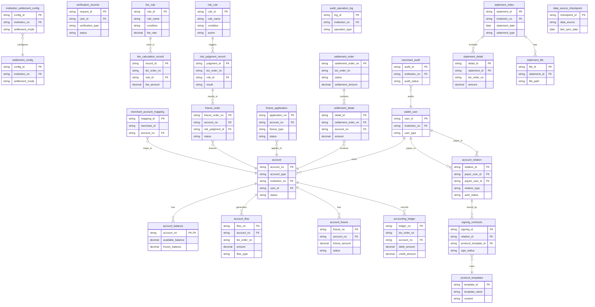

## 5.1 ER图

## 5.2 表结构

| 表名 | 所属模块 | 主要字段 | 关系说明 |
| :--- | :--- | :--- | :--- |
| account | 账户系统 | account_no (PK), account_type, institution_no, user_id, status | 账户主表，与 wallet_user 关联，被多个流水/冻结表引用。 |
| account_balance | 账户系统 | account_no (PK, FK), available_balance, frozen_balance | 账户余额表，与 account 一对一关联。 |
| account_flow | 账户系统 | flow_no (PK), account_no (FK), biz_order_no, amount, flow_type | 账户流水表，记录资金变动，与 account 多对一关联。 |
| account_freeze | 账户系统 | freeze_no (PK), account_no (FK), freeze_amount, status | 账户冻结记录表，与 account 多对一关联。 |
| accounting_ledger | 账务核心 | ledger_no (PK), biz_order_no, account_no (FK), debit_amount, credit_amount | 核心账务流水表，记录会计分录，与 account 多对一关联。 |
| wallet_user | 行业钱包 | user_id (PK), institution_no, user_type | 钱包用户表，是账户的拥有者。 |
| account_relation | 行业钱包 | relation_id (PK), payer_user_id (FK), payee_user_id (FK), relation_type, auth_status | 账户关系表，关联两个 wallet_user，用于授权绑定。 |
| settlement_config | 行业钱包 | config_id (PK), institution_no, settlement_mode | 结算配置表，记录商户的结算模式。 |
| fee_rule | 计费中台 | rule_id (PK), rule_name, condition, fee_rate | 计费规则表，存储可配置的费率规则。 |
| fee_calculation_record | 计费中台 | record_id (PK), biz_order_no, rule_id (FK), fee_amount | 计费记录表，记录每次计费请求和结果，与 fee_rule 关联。 |
| verification_records | 认证系统 | request_id (PK), user_id, verification_type, status | 认证记录表，记录打款/人脸验证结果。 |
| signing_contracts | 电子签约平台 | signing_id (PK), relation_id (FK), protocol_template_id (FK), sign_status | 签约记录表，与 account_relation 和 protocol_templates 关联。 |
| protocol_templates | 电子签约平台 | template_id (PK), template_name, content | 协议模板表，存储签约协议模板。 |
| settlement_order | 清结算 | settlement_order_no (PK), biz_order_no, status, settlement_amount | 结算订单表，记录结算批次。 |
| settlement_detail | 清结算 | detail_id (PK), settlement_order_no (FK), account_no (FK), amount | 结算明细表，记录每笔结算涉及的账户和金额，与 settlement_order 和 account 关联。 |
| freeze_application | 清结算 | application_no (PK), account_no (FK), freeze_type, status | 冻结申请记录表，与 account 关联。 |
| risk_rule | 风控 | rule_id (PK), rule_name, condition, action | 风险规则表，存储风险判定规则。 |
| risk_judgment_record | 风控 | judgment_id (PK), biz_order_no, rule_id (FK), result | 风险判定记录表，记录每次判定结果，与 risk_rule 关联。 |
| freeze_order | 风控 | freeze_order_no (PK), account_no (FK), risk_judgment_id (FK), status | 冻结指令表，记录发起的冻结操作，与 account 和 risk_judgment_record 关联。 |
| merchant_account_mapping | 风控 | mapping_id (PK), merchant_id, account_no (FK) | 商户-账户映射表，关联外部商户ID与内部账户，与 account 关联。 |
| merchant_audit | 三代 | audit_id (PK), institution_no, audit_status | 商户审核表，记录开户申请审核状态。 |
| institution_settlement_config | 三代 | config_id (PK), institution_no, settlement_mode | 机构结算配置表，记录商户的结算模式配置。 |
| audit_operation_log | 三代 | log_id (PK), institution_no, operation_type | 审核操作日志表，记录所有业务操作日志。 |
| statement_index | 对账单系统 | statement_id (PK), institution_no, statement_date, statement_type | 对账单索引表，记录对账单元信息。 |
| statement_detail | 对账单系统 | detail_id (PK), statement_id (FK), biz_order_no, amount | 对账单明细表，记录对账单的每笔明细，与 statement_index 关联。 |
| statement_file | 对账单系统 | file_id (PK), statement_id (FK), file_path | 文件存储表，存储对账单文件信息，与 statement_index 关联。 |
| data_source_checkpoint | 对账单系统 | checkpoint_id (PK), data_source, last_sync_date | 数据源检查点表，记录各数据源同步进度。 |