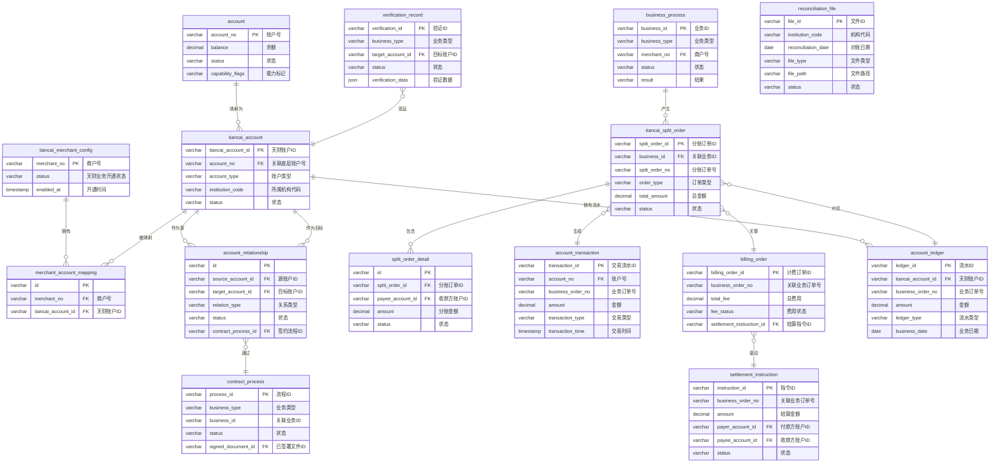

# 5. 数据库设计

## 5.1 ER图

## 5.2 表结构

### 5.2.1 账户与商户核心表

| 表名 | 所属模块 | 主要字段说明 | 与其他表的关系 |
| :--- | :--- | :--- | :--- |
| **account** | 账户系统 | `account_no` (PK): 账户号，唯一标识一个底层资金账户。 `balance`: 当前账户余额。 `status`: 账户状态（如：ACTIVE, FROZEN, CLOSED）。 `capability_flags`: 账户能力标记（如：可收款、可付款、可分账）。 | 1. 被 `tiancai_account` 表通过 `account_no` 关联。 |
| **tiancai_account** | 账户系统 | `tiancai_account_id` (PK): 天财业务专用账户ID。 `account_no` (FK): 关联的底层标准账户号。 `account_type`: 账户类型（如：总部、门店、会员）。 `institution_code`: 所属天财机构代码。 `status`: 天财账户状态。 | 1. 外键 `account_no` 关联 `account` 表。 2. 被 `merchant_account_mapping`、`account_relationship`、`account_ledger` 等多表关联。 |
| **tiancai_merchant_config** | 三代系统 | `merchant_no` (PK): 收单商户号。 `status`: 该商户的天财分账业务开通状态。 `enabled_at`: 业务开通时间。 | 1. 被 `merchant_account_mapping` 表通过 `merchant_no` 关联。 |
| **merchant_account_mapping** | 业务核心/三代系统 | `id` (PK): 主键。 `merchant_no` (FK): 商户号。 `tiancai_account_id` (FK): 天财账户ID。 | 1. 外键 `merchant_no` 关联 `tiancai_merchant_config` 表。 2. 外键 `tiancai_account_id` 关联 `tiancai_account` 表。 |

### 5.2.2 关系绑定与认证表

| 表名 | 所属模块 | 主要字段说明 | 与其他表的关系 |
| :--- | :--- | :--- | :--- |
| **account_relationship** | 账户系统/行业钱包系统 | `id` (PK): 主键。 `source_account_id` (FK): 源天财账户ID（如：门店）。 `target_account_id` (FK): 目标天财账户ID（如：总部）。 `relation_type`: 关系类型（如：归集授权）。 `status`: 绑定状态。 `contract_process_id` (FK): 关联的电子签约流程ID。 | 1. 外键 `source_account_id` 和 `target_account_id` 均关联 `tiancai_account` 表。 2. 外键 `contract_process_id` 关联 `contract_process` 表。 |
| **verification_record** | 认证系统 | `verification_id` (PK): 验证记录唯一ID。 `business_type`: 验证业务类型（打款、人脸等）。 `target_account_id` (FK): 被验证的天财账户ID。 `status`: 验证状态。 `verification_data`: 验证过程数据（JSON格式）。 | 1. 外键 `target_account_id` 关联 `tiancai_account` 表。 |
| **contract_process** | 电子签约平台 | `process_id` (PK): 签约流程ID。 `business_type`: 关联业务类型（如：账户绑定）。 `business_id`: 关联的业务ID（如：`account_relationship.id`）。 `status`: 签约流程状态。 `signed_document_id`: 已签署的文件ID。 | 1. 被 `account_relationship` 表通过 `contract_process_id` 关联。 |

### 5.2.3 业务流程与订单表

| 表名 | 所属模块 | 主要字段说明 | 与其他表的关系 |
| :--- | :--- | :--- | :--- |
| **business_process** | 业务核心 | `business_id` (PK): 业务流程唯一ID。 `business_type`: 业务类型（开通、绑定、分账）。 `merchant_no` (FK): 发起业务的商户号。 `status`: 业务流程状态。 `result`: 最终处理结果。 | 1. 外键 `merchant_no` 关联 `tiancai_merchant_config` 表。 2. 被 `tiancai_split_order` 表通过 `business_id` 关联。 |
| **tiancai_split_order** | 三代系统/行业钱包系统/账务核心系统 | `split_order_id` (PK): 分账订单主键ID。 `business_id` (FK): 关联的业务流程ID。 `split_order_no`: 分账订单号，用于外部展示和关联。 `order_type`: 订单类型（归集、批量付款、会员结算）。 `total_amount`: 分账总金额。 `status`: 订单状态。 | 1. 外键 `business_id` 关联 `business_process` 表。 2. 被 `split_order_detail`、`account_transaction`、`account_ledger` 等表关联。 |
| **split_order_detail** | 行业钱包系统 | `id` (PK): 主键。 `split_order_id` (FK): 所属分账订单ID。 `payee_account_id` (FK): 收款方天财账户ID。 `amount`: 分给该收款方的金额。 `status`: 该笔分账明细的状态。 | 1. 外键 `split_order_id` 关联 `tiancai_split_order` 表。 2. 外键 `payee_account_id` 关联 `tiancai_account` 表。 |

### 5.2.4 账务、计费与结算表

| 表名 | 所属模块 | 主要字段说明 | 与其他表的关系 |
| :--- | :--- | :--- | :--- |
| **account_transaction** | 账务核心系统 | `transaction_id` (PK): 交易流水ID。 `account_no` (FK): 发生交易的底层账户号。 `business_order_no`: 关联的业务订单号（如分账订单号）。 `amount`: 交易金额。 `transaction_type`: 交易类型（支出、收入）。 `transaction_time`: 交易时间。 | 1. 外键 `account_no` 关联 `account` 表。 2. 通过 `business_order_no` 与 `tiancai_split_order.split_order_no` 逻辑关联。 |
| **billing_order** | 计费中台 | `billing_order_id` (PK): 计费订单ID。 `business_order_no`: 关联的业务订单号。 `total_fee`: 计算出的总费用。 `fee_status`: 费用状态（待确认、已冻结、已结算）。 `settlement_instruction_id` (FK): 关联的结算指令ID。 | 1. 通过 `business_order_no` 与业务订单逻辑关联。 2. 外键 `settlement_instruction_id` 关联 `settlement_instruction` 表。 |
| **settlement_instruction** | 计费中台/清结算系统 | `instruction_id` (PK): 结算指令ID。 `business_order_no`: 关联的业务订单号。 `amount`: 需要结算的金额。 `payer_account_id` (FK): 付款方天财账户ID。 `payee_account_id` (FK): 收款方天财账户ID。 `status`: 指令状态。 | 1. 外键 `payer_account_id` 和 `payee_account_id` 关联 `tiancai_account` 表。 2. 被 `billing_order` 表关联。 |

### 5.2.5 对账与文件表

| 表名 | 所属模块 | 主要字段说明 | 与其他表的关系 |
| :--- | :--- | :--- | :--- |
| **account_ledger** | 对账单系统 | `ledger_id` (PK): 账户流水明细ID。 `tiancai_account_id` (FK): 天财账户ID。 `business_order_no`: 引起流水的业务订单号。 `amount`: 流水金额。 `ledger_type`: 流水类型（如：分账收入、结算支出）。 `business_date`: 业务发生日期。 | 1. 外键 `tiancai_account_id` 关联 `tiancai_account` 表。 2. 通过 `business_order_no` 与 `tiancai_split_order` 等业务订单表逻辑关联。 |
| **reconciliation_file** | 对账单系统 | `file_id` (PK): 对账文件ID。 `institution_code`: 所属机构代码。 `reconciliation_date`: 对账日期。 `file_type`: 文件类型（日账单、交易明细等）。 `file_path`: 文件在对象存储中的路径。 `status`: 文件生成状态。 | 1. 通过 `institution_code` 与 `tiancai_account.institution_code` 逻辑关联。 |

### 5.2.6 其他辅助表

*   **`user` (钱包APP/商服平台模块)**: 存储平台用户信息、所属机构及权限。
*   **`frontend_split_order` (钱包APP/商服平台模块)**: 记录前端发起的订单草稿及展示状态，与后端的 `tiancai_split_order` 关联。
*   **`billing_rule` (计费中台)**: 存储计费规则。
*   **`billing_detail` (计费中台)**: 记录计费订单的明细构成。
*   **`tiancai_process_flow` (三代系统)**: 记录异步业务流程的步骤状态。
*   **`settlement_record` (清结算系统)**: 记录结算指令执行后的资金划转结果。
*   **`refund_fund_adjustment` (清结算系统)**: 记录退货资金调拨明细。
*   **`contract_document` (电子签约平台)**: 存储已签署的协议文件。
*   **`daily_summary` (对账单系统)**: 存储业务的日终汇总数据。