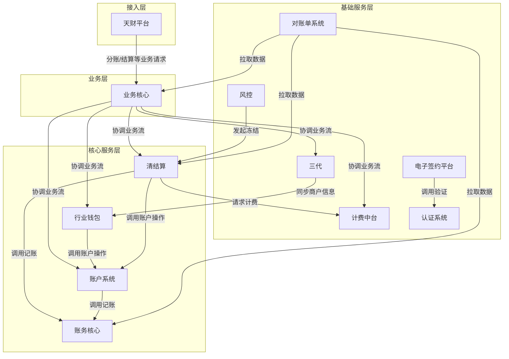
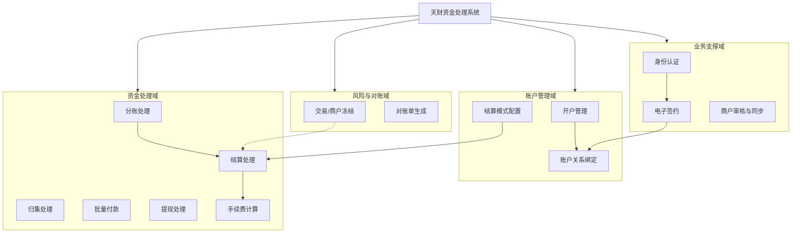
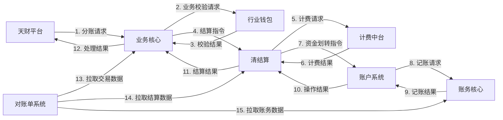
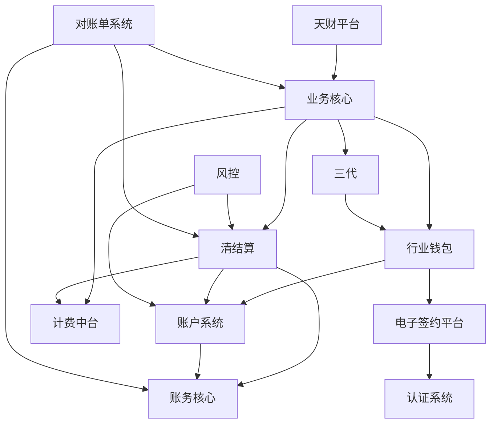

## 2.1 系统结构
本系统采用分层架构，旨在为"天财"业务平台提供分账、会员结算、批量付款等资金处理能力。整体架构分为接入层、业务层、核心服务层和基础服务层，各层职责清晰，通过API进行松耦合交互。

- **接入层**：接收来自天财平台的业务请求，进行协议转换、路由和初步校验。
- **业务层**：包含"业务核心"模块，作为业务流程的编排中心，负责协调下游服务完成复杂的业务逻辑，如分账、结算、关系绑定等。
- **核心服务层**：包含处理核心领域能力的模块，如"行业钱包"（用户与账户关系）、"清结算"（资金结算与冻结）、"账户系统"（资金操作）、"账务核心"（账务记录）。
- **基础服务层**：提供通用能力支撑，如"计费中台"（手续费计算）、"电子签约平台"（协议签署）、"认证系统"（身份验证）、"风控"（风险控制）、"对账单系统"（对账文件生成）。

系统架构图如下：

## 2.2 功能结构
系统功能围绕"天财"资金业务展开，主要划分为账户管理、资金处理、业务支撑、风险与对账四大功能域。

- **账户管理域**：负责商户与账户的生命周期管理，包括开户、信息同步、关系绑定与授权。
- **资金处理域**：负责核心的资金流转操作，包括分账、结算、归集、批量付款、提现及相关的计费处理。
- **业务支撑域**：为业务流程提供必要的通用服务，包括身份认证、电子签约、商户审核与配置。
- **风险与对账域**：负责系统风险控制及事后的账务核对，包括交易/商户冻结、对账单生成。

功能结构图如下：

## 2.3 网络拓扑图
TBD

## 2.4 数据流转
系统内关键业务数据（如交易请求、账户指令、账务记录）在模块间按特定顺序流转，以完成一个完整的业务闭环。以"分账"业务为例，数据流转主要经过业务受理、业务校验、资金结算、账务记录四个阶段。

1.  **业务受理**：天财平台发起请求至业务核心。
2.  **业务校验**：业务核心调用行业钱包进行业务规则校验。
3.  **资金结算**：业务核心或行业钱包驱动清结算流程，清结算协调计费中台计算手续费，并调用账户系统完成资金划转。
4.  **账务记录**：账户系统调用账务核心记录资金变动分录。最终，对账单系统从各数据源拉取数据生成对账文件。

数据流图如下：

## 2.5 系统模块交互关系
各系统模块通过API调用、事件通知等方式进行协作，形成清晰的依赖关系。业务核心作为主要协调者，行业钱包、清结算、账户系统作为核心领域服务，其他模块提供专项能力支撑。

关键交互关系包括：
- **业务核心**：作为总协调者，依赖行业钱包、清结算、计费中台、账户系统、三代等完成业务流程。
- **行业钱包**：依赖账户系统进行开户，依赖电子签约平台完成关系绑定。
- **清结算**：依赖计费中台计算费用，依赖账户系统操作资金，依赖账务核心完成记账。
- **账户系统**：是资金操作的执行者，最终依赖账务核心记录所有变动。
- **风控**：依赖清结算和账户系统执行冻结操作。
- **对账单系统**：依赖业务核心、清结算、账务核心提供数据源。

模块交互图如下：

