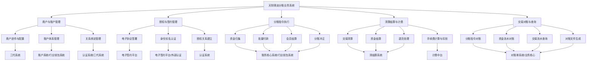
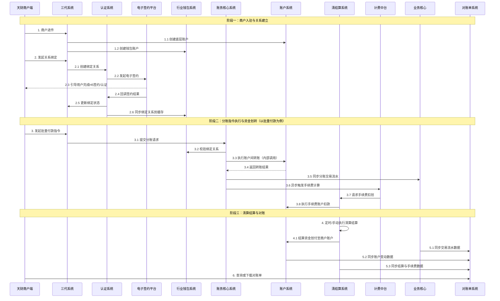
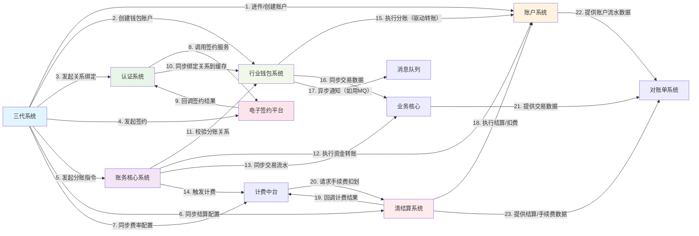

# 天财商龙分账业务系统设计文档

## 2.1 系统结构

本系统采用分层、模块化的微服务架构，旨在为“天财商龙”业务提供合规、高效、可追溯的分账解决方案。整体架构遵循业务边界清晰、职责单一的原则，通过服务间API调用和异步消息机制进行协作。

```mermaid
graph TB
    subgraph “外部系统/渠道”
        TC[天财商龙商户端]
        H5[H5签约页面]
        ExtAuth[外部认证服务]
        MQ[消息队列]
        SMS[短信平台]
        Storage[文件存储]
    end

    subgraph “业务接入与流程编排层”
        TDS[三代系统]
    end

    subgraph “核心业务处理层”
        WBS[行业钱包系统]
        ACS[账务核心系统]
        AuthS[认证系统]
        ESP[电子签约平台]
    end

    subgraph “基础服务与支撑层”
        AS[账户系统]
        CSS[清结算系统]
        FCS[计费中台]
        BCS[业务核心]
    end

    subgraph “数据聚合与呈现层”
        SS[对账单系统]
    end

    TC --> TDS
    H5 --> ESP
    TDS --> WBS
    TDS --> AuthS
    TDS --> ESP
    WBS --> ACS
    AuthS --> ESP
    WBS --> AS
    WBS --> CSS
    WBS --> BCS
    WBS --> MQ
    ACS --> AS
    ACS --> CSS
    ACS --> FCS
    CSS --> AS
    CSS --> FCS
    FCS --> AS
    BCS --> AS
    ESP --> ExtAuth
    ESP --> SMS
    ESP --> Storage
    SS --> BCS
    SS --> AS
    SS --> CSS
```

**架构说明**：
1.  **业务接入与流程编排层（三代系统）**：作为面向“天财商龙”商户的统一业务入口，负责商户进件、业务关系绑定、分账指令（归集、付款、结算）的发起与全流程状态管理。
2.  **核心业务处理层**：
    *   **行业钱包系统**：资金处理与业务逻辑中枢，负责校验分账关系、执行分账指令、驱动底层资金划转。
    *   **账务核心系统**：分账业务的核心处理引擎，处理复杂的业务逻辑（如批量分账、冲正）并调用底层服务完成资金处理。
    *   **认证系统**：负责建立并管理付方（总部）与收方（门店/会员）之间合法、可信的授权关系，是分账业务的法律与风控基础。
    *   **电子签约平台**：提供电子协议签署、身份认证及证据链留存服务，为授权关系提供法律保障。
3.  **基础服务与支撑层**：
    *   **账户系统**：系统的资金基石，提供底层账户的全生命周期管理、状态控制及原子化的资金记账服务。
    *   **清结算系统**：资金处理中枢，负责交易资金的清算、结算、计费及退货处理。
    *   **计费中台**：专门负责分账交易手续费的精确计算与策略管理。
    *   **业务核心**：支付系统的核心交易流水记录中心，接收并持久化所有标准化的分账交易数据，为对账、查询提供统一视图。
4.  **数据聚合与呈现层（对账单系统）**：聚合各业务模块数据，生成统一、清晰的对账单和资金流水明细，服务于运营与财务。
5.  **外部依赖**：包括外部认证、短信、文件存储等服务，以及作为异步通信枢纽的消息队列。

## 2.2 功能结构

系统功能围绕分账业务的全生命周期进行组织，涵盖从商户入驻、关系建立、资金操作到对账清算的完整闭环。



**功能模块说明**：
*   **商户与账户管理**：完成商户入驻、配置其结算模式，并为其开立底层资金账户和业务层钱包账户，管理付方与收方的绑定关系。
*   **授权与签约管理**：通过电子签约、身份认证（打款/人脸/短信）等合规手段，建立具有法律效力的分账授权关系。
*   **分账指令执行**：支持资金从收方归集至付方、从付方向多收方批量付款、以及针对会员的结算等多种分账场景，并提供冲正能力。
*   **清算结算与计费**：对分账交易进行资金清算，按配置完成资金结算到商户账户，并准确计算、扣划交易产生的手续费，处理退货场景。
*   **交易对账与查询**：聚合各模块数据，提供多维度的业务对账（指令流）、资金对账（资金流）能力，并生成标准对账文件。

## 2.3 网络拓扑图

系统部署在私有云或金融云环境内，采用分区隔离策略，确保业务安全与合规。

```mermaid
graph TB
    subgraph “互联网区 (DMZ)”
        LB[负载均衡集群]
        H5_GW[H5签约网关]
        API_GW[API网关集群]
    end

    subgraph “核心业务区”
        subgraph “应用集群”
            APP_TDS[三代系统]
            APP_WBS[行业钱包系统]
            APP_ACS[账务核心系统]
            APP_AuthS[认证系统]
            APP_ESP[电子签约平台]
            APP_SS[对账单系统]
        end
        subgraph “数据存储集群”
            DB[(主数据库集群)]
            Redis_Cache[Redis缓存集群]
            MQ_Cluster[消息队列集群]
        end
        subgraph “基础服务集群”
            APP_AS[账户系统]
            APP_CSS[清结算系统]
            APP_FCS[计费中台]
            APP_BCS[业务核心]
        end
    end

    subgraph “外部服务区”
        Ext_SMS[短信服务]
        Ext_Auth[外部认证服务]
        Ext_Storage[文件存储服务]
    end

    Internet --> LB
    LB --> H5_GW
    LB --> API_GW
    H5_GW --> APP_ESP
    API_GW --> APP_TDS
    API_GW --> APP_SS
    
    APP_TDS --> APP_WBS
    APP_TDS --> APP_AuthS
    APP_TDS --> APP_ESP
    APP_WBS --> APP_ACS
    APP_WBS --> APP_AS
    APP_WBS --> APP_CSS
    APP_WBS --> APP_BCS
    APP_WBS --> MQ_Cluster
    APP_ACS --> APP_AS
    APP_ACS --> APP_CSS
    APP_ACS --> APP_FCS
    APP_AuthS --> APP_ESP
    APP_CSS --> APP_AS
    APP_CSS --> APP_FCS
    APP_FCS --> APP_AS
    APP_BCS --> APP_AS
    APP_SS --> APP_BCS
    APP_SS --> APP_AS
    APP_SS --> APP_CSS

    APP_ESP --> Ext_SMS
    APP_ESP --> Ext_Auth
    APP_ESP --> Ext_Storage

    APP_AS & APP_CSS & APP_FCS & APP_BCS & APP_WBS & APP_ACS & APP_AuthS & APP_ESP & APP_TDS & APP_SS --> DB
    APP_AS & APP_CSS & APP_FCS & APP_BCS & APP_WBS & APP_ACS & APP_AuthS & APP_ESP & APP_TDS & APP_SS --> Redis_Cache
```

**部署说明**：
1.  **互联网区**：部署负载均衡、API网关和H5网关，作为系统对外统一入口，负责路由、限流、鉴权等。
2.  **核心业务区**：
    *   **应用集群**：所有业务微服务以集群方式部署，实现高可用和水平扩展。
    *   **数据存储集群**：核心业务数据使用高可用数据库集群；高频访问数据（如关系缓存）使用Redis集群；模块间异步解耦通过消息队列实现。
    *   **基础服务集群**：账户、清结算等底层服务独立部署，为上层业务提供稳定支撑。
3.  **外部服务区**：通过专线或安全网关与第三方服务（短信、认证、存储）通信，满足业务需求。
4.  **安全隔离**：各区域间通过防火墙进行严格隔离，仅开放必要的服务端口，确保网络安全。

## 2.4 数据流转

数据流转贯穿分账业务的全过程，主要分为业务指令流和资金流两条主线。



**数据流关键路径说明**：
1.  **业务指令流**：`商户端 -> 三代系统 -> (认证系统/电子签约平台) -> 账务核心系统 -> 行业钱包系统 -> 业务核心`。此路径承载业务请求的发起、校验、处理与最终状态落地。
2.  **资金流**：`账务核心系统/清结算系统 -> 账户系统`。所有资金变动（分账转账、手续费扣划、结算出款）最终都通过调用账户系统的原子化接口完成，确保资金账务的一致性。
3.  **数据聚合流**：`业务核心 + 账户系统 + 清结算系统 -> 对账单系统`。各核心模块将标准化后的业务、资金、结算数据提供给对账单系统，生成统一视图。

## 2.5 系统模块交互关系

各模块通过同步API调用和异步消息机制紧密协作，共同完成分账业务。下图概括了核心的调用依赖关系。



**核心交互关系说明**：
1.  **三代系统作为总入口**：几乎与所有其他核心业务模块交互，负责启动业务流程。
2.  **账户系统作为资金底座**：被**行业钱包系统**、**账务核心系统**、**清结算系统**、**计费中台**直接调用，是所有资金变动的最终执行者。
3.  **行业钱包系统与账务核心系统的协作**：两者都处理分账，但侧重点不同。**账务核心**侧重复杂业务逻辑处理（批量、冲正），而**行业钱包**侧重关系校验和驱动底层账户操作。两者都可能调用账户系统。
4.  **认证与签约的闭环**：**认证系统**依赖**电子签约平台**完成法律授权过程，签约结果回调至认证系统，形成闭环。
5.  **清结算与计费的协作**：**计费中台**负责计算手续费，但实际资金扣划请求发往**清结算系统**，由后者调用账户系统执行，体现了职责分离。
6.  **数据汇聚到对账与业务核心**：**业务核心**接收来自**行业钱包系统**的交易流水，成为权威数据源。**对账单系统**则从**业务核心**、**账户系统**、**清结算系统**拉取数据，完成对账聚合。