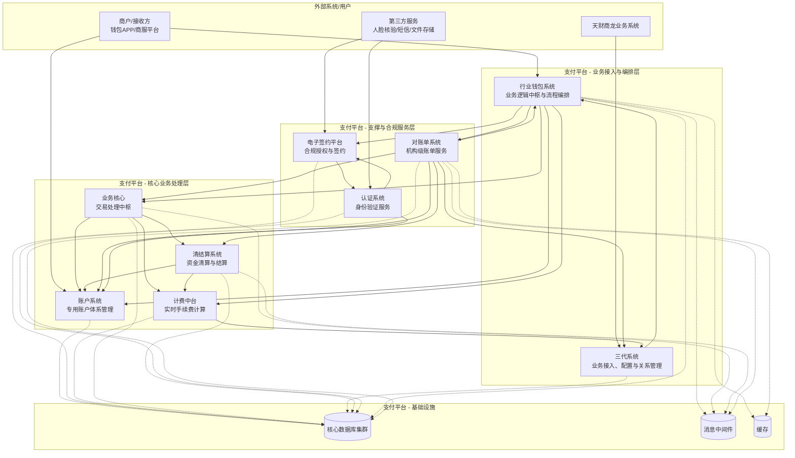
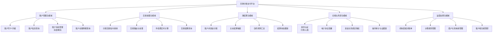
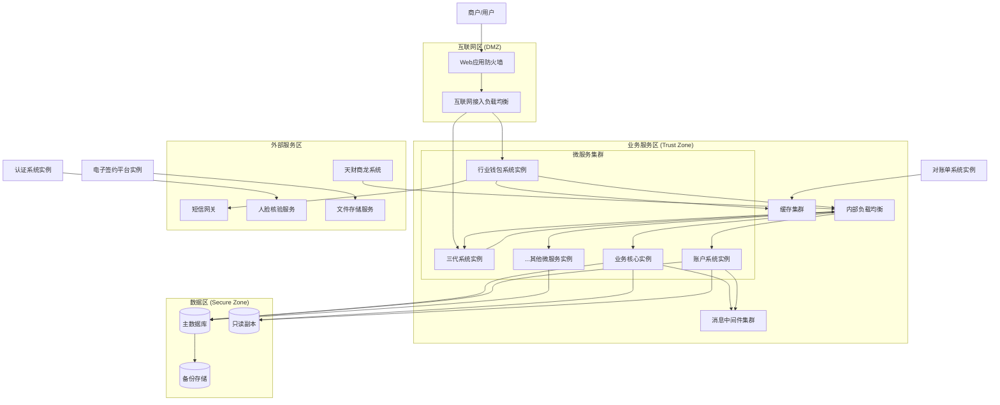
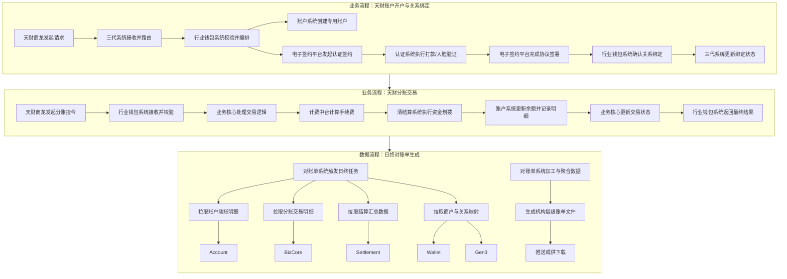
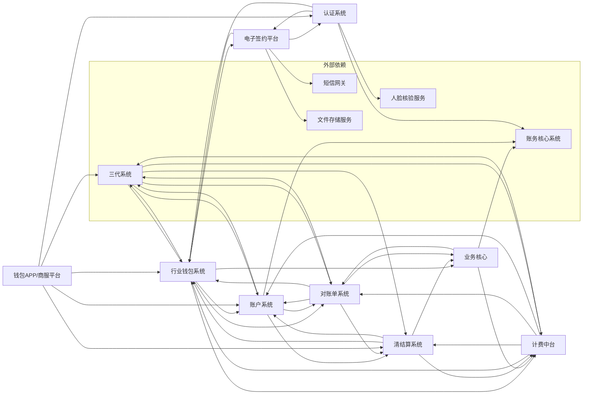

# 天财分账支付平台系统级设计文档

## 2.1 系统结构

本系统采用分层、模块化的微服务架构，旨在为“天财商龙”业务场景提供安全、合规、高效的账户管理与资金分账服务。整体架构遵循“高内聚、低耦合”原则，通过清晰的职责边界和标准化的API接口进行协作。

### 系统架构图 (C4 Container Diagram)

**架构说明**:
1.  **业务接入与编排层**: 作为对外业务入口，`三代系统`负责与外部“天财商龙”业务系统对接，进行业务路由和配置管理；`行业钱包系统`作为内部流程编排中枢，协调各下游服务完成业务闭环。
2.  **核心业务处理层**: 包含交易处理(`业务核心`)、账户管理(`账户系统`)、资金划转(`清结算系统`)和费用计算(`计费中台`)等核心支付能力，是系统的心脏。
3.  **支撑与合规服务层**: 提供身份认证(`认证系统`)、电子签约(`电子签约平台`)、账单服务(`对账单系统`)等支撑性、合规性功能，保障业务安全、合规、可审计。
4.  **基础设施**: 统一的数据库、消息队列和缓存服务，为各微服务提供数据持久化、异步解耦和性能加速能力。

## 2.2 功能结构

系统功能围绕“天财专用账户”的生命周期和“天财分账”交易流程进行组织，主要分为五大功能域。

### 功能结构图

**功能域说明**:
- **账户管理功能域**: 由`账户系统`和`三代系统`共同实现，负责天财专用账户的创建、维护、查询和资金明细展示。
- **交易处理功能域**: 以`业务核心`和`行业钱包系统`为核心，完成从天财发起的资金分账交易的全流程处理。
- **清结算功能域**: 由`清结算系统`主导，处理账户间的实时分账、商户资金的主动结算以及日终清算。
- **合规与风控功能域**: 由`认证系统`和`电子签约平台`支撑，确保业务参与方身份真实、授权有效，并留存完整合规证据。
- **运营支撑功能域**: 包括`对账单系统`的账单服务、`计费中台`的规则管理、`三代系统`的关系管理以及`钱包APP`的商户端功能管控。

## 2.3 网络拓扑图

系统部署在私有云或金融云环境，采用分区隔离、多层防护的网络架构，确保安全与合规。

**网络拓扑说明**:
1.  **分区隔离**: 严格划分互联网区(DMZ)、业务服务区、数据区和外部服务区，通过防火墙策略控制访问。
2.  **入口防护**: 互联网流量通过WAF和负载均衡进入，仅暴露`行业钱包系统`(面向商户APP)和`三代系统`(面向天财商龙)的接口。
3.  **内部通信**: 微服务间通过内部负载均衡和私有域名进行RPC调用，关键异步通信通过消息中间件解耦。
4.  **数据访问**: 业务服务区通过专线或安全网关访问数据区的主备数据库。写操作指向主库，部分读操作可分流至只读副本。
5.  **外部集成**: 与第三方服务（短信、人脸、文件存储）的通信通过指定的出口网关进行，并配置相应的IP白名单和流量监控。

## 2.4 数据流转

系统数据流转主要围绕“账户开户”、“关系绑定”、“分账交易”和“账单生成”四个核心业务流程。

### 核心业务流程数据流图

**数据流转关键点**:
1.  **开户与绑定**: 数据从外部业务系统流入，经过多系统校验、账户创建、合规认证，最终形成账户和绑定关系数据，存储于`账户系统`、`行业钱包系统`和`三代系统`的相关表中。
2.  **分账交易**: 交易指令触发资金和状态的连环变更。`业务核心`记录交易主流程，`清结算系统`记录资金划拨订单，`账户系统`记录最底层的余额和明细变动，`计费中台`记录费用流水。各模块通过事务消息确保最终一致性。
3.  **账单生成**: `对账单系统`作为数据消费者，在日终或定时从多个上游系统（`账户系统`、`业务核心`、`清结算系统`等）拉取加工后的明细数据，进行聚合后生成面向天财机构的统一视图账单。上游系统需保证数据的准确性和及时推送。

## 2.5 系统模块交互关系

以下模块交互图详细描述了各微服务在关键场景下的调用依赖关系。

### 模块交互依赖图

**核心交互关系分析**:

1.  **中枢协调者 - 行业钱包系统**: 是业务流程的主要驱动者，依赖最多下游系统（账户、签约、业务核心、计费），是连接业务入口（三代）与内部核心服务的枢纽。
2.  **核心服务三角 - 业务核心、清结算、账户系统**: 构成资金处理的核心闭环。`业务核心`驱动交易，`清结算`执行资金操作，`账户系统`记录资金变动，三者联系紧密。
3.  **配置与数据源 - 三代系统**: 作为业务规则的源头（如计费规则、商户关系），被`计费中台`、`行业钱包`、`对账单系统`等多个模块依赖。
4.  **合规双支柱 - 认证系统 & 电子签约平台**: 两者相互调用，共同完成用户身份核实与法律授权，为`行业钱包系统`发起的绑定、付款等关键操作提供安全保障。
5.  **数据消费端 - 对账单系统**: 是主要的数据集成和输出端，依赖几乎所有产生资金和交易数据的核心模块，以提供统一的账单视图。
6.  **客户端 - 钱包APP/商服平台**: 面向最终用户，其功能实现依赖于后端的账户、交易、关系管理等核心服务。

此设计确保了职责清晰，同时通过`行业钱包系统`的有效编排和标准化API，降低了模块间的网状耦合度。