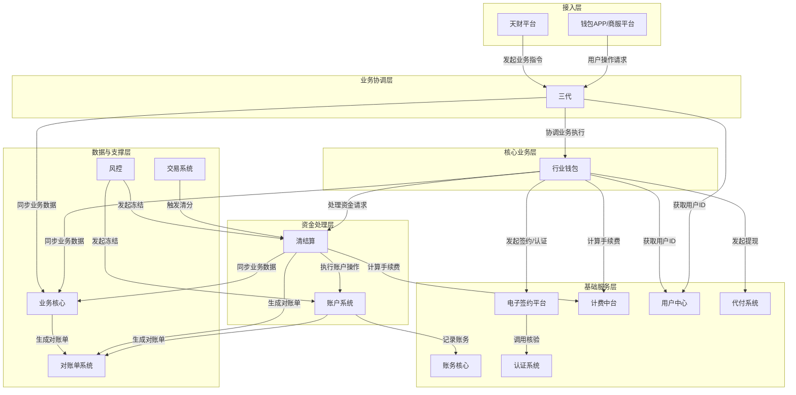
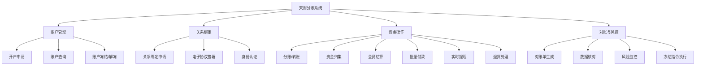
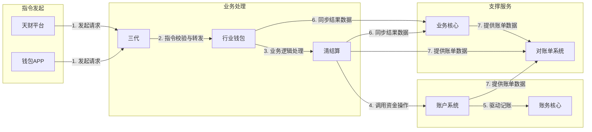
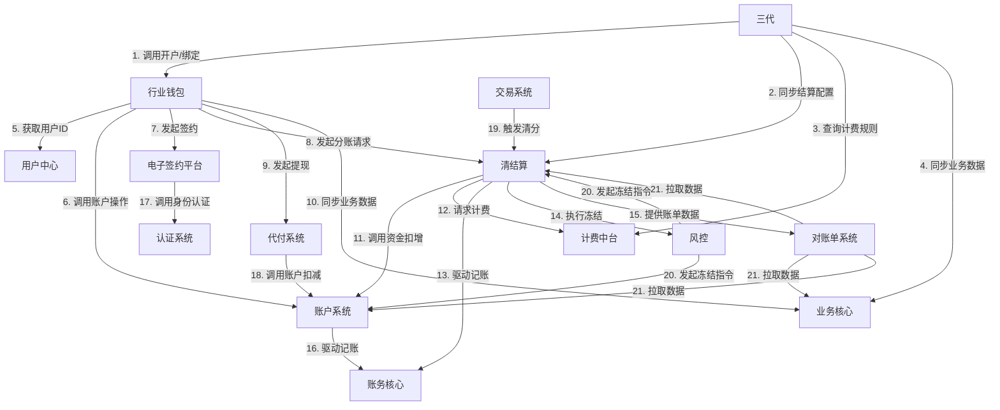

## 2.1 系统结构
系统采用分层架构与领域驱动设计相结合的模式，以“三代”作为业务指令的统一入口和协调层，以“行业钱包”作为核心业务逻辑层，以“清结算”和“账户系统”作为资金处理与账户操作层，以“账务核心”作为最终的账务记录层。各系统角色通过清晰的接口契约进行交互，确保业务、资金、账务的解耦与职责分离。

## 2.2 功能结构
系统功能围绕“账户管理”、“关系绑定”、“资金操作”、“对账与风控”四大核心领域展开。每个领域由相应的模块提供服务，共同支撑分账、归集、会员结算、批量付款等核心业务场景。

## 2.3 网络拓扑图
TBD

## 2.4 数据流转
数据流转以“业务指令”和“资金流”为主线。业务指令由天财或前端发起，经三代协调，在行业钱包进行业务逻辑处理，最终由清结算驱动账户系统完成资金变动，并由账务核心记录。关键业务数据同步至业务核心，用于对账和查询。

## 2.5 系统模块交互关系
模块间主要通过同步API调用和异步事件进行交互。三代作为总协调者，依赖多个下游系统完成业务；行业钱包是核心业务枢纽；清结算和账户系统构成资金处理链路；电子签约、认证、计费等作为能力中台被上层业务调用。

