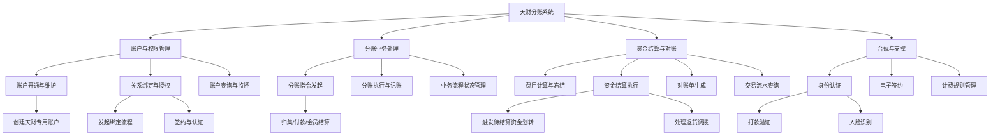
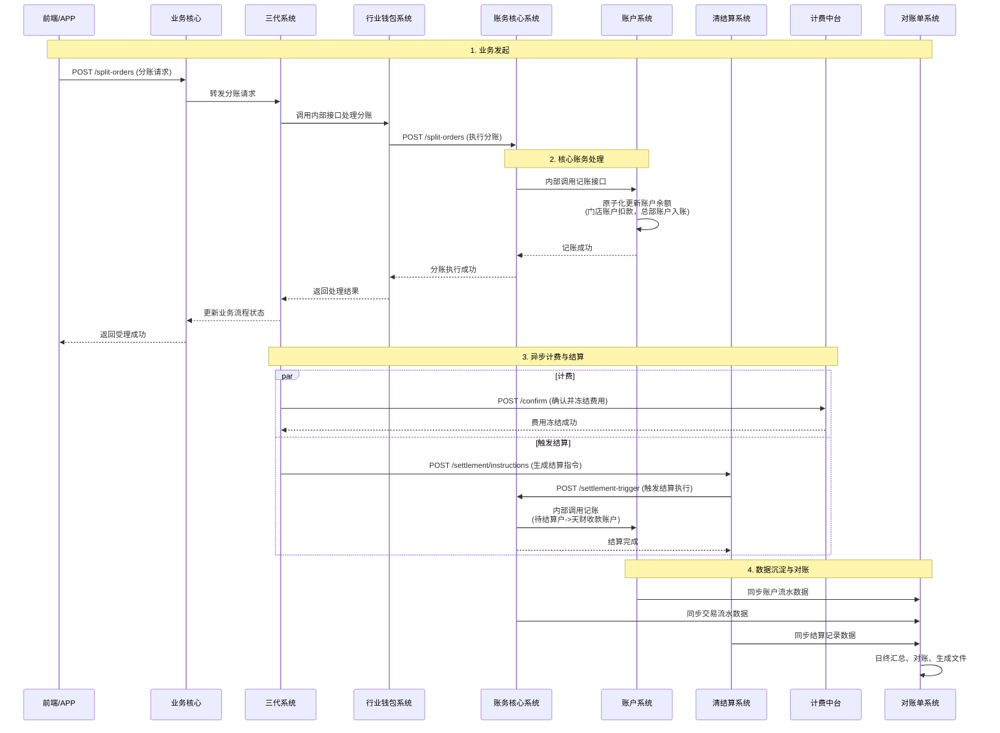

好的，作为资深的软件架构师，我将基于您提供的模块摘要信息，为您生成一份系统级设计文档。

# 天财分账系统 - 系统级设计文档

## 2.1 系统结构

天财分账系统采用分层、模块化的微服务架构设计，以业务核心为编排中枢，以账户系统和账务核心为资金处理基石，通过清晰的职责边界和标准化的接口，协同完成商户开通、账户绑定、分账执行、资金结算等全流程业务。系统整体遵循“前-中-后台”的架构思想，确保业务敏捷性、资金安全性与系统稳定性。

```mermaid
graph TB
    subgraph “用户交互层 (前端)”
        APP[钱包APP/商服平台模块]
    end

    subgraph “业务服务层 (中台)”
        subgraph “业务编排与流程”
            BIZ[业务核心]
            GEN3[三代系统]
        end
        subgraph “核心业务处理”
            WALLET[行业钱包系统]
            BILLING[计费中台]
        end
        subgraph “支撑服务”
            AUTH[认证系统]
            E_SIGN[电子签约平台]
        end
    end

    subgraph “基础服务层 (后台)”
        subgraph “资金与账户核心”
            ACCT[账户系统]
            LEDGER[账务核心系统]
        end
        subgraph “清结算与数据”
            SETTLE[清结算系统]
            RECON[对账单系统]
        end
    end

    subgraph “外部依赖系统”
        EXT_PAY[支付核心/三代系统]
        EXT_MSG[消息队列]
        EXT_FILE[文件存储]
        EXT_SMS[短信网关]
    end

    APP --> BIZ & GEN3
    BIZ --> GEN3 & WALLET & ACCT & E_SIGN
    GEN3 --> WALLET & ACCT & E_SIGN & LEDGER
    WALLET --> ACCT & GEN3 & E_SIGN & RECON
    BILLING --> ACCT & SETTLE & RECON
    AUTH --> SETTLE & E_SIGN
    LEDGER --> WALLET & SETTLE & ACCT
    SETTLE --> EXT_PAY & ACCT & RECON
    RECON --> ACCT & SETTLE & WALLET & EXT_FILE
    E_SIGN --> AUTH & EXT_SMS & EXT_FILE
    GEN3 -.-> EXT_MSG
    WALLET -.-> EXT_MSG
```

**架构说明**:
*   **用户交互层**: 提供统一的前端入口，面向天财机构、总部、门店等不同角色，封装复杂的后端流程。
*   **业务服务层**:
    *   **业务编排 (BIZ, GEN3)**: 负责接收、编排和驱动完整的业务流程，管理异步流程状态，是业务的“总指挥”。
    *   **核心业务处理 (WALLET, BILLING)**: 行业钱包系统是分账指令、账户绑定的具体执行者；计费中台独立负责所有费用计算与结算指令生成。
    *   **支撑服务 (AUTH, E_SIGN)**: 提供身份认证、协议签署等合规性能力，作为可复用的公共服务。
*   **基础服务层**:
    *   **资金与账户核心 (ACCT, LEDGER)**: 系统的基石。账户系统管理账户实体与关系；账务核心系统确保所有资金变动的原子性、一致性和可追溯性。
    *   **清结算与数据 (SETTLE, RECON)**: 清结算系统处理跨账户的资金结算与调拨；对账单系统提供统一的资金视图和对账能力。
*   **通信机制**: 同步调用以RESTful API为主，关键异步状态通知通过消息队列（如Kafka）实现松耦合通信。

## 2.2 功能结构

系统功能围绕“账户生命周期管理”、“分账业务流程”、“资金结算与对账”三大核心领域展开。



**功能模块说明**:
*   **账户与权限管理**: 提供天财专用账户的创建、查询、以及账户间（如总部与门店）授权绑定关系的建立与管理，是分账业务的前置条件。
*   **分账业务处理**: 覆盖从业务发起（通过前端或API）、指令执行（账务处理）、到全流程状态跟踪的核心业务链路。
*   **资金结算与对账**: 包含业务计费、将资金从待结算户结算至收款账户、生成对账文件以及提供明细查询，形成资金闭环。
*   **合规与支撑**: 为业务提供必需的身份核验、法律协议签署及灵活的费用计算能力，保障业务合规性。

## 2.3 网络拓扑图

系统部署在私有云或金融云环境内，采用典型的分区部署策略，确保网络安全与合规。

```mermaid
graph TB
    subgraph “互联网区 (DMZ)”
        FW1[防火墙]
        LB[负载均衡器]
        APP_SVR[Web应用服务器<br/>钱包APP/商服平台后端]
    end

    subgraph “核心生产区”
        FW2[内部防火墙]
        subgraph “微服务集群”
            GEN3_SVC[三代系统]
            BIZ_SVC[业务核心]
            WALLET_SVC[行业钱包系统]
            AUTH_SVC[认证系统]
            E_SIGN_SVC[电子签约平台]
        end
        subgraph “核心服务集群”
            ACCT_SVC[账户系统]
            LEDGER_SVC[账务核心系统]
            BILLING_SVC[计费中台]
            SETTLE_SVC[清结算系统]
        end
        subgraph “数据与中间件集群”
            DB[(主数据库集群)]
            CACHE[缓存集群]
            MQ[消息队列集群]
            ES[(Elasticsearch)]
            OSS[对象存储]
        end
    end

    subgraph “外部服务区”
        EXT_SMS[短信网关]
        EXT_TSA[时间戳服务]
        EXT_BANK[银行/支付通道]
    end

    Internet --> FW1 --> LB --> APP_SVR
    APP_SVR --> FW2 --> GEN3_SVC & BIZ_SVC
    微服务集群 <--> 核心服务集群
    微服务集群 <--> 数据与中间件集群
    核心服务集群 <--> 数据与中间件集群
    AUTH_SVC & E_SIGN_SVC --> EXT_SMS & EXT_TSA
    SETTLE_SVC --> EXT_BANK
    LEDGER_SVC --> EXT_BANK
```

**部署说明**:
*   **分区隔离**: 互联网区与核心生产区通过防火墙严格隔离，仅暴露必要的API网关或前端服务。
*   **集群化部署**: 所有微服务、数据库、中间件均采用集群部署，保证高可用和可扩展性。
*   **外部依赖**: 短信、时间戳、银行通道等外部服务通过专线或VPN在特定区域进行访问，确保通信安全与稳定。

## 2.4 数据流转

以“**门店营业收入分账至总部**”这一核心场景为例，描述关键数据在系统间的流转过程。



**数据流关键点**:
1.  **请求驱动**: 业务请求通过前端发起，经业务编排层路由至核心处理引擎。
2.  **资金变动唯一入口**: 所有涉及账户余额变更的操作，必须通过**账户系统**的原子化记账接口完成，确保数据强一致性。
3.  **异步化处理**: 计费、结算等后续环节与主业务链路解耦，通过异步方式处理，提升主链路性能与用户体验。
4.  **数据归集**: 账户系统、账务核心、清结算系统将各自的资金变动明细同步至**对账单系统**，形成唯一可信的资金数据源，用于对账与查询。

## 2.5 系统模块交互关系

以下模块交互图详细刻画了各微服务之间的静态依赖关系与核心接口调用方向。

```mermaid
graph LR
    subgraph “Key”
        direction LR
        S1[模块A] -->|依赖/调用| S2[模块B]
    end

    APP[钱包APP/商服平台] -->|发起业务/查询| BIZ[业务核心]
    APP -->|直接查询/操作| GEN3[三代系统]
    
    BIZ -->|驱动业务流程| GEN3
    BIZ -->|查询/驱动账户绑定| WALLET[行业钱包系统]
    BIZ -->|查询账户| ACCT[账户系统]
    BIZ -->|创建签约流程| E_SIGN[电子签约平台]
    
    GEN3 -->|处理分账指令| WALLET
    GEN3 -->|创建/查询账户| ACCT
    GEN3 -->|回调通知| E_SIGN
    GEN3 -->|执行分账记账| LEDGER[账务核心系统]
    
    WALLET -->|核心账户操作| ACCT
    WALLET -->|状态回调| GEN3
    WALLET -->|发起签约| E_SIGN
    WALLET -->|提供业务数据| RECON[对账单系统]
    
    LEDGER -->|资金划转执行| WALLET
    LEDGER -->|触发结算| SETTLE[清结算系统]
    LEDGER -->|原子记账| ACCT
    
    SETTLE -->|获取路由信息| GEN3
    SETTLE -->|结算记账| ACCT
    SETTLE -->|提供结算数据| RECON
    
    BILLING[计费中台] -->|计算/冻结费用| ACCT
    BILLING -->|生成结算指令| SETTLE
    BILLING -->|提供费用数据| RECON
    
    AUTH[认证系统] -->|执行打款验证| SETTLE
    AUTH -->|回调认证结果| E_SIGN
    
    E_SIGN -->|调用身份认证| AUTH
    
    RECON -->|获取账户主数据| ACCT
    
    style ACCT stroke:#333,stroke-width:3px
    style LEDGER stroke:#333,stroke-width:3px
```

**交互关系核心解读**:
*   **强依赖核心**：**账户系统 (ACCT)** 和 **账务核心系统 (LEDGER)** 是整个系统的资金数据处理中枢，被绝大多数上层业务模块所依赖。
*   **业务编排链**：**业务核心 (BIZ) -> 三代系统 (GEN3) -> 行业钱包系统 (WALLET)** 构成了主要的业务请求驱动链条。
*   **结算闭环**：**计费中台 (BILLING) -> 清结算系统 (SETTLE) -> 账务核心系统 (LEDGER)** 构成了费用计算与资金结算的闭环。
*   **合规支撑**：**认证系统 (AUTH)** 与 **电子签约平台 (E_SIGN)** 相互协作，为**行业钱包系统 (WALLET)** 和**业务核心 (BIZ)** 提供合规能力。
*   **数据汇聚点**：**对账单系统 (RECON)** 从**账户系统 (ACCT)**、**清结算系统 (SETTLE)**、**行业钱包系统 (WALLET)** 和**计费中台 (BILLING)** 汇聚数据，是系统的“数据总线”终点。

---
**文档说明**：本设计文档基于提供的模块摘要生成，反映了系统的逻辑架构与核心交互。在实际实施中，需进一步定义详细的API契约、数据模型、容错机制与性能指标。