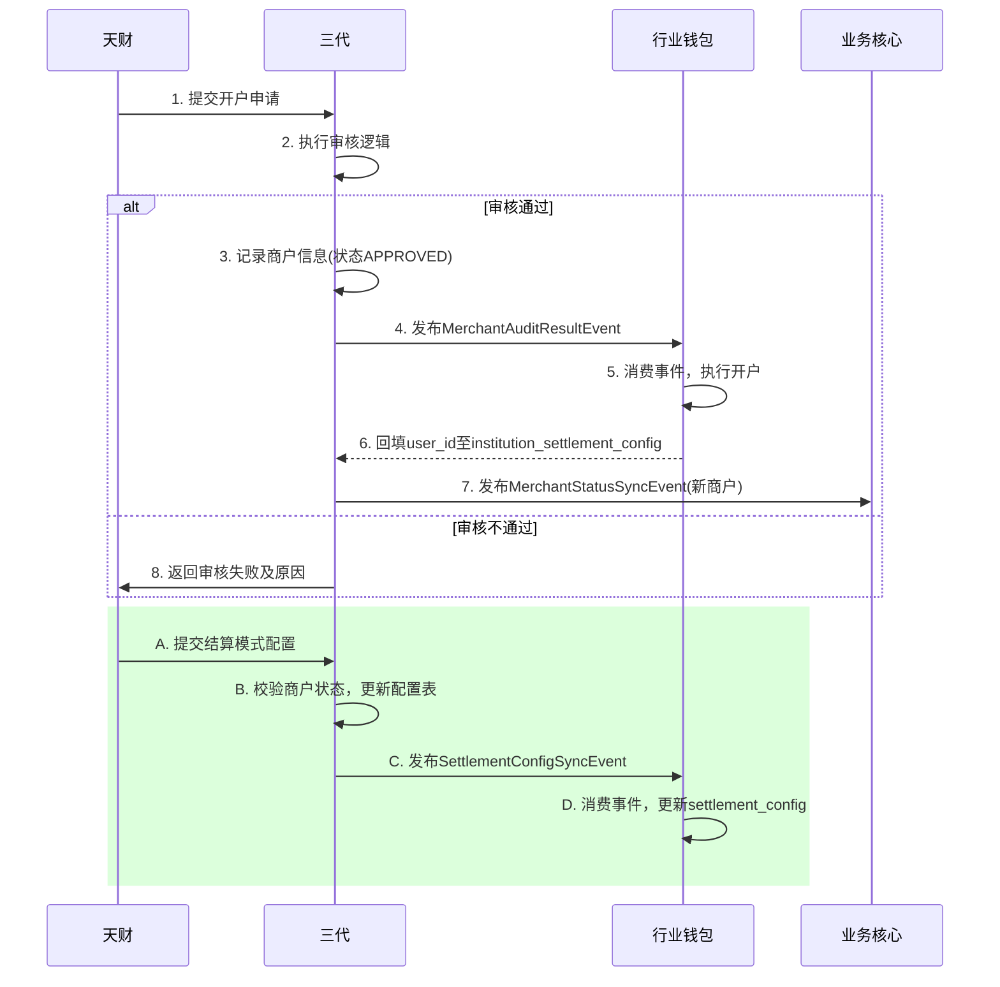

# 模块设计: 三代

生成时间: 2026-01-22 16:17:56
批判迭代: 2

---

# 模块设计: 三代

生成时间: TBD
批判迭代: TBD

---

# 三代模块设计文档

## 1. 概述
- **目的与范围**: 本模块是支付系统中负责商户机构管理与审核的网关。其核心职责是作为业务平台（天财）与内部执行系统（如行业钱包）之间的桥梁，接收并审核来自天财的业务指令（如开户、结算模式配置），并将审核通过的指令同步至下游系统执行。本模块是商户机构信息（如机构号、商户类型、角色）的权威来源，并负责审核决策的记录。其边界在于处理管理指令的审核与分发，不直接执行账户开户、资金操作或关系绑定等具体业务逻辑。

## 2. 接口设计
- **API端点 (REST)**:
    - `POST /api/v1/third-generation/merchants/audit`: 接收并处理开户申请。
    - `PUT /api/v1/third-generation/merchants/{institution_no}/settlement-config`: 接收并处理商户结算模式配置申请。
    - `GET /api/v1/third-generation/merchants/{institution_no}`: 查询商户审核状态与基本信息。
- **请求/响应结构**:
    - 开户申请 (`POST /api/v1/third-generation/merchants/audit`):
        - 请求体: `{"institution_no": "string", "merchant_name": "string", "merchant_type": "ACQUIRING/NON_ACQUIRING", "role": "HEADQUARTERS/STORE", "contact_info": "TBD"}`
        - 响应体: `{"audit_id": "string", "institution_no": "string", "audit_status": "PENDING/APPROVED/REJECTED"}`
    - 结算模式配置 (`PUT /api/v1/third-generation/merchants/{institution_no}/settlement-config`):
        - 请求体: `{"settlement_mode": "ACTIVE/PASSIVE", "settlement_account_info": "TBD", "effective_date": "string"}`
        - 响应体: `{"config_id": "string", "institution_no": "string", "status": "SUCCESS/FAILED"}`
- **发布/消费的事件**:
    - **消费**来自**天财**的开户申请指令、结算模式配置申请指令。
    - **发布** `MerchantAuditResultEvent` (事件内容: `audit_id`, `institution_no`, `merchant_type`, `role`, `audit_result`, `audit_time`)，供**行业钱包**消费以驱动开户流程。
    - **发布** `SettlementConfigSyncEvent` (事件内容: `institution_no`, `user_id`, `settlement_mode`, `settlement_account_info`, `effective_date`)，供**行业钱包**消费以更新结算配置。
    - **发布** `MerchantStatusSyncEvent` (事件内容: `institution_no`, `user_id`, `old_status`, `new_status`, `update_time`)，供**业务核心**等下游系统感知商户状态变化。

## 3. 数据模型
- **表/集合**:
    - `merchant_audit` (商户审核表)
    - `institution_settlement_config` (机构结算配置表)
    - `audit_operation_log` (审核操作日志表)
- **关键字段**:
    - `merchant_audit` 表:
        - `audit_id` (主键): 审核记录唯一标识。
        - `institution_no`: 机构号，由三代运营分配给天财或其下属商户的唯一标识。
        - `merchant_name`: 商户名称。
        - `merchant_type`: 商户类型（ACQUIRING: 收单商户 / NON_ACQUIRING: 非收单商户）。
        - `role`: 角色（HEADQUARTERS: 总部 / STORE: 门店）。
        - `audit_status`: 审核状态（PENDING: 审核中 / APPROVED: 已通过 / REJECTED: 已拒绝）。
        - `audit_comment`: 审核意见。
        - `created_at`: 创建时间。
        - `updated_at`: 更新时间。
    - `institution_settlement_config` 表:
        - `config_id` (主键): 配置ID。
        - `institution_no`: 机构号，外键关联`merchant_audit.institution_no`。
        - `user_id`: 钱包用户ID，开户成功后由行业钱包回填。
        - `settlement_mode`: 结算模式（ACTIVE: 主动结算 / PASSIVE: 被动结算）。
        - `settlement_account_info`: 指定的结算账户信息（JSON格式）。
        - `effective_date`: 生效日期。
        - `config_status`: 配置状态（ACTIVE: 生效 / INACTIVE: 失效）。
        - `created_at`: 创建时间。
        - `updated_at`: 更新时间。
    - `audit_operation_log` 表:
        - `log_id` (主键): 日志ID。
        - `institution_no`: 机构号。
        - `operation_type`: 操作类型（MERCHANT_AUDIT: 商户审核 / SETTLEMENT_CONFIG: 结算配置）。
        - `request_data`: 请求数据（JSON格式）。
        - `response_data`: 响应数据（JSON格式）。
        - `operator`: 操作者（系统或人工）。
        - `created_at`: 操作时间。
- **与其他模块的关系**: 本模块的 `institution_no` 是核心业务标识，与**行业钱包**的 `wallet_user` 表通过 `institution_no` 关联。`user_id` 字段在开户成功后由行业钱包回填，用于关联钱包用户。

## 4. 业务逻辑
- **核心工作流/算法**:
    1.  **开户审核流程**:
        - 接收天财提交的开户申请（包含机构号、商户类型、角色等信息）。
        - 执行审核逻辑（如校验机构号唯一性、信息完整性、资质合规性）。
        - 审核通过后，在 `merchant_audit` 表中记录商户信息，状态置为"APPROVED"。
        - 发布 `MerchantAuditResultEvent`（审核结果为通过），事件中包含机构号、商户类型、角色等信息，供**行业钱包**消费并执行开户。
        - 审核不通过，则更新 `merchant_audit` 表状态为"REJECTED"并记录原因。
        - 所有操作记录日志至 `audit_operation_log`。
    2.  **结算模式配置流程**:
        - 接收天财提交的商户结算模式配置申请。
        - 校验目标商户是否存在且审核状态为"APPROVED"。
        - 更新或插入 `institution_settlement_config` 表中的结算配置，状态为"ACTIVE"。
        - 发布 `SettlementConfigSyncEvent`，事件中包含机构号、结算模式、生效日期等信息，供**行业钱包**消费并更新其 `settlement_config` 表。
        - 记录操作日志。
    3.  **商户状态同步流程**:
        - **触发**: 当商户状态因审核、风控等原因发生变化时（源自身或接收行业钱包/风控通知）。
        - **动作**: 更新 `merchant_audit` 表中的 `audit_status`。
        - **发布**: 发布 `MerchantStatusSyncEvent`，将状态变更（如从"APPROVED"变为"FROZEN"）广播给**业务核心**等需要感知的系统。
- **业务规则与验证**:
    - 开户审核必须确保 `institution_no` 在系统内唯一。
    - 结算模式配置仅可对已审核通过（`audit_status` 为 `APPROVED`）的商户进行操作。
    - 所有来自天财的指令需通过 `APPID` 等机制进行身份鉴权。
- **关键边界情况处理**:
    - **重复开户申请**: 基于 `institution_no` 实现幂等。若已存在审核通过记录，则直接返回成功并忽略；若处于审核中，返回处理中状态。
    - **下游事件发布失败**: 采用消息队列的持久化与重试机制，确保事件至少投递一次。在消费者端（如行业钱包）通过业务唯一键（如 `institution_no` + `operation_type`）实现幂等消费。
    - **配置生效日期冲突**: 新配置的 `effective_date` 晚于当前生效配置时，正常覆盖；若早于，则拒绝或启动配置版本管理流程（TBD）。

## 5. 时序图

## 6. 错误处理
- **预期错误情况**:
    - `ERR_INVALID_PARAM`: 请求参数不合法、不完整。
    - `ERR_DUPLICATE_INSTITUTION_NO`: 开户申请中的机构号已存在。
    - `ERR_MERCHANT_NOT_FOUND`: 配置操作时指定的商户不存在。
    - `ERR_MERCHANT_STATUS_INVALID`: 商户状态非"APPROVED"，无法进行配置。
    - `ERR_AUDIT_LOGIC_FAILED`: 审核流程内部逻辑错误（如规则引擎异常）。
    - `ERR_EVENT_PUBLISH_FAILED`: 事件发布到消息中间件失败。
- **处理策略**:
    - 参数与业务规则校验失败，立即向天财返回明确的错误码和描述。
    - 依赖下游消息队列的发布-订阅能力保证事件可靠投递。针对 `ERR_EVENT_PUBLISH_FAILED`，由消息中间件客户端进行重试，并监控死信队列进行告警。
    - 所有业务操作（无论成功失败）均记录到 `audit_operation_log` 表。
    - 关键接口（开户、配置）通过业务唯一标识（如 `institution_no`）实现幂等，防止重复处理。

## 7. 依赖关系
- **上游模块**:
    - **天财**: 业务平台方，向本模块发起开户、结算模式配置等业务指令。
- **下游模块**:
    - **行业钱包**: 消费本模块发布的 `MerchantAuditResultEvent` 和 `SettlementConfigSyncEvent`，以执行具体的钱包用户创建和结算配置更新。同时，行业钱包会回填 `user_id` 信息。
    - **业务核心**: 消费本模块发布的 `MerchantStatusSyncEvent`，以感知商户状态变化。