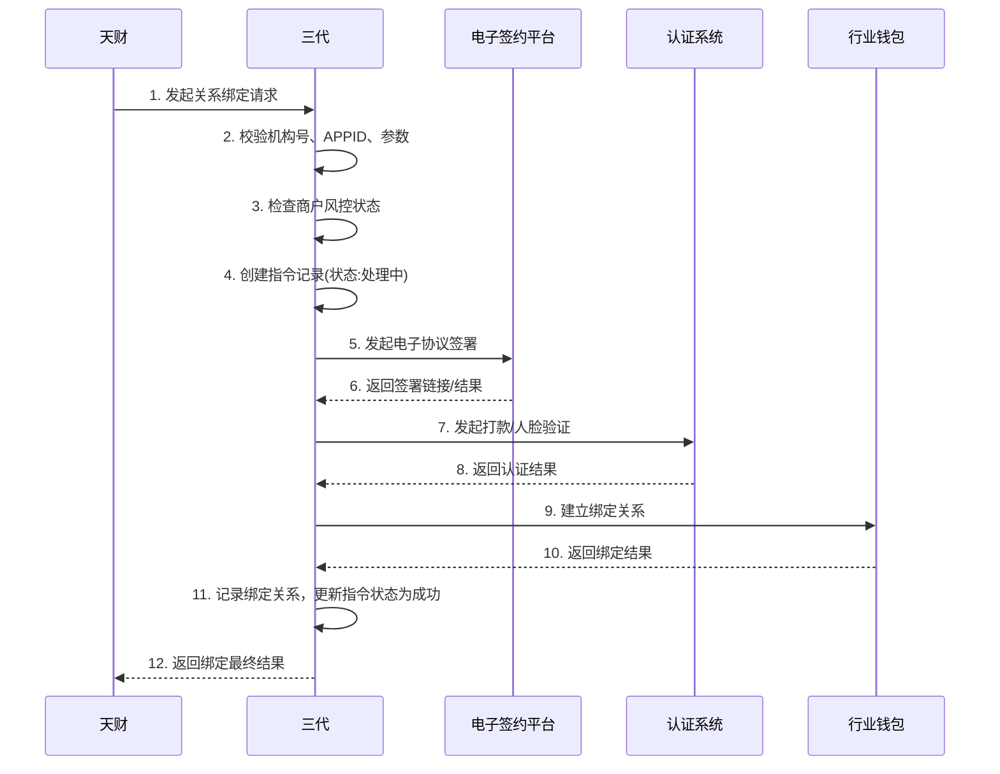
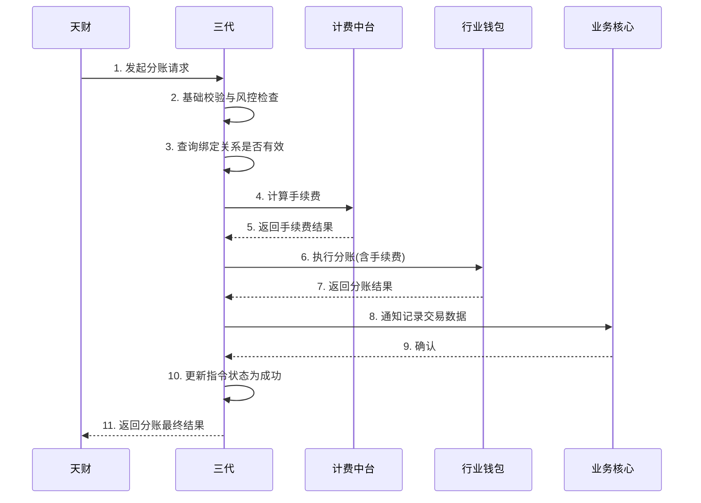
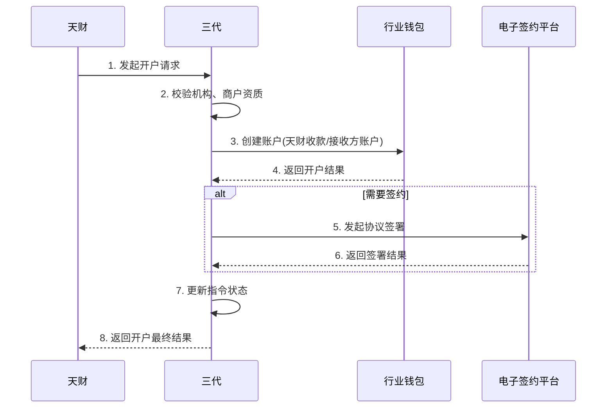

# 模块设计: 三代

生成时间: 2026-01-22 17:47:32
批判迭代: 2

---

# 三代模块设计文档

## 1. 概述
- **目的与范围**: 三代模块是天财平台业务指令的处理入口与协调服务。它负责接收并处理来自天财的开户、关系绑定、分账、计费配置等业务请求，执行核心的业务逻辑校验、审核与流程编排，并协调行业钱包、清结算、账户系统、电子签约平台等下游系统角色完成具体操作。其核心职责是业务指令的生命周期管理，包括接收、校验、路由、状态持久化与最终结果反馈，不直接执行底层的账户操作、资金变动或用户ID生成。

## 2. 接口设计
- **API端点 (REST)**: TBD
- **请求/响应结构**: TBD
- **发布/消费的事件**:
    - **消费事件**:
        - `merchant.frozen` (来自风控): 接收商户冻结/解冻指令，更新本地商户状态并拦截后续业务。
    - **发布事件**:
        - `instruction.created` (指令已创建): 当成功接收并校验天财指令后发布。
        - `instruction.status.updated` (指令状态已更新): 当指令状态（如审核中、处理中、成功、失败）变更时发布。
        - `relationship.bound` (关系绑定完成): 当关系绑定流程最终完成时发布。

## 3. 数据模型
- **表/集合**:
    - **业务指令表 (`biz_instruction`)**:
        - 用于持久化所有来自天财的业务请求，记录指令内容、状态、执行历史，用于状态管理、审计与对账。
    - **商户状态表 (`merchant_status`)**:
        - 缓存从风控同步的商户冻结状态，用于业务逻辑中的快速校验。
    - **关系绑定记录表 (`relationship_record`)**:
        - 记录已成功建立的关系绑定详情，作为分账等业务的前置校验依据。
- **关键字段**:
    - `biz_instruction` 表: `instruction_id` (指令唯一ID), `biz_type` (业务类型: 开户/绑定/分账等), `org_code` (机构号), `app_id` (APPID), `request_data` (原始请求), `status` (状态), `retry_count` (重试次数), `result_data` (最终结果), `created_at`, `updated_at`。
    - `merchant_status` 表: `merchant_id` (商户ID), `frozen` (是否冻结), `frozen_reason`, `synced_at`。
    - `relationship_record` 表: `relationship_id` (关系ID), `payer_id` (付款方ID), `receiver_id` (接收方ID), `bind_status` (绑定状态), `protocol_id` (协议ID), `verified_at` (认证完成时间)。
- **与其他模块的关系**: 业务指令表与业务核心的交易数据通过`instruction_id`关联。关系绑定记录表与行业钱包中的绑定关系数据保持一致。商户状态表的数据源来自风控系统。

## 4. 业务逻辑
- **核心工作流/算法**:
    1.  **通用指令处理流程**:
        - **接收与校验**: 接收天财请求，校验机构号、APPID合法性、请求参数格式与必填项。
        - **状态检查**: 根据请求涉及的商户ID，查询本地`merchant_status`表，校验商户是否被风控冻结。
        - **指令持久化**: 创建`biz_instruction`记录，初始状态为“待处理”。
        - **业务路由与执行**: 根据`biz_type`路由到具体的子流程（开户、绑定、分账等）。
        - **结果处理与响应**: 更新指令状态，记录结果，向天财返回响应。
    2.  **开户审核流程**:
        - 校验机构信息与商户资质。
        - 调用行业钱包创建账户（天财收款账户或天财接收方账户）。
        - 如需电子签约，则调用电子签约平台完成协议签署。
        - 更新指令状态为“成功”或“失败”。
    3.  **关系绑定流程**:
        - 校验付款方与接收方身份及状态。
        - 调用电子签约平台完成协议签署，获取协议ID。
        - 调用认证系统完成打款验证或人脸验证。
        - 调用行业钱包建立绑定关系。
        - 在本地`relationship_record`表中创建记录。
    4.  **分账/转账指令处理**:
        - 校验付款方与接收方关系是否在`relationship_record`表中存在且有效。
        - 校验双方账户状态（通过行业钱包）。
        - 调用计费中台计算手续费。
        - 调用行业钱包执行分账请求。
        - 通知业务核心记录交易数据。
    5.  **计费配置流程**:
        - 接收计费规则配置请求。
        - 调用计费中台完成规则配置。
- **业务规则与验证**:
    - 机构号与APPID需在白名单内且状态有效。
    - 同一笔业务请求需支持幂等性处理（基于天财提供的唯一请求ID）。
    - 关系绑定是执行分账的必要前置条件。
    - 被风控冻结的商户，所有出款类指令（如分账、提现）将被拦截。
- **关键边界情况处理**:
    - **下游调用失败**: 对行业钱包、清结算等关键下游调用设置重试机制（如最多3次，指数退避）。记录重试次数于`biz_instruction.retry_count`。
    - **部分成功（补偿）**: 若分账流程中行业钱包调用成功但计费中台调用失败，需记录异常状态，支持人工或定时任务触发补偿流程（如冲正交易或补计费）。
    - **状态同步**: 定时或监听事件，从风控同步最新商户冻结状态至`merchant_status`表。

## 5. 时序图

### 5.1 关系绑定流程时序图

### 5.2 分账指令处理时序图

### 5.3 开户审核流程时序图

## 6. 错误处理
- **预期错误情况**:
    - **输入错误**: 参数缺失、格式错误、机构号/APPID无效。
    - **业务规则错误**: 商户已冻结、关系绑定不存在、账户状态异常、余额不足。
    - **下游依赖错误**: 电子签约平台、认证系统、行业钱包、计费中台等服务调用超时、网络异常或返回业务失败。
    - **系统内部错误**: 数据库异常、内部逻辑错误。
- **处理策略**:
    - **输入与业务错误**: 立即失败，返回明确的错误码与信息，不重试。
    - **下游暂时性失败**: 对行业钱包、清结算等核心下游调用实施重试。重试策略可配置（如最大次数、退避间隔），重试后仍失败则更新指令状态为“失败”，记录详细错误日志。
    - **幂等性**: 所有关键业务接口需支持基于请求唯一ID的幂等调用，防止重复处理。
    - **补偿与对账**: 对于涉及资金的状态不一致风险（如分账成功但计费失败），记录异常状态，提供管理界面供运营人工处理，并依赖日终对账单进行财务核对。
    - **监控与告警**: 对失败率、超时率设置监控阈值，及时告警。

## 7. 依赖关系
- **上游模块/角色**:
    - **天财**: 业务指令的发起方。
    - **风控**: 提供商户冻结/解冻指令（通过事件）。
- **下游模块/角色**:
    - **行业钱包**: 被调用以执行账户开户、关系绑定校验与建立、分账资金划转。
    - **清结算**: 被调用以处理结算、计费处理（部分计费可能通过计费中台）及资金冻结。
    - **账户系统**: 被行业钱包或清结算底层调用，三代不直接调用。
    - **电子签约平台**: 被调用以完成协议签署流程。
    - **认证系统**: 被调用以完成打款验证或人脸验证。
    - **计费中台**: 被调用以计算分账/转账手续费。
    - **业务核心**: 被调用以存储分账等交易数据。
    - **用户中心**: 被行业钱包底层调用以生成用户ID，三代不直接调用。