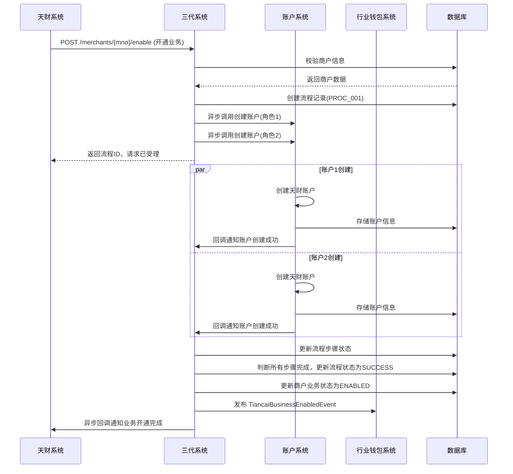
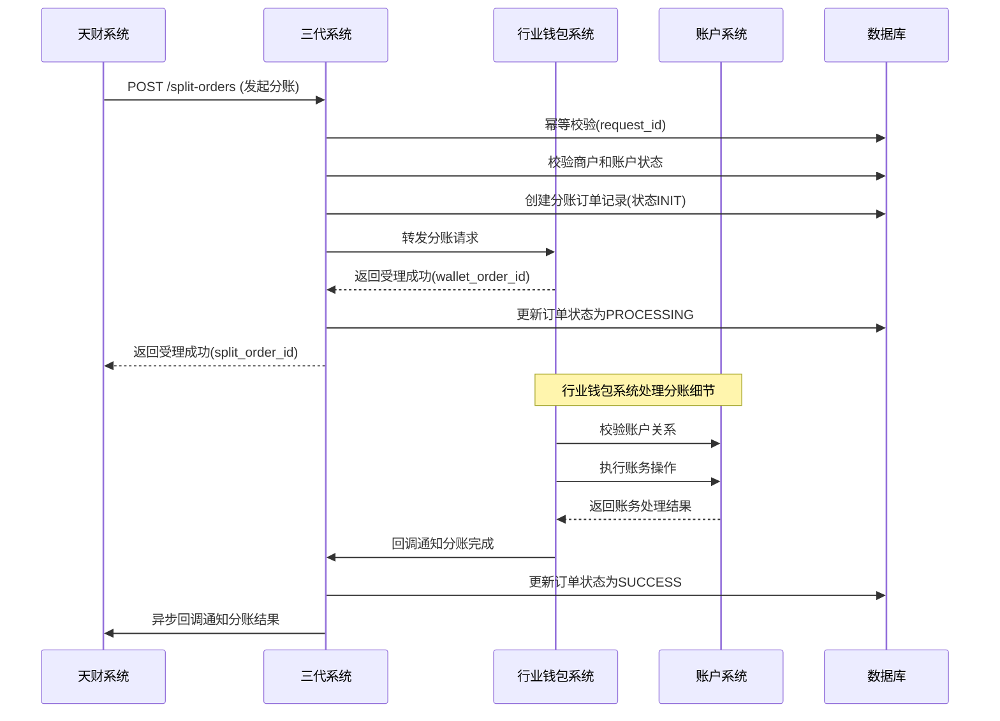

# 模块设计: 三代系统

生成时间: 2026-01-19 15:31:09

---

# 三代系统模块设计文档

## 1. 概述

### 1.1 目的
三代系统作为拉卡拉支付的核心商户管理系统，是天财分账业务的**入口和协调中枢**。本模块负责接收天财的业务请求，协调**行业钱包系统**、**账户系统**、**电子签约平台**等多个下游系统，完成天财专用账户的开通、关系绑定、分账指令转发等全流程业务处理。三代系统是天财业务与底层支付基础设施之间的**桥梁和控制器**。

### 1.2 范围
- **商户与账户管理**：作为天财收单商户的开户和管理入口，触发天财专用账户的创建流程。
- **业务请求受理与路由**：接收天财发起的各类分账业务请求（归集、批量付款、会员结算），进行初步校验后路由至行业钱包系统处理。
- **流程协调与状态管理**：协调电子签约、认证、账户绑定等多个异步流程，管理整体业务状态。
- **数据透传与结果返回**：作为统一出口，向天财返回业务处理结果。
- **与现有系统集成**：无缝集成现有的商户管理、交易处理等核心功能，确保天财业务不破坏现有流程。

## 2. 接口设计

### 2.1 API端点 (RESTful)

#### 2.1.1 商户与账户开通接口
- **POST /api/v1/tiancai/merchants/{merchant_no}/enable**
    - **描述**：为指定的收单商户开通天财分账业务能力。此接口会触发天财专用账户的创建流程。
    - **路径参数**：
        - `merchant_no`: 收单商户号
    - **请求体**：
      ```json
      {
        "request_id": "req_enable_001",
        "institution_code": "TIANCAI", // 机构代码，固定为天财
        "account_roles": ["HEADQUARTERS", "STORE"], // 需要开通的账户角色列表
        "operator": "admin_user",
        "ext_params": {} // 扩展参数
      }
      ```
    - **响应体**：
      ```json
      {
        "code": "SUCCESS",
        "message": "开通请求已受理",
        "data": {
          "process_id": "PROC_20231011001", // 流程实例ID，用于查询进度
          "estimated_time": 30 // 预计完成时间（秒）
        }
      }
      ```

#### 2.1.2 分账业务请求接口
- **POST /api/v1/tiancai/split-orders**
    - **描述**：天财发起分账指令的统一入口。三代系统接收后，进行基础校验并转发给行业钱包系统。
    - **请求体**：
      ```json
      {
        "request_id": "split_req_20231011001",
        "biz_scene": "COLLECTION", // 业务场景：COLLECTION(归集)/BATCH_PAY(批量付款)/MEMBER_SETTLE(会员结算)
        "payer": {
          "tiancai_account_id": "TCA_20231011001",
          "merchant_no": "M100001",
          "role": "STORE"
        },
        "payee_list": [
          {
            "tiancai_account_id": "TCA_20231011002",
            "merchant_no": "M100002",
            "role": "HEADQUARTERS",
            "amount": 10000, // 分账金额（分）
            "currency": "CNY",
            "memo": "门店日结归集"
          }
        ],
        "total_amount": 10000,
        "biz_ref_no": "TC_ORDER_001", // 天财业务参考号
        "callback_url": "https://tiancai.com/callback", // 异步回调地址
        "ext_info": {}
      }
      ```
    - **响应体**：
      ```json
      {
        "code": "SUCCESS",
        "message": "分账指令已接收",
        "data": {
          "split_order_id": "SO_202310110001", // 三代系统生成的分账订单号
          "status": "PROCESSING",
          "received_at": "2023-10-11T10:00:00Z"
        }
      }
      ```

#### 2.1.3 查询接口
- **GET /api/v1/tiancai/split-orders/{split_order_id}**
    - **描述**：查询分账指令处理状态。
- **GET /api/v1/tiancai/merchants/{merchant_no}/accounts**
    - **描述**：查询商户名下的天财专用账户列表及状态。
- **GET /api/v1/tiancai/processes/{process_id}**
    - **描述**：查询异步流程（如账户开通、关系绑定）的执行进度。

#### 2.1.4 回调接口 (供下游系统调用)
- **POST /api/internal/tiancai/callback/process**
    - **描述**：行业钱包、电子签约等下游系统回调通知流程状态变更。
    - **请求体**：
      ```json
      {
        "process_id": "PROC_20231011001",
        "step": "ACCOUNT_CREATION", // 流程步骤
        "status": "SUCCESS", // 步骤状态：SUCCESS/FAILED/PENDING
        "result_data": {
          "tiancai_account_id": "TCA_20231011001",
          "account_no": "3010001001"
        },
        "error_code": "",
        "error_message": "",
        "timestamp": "2023-10-11T10:00:00Z"
      }
      ```

### 2.2 发布/消费的事件

#### 2.2.1 消费的事件
- **TiancaiAccountCreatedEvent** (来自账户系统)：接收天财账户创建成功通知，更新本地账户映射关系。
- **SplitOrderCompletedEvent** (来自行业钱包系统)：接收分账指令处理完成通知，更新订单状态并回调天财。

#### 2.2.2 发布的事件
- **MerchantCreatedEvent**：当三代系统创建新的收单商户时发布，供账户系统监听以判断是否需开通天财账户。
  ```json
  {
    "event_id": "event_merchant_001",
    "event_type": "MERCHANT_CREATED",
    "timestamp": "2023-10-11T09:00:00Z",
    "data": {
      "merchant_no": "M100001",
      "merchant_name": "天财示范店",
      "institution_code": "TIANCAI",
      "status": "ACTIVE",
      "created_at": "2023-10-11T09:00:00Z"
    }
  }
  ```
- **TiancaiBusinessEnabledEvent**：商户成功开通天财业务时发布，供监控和审计系统使用。

## 3. 数据模型

### 3.1 核心表设计

#### 表：`tiancai_merchant_config` (天财商户配置表)
| 字段名 | 类型 | 必填 | 默认值 | 描述 |
| :--- | :--- | :--- | :--- | :--- |
| `id` | bigint | Y | AUTO_INCREMENT | 主键 |
| `merchant_no` | varchar(32) | Y | | **收单商户号**，关联核心商户表 |
| `institution_code` | varchar(20) | Y | `TIANCAI` | 机构代码 |
| `business_status` | varchar(20) | Y | `DISABLED` | 天财业务状态：`DISABLED`/`ENABLING`/`ENABLED`/`SUSPENDED` |
| `enabled_roles` | json | Y | `[]` | 已开通的账户角色列表，如`["HEADQUARTERS", "STORE"]` |
| `config_json` | json | N | | 业务配置（费率、限额等） |
| `created_at` | datetime | Y | CURRENT_TIMESTAMP | |
| `updated_at` | datetime | Y | CURRENT_TIMESTAMP ON UPDATE | |

#### 表：`tiancai_account_mapping` (天财账户映射表)
| 字段名 | 类型 | 必填 | 默认值 | 描述 |
| :--- | :--- | :--- | :--- | :--- |
| `id` | bigint | Y | AUTO_INCREMENT | 主键 |
| `merchant_no` | varchar(32) | Y | | 收单商户号 |
| `account_role` | varchar(20) | Y | | 账户角色：`HEADQUARTERS`/`STORE`/`RECEIVER` |
| `tiancai_account_id` | varchar(32) | Y | | 天财账户ID（来自账户系统） |
| `account_no` | varchar(20) | Y | | 底层账户号 |
| `status` | varchar(20) | Y | | 映射状态：`CREATING`/`ACTIVE`/`INACTIVE` |
| `created_at` | datetime | Y | CURRENT_TIMESTAMP | |

#### 表：`tiancai_split_order` (天财分账订单表)
| 字段名 | 类型 | 必填 | 默认值 | 描述 |
| :--- | :--- | :--- | :--- | :--- |
| `id` | bigint | Y | AUTO_INCREMENT | 主键 |
| `split_order_id` | varchar(32) | Y | | **业务主键**，格式`SO_YYYYMMDDxxx` |
| `request_id` | varchar(64) | Y | | 天财请求流水号，用于幂等 |
| `biz_scene` | varchar(20) | Y | | 业务场景：`COLLECTION`/`BATCH_PAY`/`MEMBER_SETTLE` |
| `payer_merchant_no` | varchar(32) | Y | | 付方商户号 |
| `payer_account_id` | varchar(32) | Y | | 付方天财账户ID |
| `total_amount` | decimal(15,2) | Y | | 总分账金额 |
| `currency` | varchar(3) | Y | `CNY` | 币种 |
| `status` | varchar(20) | Y | `INIT` | 订单状态：`INIT`/`PROCESSING`/`SUCCESS`/`FAILED`/`PARTIAL_SUCCESS` |
| `wallet_order_id` | varchar(32) | N | | 行业钱包系统订单ID |
| `callback_url` | varchar(512) | N | | 天财回调地址 |
| `callback_status` | varchar(20) | Y | `PENDING` | 回调状态：`PENDING`/`SENT`/`FAILED` |
| `request_data` | json | Y | | 原始请求数据（全量） |
| `result_data` | json | N | | 处理结果数据 |
| `error_code` | varchar(50) | N | | 错误码 |
| `error_message` | varchar(500) | N | | 错误信息 |
| `created_at` | datetime | Y | CURRENT_TIMESTAMP | |
| `updated_at` | datetime | Y | CURRENT_TIMESTAMP ON UPDATE | |

#### 表：`tiancai_process_flow` (天财业务流程表)
| 字段名 | 类型 | 必填 | 默认值 | 描述 |
| :--- | :--- | :--- | :--- | :--- |
| `id` | bigint | Y | AUTO_INCREMENT | 主键 |
| `process_id` | varchar(32) | Y | | 流程实例ID，格式`PROC_YYYYMMDDxxx` |
| `process_type` | varchar(30) | Y | | 流程类型：`ACCOUNT_ENABLE`/`RELATION_BIND`/`PAYMENT_AUTH` |
| `merchant_no` | varchar(32) | Y | | 关联商户号 |
| `current_step` | varchar(30) | Y | | 当前步骤 |
| `step_status` | varchar(20) | Y | `PENDING` | 步骤状态：`PENDING`/`PROCESSING`/`SUCCESS`/`FAILED` |
| `context_data` | json | Y | | 流程上下文数据 |
| `expire_time` | datetime | N | | 流程过期时间 |
| `created_at` | datetime | Y | CURRENT_TIMESTAMP | |
| `updated_at` | datetime | Y | CURRENT_TIMESTAMP ON UPDATE | |

### 3.2 与其他模块的关系
- **账户系统**：通过`tiancai_account_mapping`表维护商户号与天财账户ID的映射关系。
- **行业钱包系统**：通过`tiancai_split_order.wallet_order_id`关联分账订单。
- **电子签约平台**：通过`tiancai_process_flow.context_data`存储签约流程的临时数据。
- **核心商户表(merchant)**：`tiancai_merchant_config.merchant_no`外键关联，确保只有有效商户可开通天财业务。

## 4. 业务逻辑

### 4.1 核心算法与规则

#### 4.1.1 天财业务开通流程控制
```python
def enable_tiancai_business(merchant_no, account_roles):
    """
    开通天财业务的核心流程控制
    1. 校验商户是否属于天财机构且状态正常
    2. 为每个account_role异步创建天财专用账户
    3. 等待所有账户创建成功
    4. 更新业务状态为ENABLED
    """
    # 1. 校验商户
    merchant = get_merchant(merchant_no)
    if merchant.institution_code != 'TIANCAI':
        raise ValidationError("非天财机构商户")
    
    # 2. 创建流程记录
    process_id = create_process('ACCOUNT_ENABLE', merchant_no, account_roles)
    
    # 3. 异步调用账户系统创建账户（每个角色一个账户）
    for role in account_roles:
        async_call_account_system(merchant_no, role, process_id)
    
    # 4. 返回流程ID，后续通过回调更新状态
    return process_id
```

#### 4.1.2 分账指令路由与转发规则
1. **场景识别与路由**：
   - `COLLECTION`(归集)：门店(付方) → 总部(收方)
   - `BATCH_PAY`(批量付款)：总部(付方) → 多个接收方(收方)
   - `MEMBER_SETTLE`(会员结算)：总部(付方) → 门店(收方)
   
2. **预处理校验**：
   - 校验付方商户是否已开通天财业务且状态正常
   - 校验付方天财账户是否存在且状态为ACTIVE
   - 校验总金额与明细金额之和是否一致
   - 基于`request_id`实现幂等（防止重复提交）

3. **请求转发**：
   - 将标准化后的请求转发给行业钱包系统
   - 记录`wallet_order_id`关联关系
   - 启动异步超时监控（如30分钟未完成则标记为超时）

#### 4.1.3 异步流程状态机管理
```python
class ProcessStateMachine:
    states = ['PENDING', 'PROCESSING', 'SUCCESS', 'FAILED', 'EXPIRED']
    
    def handle_callback(process_id, step, status, result_data):
        """
        处理下游系统回调，更新流程状态
        """
        process = get_process(process_id)
        
        # 更新当前步骤状态
        update_step_status(process, step, status, result_data)
        
        # 判断流程是否完成
        if all_steps_completed(process):
            if any_step_failed(process):
                final_status = 'FAILED'
                # 触发补偿操作（如回滚已创建的账户）
            else:
                final_status = 'SUCCESS'
                # 更新商户业务状态为ENABLED
                update_merchant_business_status(process.merchant_no, 'ENABLED')
            
            update_process_status(process_id, final_status)
            # 发布流程完成事件
            publish_process_completed_event(process_id, final_status)
```

### 4.2 验证逻辑
- **商户校验**：校验商户是否存在、是否属于天财机构、状态是否正常。
- **账户校验**：校验天财账户是否存在、状态是否ACTIVE、是否属于指定商户。
- **金额校验**：校验金额为正数、不超过限额、币种为CNY。
- **幂等校验**：基于`request_id`防止重复请求，对于分账订单还需校验`biz_ref_no`在天财侧的唯一性。
- **业务规则校验**：校验业务场景与账户角色的匹配性（如归集场景付方必须是门店角色）。

## 5. 时序图

### 5.1 天财业务开通流程


### 5.2 分账指令处理流程


## 6. 错误处理

| 错误码 | HTTP 状态码 | 描述 | 处理策略 |
| :--- | :--- | :--- | :--- |
| `MERCHANT_NOT_FOUND` | 404 | 商户不存在 | 拒绝请求，提示检查商户号。 |
| `MERCHANT_NOT_TIANCAI` | 400 | 商户不属于天财机构 | 拒绝请求，仅天财机构商户可开通此业务。 |
| `BUSINESS_ALREADY_ENABLED` | 409 | 天财业务已开通 | 返回当前业务状态，确保幂等。 |
| `INVALID_ACCOUNT_ROLE` | 400 | 无效的账户角色 | 拒绝请求，提示有效角色列表。 |
| `SPLIT_REQUEST_DUPLICATE` | 409 | 重复的分账请求(request_id) | 返回已受理的订单信息，确保幂等。 |
| `ACCOUNT_NOT_ACTIVE` | 422 | 天财账户状态非ACTIVE | 拒绝分账请求，提示检查账户状态。 |
| `AMOUNT_VALIDATION_FAILED` | 400 | 金额校验失败（负数、超限等） | 拒绝请求，提示具体错误。 |
| `SCENE_ROLE_MISMATCH` | 400 | 业务场景与账户角色不匹配 | 拒绝请求，提示正确组合。 |
| `PROCESS_TIMEOUT` | 504 | 异步流程执行超时 | 触发超时处理，标记流程为EXPIRED，需人工介入。 |
| `CALLBACK_FAILED` | 500 | 回调天财系统失败 | 记录日志并加入重试队列，最多重试5次。 |

**通用策略**：
- **输入验证**：所有外部请求必须经过严格验证，防止非法数据进入系统。
- **幂等性保证**：对于创建类、交易类请求，必须支持基于`request_id`的幂等。
- **异步流程补偿**：对于多步骤异步流程，设计补偿机制，在部分步骤失败时进行回滚或人工干预。
- **优雅降级**：当非核心依赖（如监控事件发布）失败时，不应影响主流程，记录日志后继续执行。
- **监控告警**：对关键错误（5xx、流程超时、回调失败）配置实时告警。

## 7. 依赖说明

### 7.1 上游依赖
1. **天财系统**
   - **交互方式**：同步REST API调用 + 异步HTTP回调。
   - **职责**：发起业务开通、分账指令等业务请求，接收处理结果回调。
   - **关键点**：
     - 需与天财约定接口规范、加密方式、重试机制。
     - 回调必须幂等，天财需正确处理重复回调。
     - 建立对账机制，确保双方数据一致性。

### 7.2 下游依赖
1. **账户系统**
   - **交互方式**：同步REST API调用（创建账户） + 异步事件消费（`MerchantCreatedEvent`）。
   - **职责**：执行天财专用账户的创建和管理。
   - **关键点**：账户创建是异步过程，三代系统需维护流程状态等待回调。

2. **行业钱包系统**
   - **交互方式**：同步REST API调用（转发分账请求） + 异步事件消费（`TiancaiAccountCreatedEvent`）。
   - **职责**：处理分账业务的核心逻辑，包括关系校验、账务指令生成等。
   - **关键点**：三代系统作为路由层，不处理具体分账逻辑，但需监控处理超时。

3. **电子签约平台**
   - **交互方式**：同步REST API调用（发起签约） + 异步HTTP回调（签约结果）。
   - **职责**：为关系绑定提供电子签约服务。
   - **关键点**：签约流程涉及H5页面跳转，三代系统需管理签约会话状态。

4. **认证系统**
   - **交互方式**：通过行业钱包系统间接调用。
   - **职责**：提供打款验证、人脸验证等身份核验能力。
   - **关键点**：三代系统不直接交互，但需了解认证失败对整体流程的影响。

### 7.3 设计原则
- **单一入口**：三代系统作为天财业务的唯一入口，统一处理认证、鉴权、路由。
- **职责分离**：三代系统负责流程协调和状态管理，不深入业务规则细节（如分账比例计算）。
- **异步化设计**：耗时操作（账户创建、签约）采用异步流程，提高接口响应速度。
- **状态可追溯**：所有业务流程都有明确的状态记录，支持查询和人工干预。
- **故障隔离**：下游系统故障时，三代系统应有降级策略（如返回"处理中"状态，而不是直接失败）。