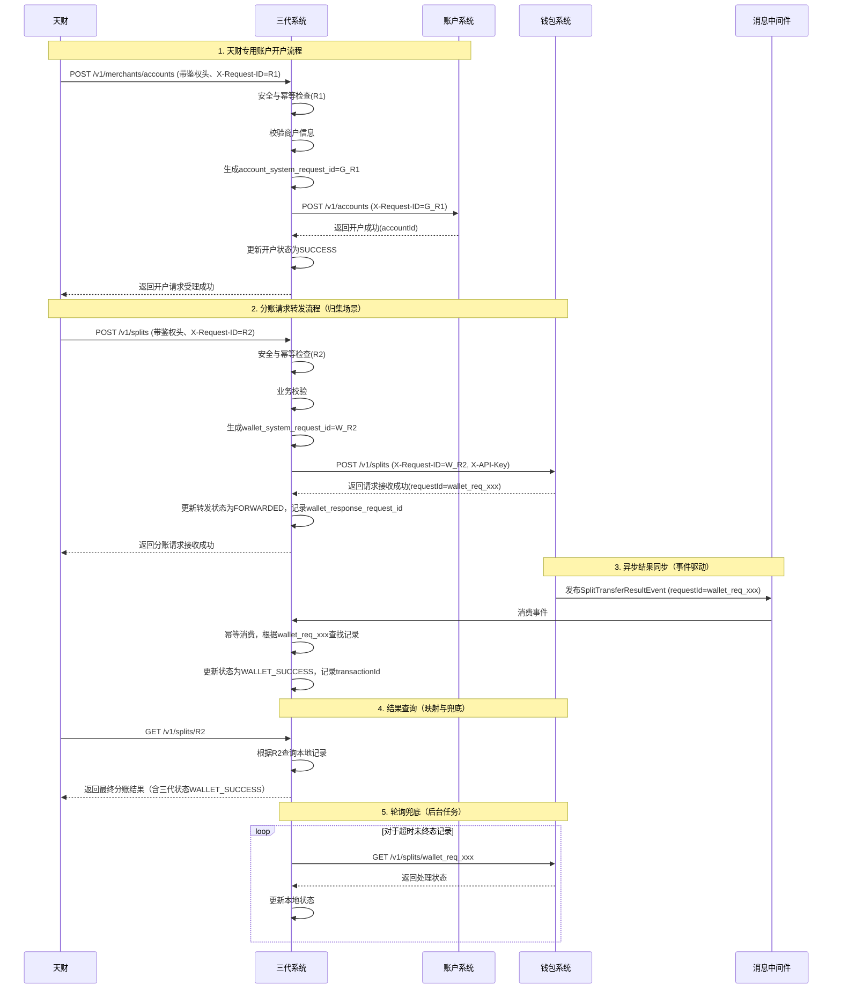

# 模块设计: 三代系统

生成时间: 2026-01-21 18:21:30
批判迭代: 2

---

# 模块设计: 三代系统

## 1. 概述
- **目的与范围**: 三代系统是拉卡拉内部负责商户管理、开户、接口调用等核心业务处理的系统。在天财业务中，三代系统作为上游，负责接收天财（天财商龙）的业务请求，发起天财专用账户的开户流程，并将分账请求转发给行业钱包系统。其边界在于作为天财业务的总入口和商户信息的主数据源，不处理具体的账户绑定、签约认证和账务逻辑。

## 2. 接口设计
- **API端点 (REST/GraphQL)**:
    - `POST /v1/merchants/accounts`: 为天财商户开立专用账户。
    - `POST /v1/splits`: 接收天财的分账请求并转发。
    - `GET /v1/splits/{requestId}`: 查询分账处理结果。
- **鉴权方式**: 天财调用三代系统接口需通过统一网关进行mTLS双向认证及JWT令牌校验。JWT令牌中需包含调用方身份（`clientId`）及租户信息（`tenantId`）。所有请求需携带时间戳（`X-Timestamp`）和随机数（`X-Nonce`）进行签名，防止重放攻击。`X-Request-ID`用于业务幂等，与防重放机制解耦。
- **请求/响应结构**:
    1.  **开户请求 (`POST /v1/merchants/accounts`)**:
        - **请求头**: `X-Request-ID` (幂等键), `Authorization` (Bearer JWT), `X-Timestamp`, `X-Nonce`, `X-Signature`。
        - **请求体**:
            ```json
            {
              "merchantId": "store_001",
              "merchantName": "测试门店",
              "roleType": "STORE",
              "scene": "COLLECTION",
              "requestSource": "天财"
            }
            ```
        - **响应体 (成功)**:
            ```json
            {
              "code": "SUCCESS",
              "message": "开户请求已受理",
              "data": {
                "requestId": "gen3_req_20241027001",
                "status": "PROCESSING"
              }
            }
            ```
    2.  **分账请求 (`POST /v1/splits`)**:
        - **请求头**: `X-Request-ID` (幂等键), `Authorization` (Bearer JWT), `X-Timestamp`, `X-Nonce`, `X-Signature`。
        - **请求体**:
            ```json
            {
              "scene": "COLLECTION",
              "payerMerchantId": "store_001",
              "payeeMerchantId": "hq_001",
              "amount": 10000,
              "currency": "CNY",
              "feeBearer": "PAYER",
              "arrivalMode": "NET",
              "businessRef": "order_20241027001",
              "remark": "门店归集"
            }
            ```
        - **响应体 (成功)**:
            ```json
            {
              "code": "SUCCESS",
              "message": "分账请求已接收",
              "data": {
                "requestId": "gen3_split_20241027001",
                "status": "RECEIVED"
              }
            }
            ```
    3.  **查询分账结果 (`GET /v1/splits/{requestId}`)**:
        - **请求头**: `Authorization` (Bearer JWT)。
        - **响应体**:
            ```json
            {
              "code": "SUCCESS",
              "message": "查询成功",
              "data": {
                "requestId": "gen3_split_20241027001",
                "scene": "COLLECTION",
                "payerMerchantId": "store_001",
                "payeeMerchantId": "hq_001",
                "amount": 10000,
                "currency": "CNY",
                "feeBearer": "PAYER",
                "arrivalMode": "NET",
                "businessRef": "order_20241027001",
                "status": "WALLET_SUCCESS",
                "walletRequestId": "wallet_req_20241027001",
                "walletTransactionId": "txn_789012",
                "createdAt": "2023-10-27T10:00:00Z",
                "updatedAt": "2023-10-27T10:05:00Z"
              }
            }
            ```
- **错误码体系**:
    | 错误码 | HTTP状态 | 含义 | 是否可重试 | 客户端动作 |
    | :--- | :--- | :--- | :--- | :--- |
    | `SUCCESS` | 200 | 成功 | 不适用 | 不适用 |
    | `INVALID_PARAMETER` | 400 | 请求参数无效 | 否 | 检查并修改请求参数 |
    | `UNAUTHORIZED` | 401 | 鉴权失败（JWT无效/过期） | 是（刷新令牌） | 重新获取有效令牌 |
    | `FORBIDDEN` | 403 | 权限不足 | 否 | 检查权限配置 |
    | `MERCHANT_NOT_FOUND` | 404 | 商户信息不存在 | 否 | 检查商户ID |
    | `DUPLICATED_REQUEST` | 409 | 幂等键冲突，请求已处理 | 是（幂等） | 使用原`X-Request-ID`查询结果 |
    | `DOWNSTREAM_UNAVAILABLE` | 503 | 下游服务暂时不可用 | 是 | 稍后使用`requestId`查询处理结果 |
    | `INTERNAL_ERROR` | 500 | 系统内部错误 | 是 | 联系技术支持，提供`traceId` |
    - **下游错误码映射与透传规则**:
        - **账户系统错误**: `ACCOUNT_ALREADY_EXISTS` 映射为 `DUPLICATED_REQUEST`；`MERCHANT_NOT_FOUND` 透传；其他业务错误（如`INVALID_ACCOUNT_STATUS`）转换为 `DOWNSTREAM_UNAVAILABLE` 并记录日志。
        - **钱包系统错误**: `DUPLICATE_REQUEST` 映射为 `DUPLICATED_REQUEST`；`RELATIONSHIP_NOT_FOUND`、`ACCOUNT_STATUS_INVALID`、`SIGNING_REQUIRED` 等业务错误透传；`DOWNSTREAM_UNAVAILABLE` 透传。
- **发布/消费的事件**:
    - **消费事件**: TBD。
    - **发布事件**: TBD。

## 3. 数据模型
- **表/集合**:
    1.  `merchant` (商户主表):
        - `merchant_id` (主键, VARCHAR(64)): 商户ID。
        - `merchant_name` (VARCHAR(128)): 商户名。
        - `status` (VARCHAR(32)): 状态 (`ACTIVE`, `INACTIVE`)。
        - `created_at` (DATETIME): 创建时间。
        - `updated_at` (DATETIME): 更新时间。
        - **唯一约束**: `uk_merchant_id` ON (`merchant_id`)。
        - **索引**: `idx_status`。
    2.  `account_opening_request` (开户请求表):
        - `id` (主键, BIGINT): 自增ID。
        - `request_id` (VARCHAR(128), UK): 外部请求ID（天财`X-Request-ID`），幂等键。
        - `merchant_id` (VARCHAR(64)): 商户ID。
        - `role_type` (VARCHAR(32)): 角色类型 (`HEADQUARTERS`, `STORE`)。
        - `scene` (VARCHAR(32)): 业务场景 (`COLLECTION`, `BATCH_PAYMENT`, `MEMBER_SETTLEMENT`)。
        - `status` (VARCHAR(32)): 状态 (`RECEIVED`, `PROCESSING`, `SUCCESS`, `FAILED`)。
        - `account_system_account_id` (VARCHAR(128)): 账户系统返回的账户ID。
        - `account_system_request_id` (VARCHAR(128)): 转发给账户系统的请求ID（`X-Request-ID`）。
        - `response_code` (VARCHAR(32)): 最终响应给天财的代码。
        - `response_body` (JSON): 最终响应给天财的完整响应体（用于幂等返回）。
        - `error_message` (TEXT): 错误信息。
        - `created_at` (DATETIME): 创建时间。
        - `updated_at` (DATETIME): 更新时间。
        - **唯一约束**: `uk_request_id` ON (`request_id`)。
        - **索引**: `idx_merchant_id`, `idx_status_created_at`。
    3.  `split_forward_record` (分账转发记录表):
        - `id` (主键, BIGINT): 自增ID。
        - `request_id` (VARCHAR(128), UK): 外部请求ID（天财`X-Request-ID`），幂等键。
        - `scene` (VARCHAR(32)): 业务场景 (`COLLECTION`, `BATCH_PAYMENT`, `MEMBER_SETTLEMENT`)。
        - `payer_merchant_id` (VARCHAR(64)): 付方商户ID。
        - `payee_merchant_id` (VARCHAR(64)): 收方商户ID。
        - `amount` (DECIMAL(20,0)): 交易金额，单位：分。
        - `currency` (VARCHAR(3)): 币种，默认`CNY`。
        - `fee_bearer` (VARCHAR(32)): 手续费承担方 (`PAYER`, `PAYEE`)。
        - `arrival_mode` (VARCHAR(32)): 到账模式 (`NET`, `GROSS`)。
        - `business_ref` (VARCHAR(128)): 业务关联号。
        - `remark` (VARCHAR(256)): 备注。
        - `wallet_system_request_id` (VARCHAR(128), UK): 转发给钱包系统的请求ID（`X-Request-ID`）。
        - `wallet_response_request_id` (VARCHAR(128)): 钱包系统响应中返回的`requestId`（如`wallet_req_xxx`）。
        - `status` (VARCHAR(32)): 状态 (`RECEIVED`, `FORWARDED`, `WALLET_PROCESSING`, `WALLET_SUCCESS`, `WALLET_FAILED`, `UNKNOWN_TIMEOUT`)。
        - `wallet_transaction_id` (VARCHAR(128)): 钱包系统返回的交易ID。
        - `wallet_response_code` (VARCHAR(32)): 钱包系统返回的错误码。
        - `wallet_response_message` (TEXT): 钱包系统返回的错误信息。
        - `response_code` (VARCHAR(32)): 最终响应给天财的代码。
        - `response_body` (JSON): 最终响应给天财的完整响应体（用于幂等返回）。
        - `created_at` (DATETIME): 创建时间。
        - `updated_at` (DATETIME): 更新时间。
        - **唯一约束**: `uk_request_id` ON (`request_id`), `uk_wallet_system_request_id` ON (`wallet_system_request_id`)。
        - **索引**: `idx_payer_merchant_id`, `idx_payee_merchant_id`, `idx_status_updated_at`, `idx_wallet_response_request_id`。
    4.  `processed_event` (已处理事件表):
        - `id` (主键, BIGINT): 自增ID。
        - `event_id` (VARCHAR(128), UK): 事件唯一ID。
        - `event_type` (VARCHAR(64)): 事件类型。
        - `processed_at` (DATETIME): 处理时间。
        - **唯一约束**: `uk_event_id` ON (`event_id`)。
- **与其他模块的关系**: 商户信息 (`merchant`表) 是账户系统开户的基础数据源。开户请求记录关联账户系统。分账转发记录关联行业钱包系统的分账请求。

## 4. 业务逻辑
- **核心工作流/算法**:
    1.  **天财专用账户开户流程**:
        - 接收天财的开户请求，进行安全校验（JWT、签名、时间戳、随机数防重放）。
        - 进行幂等校验：根据 `X-Request-ID` 查询 `account_opening_request` 表。若存在，则直接返回已存储的 `response_body`。
        - 校验商户信息：查询 `merchant` 表，确认 `merchant_id` 存在且状态为 `ACTIVE`。
        - 生成转发给账户系统的幂等键 `account_system_request_id`（规则：`gen3_acct_` + `X-Request-ID`）。
        - 在数据库事务中，插入 `account_opening_request` 记录，状态为 `PROCESSING`，并存储初始响应体。
        - 调用账户系统的 `POST /v1/accounts` 接口，透传商户信息，请求头携带 `X-Request-ID: account_system_request_id` 及账户系统要求的鉴权头（如Bearer Token）。
        - 根据账户系统响应：
            - 成功：更新本地记录状态为 `SUCCESS`，记录 `account_system_account_id`，更新 `response_body`。
            - 失败：更新本地记录状态为 `FAILED`，记录错误信息，更新 `response_body`。
        - **注意**：三代系统不等待账户激活事件，开户成功即返回。账户激活及后续关系绑定由钱包系统消费 `AccountOpenedEvent` 处理。
    2.  **分账请求转发流程**:
        - 接收天财的分账请求，进行安全校验（JWT、签名、时间戳、随机数防重放）。
        - 进行幂等校验：根据 `X-Request-ID` 查询 `split_forward_record` 表。若存在，则直接返回已存储的 `response_body`。
        - **业务校验**：
            - 校验 `payerMerchantId` 和 `payeeMerchantId` 在 `merchant` 表中存在且状态为 `ACTIVE`。
            - 校验 `scene`、`roleType`（需根据商户信息获取）匹配性（如`COLLECTION`场景付方需为`STORE`，收方需为`HEADQUARTERS`）。
            - 校验 `amount` 为正整数（分），`currency` 为 `CNY`，`businessRef` 非空，`remark` 长度不超过256字符。
        - 生成转发给钱包系统的幂等键 `wallet_system_request_id`（规则：`gen3_wallet_` + `X-Request-ID`）。
        - 在数据库事务中，插入 `split_forward_record` 记录，状态为 `RECEIVED`，并存储初始响应体。
        - 调用钱包系统的 `POST /v1/splits` 接口，透传分账请求参数，请求头携带 `X-Request-ID: wallet_system_request_id` 及钱包系统要求的鉴权头（如`X-API-Key`）。
        - 根据钱包系统响应：
            - 成功：更新本地记录状态为 `FORWARDED`，记录 `wallet_response_request_id`（钱包返回的`requestId`），更新 `response_body`。
            - 失败：根据错误码判断是否可重试（如网络超时）。若可重试，状态保持 `RECEIVED` 并安排异步重试；若为业务错误，更新状态为 `WALLET_FAILED`，记录错误信息，更新 `response_body`。
    3.  **异步结果同步机制**:
        - **事件驱动（优先）**：监听消息中间件，消费钱包系统发布的 `SplitTransferResultEvent`。根据事件中的 `requestId`（即钱包系统的`requestId`）关联到本地的 `wallet_response_request_id` 或 `wallet_system_request_id`，更新对应的 `split_forward_record` 记录状态（`WALLET_SUCCESS`/`WALLET_FAILED`）及 `wallet_transaction_id`。通过 `processed_event` 表实现事件消费幂等。
        - **轮询兜底**：对于状态为 `FORWARDED` 或 `WALLET_PROCESSING` 且超过一定时间（如30秒）未收到事件的通知的记录，启动后台定时任务进行轮询。
            - 轮询频率：采用指数退避策略，初始间隔5秒，最大间隔300秒。
            - 轮询目标：调用钱包系统 `GET /v1/splits/{requestId}` 接口，`requestId` 使用本地记录的 `wallet_response_request_id`（优先）或 `wallet_system_request_id`。
            - 终止条件：获取到终态（`CORE_SUCCESS`/`FAILED`等）或达到最大轮询次数（如10次）。若轮询超时，将状态置为 `UNKNOWN_TIMEOUT` 并触发告警。
- **业务规则与验证**:
    - **幂等性**: 所有写操作基于 `X-Request-ID` 实现幂等。在数据库事务中，通过唯一索引冲突来防止并发重复插入。对于冲突请求，返回已持久化的 `response_body`。
    - **商户校验**: 开户和分账前，必须校验请求中的 `merchant_id` 在本地商户主表中存在且状态为 `ACTIVE`。
    - **金额精度**: 金额单位统一为**分**，使用整型（`DECIMAL(20,0)`）存储和传输。接口请求示例中的 `amount: 100.00` 仅为示意，实际契约规定为整数分。
    - **ID映射与透传**: 妥善管理三代系统 `request_id`、`wallet_system_request_id`（转发用）、`wallet_response_request_id`（钱包返回）之间的映射关系，确保查询链路可追溯。
- **关键边界情况处理**:
    - **下游调用失败**: 调用账户系统或行业钱包系统接口失败时，根据错误类型（网络超时、5xx错误）决定异步重试；对于4xx业务错误，直接置为失败状态。
    - **结果状态同步**: 通过"事件监听 + 轮询兜底"机制可靠获取钱包系统的最终处理结果。
    - **数据一致性**: 确保本地记录的状态与下游系统业务状态最终一致，通过异步同步和定期对账保障。

## 5. 时序图



## 6. 错误处理
- **预期错误情况**:
    - **安全与鉴权错误**: JWT无效/过期、签名验证失败、重放攻击（时间戳/随机数重复）。
    - **请求参数错误**: 商户ID不存在、角色类型或场景枚举值无效、金额非正整数、币种非CNY、businessRef为空等。
    - **下游系统调用失败**: 调用账户系统或行业钱包系统接口超时、返回5xx系统错误或4xx业务错误。
    - **幂等冲突**: 重复的 `X-Request-ID`。
    - **商户状态异常**: 商户主状态非 `ACTIVE`。
    - **异步同步异常**: 事件消费失败、轮询超时。
- **处理策略**:
    - **安全与业务错误**: 立即向天财返回明确的错误信息（如 `UNAUTHORIZED`, `MERCHANT_NOT_FOUND`, `INVALID_PARAMETER`），终止流程。
    - **下游暂时性故障**: 可进行有限次数的异步重试（特别是网络超时、5xx错误）。重试失败后，将本地请求状态置为 `WALLET_FAILED` 或 `FAILED`，并记录错误信息，后续可通过查询接口告知天财最终失败结果。
    - **幂等处理**: 对于重复请求，直接返回之前已持久化的 `response_body`。
    - **状态同步**: 对于已转发但结果未知的请求，通过"事件监听+轮询兜底"机制同步最终状态。轮询超时置为 `UNKNOWN_TIMEOUT` 并触发运维告警。
    - **下游错误映射**: 根据定义的映射规则，将下游系统的错误码转换为三代系统对外的统一错误码，或选择性地透传。

## 7. 依赖关系
- **上游模块**:
    - **天财 (天财商龙)**: **强依赖**。接收其开户和分账业务请求。依赖其遵循安全调用规范。
- **下游模块**:
    - **账户系统**: **强依赖**。调用其 `POST /v1/accounts` 接口为天财商户开通专用账户。需遵循其鉴权（Bearer Token）和幂等约定。
    - **行业钱包系统**: **强依赖**。将天财的分账请求转发至其 `POST /v1/splits` 接口，并依赖其返回处理结果及发布 `SplitTransferResultEvent`。需遵循其鉴权（API Key）和幂等约定。
- **非功能性依赖**:
    - **数据库**: 持久化商户信息、开户及分账转发记录、已处理事件。
    - **消息中间件**: 用于可靠消费钱包系统发布的事件。
    - **统一认证网关**: 提供mTLS及JWT校验。
    - **定时任务调度**: 用于下游调用重试、结果轮询等后台任务。