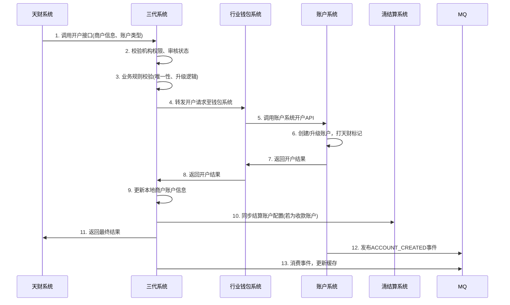
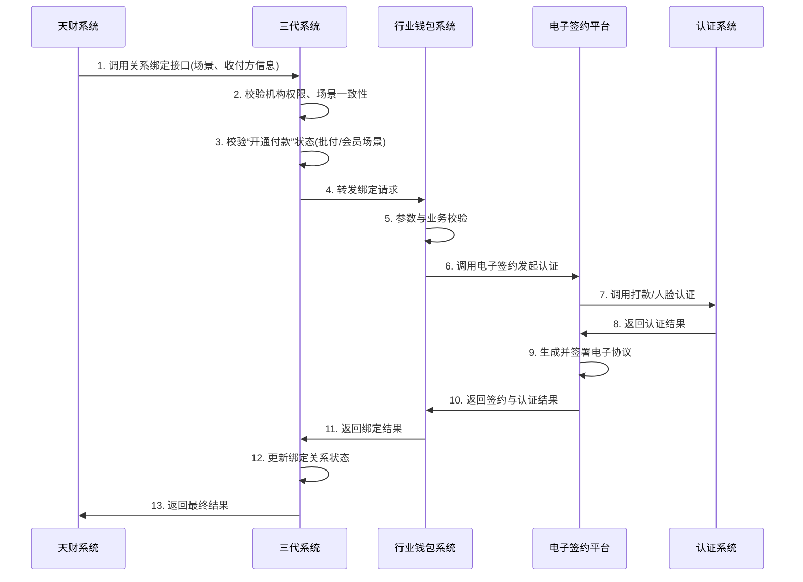

# 模块设计: 三代系统

生成时间: 2026-01-16 17:16:33

---

# 三代系统模块设计文档

## 1. 概述

### 1.1 目的
三代系统作为“天财商龙”业务场景的核心接入与业务编排模块，负责：
1.  **业务接入与路由**：作为天财系统的统一接入点，接收并校验天财发起的各类业务请求（开户、关系绑定、分账等），并路由至下游系统（行业钱包、账户系统等）。
2.  **业务审核与配置**：管理天财机构及商户的业务开通审核流程，配置商户结算模式、转账费率等核心业务参数。
3.  **数据同步与一致性保障**：作为业务配置的源头，向清结算、计费中台等系统同步关键业务配置，确保上下游数据一致。
4.  **机构与商户关系管理**：维护天财机构与旗下商户的层级关系，为对账单系统提供机构层数据聚合的基础。

### 1.2 范围
- **商户管理**：天财机构下商户的入网、审核、状态管理。
- **账户管理**：接收天财开户请求，校验机构权限，转发至行业钱包系统。
- **业务开通**：管理“天财账户”、“关系绑定”、“开通付款”等产品的开通流程与审核。
- **关系绑定**：提供分账关系绑定接口，进行场景与一致性校验后转发。
- **业务配置**：
    - 配置收单商户的结算模式（主动/被动）及结算账户（天财收款账户）。
    - 配置天财分账业务的转账手续费规则（费率、承担方、生效时间等）。
- **退货模式管理**：为天财新机构下的商户配置默认退货模式，并支持随结算模式切换自动变更。
- **接口封装**：为天财系统提供统一的、业务语义清晰的RESTful API。

## 2. 接口设计

### 2.1 API端点 (REST)

#### 2.1.1 开通天财专用账户
- **端点**：`POST /api/v1/tiancai/accounts/open`
- **描述**：天财发起，为指定商户开立或升级天财专用账户（收款账户或接收方账户）。三代进行机构权限、审核状态校验后，转发至行业钱包系统。
- **调用方**：天财系统
- **认证**：机构级API Key (AppId + Secret)，通过请求头`X-App-Id`和`X-Api-Key`传递。
- **请求头**：
  ```json
  {
    "X-App-Id": "tiancai_org_id",
    "X-Api-Key": "encrypted_secret",
    "X-Request-Id": "uuid_v4"
  }
  ```
- **请求体**：
  ```json
  {
    "requestId": "unique_request_id_from_tiancai",
    "operationType": "CREATE | UPGRADE", // 新开 | 升级
    "accountType": "RECEIVE_ACCOUNT | RECEIVER_ACCOUNT",
    "merchantNo": "收单商户号",
    "merchantName": "商户名称",
    "roleType": "HEADQUARTERS | STORE", // 总部 | 门店，仅收款账户必填
    "accountName": "账户名称",
    "certType": "ID_CARD | BUSINESS_LICENSE",
    "certNo": "证件号码",
    "bankCardNo": "默认银行卡号",
    "bankCode": "银行编码",
    "bankName": "银行名称",
    "effectiveTime": "2024-01-01 00:00:00" // 账户生效时间，用于次日生效场景
  }
  ```
- **响应体** (成功)：
  ```json
  {
    "code": "SUCCESS",
    "message": "开户请求受理成功",
    "data": {
      "requestId": "同请求requestId",
      "accountNo": "天财专用账户号（升级时与原账户号一致）",
      "accountType": "RECEIVE_ACCOUNT | RECEIVER_ACCOUNT",
      "status": "PROCESSING", // 受理状态
      "processTime": "2024-01-01 10:00:00"
    }
  }
  ```

#### 2.1.2 分账关系绑定
- **端点**：`POST /api/v1/tiancai/relations/bind`
- **描述**：天财发起，用于建立归集、批量付款、会员结算场景下的资金收付授权关系。三代校验场景一致性和商户角色后，转发至行业钱包系统。
- **请求体**：
  ```json
  {
    "requestId": "unique_request_id_from_tiancai",
    "scene": "POOLING | BATCH_PAY | MEMBER_SETTLEMENT", // 归集 | 批量付款 | 会员结算
    "initiatorMerchantNo": "发起方商户号（总部）",
    "initiatorMerchantName": "发起方商户名称",
    "payerMerchantNo": "付款方商户号",
    "payerAccountNo": "付款方账户号（天财收款账户）",
    "payeeMerchantNo": "收款方商户号",
    "payeeAccountNo": "收款方账户号（天财收款账户/接收方账户）",
    "fundPurpose": "资金用途枚举值",
    "authorizedPersonMobile": "授权联系人手机号（归集场景门店联系人）"
  }
  ```
- **响应体** (成功)：
  ```json
  {
    "code": "SUCCESS",
    "message": "关系绑定请求受理成功",
    "data": {
      "requestId": "同请求requestId",
      "relationId": "系统生成的关系ID",
      "status": "PROCESSING",
      "processTime": "2024-01-01 10:00:00"
    }
  }
  ```

#### 2.1.3 开通付款（代付授权）
- **端点**：`POST /api/v1/tiancai/payment/enable`
- **描述**：在批量付款和会员结算场景下，付方（总部）需额外进行的代付授权流程。三代校验通过后转发。
- **请求体**：
  ```json
  {
    "requestId": "unique_request_id_from_tiancai",
    "initiatorMerchantNo": "发起方商户号（总部）",
    "payerMerchantNo": "付款方商户号（同发起方）",
    "payerAccountNo": "付款方账户号（天财收款账户）",
    "fundPurpose": "BATCH_PAY | MEMBER_SETTLEMENT"
  }
  ```

#### 2.1.4 配置转账手续费
- **端点**：`POST /api/v1/tiancai/fee/config`
- **描述**：为天财分账业务配置手续费规则。三代保存配置并同步至计费中台。
- **请求体**：
  ```json
  {
    "configId": "optional",
    "payerMerchantNo": "付款方商户号",
    "payerAccountType": "RECEIVE_ACCOUNT | RECEIVER_ACCOUNT",
    "payeeAccountType": "RECEIVE_ACCOUNT | RECEIVER_ACCOUNT",
    "feeBearer": "PAYER | PAYEE", // 付方承担 | 收方承担
    "settlementMode": "NET | GROSS", // 净额转账 | 全额转账
    "feeScope": "TRANSACTION_AMOUNT", // 按流水金额计费
    "feeMode": "RATE | FIXED", // 比例 | 固定金额
    "feeValue": "0.003", // 费率或固定金额
    "effectiveTime": "2024-01-01 00:00:00",
    "expireTime": "2024-12-31 23:59:59"
  }
  ```

#### 2.1.5 查询机构-商户关系
- **端点**：`GET /api/v1/tiancai/org/{orgId}/merchants`
- **描述**：为对账单系统提供天财机构下的商户列表，用于机构层账单聚合。
- **调用方**：对账单系统
- **响应体**：
  ```json
  {
    "code": "SUCCESS",
    "data": {
      "orgId": "机构号",
      "merchants": [
        {
          "merchantNo": "商户号",
          "merchantName": "商户名称",
          "merchantType": "ENTERPRISE | INDIVIDUAL",
          "roleType": "HEADQUARTERS | STORE",
          "settlementMode": "ACTIVE | PASSIVE",
          "tiancaiReceiveAccountNo": "天财收款账户号"
        }
      ]
    }
  }
  ```

### 2.2 消费的事件

#### 2.2.1 账户创建事件 (`ACCOUNT_CREATED`)
- **消费时机**：接收账户系统发布的事件，用于更新本地商户的账户信息。
- **处理逻辑**：
  ```json
  {
    "eventId": "uuid",
    "eventType": "ACCOUNT_CREATED",
    "timestamp": "2024-01-01T10:00:00Z",
    "data": {
      "accountNo": "TTRA12345600000123",
      "accountType": "RECEIVE_ACCOUNT",
      "tiancaiFlag": true,
      "merchantNo": "888888",
      "roleType": "HEADQUARTERS",
      "createTime": "2024-01-01 10:00:00"
    }
  }
  ```
- **动作**：更新`merchant`表的`tiancai_receive_account_no`字段，或记录接收方账户关系。

#### 2.2.2 账户状态变更事件 (`ACCOUNT_STATUS_CHANGED`)
- **消费时机**：接收账户系统发布的事件，用于同步账户冻结/解冻状态。
- **处理逻辑**：更新本地缓存的账户状态，若为冻结，可联动限制该商户的分账业务。

## 3. 数据模型

### 3.1 数据库表设计

#### 表：tiancai_org_merchant (天财机构商户表)
| 字段名 | 类型 | 必填 | 默认值 | 说明 |
|--------|------|------|--------|------|
| id | bigint | Y | AUTO_INCREMENT | 主键 |
| org_id | varchar(20) | Y | | 天财机构号 |
| merchant_no | varchar(32) | Y | | 收单商户号 |
| merchant_name | varchar(100) | Y | | 商户名称 |
| merchant_type | varchar(20) | Y | | 商户性质：ENTERPRISE(企业), INDIVIDUAL(个体) |
| role_type | varchar(20) | N | | 角色：HEADQUARTERS(总部), STORE(门店) |
| audit_status | varchar(20) | Y | PENDING | 审核状态：PENDING, APPROVED, REJECTED |
| audit_time | datetime | N | | 审核时间 |
| settlement_mode | varchar(20) | Y | | 结算模式：ACTIVE(主动), PASSIVE(被动) |
| tiancai_receive_account_no | varchar(32) | N | | 天财收款账户号 |
| refund_mode | varchar(20) | Y | | 退货模式：DEFAULT_ACCOUNT_REFUND(终点账户+退货账户), SETTLEMENT_FIRST(优先扣待结算) |
| status | varchar(20) | Y | NORMAL | 状态：NORMAL, FROZEN, CLOSED |
| create_time | datetime | Y | CURRENT_TIMESTAMP | 创建时间 |
| update_time | datetime | Y | CURRENT_TIMESTAMP ON UPDATE | 更新时间 |

**索引**：
- 唯一索引：`uk_org_merchant` (org_id, merchant_no)
- 普通索引：`idx_merchant_no` (merchant_no)
- 普通索引：`idx_audit_status` (audit_status)

#### 表：tiancai_fee_config (天财手续费配置表)
| 字段名 | 类型 | 必填 | 默认值 | 说明 |
|--------|------|------|--------|------|
| id | bigint | Y | AUTO_INCREMENT | 主键 |
| config_no | varchar(32) | Y | | 配置编号 |
| payer_merchant_no | varchar(32) | Y | | 付款方商户号 |
| payer_account_type | varchar(20) | Y | | 付方账户类型 |
| payee_account_type | varchar(20) | Y | | 收方账户类型 |
| fee_bearer | varchar(20) | Y | | 手续费承担方 |
| settlement_mode | varchar(20) | Y | | 到账模式 |
| fee_scope | varchar(20) | Y | | 计费范围 |
| fee_mode | varchar(20) | Y | | 计费模式 |
| fee_value | decimal(10,4) | Y | | 费率或固定金额 |
| effective_time | datetime | Y | | 生效时间 |
| expire_time | datetime | N | | 失效时间 |
| sync_status | varchar(20) | Y | PENDING | 同步状态：PENDING, SUCCESS, FAILED |
| sync_time | datetime | N | | 同步时间 |
| status | varchar(20) | Y | VALID | 状态：VALID, INVALID |
| create_time | datetime | Y | CURRENT_TIMESTAMP | 创建时间 |

**索引**：
- 唯一索引：`uk_config_no` (config_no)
- 复合索引：`idx_payer_effective` (payer_merchant_no, effective_time, status)

#### 表：tiancai_relation_bind (关系绑定记录表)
| 字段名 | 类型 | 必填 | 默认值 | 说明 |
|--------|------|------|--------|------|
| id | bigint | Y | AUTO_INCREMENT | 主键 |
| relation_id | varchar(32) | Y | | 关系ID |
| scene | varchar(30) | Y | | 场景 |
| initiator_merchant_no | varchar(32) | Y | | 发起方商户号 |
| payer_merchant_no | varchar(32) | Y | | 付款方商户号 |
| payer_account_no | varchar(32) | Y | | 付款方账户号 |
| payee_merchant_no | varchar(32) | Y | | 收款方商户号 |
| payee_account_no | varchar(32) | Y | | 收款方账户号 |
| fund_purpose | varchar(50) | Y | | 资金用途 |
| bind_status | varchar(20) | Y | PROCESSING | 绑定状态：PROCESSING, SUCCESS, FAILED |
| auth_status | varchar(20) | Y | PENDING | 认证状态：PENDING, SUCCESS, FAILED |
| protocol_status | varchar(20) | Y | PENDING | 协议状态：PENDING, SIGNED, FAILED |
| wallet_request_id | varchar(64) | N | | 行业钱包请求ID |
| complete_time | datetime | N | | 完成时间 |
| create_time | datetime | Y | CURRENT_TIMESTAMP | 创建时间 |

**索引**：
- 唯一索引：`uk_relation_id` (relation_id)
- 复合索引：`idx_payer_payee` (payer_account_no, payee_account_no, scene, bind_status)

### 3.2 与其他模块的关系
```mermaid
erDiagram
    TIANCAI_ORG_MERCHANT ||--o{ TIANCAI_FEE_CONFIG : "拥有"
    TIANCAI_ORG_MERCHANT ||--o{ TIANCAI_RELATION_BIND : "发起"
    
    GENERATION_3_SYSTEM }|--|| WALLET_SYSTEM : "调用开户/绑定"
    GENERATION_3_SYSTEM }|--|| BILLING_CENTER : "同步费率"
    GENERATION_3_SYSTEM }|--|| SETTLEMENT_SYSTEM : "同步结算配置"
    GENERATION_3_SYSTEM }|--|| BILLING_SYSTEM : "提供机构商户关系"
    GENERATION_3_SYSTEM }|..|> ACCOUNT_SYSTEM : "监听账户事件"
    
    GENERATION_3_SYSTEM {
        varchar system_id PK
    }
    
    WALLET_SYSTEM {
        varchar system_id PK
    }
    
    BILLING_CENTER {
        varchar system_id PK
    }
    
    SETTLEMENT_SYSTEM {
        varchar system_id PK
    }
    
    BILLING_SYSTEM {
        varchar system_id PK
    }
    
    ACCOUNT_SYSTEM {
        varchar system_id PK
    }
```

## 4. 业务逻辑

### 4.1 核心算法

#### 4.1.1 天财机构权限校验算法
```java
public void validateTiancaiOrgPermission(String appId, String merchantNo) {
    // 1. 校验AppId是否在天财机构白名单内
    TiancaiOrg org = orgDao.selectByAppId(appId);
    if (org == null || !"ACTIVE".equals(org.getStatus())) {
        throw new UnauthorizedException("非天财机构或机构已禁用");
    }
    
    // 2. 校验商户是否属于该机构
    TiancaiOrgMerchant orgMerchant = orgMerchantDao.selectByOrgAndMerchant(org.getOrgId(), merchantNo);
    if (orgMerchant == null) {
        throw new BusinessException("商户不属于该天财机构");
    }
    
    // 3. 校验商户审核状态
    if (!"APPROVED".equals(orgMerchant.getAuditStatus())) {
        throw new BusinessException("商户业务审核未通过");
    }
}
```

#### 4.1.2 关系绑定场景一致性校验
```java
public void validateRelationBindScene(TiancaiRelationBindRequest request) {
    // 根据场景枚举，校验收付方角色、账户类型、发起方一致性
    switch (request.getScene()) {
        case "POOLING": // 归集
            validatePoolingScene(request);
            break;
        case "BATCH_PAY": // 批量付款
            validateBatchPayScene(request);
            break;
        case "MEMBER_SETTLEMENT": // 会员结算
            validateMemberSettlementScene(request);
            break;
        default:
            throw new IllegalArgumentException("不支持的场景类型");
    }
}

private void validateBatchPayScene(TiancaiRelationBindRequest request) {
    // 1. 付方必须是天财收款账户，且角色为总部
    validatePayerIsHeadquartersReceiveAccount(request.getPayerAccountNo());
    
    // 2. 收方必须是天财接收方账户
    validatePayeeIsReceiverAccount(request.getPayeeAccountNo());
    
    // 3. 发起方必须与付方是同一商户（法务一致性）
    if (!request.getInitiatorMerchantNo().equals(request.getPayerMerchantNo())) {
        throw new BusinessException("批量付款场景发起方必须与付款方一致");
    }
    
    // 4. 校验付方是否已完成“开通付款”
    validatePaymentEnabled(request.getPayerMerchantNo());
}
```

### 4.2 业务规则

#### 4.2.1 开户规则
1.  **机构限制**：仅天财机构号（通过白名单校验）可调用开户接口。
2.  **审核前置**：商户必须已完成业务审核（`audit_status = 'APPROVED'`）。
3.  **账户唯一性**：
    - 一个商户只能有一个天财收款账户。
    - 升级操作时，原普通收款账户必须存在且状态正常。
4.  **结算模式联动**：
    - 开立天财收款账户时，自动将商户结算模式设置为“主动结算”，结算账户设置为新开的天财收款账户。
    - 老商户升级时，若原为被动结算，需通过接口设置次日生效。

#### 4.2.2 退货模式规则
1.  **新机构默认规则**：天财新机构下的所有商户，默认退货模式为“终点账户+退货账户”。
2.  **自动切换**：支持商户在主被动结算模式切换时，自动变更退货模式。
3.  **老机构特殊处理**：天财使用老机构号时，需三代人工配置退货模式。

#### 4.2.3 费率配置同步规则
1.  **源头在三代**：所有天财分账手续费规则在三代配置。
2.  **同步至计费中台**：配置创建/更新后，必须同步至计费中台，并确认同步成功（`sync_status = 'SUCCESS'`）。
3.  **一致性保障**：若同步失败，需有告警和人工介入流程，确保三代与计费中台数据一致。

#### 4.2.4 关系绑定生效规则
1.  **协议与认证**：必须完成协议签署和身份认证（打款/人脸）。
2.  **开通付款前置**：批量付款和会员结算场景，付方必须先完成“开通付款”授权。
3.  **场景一致性**：严格校验场景与收付方角色、账户类型的匹配关系。

### 4.3 验证逻辑

#### 4.3.1 开户请求验证
```java
public void validateAccountOpenRequest(TiancaiAccountOpenRequest request) {
    // 1. 基础参数非空校验
    Validate.notNull(request.getMerchantNo(), "商户号不能为空");
    Validate.notNull(request.getAccountType(), "账户类型不能为空");
    
    // 2. 机构权限与审核状态校验 (见4.1.1)
    validateTiancaiOrgPermission(request.getAppId(), request.getMerchantNo());
    
    // 3. 账户类型特定校验
    if ("RECEIVE_ACCOUNT".equals(request.getAccountType())) {
        Validate.notNull(request.getRoleType(), "收款账户必须指定角色类型");
        // 检查是否已存在天财收款账户
        checkDuplicateTiancaiReceiveAccount(request.getMerchantNo());
    }
    
    // 4. 升级操作校验
    if ("UPGRADE".equals(request.getOperationType())) {
        Account existing = accountService.queryByMerchantNoAndType(request.getMerchantNo(), "RECEIVE_ACCOUNT");
        Validate.notNull(existing, "升级操作需要已存在普通收款账户");
        Validate.isTrue(!existing.isTiancaiFlag(), "账户已是天财账户，无需升级");
    }
}
```

## 5. 时序图

### 5.1 天财专用账户开户时序图


### 5.2 分账关系绑定时序图


## 6. 错误处理

### 6.1 预期错误码

| 错误码 | HTTP状态码 | 描述 | 处理建议 |
|--------|------------|------|----------|
| G3_400001 | 400 | 请求参数校验失败 | 检查请求参数格式和必填项 |
| G3_403001 | 403 | 非天财机构禁止操作 | 检查AppId和机构权限 |
| G3_403002 | 403 | 商户业务未审核或审核未通过 | 联系运营进行业务审核 |
| G3_409001 | 409 | 商户已存在天财收款账户 | 无需重复开户 |
| G3_422001 | 422 | 场景与收付方角色不匹配 | 检查场景枚举和收付方角色类型 |
| G3_422002 | 422 | 付方未开通付款权限 | 先调用“开通付款”接口 |
| G3_422003 | 422 | 商户结算模式不支持此操作 | 检查商户结算模式配置 |
| G3_500001 | 500 | 下游系统调用失败 | 联系技术支持，查看下游系统状态 |
| G3_500002 | 500 | 配置同步失败 | 检查计费中台/清结算系统连通性 |

### 6.2 重试与补偿策略
1.  **下游调用超时/失败**：
    - HTTP调用配置超时（3s），快速失败。
    - 对于开户、绑定等关键业务，提供异步重试机制（最大3次），记录重试日志。
2.  **配置同步失败**：
    - 同步计费、结算配置失败时，记录失败状态(`sync_status='FAILED'`)并告警。
    - 提供管理台手动重同步功能。
3.  **消息消费失败**：
    - 消费账户事件失败时，进入死信队列，告警并支持手动重放。

### 6.3 监控与告警
1.  **关键业务指标**：
    - 开户/绑定接口成功率 < 99.9%
    - 下游系统（钱包、账户）平均响应时间 > 500ms
    - 配置同步失败率 > 1%
2.  **业务健康度**：
    - 处于“同步失败”状态的配置数量
    - 审核通过但未成功开户的商户数量
3.  **告警渠道**：企业微信、短信。

## 7. 依赖说明

### 7.1 上游依赖

#### 7.1.1 天财系统
- **依赖关系**：业务请求发起方
- **交互方式**：同步HTTP API调用
- **关键接口**：所有`/api/v1/tiancai/*`接口
- **SLA要求**：P99响应时间 < 1s，可用性 > 99.95%
- **流量预估**：峰值QPS约50（假设5000商户，每日业务操作峰值时段集中）

### 7.2 下游依赖

#### 7.2.1 行业钱包系统
- **依赖关系**：核心业务处理下游
- **交互方式**：同步HTTP API调用
- **关键调用**：
    - 开户请求转发
    - 关系绑定请求转发
- **降级策略**：若钱包系统不可用，三代直接返回“系统繁忙”，天财端应重试。

#### 7.2.2 计费中台
- **依赖关系**：费率配置同步下游
- **交互方式**：同步HTTP API调用
- **关键接口**：费率配置创建/更新接口
- **一致性要求**：强一致性。同步失败必须告警，业务应阻止使用未同步成功的费率。

#### 7.2.3 清结算系统
- **依赖关系**：结算配置同步下游
- **交互方式**：同步HTTP API调用
- **关键接口**：商户结算账户配置同步接口
- **触发时机**：天财收款账户开户/升级成功时。

#### 7.2.4 对账单系统
- **依赖关系**：数据提供方
- **交互方式**：同步HTTP API调用（被调用）
- **关键接口**：机构-商户关系查询接口
- **性能要求**：支持批量查询，响应时间 < 200ms。

#### 7.2.5 账户系统
- **依赖关系**：事件消费方
- **交互方式**：异步消息消费（MQ）
- **关键事件**：`ACCOUNT_CREATED`, `ACCOUNT_STATUS_CHANGED`
- **可靠性**：至少一次消费，需处理幂等。

### 7.3 容错与性能设计
1.  **服务降级**：
    - 下游钱包系统不可用：开户、绑定接口直接返回失败，避免线程池耗尽。
    - 计费中台同步失败：业务可读（查询旧费率），但禁止创建新绑定关系。
2.  **缓存策略**：
    - 商户基本信息、账户信息缓存（Redis），TTL 5分钟，缓存穿透保护。
    - 天财机构白名单内存缓存，定期刷新。
3.  **限流熔断**：
    - 每个天财机构号单独限流（如100 QPS）。
    - 对下游钱包系统调用配置熔断器（失败率>50%熔断）。
4.  **数据一致性**：
    - 关键业务操作（开户+结算配置同步）使用Saga模式，提供补偿接口。
    - 费率配置采用“先同步，后生效”原则，确保数据最终一致。

---
**文档版本**：v1.0  
**最后更新**：2024年1月  
**负责人**：三代系统架构组