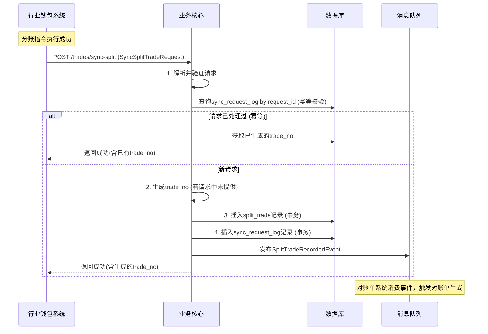
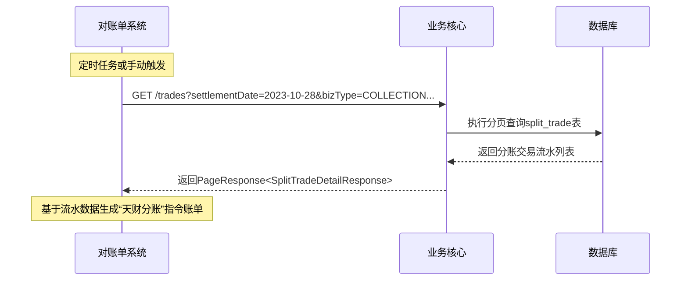

# 模块设计: 业务核心

生成时间: 2026-01-19 14:52:02

---

# 模块设计: 业务核心

生成时间: 2026-01-19 15:30:00

---

## 1. 概述

### 1.1 目的
本模块是支付系统的**核心交易流水记录与对账数据源**。在“天财商龙”分账业务中，它作为交易数据的汇聚点，负责接收并持久化来自行业钱包系统的分账交易数据，为下游对账单系统提供完整、准确的“天财分账”指令账单及机构层级的动账明细。其核心价值在于构建统一、标准化的交易流水视图，确保资金流转在交易层面可追溯、可对账。

### 1.2 范围
- **分账交易数据接收与存储**：提供标准接口，接收行业钱包系统同步的“天财分账”交易数据，并将其转化为本模块内部的标准化交易流水记录。
- **交易流水标准化**：将不同业务类型（归集、批量付款、会员结算）的分账指令，映射为统一的交易模型，包含完整的交易双方、金额、状态、关联业务单号等信息。
- **对账单数据供给**：作为对账单系统的上游数据源，提供基于“天财分账”指令维度的交易流水查询与导出能力，支持生成机构层级的动账明细。
- **交易流水查询**：为内部运营、风控或问题排查提供交易流水查询接口。

### 1.3 非范围
- 钱包账户管理、关系绑定校验、分账指令执行（由行业钱包系统处理）。
- 底层账户的资金记账与余额管理（由账户系统处理）。
- 交易资金的清算、结算与计费（由清结算系统、计费中台处理）。
- 对账单的最终生成、格式化和对外提供（由对账单系统处理）。
- 商户进件、协议签署等业务流程（由三代系统处理）。

## 2. 接口设计

### 2.1 REST API 端点

#### 2.1.1 交易数据同步接口（供行业钱包系统调用）
- **POST /api/v1/biz-core/trades/sync-split**：同步分账交易数据
    - **描述**：行业钱包系统在分账指令成功后，调用此接口同步交易核心数据。本接口需保证幂等性。
    - **请求体**：`SyncSplitTradeRequest`
    - **响应**：`SyncTradeResponse`

#### 2.1.2 交易流水查询接口（内部/运营使用）
- **GET /api/v1/biz-core/trades**：查询分账交易流水
    - **查询参数**:
        - `bizOrderNo`: 三代系统业务订单号
        - `walletOrderNo`: 钱包侧分账指令号
        - `underlyingTransactionNo`: 底层流水号
        - `payerMerchantNo`: 付方商户号
        - `receiverMerchantNo`: 收方商户号
        - `bizType`: 业务类型
        - `tradeDateStart`/`tradeDateEnd`: 交易日期范围
        - `status`: 交易状态
    - **响应**：`PageResponse<SplitTradeDetailResponse>`

- **GET /api/v1/biz-core/trades/{tradeNo}**：根据交易流水号查询详情
    - **响应**：`SplitTradeDetailResponse`

### 2.2 数据结构

```json
// SyncSplitTradeRequest (来自行业钱包系统)
{
  "requestId": "SYNC_SPLIT_REQ_001", // 同步请求唯一ID，用于幂等
  "syncTimestamp": "2023-10-27T14:40:00Z",
  "tradeData": {
    "tradeNo": "TC202310270001", // 业务核心生成的交易流水号（可为空，由本模块生成）
    "bizOrderNo": "SPLIT202310270001", // 三代系统业务订单号
    "walletOrderNo": "WTO202310270001", // 钱包侧分账指令号
    "underlyingTransactionNo": "TX202310270001", // 底层账户系统流水号
    "bizType": "COLLECTION", // 业务类型: COLLECTION, BATCH_PAY, MEMBER_SETTLEMENT
    "payerInfo": {
      "merchantNo": "M100001",
      "merchantName": "北京朝阳门店",
      "walletAccountId": "WACC_STORE_001",
      "accountNo": "ACC202310270001" // 底层账户号
    },
    "receiverInfo": {
      "merchantNo": "M100000",
      "merchantName": "北京总部",
      "walletAccountId": "WACC_HQ_001",
      "accountNo": "ACC202310270000"
    },
    "amount": "10000.00",
    "currency": "CNY",
    "tradeStatus": "SUCCESS", // 交易最终状态: SUCCESS, FAILED
    "tradeTime": "2023-10-27T14:35:00Z", // 交易完成时间
    "memo": "2023年10月营业款归集",
    "feeInfo": { // 手续费信息（如有）
      "feeAmount": "5.00",
      "feeType": "SPLIT_FEE"
    },
    "extInfo": { // 扩展信息
      "bindingId": "BIND_001",
      "settlementDate": "2023-10-28" // 预期结算日期
    }
  }
}

// SyncTradeResponse
{
  "code": "SUCCESS",
  "message": "同步成功",
  "data": {
    "tradeNo": "TC202310270001", // 业务核心生成的交易流水号
    "syncStatus": "SUCCESS"
  }
}

// SplitTradeDetailResponse
{
  "tradeNo": "TC202310270001",
  "bizOrderNo": "SPLIT202310270001",
  "walletOrderNo": "WTO202310270001",
  "underlyingTransactionNo": "TX202310270001",
  "bizType": "COLLECTION",
  "bizTypeDesc": "资金归集",
  "payerMerchantNo": "M100001",
  "payerMerchantName": "北京朝阳门店",
  "payerWalletAccountId": "WACC_STORE_001",
  "payerAccountNo": "ACC202310270001",
  "receiverMerchantNo": "M100000",
  "receiverMerchantName": "北京总部",
  "receiverWalletAccountId": "WACC_HQ_001",
  "receiverAccountNo": "ACC202310270000",
  "amount": "10000.00",
  "currency": "CNY",
  "tradeStatus": "SUCCESS",
  "tradeStatusDesc": "成功",
  "tradeTime": "2023-10-27T14:35:00Z",
  "memo": "2023年10月营业款归集",
  "feeAmount": "5.00",
  "settlementDate": "2023-10-28",
  "createTime": "2023-10-27T14:40:05Z",
  "updateTime": "2023-10-27T14:40:05Z"
}
```

### 2.3 发布的事件
业务核心作为事件生产者，发布以下领域事件：

- **SplitTradeRecordedEvent**：分账交易流水已记录。
    ```json
    {
      "eventId": "EVT_SPLIT_TRADE_RECORDED_001",
      "eventType": "SPLIT_TRADE_RECORDED",
      "timestamp": "2023-10-27T14:40:05Z",
      "data": {
        "tradeNo": "TC202310270001",
        "bizOrderNo": "SPLIT202310270001",
        "bizType": "COLLECTION",
        "payerMerchantNo": "M100001",
        "receiverMerchantNo": "M100000",
        "amount": "10000.00",
        "tradeStatus": "SUCCESS",
        "tradeTime": "2023-10-27T14:35:00Z",
        "settlementDate": "2023-10-28"
      }
    }
    ```

### 2.4 消费的事件
业务核心作为事件消费者，可订阅以下事件以丰富交易数据或触发后续流程（非必需，根据架构设计可选）：

- **FeeCalculatedEvent** (来自计费中台)：更新交易流水中的手续费信息。
- **SettlementCompletedEvent** (来自清结算系统)：更新交易流水的结算状态和实际结算日期。

## 3. 数据模型

### 3.1 核心表设计

#### 表：`split_trade` (分账交易流水表)
| 字段名 | 类型 | 必填 | 描述 | 索引 |
|--------|------|------|------|------|
| id | bigint(20) | Y | 自增主键 | PK |
| trade_no | varchar(32) | Y | 业务核心交易流水号，全局唯一 | UK |
| biz_order_no | varchar(32) | Y | 三代系统业务订单号 | UK |
| wallet_order_no | varchar(32) | Y | 钱包侧分账指令号 | UK |
| underlying_transaction_no | varchar(32) | Y | 底层账户系统流水号 | UK |
| biz_type | varchar(32) | Y | 业务类型: COLLECTION, BATCH_PAY, MEMBER_SETTLEMENT | IDX |
| payer_merchant_no | varchar(32) | Y | 付方商户号 | IDX |
| payer_merchant_name | varchar(128) | Y | 付方商户名称 | |
| payer_wallet_account_id | varchar(32) | Y | 付方钱包账户ID | IDX |
| payer_account_no | varchar(32) | Y | 付方底层账户号 | IDX |
| receiver_merchant_no | varchar(32) | Y | 收方商户号 | IDX |
| receiver_merchant_name | varchar(128) | Y | 收方商户名称 | |
| receiver_wallet_account_id | varchar(32) | Y | 收方钱包账户ID | IDX |
| receiver_account_no | varchar(32) | Y | 收方底层账户号 | IDX |
| amount | decimal(15,2) | Y | 分账金额 | |
| currency | char(3) | Y | 币种，默认CNY | |
| trade_status | varchar(16) | Y | 交易状态: SUCCESS, FAILED | IDX |
| trade_time | datetime | Y | 交易完成时间（底层） | IDX |
| memo | varchar(256) | N | 备注 | |
| fee_amount | decimal(15,2) | N | 手续费金额 | |
| fee_type | varchar(32) | N | 手续费类型 | |
| settlement_date | date | N | 预期/实际结算日期 | IDX |
| ext_info | json | N | 扩展信息（存储binding_id等） | |
| create_time | datetime | Y | 创建时间 | IDX |
| update_time | datetime | Y | 更新时间 | |

#### 表：`sync_request_log` (同步请求日志表)
| 字段名 | 类型 | 必填 | 描述 | 索引 |
|--------|------|------|------|------|
| id | bigint(20) | Y | 自增主键 | PK |
| request_id | varchar(64) | Y | 同步请求唯一ID（来自行业钱包） | UK |
| source_system | varchar(32) | Y | 来源系统: WALLET_SYSTEM | IDX |
| biz_order_no | varchar(32) | Y | 关联的业务订单号 | IDX |
| trade_no | varchar(32) | N | 生成的交易流水号 | IDX |
| sync_status | varchar(16) | Y | 同步状态: SUCCESS, FAILED | IDX |
| request_body | json | Y | 原始请求体 | |
| response_body | json | N | 响应体 | |
| fail_reason | varchar(512) | N | 失败原因 | |
| create_time | datetime | Y | 创建时间 | IDX |

### 3.2 与其他模块的关系
- **行业钱包系统**：**主要数据上游**。通过同步接口接收分账交易数据。两者通过 `biz_order_no` 和 `wallet_order_no` 强关联。本模块是行业钱包系统 `SplitTradeDataPreparedEvent` 事件的消费者（通过接口调用形式）。
- **对账单系统**：**主要数据下游**。对账单系统将定期或实时从本表 (`split_trade`) 拉取或接收事件 (`SplitTradeRecordedEvent`)，以生成“天财分账”指令账单和机构动账明细。
- **账户系统**：**间接关联**。通过 `underlying_transaction_no` 关联底层资金流水，用于对账和问题追溯。
- **三代系统**：**间接关联**。通过 `biz_order_no` 关联业务源头。
- **计费中台/清结算系统**：**可选数据丰富源**。通过订阅其事件，可以完善交易流水的手续费和结算信息。

## 4. 业务逻辑

### 4.1 核心算法
- **交易流水号生成**：`TC` + `年月日` + `6位序列号` (如 `TC20231027000001`)。
- **幂等性校验**：基于 `sync_request_log.request_id` 实现接口级幂等。对于同一 `request_id` 的请求，直接返回已记录的结果。
- **数据标准化映射**：将行业钱包同步的 `SyncSplitTradeRequest.tradeData` 映射为 `split_trade` 表的标准字段，确保数据结构统一。
- **批量查询优化**：对账单系统可能进行大批量数据拉取，需基于 `trade_time` 和 `settlement_date` 设计高效的分页查询。

### 4.2 业务规则
1. **数据同步规则**：
    - 只接收状态为 `SUCCESS` 或 `FAILED` 的最终态分账交易数据。`PROCESSING` 等中间状态数据不应同步。
    - 必须校验关键字段非空：`bizOrderNo`, `walletOrderNo`, `underlyingTransactionNo`, `payerInfo`, `receiverInfo`, `amount`, `tradeStatus`, `tradeTime`。
    - 交易流水号 (`tradeNo`) 优先使用请求中携带的（如果行业钱包预生成），否则由本模块按规则生成。

2. **数据一致性规则**：
    - 对于同一笔分账业务（相同的 `bizOrderNo`），应只存在一条成功的交易流水记录。
    - 通过 `sync_request_log` 的幂等控制，防止重复同步导致数据重复。
    - 若收到同一 `bizOrderNo` 但交易状态更新的数据（如从 FAILED 变更为 SUCCESS 的重试成功），应更新原记录并记录日志。

3. **对账数据准备规则**：
    - `settlement_date` 字段至关重要，是对账单系统按日汇总的关键维度。需确保其准确性，优先使用同步数据中的 `settlementDate`，若无则根据 `tradeTime` 和业务规则推导。
    - 交易金额 (`amount`) 为实际划转的资金额，不包含手续费。手续费单独记录在 `fee_amount` 中。

### 4.3 验证逻辑
- **接口请求验证**：
    - 验证 `requestId` 和 `tradeData` 必填。
    - 验证 `tradeData` 中金额为正数，币种为支持的类型。
    - 验证 `tradeStatus` 为枚举允许的值。
    - 验证 `tradeTime` 不为未来时间。
- **业务逻辑验证**：
    - 校验 `bizOrderNo`、`walletOrderNo`、`underlyingTransactionNo` 三者组合在系统中是否已存在，避免产生冲突记录。
    - 校验付方和收方商户号是否存在于内部商户库（可缓存或异步校验，不影响主流程）。

## 5. 时序图

### 5.1 分账交易数据同步流程


### 5.2 对账单系统拉取数据流程


## 6. 错误处理

### 6.1 预期错误及HTTP状态码
- **400 Bad Request**：
    - `INVALID_REQUEST_BODY`：请求体JSON解析失败或格式错误。
    - `MISSING_REQUIRED_FIELD`：缺少必填字段。
    - `INVALID_PARAMETER`：参数值无效（如金额非正、状态非法、时间为未来）。
- **409 Conflict**：
    - `DUPLICATE_REQUEST`：`requestId` 重复（幂等返回，实际为成功语义，但用409标识冲突）。
    - `TRADE_CONFLICT`：`bizOrderNo`等业务标识与现有记录冲突且状态不一致。
- **500 Internal Server Error**：数据库操作失败、系统内部异常。

### 6.2 处理策略
- **同步接口错误**：
    - 对于参数校验错误，立即返回 `400` 并描述具体错误字段，方便调用方排查。
    - 对于数据库唯一键冲突（如 `trade_no` 重复，极小概率），记录告警日志，尝试生成新的流水号重试插入。
    - 对于数据库连接超时等临时错误，可进行短暂重试（如2次），重试失败后返回 `500`，依赖行业钱包系统的同步重试机制。
- **数据不一致处理**：
    - 监控 `split_trade` 表与 `sync_request_log` 表的一致性，定期运行核对脚本。
    - 如果发现同一 `bizOrderNo` 存在多条 `SUCCESS` 记录（异常情况），发出严重告警，需人工介入核查并修复数据。
- **下游依赖**：
    - 事件发布 (`SplitTradeRecordedEvent`) 采用异步且尽力而为的模式。如果消息队列暂时不可用，记录本地日志并告警，由后续补偿任务重新发布。不影响主同步流程的响应。

## 7. 依赖说明

### 7.1 上游模块交互（数据提供方）
1. **行业钱包系统**：
    - **调用关系**：**同步RPC调用（HTTP REST）**。行业钱包系统作为调用方。
    - **关键接口**：`POST /api/v1/biz-core/trades/sync-split`
    - **交互要点**：
        - 本模块需提供高可用、高性能的同步接口，确保行业钱包系统能及时送达数据。
        - 接口设计必须幂等，以应对行业钱包系统可能因网络超时等原因发起的重试。
        - 响应应明确，成功则返回 `trade_no`，失败则给出具体错误码和原因。
        - 本模块是行业钱包系统数据流的终点之一，负责交易数据的最终落地。

### 7.2 下游模块交互（数据消费方）
1. **对账单系统**：
    - **调用关系**：**同步RPC调用（HTTP REST） + 异步消息驱动**。
    - **数据提供方式**：
        - **主动拉取**：对账单系统通过查询接口 (`GET /trades`) 主动拉取指定日期、类型的交易流水。
        - **事件驱动**：对账单系统消费 `SplitTradeRecordedEvent` 事件，实现近实时对账单更新。
    - **交互要点**：
        - 查询接口需支持灵活的组合条件筛选和高效的分页，以应对大数据量导出场景。
        - 事件数据应包含对账单生成所需的核心字段，如 `tradeNo`, `settlementDate`, `amount` 等。
        - 双方需约定数据字段的含义和格式，确保对账单的准确性。

### 7.3 内部依赖
- **数据库**：MySQL集群，存储所有交易流水和同步日志。`split_trade` 表可能增长迅速，需考虑按 `settlement_date` 或 `trade_time` 进行分表或归档策略。
- **缓存**：Redis集群，可选用于缓存热点商户信息、或作为查询结果的临时缓存，提升查询性能。
- **消息队列**：用于发布 `SplitTradeRecordedEvent` 事件，需保证至少成功投递一次。
- **配置中心**：管理接口限流、开关、序列号生成器等配置。

---
**文档版本**：1.0  
**最后更新**：2023-10-27  
**设计者**：软件架构师