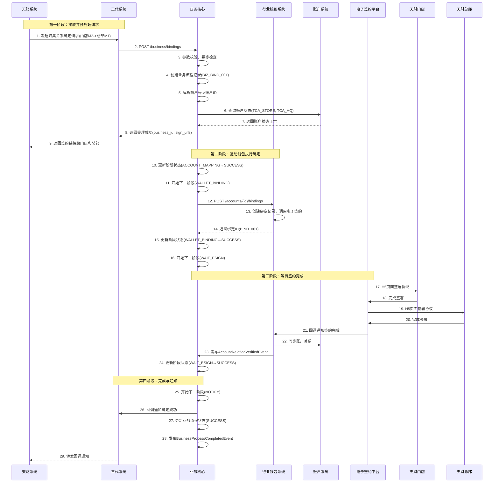
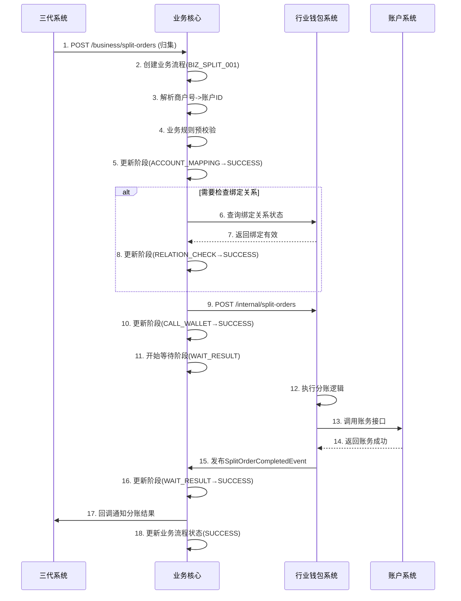

# 模块设计: 业务核心

生成时间: 2026-01-19 15:35:28

---

# 模块设计: 业务核心

生成时间: 2026-01-19

---

# 业务核心模块设计文档

## 1. 概述

### 1.1 目的
**业务核心模块**是“天财分账业务”的**业务编排与流程驱动引擎**。它位于行业钱包系统与上游三代系统之间，作为业务需求的统一入口和流程编排中心，负责接收、解析、路由来自天财（通过三代系统）的业务请求，并驱动行业钱包系统执行具体的账户管理、关系绑定和分账操作。本模块旨在为天财提供一个稳定、高效、可扩展的业务接入层，屏蔽底层系统的复杂性，确保业务流程的完整性和数据一致性。

### 1.2 范围
- **业务请求接入与路由**：接收三代系统转发的天财业务请求（如开通、绑定、分账），进行初步校验和路由分发。
- **业务流程编排**：协调行业钱包系统、账户系统、电子签约平台等多个下游服务，驱动完整的业务生命周期（如开户->绑定->分账）。
- **业务数据聚合与转换**：将天财的业务语言（如商户号、门店ID）转换为系统内部标识（如天财账户ID），并聚合多个下游系统的数据，形成统一的业务视图。
- **业务状态机管理**：维护业务层面（如一个“归集关系建立”任务）的状态流转，提供全局的业务进度查询。
- **业务异常处理与补偿**：捕获业务流程中的异常，根据业务规则决定重试、回滚或转人工处理，保障业务最终一致性。
- **业务对账与报表**：为天财提供业务层面的对账数据，汇总分账、提款、收单等业务活动。

## 2. 接口设计

### 2.1 API端点 (RESTful)

#### 2.1.1 业务开通接口
- **POST /api/v1/tiancai/business/open**
    - **描述**：为指定商户开通天财分账业务。此接口将触发创建天财专用账户（总部或门店）的完整流程。
    - **请求体**：
      ```json
      {
        "request_id": "biz_open_req_20231011001",
        "merchant_no": "M100001",
        "institution_code": "TC001", // 天财机构编码
        "account_role": "HEADQUARTERS", // HEADQUARTERS/STORE
        "account_info": {
          "account_name": "北京天财科技有限公司",
          "cert_type": "UNIFIED_SOCIAL_CREDIT_CODE", // 证件类型
          "cert_no": "91110108MA01XXXXXX",
          "legal_person_name": "张三",
          "contact_phone": "13800138000",
          "settlement_bank_card": { // 结算银行卡信息（用于提现）
            "bank_code": "ICBC",
            "bank_account_no": "6222021234567890123",
            "bank_account_name": "北京天财科技有限公司"
          }
        },
        "operator": "admin_user",
        "callback_url": "https://g3.example.com/callback/biz-open"
      }
      ```
    - **响应体**：
      ```json
      {
        "code": "SUCCESS",
        "message": "天财业务开通流程已受理",
        "data": {
          "business_id": "BIZ_OPEN_202310110001", // 业务核心生成的业务流水号
          "status": "PROCESSING", // PROCESSING/SUCCESS/FAILED
          "tiancai_account_id": "TCA_20231011001", // 预生成的账户ID（最终以完成回调为准）
          "estimated_completion_time": 60 // 预计完成秒数
        }
      }
      ```

#### 2.1.2 关系绑定业务接口
- **POST /api/v1/tiancai/business/bindings**
    - **描述**：发起一个完整的账户关系绑定业务请求（如归集关系）。此接口将驱动行业钱包系统完成签约与认证流程。
    - **请求体**：
      ```json
      {
        "request_id": "biz_bind_req_20231011001",
        "biz_scene": "COLLECTION",
        "payer_merchant_no": "M100002", // 付方商户号（门店）
        "payee_merchant_no": "M100001", // 收方商户号（总部）
        "contract_variables": {
          "effective_date": "2023-11-01",
          "expiry_date": "2024-10-31",
          "daily_limit": "100000.00",
          "single_limit": "50000.00"
        },
        "operator": "admin_user",
        "callback_url": "https://g3.example.com/callback/biz-binding"
      }
      ```
    - **响应体**：
      ```json
      {
        "code": "SUCCESS",
        "message": "关系绑定业务已受理",
        "data": {
          "business_id": "BIZ_BIND_202310110001",
          "status": "PROCESSING",
          "sign_urls": [ // 透传行业钱包返回的签约链接
            {
              "party_role": "PAYER",
              "party_name": "天财朝阳门店",
              "sign_url": "https://h5.e-sign.com/contract?token=eyJhbGciOi..."
            },
            {
              "party_role": "PAYEE", 
              "party_name": "北京天财科技有限公司",
              "sign_url": "https://h5.e-sign.com/contract?token=eyJhbGciOi..."
            }
          ]
        }
      }
      ```

#### 2.1.3 分账业务接口
- **POST /api/v1/tiancai/business/split-orders**
    - **描述**：发起一个分账业务请求（归集、批量付款、会员结算）。此接口将进行业务层面的校验，并调用行业钱包系统执行分账。
    - **请求体**：
      ```json
      {
        "request_id": "biz_split_req_20231011001",
        "split_order_id": "SO_202310110001", // 三代分账订单号
        "biz_scene": "COLLECTION",
        "payer_merchant_no": "M100002",
        "payee_list": [
          {
            "merchant_no": "M100001",
            "amount": 10000,
            "currency": "CNY",
            "memo": "门店日结归集"
          }
        ],
        "total_amount": 10000,
        "biz_ref_no": "TC_ORDER_001", // 天财业务参考号
        "operator": "system_auto",
        "callback_url": "https://g3.example.com/callback/biz-split"
      }
      ```
    - **响应体**：
      ```json
      {
        "code": "SUCCESS",
        "message": "分账业务已受理",
        "data": {
          "business_id": "BIZ_SPLIT_202310110001",
          "status": "PROCESSING",
          "wallet_order_id": "WO_202310110001" // 行业钱包订单号
        }
      }
      ```

#### 2.1.4 业务状态查询接口
- **GET /api/v1/tiancai/business/{business_id}**
    - **描述**：查询一个具体业务请求的详细状态和结果。
    - **响应体**：
      ```json
      {
        "code": "SUCCESS",
        "data": {
          "business_id": "BIZ_BIND_202310110001",
          "business_type": "ACCOUNT_BINDING",
          "request_id": "biz_bind_req_20231011001",
          "status": "SUCCESS",
          "request_params": {...},
          "phase_details": [
            {
              "phase": "ACCOUNT_MAPPING",
              "status": "SUCCESS",
              "result": {
                "payer_account_id": "TCA_20231011002",
                "payee_account_id": "TCA_20231011001"
              },
              "completed_at": "2023-10-11T10:00:30Z"
            },
            {
              "phase": "WALLET_BINDING",
              "status": "SUCCESS",
              "result": {
                "binding_id": "BIND_202310110001",
                "contract_id": "doc_7s82kja93n2"
              },
              "completed_at": "2023-10-11T10:30:00Z"
            }
          ],
          "final_result": {
            "binding_id": "BIND_202310110001",
            "auth_status": "VERIFIED",
            "effective_time": "2023-11-01T00:00:00Z"
          },
          "created_at": "2023-10-11T10:00:00Z",
          "completed_at": "2023-10-11T10:30:00Z"
        }
      }
      ```

#### 2.1.5 业务对账文件生成接口
- **POST /api/v1/tiancai/business/reconciliations**
    - **描述**：按机构、日期、业务类型生成对账文件。
    - **请求体**：
      ```json
      {
        "institution_code": "TC001",
        "date": "2023-10-11",
        "biz_type": "SPLIT_ORDER", // SPLIT_ORDER/WITHDRAWAL/ACQUIRING
        "file_format": "CSV" // CSV/EXCEL
      }
      ```
    - **响应体**：返回文件下载链接或异步生成任务ID。

### 2.2 发布/消费的事件

#### 2.2.1 消费的事件
1. **TiancaiAccountCreatedEvent** (来自账户系统，通过行业钱包转发或直接消费)
    - **Topic**: `account.events.tiancai.created`
    - **处理逻辑**：更新本地商户-账户映射关系，并更新对应的业务开通任务状态。
2. **AccountRelationVerifiedEvent** (来自行业钱包系统)
    - **Topic**: `wallet.events.relation.verified`
    - **处理逻辑**：更新对应的关系绑定业务状态为成功，并回调通知三代系统。
3. **SplitOrderCompletedEvent** (来自行业钱包系统)
    - **Topic**: `wallet.events.split_order.completed`
    - **处理逻辑**：更新对应的分账业务状态，记录分账结果，并回调通知三代系统。
4. **PaymentOpenedEvent** (来自行业钱包系统)
    - **Topic**: `wallet.events.payment.opened`
    - **处理逻辑**：更新总部账户的付款能力状态，并更新对应的开通付款业务状态。

#### 2.2.2 发布的事件
1. **BusinessProcessCompletedEvent** (业务流程完成)
    - **Topic**: `business.events.process.completed`
    - **触发时机**：任何一个由业务核心驱动的多阶段业务流程（如开通、绑定）最终完成（成功或失败）。
    - **Payload**:
    ```json
    {
      "event_id": "evt_biz_001",
      "event_type": "BUSINESS_PROCESS_COMPLETED",
      "timestamp": "2023-10-11T10:30:00Z",
      "data": {
        "business_id": "BIZ_BIND_202310110001",
        "business_type": "ACCOUNT_BINDING",
        "status": "SUCCESS",
        "request_id": "biz_bind_req_20231011001",
        "institution_code": "TC001",
        "result_summary": {
          "binding_id": "BIND_202310110001",
          "payer_account_id": "TCA_20231011002",
          "payee_account_id": "TCA_20231011001"
        },
        "completed_at": "2023-10-11T10:30:00Z"
      }
    }
    ```
2. **DailyReconciliationReadyEvent** (日终对账文件就绪)
    - **Topic**: `business.events.reconciliation.ready`
    - **触发时机**：日终对账文件生成完成。
    - **Payload**: 包含文件存储路径、记录数、校验和等信息。

## 3. 数据模型

### 3.1 核心表设计

#### 表：`business_process` (业务流程主表)
| 字段名 | 类型 | 必填 | 默认值 | 描述 |
| :--- | :--- | :--- | :--- | :--- |
| `id` | bigint | Y | AUTO_INCREMENT | 主键 |
| `business_id` | varchar(32) | Y | | **业务流水号**，唯一索引 `uk_business_id` |
| `business_type` | varchar(30) | Y | | 业务类型：`ACCOUNT_OPEN`/`ACCOUNT_BINDING`/`SPLIT_ORDER`/`OPEN_PAYMENT` |
| `request_id` | varchar(64) | Y | | 上游请求ID，用于幂等，索引 `idx_request_id` |
| `institution_code` | varchar(32) | Y | | 天财机构编码，索引 `idx_institution` |
| `status` | varchar(20) | Y | `PROCESSING` | 业务状态：`PROCESSING`/`SUCCESS`/`PARTIAL_SUCCESS`/`FAILED`/`MANUAL_REVIEW` |
| `request_params_json` | json | Y | | 原始请求参数 |
| `phase_config_json` | json | Y | | 业务流程阶段配置（定义有哪些阶段） |
| `current_phase` | varchar(30) | N | | 当前处理阶段 |
| `callback_url` | varchar(512) | Y | | 结果回调地址 |
| `operator` | varchar(64) | Y | | 操作员 |
| `error_code` | varchar(50) | N | | 错误码 |
| `error_message` | varchar(500) | N | | 错误信息 |
| `completed_at` | datetime | N | | 完成时间 |
| `created_at` | datetime | Y | CURRENT_TIMESTAMP | |
| `updated_at` | datetime | Y | CURRENT_TIMESTAMP ON UPDATE | |

#### 表：`business_phase` (业务流程阶段表)
| 字段名 | 类型 | 必填 | 默认值 | 描述 |
| :--- | :--- | :--- | :--- | :--- |
| `id` | bigint | Y | AUTO_INCREMENT | 主键 |
| `business_id` | varchar(32) | Y | | 关联业务流水号，索引 `idx_business_id` |
| `phase` | varchar(30) | Y | | 阶段代码，如 `ACCOUNT_MAPPING`, `WALLET_BINDING` |
| `phase_seq` | int | Y | | 阶段顺序 |
| `status` | varchar(20) | Y | `PENDING` | 阶段状态：`PENDING`/`PROCESSING`/`SUCCESS`/`FAILED`/`SKIPPED` |
| `dependency_phases_json` | json | N | | 依赖的前置阶段列表 |
| `executor_type` | varchar(20) | Y | | 执行器类型：`INTERNAL_SERVICE`/`EXTERNAL_SYNC`/`EVENT_WAIT` |
| `executor_config_json` | json | Y | | 执行器配置（服务名、方法、参数映射等） |
| `retry_count` | int | Y | 0 | 重试次数 |
| `max_retries` | int | Y | 3 | 最大重试次数 |
| `result_json` | json | N | | 阶段执行结果 |
| `error_code` | varchar(50) | N | | 错误码 |
| `error_message` | varchar(500) | N | | 错误信息 |
| `started_at` | datetime | N | | 开始时间 |
| `completed_at` | datetime | N | | 完成时间 |
| `created_at` | datetime | Y | CURRENT_TIMESTAMP | |

#### 表：`merchant_account_mapping` (商户-账户映射表)
| 字段名 | 类型 | 必填 | 默认值 | 描述 |
| :--- | :--- | :--- | :--- | :--- |
| `id` | bigint | Y | AUTO_INCREMENT | 主键 |
| `merchant_no` | varchar(32) | Y | | **收单商户号**，唯一索引 `uk_merchant_no` |
| `institution_code` | varchar(32) | Y | | 天财机构编码，索引 `idx_institution` |
| `tiancai_account_id` | varchar(32) | Y | | **天财账户ID**，唯一索引 `uk_tiancai_account_id` |
| `account_role` | varchar(20) | Y | | 角色：`HEADQUARTERS`/`STORE`/`RECEIVER` |
| `account_status` | varchar(20) | Y | `ACTIVE` | 账户状态：`ACTIVE`/`FROZEN`/`CLOSED` |
| `payment_capability` | varchar(20) | Y | `CLOSED` | 付款能力：`CLOSED`/`OPENED` |
| `merchant_info_json` | json | N | | 商户基本信息快照 |
| `created_at` | datetime | Y | CURRENT_TIMESTAMP | |
| `updated_at` | datetime | Y | CURRENT_TIMESTAMP ON UPDATE | |

#### 表：`business_reconciliation` (业务对账表)
| 字段名 | 类型 | 必填 | 默认值 | 描述 |
| :--- | :--- | :--- | :--- | :--- |
| `id` | bigint | Y | AUTO_INCREMENT | 主键 |
| `reconciliation_id` | varchar(32) | Y | | 对账批次号 |
| `institution_code` | varchar(32) | Y | | 天财机构编码 |
| `reconciliation_date` | date | Y | | 对账日期 |
| `biz_type` | varchar(30) | Y | | 业务类型：`SPLIT_ORDER`/`WITHDRAWAL`/`ACQUIRING` |
| `status` | varchar(20) | Y | `GENERATING` | 状态：`GENERATING`/`COMPLETED`/`FAILED` |
| `file_format` | varchar(10) | Y | `CSV` | 文件格式 |
| `file_path` | varchar(512) | N | | 文件存储路径 |
| `record_count` | int | N | | 记录数 |
| `total_amount` | decimal(15,2) | N | | 总金额 |
| `checksum` | varchar(64) | N | | 文件校验和 |
| `generated_at` | datetime | N | | 生成时间 |
| `created_at` | datetime | Y | CURRENT_TIMESTAMP | |

### 3.2 与其他模块的关系
- **三代系统**：
  - 通过`request_id`关联上游请求。
  - 通过`callback_url`回调通知业务结果。
- **行业钱包系统**：
  - 通过`business_phase.executor_config`配置调用钱包的API。
  - 消费钱包发布的事件来驱动阶段流转。
- **账户系统**：
  - 通过`tiancai_account_id`关联账户。
  - 监听账户创建事件来更新`merchant_account_mapping`。
- **对账单系统**：
  - `business_reconciliation`表为对账单系统提供业务数据源。
  - 发布对账文件就绪事件供对账单系统消费。

## 4. 业务逻辑

### 4.1 核心算法与规则

#### 4.1.1 业务流程编排引擎
```python
class BusinessProcessOrchestrator:
    
    def execute_process(self, business_id):
        """
        执行业务流程
        1. 加载业务流程定义和当前状态
        2. 确定下一个可执行的阶段
        3. 调用对应的阶段执行器
        4. 更新阶段状态，驱动流程流转
        5. 处理完成或失败
        """
        process = get_business_process(business_id)
        
        while True:
            # 1. 获取下一个待执行阶段
            next_phase = self.get_next_executable_phase(process)
            if not next_phase:
                # 所有阶段完成
                self.finalize_process(process)
                break
                
            # 2. 执行阶段
            phase_result = self.execute_phase(next_phase)
            
            # 3. 更新阶段状态
            if phase_result.success:
                next_phase.update_status('SUCCESS', phase_result.data)
                # 检查是否有后续阶段被解锁
                self.unlock_dependent_phases(process, next_phase.phase)
            else:
                if next_phase.retry_count < next_phase.max_retries:
                    # 重试
                    next_phase.retry_count += 1
                    next_phase.update_status('PENDING')
                    # 可以加入延迟重试队列
                    schedule_retry(next_phase)
                else:
                    # 重试耗尽，标记阶段失败
                    next_phase.update_status('FAILED', phase_result.error)
                    # 根据业务规则决定是否继续或终止整个流程
                    if self.should_abort_process(process, next_phase):
                        process.update_status('FAILED')
                        break
                    # 否则继续尝试其他不依赖此阶段的路径
                    
            # 4. 更新业务流程当前阶段
            process.current_phase = self.get_current_phase_display(process)
            process.save()
```

#### 4.1.2 商户-账户映射解析器
```python
class MerchantAccountResolver:
    
    def resolve_account_id(self, merchant_no, institution_code, account_role=None):
        """
        根据商户号和机构编码解析出对应的天财账户ID
        1. 查询本地映射表
        2. 如果不存在，可能触发异步开户流程
        3. 返回账户ID，或抛出特定异常
        """
        # 1. 查询本地缓存/数据库
        mapping = self.get_mapping(merchant_no, institution_code)
        
        if mapping:
            # 检查账户状态
            if mapping.account_status != 'ACTIVE':
                raise BusinessError(f"账户状态异常: {mapping.account_status}")
            # 检查角色匹配（如果指定了角色）
            if account_role and mapping.account_role != account_role:
                raise BusinessError(f"商户角色不匹配: 期望{account_role}, 实际{mapping.account_role}")
            return mapping.tiancai_account_id
        
        # 2. 映射不存在，触发异步开户
        # 这里需要根据业务规则决定：是立即失败，还是触发开户流程
        if self.auto_open_account_enabled():
            # 创建开户业务流程
            business_id = self.create_account_open_process(
                merchant_no, institution_code, account_role
            )
            # 抛出特定异常，让调用方知道需要等待
            raise AccountNotExistsError(
                f"账户不存在，已触发开户流程: {business_id}",
                business_id=business_id
            )
        else:
            raise AccountNotExistsError(f"商户{merchant_no}未开通天财账户")
    
    def on_account_created_event(self, event):
        """
        处理账户创建事件，更新映射表
        """
        # 从事件中提取商户信息（需要事件中包含merchant_no）
        # 或者通过查询账户系统获取关联的商户号
        merchant_no = self.extract_merchant_no_from_event(event)
        
        if merchant_no:
            mapping = MerchantAccountMapping(
                merchant_no=merchant_no,
                institution_code=event.institution_code,
                tiancai_account_id=event.account_id,
                account_role=event.account_role,
                account_status='ACTIVE'
            )
            mapping.save()
            
            # 查找是否有等待此账户的业务流程，并更新其状态
            self.notify_waiting_processes(merchant_no, event.account_id)
```

#### 4.1.3 分账业务预处理与路由
```python
def preprocess_split_order(request):
    """
    分账业务请求预处理
    1. 参数校验与标准化
    2. 商户号到账户ID的转换
    3. 业务规则预校验
    4. 路由到正确的处理流程
    """
    # 1. 基础校验
    validate_request_structure(request)
    
    # 2. 解析付方账户ID
    payer_account_id = account_resolver.resolve_account_id(
        request.payer_merchant_no,
        request.institution_code,
        get_expected_role_for_scene(request.biz_scene, 'PAYER')
    )
    
    # 3. 解析收方账户ID列表
    payee_account_list = []
    for payee in request.payee_list:
        payee_account_id = account_resolver.resolve_account_id(
            payee.merchant_no,
            request.institution_code,
            get_expected_role_for_scene(request.biz_scene, 'PAYEE')
        )
        payee_account_list.append({
            'tiancai_account_id': payee_account_id,
            'amount': payee.amount,
            'currency': payee.currency,
            'memo': payee.memo
        })
    
    # 4. 构建行业钱包系统请求
    wallet_request = {
        'request_id': request.request_id,
        'split_order_id': request.split_order_id,
        'biz_scene': request.biz_scene,
        'payer': {
            'tiancai_account_id': payer_account_id,
            'merchant_no': request.payer_merchant_no
        },
        'payee_list': payee_account_list,
        'total_amount': request.total_amount,
        'biz_ref_no': request.biz_ref_no
    }
    
    # 5. 根据场景决定处理方式
    if request.biz_scene == 'BATCH_PAY' and len(payee_account_list) > 10:
        # 大批量付款，拆分为多个子流程
        return create_batch_split_subprocesses(request, wallet_request)
    else:
        # 直接调用行业钱包
        return create_single_split_process(request, wallet_request)
```

### 4.2 业务规则

1. **业务类型与阶段映射规则**：
   - `ACCOUNT_OPEN`：阶段 = [`VALIDATE`, `CREATE_ACCOUNT`, `SYNC_WALLET`, `NOTIFY`]
   - `ACCOUNT_BINDING`：阶段 = [`ACCOUNT_MAPPING`, `VALIDATE_RELATION`, `INITIATE_BINDING`, `WAIT_ESIGN`, `SYNC_RELATION`, `NOTIFY`]
   - `SPLIT_ORDER`：阶段 = [`ACCOUNT_MAPPING`, `PRE_VALIDATE`, `CALL_WALLET`, `WAIT_RESULT`, `NOTIFY`]
   - `OPEN_PAYMENT`：阶段 = [`ACCOUNT_MAPPING`, `VALIDATE_HQ`, `INITIATE_OPEN_PAY`, `WAIT_ESIGN`, `SYNC_CAPABILITY`, `NOTIFY`]

2. **商户账户映射规则**：
   - 一个商户号在同一机构下只能映射到一个天财账户ID。
   - 账户角色一旦确定，不可更改（如门店不能变更为总部）。
   - 映射关系建立后，业务核心应缓存此关系，减少对下游系统的查询。

3. **业务流程状态流转规则**：
   - 只有所有前置阶段都成功，后续阶段才能开始。
   - 任一阶段失败，根据`phase.failure_strategy`决定流程走向（继续、终止、转人工）。
   - 支持人工干预，可以手动重试某个失败阶段或跳过。

4. **业务幂等规则**：
   - 基于`request_id`实现业务层幂等，避免重复创建业务流程。
   - 业务流程内部阶段执行也需支持幂等，基于`business_id`+`phase`。

5. **超时与悬挂处理规则**：
   - 每个阶段设置执行超时时间（如5分钟）。
   - 定时任务扫描超时阶段，根据配置进行重试或标记为失败。
   - 整个业务流程设置总超时时间（如30分钟），超时转人工处理。

### 4.3 验证逻辑

#### 4.3.1 业务请求准入校验
```python
def validate_business_request(request, business_type):
    """
    业务请求准入校验
    """
    errors = []
    
    # 1. 必填字段校验
    required_fields = get_required_fields(business_type)
    for field in required_fields:
        if not getattr(request, field, None):
            errors.append(f"字段{field}不能为空")
    
    # 2. 格式校验
    if hasattr(request, 'merchant_no'):
        if not re.match(r'^M\d{6,}$', request.merchant_no):
            errors.append("商户号格式错误")
    
    if hasattr(request, 'total_amount'):
        if request.total_amount <= 0:
            errors.append("金额必须大于0")
    
    # 3. 业务逻辑校验
    if business_type == 'ACCOUNT_BINDING':
        if request.payer_merchant_no == request.payee_merchant_no:
            errors.append("付方和收方不能是同一商户")
    
    if business_type == 'SPLIT_ORDER':
        if request.biz_scene not in ['COLLECTION', 'BATCH_PAY', 'MEMBER_SETTLE']:
            errors.append(f"不支持的业务场景: {request.biz_scene}")
    
    # 4. 机构权限校验
    if not institution_service.has_permission(request.institution_code, business_type):
        errors.append(f"机构{request.institution_code}无权限执行{business_type}")
    
    if errors:
        raise ValidationError("; ".join(errors))
```

#### 4.3.2 业务流程依赖校验
```python
def check_prerequisites(business_type, request_params):
    """
    检查执行业务流程的前置条件
    """
    if business_type == 'SPLIT_ORDER':
        # 分账业务前置检查
        payer_account_id = account_resolver.resolve_account_id(
            request_params.payer_merchant_no,
            request_params.institution_code
        )
        
        # 检查账户状态
        account_status = account_service.get_status(payer_account_id)
        if account_status != 'ACTIVE':
            raise BusinessError(f"付方账户状态异常: {account_status}")
        
        # 检查余额（对于实时分账）
        if request_params.biz_scene in ['COLLECTION', 'BATCH_PAY']:
            balance = account_service.get_balance(payer_account_id)
            if balance < request_params.total_amount:
                raise BusinessError(f"付方账户余额不足: {balance}")
    
    elif business_type == 'ACCOUNT_BINDING':
        # 绑定业务前置检查
        # 检查双方账户是否存在且状态正常
        payer_account_id = account_resolver.resolve_account_id(
            request_params.payer_merchant_no,
            request_params.institution_code
        )
        payee_account_id = account_resolver.resolve_account_id(
            request_params.payee_merchant_no, 
            request_params.institution_code
        )
        
        # 检查是否已存在有效绑定（防重复）
        existing = binding_service.find_active_binding(
            payer_account_id, payee_account_id, request_params.biz_scene
        )
        if existing:
            raise BusinessError("已存在有效的绑定关系")
```

## 5. 时序图

### 5.1 归集关系绑定完整业务流程


### 5.2 分账业务处理流程（以归集为例）


## 6. 错误处理

### 6.1 预期错误码列表
| 错误码 | HTTP状态码 | 描述 | 处理策略 |
| :--- | :--- | :--- | :--- |
| `BIZ_VALIDATION_FAILED` | 400 | 业务参数校验失败 | 返回详细错误信息，不创建业务流程 |
| `MERCHANT_NOT_FOUND` | 404 | 商户不存在或未开通天财业务 | 引导先开通天财业务 |
| `ACCOUNT_NOT_EXISTS` | 404 | 天财账户不存在 | 可能触发自动开户流程，或返回错误 |
| `ACCOUNT_STATUS_ABNORMAL` | 423 | 账户状态异常（冻结、关闭） | 提示联系客服解冻账户 |
| `BUSINESS_PROCESS_DUPLICATE` | 409 | 重复的业务请求 | 返回已存在的业务流程信息 |
| `INSTITUTION_PERMISSION_DENIED` | 403 | 机构无权限执行此操作 | 检查机构配置和合约 |
| `PREREQUISITE_NOT_MET` | 412 | 前置条件不满足 | 如分账前未完成绑定，返回具体缺失条件 |
| `PHASE_EXECUTION_TIMEOUT` | 504 | 阶段执行超时 | 自动重试，超阈值后转人工 |
| `DEPENDENCY_SERVICE_UNAVAILABLE` | 503 | 依赖服务不可用 | 根据服务重要性决定重试或失败 |
| `BUSINESS_PROCESS_ABORTED` | 500 | 业务流程异常终止 | 记录详细日志，触发告警，需人工介入 |

### 6.2 处理策略
1. **输入校验错误 (4xx)**：
   - 在API层立即返回，不创建业务流程记录。
   - 提供清晰的错误提示，指导调用方修正。
   - 记录错误日志用于业务分析。

2. **业务流程执行错误**：
   - **阶段执行失败**：根据阶段配置的重试策略进行重试（次数、间隔）。
   - **依赖服务异常**：对关键服务（账户、钱包）实现熔断机制，避免雪崩。
   - **超时处理**：设置阶段和流程级超时，超时后标记为`MANUAL_REVIEW`状态，触发人工干预。

3. **部分成功处理**：
   - 对于批量操作（如批量付款），记录每个子项的结果。
   - 整体业务流程状态标记为`PARTIAL_SUCCESS`。
   - 提供查询接口获取详细结果，支持对失败项单独重试。

4. **补偿与冲正**：
   - 对于已部分执行成功的业务流程，如果后续阶段失败，根据业务规则决定是否冲正。
   - 实现冲正接口，支持人工触发对已成功操作的逆向处理。
   - 关键资金操作必须有冲正能力，保证最终一致性。

5. **监控与告警**：
   - 业务流程成功率、平均耗时、各阶段失败率监控。
   - 依赖服务健康度监控与告警。
   - 悬挂流程（长时间处于PROCESSING）监控与告警。
   - 业务量异常波动告警。

## 7. 依赖说明

### 7.1 上游依赖（调用业务核心）

| 依赖系统 | 交互场景 | 接口方式 | 关键要求与注意事项 |
| :--- | :--- | :--- | :--- |
| **三代系统** | 1. 提交各类业务请求<br>2. 查询业务状态<br>3. 接收业务结果回调 | 同步REST API + 异步回调 | 1. 请求需包含幂等ID(request_id)<br>2. 业务处理异步化，需提供回调机制<br>3. 支持业务状态实时查询 |
| **天财系统** | 通过三代系统间接交互 | 间接 | 1. 业务核心需理解天财的业务语言和流程<br>2. 提供符合天财需求的对账和报表 |

### 7.2 下游依赖（业务核心调用）

| 依赖系统 | 交互场景 | 接口方式 | 关键要求与注意事项 |
| :--- | :--- | :--- | :--- |
| **行业钱包系统** | 1. 执行账户绑定<br>2. 执行分账指令<br>3. 开通付款权限<br>4. 查询账户关系 | 同步REST API + 事件消费 | 1. 作为核心业务逻辑执行器<br>2. 需处理钱包系统的异步响应和事件<br>3. 实现重试和降级策略 |
| **账户系统** | 1. 查询账户状态和余额<br>2. 监听账户创建事件<br>3. 执行冲正操作 | 同步REST API + 事件消费 | 1. 关键校验依赖账户状态<br>2. 账户创建事件是映射关系建立的关键<br>3. 冲正操作需保证幂等 |
| **电子签约平台** | 通过行业钱包间接交互 | 间接 | 1. 了解签约流程和状态流转<br>2. 处理签约超时和失败场景 |

### 7.3 集成设计原则
1. **异步编排与状态管理**：
   - 业务流程异步执行，通过状态机管理进度。
   - 提供实时状态查询，让调用方了解处理进度。
   - 关键状态变更通过事件通知相关系统。

2. **幂等与一致性**：
   - 所有业务请求基于`request_id`实现幂等。
   - 业务流程内部阶段执行也需幂等。
   - 通过本地事务+事件+补偿机制保证最终一致性。

3. **容错与降级**：
   - 对非关键依赖实现降级（如查询类操作使用缓存）。
   - 业务流程支持暂停、继续、跳过等人工干预能力。
   - 实现熔断机制，防止依赖服务故障扩散。

4. **可观测性**：
   - 全业务流程链路追踪，便于问题定位。
   - 丰富的业务指标监控（各业务类型量、成功率、耗时等）。
   - 详细的业务操作日志，支持审计和排查。

5. **扩展性**：
   - 业务流程阶段可配置，支持新增业务类型。
   - 支持水平扩展，应对业务量增长。
   - 业务规则可配置化，便于调整。