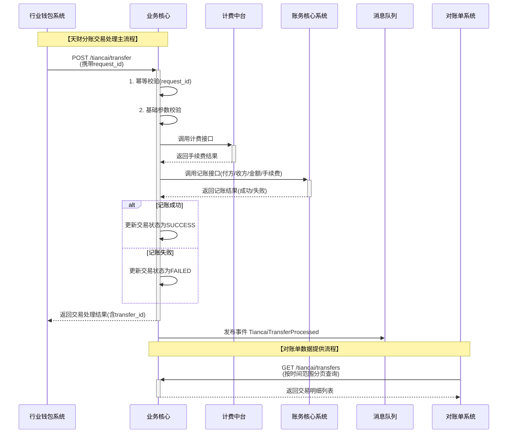

# 模块设计: 业务核心

生成时间: 2026-01-16 17:15:02

---

# 业务核心模块设计文档

## 1. 概述

**模块名称**: 业务核心 (Business Core)

**目的**:
业务核心模块是支付系统的交易处理中枢，负责接收、校验、路由和处理各类交易请求。在本“天财分账”业务上下文中，其核心职责是作为“天财分账”交易（即天财专用账户间的资金划转）的最终处理方，接收来自行业钱包系统的分账指令，完成交易记账、状态更新，并为对账单系统提供原始交易数据。

**范围**:
1.  **交易处理**: 接收并处理“天财分账”交易类型。
2.  **数据提供**: 存储并对外提供交易维度的详细数据，供对账单系统等下游模块消费。
3.  **交易路由**: 作为交易入口，根据交易类型将非“天财分账”交易路由至其他处理流程（此部分为现有能力，本文档聚焦新需求）。
4.  **与上游系统集成**: 明确与行业钱包系统的接口，确保分账指令的可靠接收与处理。

**非范围**:
- 账户管理、开户、关系绑定（由行业钱包、账户系统负责）。
- 资金清算、结算（由清结算系统负责）。
- 手续费计算（由计费中台负责）。
- 对账单生成（由对账单系统负责）。
- 协议签署、身份认证（由电子签约平台、认证系统负责）。

## 2. 接口设计

### 2.1 API 端点 (RESTful)

#### 2.1.1 接收天财分账交易
- **端点**: `POST /api/v1/tiancai/transfer`
- **描述**: 接收由行业钱包系统发起的“天财分账”交易指令。
- **认证**: 基于机构号(AppID)和签名验证。
- **请求头**:
    - `X-App-Id`: 发起方机构号（如天财机构号）。
    - `X-Nonce`: 随机数。
    - `X-Timestamp`: 时间戳。
    - `X-Signature`: 请求签名。
- **请求体 (JSON)**:
```json
{
  "request_id": "TC20240321153000123456", // 请求流水号，全局唯一
  "merchant_no": "888888880000001", // 付方收单商户号
  "payer_account_no": "TC_PAY_ACC_1001", // 付方天财账户号（收款账户或接收方账户）
  "payer_account_type": "TIANCAI_RECEIVE_ACCOUNT", // 付方账户类型: TIANCAI_RECEIVE_ACCOUNT, TIANCAI_RECEIVER_ACCOUNT
  "payee_account_no": "TC_RCV_ACC_2001", // 收方天财账户号
  "payee_account_type": "TIANCAI_RECEIVER_ACCOUNT", // 收方账户类型
  "amount": 10000, // 分账金额（单位：分）
  "currency": "CNY",
  "transfer_type": "COLLECTION", // 分账场景: COLLECTION(归集), BATCH_PAY(批量付款), MEMBER_SETTLE(会员结算)
  "business_ref_no": "ORDER_202403210001", // 业务参考号（如订单号）
  "remark": "门店A日终归集",
  "ext_info": { // 扩展信息
    "store_code": "STORE_001",
    "headquarters_code": "HQ_001"
  }
}
```
- **响应体 (JSON)**:
```json
{
  "code": "SUCCESS",
  "message": "处理成功",
  "data": {
    "transfer_id": "T20240321153000123456", // 系统生成的交易唯一ID
    "request_id": "TC20240321153000123456", // 原请求流水号
    "status": "PROCESSING", // 交易状态: PROCESSING, SUCCESS, FAILED
    "finish_time": "2024-03-21T15:30:05+08:00" // 可选，成功/失败时间
  }
}
```

#### 2.1.2 交易结果查询
- **端点**: `GET /api/v1/tiancai/transfer/{transfer_id}`
- **描述**: 根据交易ID查询天财分账交易结果。
- **响应体**:
```json
{
  "code": "SUCCESS",
  "message": "查询成功",
  "data": {
    "transfer_id": "T20240321153000123456",
    "request_id": "TC20240321153000123456",
    "merchant_no": "888888880000001",
    "payer_account_no": "TC_PAY_ACC_1001",
    "payee_account_no": "TC_RCV_ACC_2001",
    "amount": 10000,
    "currency": "CNY",
    "transfer_type": "COLLECTION",
    "status": "SUCCESS",
    "create_time": "2024-03-21T15:30:00+08:00",
    "finish_time": "2024-03-21T15:30:05+08:00",
    "fee": 0, // 手续费，由计费中台计算
    "remark": "门店A日终归集",
    "ext_info": {}
  }
}
```

#### 2.1.3 交易明细查询（供对账单系统调用）
- **端点**: `GET /api/v1/tiancai/transfers`
- **描述**: 按时间范围查询天财分账交易明细。**注意：此接口预计调用频率高，需做好性能优化和分页**。
- **查询参数**:
    - `start_time`: 查询开始时间 (ISO 8601)。
    - `end_time`: 查询结束时间 (ISO 8601)。
    - `merchant_no`: 付方商户号（可选）。
    - `transfer_type`: 分账场景（可选）。
    - `page_no`: 页码，从1开始。
    - `page_size`: 每页大小，最大1000。
- **响应体**:
```json
{
  "code": "SUCCESS",
  "message": "查询成功",
  "data": {
    "total": 1500,
    "page_no": 1,
    "page_size": 100,
    "list": [
      {
        "transfer_id": "T20240321153000123456",
        "request_id": "TC20240321153000123456",
        "merchant_no": "888888880000001",
        "payer_account_no": "TC_PAY_ACC_1001",
        "payer_account_type": "TIANCAI_RECEIVE_ACCOUNT",
        "payee_account_no": "TC_RCV_ACC_2001",
        "payee_account_type": "TIANCAI_RECEIVER_ACCOUNT",
        "amount": 10000,
        "currency": "CNY",
        "transfer_type": "COLLECTION",
        "status": "SUCCESS",
        "create_time": "2024-03-21T15:30:00+08:00",
        "finish_time": "2024-03-21T15:30:05+08:00",
        "business_ref_no": "ORDER_202403210001",
        "fee": 0,
        "remark": "门店A日终归集"
      }
      // ... 更多记录
    ]
  }
}
```

### 2.2 发布/消费的事件

#### 2.2.1 消费的事件
- **事件名称**: `TiancaiTransferRequested`
- **来源**: 行业钱包系统
- **描述**: 行业钱包系统在完成关系校验后，向业务核心发起分账指令。业务核心监听此事件（或通过API调用）来触发交易处理流程。
- **事件载荷**: 与 `POST /api/v1/tiancai/transfer` 请求体基本一致。

#### 2.2.2 发布的事件
- **事件名称**: `TiancaiTransferProcessed`
- **描述**: 当天财分账交易处理完成（成功或失败）时发布。
- **消费者**: 对账单系统、监控系统、可能的业务回调。
- **事件载荷**:
```json
{
  "event_id": "evt_123456789",
  "event_type": "TiancaiTransferProcessed",
  "timestamp": "2024-03-21T15:30:05+08:00",
  "data": {
    "transfer_id": "T20240321153000123456",
    "request_id": "TC20240321153000123456",
    "status": "SUCCESS",
    "amount": 10000,
    "payer_account_no": "TC_PAY_ACC_1001",
    "payee_account_no": "TC_RCV_ACC_2001",
    "merchant_no": "888888880000001",
    "finish_time": "2024-03-21T15:30:05+08:00"
  }
}
```

## 3. 数据模型

### 3.1 核心表设计

#### 表: `tiancai_transfer_record` (天财分账交易记录表)
存储所有天财分账交易的核心信息。

| 字段名 | 类型 | 必填 | 默认值 | 索引 | 说明 |
| :--- | :--- | :--- | :--- | :--- | :--- |
| `id` | BIGINT(20) | 是 | AUTO_INCREMENT | PK | 自增主键 |
| `transfer_id` | VARCHAR(32) | 是 | | UK | **系统交易唯一ID**，全局唯一 |
| `request_id` | VARCHAR(64) | 是 | | IDX | 上游（行业钱包）请求流水号 |
| `merchant_no` | VARCHAR(32) | 是 | | IDX | 付方收单商户号 |
| `payer_account_no` | VARCHAR(64) | 是 | | IDX | 付方天财账户号 |
| `payer_account_type` | VARCHAR(32) | 是 | | | 付方账户类型 |
| `payee_account_no` | VARCHAR(64) | 是 | | IDX | 收方天财账户号 |
| `payee_account_type` | VARCHAR(32) | 是 | | | 收方账户类型 |
| `amount` | DECIMAL(15,2) | 是 | | | 交易金额（元） |
| `currency` | VARCHAR(3) | 是 | ‘CNY’ | | 币种 |
| `transfer_type` | VARCHAR(32) | 是 | | IDX | 分账场景 |
| `business_ref_no` | VARCHAR(128) | 否 | | IDX | 业务参考号 |
| `status` | VARCHAR(32) | 是 | ‘PROCESSING’ | IDX | 交易状态 |
| `fee` | DECIMAL(15,2) | 否 | 0 | | 手续费（元） |
| `fee_rule_id` | VARCHAR(64) | 否 | | | 手续费规则ID |
| `remark` | VARCHAR(256) | 否 | | | 备注 |
| `ext_info` | JSON | 否 | | | 扩展信息，存储 `store_code`, `headquarters_code` 等 |
| `create_time` | DATETIME(3) | 是 | CURRENT_TIMESTAMP(3) | IDX | 创建时间 |
| `update_time` | DATETIME(3) | 是 | CURRENT_TIMESTAMP(3) ON UPDATE | | 更新时间 |
| `finish_time` | DATETIME(3) | 否 | | | 交易完成时间 |

**索引设计**:
- 主键: `id`
- 唯一索引: `uk_transfer_id` (`transfer_id`)
- 普通索引:
    - `idx_merchant_no_status` (`merchant_no`, `status`) — 用于商户维度查询
    - `idx_create_time` (`create_time`) — 用于对账单系统按时间范围拉取
    - `idx_request_id` (`request_id`) — 用于上游请求幂等校验
    - `idx_business_ref_no` (`business_ref_no`) — 用于业务关联查询
    - `idx_payer_account_no` (`payer_account_no`) — 用于付方账户查询
    - `idx_payee_account_no` (`payee_account_no`) — 用于收方账户查询

### 3.2 与其他模块的关系
- **行业钱包系统**: 业务核心的**上游调用方**。行业钱包发起分账请求 (`request_id` 关联)，业务核心处理并返回结果。
- **账务核心系统**: 业务核心的**下游调用方**。业务核心在交易处理中，调用账务核心的“转账/分账记账分录码”完成资金在账户系统底层的划转。
- **计费中台**: 业务核心的**下游调用方**。在处理交易时，调用计费中台计算手续费 (`fee_rule_id` 关联)。
- **对账单系统**: 业务核心的**数据提供方**。对账单系统通过查询接口或监听事件，获取天财分账交易明细，用于生成“机构天财分账指令账单”。
- **清结算系统**: **间接关联**。天财分账交易不直接涉及清结算，但交易双方账户的底层资金来源于清结算的结算动作。

## 4. 业务逻辑

### 4.1 核心处理流程
1.  **接收请求**: 通过API或消息队列接收来自行业钱包的 `TiancaiTransferRequested` 事件。
2.  **幂等校验**: 根据 `request_id` 检查是否已处理过相同请求，避免重复交易。
3.  **基础校验**:
    - 必填字段非空。
    - 金额大于0。
    - 付方账户号 ≠ 收方账户号。
    - 账户类型枚举值有效。
    - 分账场景枚举值有效。
4.  **调用计费**: 调用计费中台接口，计算本次分账交易的手续费。
5.  **调用账务记账**:
    - 组装请求，调用账务核心系统的“转账/分账记账分录码”接口。
    - 请求包含：付方账户、收方账户、金额、手续费、业务摘要等。
6.  **更新交易状态**:
    - 账务调用成功：更新交易状态为 `SUCCESS`，记录 `finish_time`。
    - 账务调用失败：更新交易状态为 `FAILED`，记录失败原因。
7.  **发布事件**: 交易处理完成后，发布 `TiancaiTransferProcessed` 事件。
8.  **响应上游**: 通过API同步返回处理结果给行业钱包系统。

### 4.2 业务规则
- **交易状态流**: `PROCESSING` -> (`SUCCESS` | `FAILED`)。仅支持单向流转。
- **手续费承担方**: 默认由付方承担。具体规则由计费中台根据业务场景 (`transfer_type`) 和协议确定。
- **交易时效**: 应保证交易的实时处理，目标在秒级内完成。
- **数据一致性**: 交易记录状态必须与账务核心的记账结果严格一致。

### 4.3 验证逻辑
- **接口签名验证**: 所有来自外部的API调用必须通过签名验证，防止伪造请求。
- **账户状态验证**: 账务核心在记账时会校验付方账户状态（是否冻结、余额是否充足），业务核心依赖其返回结果。
- **关系绑定验证**: **此校验已由上游行业钱包系统完成**。业务核心信任行业钱包的校验结果，不重复校验分账双方的关系绑定和协议状态。

## 5. 时序图



## 6. 错误处理

| 错误场景 | 错误码 | HTTP状态码 | 处理策略 |
| :--- | :--- | :--- | :--- |
| 请求签名验证失败 | `AUTH_SIGNATURE_INVALID` | 401 | 拒绝请求，记录安全日志。 |
| 请求参数缺失或格式错误 | `PARAMETER_INVALID` | 400 | 返回具体错误字段信息。 |
| 重复请求 (`request_id` 已存在) | `REQUEST_ID_DUPLICATE` | 409 | 查询原交易结果并返回，确保幂等。 |
| 计费中台服务不可用或超时 | `FEE_SERVICE_UNAVAILABLE` | 502 | 交易失败，状态置为`FAILED`，记录错误。需有重试或降级策略（如使用默认费率）。 |
| 账务核心服务不可用或超时 | `ACCOUNTING_SERVICE_UNAVAILABLE` | 502 | 交易失败，状态置为`FAILED`。此为关键依赖，需有报警和人工介入流程。 |
| 账务核心返回账户余额不足 | `ACCOUNT_INSUFFICIENT_BALANCE` | 200 (业务失败) | 交易失败，状态置为`FAILED`，具体原因记录在`remark`或扩展字段。 |
| 账务核心返回账户冻结 | `ACCOUNT_FROZEN` | 200 (业务失败) | 同上。 |
| 数据库异常 | `DATABASE_ERROR` | 500 | 交易失败，状态置为`FAILED`。记录详细日志，触发报警。 |

**通用策略**:
- **重试**: 对于暂时的网络超时或下游服务短暂不可用，可在业务核心层面实现有限次数的重试（特别是调用计费和账务时）。
- **补偿与对账**: 依赖每日对账单系统生成的账单，与行业钱包、账户系统进行资金和交易的对账，及时发现并处理异常数据。
- **监控与报警**: 对交易失败率、处理延迟、下游服务健康度进行监控，设置阈值报警。

## 7. 依赖说明

| 上游模块 | 交互方式 | 数据流 | 关键点 |
| :--- | :--- | :--- | :--- |
| **行业钱包系统** | 同步HTTP API (主) / 异步消息 (备) | 接收分账请求 (`request_id`, 账户信息，金额，场景) | 1. **强依赖**。需定义清晰的接口契约和降级方案。<br>2. 依赖其完成**关系绑定校验**，业务核心不再校验。<br>3. 需支持**幂等**处理。 |
| **计费中台** | 同步HTTP API | 请求计费，返回手续费金额和规则。 | 1. **弱依赖**。可考虑降级方案（如缓存费率、使用0费率），避免因计费失败阻塞核心交易。 |
| **账务核心系统** | 同步HTTP API | 请求执行资金划转的记账操作。 | 1. **强依赖**。交易成功的核心。<br>2. 需保证调用**高可用和低延迟**。<br>3. 业务核心交易状态必须与账务结果**强一致**。 |
| **下游模块** | 交互方式 | 数据流 | 关键点 |
| **对账单系统** | 同步HTTP API (查询) / 异步消息 (事件) | 提供交易明细数据。 | 1. 查询接口**频率高**，需做好数据库索引优化和查询限流。<br>2. 事件驱动可作为数据最终一致的补充。 |
| **监控/日志系统** | 日志输出 / 指标上报 | 输出处理日志、性能指标、错误信息。 | 用于系统可观测性。 |

**整体协调**:
业务核心在本方案中定位为**执行者**。其正确运行的前提是上游（行业钱包）已确保业务合法性（账户存在、关系绑定、协议生效）。业务核心的重点是保障交易处理的**高效、准确、可靠**，并与账务系统紧密协作，确保每一笔分账指令都能正确反映为底层账户的资金变动。