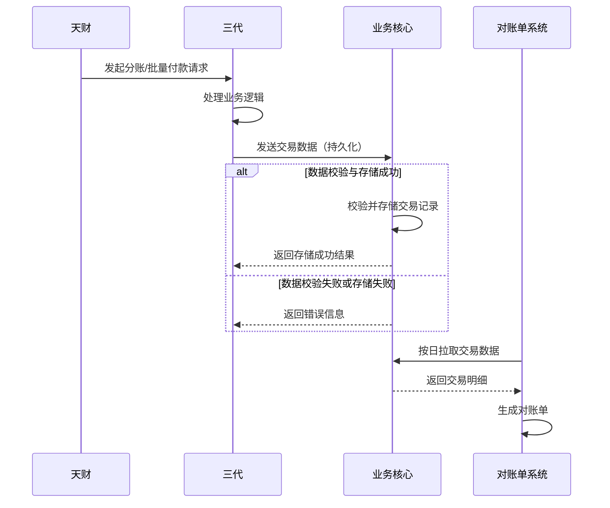

# 模块设计: 业务核心

生成时间: 2026-01-22 17:46:54
批判迭代: 2

---

# 业务核心模块设计文档

## 1. 概述
- **目的与范围**: 业务核心模块负责接收并存储天财发起的各类交易数据，特别是分账、批量付款等业务的核心交易记录。它是业务数据的持久化层，为下游的对账单生成、数据查询等提供数据支撑。其边界在于接收上游系统（如三代）的业务指令数据并落库，不涉及资金处理、账户操作或复杂的业务逻辑计算。

## 2. 接口设计
- **API端点 (REST/GraphQL)**: TBD
- **请求/响应结构**: TBD
- **发布/消费的事件**: TBD

## 3. 数据模型
- **表/集合**: TBD
- **关键字段**: TBD
- **与其他模块的关系**: 存储来自三代等上游模块的业务指令数据；为对账单系统提供原始交易数据以生成对账单。

## 4. 业务逻辑
- **核心工作流/算法**: 接收上游系统（如三代）传递的天财分账、批量付款等业务请求数据，进行必要的格式校验后，将交易信息（如交易流水号、机构号、金额、参与方信息、状态、时间戳等）持久化存储到数据库中。
- **业务规则与验证**: 对接收到的数据进行基础校验，如数据格式、必填字段、业务流水号唯一性等。
- **关键边界情况处理**: 处理数据重复提交、数据格式异常等场景，确保数据的一致性和完整性。

## 5. 时序图

## 6. 错误处理
- **预期错误情况**: 数据存储失败（如数据库连接异常）、接收到的数据格式错误、关键字段缺失、业务流水号冲突。
- **处理策略**: 对数据格式错误和字段缺失的请求直接返回错误；对存储失败进行重试机制；对流水号冲突进行幂等处理，确保数据不重复。

## 7. 依赖关系
- **上游模块**: 三代
- **下游模块**: 对账单系统