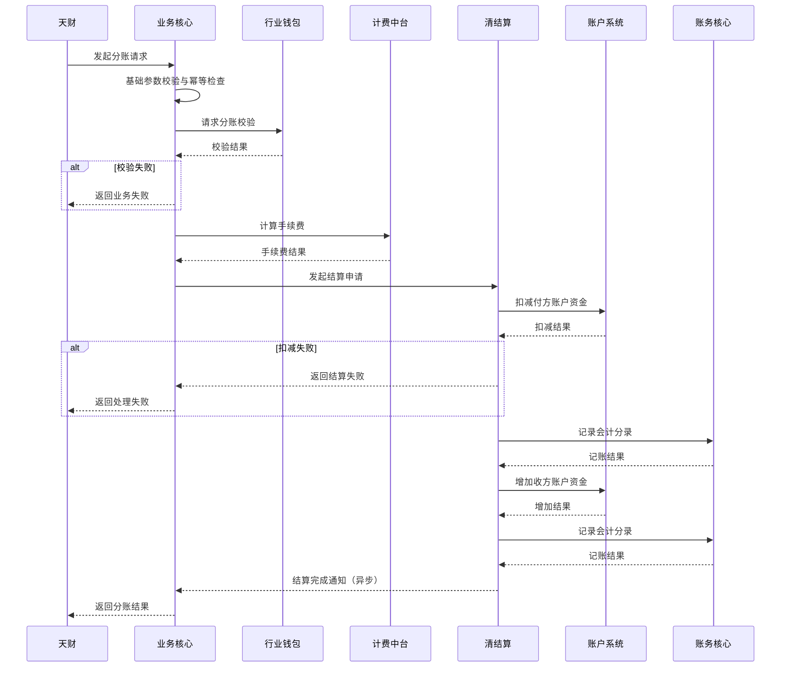

# 模块设计: 业务核心

生成时间: 2026-01-22 16:11:06
批判迭代: 2

---

# 业务核心模块设计文档

## 1. 概述
- **目的与范围**: 业务核心模块负责接收并处理来自天财平台的分账等交易数据，作为业务处理的入口和协调中心。其核心职责是接收业务请求，协调下游系统（如行业钱包、清结算、账户系统等）完成资金处理，并返回处理结果。其边界在于处理业务逻辑的流转与协调，不直接处理账户底层操作、清结算计算或风险判定。

## 2. 接口设计
- **API端点 (REST/GraphQL)**: TBD
- **请求/响应结构**: TBD
- **发布/消费的事件**: TBD

## 3. 数据模型
- **表/集合**: TBD
- **关键字段**: TBD
- **与其他模块的关系**: 业务核心模块处理的数据与天财、行业钱包、清结算等模块的业务状态紧密相关，但具体的数据库表关联关系TBD。

## 4. 业务逻辑
- **核心工作流/算法**: 主要业务流程是处理"天财分账"请求。模块接收分账指令后，需协调行业钱包进行分账请求校验，调用计费中台计算手续费，通过清结算发起结算，并最终驱动账户系统和账务核心完成资金划转与记账。模块需维护一个核心业务订单状态机，以管理请求的整个生命周期。
- **业务规则与验证**: 业务核心自身主要负责请求的格式、基础参数校验。更深层次的业务规则（如账户状态、余额、关系授权）校验由下游模块（如行业钱包）负责。
- **关键边界情况处理**: 在处理流程中，需处理下游系统调用失败、超时等异常情况，确保事务一致性或发起冲正。需处理清结算结果推送的异步回调，更新业务状态。所有关键接口需支持幂等性处理，防止重复请求导致资金风险。
- **协调逻辑说明**: 对下游模块的调用采用同步与异步结合的模式。对行业钱包的校验、计费中台的手续费计算采用同步调用。对清结算的结算申请采用同步调用发起，但结算结果通过异步消息回调通知。模块需维护请求状态，并处理回调超时等异常。

## 5. 时序图

## 6. 错误处理
- **预期错误情况**: 可能的错误类型包括：请求参数非法、下游服务（行业钱包、清结算等）不可用、下游服务返回业务失败（如余额不足、账户状态异常）、网络超时、异步结果回调超时等。
- **处理策略**: 对于参数错误，直接返回客户端错误。对于下游服务不可用或超时，进行有限次重试或熔断降级，并返回系统繁忙。对于业务失败，将下游错误码和原因透传给调用方。对于关键资金操作，需设计补偿或冲正机制，防止数据不一致。异步回调超时需有主动查询或对账机制确保最终一致性。
- **幂等性保证**: 通过业务唯一请求号进行幂等控制，避免重复处理。

## 7. 依赖关系
- **上游模块**: 天财（业务请求来源）。
- **下游模块**: 行业钱包（分账校验）、清结算（资金清算与结算驱动）、计费中台（手续费计算）、账户系统（资金操作）、账务核心（记账）。