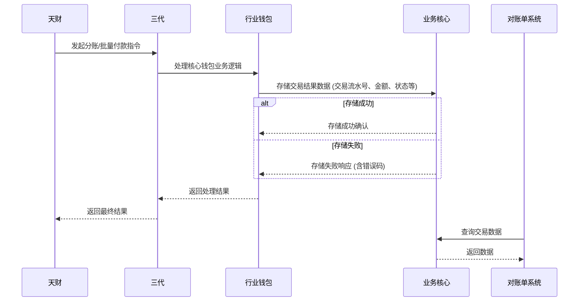

# 模块设计: 交易系统

生成时间: 2026-01-22 17:46:59
批判迭代: 2

---

# 业务核心 模块设计文档

## 1. 概述
- **目的与范围**: 本模块（别名：交易系统）负责接收并存储由天财平台发起的各类交易数据，包括分账、批量付款、会员结算等交易结果。它是业务数据的核心存储节点，为下游的对账、查询等业务提供数据支撑。其边界在于接收并持久化交易数据，不涉及交易指令的处理、资金流转或账户操作。

## 2. 接口设计
- **API端点 (REST/GraphQL)**: TBD
- **请求/响应结构**: TBD
- **发布/消费的事件**: TBD

## 3. 数据模型
- **表/集合**: TBD
- **关键字段**: TBD
- **与其他模块的关系**: 本模块存储的交易数据，被“对账单系统”用于生成分账对账单、提款对账单等。

## 4. 业务逻辑
- **核心工作流/算法**: 接收来自上游（如“三代”或“行业钱包”）处理完成的分账、批量付款、会员结算等交易结果，将交易的核心信息进行持久化存储。
- **业务规则与验证**:
    - **数据完整性校验**: 验证请求中交易流水号、金额、参与方、状态、时间等关键字段是否齐全。
    - **重复记录检测**: 基于交易流水号进行幂等性校验，防止同一笔交易被重复记录。
    - **业务状态验证**: 验证交易状态是否符合业务预期（如“成功”、“失败”、“处理中”）。
- **关键边界情况处理**:
    - **数据存储失败**: 记录详细错误日志，并向上游返回明确的失败响应。
    - **数据冲突**: 当检测到重复交易流水号时，采用“最后写入优先”策略并记录审计日志。
    - **上游数据格式错误**: 拒绝处理并返回格式错误信息。

## 5. 时序图

## 6. 错误处理
- **预期错误情况**: 数据库连接异常、数据写入失败、上游数据格式错误、重复交易流水号。
- **处理策略**:
    - **重试机制**: 对于暂时性数据库错误，配置有限次数的重试。
    - **幂等性保证**: 依赖交易流水号作为幂等键，确保重复请求不会产生重复数据。
    - **告警策略**: 记录详细错误日志，并对持续性的存储失败或高频格式错误进行监控告警。

## 7. 依赖关系
- **上游模块**: 三代， 行业钱包
- **下游模块**: 对账单系统