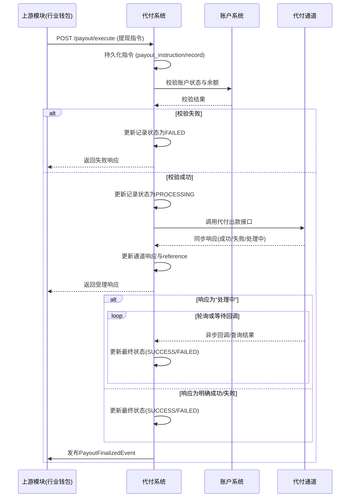

# 模块设计: 代付系统

生成时间: 2026-01-22 17:47:17
批判迭代: 2

---

# 代付系统模块设计文档

## 1. 概述
- **目的与范围**：本模块负责调用外部代付通道，执行从天财收款账户或天财接收方账户到用户绑定银行卡的实时提款出款指令。其核心职责是接收上游模块的提现指令，与外部支付通道交互，完成资金出款，并同步出款结果。
- **模块边界**：本模块负责指令校验、通道调用、状态管理与结果同步。具体的账户状态、余额、绑定关系等校验逻辑需依赖**账户系统**与**行业钱包**模块提供的数据或接口。

## 2. 接口设计
- **API端点 (REST)**：
  - `POST /api/v1/payout/execute`：接收提现出款指令。
  - `POST /api/v1/payout/callback/{channel}`：接收代付通道的异步回调。
  - `GET /api/v1/payout/records/{payout_id}`：查询出款记录状态。
- **请求/响应结构**：
  - **执行出款请求 (`POST /api/v1/payout/execute`)**：
    ```json
    {
      "request_id": "string，上游请求唯一标识",
      "account_id": "string，出款账户ID（天财收款账户或天财接收方账户）",
      "amount": "integer，出款金额（单位：分）",
      "bank_card_ref": "string，绑定的银行卡标识",
      "channel_preference": "string，可选，通道偏好",
      "business_source": "string，业务来源（如：industry_wallet）"
    }
    ```
  - **执行出款响应**：
    ```json
    {
      "code": "string，响应码",
      "message": "string，响应消息",
      "data": {
        "payout_id": "string，代付系统内部出款流水号",
        "status": "string，受理状态（ACCEPTED, FAILED）",
        "channel_reference": "string，通道返回的参考号（如受理成功）"
      }
    }
    ```
  - **异步回调请求 (`POST /api/v1/payout/callback/{channel}`)**：
    - 结构由具体代付通道定义，本模块负责适配解析。
- **发布/消费的事件**：
  - **消费事件**：TBD（上游模块发出的提现指令事件，格式待定义）。
  - **发布事件**：
    - `PayoutFinalizedEvent`：出款最终结果（成功/失败）事件，包含 `payout_id`, `final_status`, `channel_response`, `completion_time`。

## 3. 数据模型
- **表/集合**：
  - **payout_instruction (出款指令表)**：存储接收到的原始出款指令。
  - **payout_record (出款记录表)**：存储每笔出款的核心执行记录与状态。
- **关键字段**：
  - **payout_instruction**:
    - `id` (主键),
    - `request_id` (上游请求ID，唯一索引),
    - `account_id`,
    - `amount`,
    - `bank_card_ref`,
    - `business_source`,
    - `original_request` (原始请求JSON),
    - `created_at`
  - **payout_record**:
    - `payout_id` (主键),
    - `instruction_id` (外键，关联payout_instruction.id),
    - `status` (状态: INIT, VALIDATING, PROCESSING, SUCCESS, FAILED, MANUAL),
    - `channel_code` (通道编码),
    - `channel_request` (发送给通道的请求),
    - `channel_response` (通道的响应),
    - `channel_reference` (通道流水号),
    - `retry_count` (重试次数),
    - `next_retry_time` (下次重试时间),
    - `finalized_at` (最终状态时间),
    - `error_code` (错误码),
    - `error_message` (错误信息),
    - `created_at`,
    - `updated_at`
- **与其他模块的关系**：
  - 通过 `account_id` 与 **账户系统** 管理的账户关联，用于余额扣减。
  - 通过 `business_source` 标识指令来源模块（如 **行业钱包**）。

## 4. 业务逻辑
- **核心工作流**：
  1.  **指令接收与持久化**：接收上游（如**行业钱包**）的提现指令，存入 `payout_instruction` 表，并创建初始状态的 `payout_record`。
  2.  **指令校验**：
      - 调用 **账户系统** 接口，验证 `account_id` 是否存在、状态是否正常（非冻结）、类型是否为天财收款账户或天财接收方账户。
      - 调用 **行业钱包** 或相关模块接口，验证 `account_id` 与 `bank_card_ref` 的绑定关系是否有效。
      - 调用 **账户系统** 接口，验证账户可用余额是否大于等于出款金额。
      - 任一校验失败，则出款记录状态置为 `FAILED`，并记录错误原因。
  3.  **通道调用**：校验通过后，状态转为 `PROCESSING`。组装通道特定参数，调用代付通道出款接口。
  4.  **结果处理**：
      - **同步返回**：处理通道接口的同步响应。若返回明确成功或失败，则更新记录状态为 `SUCCESS` 或 `FAILED`，并尝试通知上游。
      - **异步处理**：若通道返回“处理中”，则记录 `channel_reference`，等待异步回调或启动轮询。
  5.  **状态同步**：出款达到终态（`SUCCESS`/`FAILED`）后，发布 `PayoutFinalizedEvent` 通知上游模块，并更新 `finalized_at`。
- **业务规则与验证**：
  - 状态机：`INIT` -> `VALIDATING` -> `PROCESSING` -> (`SUCCESS` | `FAILED` | `MANUAL`)。
  - 仅当状态为 `PROCESSING` 且未超时前，才接受对应 `channel_reference` 的回调。
  - 对于“处理中”状态，若超过配置的超时时间（如30分钟）仍未收到回调，则将状态置为 `MANUAL`，需人工介入排查。
- **关键边界情况处理**：
  - **通道调用超时/网络异常**：触发重试机制。重试次数可配置（如3次），采用指数退避策略。
  - **通道返回“处理中”**：启动后台定时任务，根据 `channel_reference` 向通道查询订单状态，直到超时。
  - **余额不足**：校验阶段失败，直接返回失败，不调用通道。
  - **重复请求**：通过 `request_id` 唯一索引防止同一指令重复处理。

## 5. 时序图



## 6. 错误处理
- **预期错误情况**：
  - **校验错误**：账户不存在、账户冻结、余额不足、银行卡未绑定。处理：立即失败，状态 `FAILED`，错误码 `VALIDATION_FAILED`。
  - **通道调用错误**：网络超时、连接拒绝、通道系统异常。处理：触发重试机制。
  - **通道业务错误**：银行卡信息错误、账户受限、日限额超限。处理：记录具体错误码，状态 `FAILED`，不重试。
  - **异步结果超时**：未在约定时间内收到回调。处理：状态置为 `MANUAL`，错误码 `RESULT_TIMEOUT`。
- **处理策略**：
  - **重试策略**：仅对网络超时等可重试错误进行重试。最大重试次数：3次。重试间隔：指数退避（如 2s, 4s, 8s）。
  - **状态管理**：通过状态机确保逻辑一致性，终态记录不可变。
  - **监控与告警**：对 `FAILED` 和 `MANUAL` 状态记录进行监控，并设置阈值告警。

## 7. 依赖关系
- **上游模块**：
  - **行业钱包**：作为核心上游，发起会员结算、批量付款等场景下的提现指令。需提供 `account_id`, `bank_card_ref` 等关键信息。
- **下游模块**：
  - **账户系统**：提供账户信息、状态、余额的实时查询与扣减能力。
  - **代付通道**：外部支付服务提供商，提供资金出款接口。
- **内部依赖**：
  - 消息中间件（用于事件发布）。
  - 定时任务调度器（用于轮询“处理中”订单）。