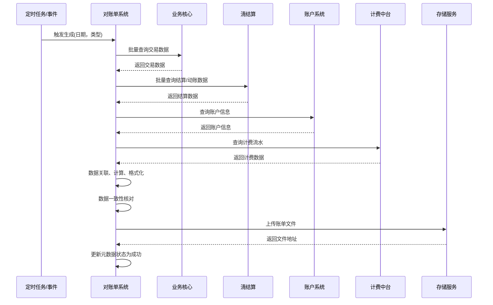
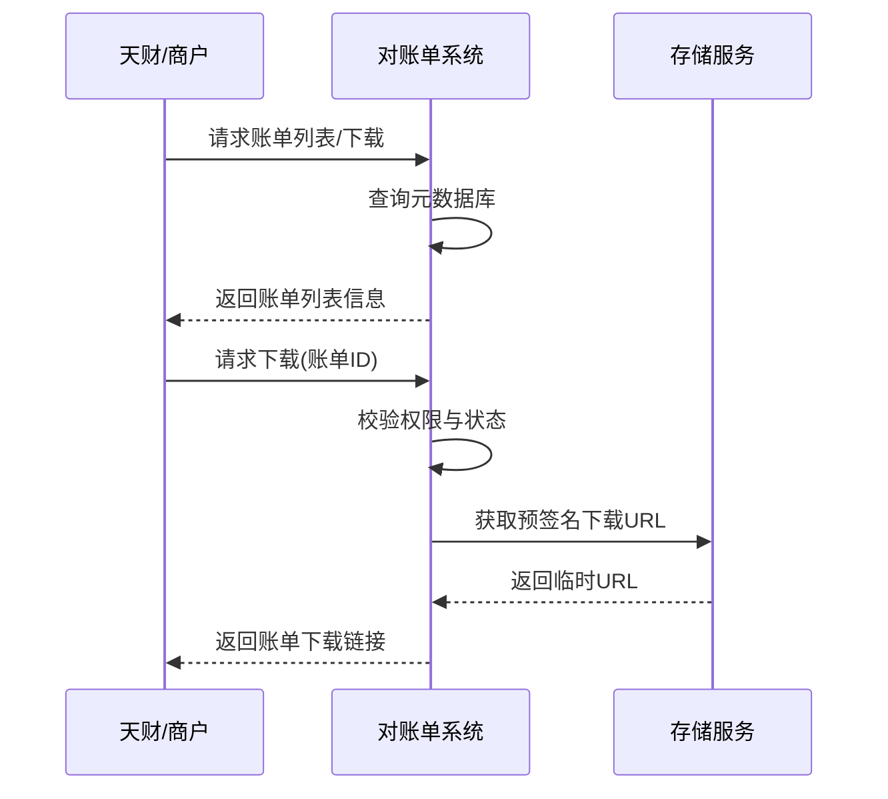

# 模块设计: 对账单系统

生成时间: 2026-01-22 17:47:20
批判迭代: 2

---

# 对账单系统模块设计文档

## 1. 概述
- **目的与范围**: 本模块负责生成和提供各类对账单，包括交易明细、结算明细、账户动账明细以及分账、提款等特定业务账单，用于支持天财、商户及内部系统进行资金核对。核心职责包括按计划批量生成账单文件、提供账单查询与下载接口、确保账单数据与源系统的一致性。

## 2. 接口设计
- **API端点 (REST)**: 
  - `POST /api/v1/statements/generate`: 触发账单生成任务。请求体需包含账单类型、账单日期、机构号等参数。
  - `GET /api/v1/statements`: 查询账单列表。支持按机构号、账单类型、账单日期范围、状态等条件筛选。
  - `GET /api/v1/statements/{statementId}/download`: 获取指定账单的下载链接。
  - `GET /api/v1/statements/reconciliation/{date}`: 触发指定日期的对账核对，并返回核对结果摘要。
- **请求/响应结构**: TBD
- **发布/消费的事件**: 
  - 消费事件：`DailySettlementCompletedEvent`（来自清结算，触发日终账单生成）、`TransactionBatchImportedEvent`（来自业务核心，触发交易明细账单生成）。
  - 发布事件：`StatementGeneratedEvent`（账单生成完成事件，包含账单ID、类型、存储路径）。

## 3. 数据模型
- **表/集合**:
  - `statement_metadata`（账单元数据表）：存储账单生成任务的基本信息、状态和结果。
  - `statement_line_item`（账单明细表）：存储构成账单的每一行明细数据，关联到元数据。
  - `reconciliation_log`（对账日志表）：记录与上游系统数据核对的详细结果。
- **关键字段**:
  - `statement_metadata`: `statement_id`（主键）， `statement_type`（枚举：交易、结算、动账、分账、提款）， `statement_date`， `institution_id`（机构号）， `status`（生成中、成功、失败）， `file_path`， `generated_at`， `checksum`。
  - `statement_line_item`: `id`， `statement_id`（外键）， `line_data`（JSON，存储明细字段如交易流水号、金额、时间、对手方等）， `source_system`（数据来源系统）。
  - `reconciliation_log`: `log_id`， `reconciliation_date`， `statement_type`， `institution_id`， `source_total_amount`， `statement_total_amount`， `difference`， `status`（一致、不一致）， `detail`。
- **与其他模块的关系**: 本模块依赖**业务核心**获取交易数据，依赖**清结算**获取结算与动账数据，依赖**账户系统**获取账户信息，依赖**计费中台**获取计费流水。数据通过事件或API异步获取。

## 4. 业务逻辑
- **核心工作流/算法**:
  1.  **触发与调度**: 主要采用“按日”批量生成模式。通过定时任务（如每日凌晨01:00）扫描待生成账单日期，或监听上游系统（如清结算）发布的日终完成事件自动触发。支持“按需”通过管理API手动触发指定日期和类型的账单生成，并确保幂等性（基于`机构号+账单类型+账单日期`校验是否已存在成功账单）。
  2.  **数据获取与加工**: 根据账单类型，调用相应上游系统的数据接口或消费其事件消息，获取原始明细数据。对于分账、提款账单，需关联**业务核心**的交易数据、**清结算**的结算流水、**计费中台**的手续费流水以及**账户系统**的账户信息。进行必要的字段映射、格式转换与金额汇总（如按商户汇总交易总额、手续费总额、净结算额）。
  3.  **文件生成与存储**: 将加工后的数据按预设格式生成文件。格式包括CSV和Excel，字段模板根据账单类型预定义（例如，交易结算账单包含字段：交易日期、交易流水号、商户号、交易金额、手续费、结算金额、结算状态、结算时间）。文件生成后上传至对象存储服务，并记录元数据。
  4.  **数据核对**: 账单生成后，执行核对逻辑。将账单中的关键汇总数据（如总交易笔数、总金额）与从上游系统直接查询的原始汇总数据进行比对。若不一致，则记录差异详情至`reconciliation_log`表，并触发告警通知运营人员，账单状态标记为“待核查”。
- **业务规则与验证**: 账单数据需与上游系统源数据核对，确保金额、笔数一致。账单生成需遵循固定的时间窗口和频率。不同机构号的数据隔离。
- **关键边界情况处理**: 处理上游数据延迟或缺失的情况，采用指数退避策略进行重试，并支持次日的补单机制。账单生成失败时记录错误日志，发出告警，并提供手动重试界面。

## 5. 时序图

### 5.1 批量生成流程（定时/事件触发）

### 5.2 账单下载流程（用户请求）

## 6. 错误处理
- **预期错误情况**: 上游数据源（业务核心、清结算等）服务不可用或超时；查询到的数据不一致；文件生成过程中发生IO错误；存储服务上传失败；核对结果不一致。
- **处理策略**: 
  - 对依赖服务调用设置合理超时，并实现带熔断机制的客户端重试。
  - 数据不一致时，记录详细差异至`reconciliation_log`，并触发高级别告警，通知相关人员介入处理。账单状态标记为异常，阻止自动推送。
  - 文件生成或上传失败时，任务状态标记为失败，记录错误信息。系统提供管理界面供运营手动查看失败任务并触发重试。
  - 所有未捕获异常均记录详细日志并触发系统告警。

## 7. 依赖关系
- **上游模块**: 
  - **业务核心**: 作为交易数据的权威来源，提供分账、提款等业务的原始交易记录。
  - **清结算**: 提供交易结算结果、资金动账明细的权威数据。
  - **账户系统**: 提供账户基础信息（如账户号、账户类型）。
  - **计费中台**: 提供与交易相关的计费流水，用于计算手续费并纳入账单。
- **下游模块**: 
  - **天财平台**: 主要账单消费方，下载对账文件进行资金核对。
  - **商户后台**: 商户查看和下载自身相关的对账单。
  - **内部运营系统**: 运营人员管理账单生成任务、查看核对异常。