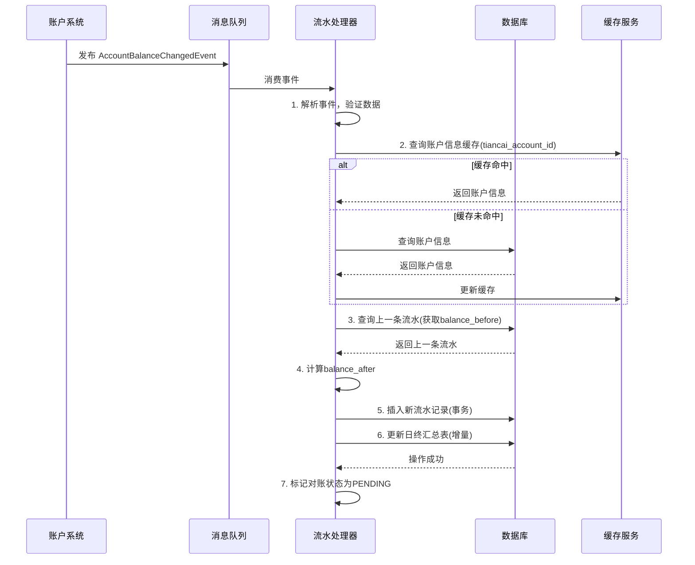
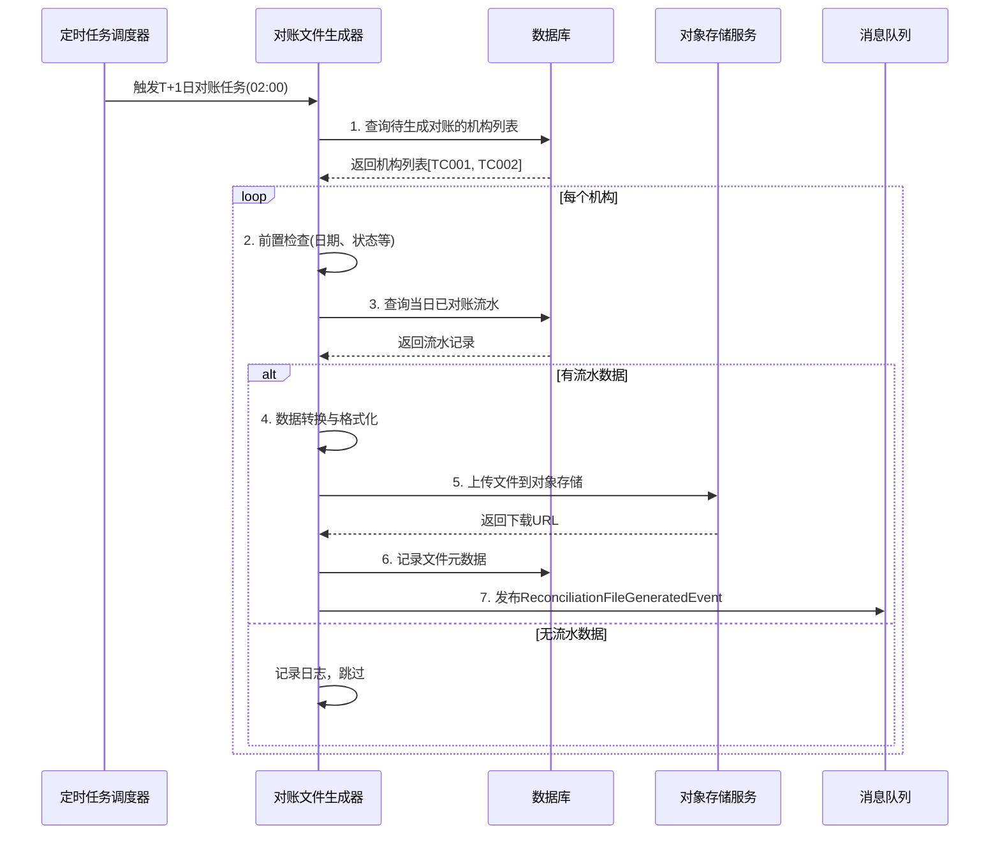
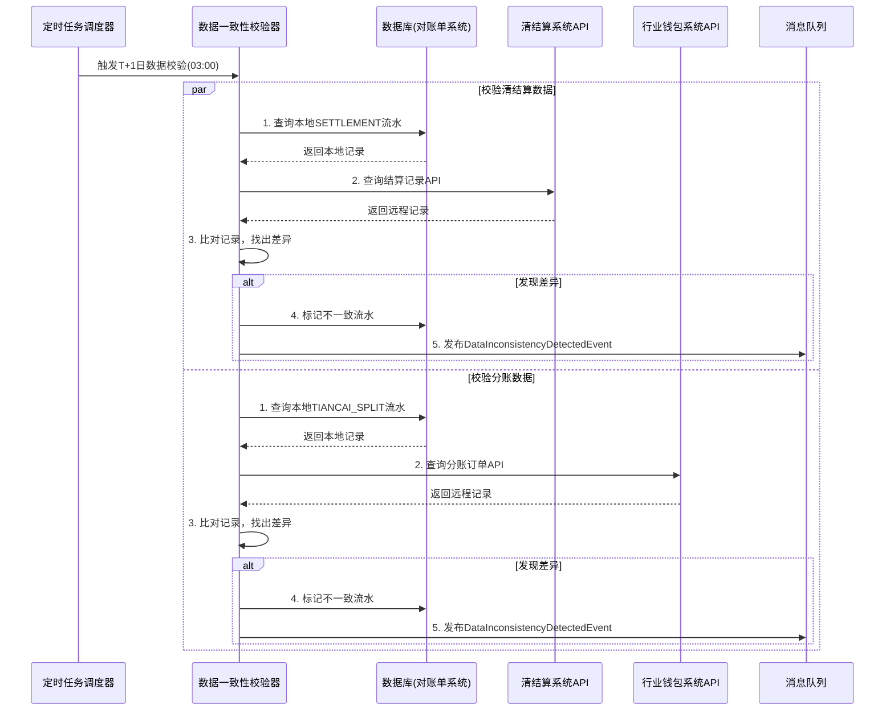

# 模块设计: 对账单系统

生成时间: 2026-01-19 15:37:32

---

# 模块设计: 对账单系统

生成时间: 2026-01-19

---

# 对账单系统模块设计文档

## 1. 概述

### 1.1 目的
对账单系统是“天财分账业务”的**统一账务数据聚合与呈现平台**。它负责从账户系统、清结算系统、行业钱包系统等多个上游模块采集资金变动、交易结算、分账指令等原始数据，经过清洗、关联、汇总后，为天财机构提供机构层面、账户层面、业务场景层面的各类对账单（如分账对账单、提款对账单、收单对账单）。本模块旨在为天财提供准确、及时、可追溯的资金流转视图，满足其对账、审计、财务核算和业务分析的核心需求。

### 1.2 范围
- **多源数据采集**：通过消费事件和主动查询，从账户系统、清结算系统、行业钱包系统等获取原始动账、结算、分账数据。
- **数据关联与聚合**：基于业务实体（如天财账户ID、商户号、交易流水号）将来自不同系统的异构数据进行关联，形成完整的业务链条视图。
- **对账单生成与提供**：
  - **分账对账单**：记录天财账户间的分账、归集、批量付款、会员结算等资金划转明细。
  - **提款对账单**：记录从天财接收方账户提现至银行卡的资金流出明细。
  - **收单对账单**：记录收单交易资金从待结算账户结算至天财收款账户的明细。
  - **账户动账明细**：提供单个天财账户的所有资金变动流水。
- **对账文件生成与分发**：按机构、日期、业务类型生成标准格式（CSV/Excel）的对账文件，支持下载或推送。
- **查询与报表服务**：为运营后台、天财机构提供多维度的账务查询和统计报表API。
- **数据一致性保障**：建立对账机制，核对上下游系统数据，及时发现并预警差异。

## 2. 接口设计

### 2.1 API端点 (RESTful)

#### 2.1.1 对账单查询与下载接口
- **GET /api/v1/tiancai/reconciliations**
    - **描述**：查询对账单列表，支持按机构、日期、业务类型、账户等多维度筛选。
    - **查询参数**：
      ```
      institution_code=TC001
      reconciliation_date=2025-01-19
      biz_type=SPLIT_ORDER  // SPLIT_ORDER(分账)/WITHDRAWAL(提款)/ACQUIRING(收单)/ALL
      tiancai_account_id=TCA_20231011001
      file_status=GENERATED  // GENERATED/AVAILABLE/EXPIRED
      page=1
      page_size=50
      ```
    - **响应体**：
      ```json
      {
        "code": "SUCCESS",
        "data": {
          "total": 5,
          "items": [
            {
              "reconciliation_id": "REC_TC001_20250119_SPLIT",
              "institution_code": "TC001",
              "reconciliation_date": "2025-01-19",
              "biz_type": "SPLIT_ORDER",
              "file_name": "TC001_分账对账_20250119.csv",
              "file_format": "CSV",
              "file_size": 102400,
              "download_url": "https://recon.example.com/download/REC_TC001_20250119_SPLIT",
              "record_count": 1500,
              "total_amount": 1500000.00,
              "status": "AVAILABLE",
              "generated_at": "2025-01-20T02:30:00Z",
              "expire_at": "2025-02-19T23:59:59Z"
            }
          ]
        }
      }
      ```

- **POST /api/v1/tiancai/reconciliations/generate**
    - **描述**：触发对账文件的即时生成（通常用于补单或测试）。
    - **请求体**：
      ```json
      {
        "institution_code": "TC001",
        "reconciliation_date": "2025-01-19",
        "biz_type": "SPLIT_ORDER",
        "file_format": "CSV"
      }
      ```
    - **响应体**：返回生成任务ID或直接返回文件信息。

#### 2.1.2 账户动账明细查询接口
- **GET /api/v1/tiancai/accounts/{tiancai_account_id}/ledger**
    - **描述**：查询指定天财账户在特定时间范围内的所有资金变动明细。
    - **查询参数**：
      ```
      start_time=2025-01-19T00:00:00Z
      end_time=2025-01-19T23:59:59Z
      biz_type=TIANCAI_SPLIT,SETTLEMENT,WITHDRAWAL  // 可选，过滤业务类型
      min_amount=0.01
      max_amount=100000.00
      page=1
      page_size=100
      ```
    - **响应体**：
      ```json
      {
        "code": "SUCCESS",
        "data": {
          "account_id": "TCA_20231011001",
          "account_role": "HEADQUARTERS",
          "currency": "CNY",
          "start_balance": 50000.00, // 期初余额
          "end_balance": 165000.00,  // 期末余额
          "total_credit": 120000.00, // 期间总入账
          "total_debit": 5000.00,    // 期间总出账
          "items": [
            {
              "sequence_no": "202501190001",
              "occurred_at": "2025-01-19T10:05:00Z",
              "biz_trade_no": "TC_TRANS_001",
              "biz_type": "TIANCAI_SPLIT",
              "biz_scene": "COLLECTION",
              "counterparty_account_id": "TCA_20231011002",
              "counterparty_name": "天财朝阳门店",
              "direction": "CREDIT", // CREDIT(入账)/DEBIT(出账)
              "amount": 10000.00,
              "balance_after": 60000.00,
              "remark": "门店日结归集",
              "ext_info": {
                "split_order_id": "SO_202501190001",
                "wallet_order_id": "WO_202501190001"
              }
            },
            {
              "sequence_no": "202501190002",
              "occurred_at": "2025-01-20T02:00:00Z",
              "biz_trade_no": "STL_M100001_20250119",
              "biz_type": "SETTLEMENT",
              "counterparty_account_id": "SYSTEM",
              "counterparty_name": "清结算系统",
              "direction": "CREDIT",
              "amount": 110000.00,
              "balance_after": 170000.00,
              "remark": "T+1日收单结算",
              "ext_info": {
                "settle_date": "2025-01-19",
                "trade_count": 100
              }
            }
          ]
        }
      }
      ```

#### 2.1.3 业务对账汇总接口
- **GET /api/v1/tiancai/institutions/{institution_code}/summary**
    - **描述**：查询天财机构在指定日期的各类业务汇总数据，用于仪表盘或快速对账。
    - **查询参数**：
      ```
      summary_date=2025-01-19
      ```
    - **响应体**：
      ```json
      {
        "code": "SUCCESS",
        "data": {
          "institution_code": "TC001",
          "summary_date": "2025-01-19",
          "accounts_summary": {
            "total_count": 50,
            "active_count": 48,
            "total_balance": 3500000.00
          },
          "settlement_summary": {
            "total_amount": 1500000.00,
            "total_fee": 3000.00,
            "net_amount": 1497000.00,
            "merchant_count": 20
          },
          "split_summary": {
            "total_count": 120,
            "total_amount": 800000.00,
            "by_scene": {
              "COLLECTION": {"count": 100, "amount": 500000.00},
              "BATCH_PAY": {"count": 15, "amount": 250000.00},
              "MEMBER_SETTLE": {"count": 5, "amount": 50000.00}
            }
          },
          "withdrawal_summary": {
            "total_count": 30,
            "total_amount": 200000.00,
            "success_count": 28,
            "processing_count": 2
          }
        }
      }
      ```

#### 2.1.4 数据一致性校验接口（内部/管理用）
- **POST /api/internal/tiancai/reconciliations/verify**
    - **描述**：触发指定日期和业务类型的数据一致性校验，比对上下游系统数据。
    - **请求体**：
      ```json
      {
        "institution_code": "TC001",
        "verify_date": "2025-01-19",
        "biz_type": "SPLIT_ORDER",
        "force_regenerate": false
      }
      ```
    - **响应体**：返回校验结果，包括差异明细。

### 2.2 发布/消费的事件

#### 2.2.1 消费的事件
1. **AccountBalanceChangedEvent** (来自账户系统)
    - **Topic**: `account.events.balance.changed`
    - **处理逻辑**：核心数据源。消费账户余额变动事件，解析业务类型，记录到`account_ledger`表，并更新相关聚合数据。
2. **SettlementCompletedEvent** (来自清结算系统)
    - **Topic**: `settlement.events.completed`
    - **处理逻辑**：消费结算完成事件，记录收单结算明细，关联到对应的天财收款账户。
3. **SplitOrderCompletedEvent** (来自行业钱包系统)
    - **Topic**: `wallet.events.split_order.completed`
    - **处理逻辑**：消费分账订单完成事件，记录分账业务明细，关联付方和收方账户。
4. **WithdrawalOrderCompletedEvent** (来自提现系统，假设存在)
    - **Topic**: `withdrawal.events.order.completed`
    - **处理逻辑**：消费提现订单完成事件，记录从天财接收方账户提现至银行卡的明细。
5. **TiancaiAccountCreatedEvent** (来自账户系统)
    - **Topic**: `account.events.tiancai.created`
    - **处理逻辑**：消费天财账户创建事件，在对账单系统创建账户基本信息记录，用于关联查询。

#### 2.2.2 发布的事件
1. **ReconciliationFileGeneratedEvent** (对账文件已生成)
    - **Topic**: `reconciliation.events.file.generated`
    - **触发时机**：日终对账文件生成并存储完成。
    - **Payload**:
    ```json
    {
      "event_id": "evt_recon_001",
      "event_type": "RECONCILIATION_FILE_GENERATED",
      "timestamp": "2025-01-20T02:30:00Z",
      "data": {
        "reconciliation_id": "REC_TC001_20250119_SPLIT",
        "institution_code": "TC001",
        "reconciliation_date": "2025-01-19",
        "biz_type": "SPLIT_ORDER",
        "file_name": "TC001_分账对账_20250119.csv",
        "file_path": "/reconciliations/2025/01/19/TC001_SPLIT.csv",
        "file_format": "CSV",
        "record_count": 1500,
        "total_amount": 1500000.00,
        "download_url": "https://recon.example.com/download/REC_TC001_20250119_SPLIT",
        "generated_at": "2025-01-20T02:30:00Z"
      }
    }
    ```
2. **DataInconsistencyDetectedEvent** (数据不一致告警)
    - **Topic**: `reconciliation.events.inconsistency.detected`
    - **触发时机**：在对账校验过程中发现上下游系统数据存在不可自动修复的差异。
    - **Payload**: 包含差异类型、涉及账户、日期、金额差异等详细信息。

## 3. 数据模型

### 3.1 核心表设计

#### 表：`account_ledger` (账户流水明细表)
| 字段名 | 类型 | 必填 | 默认值 | 描述 |
| :--- | :--- | :--- | :--- | :--- |
| `id` | bigint | Y | AUTO_INCREMENT | 主键 |
| `sequence_no` | varchar(32) | Y | | **流水序号**，按账户+时间生成，唯一索引 `uk_sequence_no` |
| `tiancai_account_id` | varchar(32) | Y | | **天财账户ID**，索引 `idx_account_id` |
| `account_role` | varchar(20) | Y | | 账户角色：`HEADQUARTERS`/`STORE`/`RECEIVER` |
| `occurred_at` | datetime(6) | Y | | **业务发生时间**（精确到毫秒），索引 `idx_occurred_at` |
| `recorded_at` | datetime | Y | CURRENT_TIMESTAMP | 系统记录时间 |
| `biz_date` | date | Y | | **业务日期**（用于按日分区和查询），索引 `idx_biz_date` |
| `biz_trade_no` | varchar(64) | Y | | **业务交易流水号**（来自上游系统），索引 `idx_biz_trade_no` |
| `biz_type` | varchar(30) | Y | | **业务类型**：`TIANCAI_SPLIT`/`SETTLEMENT`/`WITHDRAWAL`/`REFUND`/`FEE`/`ADJUSTMENT` |
| `biz_scene` | varchar(30) | N | | **业务场景**：`COLLECTION`/`BATCH_PAY`/`MEMBER_SETTLE`（仅TIANCAI_SPLIT有效） |
| `direction` | varchar(10) | Y | | **资金方向**：`CREDIT`(入账)/`DEBIT`(出账) |
| `amount` | decimal(15,2) | Y | | **变动金额**（元） |
| `balance_before` | decimal(15,2) | N | | 变动前余额（冗余，便于核对） |
| `balance_after` | decimal(15,2) | Y | | **变动后余额** |
| `currency` | varchar(3) | Y | `CNY` | 币种 |
| `counterparty_account_id` | varchar(32) | N | | **对手方天财账户ID**（如分账的另一方） |
| `counterparty_name` | varchar(100) | N | | 对手方名称（冗余，便于展示） |
| `remark` | varchar(500) | N | | 备注/摘要 |
| `ext_info_json` | json | N | | **扩展信息**（存储上游事件中的原始数据或关联ID） |
| `institution_code` | varchar(32) | Y | | **天财机构编码**，索引 `idx_institution` |
| `data_source` | varchar(20) | Y | | **数据来源**：`ACCOUNT_EVENT`/`SETTLEMENT_EVENT`/`WALLET_EVENT` |
| `recon_status` | varchar(20) | Y | `PENDING` | **对账状态**：`PENDING`/`RECONCILED`/`INCONSISTENT` |

#### 表：`reconciliation_file` (对账文件表)
| 字段名 | 类型 | 必填 | 默认值 | 描述 |
| :--- | :--- | :--- | :--- | :--- |
| `id` | bigint | Y | AUTO_INCREMENT | 主键 |
| `reconciliation_id` | varchar(32) | Y | | **对账文件ID**，唯一索引 `uk_reconciliation_id` |
| `institution_code` | varchar(32) | Y | | 天财机构编码，索引 `idx_institution` |
| `reconciliation_date` | date | Y | | **对账日期**，索引 `idx_reconciliation_date` |
| `biz_type` | varchar(30) | Y | | **业务类型**：`SPLIT_ORDER`/`WITHDRAWAL`/`ACQUIRING`/`ALL` |
| `file_name` | varchar(255) | Y | | 文件名 |
| `file_format` | varchar(10) | Y | `CSV` | 文件格式：`CSV`/`EXCEL` |
| `file_path` | varchar(512) | Y | | 文件存储路径（对象存储或本地） |
| `file_size` | bigint | N | | 文件大小（字节） |
| `download_url` | varchar(512) | N | | 下载链接（可能有时效性） |
| `record_count` | int | Y | 0 | 记录条数 |
| `total_amount` | decimal(15,2) | N | | 总金额（根据业务类型） |
| `checksum` | varchar(64) | N | | 文件校验和（MD5/SHA256） |
| `status` | varchar(20) | Y | `GENERATING` | 状态：`GENERATING`/`AVAILABLE`/`EXPIRED`/`DELETED` |
| `generated_at` | datetime | N | | 生成时间 |
| `expire_at` | datetime | N | | 链接过期时间 |
| `created_at` | datetime | Y | CURRENT_TIMESTAMP | |
| `updated_at` | datetime | Y | CURRENT_TIMESTAMP ON UPDATE | |

#### 表：`tiancai_account_info` (天财账户信息表)
| 字段名 | 类型 | 必填 | 默认值 | 描述 |
| :--- | :--- | :--- | :--- | :--- |
| `id` | bigint | Y | AUTO_INCREMENT | 主键 |
| `tiancai_account_id` | varchar(32) | Y | | **天财账户ID**，唯一索引 `uk_tiancai_account_id` |
| `merchant_no` | varchar(32) | Y | | 收单商户号，索引 `idx_merchant_no` |
| `account_role` | varchar(20) | Y | | 角色：`HEADQUARTERS`/`STORE`/`RECEIVER` |
| `account_type` | varchar(20) | Y | | 类型：`TIANCAI_RECEIVE`/`TIANCAI_RECEIVER` |
| `account_status` | varchar(20) | Y | `ACTIVE` | 账户状态 |
| `institution_code` | varchar(32) | Y | | 天财机构编码，索引 `idx_institution` |
| `account_name` | varchar(100) | N | | 账户名称（企业/门店名称） |
| `legal_person` | varchar(50) | N | | 法人/负责人 |
| `contact_phone` | varchar(20) | N | | 联系电话 |
| `created_at` | datetime | Y | | 账户创建时间 |
| `synced_at` | datetime | Y | CURRENT_TIMESTAMP | 信息同步时间 |

#### 表：`daily_summary` (日终汇总表)
| 字段名 | 类型 | 必填 | 默认值 | 描述 |
| :--- | :--- | :--- | :--- | :--- |
| `id` | bigint | Y | AUTO_INCREMENT | 主键 |
| `summary_date` | date | Y | | **汇总日期**，唯一键 `uk_date_institution_type` |
| `institution_code` | varchar(32) | Y | | **天财机构编码**，唯一键 `uk_date_institution_type` |
| `summary_type` | varchar(30) | Y | | **汇总类型**：`ACCOUNT`/`SETTLEMENT`/`SPLIT`/`WITHDRAWAL`，唯一键 `uk_date_institution_type` |
| `metric_key` | varchar(50) | Y | | **指标键**，如 `total_balance`, `split_count`, `settle_amount` |
| `metric_value` | decimal(20,2) | Y | | **指标值** |
| `dimension_json` | json | N | | **维度信息**（如按场景、按账户角色等分组） |
| `calculated_at` | datetime | Y | CURRENT_TIMESTAMP | 计算时间 |

### 3.2 与其他模块的关系
- **账户系统**：
  - 消费`AccountBalanceChangedEvent`作为核心流水数据源。
  - 通过`tiancai_account_id`关联，可能需要调用查询接口补全账户信息。
- **清结算系统**：
  - 消费`SettlementCompletedEvent`获取收单结算明细。
  - 可能需要调用查询接口获取结算汇总数据。
- **行业钱包系统**：
  - 消费`SplitOrderCompletedEvent`获取分账业务明细。
  - 可能需要调用查询接口获取分账订单详情。
- **三代系统/业务核心**：
  - 通过`institution_code`和`merchant_no`关联机构与商户信息。
  - 为三代系统的运营后台提供对账数据查询服务。
- **文件存储服务**：存储生成的对账文件，提供下载链接。

## 4. 业务逻辑

### 4.1 核心算法与规则

#### 4.1.1 事件处理与流水记录算法
```python
class AccountLedgerProcessor:
    
    def process_balance_changed_event(self, event: AccountBalanceChangedEvent):
        """
        处理账户余额变动事件，记录流水
        1. 解析事件，映射业务类型和场景
        2. 关联天财账户信息
        3. 计算变动前后余额（可能需要查询当前余额）
        4. 记录流水，标记对账状态
        """
        # 1. 解析事件
        account_id = event.data['account_no']  # 需要映射为tiancai_account_id
        biz_trade_no = event.data['biz_trade_no']
        biz_type = self.map_biz_type(event.data['biz_type'])
        
        # 2. 获取账户信息（缓存或查询）
        account_info = self.get_account_info(account_id)
        if not account_info:
            logger.warning(f"账户信息不存在: {account_id}, 事件丢弃")
            return
        
        # 3. 计算余额（对于首次记录，可能需要查询期初余额）
        # 假设事件中已包含变动金额和方向，我们需要计算变动后余额
        # 实际可能需要查询账户系统或基于上一条流水计算
        balance_before, balance_after = self.calculate_balances(
            account_id, event.data['direction'], event.data['amount'], biz_trade_no
        )
        
        # 4. 构建流水记录
        ledger_entry = AccountLedger(
            sequence_no=self.generate_sequence_no(account_id),
            tiancai_account_id=account_info.tiancai_account_id,
            account_role=account_info.account_role,
            occurred_at=event.timestamp,
            biz_date=event.timestamp.date(),
            biz_trade_no=biz_trade_no,
            biz_type=biz_type,
            biz_scene=self.extract_biz_scene(event.data),
            direction=event.data['direction'],
            amount=event.data['amount'],
            balance_before=balance_before,
            balance_after=balance_after,
            currency=event.data.get('currency', 'CNY'),
            counterparty_account_id=self.extract_counterparty(event.data),
            counterparty_name=self.get_counterparty_name(event.data),
            remark=self.generate_remark(event.data),
            ext_info_json=event.data.get('ext_info', {}),
            institution_code=account_info.institution_code,
            data_source='ACCOUNT_EVENT',
            recon_status='PENDING'
        )
        
        # 5. 保存流水（事务内）
        with transaction.atomic():
            ledger_entry.save()
            # 更新日终汇总数据（增量更新）
            self.update_daily_summary(ledger_entry)
    
    def map_biz_type(self, original_biz_type):
        """
        将上游系统的业务类型映射为对账单系统的标准业务类型
        """
        mapping = {
            'TIANCAI_SPLIT': 'TIANCAI_SPLIT',
            'SETTLEMENT': 'SETTLEMENT',
            'REFUND': 'REFUND',
            'FEE_DEDUCTION': 'FEE',
            'ADJUSTMENT': 'ADJUSTMENT',
            'WITHDRAWAL': 'WITHDRAWAL'
        }
        return mapping.get(original_biz_type, 'OTHER')
```

#### 4.1.2 对账文件生成算法
```python
class ReconciliationFileGenerator:
    
    def generate_daily_reconciliation(self, institution_code, recon_date, biz_type):
        """
        生成日终对账文件
        1. 查询指定日期和业务类型的流水数据
        2. 按业务类型进行数据转换和格式化
        3. 生成文件并上传到存储服务
        4. 记录文件元数据，发布生成事件
        """
        # 1. 查询流水数据
        query_filters = {
            'institution_code': institution_code,
            'biz_date': recon_date,
            'recon_status': 'RECONCILED'  # 只使用已对账的数据
        }
        
        if biz_type != 'ALL':
            query_filters['biz_type'] = self.map_to_ledger_biz_type(biz_type)
        
        ledger_entries = AccountLedger.objects.filter(**query_filters).order_by('occurred_at')
        
        if not ledger_entries:
            logger.info(f"无流水数据，跳过生成: {institution_code}, {recon_date}, {biz_type}")
            return None
        
        # 2. 按业务类型进行数据转换
        records = []
        total_amount = 0
        
        for entry in ledger_entries:
            record = self.transform_ledger_to_recon_record(entry, biz_type)
            records.append(record)
            if entry.direction == 'CREDIT':
                total_amount += entry.amount
            else:
                total_amount -= entry.amount
        
        # 3. 生成文件
        file_content = self.format_to_csv(records) if file_format == 'CSV' else self.format_to_excel(records)
        
        # 上传到对象存储
        file_name = f"{institution_code}_{self.get_biz_type_name(biz_type)}_{recon_date}.{file_format.lower()}"
        file_path = f"reconciliations/{recon_date.year}/{recon_date.month:02d}/{recon_date.day:02d}/{file_name}"
        
        download_url = storage_service.upload(file_path, file_content, file_format)
        
        # 4. 保存文件记录
        recon_file = ReconciliationFile(
            reconciliation_id=f"REC_{institution_code}_{recon_date}_{biz_type}",
            institution_code=institution_code,
            reconciliation_date=recon_date,
            biz_type=biz_type,
            file_name=file_name,
            file_format=file_format,
            file_path=file_path,
            file_size=len(file_content),
            download_url=download_url,
            record_count=len(records),
            total_amount=total_amount,
            status='AVAILABLE',
            generated_at=datetime.now(),
            expire_at=datetime.now() + timedelta(days=30)  # 30天有效期
        )
        recon_file.save()
        
        # 5. 发布事件
        event_publisher.publish(ReconciliationFileGeneratedEvent(
            reconciliation_id=recon_file.reconciliation_id,
            institution_code=institution_code,
            reconciliation_date=recon_date,
            biz_type=biz_type,
            file_name=file_name,
            file_path=file_path,
            file_format=file_format,
            record_count=len(records),
            total_amount=total_amount,
            download_url=download_url,
            generated_at=recon_file.generated_at
        ))
        
        return recon_file
    
    def transform_ledger_to_recon_record(self, ledger_entry, target_biz_type):
        """
        将流水记录转换为对账文件中的一行记录
        根据目标业务类型决定包含哪些字段
        """
        if target_biz_type == 'SPLIT_ORDER':
            return {
                '流水号': ledger_entry.sequence_no,
                '交易时间': ledger_entry.occurred_at.strftime('%Y-%m-%d %H:%M:%S'),
                '付方账户ID': ledger_entry.counterparty_account_id if ledger_entry.direction == 'CREDIT' else ledger_entry.tiancai_account_id,
                '收方账户ID': ledger_entry.tiancai_account_id if ledger_entry.direction == 'CREDIT' else ledger_entry.counterparty_account_id,
                '业务场景': ledger_entry.biz_scene,
                '金额(元)': f"{ledger_entry.amount:.2f}",
                '方向': '收入' if ledger_entry.direction == 'CREDIT' else '支出',
                '余额(元)': f"{ledger_entry.balance_after:.2f}",
                '备注': ledger_entry.remark,
                '关联订单号': ledger_entry.ext_info_json.get('split_order_id', '')
            }
        elif target_biz_type == 'ACQUIRING':
            # 收单结算对账格式
            pass
        # ... 其他业务类型
```

#### 4.1.3 数据一致性校验算法
```python
class DataConsistencyChecker:
    
    def verify_settlement_data(self, institution_code, verify_date):
        """
        校验清结算数据一致性
        1. 从对账单系统查询当日所有SETTLEMENT类型的流水
        2. 从清结算系统查询当日所有结算记录（通过API）
        3. 按商户/账户进行比对
        4. 记录差异并告警
        """
        # 1. 查询本地流水
        local_settlements = AccountLedger.objects.filter(
            institution_code=institution_code,
            biz_date=verify_date,
            biz_type='SETTLEMENT'
        ).values('biz_trade_no', 'tiancai_account_id', 'amount', 'direction')
        
        # 2. 查询清结算系统记录
        settlement_records = settlement_service.query_settlement_records(
            institution_code, verify_date
        )
        
        # 3. 构建比对映射
        local_map = {(item['biz_trade_no'], item['tiancai_account_id']): item for item in local_settlements}
        remote_map = {(item['biz_settle_no'], item['target_tiancai_account_id']): item for item in settlement_records}
        
        # 4. 比对
        discrepancies = []
        
        # 检查清结算系统有但对账单系统没有的记录
        for key, remote_item in remote_map.items():
            if key not in local_map:
                discrepancies.append({
                    'type': 'MISSING_LOCAL',
                    'biz_trade_no': remote_item['biz_settle_no'],
                    'account_id': remote_item['target_tiancai_account_id'],
                    'remote_amount': remote_item['net_amount'],
                    'local_amount': None
                })
        
        # 检查对账单系统有但清结算系统没有的记录
        for key, local_item in local_map.items():
            if key not in remote_map:
                discrepancies.append({
                    'type': 'MISSING_REMOTE',
                    'biz_trade_no': local_item['biz_trade_no'],
                    'account_id': local_item['tiancai_account_id'],
                    'remote_amount': None,
                    'local_amount': local_item['amount']
                })
        
        # 检查金额不一致的记录
        common_keys = set(local_map.keys()) & set(remote_map.keys())
        for key in common_keys:
            local_item = local_map[key]
            remote_item = remote_map[key]
            if abs(local_item['amount'] - remote_item['net_amount']) > 0.01:  # 允许1分误差
                discrepancies.append({
                    'type': 'AMOUNT_MISMATCH',
                    'biz_trade_no': key[0],
                    'account_id': key[1],
                    'remote_amount': remote_item['net_amount'],
                    'local_amount': local_item['amount'],
                    'difference': local_item['amount'] - remote_item['net_amount']
                })
        
        # 5. 处理差异
        if discrepancies:
            logger.error(f"发现数据不一致: {len(discrepancies)}条差异")
            # 发布告警事件
            event_publisher.publish(DataInconsistencyDetectedEvent(
                institution_code=institution_code,
                verify_date=verify_date,
                biz_type='SETTLEMENT',
                discrepancy_count=len(discrepancies),
                discrepancies=discrepancies[:10]  # 只取前10条详情
            ))
            
            # 标记不一致的流水记录
            for disc in discrepancies:
                if disc['type'] != 'MISSING_REMOTE':
                    AccountLedger.objects.filter(
                        biz_trade_no=disc['biz_trade_no'],
                        tiancai_account_id=disc['account_id']
                    ).update(recon_status='INCONSISTENT')
        
        return len(discrepancies) == 0, discrepancies
```

### 4.2 业务规则

1. **流水记录规则**：
   - 每条流水必须有唯一的`sequence_no`，格式：`YYYYMMDD` + `账户序列` + `6位自增`。
   - 流水按`occurred_at`（业务发生时间）排序，而非系统记录时间。
   - 对于分账交易，需同时记录付方和收方的流水，且金额相等、方向相反。
   - 余额计算：`balance_after = balance_before + (CREDIT金额) - (DEBIT金额)`。

2. **对账文件生成规则**：
   - 日终对账文件在T+1日凌晨2点定时生成。
   - 只包含状态为`RECONCILED`（已对账）的流水记录。
   - 文件生成后有效期为30天，过期后链接失效（文件可归档）。
   - 支持按机构、业务类型（分账、提款、收单）生成独立文件。

3. **数据一致性规则**：
   - 每日凌晨3点执行数据一致性校验（在生成对账文件之后）。
   - 允许的金额误差为±0.01元（处理浮点数精度问题）。
   - 发现不一致时，标记相关流水为`INCONSISTENT`，并发布告警事件。
   - 支持手动触发重新对账和修复。

4. **账户信息同步规则**：
   - 消费`TiancaiAccountCreatedEvent`时创建或更新账户信息。
   - 每日同步一次账户状态信息（从账户系统或行业钱包系统）。
   - 账户关闭或冻结时，仍保留历史流水记录，但标记账户状态。

5. **查询性能优化规则**：
   - `account_ledger`表按`biz_date`进行分区（按日或按月）。
   - 高频查询字段建立复合索引（如`(tiancai_account_id, occurred_at)`）。
   - 日终汇总数据预计算，避免实时聚合大表。

### 4.3 验证逻辑

#### 4.3.1 事件数据验证
```python
def validate_event_data(event_data, expected_schema):
    """
    验证上游事件数据的完整性和有效性
    """
    errors = []
    
    # 1. 必填字段检查
    required_fields = ['account_no', 'biz_trade_no', 'biz_type', 'direction', 'amount']
    for field in required_fields:
        if field not in event_data:
            errors.append(f"缺少必填字段: {field}")
    
    # 2. 金额有效性
    if 'amount' in event_data:
        try:
            amount = float(event_data['amount'])
            if amount <= 0:
                errors.append("金额必须大于0")
            if amount > 100000000:  # 1亿元上限
                errors.append("金额超过系统上限")
        except (ValueError, TypeError):
            errors.append("金额格式错误")
    
    # 3. 方向有效性
    if 'direction' in event_data and event_data['direction'] not in ['CREDIT', 'DEBIT']:
        errors.append("方向必须为CREDIT或DEBIT")
    
    # 4. 业务类型有效性
    valid_biz_types = ['TIANCAI_SPLIT', 'SETTLEMENT', 'REFUND', 'FEE', 'ADJUSTMENT', 'WITHDRAWAL']
    if 'biz_type' in event_data and event_data['biz_type'] not in valid_biz_types:
        errors.append(f"无效的业务类型: {event_data['biz_type']}")
    
    if errors:
        raise ValidationError("; ".join(errors))
    
    return True
```

#### 4.3.2 对账文件生成前置校验
```python
def precheck_reconciliation_generation(institution_code, recon_date, biz_type):
    """
    对账文件生成前置检查
    """
    # 1. 检查日期有效性
    if recon_date > date.today():
        raise BusinessError("对账日期不能晚于今天")
    
    # 2. 检查是否已生成过
    existing = ReconciliationFile.objects.filter(
        institution_code=institution_code,
        reconciliation_date=recon_date,
        biz_type=biz_type,
        status='AVAILABLE'
    ).first()
    
    if existing:
        raise BusinessError(f"对账文件已存在: {existing.reconciliation_id}")
    
    # 3. 检查是否有待对账的数据
    pending_count = AccountLedger.objects.filter(
        institution_code=institution_code,
        biz_date=recon_date,
        recon_status='PENDING'
    ).count()
    
    if pending_count > 0:
        raise BusinessError(f"仍有{pending_count}条流水待对账，请先完成对账")
    
    # 4. 检查机构有效性
    if not institution_service.is_valid(institution_code):
        raise BusinessError(f"无效的机构编码: {institution_code}")
    
    return True
```

## 5. 时序图

### 5.1 账户动账流水记录流程（事件驱动）


### 5.2 日终对账文件生成流程


### 5.3 数据一致性校验流程


## 6. 错误处理

### 6.1 预期错误码列表
| 错误码 | HTTP状态码 | 描述 | 处理策略 |
| :--- | :--- | :--- | :--- |
| `RECON_FILE_NOT_FOUND` | 404 | 对账文件不存在或已过期 | 检查文件ID和有效期，可触发重新生成 |
| `RECON_GENERATION_IN_PROGRESS` | 409 | 对账文件正在生成中 | 返回当前生成状态，提示稍后重试 |
| `INVALID_RECON_DATE` | 400 | 对账日期无效（未来日期） | 检查日期参数，只允许生成历史日期对账 |
| `NO_DATA_FOR_RECON` | 404 | 指定日期无对账数据 | 返回空结果，或提示选择其他日期 |
| `ACCOUNT_NOT_FOUND` | 404 | 天财账户不存在 | 检查账户ID，或等待账户信息同步 |
| `EVENT_DATA_INVALID` | 400 | 事件数据格式或内容无效 | 记录错误日志，丢弃事件，监控异常事件源 |
| `DATA_SOURCE_UNAVAILABLE` | 503 | 上游数据源（API）不可用 | 实现熔断机制，对账任务暂停并告警 |
| `STORAGE_SERVICE_ERROR` | 500 | 文件存储服务错误 | 重试上传，多次失败后标记生成失败 |
| `DATA_INCONSISTENCY` | 500 | 数据一致性校验失败 | 记录差异详情，发布告警，需人工介入 |
| `QUERY_TIMEOUT` | 504 | 查询超时（大数据量） | 优化查询，添加分页，使用预聚合数据 |

### 6.2 处理策略
1. **事件处理错误**：
   - **数据格式错误**：记录详细错误日志，丢弃无效事件，监控异常事件源。
   - **依赖服务不可用**（如账户信息查询）：将事件放入死信队列，等待服务恢复后重试。
   - **重复事件**：基于`biz_trade_no`实现幂等，重复事件直接忽略。

2. **对账文件生成错误**：
   - **生成过程中失败**：标记文件状态为`FAILED`，记录错误原因，支持手动重试。
   - **存储服务失败**：实现重试机制（3次指数退避），最终失败则告警。
   - **数据量过大**：支持分片生成，或优化查询使用游标分批处理。

3. **数据一致性校验错误**：
   - **上游API不可用**：跳过本次校验，记录日志并告警，下次重试。
   - **发现数据差异**：标记不一致记录，发布告警事件，但不阻断主流程。
   - **自动修复**：对于明确可修复的差异（如金额舍入误差），可自动调整并记录修复日志。

4. **查询接口错误**：
   - **参数错误**：返回明确的错误提示，指导调用方修正。
   - **数据量过大**：强制分页，限制单次查询时间范围（如最多31天）。
   - **敏感数据访问**：实现机构/账户级别的数据权限控制。

5. **监控与告警**：
   - **关键指标监控**：事件处理延迟、对账文件生成成功率、数据一致性差异数。
   - **错误率监控**：各接口错误率、事件处理错误率。
   - **数据延迟监控**：流水记录延迟（事件发生到入库的时间差）。
   - **容量监控**：数据库表大小、文件存储使用量。

## 7. 依赖说明

### 7.1 上游依赖（数据来源）

| 依赖系统 | 交互场景 | 接口方式 | 关键要求与注意事项 |
| :--- | :--- | :--- | :--- |
| **账户系统** | 1. 消费账户余额变动事件<br>2. 查询账户信息（补全）<br>3. 消费账户创建事件 | 异步事件消费 + 同步REST API | 1. 事件格式需稳定，包含必要业务信息<br>2. 事件顺序需保证（至少分区有序）<br>3. 需要账户ID到天财账户ID的映射关系 |
| **清结算系统** | 1. 消费结算完成事件<br>2. 查询结算记录（对账校验） | 异步事件消费 + 同步REST API | 1. 结算事件需包含关联的天财账户ID<br>2. 提供按日期和机构的结算记录查询API<br>3. 结算金额计算规则需明确 |
| **行业钱包系统** | 1. 消费分账订单完成事件<br>2. 查询分账订单详情（对账校验） | 异步事件消费 + 同步REST API | 1. 分账事件需包含付方和收方账户ID<br>2. 提供按日期和机构的分账订单查询API<br>3. 需明确分账业务场景的标识 |
| **三代系统/业务核心** | 1. 获取机构与商户信息<br>2. 消费业务完成事件（可选） | 同步REST API + 异步事件消费 | 1. 提供机构信息查询接口<br>2. 商户-账户映射关系需保持一致 |

### 7.2 下游依赖（服务消费者）

| 依赖系统 | 交互场景 | 接口方式 | 关键要求与注意事项 |
| :--- | :--- | :--- | :--- |
| **天财系统** | 1. 下载对账文件<br>2. 查询账户动账明细<br>3. 获取业务汇总数据 | 同步REST API + 文件下载 | 1. 接口需支持天财的认证鉴权<br>2. 对账文件格式需符合天财要求<br>3. 查询性能需满足天财的实时性要求 |
| **三代系统运营后台** | 1. 查询对账状态<br>2. 查看数据差异告警<br>3. 手动触发对账生成 | 同步REST API | 1. 提供丰富的查询和筛选条件<br>2. 支持运营人员的人工干预操作<br>3. 数据展示需直观易懂 |
| **监控与告警系统** | 1. 消费数据不一致告警事件<br>2. 采集系统监控指标 | 异步事件消费 + 指标上报 | 1. 告警事件需包含足够的问题定位信息<br>2. 监控指标需覆盖系统健康度和数据质量 |

### 7.3 集成设计原则
1. **事件驱动，最终一致**：
   - 核心流水数据通过消费事件获取，保证数据的最终一致性。
   - 对账文件在日终批量生成，不追求实时性。
   - 通过定期校验发现并修复数据差异。

2. **数据聚合，统一视图**：
   - 将来自多个系统的异构数据聚合为统一的业务视图。
   - 建立清晰的关联关系（账户、交易、订单）。
   - 提供不同粒度的数据查询（明细、汇总、文件）。

3. **读写分离，性能优化**：
   - 流水记录高频写入，对账查询高频读取，考虑读写分离架构。
   - 大数据量表（如`account_ledger`）采用分区策略。
   - 预计算汇总数据，避免实时聚合影响性能。

4. **容错与降级**：
   - 事件处理支持重试和死信队列。
   - 上游服务不可用时，对账生成任务可降级（使用最后已知数据或跳过）。
   - 文件生成失败不影响核心流水记录功能。

5. **安全与审计**：
   - 对账数据涉及资金，需严格的数据权限控制（机构隔离）。
   - 所有对账文件生成和下载操作需记录审计日志。
   - 敏感数据（如金额）在传输和存储中需加密。