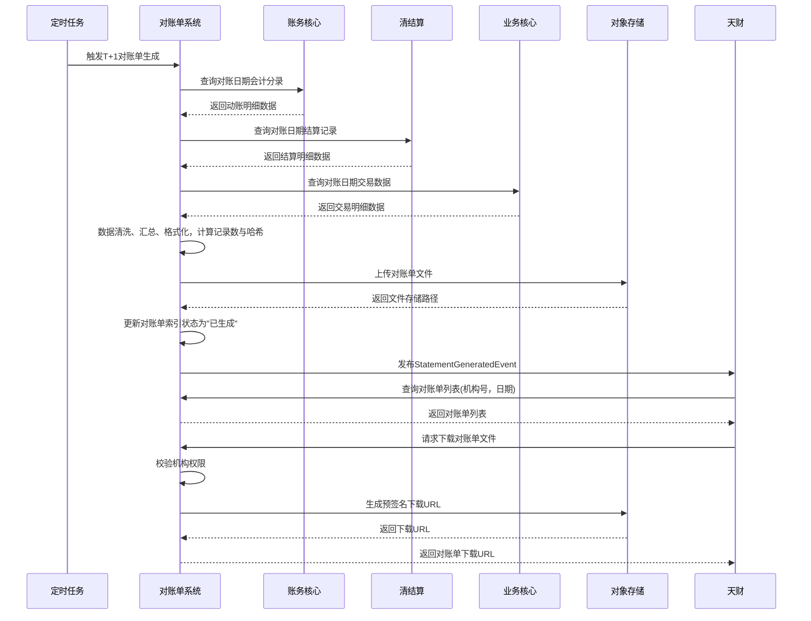

# 模块设计: 对账单系统

生成时间: 2026-01-22 16:17:18
批判迭代: 2

---

# 模块设计: 对账单系统

生成时间: TBD
批判迭代: TBD

---

# 对账单系统模块设计文档

## 1. 概述
- **目的与范围**: 本模块负责生成和提供各类账户动账明细、交易明细等对账文件。其核心职责是按日（或按需）为天财、收单商户、非收单商户等机构生成标准化的对账单，记录资金变动、交易流水、结算结果等信息，并提供安全、可靠的查询与下载服务。其边界在于对账单的生成、存储和分发，不涉及原始交易数据的处理或资金结算逻辑。

## 2. 接口设计
- **API端点 (REST)**:
    - `GET /api/v1/statements`: 查询对账单列表。
    - `GET /api/v1/statements/{statement_id}/download`: 获取对账单文件下载链接。
    - `POST /api/v1/statements/regenerate`: 手动触发对账单重新生成（补单）。
- **请求/响应结构**:
    - 查询对账单列表 (`GET /api/v1/statements`):
        - 请求参数: `institution_no` (机构号，必填), `account_no` (账户号，可选), `statement_date` (对账日期，格式：YYYY-MM-DD，必填), `statement_type` (对账单类型，可选，枚举：ACCOUNT_FLOW/TRANSACTION/SETTLEMENT)。
        - 响应体: `{"code": "string", "message": "string", "data": [{"statement_id": "string", "institution_no": "string", "account_no": "string", "statement_date": "string", "statement_type": "string", "file_name": "string", "file_size": number, "status": "GENERATING/GENERATED/DELIVERED", "generated_at": "string", "download_url": "string (预签名URL，可选)"}]}`
    - 下载对账单 (`GET /api/v1/statements/{statement_id}/download`):
        - 请求参数: 路径参数 `statement_id`。
        - 响应体: `{"code": "string", "message": "string", "data": {"download_url": "string (预签名URL，有效期5分钟)"}}`
    - 手动触发重新生成 (`POST /api/v1/statements/regenerate`):
        - 请求体: `{"institution_no": "string", "account_no": "string", "statement_date": "string", "statement_type": "string"}`
        - 响应体: `{"code": "string", "message": "string", "data": {"task_id": "string"}}`
- **发布/消费的事件**:
    - 消费来自**账务核心**的会计分录完成事件 (`AccountingEntryCompletedEvent`)，作为动账明细的源数据。
    - 消费来自**清结算**的结算完成事件 (`SettlementCompletedEvent`)，作为结算明细的源数据。
    - 消费来自**业务核心**的交易数据事件 (`TransactionDataEvent`)，作为交易明细的源数据。 (注：需与业务核心模块确认该事件定义)
    - 发布对账单生成完成事件 (`StatementGeneratedEvent`)，事件内容包含：`statement_id`, `institution_no`, `statement_date`, `statement_type`, `file_url`。

## 3. 数据模型
- **表/集合**:
    - `statement_index` (对账单索引表)
    - `statement_detail` (对账单明细表)
    - `statement_file` (文件存储表)
    - `data_source_checkpoint` (数据源检查点表)
- **关键字段**:
    - `statement_index` 表:
        - `statement_id` (主键): 对账单唯一标识。
        - `institution_no`: 机构号。
        - `account_no`: 账户号。
        - `statement_date`: 对账日期。
        - `statement_type`: 对账单类型 (ACCOUNT_FLOW/TRANSACTION/SETTLEMENT)。
        - `status`: 状态 (GENERATING/GENERATED/DELIVERED)。
        - `file_id`: 外键，关联 `statement_file.file_id`。
        - `total_records`: 总记录数。
        - `file_hash`: 文件哈希值 (SHA-256)。
        - `created_at`: 创建时间。
        - `updated_at`: 更新时间。
    - `statement_detail` 表:
        - `detail_id` (主键): 明细记录ID。
        - `statement_id`: 外键，关联 `statement_index.statement_id`。
        - `business_flow_no`: 业务流水号。
        - `transaction_time`: 交易/动账时间。
        - `account_no`: 账户号。
        - `counterparty_account_no`: 对方账户号。
        - `transaction_type`: 交易类型 (SPLIT/COLLECTION/WITHDRAWAL/FREEZE/UNFREEZE)。
        - `amount`: 金额。
        - `balance`: 动账后余额。
        - `summary`: 摘要。
        - `created_at`: 创建时间。
    - `statement_file` 表:
        - `file_id` (主键): 文件唯一标识。
        - `storage_path`: 对象存储路径 (如OSS key)。
        - `file_hash`: 文件哈希值 (SHA-256)。
        - `file_size`: 文件大小 (字节)。
        - `generated_at`: 文件生成时间。
    - `data_source_checkpoint` 表:
        - `checkpoint_id` (主键): 检查点ID。
        - `data_source`: 数据源标识 (ACCOUNTING/SETTLEMENT/TRANSACTION)。
        - `institution_no`: 机构号。
        - `account_no`: 账户号。
        - `last_processed_id`: 最后处理的记录ID或时间戳。
        - `checkpoint_date`: 检查点日期。
        - `created_at`: 创建时间。
        - `updated_at`: 更新时间。
- **与其他模块的关系**: 本模块的明细数据源自账务核心、清结算、业务核心等模块的事件；对账单服务于天财等业务平台。

## 4. 业务逻辑
- **核心工作流/算法**:
    1.  **对账单生成流程（定时任务）**:
        - 在每日固定时间（如T+1日凌晨）触发对账单生成任务。
        - 根据配置，为每个机构、账户、对账单类型（如账户动账明细）拉取指定对账日期范围内的源数据。
            - **账户动账明细**: 通过消费 `AccountingEntryCompletedEvent` 或查询账务核心API获取会计分录。
            - **结算明细**: 通过消费 `SettlementCompletedEvent` 或查询清结算API获取结算记录。
            - **交易明细**: 通过消费 `TransactionDataEvent` 或查询业务核心API获取交易数据。
        - 将源数据按标准格式（如CSV）进行清洗、转换、汇总，生成对账单文件。
        - **数据完整性校验**: 生成过程中，统计记录总数，计算数据哈希，并与源数据总量或上游系统提供的汇总信息进行比对。
        - 将文件上传至持久化存储（如对象存储OSS），记录文件元数据。
        - 更新 `statement_index` 表状态为"已生成"，记录 `total_records` 和 `file_hash`，并发布 `StatementGeneratedEvent`。
    2.  **对账单查询与下载流程**:
        - 接收来自天财或商户的查询请求，根据机构号、账户号、日期等条件从 `statement_index` 表检索。
        - 返回对账单列表信息。
        - 接收下载请求，校验请求方权限（如机构号匹配），从文件存储中获取文件流或预签名下载URL返回。
    3.  **补单机制**:
        - 当源数据延迟或缺失导致定时任务生成失败或数据不完整时，触发补单。
        - 支持手动通过API (`POST /api/v1/statements/regenerate`) 触发对指定机构、账户、日期、类型的对账单重新生成。
        - 补单流程与定时任务流程基本一致，但会基于 `data_source_checkpoint` 表记录的上次处理进度，拉取增量或缺失的数据，确保最终数据完整。
        - 补单生成的文件将覆盖（或标记为补单版本）原对账单文件。
    4.  **文件生命周期管理**:
        - **保留策略**: 对账单文件默认保留180天。超过180天的文件将被标记为待归档。
        - **归档策略**: 每季度初，将超过180天的对账单文件从主存储（如标准OSS）迁移至低频访问存储或归档存储。
        - **清理策略**: 超过2年的对账单文件，在归档存储中自动删除。清理任务每月执行一次。
        - 文件状态（如是否已归档）在 `statement_file` 表中维护。
- **业务规则与验证**:
    - 对账单生成需保证数据完整性，确保对账日期内的所有相关交易记录均已纳入。
    - 文件生成过程需具备幂等性，避免同一日期同一类型的对账单重复生成。
    - 下载接口需进行身份与权限校验，确保机构只能下载其自身或下属账户的对账单。
    - 补单操作需有权限控制，通常仅限运营人员或系统自动触发。
- **关键边界情况处理**:
    - 源数据延迟或缺失：通过 `data_source_checkpoint` 监控源数据就绪状态。若在生成时点数据不完整，则延迟生成任务或生成部分对账单并标记为"待补全"，后续通过补单机制处理。
    - 文件生成失败：记录失败日志并告警，支持手动触发重试。
    - 海量数据生成性能：采用分片生成（按机构、账户分片）、异步处理、增量计算等技术优化。
    - 数据一致性校验失败：如记录数或哈希值不匹配，则中止生成流程，记录告警并通知相关人员。

## 5. 时序图

## 6. 错误处理
- **预期错误情况**: 源数据服务（账务核心、清结算等）查询超时或失败；数据格式异常；数据完整性校验失败（记录数/哈希不匹配）；文件生成过程中发生IO错误；文件上传至对象存储失败；数据库操作失败；权限校验失败；补单任务冲突。
- **处理策略**:
    - 对依赖服务查询失败进行有限次重试并记录告警，重试失败后标记任务为"数据源异常"。
    - 对数据格式异常进行清洗或标记为异常记录，生成异常报告。
    - 对数据完整性校验失败，中止流程，记录详细日志并告警，需人工介入核查。
    - 对文件生成和上传失败，记录详细日志并告警，支持手动重试。
    - 对权限校验失败，直接返回无权限错误。
    - 对补单任务冲突（同一任务正在执行），返回"任务执行中"状态。
    - 所有关键流程需记录操作日志，便于问题追踪。

## 7. 依赖关系
- **上游模块**:
    - **账务核心**: 提供账户动账的会计分录明细数据。
    - **清结算**: 提供结算订单与明细数据。
    - **业务核心**: 提供原始交易数据。(需确认 `TransactionDataEvent` 事件定义)
- **下游模块**:
    - **天财**: 消费对账单生成事件，并调用本模块接口查询和下载对账单。