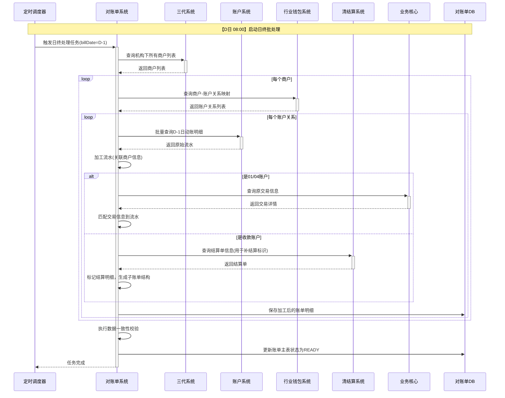
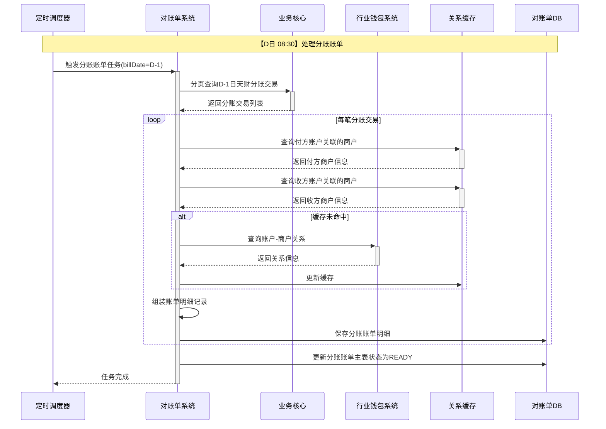
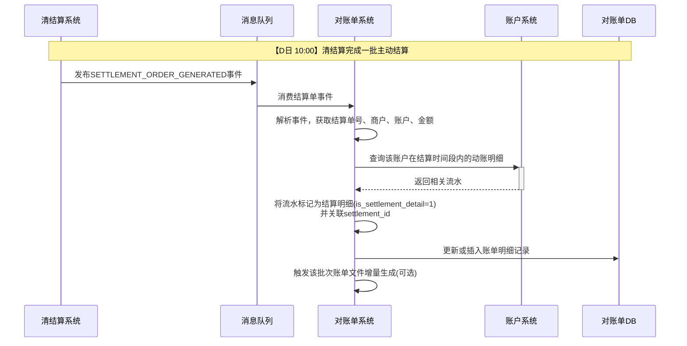

# 模块设计: 对账单系统

生成时间: 2026-01-16 17:22:32

---

# 模块设计: 对账单系统

生成时间: 2024年1月

---

# 对账单系统模块设计文档

## 1. 概述

### 1.1 目的
对账单系统作为“天财商龙”业务场景下的统一账单数据提供方，旨在为天财机构提供机构层级的、多维度的资金动账与交易明细视图。其主要目的是：
1. **数据聚合与加工**：整合来自账户系统、清结算系统、业务核心、行业钱包系统等多个上游系统的原始数据，按照天财机构的业务需求进行关联、匹配和格式化。
2. **机构层级账单生成**：生成并提供天财机构所需的各类对账单，包括账户维度（待结算、退货、收款、接收方账户）和交易维度（分账、提款、交易结算）的账单，**不提供商户层级的账单**。
3. **定时与准实时数据供给**：按照约定的时间窗口（如D日9点前提供D-1日数据）和批次，向天财机构提供准确、完整的动账明细和交易账单。
4. **支持复杂匹配逻辑**：基于上游系统提供的各类关系映射（商户-账户关系、机构-商户关系、交易-账户关系），将底层账户流水与上层业务交易信息进行精准匹配，形成业务可读的账单。

### 1.2 范围
- **数据源整合**：
  - **账户系统**：提供所有相关账户（待结算01、退货04、收款账户、接收方账户）的底层动账明细（收支余）。
  - **清结算系统**：提供结算单、分账完成事件、账户冻结事件，以及商户与待结算/退货账户的关系映射。
  - **业务核心**：提供“天财分账”交易明细，以及收单交易数据（用于匹配）。
  - **行业钱包系统**：提供商户与收款账户/接收方账户的关系映射，以及天财分账的补充信息。
  - **三代系统**：提供机构与商户的归属关系。
- **账单生成与提供**：
  - **账户维度账单**：按账户类型生成动账明细账单，包含匹配后的业务信息。
  - **交易维度账单**：按交易类型（天财分账、提款、收单结算）生成业务账单。
- **接口服务**：为天财机构提供账单查询与下载接口。
- **数据处理管道**：构建可靠、高效的数据拉取、清洗、关联、存储和发布的批处理与流处理管道。

**边界说明**：
- **上游**：账户系统、清结算系统、业务核心、行业钱包系统、三代系统是核心数据提供方。
- **下游**：天财机构（通过API或文件方式获取账单）。
- **不负责**：
  - 商户层账单的生成与提供。
  - 原始交易的处理与资金划转。
  - 账户的开户与管理。
  - 业务规则的校验与执行。

## 2. 接口设计

### 2.1 API端点 (RESTful)

#### 2.1.1 机构账单查询接口（供天财调用）
- **端点**：`POST /api/v1/statements/org-query`
- **描述**：天财机构查询指定日期、类型的机构层级账单。支持分页。
- **认证**：机构级API Key (AppId + Secret)
- **请求头**：
  ```json
  {
    "X-App-Id": "tiancai_org_id",
    "X-Api-Key": "encrypted_secret",
    "X-Request-Id": "uuid"
  }
  ```
- **请求体**：
  ```json
  {
    "orgId": "tiancai_org_id", // 从Token解析，此处可省略或用于校验
    "billDate": "2024-01-01", // 账单日期（业务日期）
    "billType": "ACCOUNT_01 | ACCOUNT_04 | ACCOUNT_RECEIVE | ACCOUNT_RECEIVER | TRANSFER_TIANCAI | WITHDRAW | TRANSACTION_SETTLE",
    "accountNo": "可选，按账户号过滤",
    "merchantNo": "可选，按商户号过滤",
    "pageNo": 1,
    "pageSize": 100
  }
  ```
- **响应体** (成功)：
  ```json
  {
    "code": "SUCCESS",
    "message": "查询成功",
    "data": {
      "billDate": "2024-01-01",
      "billType": "ACCOUNT_01",
      "total": 1500,
      "pageNo": 1,
      "pageSize": 100,
      "items": [
        {
          // 具体字段见下方各账单明细结构
        }
      ]
    }
  }
  ```

#### 2.1.2 机构账单文件生成与下载接口
- **端点**：`POST /api/v1/statements/org-file/generate`
- **描述**：触发生成指定日期和类型的机构账单文件（如CSV），并返回文件下载信息。
- **请求体**：
  ```json
  {
    "billDate": "2024-01-01",
    "billType": "ACCOUNT_01",
    "fileFormat": "CSV" // 或 EXCEL
  }
  ```
- **响应体**：
  ```json
  {
    "code": "SUCCESS",
    "data": {
      "fileId": "FILE_20240101_ACCOUNT_01",
      "downloadUrl": "https://bucket.oss.com/statements/tiancai/20240101/ACCOUNT_01_20240101_20240102090000.csv",
      "fileSize": "1024000",
      "generateTime": "2024-01-02 09:05:00",
      "status": "GENERATED"
    }
  }
  ```

#### 2.1.3 动账明细推送状态查询接口（内部/天财）
- **端点**：`GET /api/v1/statements/push-status/{billDate}`
- **描述**：查询指定账单日期的各类动账明细数据推送（供数）的完成状态。
- **响应体**：
  ```json
  {
    "code": "SUCCESS",
    "data": {
      "billDate": "2024-01-01",
      "details": [
        {
          "dataType": "ACCOUNT_01_DETAIL",
          "sourceSystem": "ACCOUNT",
          "scheduleTime": "2024-01-02 09:00:00",
          "actualFinishTime": "2024-01-02 08:55:00",
          "status": "SUCCESS",
          "recordCount": 10000
        },
        {
          "dataType": "ACCOUNT_RECEIVE_DETAIL",
          "sourceSystem": "ACCOUNT",
          "scheduleTime": "2024-01-02 09:00:00",
          "actualFinishTime": "2024-01-02 09:10:00",
          "status": "DELAYED",
          "recordCount": 5000
        }
      ]
    }
  }
  ```

### 2.2 数据供给接口（供上游系统调用）

#### 2.2.1 商户-账户关系查询接口（调用行业钱包）
- **描述**：对账单系统**主动调用**行业钱包系统接口，获取商户与收款账户、接收方账户的映射关系。设计见行业钱包系统文档 `POST /api/v1/wallet/merchant-account/mapping`。

#### 2.2.2 机构-商户关系查询接口（调用三代）
- **端点**：`GET /api/v1/gen3/org-merchant/mapping` (假设)
- **描述**：对账单系统**主动调用**三代系统接口，获取指定天财机构下的所有商户列表。
- **响应体**：
  ```json
  {
    "code": "SUCCESS",
    "data": {
      "orgId": "tiancai_org_id",
      "merchants": [
        {
          "merchantNo": "8888880001",
          "merchantName": "北京天财餐饮总部",
          "status": "ACTIVE"
        }
      ]
    }
  }
  ```

### 2.3 消费的事件

对账单系统主要采用**主动拉取**模式获取数据，以保证数据的完整性和批量处理效率。同时，也消费少量事件用于触发处理或更新缓存。

#### 2.3.1 `TIANCAI_TRANSFER_COMPLETED` (来自清结算/行业钱包)
- **用途**：作为信号，触发或标记一笔天财分账交易已完结，可用于更新内部处理状态或触发实时性要求较高的账单增量更新（如有）。
- **事件数据**：包含`transferNo`, `payerAccountNo`, `payeeAccountNo`, `amount`, `transferTime`等。

#### 2.3.2 `SETTLEMENT_ORDER_GENERATED` (来自清结算)
- **用途**：接收主动结算生成的结算单事件。用于识别哪些资金划转属于“补结算”交易，从而在收款账户流水中生成带有结算明细的子账单。
- **事件数据**：包含`settlementId`, `merchantNo`, `toAccount`(天财收款账户), `settleAmount`, `settleDate`等。

#### 2.3.3 `ACCOUNT_CREATED` / `ACCOUNT_STATUS_CHANGED` (来自账户系统)
- **用途**：更新本地缓存的账户基本信息（账户号、类型、状态、所属商户），确保关系映射的时效性。

### 2.4 发布的事件
对账单系统作为数据提供方，通常不主动发布业务领域事件。但可发布**系统内部事件**，如：
- `STATEMENT_DATA_READY`: 当某日某类账单数据已处理完成并持久化后发布，用于触发后续的文件生成、通知等内部流程。

## 3. 数据模型

### 3.1 核心表设计

#### 表：`statement_org_bill` (机构账单主表)
存储已生成的各类机构账单的元数据和汇总信息。
| 字段名 | 类型 | 必填 | 默认值 | 索引 | 说明 |
|--------|------|------|--------|------|------|
| id | bigint | Y | AUTO_INCREMENT | PK | 主键 |
| org_id | varchar(32) | Y | | IDX | 天财机构ID |
| bill_date | date | Y | | IDX | 账单日期（业务日期） |
| bill_type | varchar(30) | Y | | IDX | 账单类型 |
| bill_cycle | varchar(20) | Y | DAILY | 周期：DAILY, HOURLY_BATCH |
| data_status | varchar(20) | Y | PROCESSING | 数据处理状态：PROCESSING, READY, FAILED |
| file_status | varchar(20) | Y | PENDING | 文件状态：PENDING, GENERATED, UPLOADED |
| file_id | varchar(64) | N | | | 生成的文件ID |
| file_url | varchar(500) | N | | | 文件存储地址 |
| record_count | int | Y | 0 | | 账单明细条数 |
| total_amount | decimal(20,2) | Y | 0.00 | | 总金额（根据类型为入账或出账总额） |
| create_time | datetime | Y | CURRENT_TIMESTAMP | | 创建时间 |
| update_time | datetime | Y | CURRENT_TIMESTAMP ON UPDATE | | 更新时间 |
| finish_time | datetime | N | | | 数据处理完成时间 |

**索引**:
- 唯一索引: `uk_org_date_type` (`org_id`, `bill_date`, `bill_type`, `bill_cycle`)

#### 表：`statement_account_detail` (账户动账明细表)
存储加工后的、可用于生成账户维度账单的明细数据。由原始账户流水关联业务信息后生成。
| 字段名 | 类型 | 必填 | 默认值 | 索引 | 说明 |
|--------|------|------|--------|------|------|
| id | bigint | Y | AUTO_INCREMENT | PK | 主键 |
| org_id | varchar(32) | Y | | IDX | 机构ID |
| bill_date | date | Y | | IDX | 业务日期 |
| account_no | varchar(32) | Y | | IDX | 账户号 |
| account_type | varchar(20) | Y | | | 账户类型(01,04,RECEIVE,RECEIVER) |
| merchant_no | varchar(32) | Y | | IDX | 商户号 |
| merchant_name | varchar(100) | N | | | 商户名称 |
| transaction_time | datetime(3) | Y | | IDX | 交易时间（精确到毫秒） |
| transaction_id | varchar(32) | Y | | IDX | 交易流水号（系统唯一） |
| original_transaction_id | varchar(32) | N | | | 原交易流水号（如原收单交易号） |
| transaction_type | varchar(20) | Y | | | 交易类型：IN/OUT |
| amount | decimal(15,2) | Y | | | 交易金额 |
| balance | decimal(15,2) | Y | | | 交易后余额 |
| opposite_account_no | varchar(32) | N | | | 对方账户号 |
| opposite_account_name | varchar(100) | N | | | 对方账户名 |
| business_type | varchar(30) | N | | | 业务类型：分账、结算、提款、退货、消费等 |
| scene | varchar(30) | N | | | 业务场景：归集、批量付款、会员结算 |
| remark | varchar(500) | N | | | 备注（包含业务信息） |
| is_settlement_detail | tinyint(1) | Y | 0 | | 是否为结算明细（1:是，用于子账单） |
| settlement_id | varchar(32) | N | | | 关联的结算单号（清结算） |
| fee_amount | decimal(15,2) | N | 0.00 | | 手续费 |
| ext_info | json | N | | | 扩展信息，存储原始流水中的其他字段 |
| create_time | datetime | Y | CURRENT_TIMESTAMP | | 创建时间 |

**索引**:
- 复合索引: `idx_org_date_account` (`org_id`, `bill_date`, `account_no`)
- 复合索引: `idx_merchant_time` (`merchant_no`, `transaction_time`)
- 索引: `idx_transaction_id` (`transaction_id`)
- 索引: `idx_settlement_id` (`settlement_id`)

#### 表：`statement_transfer_detail` (天财分账交易明细表)
存储用于生成“机构天财分账指令账单”的数据。来源于业务核心，并关联了行业钱包的补充信息。
| 字段名 | 类型 | 必填 | 默认值 | 索引 | 说明 |
|--------|------|------|--------|------|------|
| id | bigint | Y | AUTO_INCREMENT | PK | 主键 |
| org_id | varchar(32) | Y | | IDX | 机构ID |
| bill_date | date | Y | | IDX | 业务日期（按交易时间） |
| transfer_id | varchar(32) | Y | | UK | 业务核心交易ID |
| request_id | varchar(64) | Y | | IDX | 天财/钱包请求ID |
| payer_merchant_no | varchar(32) | Y | | IDX | 付方商户号 |
| payer_merchant_name | varchar(100) | N | | | 付方商户名 |
| payer_account_no | varchar(32) | Y | | | 付方账户号 |
| payer_account_type | varchar(20) | Y | | | 付方账户类型 |
| payee_merchant_no | varchar(32) | Y | | IDX | 收方商户号 |
| payee_merchant_name | varchar(100) | N | | | 收方商户名 |
| payee_account_no | varchar(32) | Y | | | 收方账户号 |
| payee_account_type | varchar(20) | Y | | | 收方账户类型 |
| amount | decimal(15,2) | Y | | | 分账金额 |
| currency | varchar(3) | Y | CNY | | 币种 |
| scene | varchar(30) | Y | | | 分账场景 |
| fee_amount | decimal(15,2) | Y | 0.00 | | 手续费 |
| fee_bearer | varchar(20) | Y | | | 手续费承担方 |
| transfer_status | varchar(20) | Y | | | 交易状态 |
| transfer_time | datetime | Y | | IDX | 交易时间 |
| business_ref_no | varchar(128) | N | | | 业务参考号 |
| remark | varchar(256) | N | | | 备注 |
| create_time | datetime | Y | CURRENT_TIMESTAMP | | 创建时间 |

**索引**:
- 唯一索引: `uk_transfer_id` (`transfer_id`)
- 复合索引: `idx_org_date` (`org_id`, `bill_date`)
- 复合索引: `idx_payer_date` (`payer_merchant_no`, `bill_date`)

#### 表：`relation_cache` (关系映射缓存表)
缓存从上游系统查询到的各类关系映射，减少实时查询压力，并记录版本/更新时间。
| 字段名 | 类型 | 必填 | 默认值 | 索引 | 说明 |
|--------|------|------|--------|------|------|
| id | bigint | Y | AUTO_INCREMENT | PK | 主键 |
| relation_type | varchar(30) | Y | | IDX | 关系类型：ORG_MERCHANT, MERCHANT_ACCOUNT_RECEIVE, MERCHANT_ACCOUNT_RECEIVER, MERCHANT_ACCOUNT_SETTLEMENT, MERCHANT_ACCOUNT_REFUND |
| org_id | varchar(32) | N | | IDX | 机构ID（部分关系有） |
| key_1 | varchar(32) | Y | | IDX | 关系键1（如商户号） |
| key_2 | varchar(32) | N | | IDX | 关系键2（如账户号） |
| value_json | json | Y | | | 关系详细信息 |
| version | varchar(32) | Y | | | 数据版本（如更新时间戳） |
| expire_time | datetime | N | | | 缓存过期时间 |
| create_time | datetime | Y | CURRENT_TIMESTAMP | | 创建时间 |
| update_time | datetime | Y | CURRENT_TIMESTAMP ON UPDATE | | 更新时间 |

**索引**:
- 唯一索引: `uk_relation_key` (`relation_type`, `key_1`, `key_2`)

### 3.2 与其他模块的关系
```mermaid
erDiagram
    STATEMENT_ORG_BILL ||--o{ STATEMENT_ACCOUNT_DETAIL : "包含"
    STATEMENT_ORG_BILL ||--o{ STATEMENT_TRANSFER_DETAIL : "包含"
    
    STATEMENT_SYSTEM }|--|| ACCOUNT_SYSTEM : "拉取动账明细"
    STATEMENT_SYSTEM }|--|| SETTLEMENT_SYSTEM : "拉取结算单/事件"
    STATEMENT_SYSTEM }|--|| BUSINESS_CORE : "拉取分账/交易数据"
    STATEMENT_SYSTEM }|--|| WALLET_SYSTEM : "查询账户关系"
    STATEMENT_SYSTEM }|--|| GEN3_SYSTEM : "查询机构-商户关系"
    STATEMENT_SYSTEM }|..|> SETTLEMENT_SYSTEM : "监听结算事件"
    STATEMENT_SYSTEM }|..|> ACCOUNT_SYSTEM : "监听账户事件"
    
    ACCOUNT_SYSTEM {
        varchar system_id PK
    }
    SETTLEMENT_SYSTEM {
        varchar system_id PK
    }
    BUSINESS_CORE {
        varchar system_id PK
    }
    WALLET_SYSTEM {
        varchar system_id PK
    }
    GEN3_SYSTEM {
        varchar system_id PK
    }
```

## 4. 业务逻辑

### 4.1 核心处理流程（日终批处理）

#### 4.1.1 账户动账明细加工流程
```java
public void processAccountDetailsForOrg(String orgId, Date billDate) {
    // 1. 从三代获取该机构下所有有效商户列表
    List<MerchantInfo> merchants = gen3Client.getMerchantsByOrg(orgId);
    
    // 2. 并行处理每个商户的各类账户明细
    for (MerchantInfo merchant : merchants) {
        // 2.1 获取该商户的所有相关账户关系（从缓存或钱包/清结算查询）
        Map<String, List<AccountRelation>> accountRelations = 
            loadMerchantAccountRelations(merchant.getMerchantNo());
        
        // 2.2 针对每种账户类型，从账户系统拉取D-1日动账明细
        for (AccountRelation relation : accountRelations.values()) {
            List<RawTransactionDetail> rawDetails = 
                accountClient.batchQueryTransactionDetails(
                    relation.getAccountNo(), 
                    billDate, 
                    relation.getAccountType()
                );
            
            // 2.3 对原始流水进行业务信息匹配和加工
            List<StatementAccountDetail> processedDetails = 
                processAndEnrichDetails(rawDetails, merchant, relation);
            
            // 2.4 持久化加工后的明细
            statementDetailDao.batchInsert(processedDetails);
        }
    }
    
    // 3. 更新账单主表状态
    updateBillStatus(orgId, billDate, "ACCOUNT_DETAIL", "READY");
}

private List<StatementAccountDetail> processAndEnrichDetails(
        List<RawTransactionDetail> rawDetails, 
        MerchantInfo merchant,
        AccountRelation relation) {
    
    return rawDetails.stream().map(raw -> {
        StatementAccountDetail detail = new StatementAccountDetail();
        // 复制基础账户流水信息
        detail.setAccountNo(raw.getAccountNo());
        detail.setTransactionTime(raw.getTransactionTime());
        detail.setTransactionId(raw.getTransactionId());
        detail.setAmount(raw.getAmount());
        detail.setBalance(raw.getBalance());
        detail.setTransactionType(raw.getTransactionType());
        detail.setOppositeAccountNo(raw.getOppositeAccountNo());
        
        // 关联商户信息
        detail.setMerchantNo(merchant.getMerchantNo());
        detail.setMerchantName(merchant.getMerchantName());
        detail.setOrgId(merchant.getOrgId());
        
        // 根据账户类型和交易流水号，匹配业务信息
        enrichBusinessInfo(detail, raw, relation);
        
        return detail;
    }).collect(Collectors.toList());
}

private void enrichBusinessInfo(StatementAccountDetail detail, 
                                RawTransactionDetail raw,
                                AccountRelation relation) {
    String accountType = relation.getAccountType();
    String transactionId = raw.getTransactionId();
    
    switch (accountType) {
        case "SETTLEMENT_ACCOUNT": // 01账户
        case "REFUND_ACCOUNT":     // 04账户
            // 01/04账户的流水需匹配原交易信息（从业务核心查询）
            TransactionInfo txInfo = businessCoreClient.getTransactionById(transactionId);
            if (txInfo != null) {
                detail.setBusinessType(txInfo.getType());
                detail.setOriginalTransactionId(txInfo.getOriginalId());
                detail.setRemark(txInfo.getRemark());
                // 匹配对方账户信息（如消费者账户）
                detail.setOppositeAccountName(txInfo.getPayerName());
            }
            break;
        case "RECEIVE_ACCOUNT": // 收款账户
            // 判断是否为“补结算”交易（通过结算单号）
            if (isSettlementTransaction(raw.getRemark())) {
                detail.setIsSettlementDetail(1);
                detail.setSettlementId(extractSettlementId(raw.getRemark()));
                // 结算明细需展示收支余，已在raw detail中
            }
            // 收款账户流水可能对应分账、提款等，需进一步匹配
            matchTransferOrWithdrawInfo(detail, raw);
            break;
        case "RECEIVER_ACCOUNT": // 接收方账户
            // 接收方账户通常只展示动账明细，业务信息较简单
            detail.setBusinessType("分账入账");
            // 可通过对方账户号反向查找分账交易
            TransferInfo transfer = findTransferByPayeeAccount(raw.getOppositeAccountNo(), 
                                                              raw.getTransactionTime());
            if (transfer != null) {
                detail.setScene(transfer.getScene());
                detail.setFeeAmount(transfer.getFeeAmount());
            }
            break;
    }
}
```

#### 4.1.2 天财分账账单生成流程
```java
public void processTiancaiTransferBill(String orgId, Date billDate) {
    // 1. 从业务核心拉取D-1日所有天财分账交易
    List<TransferDetail> transfers = businessCoreClient.getTiancaiTransfers(
        orgId, billDate, 1, 10000 // 分页拉取
    );
    
    // 2. 遍历交易，补充商户和账户信息（从缓存获取）
    List<StatementTransferDetail> billDetails = transfers.stream().map(transfer -> {
        StatementTransferDetail detail = convertToStatementDetail(transfer);
        
        // 补充付方信息
        MerchantAccountInfo payerInfo = relationCache.getMerchantAccountInfo(
            transfer.getPayerAccountNo());
        if (payerInfo != null) {
            detail.setPayerMerchantNo(payerInfo.getMerchantNo());
            detail.setPayerMerchantName(payerInfo.getMerchantName());
        }
        
        // 补充收方信息
        MerchantAccountInfo payeeInfo = relationCache.getMerchantAccountInfo(
            transfer.getPayeeAccountNo());
        if (payeeInfo != null) {
            detail.setPayeeMerchantNo(payeeInfo.getMerchantNo());
            detail.setPayeeMerchantName(payeeInfo.getMerchantName());
        }
        
        // 补充场景、手续费承担方等信息（可从行业钱包事件或缓存获取）
        enrichTransferSceneAndFee(detail, transfer);
        
        return detail;
    }).collect(Collectors.toList());
    
    // 3. 批量入库
    statementTransferDao.batchInsert(billDetails);
    
    // 4. 更新账单主表
    updateBillStatus(orgId, billDate, "TRANSFER_TIANCAI", "READY");
}
```

### 4.2 业务规则

#### 4.2.1 数据供给时间规则
1. **待结算账户(01)、退货账户(04)、接收方账户**：D日9点前提供D-1日0-24点的动账明细。
2. **收款账户（含普通/天财）**：
   - **第一批次**：D日9点前提供D-1日0-24点 **和** D日0-3点的动账明细。
   - **其他批次**：按批次推送D日3-12点、12-18点等时间段的动账明细（用于“补结算”交易）。
3. **天财分账指令账单**：D日9点前提供D-1日全天的交易明细。

#### 4.2.2 账户流水与业务信息匹配规则
1. **01/04账户**：通过`transaction_id`关联业务核心的原始交易数据，获取交易类型、对手方等信息。
2. **收款账户**：
   - 通过`remark`字段或`settlement_id`识别“补结算”交易，并标记`is_settlement_detail=1`。
   - 通过对方账户号和交易时间，关联分账交易或提款交易。
3. **接收方账户**：通过对方账户号（付方天财账户）和交易时间，反向关联分账交易，获取场景和手续费信息。
4. **关系映射优先级**：本地缓存 > 实时查询上游系统。缓存设置合理TTL（如1小时），并在监听到账户/关系变更事件时更新。

#### 4.2.3 账单生成规则
1. **机构层级过滤**：所有账单数据必须严格限定在指定天财机构下的商户范围内。
2. **数据完整性**：批处理任务需监控上游数据就绪状态，只有所有依赖数据就绪后才开始加工。
3. **幂等与重试**：账单日终处理任务需支持幂等执行，避免重复加工。失败后支持重试。
4. **子账单生成**：对于收款账户，当流水被标记为`is_settlement_detail=1`时，在展示时应能展开显示该结算批次下的逐笔明细（收支余）。

### 4.3 验证逻辑

#### 4.3.1 数据一致性校验
```java
public void validateDailyDataConsistency(String orgId, Date billDate) {
    // 1. 校验账户系统流水总额与清结算结算单总额是否匹配（针对收款账户）
    BigDecimal accountInAmount = detailDao.sumAmountByOrgAndDate(
        orgId, billDate, "RECEIVE_ACCOUNT", "IN");
    BigDecimal settlementAmount = settlementDao.sumSettleAmountByOrgAndDate(
        orgId, billDate);
    
    if (accountInAmount.compareTo(settlementAmount) != 0) {
        log.warn("机构{}在{}日的收款账户入账总额{}与结算单总额{}不一致", 
                 orgId, billDate, accountInAmount, settlementAmount);
        // 触发告警，记录差异明细供人工核对
        recordDataDiscrepancy(orgId, billDate, "SETTLEMENT_MISMATCH", 
                             accountInAmount, settlementAmount);
    }
    
    // 2. 校验分账交易总额与接收方账户入账总额是否匹配
    BigDecimal transferOutAmount = transferDao.sumAmountByOrgAndDate(
        orgId, billDate, "OUT");
    BigDecimal receiverInAmount = detailDao.sumAmountByOrgAndDate(
        orgId, billDate, "RECEIVER_ACCOUNT", "IN");
    
    if (transferOutAmount.compareTo(receiverInAmount) != 0) {
        log.warn("机构{}在{}日的分账出账总额{}与接收方入账总额{}不一致",
                 orgId, billDate, transferOutAmount, receiverInAmount);
        recordDataDiscrepancy(orgId, billDate, "TRANSFER_MISMATCH",
                             transferOutAmount, receiverInAmount);
    }
    
    // 3. 校验待结算账户的日终余额是否为0（假设T+1全部结算）
    Map<String, BigDecimal> settlementEndingBalances = detailDao.getEndingBalanceByAccount(
        orgId, billDate, "SETTLEMENT_ACCOUNT");
    for (Map.Entry<String, BigDecimal> entry : settlementEndingBalances.entrySet()) {
        if (entry.getValue().compareTo(BigDecimal.ZERO) != 0) {
            log.warn("待结算账户{}在{}日终余额不为0: {}", 
                     entry.getKey(), billDate, entry.getValue());
        }
    }
}
```

## 5. 时序图

### 5.1 日终账户维度账单生成时序图


### 5.2 天财分账指令账单生成时序图


### 5.3 准实时“补结算”明细处理时序图


## 6. 错误处理

### 6.1 预期错误码（API返回）

| 错误码 | HTTP状态码 | 描述 | 处理建议 |
|--------|------------|------|----------|
| STATEMENT_400001 | 400 | 请求参数错误（如日期格式） | 检查请求参数格式 |
| STATEMENT_400002 | 400 | 不支持的账单类型 | 检查billType枚举值 |
| STATEMENT_403001 | 403 | 机构无权限访问该账单 | 检查机构ID和API Key |
| STATEMENT_404001 | 404 | 指定日期的账单不存在 | 确认账单日期和类型，或等待生成 |
| STATEMENT_409001 | 409 | 账单正在生成中 | 稍后重试查询 |
| STATEMENT_422001 | 422 | 上游数据未就绪，账单无法生成 | 检查上游系统状态，等待数据就绪 |
| STATEMENT_429001 | 429 | 查询频率超限 | 降低查询频率 |
| STATEMENT_500001 | 500 | 账单系统内部错误 | 联系技术支持，提供requestId |

### 6.2 批处理任务错误处理策略

1. **上游数据延迟或缺失**：
   - **监控**：在计划启动时间检查上游数据就绪状态（如账户系统流水是否已全部产出）。
   - **等待与重试**：若数据未就绪，任务进入等待状态，每5分钟重试检查，最多等待2小时。
   - **降级**：超过最大等待时间后，使用已有数据生成部分账单，并记录缺失数据告警。

2. **数据处理过程失败**：
   - **分段与重试**：将大数据量处理分段，单段失败仅重试该段。
   - **检查点**：记录处理进度，任务重启时从断点继续。
   - **人工干预**：连续重试失败后，触发告警，需人工介入排查。

3. **数据一致性校验失败**：
   - **记录差异**：将差异明细记录到特定表，不阻塞主流程。
   - **分级告警**：根据差异金额大小触发不同级别告警。
   - **提供修复工具**：提供手动触发重新对账或数据修复的接口。

### 6.3 监控与告警

1. **关键业务指标监控**：
   - 日终批处理任务完成时间 > 09:30
   - 账单数据生成失败率 > 1%
   - 上游数据就绪延迟 > 30分钟
   - 数据一致性差异金额 > 1000元
   - API接口P99响应时间 > 2s

2. **系统资源监控**：
   - 数据库CPU/连接数使用率 > 80%
   - 批处理任务内存使用率 > 70%
   - 磁盘空间使用率 > 85%

3. **告警渠道**：企业微信、短信、邮件，分P0/P1/P2等级。

## 7. 依赖说明

### 7.1 上游依赖

#### 7.1.1 账户系统
- **依赖关系**：**核心数据依赖**。提供所有账户的底层动账明细（收支余）。
- **交互方式**：**主动拉取**（同步HTTP API批量查询）。
- **关键接口**：`POST /api/v1/accounts/transaction-details` (批量查询动账明细)
- **数据要求**：
  - 需支持按账户类型、时间范围、天财标记等条件过滤。
  - 需支持大数据量分页查询（单次最多1000条）。
  - D-1日数据需在D日08:30前完全就绪。
- **SLA要求**：查询接口P99响应时间 < 1s，可用性 > 99.9%。
- **降级策略**：若账户系统完全不可用，则账单生成任务无法进行，需等待恢复。

#### 7.1.2 业务核心
- **依赖关系**：**核心数据依赖**。提供天财分账交易明细和收单交易数据（用于匹配）。
- **交互方式**：**主动拉取**（同步HTTP API分页查询）。
- **关键接口**：
  - `GET /api/v1/tiancai/transfers` (分页查询天财分账交易)
  - `GET /api/v1/transactions/{id}` (查询单笔交易详情，用于01/04账户匹配)
- **数据要求**：天财分账交易数据需包含完整的账户、金额、场景、状态信息。
- **SLA要求**：查询接口P99响应时间 < 500ms，可用性 > 99.9%。

#### 7.1.3 清结算系统
- **依赖关系**：**重要数据依赖**。提供结算单信息（用于识别“补结算”交易）和商户-待结算/退货账户关系。
- **交互方式**：**主动拉取 + 事件监听**。
  - 拉取：查询结算单、关系映射。
  - 监听：`SETTLEMENT_ORDER_GENERATED`事件，用于准实时处理。
- **关键接口**：需提供结算单查询、关系映射查询接口（需在清结算系统设计中补充）。
- **数据要求**：结算单需包含关联的商户、天财收款账户、结算金额、批次号。

#### 7.1.4 行业钱包系统
- **依赖关系**：**重要数据依赖**。提供商户与收款账户/接收方账户的关系映射。
- **交互方式**：**主动拉取**（同步HTTP API批量查询）。
- **关键接口**：`POST /api/v1/wallet/merchant-account/mapping` (批量查询商户-账户映射)
- **数据要求**：需支持按商户号列表批量查询，返回账户号、类型、角色等信息。
- **性能要求**：响应时间 < 200ms，支持高并发查询。

#### 7.1.5 三代系统
- **依赖关系**：**基础数据依赖**。提供天财机构与商户的归属关系。
- **交互方式**：**主动拉取**（同步HTTP API查询）。
- **关键接口**：需提供机构-商户关系查询接口（需在三代系统设计中补充）。
- **数据要求**：返回指定机构下所有状态正常的商户列表。

### 7.2 下游依赖

#### 7.2.1 天财机构（客户端）
- **依赖关系**：服务对象。
- **交互方式**：同步HTTP API调用（账单查询） + 文件下载（OSS链接）。
- **流量预估**：假设天财有10个总部人员，每人每日查询10次，峰值QPS约2。
- **体验要求**：账单查询响应时间 < 3s，文件生成后30分钟内可下载。

#### 7.2.2 对象存储服务 (OSS/S3)
- **依赖关系**：账单文件持久化存储。
- **用途**：存储生成的CSV/Excel账单文件，提供下载链接。
- **容量预估**：单机构单日账单约10MB，年增量约3.6GB。

#### 7.2.3 消息队列 (Kafka)
- **依赖关系**：异步解耦。
- **用途**：消费上游系统事件（如结算完成），触发增量处理。
- **可靠性**：至少一次消费，需处理幂等。

### 7.3 容错与性能设计

1. **数据就绪状态检查**：
   - 在批处理任务开始前，主动检查所有上游依赖数据的就绪状态。
   - 实现一个“数据就绪看板”，可视化各数据源的延迟情况。

2. **缓存策略**：
   - **关系映射缓存**：使用Redis缓存商户-账户、机构-商户等关系，TTL设置为1小时，监听变更事件更新。
   - **账单数据缓存**：对频繁查询的账单结果（如当天账单）进行短期缓存（5分钟），减少数据库压力。

3. **查询性能优化**：
   - **数据库索引**：针对`org_id`、`bill_date`、`account_no`、`transaction_time`等字段建立复合索引。
   - **分库分表**：`statement_account_detail`表按`bill_date`按月分表，`org_id`哈希分库。
   - **异步导出**：大账单文件生成采用异步任务，避免阻塞API。

4. **限流与降级**：
   - **API限流**：账单查询接口按机构限流，防止恶意刷取。
   - **降级方案**：当某个上游系统严重超时，可返回部分数据或提示“数据延迟”，而非完全失败。

5. **数据质量保障**：
   - **对账机制**：每日执行内部数据一致性校验（如分账出账总额 vs 接收方入账总额）。
   - **差异处理**：提供差异数据查询界面和手动触发修复的入口。
   - **监控报表**：生成数据质量日报，包含各环节数据量、差异情况等。

---
**文档版本**：v1.0  
**最后更新**：2024年1月  
**负责人**：对账单系统架构组