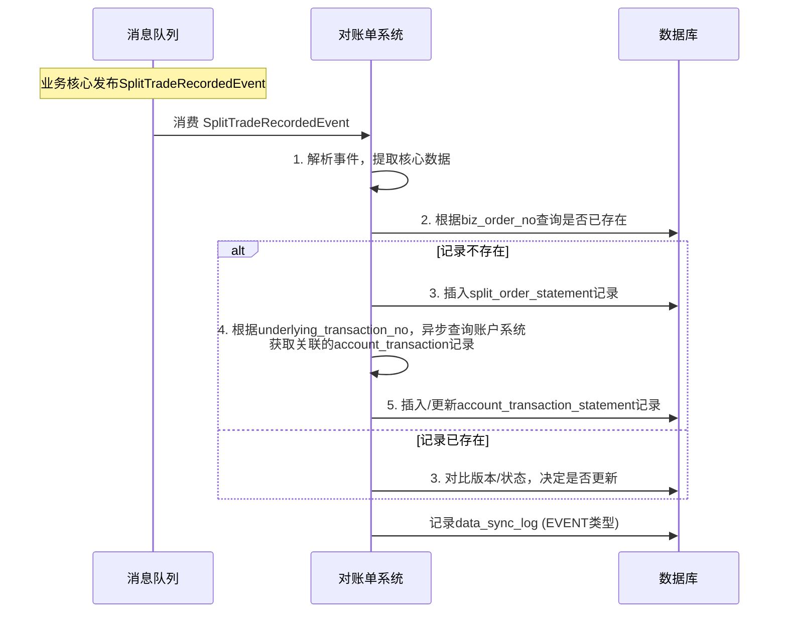
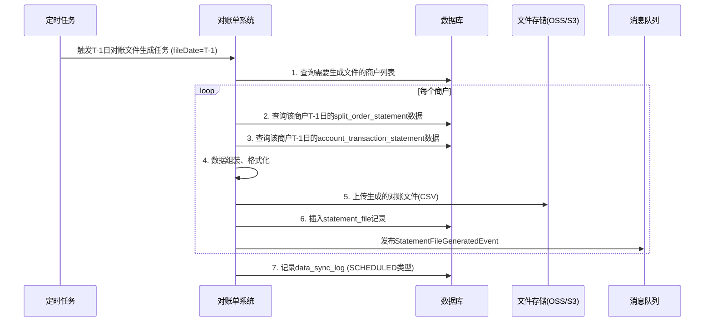
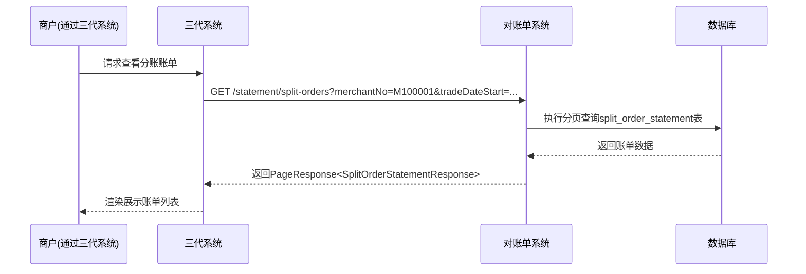

# 模块设计: 对账单系统

生成时间: 2026-01-19 14:53:22

---

# 模块设计: 对账单系统

生成时间: 2026-01-19 16:00:00

---

## 1. 概述

### 1.1 目的
本模块是“天财商龙”分账业务的**统一对账数据聚合与账单生成中心**。它负责从各相关业务系统（业务核心、账户系统、清结算系统）汇聚交易、资金、结算、手续费等动账明细数据，按照商户（机构）维度进行清洗、关联、汇总，生成并提供标准化的“天财分账”指令账单及机构层级的动账明细。其核心价值在于为商户（总部/门店）和内部运营提供清晰、准确、可追溯的资金流转视图，是业务对账、资金核对和财务审计的关键支撑。

### 1.2 范围
- **多源数据汇聚**：通过接口拉取或事件订阅，从业务核心、账户系统、清结算系统获取分账交易流水、账户动账流水、结算明细、退货记录、手续费记录等原始数据。
- **数据关联与清洗**：基于业务订单号、账户流水号等关键字段，将来自不同系统的异构数据关联整合，形成完整的“一笔业务，全链路视图”，并清洗异常或重复数据。
- **账单生成**：
    - **天财分账指令账单**：以三代系统的分账指令 (`split_order`) 为核心，关联其对应的资金流水、手续费、结算状态，生成面向商户的业务对账单。
    - **机构动账明细**：以账户系统的动账流水 (`account_transaction`) 为基础，按机构（商户）维度，整合所有资金流入流出明细（含分账、结算、退货、手续费等），生成资金流水账。
- **账单查询与导出**：为商户（通过三代系统）和内部运营提供多维度（时间、商户、业务类型）的账单查询、明细查看及文件导出（CSV/Excel）功能。
- **对账文件生成**：按约定格式和周期（如T+1日）生成供商户下载或推送的对账文件。

### 1.3 非范围
- 原始交易的处理与记录（由业务核心、账户系统、清结算系统负责）。
- 商户进件、关系绑定、分账指令发起等业务流程（由三代系统负责）。
- 钱包层业务逻辑与分账执行（由行业钱包系统负责）。
- 底层账户的记账操作（由账户系统负责）。
- 费率的计算（由计费中台负责）。

## 2. 接口设计

### 2.1 REST API 端点

#### 2.1.1 账单查询接口（供三代系统/内部运营调用）
- **GET /api/v1/statement/split-orders**：查询“天财分账”指令账单
    - **查询参数**:
        - `merchantNo`: 商户号（付方或收方）
        - `bizOrderNo`: 三代系统分账指令号
        - `bizType`: 业务类型 (COLLECTION, BATCH_PAYMENT, MEMBER_SETTLE)
        - `tradeDateStart`/`tradeDateEnd`: 交易日期范围（指分账执行日期）
        - `settlementDate`: 结算日期
        - `status`: 指令状态 (SUCCESS, FAILED)
        - `page`, `size`: 分页参数
    - **响应**: `PageResponse<SplitOrderStatementResponse>`

- **GET /api/v1/statement/account-transactions**：查询机构动账明细
    - **查询参数**:
        - `merchantNo`: 商户号
        - `accountNo`: 账户号（可选，不填则查询该商户所有账户）
        - `bizType`: 业务类型 (TIANCAI_SPLIT, SETTLEMENT, REFUND, FEE)
        - `transactionDateStart`/`transactionDateEnd`: 交易发生日期范围
        - `page`, `size`: 分页参数
    - **响应**: `PageResponse<AccountTransactionDetailResponse>`

- **GET /api/v1/statement/split-orders/{bizOrderNo}/detail**：查询指定分账指令的完整明细
    - **响应**: `SplitOrderFullDetailResponse`

#### 2.1.2 对账文件生成与下载接口
- **POST /api/v1/statement/files/generate**：触发生成指定日期的对账文件
    - **请求体**: `GenerateStatementFileRequest`
    - **响应**: `GenerateStatementFileResponse`
- **GET /api/v1/statement/files**：查询已生成的对账文件列表
    - **查询参数**: `merchantNo`, `fileDate`, `fileType`
    - **响应**: `PageResponse<StatementFileInfoResponse>`
- **GET /api/v1/statement/files/{fileId}/download**：下载对账文件
    - **响应**: 文件流

#### 2.1.3 数据同步接口（内部，可选）
- **POST /internal/api/v1/statement/sync/trigger**：手动触发数据同步任务（用于补数据或测试）
    - **请求体**: `TriggerSyncRequest`
    - **响应**: `BaseResponse`

### 2.2 数据结构

```json
// SplitOrderStatementResponse (分账指令账单条目)
{
  "bizOrderNo": "SPLIT202310270001",
  "bizType": "COLLECTION",
  "bizTypeDesc": "资金归集",
  "payerMerchantNo": "M100001",
  "payerMerchantName": "北京朝阳门店",
  "payerAccountNo": "ACC202310270001",
  "receiverMerchantNo": "M100000",
  "receiverMerchantName": "北京总部",
  "receiverAccountNo": "ACC202310270000",
  "splitAmount": "10000.00",
  "currency": "CNY",
  "tradeStatus": "SUCCESS",
  "tradeTime": "2023-10-27T14:35:00Z",
  "settlementDate": "2023-10-28",
  "feeAmount": "5.00",
  "feeType": "SPLIT_FEE",
  "underlyingTransactionNo": "TX202310270001", // 资金流水号
  "walletOrderNo": "WTO202310270001",
  "createTime": "2023-10-27T14:30:00Z" // 指令创建时间
}

// AccountTransactionDetailResponse (机构动账明细条目)
{
  "transactionNo": "TX202310270001",
  "accountNo": "ACC202310270001",
  "merchantNo": "M100001",
  "merchantName": "北京朝阳门店",
  "oppositeAccountNo": "ACC202310270000",
  "oppositeMerchantNo": "M100000",
  "oppositeMerchantName": "北京总部",
  "amount": "-10000.00", // 正为入账，负为出账
  "balanceBefore": "50000.00",
  "balanceAfter": "40000.00",
  "currency": "CNY",
  "bizType": "TIANCAI_SPLIT",
  "bizTypeDesc": "天财分账-归集",
  "bizOrderNo": "SPLIT202310270001",
  "memo": "2023年10月营业款归集",
  "transactionTime": "2023-10-27T14:35:00Z",
  "createTime": "2023-10-27T14:35:01Z"
}

// SplitOrderFullDetailResponse
{
  "orderInfo": { ... }, // 同 SplitOrderStatementResponse
  "accountTransactions": [ // 关联的所有账户流水
    {
      "transactionNo": "TX202310270001",
      "accountNo": "ACC202310270001",
      "amount": "-10000.00",
      "bizType": "TIANCAI_SPLIT",
      "transactionTime": "2023-10-27T14:35:00Z"
    },
    {
      "transactionNo": "TX202310270002",
      "accountNo": "ACC202310270000",
      "amount": "10000.00",
      "bizType": "TIANCAI_SPLIT",
      "transactionTime": "2023-10-27T14:35:00Z"
    }
  ],
  "feeDetail": { // 手续费明细
    "feeOrderNo": "FEE202310270001",
    "feeAmount": "5.00",
    "deductAccountNo": "ACC202310270001",
    "deductTransactionNo": "TX202310270003",
    "calculateTime": "2023-10-27T14:36:00Z"
  },
  "settlementDetail": { // 结算明细（如果该笔资金后来被结算）
    "settlementTaskNo": "ST202310280001",
    "settledAmount": "9995.00", // 分账金额 - 手续费
    "settlementTime": "2023-10-28T02:05:00Z"
  }
}

// GenerateStatementFileRequest
{
  "fileDate": "2023-10-27", // 账单日期
  "fileType": "SPLIT_ORDER_STATEMENT", // SPLIT_ORDER_STATEMENT, ACCOUNT_TRANSACTION_DETAIL
  "merchantNoList": ["M100000", "M100001"] // 为空则生成所有商户
}
```

### 2.3 发布的事件
对账单系统作为事件生产者，可发布以下事件（主要用于内部监控或触发下游流程）：

- **StatementFileGeneratedEvent**：对账文件生成完成。
    ```json
    {
      "eventId": "EVT_STMT_FILE_GEN_001",
      "eventType": "STATEMENT_FILE_GENERATED",
      "timestamp": "2023-10-28T03:00:00Z",
      "data": {
        "fileId": "FILE20231028001",
        "fileType": "SPLIT_ORDER_STATEMENT",
        "fileDate": "2023-10-27",
        "merchantNo": "M100000",
        "fileUrl": "https://bucket.example.com/statements/20231027/M100000_split.csv",
        "generateStatus": "SUCCESS"
      }
    }
    ```

### 2.4 消费的事件
对账单系统作为事件消费者，订阅以下事件以实时或准实时地更新对账数据：

- **SplitTradeRecordedEvent** (来自业务核心)：**核心数据源**。消费此事件，获取分账交易流水，用于生成“天财分账指令账单”。
- **AccountBalanceChangedEvent** (来自账户系统)：**核心数据源**。消费此事件，获取所有天财专用账户的资金动账流水，用于生成“机构动账明细”。
- **InternalTransferCompletedEvent** (来自账户系统)：**补充数据源**。可作为`AccountBalanceChangedEvent`的补充或替代，明确转账业务上下文。
- **SettlementCompletedEvent** (来自清结算系统)：**关联数据源**。获取结算任务完成信息，用于关联和丰富分账指令的结算状态。
- **FeeCalculatedEvent** (来自清结算系统)：**关联数据源**。获取手续费扣款信息，用于关联到分账指令。
- **RefundProcessedEvent** (来自清结算系统)：**补充数据源**。获取退货动账信息，纳入机构动账明细。

## 3. 数据模型

### 3.1 核心表设计

#### 表：`split_order_statement` (分账指令账单表)
| 字段名 | 类型 | 必填 | 描述 | 索引 |
|--------|------|------|------|------|
| id | bigint(20) | Y | 自增主键 | PK |
| biz_order_no | varchar(32) | Y | 三代系统分账指令号 | UK |
| wallet_order_no | varchar(32) | Y | 钱包侧分账指令号 | IDX |
| biz_type | varchar(32) | Y | 业务类型 | IDX |
| payer_merchant_no | varchar(32) | Y | 付方商户号 | IDX |
| payer_merchant_name | varchar(128) | Y | 付方商户名称 | |
| payer_account_no | varchar(32) | Y | 付方账户号 | IDX |
| receiver_merchant_no | varchar(32) | Y | 收方商户号 | IDX |
| receiver_merchant_name | varchar(128) | Y | 收方商户名称 | |
| receiver_account_no | varchar(32) | Y | 收方账户号 | IDX |
| split_amount | decimal(15,2) | Y | 分账金额 | |
| currency | char(3) | Y | 币种 | |
| trade_status | varchar(16) | Y | 交易状态 | IDX |
| trade_time | datetime | Y | 交易完成时间 | IDX |
| settlement_date | date | Y | 结算日期（关键对账维度） | IDX |
| fee_amount | decimal(15,2) | N | 手续费金额 | |
| fee_type | varchar(32) | N | 手续费类型 | |
| underlying_transaction_no | varchar(32) | Y | 核心资金流水号（付方或收方） | UK |
| memo | varchar(256) | N | 备注 | |
| data_source | varchar(32) | Y | 数据来源: BIZ_CORE | |
| version | int(11) | Y | 版本号，用于乐观锁及数据更新 | |
| create_time | datetime | Y | 创建时间 | IDX |
| update_time | datetime | Y | 更新时间 | |

#### 表：`account_transaction_statement` (机构动账明细表)
| 字段名 | 类型 | 必填 | 描述 | 索引 |
|--------|------|------|------|------|
| id | bigint(20) | Y | 自增主键 | PK |
| transaction_no | varchar(32) | Y | 账户系统流水号 | UK |
| account_no | varchar(32) | Y | 账户号 | IDX |
| merchant_no | varchar(32) | Y | 所属商户号 | IDX |
| merchant_name | varchar(128) | Y | 商户名称 | |
| opposite_account_no | varchar(32) | N | 对手方账户号 | IDX |
| opposite_merchant_no | varchar(32) | N | 对手方商户号 | IDX |
| opposite_merchant_name | varchar(128) | N | 对手方商户名称 | |
| amount | decimal(15,2) | Y | 变动金额（正入负出） | |
| balance_before | decimal(15,2) | Y | 变动前余额 | |
| balance_after | decimal(15,2) | Y | 变动后余额 | |
| currency | char(3) | Y | 币种 | |
| biz_type | varchar(32) | Y | 业务类型 | IDX |
| biz_type_desc | varchar(64) | Y | 业务类型描述 | |
| biz_order_no | varchar(32) | N | 关联业务订单号 | IDX |
| memo | varchar(256) | N | 备注 | |
| transaction_time | datetime | Y | 交易时间（账户系统） | IDX |
| settlement_date | date | N | 结算日期（从关联业务推导） | IDX |
| data_source | varchar(32) | Y | 数据来源: ACCOUNT_SYS, SETTLEMENT_SYS | |
| create_time | datetime | Y | 创建时间 | IDX |
| update_time | datetime | Y | 更新时间 | |

#### 表：`statement_file` (对账文件表)
| 字段名 | 类型 | 必填 | 描述 | 索引 |
|--------|------|------|------|------|
| id | bigint(20) | Y | 自增主键 | PK |
| file_id | varchar(32) | Y | 文件唯一ID | UK |
| file_type | varchar(32) | Y | 文件类型 | IDX |
| file_date | date | Y | 文件对应账单日期 | IDX |
| merchant_no | varchar(32) | Y | 商户号 | IDX |
| file_name | varchar(256) | Y | 文件名 | |
| file_url | varchar(512) | Y | 文件存储地址 | |
| file_size | bigint(20) | Y | 文件大小(字节) | |
| row_count | int(11) | Y | 文件行数（数据条数） | |
| generate_status | varchar(16) | Y | 生成状态 | IDX |
| generate_time | datetime | Y | 生成时间 | IDX |
| create_time | datetime | Y | 创建时间 | |

#### 表：`data_sync_log` (数据同步日志表)
| 字段名 | 类型 | 必填 | 描述 | 索引 |
|--------|------|------|------|------|
| id | bigint(20) | Y | 自增主键 | PK |
| sync_batch_no | varchar(32) | Y | 同步批次号 | IDX |
| data_source | varchar(32) | Y | 数据源系统 | IDX |
| sync_type | varchar(32) | Y | 同步类型: EVENT, SCHEDULED | |
| sync_date | date | Y | 同步数据日期 | IDX |
| sync_status | varchar(16) | Y | 状态 | IDX |
| start_time | datetime | Y | 开始时间 | |
| end_time | datetime | N | 结束时间 | |
| success_count | int(11) | N | 成功条数 | |
| fail_count | int(11) | N | 失败条数 | |
| error_message | text | N | 错误信息 | |
| create_time | datetime | Y | 创建时间 | |

### 3.2 与其他模块的关系
- **业务核心**：**核心数据上游**。`split_order_statement` 表的主要数据来源于业务核心的 `split_trade` 表（通过事件或接口）。两者通过 `biz_order_no` 和 `underlying_transaction_no` 强关联。
- **账户系统**：**核心数据上游**。`account_transaction_statement` 表的主要数据来源于账户系统的 `account_transaction` 表（通过事件）。两者通过 `transaction_no` 强关联。
- **清结算系统**：**重要关联数据上游**。`settlement_detail`, `fee_order`, `refund_order` 表的数据用于丰富和关联 `split_order_statement` 和 `account_transaction_statement` 的记录（如关联手续费、结算批次）。
- **三代系统**：**数据消费者与服务对象**。三代系统调用本模块的查询接口，为商户呈现账单；同时，三代系统的 `split_order` 表是业务源头，但其最终交易数据已由业务核心同步。
- **行业钱包系统**：**间接关联**。通过 `wallet_order_no` 关联，但数据已通过业务核心同步，无直接交互。

## 4. 业务逻辑

### 4.1 核心算法
- **数据关联算法**：
    - **分账指令关联资金流水**：通过 `underlying_transaction_no` (业务核心提供) 关联到账户系统的 `transaction_no`，找到付方和收方的两条流水记录。
    - **资金流水关联业务**：通过 `biz_order_no` (账户流水携带) 关联回分账指令，补充业务语义。
    - **关联手续费与结算**：通过 `biz_order_no` 查询清结算系统的 `fee_order` 和 `settlement_detail` 表（或消费对应事件），将信息挂载到分账指令账单下。
- **数据去重与合并**：基于 `transaction_no` 和 `biz_order_no` 等唯一键，对来自事件的数据进行幂等处理，防止重复记录。
- **批量文件生成**：采用“分页查询 -> 内存组装 -> 流式写入文件”的方式生成大型对账文件，避免内存溢出。

### 4.2 业务规则
1. **数据同步规则**：
    - **事件驱动为主，定时补漏为辅**：优先通过消费领域事件获取实时数据。同时，设立定时任务（如每日凌晨）扫描上游系统，补全可能因事件丢失而缺失的数据。
    - **数据最终一致性**：允许数据在T+1日内达到最终一致。T+1日生成的对账文件应包含T日所有最终状态的交易。
    - **状态同步**：当消费到业务核心的 `SplitTradeRecordedEvent` 时，若该 `biz_order_no` 已存在，且事件中的状态更新（如从FAILED变为SUCCESS），应更新本地账单记录。

2. **账单生成规则**：
    - **分账指令账单**：以“交易完成时间 (`trade_time`)”所在自然日作为“交易日期”，以“结算日期 (`settlement_date`)”作为“结算批次”维度。一笔分账指令对应一条账单记录。
    - **机构动账明细**：以“交易时间 (`transaction_time`)”所在自然日作为“交易日期”。一笔账户流水对应一条明细记录。需根据 `amount` 正负和 `biz_type` 生成易于理解的“收支类型”描述。
    - **文件生成**：按“商户+账单日期+文件类型”生成唯一文件。文件内容应包含表头，格式为CSV（默认）或Excel。

3. **数据展示规则**：
    - 对商户查询时，默认只展示该商户作为付方或收方的记录。
    - 动账明细的“对方商户/账户”信息应尽可能填充，对于系统内部账户（如01、04账户）可显示为固定名称。

### 4.3 验证逻辑
- **事件数据验证**：消费事件时，校验必要字段（如ID、金额、时间）是否存在且有效。无效事件记录日志并告警，但不应阻塞正常流程。
- **数据一致性校验**：定时运行校验任务，比对本模块 `split_order_statement` 与业务核心 `split_trade` 表在关键日期范围内的数据量、金额总和，发现差异时告警。
- **文件生成验证**：文件生成后，校验文件行数与数据库查询结果是否一致，文件大小是否正常，并可进行抽样数据对比。

## 5. 时序图

### 5.1 事件驱动数据同步流程


### 5.2 T+1日对账文件生成流程


### 5.3 商户查询分账指令账单流程


## 6. 错误处理

### 6.1 预期错误及HTTP状态码
- **400 Bad Request**：查询参数无效（如日期格式错误、不支持的业务类型）。
- **404 Not Found**：请求的对账文件不存在。
- **409 Conflict**：正在生成对账文件，重复触发。
- **422 Unprocessable Entity**：文件生成失败（如数据异常、存储不可用）。
- **500 Internal Server Error**：数据同步内部错误、数据库异常。

### 6.2 处理策略
- **事件消费失败**：消息队列应配置死信队列。对于因数据格式错误导致的永久失败，事件进入死信队列并告警，由人工排查。对于暂时性失败（如网络抖动），依靠消息队列的重试机制。
- **数据同步补漏**：定时补漏任务发现数据缺失时，首先尝试调用上游系统的查询接口补数据。补数据失败应记录详细日志并告警，但不影响当日已生成文件的正确性（缺失数据纳入次日文件或生成差错文件）。
- **文件生成失败**：
    - 若单个商户文件生成失败（如存储上传失败），记录失败状态，不影响其他商户文件生成。任务可配置重试机制。
    - 若全局性失败（如数据库连接不上），整个生成任务失败，发出高级别告警。
- **查询性能下降**：`split_order_statement` 和 `account_transaction_statement` 表数据量巨大，需通过 `settlement_date`, `trade_time`, `merchant_no` 等索引优化查询。对于历史数据，提供归档或分表策略。

## 7. 依赖说明

### 7.1 上游模块交互（数据提供方）
1. **业务核心**：
    - **交互关系**：**异步消息消费 + 可选同步RPC调用**。
    - **数据流**：消费 `SplitTradeRecordedEvent` 事件，获取分账交易流水。这是 `split_order_statement` 表的主数据源。
    - **交互要点**：需理解事件数据的完整语义，并实现消费幂等。网络隔离等情况下，可提供查询接口供本模块主动拉取补数。

2. **账户系统**：
    - **交互关系**：**异步消息消费 + 同步RPC调用**。
    - **数据流**：消费 `AccountBalanceChangedEvent` 或 `InternalTransferCompletedEvent`，获取资金动账流水。这是 `account_transaction_statement` 表的主数据源。
    - **交互要点**：动账事件频率可能很高，需保证消费端处理性能。同时，需提供按流水号或时间范围查询的接口，用于数据补全和关联查询。

3. **清结算系统**：
    - **交互关系**：**异步消息消费 + 同步RPC调用**。
    - **数据流**：消费 `SettlementCompletedEvent`, `FeeCalculatedEvent`, `RefundProcessedEvent`，获取结算、手续费、退货的关联信息。
    - **交互要点**：这些事件用于丰富账单细节，非必需。消费失败可降级处理，不影响主体账单生成。需提供按 `biz_order_no` 查询相关详情的接口。

### 7.2 下游模块交互（数据消费方）
1. **三代系统**：
    - **交互关系**：**同步RPC调用（HTTP REST）**。
    - **服务提供**：提供账单查询、明细查看、文件下载接口。
    - **交互要点**：接口需考虑商户隔离和数据权限。对于大量数据导出，需支持异步文件生成和下载。响应格式应便于前端展示。

2. **内部运营/风控系统**：
    - **交互关系**：**同步RPC调用**。
    - **服务提供**：提供更全面的查询和分析接口，可能涉及多商户、全量数据。

### 7.3 内部依赖
- **数据库**：MySQL集群，存储所有账单和明细数据。考虑按 `settlement_date` 进行分表，以应对海量数据。
- **缓存**：Redis集群，用于缓存热点商户的账单摘要、文件生成状态、以及查询结果缓存（短时间）。
- **消息队列**：Kafka/RocketMQ，消费上游系统事件。
- **文件存储**：对象存储服务（如OSS、S3），用于存储生成的对账文件。
- **定时任务调度**：分布式调度框架，用于触发每日定时同步补漏和文件生成任务。

---
**文档版本**：1.0  
**最后更新**：2023-10-27  
**设计者**：软件架构师