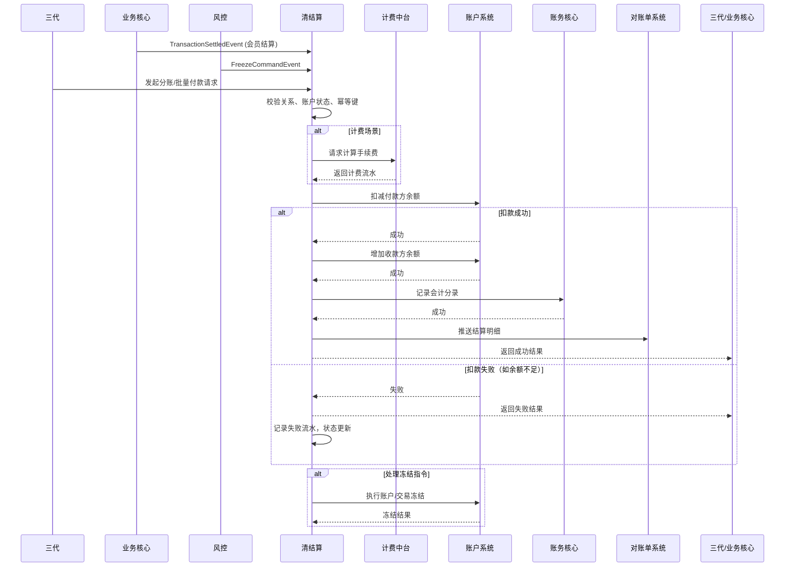

# 模块设计: 清结算

生成时间: 2026-01-22 17:47:32
批判迭代: 2

---

# 清结算模块设计文档

## 1. 概述
- **目的与范围**: 本模块负责处理交易清分、资金结算、计费处理、账户冻结以及退货流程中的资金扣减等资金清算与结算业务。它是连接交易、账户与账务的核心资金处理中枢。核心业务包括：分账、会员结算、批量付款、资金归集、退货及账户冻结。

## 2. 接口设计
- **API端点 (REST/GraphQL)**:
    - `POST /api/v1/settlement/transfer`: 处理分账/转账请求。
    - `POST /api/v1/settlement/batch-payment`: 处理批量付款请求。
    - `POST /api/v1/settlement/member-settlement`: 处理会员结算请求。
    - `POST /api/v1/settlement/refund`: 处理退货资金扣减请求。
    - `POST /api/v1/settlement/freeze`: 处理风控发起的账户/交易冻结请求。
    - `GET /api/v1/settlement/orders/{orderId}`: 查询清结算订单状态。
- **请求/响应结构**:
    - 通用请求头包含：`X-Request-Id`（幂等键）、`X-App-Id`、`X-Org-Id`。
    - 通用响应体包含：`code`、`message`、`data`、`requestId`。
    - 分账请求体示例：`{“payerAccountNo”: “…”, “receiverAccountNo”: “…”, “amount”: 100, “bizOrderNo”: “…”, “feeBearer”: “PAYER”}`。
- **发布/消费的事件**:
    - 消费事件：`TransactionSettledEvent`（来自业务核心）、`FreezeCommandEvent`（来自风控）。
    - 发布事件：`SettlementCompletedEvent`、`SettlementFailedEvent`、`AccountFrozenEvent`。

## 3. 数据模型
- **表/集合**:
    - `settlement_orders`：清结算主订单表，记录所有清结算请求。
    - `fee_records`：计费流水记录表，关联计费中台返回的计费结果。
    - `settlement_batch_details`：批量付款明细表。
    - `retry_logs`：失败重试记录表。
- **关键字段**:
    - `settlement_orders`: `order_id`（主键）、`biz_order_no`（业务订单号）、`order_type`（分账/批量付款/会员结算/退货/冻结）、`payer_account_no`、`receiver_account_no`、`amount`、`fee_amount`、`fee_bearer`、`status`（初始化/处理中/成功/失败/已冲正）、`idempotent_key`、`created_at`、`updated_at`。
    - `fee_records`: `fee_id`、`settlement_order_id`、`fee_rule_id`、`calculated_amount`、`status`。
- **与其他模块的关系**:
    - 与账户系统交互进行账户余额操作。
    - 与账务核心交互记录会计分录。
    - 与计费中台交互获取计费流水。
    - 与业务核心交互获取交易数据。
    - 与对账单系统交互提供结算明细。

## 4. 业务逻辑
- **核心工作流/算法**:
    1.  **分账/转账**:
        - 校验付款方（天财收款账户）与接收方（天财收款账户或天财接收方账户）是否存在已生效的绑定关系。
        - 调用计费中台计算手续费。
        - 执行资金划转：扣减付款方账户余额，增加收款方账户余额。
        - 调用账务核心记录分账会计分录。
        - 状态更新为成功，发布完成事件。
    2.  **会员结算**:
        - 接收来自业务核心的交易结算事件。
        - 资金首先结算至品牌总部的天财收款账户（主动结算模式）。
        - 根据预设的分账规则，触发从总部账户向各门店账户的分账流程。
        - 处理并发分账请求，确保总部账户余额一致性。
    3.  **批量付款**:
        - 校验付款方（总部天财收款账户）是否已完成“开通付款”流程。
        - 校验每个接收方（天财接收方账户）状态正常。
        - 批量调用计费中台计算总手续费。
        - 执行批量资金划转（支持部分成功处理）。
        - 生成批量付款明细，供对账使用。
    4.  **资金归集**:
        - 作为分账的一种特例，资金从门店天财收款账户向总部天财收款账户划转。
        - 需校验上下级门店关系绑定状态。
    5.  **退货处理**:
        - 根据原交易配置的退货模式，确定扣款来源账户（01待结算账户、天财收款账户或**04退货账户**）。
        - 校验原交易状态及可退金额。
        - 执行资金扣减，并记录账务。
    6.  **账户冻结**:
        - 接收风控冻结指令（商户冻结或交易冻结）。
        - 调用账户系统执行对应账户的冻结操作。
        - 若为交易冻结，需锁定对应结算订单资金。
- **业务规则与验证**:
    - 结算前需校验目标账户状态是否正常（非冻结）。
    - 分账/转账前需校验付款方与接收方是否存在已生效的绑定关系。
    - 退货时需校验原交易状态及可退金额。
    - 批量付款要求付款方具备“开通付款”资质。
- **关键边界情况处理**:
    - **并发控制**：对同一付款账户的并发操作使用数据库乐观锁或分布式锁，防止超扣。
    - **状态机管理**：清结算订单状态严格流转（初始化->处理中->成功/失败->冲正），确保幂等性。
    - **部分成功**：批量付款中单笔失败不影响其他成功项，整体结果标记为部分成功。

## 5. 时序图

## 6. 错误处理
- **预期错误情况**:
    - 业务错误：账户余额不足、账户状态异常（冻结）、绑定关系无效、计费规则不存在。
    - 系统错误：计费中台服务不可用、下游系统（账户/账务）调用超时或失败、网络异常。
- **处理策略**:
    - **幂等性**：所有请求必须携带`X-Request-Id`，基于`settlement_orders.idempotent_key`防止重复处理。
    - **重试机制**：对于网络超时等可重试错误，采用指数退避策略，最多重试3次。
    - **补偿机制**：对于分布式事务失败（如扣款成功但记账失败），采用冲正（Reverse）操作，调用账户系统进行资金退回，并更新订单状态为“已冲正”。
    - **降级逻辑**：计费中台不可用时，可根据本地缓存的最低费率进行计算，并记录降级标识，后续人工核对。
    - **监控与告警**：记录所有失败流水至`retry_logs`，并设置关键错误（如连续冲正失败）的实时告警。

## 7. 依赖关系
- **上游模块**:
    - 三代：接收分账、批量付款等业务指令。
    - 风控：接收冻结指令。
    - 业务核心：获取交易数据，触发会员结算。
- **下游模块**:
    - 账户系统：执行账户余额的扣减、增加、冻结操作。
    - 账务核心：记录所有资金变动的会计分录。
    - 计费中台：计算分账/转账手续费。
    - 对账单系统：提供结算明细数据，用于生成对账单。