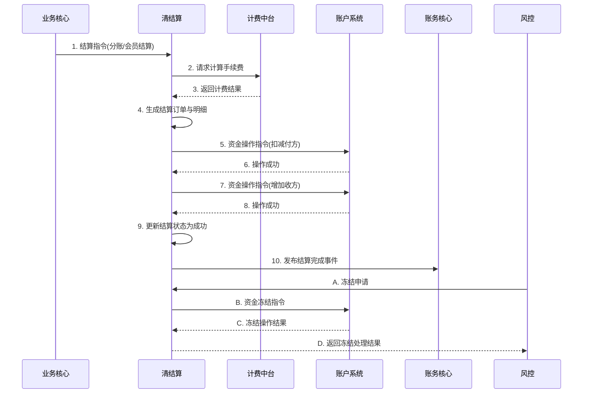

# 模块设计: 清结算

生成时间: 2026-01-22 16:15:00
批判迭代: 2

---

# 模块设计: 清结算

生成时间: TBD
批判迭代: TBD

---

# 清结算模块设计文档

## 1. 概述
- **目的与范围**: 本模块负责资金清算、结算、计费、冻结申请处理及推送结算结果。其核心职责是处理来自业务核心的交易数据，协调计费中台完成手续费计算，驱动账户系统完成资金划转，并最终将结算结果通知账务核心进行记账。其边界在于处理结算指令的生成、执行与结果同步，不直接管理账户余额，也不处理业务逻辑（如分账关系）的校验。根据术语表，"清结算"是"清结算/计费中台"的别名，在本设计中，计费中台被视为清结算模块内部的一个关键子服务或组件，负责提供手续费计算能力。

## 2. 接口设计
- **API端点 (REST)**: TBD
    - 示例：`POST /api/v1/settlement/process` 用于触发结算处理。
    - 示例：`POST /api/v1/settlement/freeze/apply` 用于处理冻结申请。
- **请求/响应结构**: TBD
    - 结算处理请求体可能包含：业务流水号、业务类型（分账/会员结算等）、参与方信息、金额等。
    - 冻结申请请求体可能包含：冻结指令号、账户号、冻结金额、风控指令号等。
- **发布/消费的事件**:
    - 消费来自"业务核心"的交易数据或结算指令。
    - 消费来自"计费中台"的计费结果事件（`FeeCalculatedEvent`）。
    - 发布结算完成事件（`SettlementCompletedEvent`），供"账务核心"消费以触发记账。
    - 发布账户操作指令事件（`AccountOperationCommand`），供"账户系统"消费以执行资金操作。
    - 接收并处理来自"风控"的冻结申请事件。

## 3. 数据模型
- **表/集合**: TBD
    - 结算订单表（`settlement_order`）
    - 结算明细表（`settlement_detail`）
    - 冻结申请记录表（`freeze_application`）
- **关键字段**: TBD
    - 结算订单表：结算单号、业务流水号、业务类型（分账/归集/会员结算/批量付款）、总金额、手续费金额、结算状态（待处理/结算中/成功/失败）、参与方机构号、创建时间。
    - 结算明细表：明细ID、结算单号、付方账户号、收方账户号、结算金额、账户类型、状态。
    - 冻结申请记录表：申请ID、风控指令号、目标账户号、申请冻结金额、处理状态（待处理/已发送/成功/失败）、创建时间。
- **与其他模块的关系**: 本模块的结算单与"业务核心"的交易数据通过业务流水号关联；结算明细中的账户号与"账户系统"关联；结算结果与"账务核心"的会计分录关联；冻结申请与"风控"指令关联。

## 4. 业务逻辑
- **核心工作流/算法**:
    1.  **结算流程**:
        - 接收业务核心的结算指令或交易数据。
        - 调用"计费中台"计算手续费（或消费其事件）。
        - 生成结算订单和明细，状态为"待处理"。
        - 根据业务类型（如分账、会员结算）和结算模式（主动/被动），构造资金划转指令。
        - 向"账户系统"发送资金操作指令（扣减付方，增加收方）。
        - 接收账户系统操作结果，更新结算状态。
        - 发布"结算完成事件"通知"账务核心"记账。
    2.  **冻结申请处理流程**:
        - 接收来自"风控"的冻结申请。
        - 记录冻结申请，状态为"待处理"。
        - 向"账户系统"发送资金冻结指令。
        - 根据账户系统返回结果，更新申请状态并反馈给风控。
- **业务规则与验证**:
    - 结算前需确保业务数据合法且状态可结算。
    - 驱动账户系统进行资金操作前，需明确付方、收方账户及金额。
    - 处理冻结申请时，需校验目标账户是否存在且状态正常。
    - 所有操作需保证幂等性。
- **关键边界情况处理**:
    - 账户系统操作失败（如余额不足）：回滚结算状态，记录失败原因，并可能触发冲正流程。
    - 计费中台服务不可用：可采用降级策略（如使用默认费率）或快速失败。
    - 消息重复消费：通过业务流水号等实现幂等，避免重复结算。
- **幂等性实现**:
    - 在结算流程开始时，根据业务流水号检查是否已存在处理中的结算单。若存在，则拒绝重复处理或返回已有结果。
    - 所有对外发送的指令（如账户操作指令）均携带幂等键（如业务流水号），确保接收方能正确处理重复请求。
- **事务与补偿机制**:
    - 结算流程涉及多个步骤，采用Saga模式保证最终一致性。
    - 若向账户系统发送扣减指令成功，但增加指令失败，则触发补偿操作，向付方账户执行一笔增加指令以回滚之前的扣减。
    - 补偿操作同样需要保证幂等性。

## 5. 时序图

## 6. 错误处理
- **预期错误情况**: 接收到的业务数据不合法或缺失；计费中台调用失败或返回异常；账户系统操作失败（余额不足、账户状态异常）；数据库操作失败；消息投递失败；补偿操作失败。
- **处理策略**:
    - 对业务数据错误立即返回失败。
    - 对依赖服务（计费中台、账户系统）的临时故障进行有限次重试。
    - 对账户余额不足等业务性失败，终止流程并记录明确失败原因，触发相应的补偿流程。
    - 所有失败均需记录详细日志并告警。
    - 通过Saga模式与补偿机制确保跨系统操作的最终一致性。
    - 监控补偿操作的执行状态，对于补偿失败的情况进行告警并人工介入。

## 7. 依赖关系
- **上游模块**:
    - 业务核心：提供结算指令与原始交易数据。
    - 计费中台：作为内部子服务，提供手续费计算结果。
    - 风控：发起冻结申请指令。
- **下游模块**:
    - 账户系统：消费本模块发出的资金操作指令（扣减、增加、冻结），并返回操作结果。
    - 账务核心：消费本模块发布的结算完成事件，进行会计分录记账。