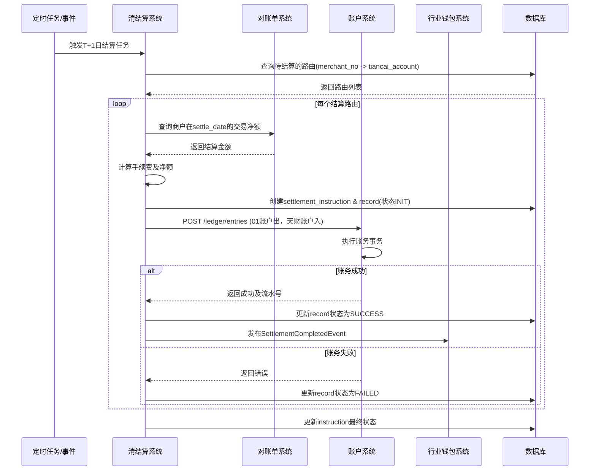
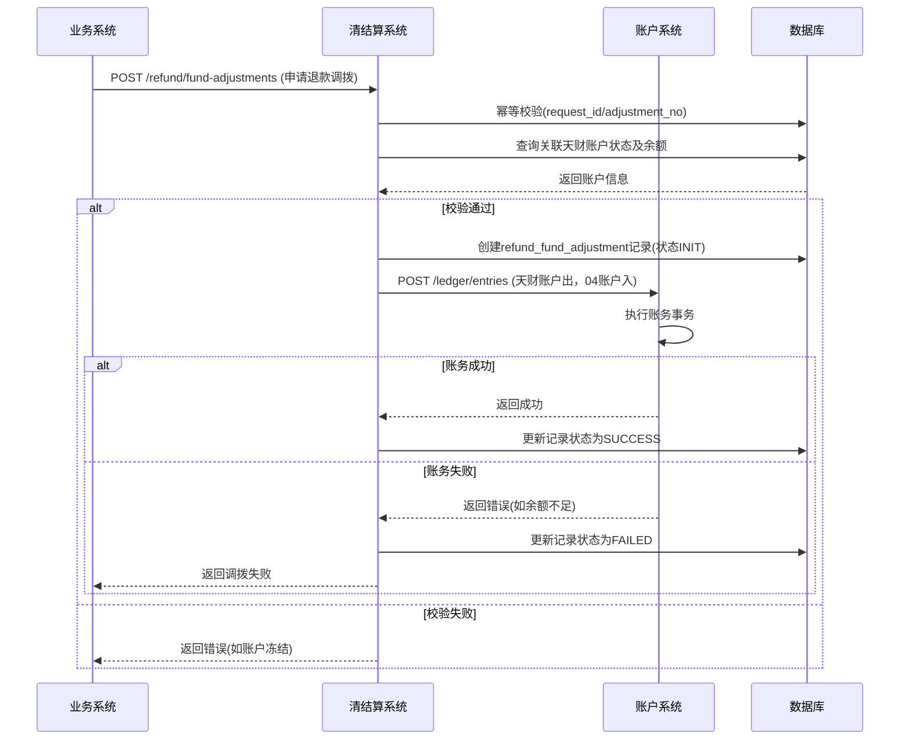

# 模块设计: 清结算系统

生成时间: 2026-01-19 15:30:59

---

# 清结算系统模块设计文档

## 1. 概述

### 1.1 目的
本模块作为支付体系中的资金处理核心，负责处理与“天财分账业务”相关的交易清算、资金结算、计费以及退货资金处理。它连接收单交易、账户系统和行业钱包系统，确保天财专用账户的资金能够按照业务规则，从待结算账户准确、及时地结算到目标账户，并处理相关的退货资金流转。

### 1.2 范围
- **资金结算**：将收单交易沉淀在“待结算账户（01账户）”中的资金，根据商户配置的结算模式（本场景下为“主动结算”），划转至指定的“天财收款账户”。
- **退货处理**：处理天财场景下的退货交易，协调“退货账户（04账户）”与“天财收款账户”之间的资金调拨。
- **计费处理**：在结算过程中，根据计费规则计算并扣除交易手续费。
- **清算文件处理**：生成并提供与结算、退货相关的资金对账文件。
- **与天财分账的协同**：作为分账业务的资金源头，为“行业钱包系统”的分账指令提供已结算到账的资金保障。

## 2. 接口设计

### 2.1 API端点 (RESTful)

#### 2.1.1 结算指令处理接口
- **POST /api/v1/settlement/instructions**
    - **描述**：接收来自支付核心或定时任务触发的结算指令，将资金从待结算账户（01）结算至目标天财收款账户。支持批量处理。
    - **请求体**：
      ```json
      {
        "request_id": "settle_req_20250120001",
        "instruction_type": "REGULAR_SETTLEMENT", // 指令类型：REGULAR_SETTLEMENT(常规结算), REFUND_SETTLEMENT(退货结算)
        "settle_date": "2025-01-19", // 结算日期（账期）
        "items": [
          {
            "biz_settle_no": "STL_M100001_20250119", // 业务结算流水号，用于幂等
            "source_account_no": "0100000001", // 源账户号（待结算账户01）
            "target_tiancai_account_id": "TCA_20231011001", // 目标天财账户ID
            "target_account_no": "3010001001", // 目标账户号（天财收款账户）
            "currency": "CNY",
            "settle_amount": 150000, // 结算金额（元）
            "fee_amount": 300, // 手续费金额（元）
            "net_amount": 149700, // 净结算金额（元）
            "trade_summary": { // 交易汇总信息（可选，用于对账）
              "total_count": 100,
              "total_amount": 150000
            }
          }
        ]
      }
      ```
    - **响应体**：
      ```json
      {
        "code": "SUCCESS",
        "message": "处理成功",
        "data": {
          "instruction_id": "INST_202501200001",
          "status": "PROCESSING", // PROCESSING, PARTIAL_SUCCESS, SUCCESS, FAILED
          "details": [
            {
              "biz_settle_no": "STL_M100001_20250119",
              "status": "SUCCESS",
              "ledger_entry_no": "LE_202501200001" // 关联的账务流水号
            }
          ]
        }
      }
      ```

#### 2.1.2 退货资金处理接口
- **POST /api/v1/refund/fund-adjustments**
    - **描述**：处理天财场景的退货。当发生退货时，需从天财收款账户扣款至退货账户（04），或从退货账户退款至用户原路。
    - **请求体**：
      ```json
      {
        "request_id": "refund_adj_001",
        "adjustment_type": "MERCHANT_REFUND", // MERCHANT_REFUND(商户退款), SYSTEM_REFUND(系统退款)
        "original_trade_no": "PAY_20250119001", // 原支付交易号
        "refund_trade_no": "REF_20250120001", // 本次退款交易号
        "tiancai_account_id": "TCA_20231011001", // 关联的天财收款账户ID
        "receive_account_no": "3010001001", // 天财收款账户号（出款方）
        "refund_account_no": "0400000001", // 退货账户号（04账户，入款方）
        "amount": 5000,
        "currency": "CNY",
        "reason": "客户取消订单"
      }
      ```
    - **响应体**：返回调拨处理结果及账务流水号。

#### 2.1.3 查询接口
- **GET /api/v1/settlement/instructions/{instruction_id}**：查询结算指令状态。
- **GET /api/v1/settlement/records?tiancai_account_id={}&settle_date={}&status={}**：查询结算记录。
- **GET /api/v1/refund/adjustments?tiancai_account_id={}&date={}**：查询退货资金调拨记录。

### 2.2 发布/消费的事件

#### 2.2.1 消费的事件
- **TradeSettledEvent** (来自支付核心)：消费已清算完成的交易汇总事件，触发结算任务。
- **TiancaiAccountCreatedEvent** (来自账户系统)：获知天财收款账户创建，用于建立结算路由（将商户的待结算账户01与天财收款账户关联）。
- **RefundAppliedEvent** (来自支付核心/业务系统)：消费退款申请事件，触发退货资金处理流程。

#### 2.2.2 发布的事件
- **SettlementCompletedEvent**：当资金成功从待结算账户结算至天财收款账户后发布，通知行业钱包系统资金已到位，可执行分账。
  ```json
  {
    "event_id": "event_settle_001",
    "event_type": "SETTLEMENT_COMPLETED",
    "timestamp": "2025-01-20T02:00:00Z",
    "data": {
      "tiancai_account_id": "TCA_20231011001",
      "account_no": "3010001001",
      "settle_date": "2025-01-19",
      "net_amount": 149700,
      "currency": "CNY",
      "biz_settle_no": "STL_M100001_20250119"
    }
  }
  ```
- **RefundFundAdjustmentCompletedEvent**：退货资金调拨完成时发布，供对账系统使用。
- **SettlementInstructionProcessedEvent**：结算指令处理完成（无论成功失败）时发布，供监控和报表系统使用。

## 3. 数据模型

### 3.1 核心表设计

#### 表：`settlement_instruction` (结算指令表)
| 字段名 | 类型 | 必填 | 默认值 | 描述 |
| :--- | :--- | :--- | :--- | :--- |
| `id` | bigint | Y | AUTO_INCREMENT | 主键 |
| `instruction_id` | varchar(32) | Y | | **业务指令ID**，全局唯一 |
| `request_id` | varchar(64) | Y | | 请求流水号，用于幂等 |
| `instruction_type` | varchar(30) | Y | | 指令类型：`REGULAR_SETTLEMENT`, `REFUND_SETTLEMENT` |
| `settle_date` | date | Y | | 结算日期（账期） |
| `status` | varchar(20) | Y | `INIT` | 状态：`INIT`, `PROCESSING`, `SUCCESS`, `FAILED`, `PARTIAL_SUCCESS` |
| `total_count` | int | Y | 0 | 指令条目总数 |
| `success_count` | int | Y | 0 | 成功条目数 |
| `failure_count` | int | Y | 0 | 失败条目数 |
| `created_at` | datetime | Y | CURRENT_TIMESTAMP | |
| `updated_at` | datetime | Y | CURRENT_TIMESTAMP ON UPDATE | |

#### 表：`settlement_record` (结算记录表)
| 字段名 | 类型 | 必填 | 默认值 | 描述 |
| :--- | :--- | :--- | :--- | :--- |
| `id` | bigint | Y | AUTO_INCREMENT | 主键 |
| `biz_settle_no` | varchar(64) | Y | | **业务结算流水号**，唯一键 |
| `instruction_id` | varchar(32) | Y | | 所属指令ID |
| `source_account_no` | varchar(20) | Y | | 源账户（待结算账户01） |
| `target_tiancai_account_id` | varchar(32) | Y | | 目标天财账户ID |
| `target_account_no` | varchar(20) | Y | | 目标账户（天财收款账户） |
| `currency` | varchar(3) | Y | `CNY` | |
| `settle_amount` | decimal(15,2) | Y | | 结算金额（含手续费） |
| `fee_amount` | decimal(15,2) | Y | | 手续费金额 |
| `net_amount` | decimal(15,2) | Y | | 净结算金额 |
| `status` | varchar(20) | Y | `INIT` | 状态：`INIT`, `ACCOUNT_PROCESSING`, `SUCCESS`, `FAILED` |
| `ledger_entry_no` | varchar(32) | N | | 账户系统返回的账务流水号 |
| `trade_summary` | json | N | | 交易汇总信息 |
| `error_msg` | text | N | | 失败原因 |
| `completed_at` | datetime | N | | 完成时间 |
| `created_at` | datetime | Y | CURRENT_TIMESTAMP | |

#### 表：`refund_fund_adjustment` (退货资金调拨表)
| 字段名 | 类型 | 必填 | 默认值 | 描述 |
| :--- | :--- | :--- | :--- | :--- |
| `id` | bigint | Y | AUTO_INCREMENT | 主键 |
| `adjustment_no` | varchar(32) | Y | | **调拨流水号**，唯一 |
| `request_id` | varchar(64) | Y | | 请求流水号，幂等 |
| `adjustment_type` | varchar(30) | Y | | 类型：`MERCHANT_REFUND`, `SYSTEM_REFUND` |
| `original_trade_no` | varchar(64) | Y | | 原支付交易号 |
| `refund_trade_no` | varchar(64) | Y | | 退款交易号 |
| `tiancai_account_id` | varchar(32) | Y | | 关联的天财账户ID |
| `receive_account_no` | varchar(20) | Y | | 出款账户（天财收款账户） |
| `refund_account_no` | varchar(20) | Y | | 入款账户（退货账户04） |
| `amount` | decimal(15,2) | Y | | 调拨金额 |
| `currency` | varchar(3) | Y | `CNY` | |
| `status` | varchar(20) | Y | `INIT` | 状态：`INIT`, `SUCCESS`, `FAILED` |
| `ledger_entry_no` | varchar(32) | N | | 账务流水号 |
| `reason` | varchar(255) | N | | 调拨原因 |
| `created_at` | datetime | Y | CURRENT_TIMESTAMP | |

#### 表：`settlement_route` (结算路由表)
| 字段名 | 类型 | 必填 | 默认值 | 描述 |
| :--- | :--- | :--- | :--- | :--- |
| `id` | bigint | Y | AUTO_INCREMENT | 主键 |
| `merchant_no` | varchar(32) | Y | | 收单商户号 |
| `settle_account_no` | varchar(20) | Y | | 待结算账户号（01账户） |
| `tiancai_account_id` | varchar(32) | Y | | 目标天财收款账户ID |
| `target_account_no` | varchar(20) | Y | | 目标天财收款账户号 |
| `settle_mode` | varchar(20) | Y | `ACTIVE` | 结算模式：`ACTIVE` |
| `status` | varchar(20) | Y | `ACTIVE` | 状态：`ACTIVE`, `INACTIVE` |
| `created_at` | datetime | Y | CURRENT_TIMESTAMP | |

### 3.2 与其他模块的关系
- **账户系统**：通过调用账务操作接口(`/ledger/entries`)执行资金划转，是核心的资金操作依赖方。
- **行业钱包系统**：消费本模块发布的`SettlementCompletedEvent`，作为触发分账的起点。
- **支付核心（三代系统）**：消费其发布的交易清算完成事件，是结算任务的触发源；同时为其提供退货资金处理服务。
- **对账单系统**：为本模块提供交易明细数据以汇总结算金额，并消费本模块发布的事件生成资金结算对账单。

## 4. 业务逻辑

### 4.1 核心算法与规则

#### 4.1.1 主动结算流程（天财收款账户）
1. **触发时机**：每日定时任务（如T+1日凌晨）或实时触发（根据`TradeSettledEvent`）。
2. **路由查找**：根据`merchant_no`查询`settlement_route`表，找到对应的待结算账户（01）和目标天财收款账户。
3. **金额汇总**：调用对账单系统或内部汇总服务，统计指定账期(`settle_date`)内，该待结算账户对应的所有成功交易净额（交易金额 - 已发生退款）。
4. **计费计算**：根据商户费率合同，计算该笔结算应付的手续费。
    - `结算金额 = 交易净额`
    - `净结算金额 = 结算金额 - 手续费`
5. **生成指令**：创建结算指令和记录，状态置为`INIT`。
6. **调用账户系统**：调用账户系统账务接口，执行资金划转：
    - **借记（DEBIT）** 待结算账户（01），金额为`净结算金额`。
    - **贷记（CREDIT）** 天财收款账户，金额为`净结算金额`。
    - （手续费单独记入收入账户，此逻辑可能内嵌在账户系统或清结算内部）。
7. **状态更新与发布事件**：账务成功则更新记录状态为`SUCCESS`，并发布`SettlementCompletedEvent`。失败则记录错误，进行重试或人工干预。

#### 4.1.2 天财场景退货处理规则
1. **商户发起退款**：
   - 资金路径：天财收款账户 (出) -> 退货账户（04）(入)。
   - 逻辑：调用账户系统，从天财收款账户的可用余额中扣减退款金额，记入退货账户。退货账户资金后续用于原路退回给用户。
2. **系统原路退款**：
   - 资金路径：退货账户（04）(出) -> 银行/支付渠道。
   - 逻辑：此步骤通常由支付核心执行，清结算系统负责确保退货账户中有足额资金。
3. **校验**：执行调拨前，需校验天财收款账户状态是否正常、可用余额是否充足。

#### 4.1.3 幂等性与一致性
- **结算**：使用`biz_settle_no`作为业务唯一键，在`settlement_record`表中实现幂等。账户系统层面使用`biz_trade_no`保证账务幂等。
- **退货调拨**：使用`request_id`和`adjustment_no`实现双重幂等保证。
- **分布式事务**：与账户系统的账务操作为同步调用，依赖其内部事务保证资金划转的原子性。本系统记录操作状态，用于对账和补偿。

### 4.2 验证逻辑
- **结算指令验证**：验证结算日期有效性、目标天财账户是否存在且状态为`ACTIVE`、结算路由有效。
- **金额验证**：结算金额、手续费需大于0，且净结算金额不大于源账户余额（由账户系统最终校验）。
- **退货调拨验证**：验证原交易是否存在、退款金额是否合理、关联的天财账户是否有权操作此退款。

## 5. 时序图

### 5.1 天财收款账户日常结算流程


### 5.2 天财场景退货资金调拨流程


## 6. 错误处理

| 错误码 | HTTP 状态码 | 描述 | 处理策略 |
| :--- | :--- | :--- | :--- |
| `SETTLE_ROUTE_NOT_FOUND` | 404 | 未找到该商户的生效结算路由 | 检查商户是否已开通天财账户并配置路由，结算任务暂停并告警。 |
| `SETTLE_AMOUNT_INVALID` | 400 | 结算金额计算错误（<=0） | 记录异常，跳过该商户本次结算，发出业务告警。 |
| `TIANCAI_ACCOUNT_INACTIVE` | 422 | 目标天财账户状态非ACTIVE | 结算任务暂停，等待账户恢复或人工处理。 |
| `ACCOUNT_TRANSFER_FAILED` | 502 | 调用账户系统账务操作失败 | 根据账户系统返回的具体错误码决定重试策略（如网络错误重试，余额不足则失败）。 |
| `DUPLICATE_SETTLE_NO` | 409 | 重复的`biz_settle_no` | 返回已存在的结算记录信息，确保幂等。 |
| `REFUND_ORIGINAL_TRADE_NOT_FOUND` | 404 | 退货对应的原交易不存在 | 拒绝调拨请求。 |
| `REFUND_ACCOUNT_BALANCE_INSUFFICIENT` | 422 | 天财收款账户余额不足 | 拒绝调拨请求，通知业务方。 |
| `DATA_AGGREGATION_ERROR` | 500 | 从对账单系统汇总数据失败 | 重试查询，多次失败后触发告警，人工介入。 |

**通用策略**：
- **业务逻辑错误(4xx)**：立即失败，记录明确日志，通知上游系统。
- **外部依赖错误(5xx/网络超时)**：
  - **结算任务**：标记该条记录为`FAILED`，指令状态为`PARTIAL_SUCCESS`。整体任务继续执行其他路由。失败记录进入延时重试队列。
  - **退货调拨**：立即向调用方返回失败，支持其重试（依赖`request_id`幂等）。
- **重试机制**：对可重试错误（网络超时、数据库死锁），采用指数退避策略，最多重试3次。

## 7. 依赖说明

### 7.1 上游依赖
1. **支付核心（三代系统）**
   - **交互方式**：异步事件消费 (`TradeSettledEvent`, `RefundAppliedEvent`)。
   - **职责**：提供已清算的交易数据作为结算源；触发退款流程。
   - **关键点**：事件数据的准确性和及时性是结算正确性的基础。需有监控确保事件不丢失。

2. **账户系统**
   - **交互方式**：同步REST API调用 (`POST /ledger/entries`)。
   - **职责**：执行所有资金划转的底层账务操作。
   - **关键点**：**强依赖**。其可用性和性能直接决定清结算系统的吞吐量与成功率。需有熔断和降级策略（如堆积队列）。

3. **对账单系统**
   - **交互方式**：同步REST API调用。
   - **职责**：提供指定商户和账期的交易金额汇总数据。
   - **关键点**：结算金额计算的依据，需保证数据一致性（如已汇总的金额不会因后续退货而改变）。

4. **行业钱包系统**
   - **交互方式**：异步事件消费 (`TiancaiAccountCreatedEvent`)。
   - **职责**：提供天财账户创建信息，用于建立结算路由。
   - **关键点**：需及时建立路由，否则会影响结算。

### 7.2 设计原则
- **最终一致性**：通过事件驱动，与支付核心、行业钱包等系统达成最终一致性。结算完成后发布事件，驱动下游分账。
- **职责清晰**：
  - **清结算**：负责“资金何时、何路径、算多少”的问题。
  - **账户系统**：负责“资金如何安全地从一个数字转移到另一个数字”。
  - **行业钱包**：负责“资金到账后，根据业务规则如何再分配”。
- **可观测性**：所有结算指令、调拨记录状态可查，关键步骤有明确日志，便于对账和问题排查。
- **弹性设计**：结算任务支持分批、并行处理，单条失败不影响整体。依赖外部系统故障时有重试和补偿机制。