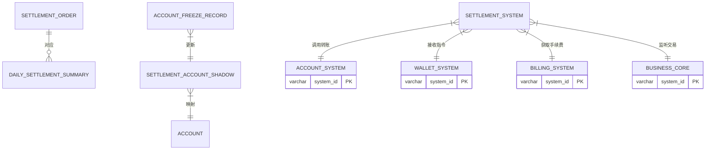

# 模块设计: 清结算系统

生成时间: 2026-01-16 17:17:47

---

# 清结算系统模块设计文档

## 1. 概述

### 1.1 目的
清结算系统作为天财商龙业务场景下的资金处理核心，负责处理与“天财专用账户”相关的资金清算与结算业务。主要目的是：
1. **资金划拨**：处理天财分账交易（转账）的资金实际流转，包括从天财收款账户到天财接收方账户的划转。
2. **结算单生成**：为主动结算商户生成结算单，驱动资金从待结算账户（01账户）结算至其天财收款账户。
3. **退货处理**：处理涉及天财账户的交易退货，协调退货账户（04账户）完成资金退回。
4. **账户冻结**：根据风控或业务指令，对天财专用账户进行资金冻结/解冻操作。
5. **对账支持**：为对账单系统提供结算相关的资金变动明细。

### 1.2 范围
- **天财分账结算**：执行天财专用账户间的转账指令，完成资金划拨。
- **主动结算处理**：对于配置为“主动结算”的收单商户，定时（如T+1）将其待结算账户的资金结算至其绑定的天财收款账户。
- **被动结算触发**：接收“提款”指令，将被动结算商户待结算账户的资金划拨至其指定账户（可能是天财收款账户）。
- **退货资金结算**：当发生交易退货时，将资金从退货账户（04账户）退回至原支付账户或指定的天财账户。
- **账户冻结/解冻**：提供接口对天财专用账户进行资金冻结与解冻。
- **手续费处理**：与计费中台协同，在资金划拨过程中扣除相应手续费。

## 2. 接口设计

### 2.1 API端点 (REST)

#### 2.1.1 执行天财分账（转账）
- **端点**：`POST /api/v1/settlement/tiancai-transfer`
- **描述**：接收来自行业钱包系统的分账指令，执行天财专用账户间的资金划转。此为清结算系统的核心入口。
- **调用方**：行业钱包系统
- **认证**：系统间API Key认证
- **请求头**：
  ```json
  {
    "X-App-Id": "wallet_system_id",
    "X-Api-Key": "encrypted_secret",
    "X-Request-Id": "uuid_from_wallet"
  }
  ```
- **请求体**：
  ```json
  {
    "requestId": "unique_request_id",
    "transferType": "TIANCAI_SPLIT", // 交易类型：天财分账
    "outAccountNo": "转出方天财账户号",
    "inAccountNo": "转入方天财账户号",
    "amount": "100.00", // 分账金额
    "feeAmount": "1.00", // 手续费金额（由计费中台计算）
    "feeDeductSide": "OUT", // 手续费扣款方：OUT-付方, IN-收方, SEPARATE-各自承担
    "originalTransactionId": "原收单交易流水号", // 关联的原交易
    "splitOrderNo": "分账订单号", // 钱包系统生成
    "remark": "门店归集资金"
  }
  ```
- **响应体** (成功)：
  ```json
  {
    "code": "SUCCESS",
    "message": "分账成功",
    "data": {
      "settlementId": "清结算系统流水号",
      "transferTime": "2024-01-01 10:30:25",
      "outBalance": "900.00", // 转出方新余额
      "inBalance": "100.00" // 转入方新余额
    }
  }
  ```

#### 2.1.2 触发主动结算
- **端点**：`POST /api/v1/settlement/active-settle`
- **描述**：由定时任务或手动触发，将指定商户待结算账户的资金结算至其天财收款账户。
- **调用方**：内部定时任务 / 运营管理台
- **请求体**：
  ```json
  {
    "batchNo": "SETTLE_20240101_001",
    "merchantNo": "收单商户号",
    "settleDate": "2024-01-01", // 结算日期
    "forceSettle": false // 是否强制结算（忽略风控等限制）
  }
  ```
- **响应体**：
  ```json
  {
    "code": "SUCCESS",
    "data": {
      "settlementId": "结算流水号",
      "settleAmount": "10000.00",
      "feeAmount": "10.00",
      "actualAmount": "9990.00",
      "fromAccount": "待结算账户号",
      "toAccount": "天财收款账户号",
      "status": "SUCCESS"
    }
  }
  ```

#### 2.1.3 账户资金冻结/解冻
- **端点**：`POST /api/v1/settlement/account-freeze`
- **描述**：冻结或解冻指定天财账户的资金。
- **调用方**：风控系统 / 行业钱包系统 / 运营管理台
- **请求体**：
  ```json
  {
    "requestId": "unique_request_id",
    "accountNo": "天财账户号",
    "operation": "FREEZE | UNFREEZE",
    "freezeType": "ACCOUNT | AMOUNT", // 账户冻结 | 金额冻结
    "freezeAmount": "50.00", // freezeType为AMOUNT时必填
    "reason": "风控预警-可疑交易",
    "expireTime": "2024-01-08 10:00:00", // 冻结到期时间
    "operator": "system_risk_control"
  }
  ```
- **响应体**：
  ```json
  {
    "code": "SUCCESS",
    "data": {
      "freezeId": "冻结操作流水号",
      "accountNo": "账户号",
      "frozenBalance": "50.00", // 冻结后冻结金额
      "availableBalance": "950.00", // 可用余额
      "operationTime": "2024-01-01 11:00:00"
    }
  }
  ```

#### 2.1.4 查询结算状态
- **端点**：`GET /api/v1/settlement/status/{settlementId}`
- **描述**：根据结算流水号查询结算执行状态。
- **调用方**：行业钱包系统 / 对账单系统 / 运营管理台
- **响应体**：
  ```json
  {
    "code": "SUCCESS",
    "data": {
      "settlementId": "清结算系统流水号",
      "originalRequestId": "原请求ID",
      "transferType": "TIANCAI_SPLIT",
      "outAccountNo": "转出账户",
      "inAccountNo": "转入账户",
      "amount": "100.00",
      "status": "PROCESSING | SUCCESS | FAILED | PARTIAL_SUCCESS",
      "failReason": "失败原因",
      "createTime": "2024-01-01 10:30:00",
      "completeTime": "2024-01-01 10:30:25"
    }
  }
  ```

### 2.2 发布的事件

#### 2.2.1 分账完成事件
- **事件名**：`TIANCAI_TRANSFER_COMPLETED`
- **发布时机**：天财分账资金划拨成功完成时
- **事件内容**：
  ```json
  {
    "eventId": "uuid",
    "eventType": "TIANCAI_TRANSFER_COMPLETED",
    "timestamp": "2024-01-01T10:30:25Z",
    "data": {
      "settlementId": "清结算流水号",
      "splitOrderNo": "分账订单号",
      "originalTransactionId": "原交易流水号",
      "outAccountNo": "转出账户",
      "inAccountNo": "转入账户",
      "amount": "100.00",
      "feeAmount": "1.00",
      "transferTime": "2024-01-01 10:30:25",
      "status": "SUCCESS"
    }
  }
  ```

#### 2.2.2 结算单生成事件
- **端点**：`SETTLEMENT_ORDER_GENERATED`
- **发布时机**：主动结算处理完成，结算单生成时
- **事件内容**：
  ```json
  {
    "eventId": "uuid",
    "eventType": "SETTLEMENT_ORDER_GENERATED",
    "timestamp": "2024-01-02T02:00:00Z",
    "data": {
      "settlementId": "结算流水号",
      "batchNo": "SETTLE_20240101_001",
      "merchantNo": "收单商户号",
      "settleDate": "2024-01-01",
      "settleAmount": "10000.00",
      "feeAmount": "10.00",
      "actualAmount": "9990.00",
      "fromAccount": "待结算账户号",
      "toAccount": "天财收款账户号",
      "generateTime": "2024-01-02 02:00:00"
    }
  }
  ```

#### 2.2.3 账户冻结事件
- **事件名**：`ACCOUNT_FROZEN`
- **发布时机**：账户资金冻结/解冻操作成功时
- **事件内容**：
  ```json
  {
    "eventId": "uuid",
    "eventType": "ACCOUNT_FROZEN",
    "timestamp": "2024-01-01T11:00:00Z",
    "data": {
      "freezeId": "冻结操作流水号",
      "accountNo": "账户号",
      "operation": "FREEZE | UNFREEZE",
      "freezeType": "ACCOUNT | AMOUNT",
      "freezeAmount": "50.00",
      "frozenBalance": "50.00",
      "availableBalance": "950.00",
      "reason": "风控预警",
      "operator": "system_risk_control",
      "operationTime": "2024-01-01 11:00:00"
    }
  }
  ```

### 2.3 消费的事件

#### 2.3.1 账户创建事件 (`ACCOUNT_CREATED`)
- **来源**：账户系统
- **消费逻辑**：清结算系统监听此事件，为新创建的天财专用账户在清结算系统内初始化对应的账户影子记录，用于跟踪冻结金额等状态。

#### 2.3.2 收单交易成功事件 (`TRANSACTION_SUCCESS`)
- **来源**：业务核心
- **消费逻辑**：记录交易信息，用于后续的退货处理。对于主动结算商户，此交易金额会计入其待结算账户的“待结算余额”。

#### 2.3.3 退货申请事件 (`REFUND_REQUESTED`)
- **来源**：业务核心
- **消费逻辑**：触发退货资金结算流程，从退货账户（04账户）或原天财收款账户向买家退款。

## 3. 数据模型

### 3.1 数据库表设计

#### 表：settlement_order (结算订单表)
| 字段名 | 类型 | 必填 | 默认值 | 说明 |
|--------|------|------|--------|------|
| id | bigint | Y | AUTO_INCREMENT | 主键 |
| settlement_id | varchar(32) | Y | | 清结算系统流水号，唯一 |
| original_request_id | varchar(32) | Y | | 原请求ID（如钱包的requestId） |
| split_order_no | varchar(32) | N | | 分账订单号（钱包生成） |
| batch_no | varchar(32) | N | | 结算批次号（用于主动结算） |
| transfer_type | varchar(20) | Y | | 类型：TIANCAI_SPLIT, ACTIVE_SETTLE, REFUND, WITHDRAW |
| out_account_no | varchar(32) | Y | | 转出账户号 |
| in_account_no | varchar(32) | Y | | 转入账户号 |
| amount | decimal(15,2) | Y | | 交易金额 |
| fee_amount | decimal(15,2) | Y | 0.00 | 手续费金额 |
| fee_deduct_side | varchar(10) | Y | OUT | 手续费扣款方：OUT, IN, SEPARATE |
| currency | varchar(3) | Y | CNY | 币种 |
| status | varchar(20) | Y | PROCESSING | 状态：PROCESSING, SUCCESS, FAILED, PARTIAL_SUCCESS |
| fail_reason | varchar(200) | N | | 失败原因 |
| remark | varchar(200) | N | | 备注 |
| create_time | datetime | Y | CURRENT_TIMESTAMP | 创建时间 |
| update_time | datetime | Y | CURRENT_TIMESTAMP ON UPDATE | 更新时间 |
| complete_time | datetime | N | | 完成时间 |

**索引**：
- 唯一索引：`uk_settlement_id` (settlement_id)
- 唯一索引：`uk_original_request` (original_request_id)
- 索引：`idx_split_order_no` (split_order_no)
- 复合索引：`idx_account_time` (out_account_no, create_time)
- 复合索引：`idx_status_time` (status, create_time)

#### 表：account_freeze_record (账户冻结记录表)
| 字段名 | 类型 | 必填 | 默认值 | 说明 |
|--------|------|------|--------|------|
| id | bigint | Y | AUTO_INCREMENT | 主键 |
| freeze_id | varchar(32) | Y | | 冻结操作流水号，唯一 |
| account_no | varchar(32) | Y | | 账户号 |
| operation | varchar(10) | Y | | 操作：FREEZE, UNFREEZE |
| freeze_type | varchar(10) | Y | | 类型：ACCOUNT, AMOUNT |
| freeze_amount | decimal(15,2) | N | | 冻结金额（freeze_type=AMOUNT时有效） |
| frozen_balance | decimal(15,2) | Y | 0.00 | 操作后该账户的总冻结金额 |
| available_balance | decimal(15,2) | Y | | 操作后可用余额（冗余，从账户系统同步） |
| reason | varchar(200) | Y | | 冻结/解冻原因 |
| operator | varchar(50) | Y | | 操作者 |
| expire_time | datetime | N | | 冻结到期时间 |
| create_time | datetime | Y | CURRENT_TIMESTAMP | 创建时间 |

**索引**：
- 唯一索引：`uk_freeze_id` (freeze_id)
- 索引：`idx_account_op_time` (account_no, operation, create_time)
- 索引：`idx_expire_time` (expire_time) -- 用于定时解冻任务

#### 表：settlement_account_shadow (结算账户影子表)
| 字段名 | 类型 | 必填 | 默认值 | 说明 |
|--------|------|------|--------|------|
| id | bigint | Y | AUTO_INCREMENT | 主键 |
| account_no | varchar(32) | Y | | 账户号（与账户系统account表对应） |
| merchant_no | varchar(32) | Y | | 商户号 |
| account_type | varchar(20) | Y | | 账户类型 |
| tiancai_flag | tinyint(1) | Y | 0 | 天财标记 |
| frozen_balance | decimal(15,2) | Y | 0.00 | 冻结金额（清结算系统维护） |
| pending_settle_balance | decimal(15,2) | Y | 0.00 | 待结算余额（仅待结算账户有效） |
| version | int | Y | 0 | 版本号，用于乐观锁 |
| last_sync_time | datetime | Y | | 最后与账户系统同步时间 |
| create_time | datetime | Y | CURRENT_TIMESTAMP | 创建时间 |
| update_time | datetime | Y | CURRENT_TIMESTAMP ON UPDATE | 更新时间 |

**索引**：
- 唯一索引：`uk_account_no` (account_no)
- 索引：`idx_merchant_no` (merchant_no)
- 索引：`idx_tiancai_flag` (tiancai_flag)

#### 表：daily_settlement_summary (日终结算汇总表)
| 字段名 | 类型 | 必填 | 默认值 | 说明 |
|--------|------|------|--------|------|
| id | bigint | Y | AUTO_INCREMENT | 主键 |
| settle_date | date | Y | | 结算日期 |
| merchant_no | varchar(32) | Y | | 商户号 |
| account_no | varchar(32) | Y | | 结算目标账户（天财收款账户） |
| total_settle_amount | decimal(15,2) | Y | 0.00 | 当日应结算总额 |
| total_fee_amount | decimal(15,2) | Y | 0.00 | 手续费总额 |
| actual_settle_amount | decimal(15,2) | Y | 0.00 | 实际结算金额 |
| settlement_status | varchar(20) | Y | PENDING | 状态：PENDING, PROCESSING, SUCCESS, FAILED |
| batch_no | varchar(32) | N | | 结算批次号 |
| settlement_id | varchar(32) | N | | 结算流水号 |
| create_time | datetime | Y | CURRENT_TIMESTAMP | 创建时间 |
| update_time | datetime | Y | CURRENT_TIMESTAMP ON UPDATE | 更新时间 |

**索引**：
- 唯一索引：`uk_date_merchant` (settle_date, merchant_no)
- 索引：`idx_settle_date` (settle_date)
- 索引：`idx_settlement_status` (settlement_status)

### 3.2 与其他模块的关系


## 4. 业务逻辑

### 4.1 核心算法

#### 4.1.1 结算流水号生成算法
```python
def generate_settlement_id(transfer_type, timestamp, sequence):
    """
    生成清结算系统流水号
    格式：ST + 交易类型码(2位) + 时间戳(yyMMddHHmmss) + 序列号(4位) + 随机码(2位)
    示例：STTS2401011030250001AB
    """
    # 交易类型映射
    type_map = {
        'TIANCAI_SPLIT': 'TS',
        'ACTIVE_SETTLE': 'AS',
        'REFUND': 'RF',
        'WITHDRAW': 'WD'
    }
    
    prefix = "ST"
    type_code = type_map.get(transfer_type, 'XX')
    time_str = timestamp.strftime("%y%m%d%H%M%S")  # 24年01月01日10点30分25秒 -> 240101103025
    seq_str = str(sequence).zfill(4)
    random_str = ''.join(random.choices('ABCDEFGHIJKLMNOPQRSTUVWXYZ0123456789', k=2))
    
    return prefix + type_code + time_str + seq_str + random_str
```

#### 4.1.2 主动结算批次处理算法
```java
public SettlementBatchResult processActiveSettlementBatch(String settleDate) {
    // 1. 查询所有需要当日结算的主动结算商户
    List<MerchantSettleConfig> merchants = settleConfigDao.findActiveSettleMerchants(settleDate);
    
    // 2. 按商户生成结算批次号
    String batchNo = "SETTLE_" + settleDate.replace("-", "") + "_001";
    
    // 3. 并发处理每个商户的结算（使用线程池控制并发度）
    List<CompletableFuture<SettlementResult>> futures = merchants.stream()
        .map(merchant -> CompletableFuture.supplyAsync(() -> 
            settleSingleMerchant(merchant, settleDate, batchNo), executorService))
        .collect(Collectors.toList());
    
    // 4. 等待所有结算完成，汇总结果
    List<SettlementResult> results = futures.stream()
        .map(CompletableFuture::join)
        .collect(Collectors.toList());
    
    // 5. 生成批次汇总报告
    return generateBatchReport(batchNo, results);
}

private SettlementResult settleSingleMerchant(MerchantSettleConfig merchant, String settleDate, String batchNo) {
    // 查询该商户待结算账户在settleDate日的待结算余额
    BigDecimal pendingAmount = settlementAccountShadowDao.getPendingSettleBalance(
        merchant.getSettlementAccountNo(), settleDate);
    
    if (pendingAmount.compareTo(BigDecimal.ZERO) <= 0) {
        return SettlementResult.skipped(merchant.getMerchantNo(), "无待结算金额");
    }
    
    // 调用计费中台计算手续费
    FeeCalculateRequest feeRequest = buildFeeRequest(merchant, pendingAmount);
    FeeCalculateResponse feeResponse = billingClient.calculateFee(feeRequest);
    
    // 执行资金划转：待结算账户 -> 天财收款账户
    AccountTransferRequest transferRequest = buildTransferRequest(merchant, pendingAmount, feeResponse);
    AccountTransferResponse transferResponse = accountClient.transfer(transferRequest);
    
    // 更新结算状态，记录日志
    return SettlementResult.success(merchant.getMerchantNo(), pendingAmount, feeResponse.getFeeAmount());
}
```

#### 4.1.3 账户余额校验与冻结金额计算
```java
public boolean validateAndCalculateAvailableBalance(String accountNo, BigDecimal requestAmount) {
    // 1. 查询账户影子记录（含冻结金额）
    SettlementAccountShadow shadow = shadowDao.selectByAccountNo(accountNo);
    
    // 2. 调用账户系统查询实时余额
    AccountInfo accountInfo = accountClient.getAccountInfo(accountNo);
    
    // 3. 计算可用余额 = 账户系统余额 - 冻结金额
    BigDecimal availableBalance = accountInfo.getBalance().subtract(shadow.getFrozenBalance());
    
    // 4. 校验请求金额是否超过可用余额
    if (requestAmount.compareTo(availableBalance) > 0) {
        throw new InsufficientAvailableBalanceException(
            String.format("可用余额不足。账户余额：%s, 冻结金额：%s, 可用余额：%s, 请求金额：%s",
                accountInfo.getBalance(), shadow.getFrozenBalance(), availableBalance, requestAmount));
    }
    
    return true;
}
```

### 4.2 业务规则

#### 4.2.1 天财分账规则
1. **账户类型限制**：仅允许在天财专用账户（标记为`tiancai_flag=1`）之间进行分账。
2. **状态校验**：转出和转入账户必须状态正常（非冻结、非注销）。
3. **余额校验**：转出账户的可用余额（账户余额 - 冻结金额）必须大于等于分账金额加手续费。
4. **手续费处理**：
   - 支持从付方、收方或双方分别承担手续费。
   - 手续费金额由计费中台预先计算并提供。
5. **幂等性**：基于`original_request_id`或`split_order_no`保证同一分账请求不会重复执行。

#### 4.2.2 主动结算规则
1. **结算周期**：默认T+1结算，支持自定义结算周期（如D+0, T+2）。
2. **结算时间**：每日凌晨定时执行，支持手动触发。
3. **最小结算金额**：可配置，低于此金额不发起结算，累计到下一周期。
4. **风控拦截**：结算前检查商户风险状态，高风险商户暂停结算。
5. **部分成功处理**：单商户结算失败不影响其他商户结算。

#### 4.2.3 冻结规则
1. **冻结层级**：
   - 账户冻结：整个账户不可用，所有资金无法动用。
   - 金额冻结：仅冻结指定金额，其余资金可用。
2. **冻结优先级**：金额冻结支持多次，累计冻结金额不超过账户余额。
3. **自动解冻**：支持设置冻结到期时间，到期自动解冻。
4. **解冻顺序**：先进先出（FIFO），按冻结时间顺序解冻。

#### 4.2.4 退货结算规则
1. **资金来源**：优先从退货账户（04账户）退款，不足时从原收款天财账户扣款。
2. **原路退回**：尽可能原路退回至买家支付账户。
3. **部分退货**：支持单笔交易多次部分退货，累计退货金额不超过原交易金额。
4. **手续费处理**：退货时是否返还手续费根据业务规则配置。

### 4.3 验证逻辑

#### 4.3.1 分账请求验证
```java
public void validateTransferRequest(TiancaiTransferRequest request) {
    // 1. 基础参数校验
    Validate.notNull(request.getOutAccountNo(), "转出账户不能为空");
    Validate.notNull(request.getInAccountNo(), "转入账户不能为空");
    Validate.isTrue(request.getAmount().compareTo(BigDecimal.ZERO) > 0, "分账金额必须大于0");
    
    // 2. 幂等性校验：检查originalRequestId是否已处理
    SettlementOrder existing = settlementOrderDao.selectByOriginalRequestId(request.getOriginalRequestId());
    if (existing != null) {
        if ("SUCCESS".equals(existing.getStatus())) {
            throw new DuplicateRequestException("该请求已成功处理");
        } else if ("PROCESSING".equals(existing.getStatus())) {
            throw new RequestProcessingException("该请求正在处理中");
        }
        // FAILED状态可重试
    }
    
    // 3. 账户信息校验（调用账户系统）
    AccountInfo outAccount = accountClient.getAccountInfo(request.getOutAccountNo());
    AccountInfo inAccount = accountClient.getAccountInfo(request.getInAccountNo());
    
    Validate.isTrue(outAccount.isTiancaiFlag() && inAccount.isTiancaiFlag(), 
        "天财分账仅支持天财专用账户");
    Validate.isTrue("NORMAL".equals(outAccount.getAccountStatus()), "转出账户状态异常");
    Validate.isTrue("NORMAL".equals(inAccount.getAccountStatus()), "转入账户状态异常");
    
    // 4. 余额与冻结金额校验
    validateAndCalculateAvailableBalance(request.getOutAccountNo(), 
        request.getAmount().add(request.getFeeAmount()));
    
    // 5. 手续费扣款方校验
    if ("SEPARATE".equals(request.getFeeDeductSide())) {
        // 双方承担时，需验证双方余额都足够
        BigDecimal outFee = calculateOutFee(request.getFeeAmount()); // 计算付方承担部分
        BigDecimal inFee = request.getFeeAmount().subtract(outFee); // 计算收方承担部分
        
        validateAndCalculateAvailableBalance(request.getOutAccountNo(), 
            request.getAmount().add(outFee));
        validateAndCalculateAvailableBalance(request.getInAccountNo(), inFee);
    }
}
```

## 5. 时序图

### 5.1 天财分账资金划拨时序图


### 5.2 主动结算批次处理时序图


### 5.3 账户冻结操作时序图


## 6. 错误处理

### 6.1 预期错误码

| 错误码 | HTTP状态码 | 描述 | 处理建议 |
|--------|------------|------|----------|
| SETTLE_400001 | 400 | 请求参数校验失败 | 检查参数格式、必填项 |
| SETTLE_400002 | 400 | 分账金额必须大于0 | 调整分账金额 |
| SETTLE_403001 | 403 | 非授权系统禁止操作 | 检查API Key和系统权限 |
| SETTLE_409001 | 409 | 重复请求（幂等性冲突） | 使用原requestId查询结果，勿重复提交 |
| SETTLE_422001 | 422 | 账户状态异常 | 检查账户是否冻结、注销 |
| SETTLE_422002 | 422 | 可用余额不足 | 检查账户余额和冻结金额 |
| SETTLE_422003 | 422 | 非天财账户间转账 | 确认转出/转入账户均为天财专用账户 |
| SETTLE_422004 | 422 | 手续费计算失败 | 联系计费中台检查配置 |
| SETTLE_422005 | 422 | 商户结算配置不存在 | 检查商户是否配置为主动结算 |
| SETTLE_422006 | 422 | 无待结算金额 | 商户当日无交易或已结算 |
| SETTLE_429001 | 429 | 请求频率超限 | 降低调用频率，或联系调整限流阈值 |
| SETTLE_500001 | 500 | 清结算系统内部错误 | 联系技术支持，提供requestId |
| SETTLE_500002 | 500 | 依赖系统调用超时 | 检查网络和依赖系统状态，自动重试 |

### 6.2 重试策略
1. **乐观锁冲突**：账户余额更新时，最多重试3次，每次间隔200ms。
2. **外部依赖调用失败**：
   - 账户系统调用失败：重试2次，首次立即重试，第二次间隔1秒。
   - 计费中台调用失败：不重试，使用默认手续费或失败。
   - 消息发送失败：本地持久化后异步重试，最多5次，指数退避。
3. **批量结算部分失败**：单商户结算失败不影响其他商户，记录失败原因后继续。

### 6.3 补偿与对账机制
1. **日终对账**：每日与账户系统对账，确保结算账户影子表的冻结金额、待结算余额与账户系统一致。
2. **异常交易监控**：监控长时间处于`PROCESSING`状态的结算订单，触发人工核查。
3. **资金平衡检查**：每日检查“出款总额 + 手续费 = 入款总额”的资金平衡公式。
4. **差错处理流程**：
   - 系统自动冲正：对于实时发现的错误，尝试自动冲正。
   - 人工调账：对于隔日发现的差错，走人工调账流程。

### 6.4 监控与告警
1. **关键业务指标**：
   - 分账成功率 < 99.9%
   - 主动结算失败率 > 1%
   - 平均结算延迟 > 5分钟
   - 账户余额与影子表差异 > 0
2. **系统性能指标**：
   - API P99响应时间 > 500ms
   - 数据库连接池使用率 > 80%
   - 消息队列积压 > 1000
3. **告警渠道**：企业微信、短信、邮件，分P0/P1/P2等级。
4. **日志规范**：
   - 每个结算请求分配唯一`traceId`，贯穿所有系统调用。
   - 关键业务操作记录操作日志。
   - 敏感信息（金额、账户号）脱敏。

## 7. 依赖说明

### 7.1 上游依赖

#### 7.1.1 行业钱包系统
- **依赖关系**：核心指令来源
- **交互方式**：同步HTTP API调用（分账请求）
- **关键接口**：`POST /api/v1/settlement/tiancai-transfer`
- **SLA要求**：P99响应时间 < 1s，可用性 > 99.95%
- **流量预估**：峰值100 TPS，日均50万笔分账

#### 7.1.2 账户系统
- **依赖关系**：核心资金操作依赖
- **交互方式**：同步HTTP API调用
- **关键接口**：
  - 账户转账接口
  - 账户信息查询接口
  - 账户状态变更接口（冻结）
- **数据一致性**：强一致性要求，转账操作需原子性
- **SLA要求**：P99响应时间 < 300ms，可用性 > 99.99%

#### 7.1.3 计费中台
- **依赖关系**：手续费计算依赖
- **交互方式**：同步HTTP API调用
- **关键接口**：手续费计算接口
- **降级策略**：调用失败时使用默认费率或失败处理
- **SLA要求**：P99响应时间 < 200ms，可用性 > 99.9%

#### 7.1.4 业务核心
- **依赖关系**：交易数据来源
- **交互方式**：异步消息消费
- **关键事件**：`TRANSACTION_SUCCESS`, `REFUND_REQUESTED`
- **数据用途**：用于退货处理和待结算金额计算
- **消息可靠性**：至少一次投递，需处理幂等

### 7.2 下游依赖

#### 7.2.1 对账单系统
- **依赖关系**：数据消费方
- **交互方式**：异步消息订阅 + 批量查询接口
- **消费事件**：`TIANCAI_TRANSFER_COMPLETED`, `SETTLEMENT_ORDER_GENERATED`
- **数据要求**：完整的结算流水信息，用于生成机构层账单

#### 7.2.2 消息队列 (Kafka)
- **用途**：领域事件发布、异步解耦
- **Topic配置**：
  - `settlement-events`: 结算相关事件
  - `account-freeze-events`: 账户冻结事件
- **消息格式**：Protobuf/JSON Schema，带版本号
- **可靠性**：至少一次投递，关键业务支持事务消息

#### 7.2.3 数据库 (MySQL)
- **版本**：MySQL 5.7+，建议8.0
- **架构**：一主多从，分库分表准备
- **分表策略**：
  - `settlement_order`按`create_time`月份分表
  - `account_freeze_record`按`account_no`哈希分表
- **性能要求**：
  - 单笔插入 < 20ms
  - 按索引查询 < 50ms
  - 批量查询（万级）< 2s

### 7.3 容错与降级设计

1. **账户系统降级**：
   - 查询接口失败：使用本地缓存（TTL 1分钟）
   - 转账接口失败：返回失败，由调用方决定重试
   - 完全不可用：进入只读模式，暂停所有资金操作

2. **计费中台降级**：
   - 调用失败：使用配置的默认费率（可能偏高，避免资损）
   - 超时：快速失败，返回"手续费计算失败"

3. **批量结算容错**：
   - 单商户失败不影响整体批次
   - 支持手动重试单个失败商户
   - 提供结算异常报表供运营处理

4. **数据一致性保障**：
   - 关键操作（转账）本地事务保证
   - 最终一致性通过事件驱动和日终对账保证
   - 提供数据修复工具处理极端不一致情况

---
**文档版本**：v1.0  
**最后更新**：2024年1月  
**负责人**：清结算系统架构组