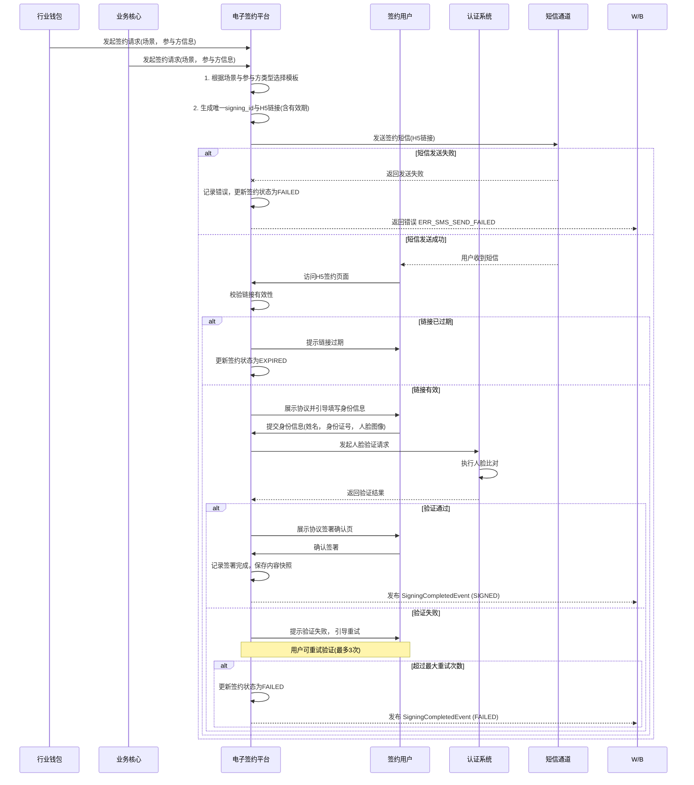

# 模块设计: 电子签约平台

生成时间: 2026-01-22 16:13:42
批判迭代: 2

---

# 电子签约平台 模块设计文档

## 1. 概述
- **目的与范围**: 本模块负责提供协议模板、短信推送、H5页面，并集成打款/人脸验证以完成电子协议签署。核心职责是为关系绑定、开通付款等业务流程提供电子签约能力，确保签约过程的合法性与可追溯性。其边界止于协议生成、签署流程引导、验证集成与签署结果记录，不涉及具体的资金操作或账户管理。

## 2. 接口设计
- **API端点 (REST/GraphQL)**:
    - `POST /api/v1/sign/initiate`: 发起签约流程。
    - `GET /api/v1/sign/status/{signing_id}`: 查询签约状态。
    - `GET /api/v1/sign/contract/{signing_id}`: 获取已签署协议内容。
- **请求/响应结构**:
    - 发起签约 (`POST /api/v1/sign/initiate`)
        - 请求体: `{"business_scene": "string", "parties": [{"user_id": "string", "party_type": "HEADQUARTERS/STORE/INDIVIDUAL"}], "template_id": "string"}`
        - 响应体: `{"signing_id": "string", "h5_link": "string", "expires_at": "timestamp"}`
    - 查询状态 (`GET /api/v1/sign/status/{signing_id}`)
        - 响应体: `{"signing_id": "string", "status": "PENDING/SIGNED/EXPIRED/FAILED", "signed_at": "timestamp", "verification_status": "string"}`
- **发布/消费的事件**:
    - 发布事件: `SigningCompletedEvent` (事件内容: `signing_id`, `business_scene`, `parties`, `status`, `signed_at`)。
    - 消费事件: TBD。

## 3. 数据模型
- **表/集合**:
    - `signing_contracts` (签约记录表)
    - `protocol_templates` (协议模板表)
- **关键字段**:
    - `signing_contracts` 表:
        - `signing_id` (主键): 签约流程唯一标识。
        - `template_id`: 使用的协议模板ID。
        - `template_version`: 协议模板版本号。
        - `parties`: 签约参与方信息 (JSON格式)。
        - `business_scene`: 业务场景 (如 RELATION_BINDING, PAYMENT_ENABLE)。
        - `status`: 状态 (PENDING, SIGNED, EXPIRED, FAILED)。
        - `h5_link`: 签约H5页面链接。
        - `link_expires_at`: 链接过期时间。
        - `verification_request_id`: 关联的认证系统请求ID。
        - `signed_at`: 签署完成时间。
        - `signed_content`: 签署时的协议内容快照 (JSON/文本)。
        - `created_at`: 创建时间。
        - `updated_at`: 更新时间。
    - `protocol_templates` 表:
        - `template_id` (主键): 模板唯一标识。
        - `template_name`: 模板名称。
        - `version`: 当前版本号。
        - `content`: 协议模板内容。
        - `business_scene`: 适用的业务场景。
        - `party_type`: 适用的签约方主体类型 (HEADQUARTERS, STORE, INDIVIDUAL)。
        - `is_active`: 是否启用。
        - `created_at`: 创建时间。
        - `updated_at`: 更新时间。
- **与其他模块的关系**: 本模块在签约流程中需要调用**认证系统**的人脸验证服务。生成的签约记录可能被**行业钱包**、**业务核心**等模块查询，用于判断关系绑定或开通付款的授权状态。

## 4. 业务逻辑
- **核心工作流/算法**:
    1.  **签约流程**：根据业务场景（如关系绑定、开通付款）选择协议模板，生成签约H5页面链接，通过短信推送给签约方。签约方在H5页面完成身份信息填写，并根据要求完成打款验证或人脸验证，最终完成协议签署。
    2.  **验证集成**：在签约流程中，根据参与方类型（如个人、企业）和业务规则，嵌入并调用**认证系统**的打款验证或人脸验证流程，验证通过后方可完成签署。
    3.  **模板管理**：协议模板按业务场景和签约方主体类型进行管理。模板内容变更时，需创建新版本并更新`version`字段，确保已发起的签约流程使用发起时的模板版本，新签约流程使用最新生效版本。
    4.  **签约ID与H5链接生成**：发起签约时，系统生成全局唯一的`signing_id`，并基于此ID生成带有签名的H5页面链接。链接需设置有效期（如24小时），过期后无法访问。
- **业务规则与验证**:
    - 根据业务场景和签约方主体类型（总部、门店、个人）匹配并渲染对应的协议模板。
    - 在签约流程中强制集成身份验证环节，验证不通过则无法完成签署。
    - 记录完整的签约过程，包括协议内容、签署方信息、验证结果和时间戳。
    - 协议模板版本更新时，不影响已生成但未签署的签约流程，这些流程继续使用旧版本模板内容。
- **关键边界情况处理**:
    - 签约链接过期或失效的处理：设置链接有效期，过期后需上游模块重新发起签约。
    - 签约过程中验证失败的处理：引导用户重新进行验证，或根据业务规则终止流程。
    - 协议内容发生变更的处理：在`protocol_templates`表中创建新版本协议，并更新`is_active`状态。确保已签署的旧协议版本不被覆盖。

## 5. 时序图

### 集成人脸验证的签约流程

## 6. 错误处理
- **预期错误情况**:
    - `ERR_TEMPLATE_NOT_FOUND`: 协议模板不存在。
    - `ERR_SMS_SEND_FAILED`: 签约短信发送失败。
    - `ERR_VERIFICATION_FAILED`: 集成的人脸或打款验证失败。
    - `ERR_SIGN_EXPIRED`: 签约链接或会话已过期。
    - `ERR_NETWORK_TIMEOUT`: 与认证系统或短信通道交互超时。
- **处理策略**:
    - 对第三方服务（短信、认证）的调用失败进行有限次重试（如3次）。
    - 向发起签约的上游模块（行业钱包或业务核心）返回明确的错误信息，便于其进行流程控制（如重发签约）。
    - 记录详细的错误日志，包含签约ID、参与方信息等上下文。
    - 对于用户操作超时，提供重新进入或重新发起的入口。

## 7. 依赖关系
- **上游模块**:
    - **行业钱包**: 在关系绑定等场景下发起签约流程。
    - **业务核心**: 在开通付款等场景下发起签约流程。
- **下游模块**:
    - **认证系统**: 依赖其提供人脸验证和打款验证服务。
    - **短信通道**: 依赖其发送签约通知短信（外部服务）。