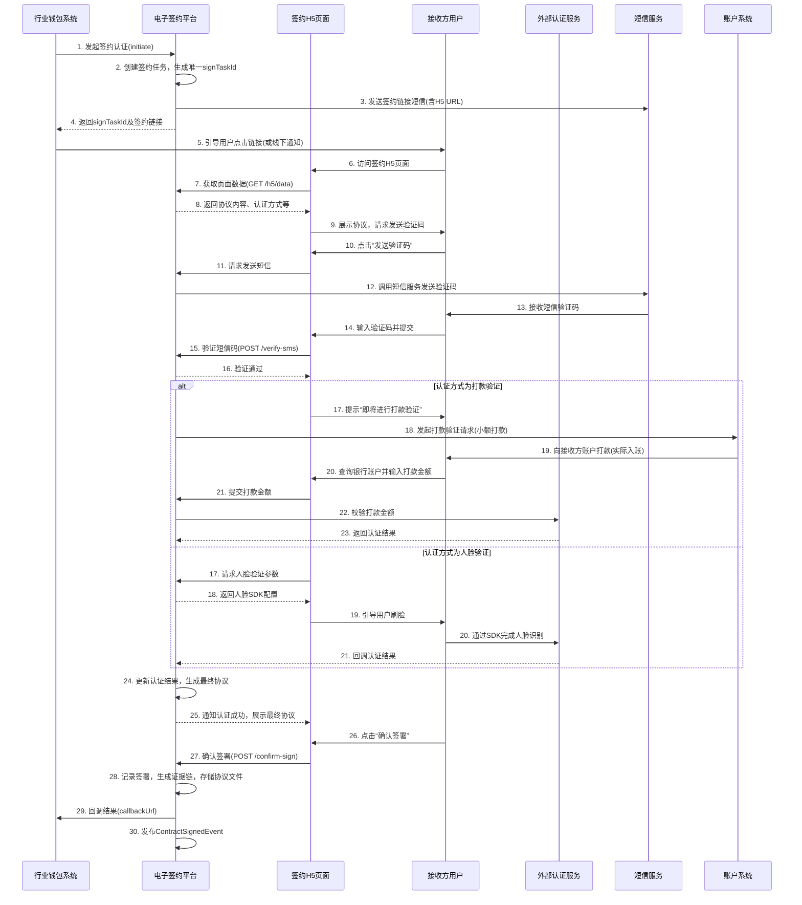

# 模块设计: 电子签约平台

生成时间: 2026-01-19 14:44:18

---

# 电子签约平台模块设计文档

## 1. 概述

### 1.1 目的
电子签约平台模块是“天财分账”业务的核心前置模块，负责为分账关系建立提供合法、合规、可追溯的授权基础。其主要目的是：
1.  **协议签署**：为总部与门店（或其他接收方）之间的分账授权关系提供标准化的电子协议签署流程。
2.  **身份认证**：集成打款验证和人脸验证服务，对协议签署方（尤其是接收方）进行强身份认证，确保资金流转安全。
3.  **证据链留存**：完整记录并存储协议签署、身份认证过程中的所有关键数据、文件和时间戳，形成不可篡改的证据链，满足监管和审计要求。
4.  **流程封装**：将复杂的签约与认证流程封装成简洁的H5页面或API，供上游系统（如行业钱包系统）调用，提升用户体验和集成效率。

### 1.2 范围
本模块负责：
-   电子协议的模板管理、生成、发起签署、状态同步与归档。
-   调用外部认证服务（打款验证/人脸验证）并管理其流程与结果。
-   提供签约流程的H5页面嵌入和API接口。
-   管理短信验证码的发送（用于签署确认或认证环节）。
-   与上游的**行业钱包系统**紧密交互，接收签约任务，反馈签约结果。
-   与底层的**账户系统**交互，获取必要的账户信息以支持打款验证。

**不在本模块范围**：
-   具体的分账交易执行（由行业钱包系统处理）。
-   商户进件与账户开立（由三代系统与账户系统处理）。
-   费率计算与资金结算（由计费中台与清结算系统处理）。

## 2. 接口设计

### 2.1 API端点 (RESTful)

#### 2.1.1 内部接口 (供行业钱包系统调用)

**1. 发起签约认证**
-   **端点**: `POST /api/v1/contract/initiate`
-   **描述**: 行业钱包系统在需要建立分账关系时调用，创建签约任务并返回签约流程入口。
-   **请求头**: `X-Request-ID`, `Authorization (Bearer Token)`
-   **请求体**:
    ```json
    {
      "taskId": "string", // 行业钱包系统生成的唯一任务ID，用于关联
      "merchantNo": "string", // 付方（总部）商户号
      "payerAccountNo": "string", // 付方天财收款账户号
      "receiverType": "ENTERPRISE|INDIVIDUAL|STORE", // 接收方类型：企业、个人、门店
      "receiverName": "string", // 接收方名称
      "receiverCertNo": "string", // 接收方证件号（企业为统一社会信用代码，个人为身份证号）
      "receiverAccountNo": "string", // 接收方天财接收方账户号（可选，打款验证时需要）
      "receiverMobile": "string", // 接收方联系手机号（用于短信和H5链接）
      "scene": "POOLING|BATCH_PAY|MEMBER_SETTLE", // 业务场景：归集、批量付款、会员结算
      "authMode": "TRANSFER|FACE", // 认证方式：打款验证、人脸验证
      "callbackUrl": "string" // 签约最终状态回调地址
    }
    ```
-   **响应体 (成功)**:
    ```json
    {
      "code": "SUCCESS",
      "msg": "成功",
      "data": {
        "signTaskId": "string", // 电子签约平台生成的签约任务ID
        "signUrl": "string", // 签约认证H5页面URL，需发送给接收方
        "expireTime": "2023-10-01T12:00:00Z" // 链接过期时间
      }
    }
    ```

**2. 查询签约任务状态**
-   **端点**: `GET /api/v1/contract/task/{signTaskId}`
-   **描述**: 行业钱包系统轮询或根据回调查询签约任务详细状态。
-   **响应体**:
    ```json
    {
      "code": "SUCCESS",
      "msg": "成功",
      "data": {
        "signTaskId": "string",
        "taskId": "string",
        "status": "INIT|SIGNING|AUTHING|SUCCESS|FAIL|EXPIRED",
        "merchantNo": "string",
        "payerAccountNo": "string",
        "receiverName": "string",
        "receiverAccountNo": "string",
        "scene": "POOLING",
        "authMode": "TRANSFER",
        "contractId": "string", // 已签署的协议ID
        "authResult": "PENDING|SUCCESS|FAIL",
        "failReason": "string", // 失败原因
        "createTime": "2023-10-01T10:00:00Z",
        "updateTime": "2023-10-01T11:30:00Z"
      }
    }
    ```

**3. 开通付款授权（总部侧）**
-   **端点**: `POST /api/v1/contract/open-payment-auth`
-   **描述**: 在批量付款和会员结算场景下，为付方（总部）发起额外的代付协议签署。
-   **请求体**:
    ```json
    {
      "taskId": "string",
      "merchantNo": "string", // 总部商户号
      "payerAccountNo": "string", // 总部天财收款账户号
      "contactName": "string", // 总部联系人
      "contactMobile": "string", // 总部联系人手机
      "callbackUrl": "string"
    }
    ```
-   **响应体**: 类似 `/initiate`，返回总部签约链接。

#### 2.1.2 外部接口 (供H5页面调用)

**1. 获取签约页面数据**
-   **端点**: `GET /h5/v1/contract/data?signTaskId=xxx&token=yyy`
-   **描述**: H5页面加载时调用，获取协议内容、认证方式等信息。
-   **响应体**: 包含协议HTML片段、接收方信息、认证步骤说明等。

**2. 提交短信验证码**
-   **端点**: `POST /h5/v1/contract/verify-sms`
-   **描述**: 用户（接收方）在H5页面输入短信验证码进行确认。
-   **请求体**: `{"signTaskId": "string", "smsCode": "string"}`

**3. 触发/查询认证**
-   **端点**: `POST /h5/v1/auth/transfer/trigger` (打款验证)
-   **端点**: `GET /h5/v1/auth/face/url` (获取人脸验证SDK参数)
-   **描述**: H5页面引导用户进行相应认证。

**4. 确认签署协议**
-   **端点**: `POST /h5/v1/contract/confirm-sign`
-   **描述**: 用户完成认证后，最终确认签署协议。

### 2.2 发布/消费的事件

#### 消费的事件
-   `AccountCreatedEvent` (来自账户系统)：监听天财专用账户的开户成功事件，为后续可能的打款验证准备账户信息。

#### 发布的事件
-   `ContractSignedEvent`：当一份分账协议签署并认证成功时发布。
    ```json
    {
      "eventId": "uuid",
      "type": "CONTRACT_SIGNED",
      "timestamp": "2023-10-01T12:00:00Z",
      "data": {
        "signTaskId": "string",
        "contractId": "string",
        "merchantNo": "string",
        "payerAccountNo": "string",
        "receiverName": "string",
        "receiverAccountNo": "string",
        "receiverCertNo": "string",
        "scene": "POOLING",
        "authMode": "TRANSFER",
        "signedTime": "2023-10-01T11:59:00Z"
      }
    }
    ```
-   `PaymentAuthOpenedEvent`：当总部开通付款授权成功时发布。
-   `ContractSignFailedEvent`：当签约任务失败时发布，包含失败原因。

## 3. 数据模型

### 3.1 核心数据库表设计

```sql
-- 签约任务主表
CREATE TABLE `t_sign_task` (
  `id` bigint(20) NOT NULL AUTO_INCREMENT,
  `sign_task_id` varchar(64) NOT NULL COMMENT '平台生成唯一任务ID',
  `external_task_id` varchar(64) NOT NULL COMMENT '外部系统任务ID',
  `merchant_no` varchar(32) NOT NULL COMMENT '付方商户号',
  `payer_account_no` varchar(32) NOT NULL COMMENT '付方账户号',
  `receiver_type` varchar(20) NOT NULL COMMENT '接收方类型',
  `receiver_name` varchar(128) NOT NULL COMMENT '接收方名称',
  `receiver_cert_no` varchar(64) NOT NULL COMMENT '接收方证件号',
  `receiver_account_no` varchar(32) COMMENT '接收方账户号',
  `receiver_mobile` varchar(20) NOT NULL COMMENT '接收方手机',
  `scene` varchar(32) NOT NULL COMMENT '业务场景',
  `auth_mode` varchar(20) NOT NULL COMMENT '认证方式',
  `status` varchar(20) NOT NULL DEFAULT 'INIT' COMMENT '任务状态',
  `contract_id` varchar(64) COMMENT '签署后的协议ID',
  `contract_file_url` varchar(512) COMMENT '协议文件存储地址',
  `auth_result` varchar(20) DEFAULT 'PENDING' COMMENT '认证结果',
  `callback_url` varchar(512) NOT NULL COMMENT '回调地址',
  `expire_time` datetime NOT NULL COMMENT '任务过期时间',
  `fail_reason` varchar(512) COMMENT '失败原因',
  `created_at` datetime NOT NULL DEFAULT CURRENT_TIMESTAMP,
  `updated_at` datetime NOT NULL DEFAULT CURRENT_TIMESTAMP ON UPDATE CURRENT_TIMESTAMP,
  PRIMARY KEY (`id`),
  UNIQUE KEY `uk_sign_task_id` (`sign_task_id`),
  KEY `idx_external_task` (`external_task_id`),
  KEY `idx_merchant` (`merchant_no`),
  KEY `idx_receiver` (`receiver_cert_no`, `receiver_account_no`),
  KEY `idx_status_expire` (`status`, `expire_time`)
) ENGINE=InnoDB COMMENT='签约任务表';

-- 协议签署记录表
CREATE TABLE `t_contract_record` (
  `id` bigint(20) NOT NULL AUTO_INCREMENT,
  `contract_id` varchar(64) NOT NULL COMMENT '协议唯一ID',
  `sign_task_id` varchar(64) NOT NULL COMMENT '关联签约任务',
  `template_id` varchar(32) NOT NULL COMMENT '协议模板ID',
  `template_version` varchar(16) NOT NULL COMMENT '模板版本',
  `content_hash` varchar(128) NOT NULL COMMENT '协议内容哈希值',
  `signer_name` varchar(128) NOT NULL COMMENT '签署方名称',
  `signer_cert_no` varchar(64) NOT NULL COMMENT '签署方证件号',
  `signer_role` varchar(20) NOT NULL COMMENT '签署方角色(PAYER/RECEIVER)',
  `sign_ip` varchar(45) COMMENT '签署IP',
  `sign_user_agent` varchar(512) COMMENT '签署终端UA',
  `sign_time` datetime NOT NULL COMMENT '签署时间',
  `created_at` datetime NOT NULL DEFAULT CURRENT_TIMESTAMP,
  PRIMARY KEY (`id`),
  UNIQUE KEY `uk_contract_id` (`contract_id`),
  KEY `idx_sign_task` (`sign_task_id`),
  KEY `idx_signer` (`signer_cert_no`)
) ENGINE=InnoDB COMMENT='协议签署记录表';

-- 身份认证记录表
CREATE TABLE `t_auth_record` (
  `id` bigint(20) NOT NULL AUTO_INCREMENT,
  `auth_id` varchar(64) NOT NULL COMMENT '认证记录ID',
  `sign_task_id` varchar(64) NOT NULL COMMENT '关联签约任务',
  `auth_mode` varchar(20) NOT NULL COMMENT '认证方式',
  `auth_target` varchar(64) NOT NULL COMMENT '认证对象证件号',
  `auth_status` varchar(20) NOT NULL DEFAULT 'PROCESSING' COMMENT '认证状态',
  `request_param` json COMMENT '请求参数',
  `response_data` json COMMENT '响应数据',
  `auth_time` datetime COMMENT '认证完成时间',
  `created_at` datetime NOT NULL DEFAULT CURRENT_TIMESTAMP,
  `updated_at` datetime NOT NULL DEFAULT CURRENT_TIMESTAMP ON UPDATE CURRENT_TIMESTAMP,
  PRIMARY KEY (`id`),
  UNIQUE KEY `uk_auth_id` (`auth_id`),
  KEY `idx_sign_task` (`sign_task_id`),
  KEY `idx_target` (`auth_target`)
) ENGINE=InnoDB COMMENT='身份认证记录表';

-- 短信验证记录表
CREATE TABLE `t_sms_record` (
  `id` bigint(20) NOT NULL AUTO_INCREMENT,
  `sign_task_id` varchar(64) NOT NULL,
  `mobile` varchar(20) NOT NULL,
  `sms_code` varchar(12) NOT NULL,
  `sms_type` varchar(32) NOT NULL COMMENT 'SIGN_CONFIRM/AUTH_VERIFY',
  `biz_id` varchar(64) COMMENT '外部短信服务ID',
  `status` varchar(20) NOT NULL DEFAULT 'SENT' COMMENT 'SENT/USED/EXPIRED',
  `expire_time` datetime NOT NULL,
  `created_at` datetime NOT NULL DEFAULT CURRENT_TIMESTAMP,
  PRIMARY KEY (`id`),
  KEY `idx_task_mobile` (`sign_task_id`, `mobile`, `status`),
  KEY `idx_expire` (`expire_time`)
) ENGINE=InnoDB COMMENT='短信验证记录表';
```

### 3.2 与其他模块的关系
-   **行业钱包系统**：上游调用方。电子签约平台接收其发起的签约任务，完成后通过回调或事件通知其结果。
-   **账户系统**：下游依赖。进行打款验证时，需要查询或验证接收方账户信息，并监听账户创建事件。
-   **外部认证服务**：下游依赖。调用第三方打款验证或人脸验证服务。
-   **短信服务平台**：下游依赖。调用内部或第三方短信服务发送验证码。
-   **文件存储服务**：下游依赖。用于存储已签署的电子协议PDF文件。

## 4. 业务逻辑

### 4.1 核心流程算法

**签约认证总流程：**
1.  **任务接收与初始化**：验证入参，创建签约任务，根据`receiverType`和`scene`选择协议模板。
2.  **H5页面生成**：生成带有时效性和防篡改Token的签约链接。
3.  **接收方操作流**：
    a. **协议查看与短信验证**：接收方查看协议，通过短信验证码确认身份。
    b. **身份认证**：
        - 打款验证：调用账户系统，向`receiverAccountNo`打款（小额随机），引导用户回填金额。
        - 人脸验证：调用人脸识别SDK，引导用户刷脸。
    c. **协议签署**：认证成功后，用户进行最终签署确认，系统生成带时间戳的电子签名。
4.  **证据链固化**：将协议原文、签署记录、认证结果、操作日志打包，计算哈希值，并可能上链或存证。
5.  **结果通知**：更新任务状态，回调行业钱包系统，发布`ContractSignedEvent`。

### 4.2 业务规则
1.  **签约关系唯一性**：同一付方账户与同一接收方账户，在同一业务场景下，只允许存在一份`SUCCESS`状态的协议。
2.  **认证方式规则**：
    - `receiverType`为`ENTERPRISE`（企业），强制使用**打款验证**。
    - `receiverType`为`INDIVIDUAL`（个人/个体户），强制使用**人脸验证**。
    - `receiverType`为`STORE`（门店），可由业务方指定，默认推荐打款验证。
3.  **协议模板管理**：不同`scene`和`receiverType`组合对应不同的协议模板。模板的任何变更需生成新版本，旧任务仍使用旧版本。
4.  **链接安全**：H5链接需包含一次性Token和有效期（如30分钟），防止重放攻击。
5.  **短信防刷**：同一手机号在短时间内（如1分钟）只能请求一次短信，每日有上限。

### 4.3 验证逻辑
-   **入参校验**：必填字段、商户号与账户号是否存在且匹配、接收方证件号格式等。
-   **业务状态校验**：发起签约时，付方账户状态必须正常；接收方账户（如果已存在）状态必须正常。
-   **认证结果校验**：严格依赖外部认证服务的返回结果，只有明确成功时才可推进流程。
-   **防重复签署**：签署前校验是否已存在生效的同类协议。

## 5. 时序图

### 5.1 核心流程：发起并完成签约认证



## 6. 错误处理

| 错误类型 | 错误码 | 处理策略 |
| :--- | :--- | :--- |
| **参数校验失败** | `4000` | 请求参数格式错误或缺失，返回具体错误字段，调用方需修正后重试。 |
| **业务校验失败** | `4001` | 如商户不存在、账户状态异常、重复签约等。记录日志，返回明确业务错误信息。 |
| **认证服务异常** | `5001` | 调用打款/人脸验证服务超时或失败。记录详细日志，任务状态置为`AUTHING_FAIL`，支持异步重试机制。 |
| **短信发送失败** | `5002` | 短信服务不可用。可重试数次，若最终失败，任务状态置为`FAIL`。 |
| **回调通知失败** | `5003` | 通知行业钱包系统回调失败。启用重试队列，按指数退避策略重试，并监控告警。 |
| **系统内部错误** | `5000` | 数据库异常、未知异常等。记录完整错误堆栈，告警，任务状态置为`FAIL`。 |

**通用策略**：
-   **幂等性**：所有接口通过`taskId`或`signTaskId`保证幂等。
-   **异步与重试**：对于外部依赖调用（认证、回调）采用异步化处理，并配备可靠的重试机制。
-   **状态机**：签约任务有明确的状态机，防止状态混乱。任何失败都应有明确的状态和原因记录。
-   **监控与告警**：对错误率、延迟、任务积压进行监控，关键错误实时告警。

## 7. 依赖说明

### 7.1 上游模块交互
-   **行业钱包系统**是**主要上游调用方**。
    -   **交互方式**：同步API调用 (`/initiate`) + 异步回调 (`callbackUrl`) + 事件监听（可选）。
    -   **职责**：钱包系统负责业务逻辑判断（何时需要签约），并携带正确的业务参数发起调用。电子签约平台负责执行具体的签约与认证流程，并将最终结果返回。

### 7.2 下游模块/服务交互
1.  **账户系统**：
    -   **用途**：打款验证时，需要验证`receiverAccountNo`的有效性，并触发小额打款。
    -   **交互方式**：同步RPC调用。
2.  **外部认证服务**：
    -   **用途**：执行打款金额校验或人脸识别。
    -   **交互方式**：HTTP API调用 + 异步回调（针对人脸验证）。
3.  **短信服务平台**：
    -   **用途**：发送签约链接和验证码短信。
    -   **交互方式**：异步消息队列或HTTP API。
4.  **文件存储服务 (如OSS)**：
    -   **用途**：永久存储已签署的电子协议PDF文件。
    -   **交互方式**：SDK上传。

### 7.3 关键依赖管理
-   **降级策略**：对于非核心依赖（如短信服务的非关键通知），可考虑降级（如记录日志后跳过）。但对于**认证服务**，无法降级，失败即导致整个签约流程失败。
-   **超时与熔断**：所有外部调用必须设置合理的超时时间，并配置熔断器（如Hystrix或Resilience4j），防止因下游故障导致系统资源耗尽。
-   **数据一致性**：采用“最终一致性”。签约任务状态为主，通过重试确保回调成功。证据链数据在平台内部确保强一致性。