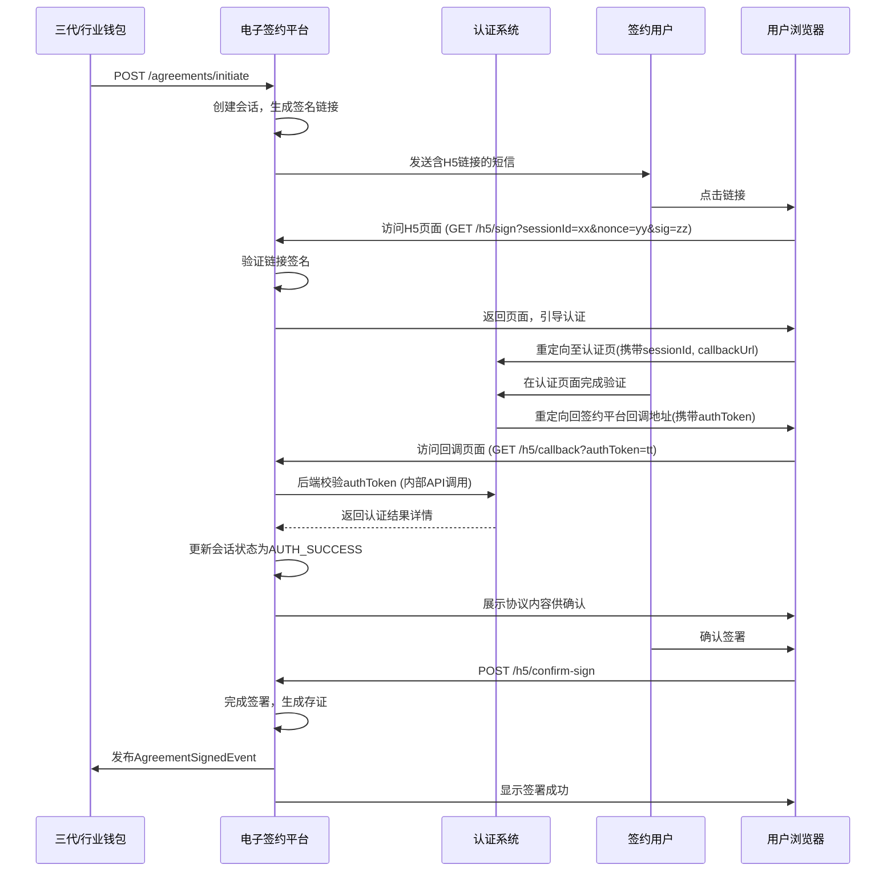

# 模块设计: 电子签约平台

生成时间: 2026-01-22 17:47:45
批判迭代: 2

---

# 电子签约平台 模块设计文档

## 1. 概述
- **目的与范围**: 本模块负责协议模板管理、短信H5封装、调用认证系统、完成电子协议签署并留存证据链。其核心职责是为“关系绑定”、“开通付款”等业务流程提供电子签约能力，确保协议签署的合法性、真实性与可追溯性。
- **系统角色澄清**: 根据术语表，本模块是“系统角色/参与者”之一。其上游依赖是提供身份核验能力的“认证系统”（同为系统角色）。其下游调用方是“三代”和“行业钱包”这两个系统角色，它们在执行业务流程（如“关系绑定”、“开通付款”）时需要调用本模块的服务。

## 2. 接口设计
- **API端点 (REST)**:
    - `POST /v1/agreements/initiate`: 发起签约流程。接收业务参数，生成签约会话。
    - `GET /v1/agreements/sessions/{sessionId}`: 查询签约会话状态及详情。
    - `POST /v1/agreements/sessions/{sessionId}/resend-sms`: 重新发送签约短信。
    - `POST /v1/agreements/callback/authentication`: 认证系统完成验证后的回调接口。
    - `GET /v1/agreements/{agreementId}`: 查询已签署的协议及证据链信息。
- **请求/响应结构**:
    - 发起签约请求 (`POST /v1/agreements/initiate`):
        - 请求体: `{“bizScene”: “RELATION_BINDING” | “PAYMENT_ENABLEMENT”, “bizId”: “string”, “templateId”: “string”, “parties”: [{“name”: “string”, “idCard”: “string”, “mobile”: “string”, “bankCardNo”: “string”}]}`
        - 响应体: `{“sessionId”: “string”, “expireAt”: “timestamp”}`
    - 认证回调请求 (`POST /v1/agreements/callback/authentication`):
        - 请求体: `{“sessionId”: “string”, “authToken”: “string”, “authResult”: “SUCCESS” | “FAILED”, “authMethod”: “PAYMENT” | “FACE”, “authTime”: “timestamp”, “metadata”: “object”}`
- **发布/消费的事件**:
    - 发布事件: `AgreementSignedEvent` (协议签署完成事件)，包含协议ID、签署方、签署时间、业务场景和业务ID。
    - 消费事件: TBD。

## 3. 数据模型
- **表/集合**:
    - `agreement_template`: 协议模板表。
        - 关键字段: `id`, `name`, `biz_scene`, `content`, `version`, `is_active`, `created_at`。
    - `signing_session`: 签约会话表，记录一次签约流程的完整状态。
        - 关键字段: `session_id`, `biz_scene`, `biz_id`, `template_id`, `parties_info` (JSON), `status` (`INIT`, `SMS_SENT`, `AUTH_SUCCESS`, `SIGNED`, `EXPIRED`, `CANCELLED`), `sms_h5_url`, `auth_token`, `expire_at`, `created_at`。
    - `signed_agreement`: 已签署协议表。
        - 关键字段: `agreement_id`, `session_id`, `final_content`, `signed_at`, `parties_signature` (JSON)，存储各方签署确认信息。
    - `evidence_record`: 证据链记录表，与 `signed_agreement` 一对一关联。
        - 关键字段: `agreement_id`, `auth_evidence` (JSON，包含认证方式、结果、时间、流水号等), `signing_evidence` (JSON，包含用户IP、User-Agent、时间戳、操作序列), `raw_protocol_data` (JSON，原始协议数据), `created_at`。
- **与其他模块的关系**: 本模块通过API调用“认证系统”。`signing_session.biz_id` 可能与“三代”或“行业钱包”模块的业务记录关联。

## 4. 业务逻辑
- **核心工作流/算法**:
    1.  **发起签约**: 接收调用方请求，根据`bizScene`和`templateId`获取协议模板，填充变量生成最终协议内容。创建`signing_session`记录，状态为`INIT`。
    2.  **生成并发送签约链接**: 为会话生成唯一、有时效性的H5链接。链接需包含防篡改签名（如HMAC）和防重放攻击的随机数（nonce）。通过短信发送给签约方。会话状态转为`SMS_SENT`。
    3.  **身份核验**: 用户点击链接访问H5页面。页面引导用户选择/进行认证。本模块将用户重定向至“认证系统”的认证页面，并携带`sessionId`和回调地址。用户在该系统完成打款验证或人脸验证。
    4.  **认证回调与确认签署**: “认证系统”验证完成后，重定向用户回本模块H5页面，并携带认证结果令牌(`authToken`)。本模块通过后端回调接口验证该令牌的有效性。验证成功后，会话状态转为`AUTH_SUCCESS`，并向用户展示协议内容供确认签署。
    5.  **完成签署与存证**: 用户确认签署后，更新会话状态为`SIGNED`。生成唯一的`agreement_id`，将最终协议内容存入`signed_agreement`。同时，将整个流程中产生的数据（协议文本、认证证据、用户操作日志、环境信息）结构化后存入`evidence_record`，形成证据链。
    6.  **通知调用方**: 签署完成后，发布`AgreementSignedEvent`事件，通知下游系统角色（如“三代”、“行业钱包”）。
- **业务规则与验证**:
    - 签约方必须通过“认证系统”完成指定方式的身份核验。
    - 签约链接具有时效性（如30分钟），过期后会话状态转为`EXPIRED`。
    - 同一`bizId`和签约方，在已有`INIT`或`SMS_SENT`状态的会话时，新的发起请求应返回现有会话ID，防止重复签约流程。
- **关键边界情况处理**:
    - **并发控制**: 对`signing_session`表的创建和状态更新操作使用乐观锁或分布式锁，防止同一会话被重复处理。
    - **认证失败**: 认证失败后，H5页面提供重新发起认证的入口，后端会话状态保持`SMS_SENT`。
    - **中途放弃**: 会话状态机支持超时(`EXPIRED`)和手动取消(`CANCELLED`)状态。
    - **安全措施**: H5链接使用HTTPS；链接参数签名防止篡改；`authToken`为一次性使用，验证后立即失效；敏感信息（如身份证号、银行卡号）在传输和存储时进行加密。
    - **证据链规范**: 证据链数据包含时间戳、操作动作、操作结果、系统环境（IP、UA）、业务数据快照，满足法律取证要求。存储策略为长期持久化，保留期限遵循相关法规（TBD）。

## 5. 时序图

## 6. 错误处理
- **预期错误情况**:
    - 认证系统调用失败或超时。
    - 用户认证不通过。
    - 协议模板不存在或版本失效。
    - 短信服务发送失败。
    - 签约链接被篡改或重复使用。
    - 会话已过期或已被签署。
    - 数据存储异常。
- **处理策略**:
    - 对“认证系统”等外部依赖调用配置重试机制和熔断器。
    - 链接签名验证失败则直接拒绝访问，返回错误页面。
    - 会话状态不合法时，向用户展示明确的错误提示（如“链接已失效”）。
    - 所有错误记录详细日志，包含`sessionId`、`bizId`和错误上下文。
    - 向调用方返回明确的业务错误码和提示信息。

## 7. 依赖关系
- **上游依赖**:
    - **认证系统** (系统角色): 提供打款验证和人脸验证的身份核验能力，并通过回调通知结果。依赖其认证页面重定向及Token验证API。
- **下游服务对象**:
    - **三代** (系统角色): 在“关系绑定”等流程中调用本模块发起签约。
    - **行业钱包** (系统角色): 在“开通付款”等流程中调用本模块发起签约。
- **基础设施依赖**:
    - 短信发送服务。
    - 数据库。
    - 消息队列（用于发布事件）。