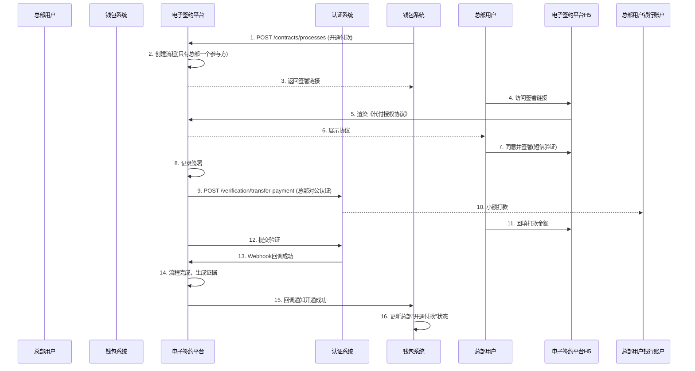

# 模块设计: 电子签约平台

生成时间: 2026-01-19 15:31:57

---

# 电子签约平台模块设计文档

## 1. 概述

### 1.1 目的
电子签约平台作为“天财分账”业务中关系绑定的核心法律流程执行模块，旨在为总部、门店、供应商、股东等角色提供安全、合规、便捷的电子协议签署与身份认证集成服务。其主要目的是：
1. **法律合规**：通过电子签约完成《分账授权协议》、《代付授权协议》等法律文件的签署，建立合法有效的资金划转授权关系。
2. **流程引导**：为不同签约场景提供标准化的H5页面，引导用户完成协议查看、确认、签署及身份认证流程。
3. **证据链留存**：完整记录签约过程（时间戳、IP、用户操作、协议版本等），生成不可篡改的签约证据包，满足司法存证要求。
4. **认证集成**：无缝集成认证系统的打款验证和人脸验证能力，作为用户身份核验的统一入口。

### 1.2 范围
本模块专注于电子签约流程的管理与执行，不处理具体的账户绑定或分账业务逻辑。核心职责包括：
- **协议模板管理**：维护不同场景（归集、批量付款、会员结算）的协议模板及版本。
- **签约流程编排**：根据业务场景，动态生成签约流程（协议签署→身份认证→结果回调）。
- **H5页面服务**：提供响应式H5页面，用于协议展示、签署确认及认证跳转。
- **签约记录管理**：存储完整的签约过程数据与证据链。
- **与认证系统集成**：调用认证系统API发起验证，并接收其验证结果回调。
- **签约状态同步**：通过事件通知行业钱包系统签约结果，驱动后续业务流转。

### 1.3 设计原则
- **合规先行**：所有流程设计符合《电子签名法》及相关金融监管要求。
- **用户体验**：流程简洁明了，移动端友好，减少用户操作步骤。
- **安全可靠**：协议内容防篡改，签署过程可追溯，数据传输加密。
- **高可用**：作为关键业务入口，需保证高可用性与快速响应。
- **解耦设计**：与具体业务逻辑解耦，通过标准API和事件提供服务。

## 2. 接口设计

### 2.1 API端点 (RESTful)

#### 2.1.1 创建签约流程
- **端点**: `POST /api/v1/contracts/processes`
- **描述**: 由行业钱包系统调用，根据业务场景创建一条签约流程实例。
- **认证**: 需要调用方API密钥认证。
- **请求头**:
    - `X-Client-Id`: 调用方标识（如 `wallet_system`）
    - `X-Signature`: 请求签名
- **请求体**:
```json
{
  "requestId": "wallet_req_20231028001", // 调用方唯一请求ID，用于幂等
  "bizScene": "TIANCAI_COLLECTION", // 业务场景: TIANCAI_COLLECTION(归集), TIANCAI_BATCH_PAY(批量付款), TIANCAI_MEMBER_SETTLE(会员结算)
  "bizReferenceNo": "bind_20231028001", // 关联的业务唯一号（如关系绑定流水号）
  "contractType": "COLLECTION_AUTHORIZATION", // 协议类型: COLLECTION_AUTHORIZATION(分账授权协议), PAYMENT_AUTHORIZATION(代付授权协议)
  "parties": [
    {
      "partyRole": "PAYER", // 参与方角色: PAYER(付方), PAYEE(收方), 对应业务中的总部、门店等
      "partyType": "CORPORATE", // 参与方类型: CORPORATE(企业), PERSONAL(个人)
      "partyName": "北京天财科技有限公司", // 参与方名称
      "certificateType": "UNIFIED_SOCIAL_CREDIT_CODE", // 证件类型: UNIFIED_SOCIAL_CREDIT_CODE(统一社会信用代码), ID_CARD(身份证)
      "certificateNo": "91110108MA01XXXXXX", // 证件号码
      "contactPhone": "13800138000", // 联系人手机号（用于短信验证）
      "accountInfo": { // 账户信息（可选，用于预填或展示）
        "accountNo": "1101234567890123456",
        "accountName": "北京天财科技有限公司",
        "bankCode": "ICBC"
      }
    },
    {
      "partyRole": "PAYEE",
      "partyType": "CORPORATE",
      "partyName": "上海浦东门店有限公司",
      "certificateType": "UNIFIED_SOCIAL_CREDIT_CODE",
      "certificateNo": "91310115MA1XXXXXXX",
      "contactPhone": "13900139000",
      "accountInfo": {
        "accountNo": "3109876543210987654",
        "accountName": "上海浦东门店有限公司",
        "bankCode": "CCB"
      }
    }
  ],
  "contractVariables": { // 协议变量，用于填充模板
    "effectiveDate": "2023-11-01",
    "expiryDate": "2024-10-31",
    "dailyLimit": "100000.00",
    "singleLimit": "50000.00"
  },
  "callbackUrl": "https://wallet.example.com/callback/contract", // 签约结果异步回调地址
  "redirectUrl": "https://merchant.example.com/result?bizNo={bizReferenceNo}" // 签约完成后跳转回商户页面的地址
}
```
- **成功响应** (201 Created):
```json
{
  "code": "SUCCESS",
  "message": "签约流程创建成功",
  "data": {
    "processId": "proc_9k2jhs83la5", // 本系统生成的签约流程ID
    "status": "INITIATED",
    "nextActions": [ // 下一步操作指引（按参与方分组）
      {
        "partyRole": "PAYER",
        "partyName": "北京天财科技有限公司",
        "actionType": "SIGN_CONTRACT", // 操作类型: SIGN_CONTRACT(签署协议), VERIFY_IDENTITY(身份认证)
        "actionUrl": "https://h5.e-sign.com/contract?token=eyJhbGciOi...&party=PAYER", // H5页面地址（带临时令牌）
        "expiresAt": "2023-10-28T14:30:00+08:00" // 链接有效期
      },
      {
        "partyRole": "PAYEE",
        "partyName": "上海浦东门店有限公司",
        "actionType": "SIGN_CONTRACT",
        "actionUrl": "https://h5.e-sign.com/contract?token=eyJhbGciOi...&party=PAYEE",
        "expiresAt": "2023-10-28T14:30:00+08:00"
      }
    ]
  }
}
```

#### 2.1.2 查询签约流程状态
- **端点**: `GET /api/v1/contracts/processes/{processId}`
- **描述**: 查询签约流程的详细状态、各参与方进度及最终结果。
- **成功响应**:
```json
{
  "code": "SUCCESS",
  "data": {
    "processId": "proc_9k2jhs83la5",
    "requestId": "wallet_req_20231028001",
    "bizScene": "TIANCAI_COLLECTION",
    "bizReferenceNo": "bind_20231028001",
    "contractType": "COLLECTION_AUTHORIZATION",
    "status": "IN_PROGRESS", // 整体状态: INITIATED, IN_PROGRESS, COMPLETED, CANCELLED, EXPIRED
    "parties": [
      {
        "partyRole": "PAYER",
        "partyName": "北京天财科技有限公司",
        "signStatus": "SIGNED", // 签署状态: PENDING, SIGNED, REJECTED
        "verifyStatus": "PENDING", // 认证状态: PENDING, VERIFIED, FAILED
        "signedAt": "2023-10-28T10:15:30+08:00",
        "signedIp": "192.168.1.100",
        "userAgent": "Mozilla/5.0..."
      },
      {
        "partyRole": "PAYEE",
        "partyName": "上海浦东门店有限公司",
        "signStatus": "PENDING",
        "verifyStatus": "PENDING",
        "signedAt": null
      }
    ],
    "contractDocument": {
      "documentId": "doc_7s82kja93n2",
      "downloadUrl": "https://h5.e-sign.com/download/doc_7s82kja93n2", // 已签署协议PDF下载地址（仅当所有方签署完成后生成）
      "hash": "a1b2c3d4e5f6..." // 协议文件哈希值，用于防篡改校验
    },
    "evidencePackage": { // 证据包（仅当流程完成）
      "packageId": "evi_8k3jls92ma1",
      "downloadUrl": "https://h5.e-sign.com/download/evi_8k3jls92ma1"
    },
    "expiresAt": "2023-10-29T10:00:00+08:00",
    "createdAt": "2023-10-28T10:00:00+08:00",
    "updatedAt": "2023-10-28T10:15:30+08:00"
  }
}
```

#### 2.1.3 接收认证系统回调
- **端点**: `POST /api/v1/webhook/verification` （由认证系统调用）
- **描述**: 接收人脸验证或打款验证的结果回调，更新对应签约流程的认证状态。
- **认证**: 通过请求签名验证（`X-Signature`）确保回调来源可信。
- **请求体**:
```json
{
  "eventType": "VERIFICATION_COMPLETED", // 事件类型
  "timestamp": "2023-10-28T10:20:15+08:00",
  "signature": "签名串",
  "data": {
    "verificationId": "ver_8k3jhs82na1",
    "bizScene": "TIANCAI_BINDING",
    "bizReferenceNo": "bind_20231028001", // 与签约流程的bizReferenceNo关联
    "method": "FACE", // 或 TRANSFER_PAYMENT
    "status": "SUCCESS", // 或 FAILED
    "partyInfo": { // 标识是哪个参与方
      "partyRole": "PAYER",
      "certificateNo": "91110108MA01XXXXXX"
    },
    "evidence": { ... }, // 验证证据
    "failureReason": null
  }
}
```
- **成功响应**:
```json
{
  "code": "SUCCESS",
  "message": "回调处理成功"
}
```

#### 2.1.4 生成协议预览
- **端点**: `GET /api/v1/contracts/templates/preview`
- **描述**: 根据协议类型和变量，生成协议预览内容（HTML/PDF），用于前端展示。
- **查询参数**:
    - `contractType`: 协议类型
    - `variables`: URL编码的JSON字符串，包含协议变量
- **成功响应**:
```json
{
  "code": "SUCCESS",
  "data": {
    "htmlContent": "<html>...协议预览HTML...</html>",
    "variablesUsed": {
      "effectiveDate": "2023-11-01",
      "expiryDate": "2024-10-31"
    }
  }
}
```

### 2.2 发布/消费的事件

#### 2.2.1 发布的事件
电子签约平台在关键节点向消息中间件发布事件，供行业钱包系统等订阅。

1. **ContractProcessInitiatedEvent** (签约流程已创建)
    - **Topic**: `esign.events.process.initiated`
    - **触发时机**: 成功创建签约流程后。
    - **Payload**:
    ```json
    {
      "eventId": "evt_esign_001",
      "eventType": "CONTRACT_PROCESS_INITIATED",
      "timestamp": "2023-10-28T10:00:00+08:00",
      "data": {
        "processId": "proc_9k2jhs83la5",
        "bizScene": "TIANCAI_COLLECTION",
        "bizReferenceNo": "bind_20231028001",
        "contractType": "COLLECTION_AUTHORIZATION",
        "status": "INITIATED",
        "parties": [ ... ],
        "expiresAt": "2023-10-29T10:00:00+08:00"
      }
    }
    ```

2. **ContractPartySignedEvent** (参与方已签署)
    - **Topic**: `esign.events.party.signed`
    - **触发时机**: 任一参与方完成协议签署操作。
    - **Payload**:
    ```json
    {
      "eventId": "evt_esign_002",
      "eventType": "CONTRACT_PARTY_SIGNED",
      "timestamp": "2023-10-28T10:15:30+08:00",
      "data": {
        "processId": "proc_9k2jhs83la5",
        "bizReferenceNo": "bind_20231028001",
        "partyRole": "PAYER",
        "partyName": "北京天财科技有限公司",
        "signedAt": "2023-10-28T10:15:30+08:00",
        "signMethod": "SMS_VERIFICATION", // 签署方式: SMS_VERIFICATION, PASSWORD, etc.
        "remainingParties": ["PAYEE"] // 剩余待签署方
      }
    }
    ```

3. **ContractProcessCompletedEvent** (签约流程已完成)
    - **Topic**: `esign.events.process.completed`
    - **触发时机**: 所有参与方均完成签署和认证，流程最终完成。
    - **Payload**:
    ```json
    {
      "eventId": "evt_esign_003",
      "eventType": "CONTRACT_PROCESS_COMPLETED",
      "timestamp": "2023-10-28T10:25:00+08:00",
      "data": {
        "processId": "proc_9k2jhs83la5",
        "bizScene": "TIANCAI_COLLECTION",
        "bizReferenceNo": "bind_20231028001",
        "contractType": "COLLECTION_AUTHORIZATION",
        "status": "COMPLETED",
        "completionTime": "2023-10-28T10:25:00+08:00",
        "contractDocument": {
          "documentId": "doc_7s82kja93n2",
          "hash": "a1b2c3d4e5f6..."
        },
        "evidencePackageId": "evi_8k3jls92ma1"
      }
    }
    ```

4. **ContractProcessFailedEvent** (签约流程已失败)
    - **Topic**: `esign.events.process.failed`
    - **触发时机**: 流程因超时、用户拒绝、认证失败等原因最终失败。
    - **Payload**:
    ```json
    {
      "eventId": "evt_esign_004",
      "eventType": "CONTRACT_PROCESS_FAILED",
      "timestamp": "2023-10-28T10:30:00+08:00",
      "data": {
        "processId": "proc_9k2jhs83la5",
        "bizReferenceNo": "bind_20231028001",
        "status": "CANCELLED", // 或 EXPIRED
        "failureReason": "VERIFICATION_FAILED", // 失败原因码
        "failureDetail": "PAYER身份认证失败",
        "failedAt": "2023-10-28T10:30:00+08:00"
      }
    }
    ```

#### 2.2.2 消费的事件
电子签约平台消费来自认证系统的事件，以更新认证状态。

1. **VerificationCompletedEvent** (来自认证系统)
    - **Topic**: `verification.events.completed`
    - **处理逻辑**: 根据`bizReferenceNo`和`partyInfo`找到对应签约流程和参与方，更新其认证状态。如果所有参与方均完成认证且已签署，则触发流程完成。

## 3. 数据模型

### 3.1 核心表设计

#### 表: `contract_process` (签约流程表)
存储签约流程的主信息。
| 字段名 | 类型 | 必填 | 默认值 | 说明 |
| :--- | :--- | :--- | :--- | :--- |
| `id` | bigint(20) | 是 | AUTO_INCREMENT | 自增主键 |
| `process_id` | varchar(32) | 是 | | **业务唯一流程ID**，全局唯一索引 `uk_process_id` |
| `request_id` | varchar(64) | 是 | | **调用方请求ID**，与`client_id`联合唯一索引 `uk_request_client` |
| `client_id` | varchar(32) | 是 | | **调用方标识** (如 `wallet_system`) |
| `biz_scene` | varchar(32) | 是 | | **业务场景** |
| `biz_reference_no` | varchar(64) | 是 | | **关联业务流水号**，索引 `idx_biz_ref` |
| `contract_type` | varchar(50) | 是 | | **协议类型** |
| `contract_template_id` | varchar(32) | 是 | | **使用的协议模板ID**，关联`contract_template`表 |
| `contract_variables_json` | json | 是 | | **协议变量**，JSON格式 |
| `status` | varchar(20) | 是 | `INITIATED` | **整体状态**: `INITIATED`, `IN_PROGRESS`, `COMPLETED`, `CANCELLED`, `EXPIRED` |
| `callback_url` | varchar(512) | 是 | | **异步回调地址** |
| `redirect_url` | varchar(512) | 否 | NULL | **完成跳转地址** |
| `contract_document_id` | varchar(32) | 否 | NULL | **最终协议文件ID**，关联`contract_document`表 |
| `evidence_package_id` | varchar(32) | 否 | NULL | **证据包ID** |
| `expires_at` | datetime | 是 | | **流程过期时间**（如创建后24小时） |
| `completed_at` | datetime | 否 | NULL | **完成时间** |
| `failure_reason` | varchar(50) | 否 | NULL | **失败原因码** |
| `failure_detail` | varchar(255) | 否 | NULL | **失败详情** |
| `created_at` | datetime | 是 | CURRENT_TIMESTAMP | |
| `updated_at` | datetime | 是 | CURRENT_TIMESTAMP ON UPDATE | |

#### 表: `contract_party` (签约参与方表)
存储流程中各参与方的信息与进度。
| 字段名 | 类型 | 必填 | 默认值 | 说明 |
| :--- | :--- | :--- | :--- | :--- |
| `id` | bigint(20) | 是 | AUTO_INCREMENT | 主键 |
| `process_id` | varchar(32) | 是 | | **关联流程ID**，外键 `fk_process_id`，联合索引 `idx_process_party` |
| `party_role` | varchar(20) | 是 | | **参与方角色** (`PAYER`, `PAYEE`) |
| `party_type` | varchar(20) | 是 | | **参与方类型** (`CORPORATE`, `PERSONAL`) |
| `party_name` | varchar(100) | 是 | | **参与方名称** |
| `certificate_type` | varchar(30) | 是 | | **证件类型** |
| `certificate_no` | varchar(50) | 是 | | **证件号码**，索引 `idx_cert_no` |
| `contact_phone` | varchar(20) | 是 | | **联系人手机号** |
| `account_info_json` | json | 否 | NULL | **账户信息**，JSON格式 |
| `sign_status` | varchar(20) | 是 | `PENDING` | **签署状态**: `PENDING`, `SIGNED`, `REJECTED` |
| `verify_status` | varchar(20) | 是 | `PENDING` | **认证状态**: `PENDING`, `VERIFIED`, `FAILED` |
| `verification_id` | varchar(32) | 否 | NULL | **关联的认证记录ID**（来自认证系统） |
| `verification_method` | varchar(20) | 否 | NULL | **认证方法** (`FACE`, `TRANSFER_PAYMENT`) |
| `signed_at` | datetime | 否 | NULL | **签署时间** |
| `signed_ip` | varchar(45) | 否 | NULL | **签署IP** |
| `signed_user_agent` | text | 否 | NULL | **签署User-Agent** |
| `sign_method` | varchar(30) | 否 | NULL | **签署方式** (`SMS_VERIFICATION`, `PASSWORD`) |
| `sms_verify_code` | varchar(10) | 否 | NULL | **短信验证码**（加密存储） |
| `sms_sent_at` | datetime | 否 | NULL | **短信发送时间** |
| `token` | varchar(64) | 是 | | **临时访问令牌**，用于H5页面鉴权，索引 `idx_token` |
| `token_expires_at` | datetime | 是 | | **令牌过期时间** |
| `created_at` | datetime | 是 | CURRENT_TIMESTAMP | |
| `updated_at` | datetime | 是 | CURRENT_TIMESTAMP ON UPDATE | |

#### 表: `contract_template` (协议模板表)
存储各类协议的模板内容。
| 字段名 | 类型 | 必填 | 默认值 | 说明 |
| :--- | :--- | :--- | :--- | :--- |
| `id` | bigint(20) | 是 | AUTO_INCREMENT | 主键 |
| `template_id` | varchar(32) | 是 | | **模板ID**，唯一索引 `uk_template_id` |
| `template_name` | varchar(100) | 是 | | **模板名称** |
| `contract_type` | varchar(50) | 是 | | **协议类型**，索引 `idx_contract_type` |
| `biz_scene` | varchar(32) | 是 | | **适用业务场景** |
| `version` | varchar(10) | 是 | | **模板版本**，格式如`1.0.0` |
| `content_html` | text | 是 | | **模板HTML内容**，含变量占位符 `{{variable}}` |
| `variables_definition_json` | json | 是 | | **变量定义**，描述每个变量的名称、类型、必填、示例 |
| `effective_date` | date | 是 | | **生效日期** |
| `expiry_date` | date | 否 | NULL | **失效日期** |
| `is_active` | tinyint(1) | 是 | 1 | **是否启用** |
| `created_by` | varchar(50) | 是 | | **创建人** |
| `created_at` | datetime | 是 | CURRENT_TIMESTAMP | |
| `updated_at` | datetime | 是 | CURRENT_TIMESTAMP ON UPDATE | |

#### 表: `contract_document` (协议文件表)
存储最终生成的已签署协议文件。
| 字段名 | 类型 | 必填 | 默认值 | 说明 |
| :--- | :--- | :--- | :--- | :--- |
| `id` | bigint(20) | 是 | AUTO_INCREMENT | 主键 |
| `document_id` | varchar(32) | 是 | | **文件ID**，唯一索引 `uk_document_id` |
| `process_id` | varchar(32) | 是 | | **关联流程ID**，索引 `idx_process_id` |
| `file_hash` | varchar(64) | 是 | | **文件哈希值** (SHA-256) |
| `file_size` | int | 是 | | **文件大小** (字节) |
| `storage_path` | varchar(512) | 是 | | **存储路径** (对象存储Key) |
| `download_url` | varchar(512) | 是 | | **下载地址** |
| `created_at` | datetime | 是 | CURRENT_TIMESTAMP | |

#### 表: `evidence_package` (证据包表)
存储签约过程的完整证据链。
| 字段名 | 类型 | 必填 | 默认值 | 说明 |
| :--- | :--- | :--- | :--- | :--- |
| `id` | bigint(20) | 是 | AUTO_INCREMENT | 主键 |
| `package_id` | varchar(32) | 是 | | **证据包ID**，唯一索引 |
| `process_id` | varchar(32) | 是 | | **关联流程ID** |
| `evidence_json` | json | 是 | | **证据内容**，包含：流程记录、各方签署记录、认证记录、时间戳证书等 |
| `tsa_certificate` | text | 否 | NULL | **时间戳权威证书** |
| `storage_path` | varchar(512) | 是 | | **存储路径** |
| `created_at` | datetime | 是 | CURRENT_TIMESTAMP | |

### 3.2 与其他模块的关系
- **行业钱包系统**: 是电子签约平台的主要调用方，发起签约流程创建请求，并订阅签约结果事件以更新绑定关系状态。
- **认证系统**: 
  - **调用关系**: 电子签约平台在需要身份认证时，调用认证系统的API发起人脸验证或打款验证。
  - **回调关系**: 认证系统通过Webhook回调电子签约平台，通知验证结果。
- **短信网关**: 用于发送协议签署的短信验证码。
- **对象存储**: 用于存储生成的协议PDF文件和证据包文件。
- **时间戳服务**: 用于对关键操作（如签署、认证完成）加盖可信时间戳。

## 4. 业务逻辑

### 4.1 核心算法

#### 4.1.1 协议模板渲染
- **输入**: 模板HTML内容 + 协议变量键值对
- **过程**:
  1. 解析模板中的变量占位符 `{{variableName}}`
  2. 根据变量定义校验变量值的类型和必填性
  3. 进行HTML转义，防止XSS攻击
  4. 替换占位符为实际值
  5. 添加水印、页眉页脚等固定内容
- **输出**: 渲染后的HTML，可直接在H5页面展示

#### 4.1.2 签约流程状态机
```python
class ContractProcessStateMachine:
    states = ['INITIATED', 'IN_PROGRESS', 'COMPLETED', 'CANCELLED', 'EXPIRED']
    
    def on_party_signed(self, process_id, party_role):
        """当一方签署时"""
        process = get_process(process_id)
        # 更新该方签署状态
        update_party_sign_status(process_id, party_role, 'SIGNED')
        
        # 检查是否所有方都已签署
        all_signed = check_all_parties_signed(process_id)
        if all_signed:
            # 所有方已签署，检查认证状态
            all_verified = check_all_parties_verified(process_id)
            if all_verified:
                # 全部完成，生成最终协议文件
                generate_final_document(process_id)
                process.update_status('COMPLETED')
                publish_completed_event(process)
            else:
                # 等待认证完成
                process.update_status('IN_PROGRESS')
        else:
            process.update_status('IN_PROGRESS')
        
        publish_party_signed_event(process, party_role)
    
    def on_party_verified(self, process_id, party_role, success):
        """当一方认证完成时"""
        status = 'VERIFIED' if success else 'FAILED'
        update_party_verify_status(process_id, party_role, status)
        
        if not success:
            # 认证失败，整个流程失败
            process.update_status('CANCELLED', failure_reason='VERIFICATION_FAILED')
            publish_failed_event(process)
            return
        
        # 检查是否所有方都已完成认证和签署
        all_signed = check_all_parties_signed(process_id)
        all_verified = check_all_parties_verified(process_id)
        
        if all_signed and all_verified:
            generate_final_document(process_id)
            process.update_status('COMPLETED')
            publish_completed_event(process)
```

#### 4.1.3 短信验证码生成与验证
- **生成**: 6位数字随机码，有效期5分钟
- **存储**: 加密存储（如AES加密），避免明文泄露
- **验证**: 比对用户输入与存储的加密值，区分大小写，连续错误5次锁定1小时

### 4.2 业务规则

1. **签约流程有效期**: 创建后 **24小时** 内必须完成，超时自动置为 `EXPIRED`。
2. **签署顺序**: 支持并行签署（所有参与方可同时签署），无强制顺序要求。
3. **身份认证时机**:
   - **对公账户**: 必须在签署协议后，通过打款验证完成认证。
   - **对私账户**: 优先在签署协议前通过人脸验证完成认证；若人脸验证失败或用户拒绝，可在签署后通过打款验证完成。
4. **协议版本控制**: 使用中的协议模板不可修改，只能发布新版本。新发起的流程使用最新生效版本的模板。
5. **证据链要求**:
   - 必须记录: 协议内容、签署时间、签署IP、User-Agent、短信验证码发送记录、认证结果。
   - 关键操作必须加盖可信时间戳。
   - 最终证据包必须包含所有原始数据的哈希值，确保不可篡改。
6. **重试与幂等**:
   - 使用 `request_id` + `client_id` 保证流程创建幂等。
   - 短信验证码发送失败自动重试2次。
   - 协议文件生成失败可手动触发重试。

### 4.3 验证逻辑

#### 4.3.1 创建流程请求校验
```python
def validate_create_request(request):
    # 1. 基本参数校验
    required_fields = ['requestId', 'bizScene', 'bizReferenceNo', 'contractType', 'parties']
    for field in required_fields:
        if not getattr(request, field, None):
            raise ValidationError(f"缺少必要参数: {field}")
    
    # 2. 业务场景与协议类型匹配校验
    valid_scene_type_map = {
        'TIANCAI_COLLECTION': ['COLLECTION_AUTHORIZATION'],
        'TIANCAI_BATCH_PAY': ['PAYMENT_AUTHORIZATION'],
        'TIANCAI_MEMBER_SETTLE': ['PAYMENT_AUTHORIZATION']
    }
    if request.contractType not in valid_scene_type_map.get(request.bizScene, []):
        raise ValidationError(f"业务场景[{request.bizScene}]不支持协议类型[{request.contractType}]")
    
    # 3. 参与方校验
    if len(request.parties) < 2:
        raise ValidationError("至少需要两个参与方")
    
    payer_count = sum(1 for p in request.parties if p.partyRole == 'PAYER')
    payee_count = sum(1 for p in request.parties if p.partyRole == 'PAYEE')
    
    # 根据业务场景校验参与方角色组合
    if request.bizScene == 'TIANCAI_COLLECTION':
        # 归集: 1个PAYER(总部), 至少1个PAYEE(门店)
        if payer_count != 1 or payee_count < 1:
            raise ValidationError("归集场景需要1个付方(总部)和至少1个收方(门店)")
    
    # 4. 参与方信息校验
    for party in request.parties:
        if party.partyType == 'CORPORATE':
            if not party.certificateNo or len(party.certificateNo) < 15:
                raise ValidationError(f"企业参与方[{party.partyName}]的统一社会信用代码无效")
        elif party.partyType == 'PERSONAL':
            if not validate_id_card(party.certificateNo):
                raise ValidationError(f"个人参与方[{party.partyName}]的身份证号无效")
        
        # 手机号格式校验
        if not validate_phone(party.contactPhone):
            raise ValidationError(f"参与方[{party.partyName}]的手机号格式无效")
    
    # 5. 幂等校验
    existing = ContractProcess.find_by_request(request.requestId, request.client_id)
    if existing:
        return existing
    
    # 6. 协议变量校验
    template = ContractTemplate.get_active_by_type(request.contractType)
    validate_template_variables(template, request.contractVariables)
```

#### 4.3.2 H5页面访问令牌校验
```python
def validate_h5_access(token, party_role):
    """
    验证H5页面访问令牌的有效性
    """
    # 1. 查找对应的参与方记录
    party = ContractParty.find_by_token(token)
    if not party:
        raise AuthenticationError("无效的访问令牌")
    
    # 2. 检查令牌是否过期
    if party.token_expires_at < current_time():
        raise AuthenticationError("访问令牌已过期")
    
    # 3. 检查流程状态
    process = ContractProcess.find_by_id(party.process_id)
    if process.status in ['COMPLETED', 'CANCELLED', 'EXPIRED']:
        raise BusinessError("签约流程已结束")
    
    # 4. 检查角色匹配
    if party.party_role != party_role:
        raise AuthenticationError("访问令牌与角色不匹配")
    
    # 5. 检查是否已签署（防止重复签署）
    if party.sign_status == 'SIGNED':
        raise BusinessError("您已签署过本协议")
    
    return party, process
```

## 5. 时序图

### 5.1 归集场景签约流程（总部与门店）
```mermaid
sequenceDiagram
    participant 总部 as 总部用户
    participant 门店 as 门店用户
    participant 行业钱包系统 as 钱包系统
    participant 电子签约平台
    participant 认证系统
    participant 短信网关
    participant 消息队列 as MQ

    钱包系统->>电子签约平台: 1. POST /contracts/processes (创建签约流程)
    电子签约平台->>电子签约平台: 2. 校验请求，生成流程记录
    电子签约平台->>短信网关: 3. 发送签署短信通知(总部、门店)
    电子签约平台-->>钱包系统: 4. 返回流程ID和签署链接
    电子签约平台->>MQ: 5. 发布ContractProcessInitiatedEvent
    
    总部用户->>电子签约平台H5: 6. 访问总部签署链接
    电子签约平台H5->>电子签约平台: 7. 验证token，渲染协议页面
    电子签约平台-->>总部用户: 8. 展示协议内容
    总部用户->>电子签约平台H5: 9. 点击"同意并签署"
    电子签约平台H5->>短信网关: 10. 请求发送短信验证码
    短信网关-->>总部用户: 11. 收到验证码短信
    总部用户->>电子签约平台H5: 12. 输入验证码并提交
    电子签约平台H5->>电子签约平台: 13. 验证验证码，记录签署
    电子签约平台->>MQ: 14. 发布ContractPartySignedEvent(总部)
    电子签约平台-->>总部用户: 15. 提示签署成功，等待门店签署
    
    门店用户->>电子签约平台H5: 16. 访问门店签署链接
    ... 类似总部签署流程 ...
    电子签约平台->>MQ: 17. 发布ContractPartySignedEvent(门店)
    
    Note over 电子签约平台: 所有方签署完成，开始身份认证
    
    电子签约平台->>认证系统: 18. POST /verification/face (门店-对私)
    认证系统-->>电子签约平台: 19. 返回redirectUrl
    电子签约平台-->>门店用户: 20. 重定向到人脸识别H5
    门店用户->>认证系统H5: 21. 完成人脸识别
    认证系统->>电子签约平台: 22. Webhook回调验证结果
    电子签约平台->>电子签约平台: 23. 更新门店认证状态
    
    电子签约平台->>认证系统: 24. POST /verification/transfer-payment (总部-对公)
    认证系统->>认证系统: 25. 执行打款
    认证系统-->>总部用户银行账户: 26. 小额打款入账
    总部用户->>电子签约平台H5: 27. 查询并回填打款金额
    电子签约平台->>认证系统: 28. 提交验证码
    认证系统->>电子签约平台: 29. Webhook回调验证结果
    电子签约平台->>电子签约平台: 30. 更新总部认证状态
    
    Note over 电子签约平台: 所有认证完成
    
    电子签约平台->>电子签约平台: 31. 生成最终协议PDF和证据包
    电子签约平台->>MQ: 32. 发布ContractProcessCompletedEvent
    电子签约平台->>钱包系统: 33. 异步回调(callbackUrl)
    电子签约平台-->>总部用户: 34. 重定向到redirectUrl
    电子签约平台-->>门店用户: 35. 重定向到redirectUrl
```

### 5.2 批量付款开通流程（总部开通代付权限）


## 6. 错误处理

### 6.1 预期错误码列表
| HTTP状态码 | 错误码 | 描述 | 处理建议 |
| :--- | :--- | :--- | :--- |
| 400 | `INVALID_PARAMETER` | 请求参数缺失或格式错误 | 检查请求体，参考API文档 |
| 400 | `INVALID_PARTY_CONFIG` | 参与方配置不符合业务场景规则 | 调整参与方角色和数量 |
| 400 | `INVALID_TEMPLATE_VARIABLES` | 协议变量缺失或值无效 | 检查变量是否符合模板定义 |
| 409 | `DUPLICATE_REQUEST` | 重复的请求ID | 使用原`processId`查询状态 |
| 404 | `PROCESS_NOT_FOUND` | 签约流程不存在 | 检查`processId`是否正确 |
| 404 | `TEMPLATE_NOT_FOUND` | 协议模板未找到 | 检查`contractType`和版本 |
| 403 | `INVALID_ACCESS_TOKEN` | H5访问令牌无效或过期 | 重新获取签署链接 |
| 403 | `ALREADY_SIGNED` | 参与方已签署，不可重复签署 | 查询当前签署状态 |
| 403 | `SMS_VERIFICATION_FAILED` | 短信验证码错误或过期 | 重新获取验证码 |
| 403 | `PROCESS_EXPIRED` | 签约流程已过期 | 重新发起签约流程 |
| 403 | `PROCESS_COMPLETED` | 签约流程已完成 | 无需重复操作 |
| 429 | `SMS_RATE_LIMIT` | 短信发送频率超限 | 稍后再试 |
| 500 | `DOCUMENT_GENERATION_FAILED` | 协议文件生成失败 | 系统自动重试，可手动触发 |
| 503 | `CERTIFICATION_SERVICE_UNAVAILABLE` | 认证系统不可用 | 系统自动重试，业务方降级处理 |

### 6.2 处理策略
1. **客户端错误 (4xx)**: 提供清晰的错误信息，指导用户或调用方修正。
2. **服务端错误 (5xx)**:
   - **依赖服务失败**（认证系统、短信网关）: 实施重试机制（最多3次，指数退避），最终失败则更新流程状态为失败，并记录原因。
   - **文件生成失败**: 异步重试队列处理，支持手动触发重新生成。
   - **回调通知失败**: 向`callbackUrl`发送回调时，采用重试机制（1, 5, 15, 30分钟），最多5次。
3. **超时处理**:
   - 定期扫描`INITIATED`和`IN_PROGRESS`状态且`expires_at`已过的流程，自动更新为`EXPIRED`。
   - 发布`ContractProcessFailedEvent`通知相关系统。
4. **监控告警**:
   - 监控关键指标：流程创建量、签署成功率、认证成功率、平均完成时间、错误率。
   - 设置告警：失败率突增、依赖服务不可用、文件生成积压。

## 7. 依赖说明

### 7.1 上游依赖（电子签约平台调用）

| 依赖系统 | 交互目的 | 接口方式 | 关键要求 |
| :--- | :--- | :--- | :--- |
| **认证系统** | 发起人脸/打款验证 | 同步REST API + 接收Webhook | 高可用，明确的验证结果回调机制 |
| **短信网关** | 发送签署验证码和通知短信 | 同步/异步API | 高到达率，支持模板短信，发送状态回执 |
| **对象存储** | 存储协议PDF和证据包 | SDK (如S3协议) | 高可靠，支持生成预签名下载URL |
| **时间戳服务** | 为关键操作加盖可信时间戳 | API | 符合国密标准，司法认可 |
| **消息队列 (Kafka)** | 发布领域事件 | 消息发布 | 高吞吐，保证至少一次投递 |

### 7.2 下游依赖（调用电子签约平台）

| 调用方 | 交互场景 | 集成方式 | 注意事项 |
| :--- | :--- | :--- | :--- |
| **行业钱包系统** | 关系绑定流程中的签约环节 | 同步REST API + 事件订阅 + 异步回调 | 需处理`callbackUrl`回调，实现幂等，关注流程有效期 |
| **认证系统** | 人脸验证结果回调 | Webhook回调 | 需验证回调签名，确保来源可信 |

### 7.3 集成要点
1. **安全通信**:
   - 所有API调用通过API Gateway，使用双向TLS和请求签名。
   - H5页面链接使用短期有效的JWT令牌，防止篡改和重放。
   - 敏感数据（如短信验证码）加密存储。

2. **异步处理与最终一致性**:
   - 协议文件生成、证据打包等耗时操作采用异步队列处理。
   - 状态更新、事件发布、回调通知在本地事务中完成，确保原子性。
   - 通过定期补偿任务处理异常状态（如回调失败、文件生成失败）。

3. **合规与审计**:
   - 所有操作日志留存不少于5年。
   - 证据包符合《电子签名法》要求，支持司法出证。
   - 定期进行安全审计和渗透测试。

4. **性能与扩展性**:
   - H5页面静态资源CDN加速。
   - 协议模板缓存，减少数据库查询。
   - 支持水平扩展，应对签约高峰。