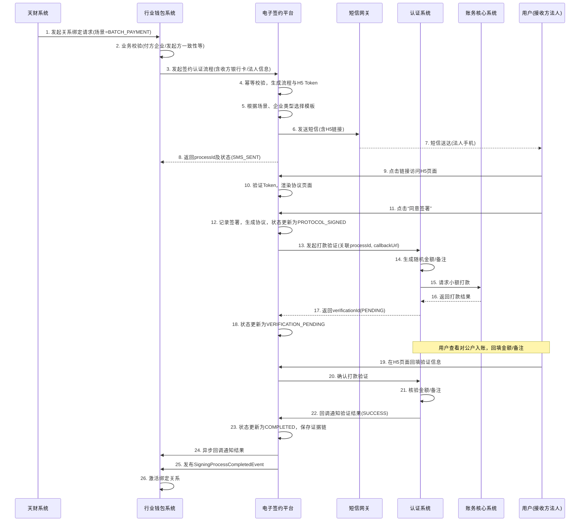

# 模块设计: 电子签约平台

生成时间: 2026-01-16 17:18:55

---

# 电子签约平台模块设计文档

## 1. 概述

### 1.1 目的
电子签约平台作为“天财分账”业务的核心合规与授权模块，负责为“关系绑定”、“开通付款”、“归集授权”等关键业务场景提供电子协议签署、短信认证、H5页面生成、证据链留存等一体化服务。其核心目的是通过合法、合规、可追溯的电子化流程，建立并确认资金收付双方（总部与门店、总部与接收方）的授权关系，满足监管与法务要求，为后续的“天财分账”交易提供法律依据。

### 1.2 范围
本模块专注于以下核心功能：
1. **协议模板管理**：根据业务场景（归集、批量付款、会员结算）、资金用途、签约方角色（总部/门店/接收方）及账户类型（对公/对私）动态生成相应的电子协议。
2. **签约流程编排**：接收行业钱包系统的签约请求，编排“短信发送 -> H5页面引导 -> 协议签署 -> 身份认证（打款/人脸）”的完整流程。
3. **身份认证集成**：作为认证系统的上游调用方，根据签约方类型（企业/个人）发起打款验证或人脸验证，并将认证结果与协议绑定。
4. **证据链管理**：完整记录并安全存储协议原文、签署时间、签署方信息、认证过程（验证金额、时间、类型）及认证结果，形成不可篡改的证据链。
5. **状态同步**：将签约及认证的最终结果同步给业务系统（行业钱包），驱动关系绑定的生效。

**边界说明**：
- 本模块不负责具体的身份验证逻辑（由认证系统负责）。
- 本模块不负责业务规则校验（如付方与发起方一致性校验，由行业钱包系统负责）。
- 本模块不直接面向天财系统，所有请求均通过行业钱包系统发起。
- 本模块不负责协议的法律内容审核，协议模板由法务部门提供并配置。

## 2. 接口设计

### 2.1 API端点 (RESTful)

#### 2.1.1 发起签约认证流程
- **端点**: `POST /api/v1/esign/process/initiate`
- **描述**: 行业钱包系统在业务校验通过后，调用此接口发起一个完整的签约认证流程。本接口将触发短信发送，并返回H5页面链接。
- **请求头**:
    - `X-Business-Id`: 业务流水号（由行业钱包生成，用于幂等）
    - `X-System-Code`: `WALLET`
- **请求体**:
```json
{
  "requestId": "WALLET_REQ_202310120001",
  "businessType": "TIANCAI_SPLIT_ACCOUNT",
  "scene": "BATCH_PAYMENT", // 场景：POOLING（归集）， BATCH_PAYMENT， MEMBER_SETTLEMENT
  "processType": "RELATION_BINDING", // 流程类型：RELATION_BINDING（关系绑定）， OPEN_PAYMENT（开通付款）， POOLING_AUTH（归集授权）
  "payerInfo": {
    "merchantNo": "M100001",
    "merchantName": "北京天财餐饮有限公司（总部）",
    "merchantType": "ENTERPRISE", // ENTERPRISE, INDIVIDUAL
    "accountNo": "ACC100001",
    "accountType": "TIANCAI_RECEIVE_ACCOUNT" // TIANCAI_RECEIVE_ACCOUNT
  },
  "payeeInfo": {
    "merchantNo": "M100002",
    "merchantName": "上海天财门店",
    "merchantType": "ENTERPRISE",
    "accountNo": "ACC100002",
    "accountType": "TIANCAI_RECEIVE_ACCOUNT", // TIANCAI_RECEIVE_ACCOUNT 或 TIANCAI_RECEIVER_ACCOUNT
    "bankCardInfo": { // 行业钱包根据入网信息提供
      "cardNo": "6228480012345678901",
      "accountName": "上海天财门店",
      "bankCode": "ICBC"
    },
    "contactInfo": {
      "name": "张三", // 法人/负责人姓名
      "idCardNo": "110101199001011234", // 法人/负责人身份证
      "mobile": "13800138000" // 接收短信的手机号
    }
  },
  "initiatorInfo": { // 发起方信息（从天财参数中来）
    "merchantNo": "M100001",
    "merchantName": "北京天财餐饮有限公司（总部）"
  },
  "fundPurpose": "股东分红", // 资金用途，用于生成协议内容。归集场景下枚举更多。
  "callbackUrl": "https://wallet.example.com/callback/esign", // 最终结果回调地址
  "extInfo": {
    "orderAggregationMaxRatio": "0.8" // 归集场景特有：订单归集最高比例
  }
}
```
- **响应体** (成功):
```json
{
  "code": "SUCCESS",
  "message": "签约流程已发起",
  "data": {
    "processId": "ESIGN_PROC_202310120001",
    "status": "SMS_SENT",
    "h5PageUrl": "https://e-sign.example.com/h5/sign?token=abc123def456", // 短信中链接指向的H5页面
    "expiredAt": "2023-10-13T15:25:00Z" // H5页面链接有效期，通常24小时
  }
}
```

#### 2.1.2 查询签约流程状态
- **端点**: `GET /api/v1/esign/process/{processId}`
- **描述**: 根据流程ID查询签约认证的详细状态和结果。
- **响应体**:
```json
{
  "code": "SUCCESS",
  "message": "查询成功",
  "data": {
    "processId": "ESIGN_PROC_202310120001",
    "businessType": "TIANCAI_SPLIT_ACCOUNT",
    "scene": "BATCH_PAYMENT",
    "processType": "RELATION_BINDING",
    "status": "COMPLETED", // SMS_SENT, PROTOCOL_SIGNED, VERIFICATION_PENDING, VERIFICATION_SUCCESS, COMPLETED, FAILED, EXPIRED
    "payerInfo": { ... },
    "payeeInfo": { ... },
    "protocolInfo": {
      "protocolId": "PROTO_202310120001",
      "protocolName": "天财分账业务授权协议（总部与接收方）",
      "signedAt": "2023-10-12T15:30:00Z",
      "downloadUrl": "https://e-sign.example.com/protocol/download/xxx.pdf"
    },
    "verificationInfo": {
      "verificationId": "VER202310120001",
      "type": "REMITTANCE",
      "status": "SUCCESS",
      "verifiedAt": "2023-10-12T15:35:00Z"
    },
    "failureReason": null,
    "createdAt": "2023-10-12T15:25:00Z",
    "updatedAt": "2023-10-12T15:35:00Z"
  }
}
```

#### 2.1.3 内部回调接口（供认证系统调用）
- **端点**: `POST /api/internal/esign/callback/verification`
- **描述**: 认证系统在验证（打款/人脸）完成后，通过此接口异步通知电子签约平台结果。此接口为内部接口，需进行身份认证。
- **请求体**:
```json
{
  "verificationId": "VER202310120001",
  "processId": "ESIGN_PROC_202310120001", // 发起认证时上送的关联ID
  "status": "SUCCESS", // SUCCESS, FAILED
  "verifiedAt": "2023-10-12T15:35:00Z",
  "failureReason": null,
  "evidence": {
    "remittanceAmount": "0.12",
    "remittanceRemark": "验证码"
  }
}
```
- **响应体**:
```json
{
  "code": "SUCCESS",
  "message": "回调处理成功"
}
```

#### 2.1.4 短信推送接口（供行业钱包调用，可选）
- **端点**: `POST /api/v1/notification/sms/send`
- **描述**: 根据需求片段，电子签约平台负责封装H5并触发短信推送。此接口为行业钱包调用的统一入口。**（注：根据片段描述，此接口可能由行业钱包调用，但短信发送动作由电子签约平台执行）**
- **请求体**: 同 `2.1.1 发起签约认证流程` 请求体。
- **响应体**: 同 `2.1.1` 响应体。

### 2.2 发布/消费的事件

#### 2.2.1 消费的事件
- **`VerificationCompletedEvent`** (来自认证系统)
    - **用途**: 接收认证结果，更新本地的签约流程状态，并决定是否完成整个流程。

#### 2.2.2 发布的事件
- **`SigningProcessCompletedEvent`**
    - **触发条件**: 一个签约认证流程全部完成（协议已签署且认证成功）。
    - **事件数据**:
    ```json
    {
      "eventId": "EVT_SIGN_202310120001",
      "type": "SIGNING_PROCESS_COMPLETED",
      "timestamp": "2023-10-12T15:35:00Z",
      "payload": {
        "processId": "ESIGN_PROC_202310120001",
        "businessType": "TIANCAI_SPLIT_ACCOUNT",
        "scene": "BATCH_PAYMENT",
        "processType": "RELATION_BINDING",
        "status": "COMPLETED",
        "payerMerchantNo": "M100001",
        "payeeMerchantNo": "M100002",
        "protocolId": "PROTO_202310120001",
        "verificationId": "VER202310120001",
        "fundPurpose": "股东分红"
      }
    }
    ```
    - **潜在消费者**: 行业钱包系统（用于激活绑定关系）、审计系统。

- **`SigningProcessFailedEvent`**
    - **触发条件**: 签约认证流程失败（协议未签署、认证失败、超时等）。
    - **事件数据**: 类似完成事件，但`status`为`FAILED`，并包含失败原因。
    - **潜在消费者**: 行业钱包系统（用于清理中间状态）、监控告警系统。

## 3. 数据模型

### 3.1 核心表设计

#### 表: `signing_process` (签约流程主表)
| 字段名 | 类型 | 必填 | 描述 | 索引 |
|--------|------|------|------|------|
| id | BIGINT(自增) | 是 | 主键 | PK |
| process_id | VARCHAR(32) | 是 | 业务流程号，全局唯一 | UK |
| request_id | VARCHAR(32) | 是 | 行业钱包请求ID，用于幂等 | UK |
| business_type | VARCHAR(32) | 是 | 业务类型，如 `TIANCAI_SPLIT_ACCOUNT` | IDX |
| scene | VARCHAR(32) | 是 | 业务场景：`POOLING`, `BATCH_PAYMENT`, `MEMBER_SETTLEMENT` | IDX |
| process_type | VARCHAR(32) | 是 | 流程类型：`RELATION_BINDING`, `OPEN_PAYMENT`, `POOLING_AUTH` | |
| status | TINYINT | 是 | 状态：0-初始化，1-短信已发，2-协议已签，3-待认证，4-认证成功，5-已完成，6-失败，7-已过期 | IDX |
| payer_merchant_no | VARCHAR(32) | 是 | 付方商户号 | IDX |
| payer_merchant_name | VARCHAR(128) | 是 | 付方商户名 | |
| payer_account_no | VARCHAR(32) | 是 | 付方账户号 | |
| payee_merchant_no | VARCHAR(32) | 是 | 收方商户号 | IDX |
| payee_merchant_name | VARCHAR(128) | 是 | 收方商户名 | |
| payee_account_no | VARCHAR(32) | 是 | 收方账户号 | |
| payee_contact_mobile | VARCHAR(16) | 是 | 收方联系人手机号（短信接收） | |
| payee_contact_name | VARCHAR(64) | 是 | 收方联系人姓名 | |
| payee_contact_id_card | VARCHAR(32) | 否 | 收方联系人身份证（个人/法人） | |
| initiator_merchant_no | VARCHAR(32) | 是 | 发起方商户号 | |
| initiator_merchant_name | VARCHAR(128) | 是 | 发起方商户名 | |
| fund_purpose | VARCHAR(64) | 是 | 资金用途 | |
| h5_page_token | VARCHAR(64) | 是 | H5页面访问令牌 | UK |
| h5_page_url | VARCHAR(512) | 是 | H5页面地址 | |
| callback_url | VARCHAR(512) | 是 | 行业钱包回调地址 | |
| protocol_id | VARCHAR(32) | 否 | 关联的协议ID | |
| verification_id | VARCHAR(32) | 否 | 关联的认证ID | |
| failure_reason | VARCHAR(256) | 否 | 失败原因 | |
| expired_at | DATETIME | 是 | 流程过期时间 | IDX |
| completed_at | DATETIME | 否 | 流程完成时间 | |
| ext_info | JSON | 否 | 扩展信息，如归集比例等 | |
| created_at | DATETIME | 是 | 创建时间 | |
| updated_at | DATETIME | 是 | 更新时间 | |

#### 表: `protocol_record` (协议记录表)
| 字段名 | 类型 | 必填 | 描述 | 索引 |
|--------|------|------|------|------|
| id | BIGINT(自增) | 是 | 主键 | PK |
| protocol_id | VARCHAR(32) | 是 | 协议业务ID | UK |
| process_id | VARCHAR(32) | 是 | 关联的流程ID | FK, IDX |
| template_id | VARCHAR(32) | 是 | 协议模板ID | |
| protocol_name | VARCHAR(128) | 是 | 协议名称 | |
| protocol_content | TEXT | 是 | 协议正文（HTML/PDF模板填充后） | |
| signatory_a | VARCHAR(128) | 是 | 签署方A（通常为拉卡拉或总部） | |
| signatory_b | VARCHAR(128) | 是 | 签署方B（门店/接收方） | |
| signatory_b_type | TINYINT | 是 | 签署方B类型：1-企业，2-个人 | |
| signed_at | DATETIME | 否 | 签署时间（用户点击同意） | |
| sign_ip | VARCHAR(64) | 否 | 签署IP地址 | |
| sign_user_agent | VARCHAR(512) | 否 | 签署浏览器UA | |
| evidence_hash | VARCHAR(128) | 是 | 协议内容哈希值，用于防篡改 | |
| storage_path | VARCHAR(512) | 是 | 协议文件（PDF）存储路径 | |
| created_at | DATETIME | 是 | 创建时间 | |

#### 表: `sms_template` (短信模板表)
| 字段名 | 类型 | 必填 | 描述 | 索引 |
|--------|------|------|------|------|
| id | BIGINT(自增) | 是 | 主键 | PK |
| template_code | VARCHAR(32) | 是 | 模板代码，如 `POOLING_ENTERPRISE` | UK |
| scene | VARCHAR(32) | 是 | 适用场景 | IDX |
| signatory_type | TINYINT | 是 | 签署方类型：1-企业，2-个人 | IDX |
| process_type | VARCHAR(32) | 是 | 流程类型 | IDX |
| content_template | VARCHAR(512) | 是 | 短信内容模板，含变量占位符 | |
| h5_template_name | VARCHAR(64) | 是 | 关联的H5页面模板名 | |
| is_active | BOOLEAN | 是 | 是否启用 | |
| created_at | DATETIME | 是 | 创建时间 | |

#### 表: `evidence_chain` (证据链表)
| 字段名 | 类型 | 必填 | 描述 | 索引 |
|--------|------|------|------|------|
| id | BIGINT(自增) | 是 | 主键 | PK |
| process_id | VARCHAR(32) | 是 | 关联流程ID | FK, IDX |
| evidence_type | VARCHAR(32) | 是 | 证据类型：`PROTOCOL`, `VERIFICATION_REQUEST`, `VERIFICATION_RESULT`, `SMS_RECORD` | |
| evidence_key | VARCHAR(128) | 是 | 证据关键标识（如协议ID、认证ID） | |
| evidence_data | JSON | 是 | 证据详细数据 | |
| created_at | DATETIME | 是 | 创建时间 | |

### 3.2 与其他模块的关系
- **行业钱包系统**: 主要调用方和结果消费者。发起签约流程，并监听`SigningProcessCompletedEvent`以激活绑定关系。
- **认证系统**: 服务调用方。电子签约平台根据签约方类型，调用认证系统进行打款或人脸验证。
- **短信网关**: 服务调用方。用于发送包含H5链接的短信通知。
- **文件存储服务**: 用于存储生成的PDF协议文件。
- **审计系统**: 事件消费者，记录所有签约操作。

## 4. 业务逻辑

### 4.1 核心算法与流程

#### 4.1.1 签约认证流程编排（以批量付款-对公为例）
1. **接收请求与幂等校验**：根据`requestId`和`businessType`防止重复创建流程。
2. **参数校验**：校验必填字段，如手机号格式、商户信息非空等。
3. **确定模板**：根据`scene`、`processType`、`payeeInfo.merchantType`查询`sms_template`表，确定短信模板和H5模板。
4. **生成H5页面与令牌**：
    - 生成唯一的`h5_page_token`，与`process_id`绑定。
    - 根据H5模板和传入参数，渲染生成动态H5页面内容（包含协议展示、确认按钮等）。
    - 生成带有token的H5页面访问URL。
5. **发送短信**：
    - 使用确定的短信模板，将H5 URL、商户名等变量填充，生成最终短信内容。
    - 调用短信网关，向`payeeInfo.contactInfo.mobile`发送短信。
6. **保存流程记录**：状态置为`SMS_SENT`。
7. **H5页面交互**（用户侧）：
    - 用户点击短信链接，访问H5页面。
    - 页面展示协议内容，用户阅读后点击“同意并签署”。
    - 前端调用电子签约平台后端签署接口（内部），记录签署行为，生成`protocol_record`，流程状态更新为`PROTOCOL_SIGNED`。
8. **触发身份认证**：
    - 根据`payeeInfo.merchantType`（企业->打款，个人->人脸）调用认证系统对应接口。
    - 调用时需关联`processId`，并设置`callbackUrl`为电子签约平台内部回调接口。
    - 流程状态更新为`VERIFICATION_PENDING`。
9. **处理认证回调**：
    - 接收认证系统回调，更新`verification_id`和认证结果。
    - 若认证成功，流程状态更新为`COMPLETED`，发布`SigningProcessCompletedEvent`，并异步回调行业钱包的`callbackUrl`。
    - 若认证失败，流程状态更新为`FAILED`，发布`SigningProcessFailedEvent`。
10. **超时处理**：定时任务扫描过期（`expired_at`）且未完成的流程，将其状态置为`EXPIRED`，并发布失败事件。

#### 4.1.2 协议模板渲染与生成
- **模板管理**：协议模板由法务部门以HTML或特定标记语言（如Thymeleaf, Velocity）提供，在电子签约平台管理后台进行上传和版本管理。
- **动态填充**：根据流程中的具体信息（商户名称、账户号、资金用途、归集比例等）填充模板变量，生成最终的协议正文。
- **证据固化**：对填充后的协议内容计算哈希值（如SHA-256），并存储为PDF文件，哈希值存入`protocol_record`作为防篡改证据。

### 4.2 业务规则
1. **流程与场景映射**：
    - `RELATION_BINDING` + `BATCH_PAYMENT`：总部（付方，企业）与接收方（收方，企业/个人）的关系绑定。
    - `RELATION_BINDING` + `MEMBER_SETTLEMENT`：总部（付方，企业）与门店（收方，企业/个人）的关系绑定。
    - `POOLING_AUTH` + `POOLING`：门店（付方，企业/个人）与总部（收方，企业）的归集授权。
    - `OPEN_PAYMENT` + `BATCH_PAYMENT`/`MEMBER_SETTLEMENT`：总部（付方，企业）开通付款权限（签署代付授权协议）。
2. **认证方式规则**：
    - **对公企业**：一律使用**打款验证**（认证系统向对公户打款）。
    - **对私个人/个体户**：一律使用**人脸验证**。
    - **例外**：归集授权场景(`POOLING_AUTH`)下，付方门店即使是个体户，也使用打款验证（与富友流程对齐）。
3. **协议签署方**：
    - 所有协议均为**双方协议**。
    - `RELATION_BINDING`/`POOLING_AUTH`：签署方为**总部（或拉卡拉）与门店/接收方**。
    - `OPEN_PAYMENT`：签署方为**拉卡拉与总部**（代付授权协议）。
4. **流程状态机**：
    ```
    INIT -> SMS_SENT -> PROTOCOL_SIGNED -> VERIFICATION_PENDING -> (VERIFICATION_SUCCESS -> COMPLETED) 或 (VERIFICATION_FAILED -> FAILED)
    任何状态都可能因超时 -> EXPIRED
    ```
5. **幂等性**：基于行业钱包的`requestId`和`businessType`保证同一业务请求不会重复创建流程。

### 4.3 验证逻辑（作为服务提供方）
1. **输入参数校验**：确保行业钱包传入的参数完整，符合业务规则（如手机号格式、场景与流程类型匹配）。
2. **模板存在性校验**：确保配置的短信和协议模板存在且已启用。
3. **流程状态校验**：在用户签署、认证回调等环节，校验当前流程状态是否允许进行该操作，防止重复操作或无效操作。

## 5. 时序图

### 5.1 批量付款场景关系绑定完整流程（对公企业）



## 6. 错误处理

| 错误类型 | 错误码 | HTTP状态码 | 处理策略 |
|----------|--------|-------------|----------|
| 参数校验失败 | `PARAM_INVALID` | 400 | 返回具体字段错误，由行业钱包修正后重试。 |
| 重复请求 | `REQUEST_DUPLICATED` | 409 | 返回已存在的`processId`及状态，行业钱包根据业务决定。 |
| 模板未找到 | `TEMPLATE_NOT_FOUND` | 500 | 触发告警，检查模板配置。返回系统错误，引导运营介入。 |
| 短信发送失败 | `SMS_SEND_FAILED` | 502 | 记录日志，可重试1-2次。若仍失败，流程状态置为`FAILED`，通知行业钱包。 |
| 认证系统调用失败 | `VERIFICATION_SERVICE_ERROR` | 502 | 记录日志，流程状态置为`VERIFICATION_PENDING`但实际未发起。通过监控告警，人工介入或设计重试机制。 |
| 用户签署超时 | `PROCESS_EXPIRED` | 410 | 流程自然过期，状态更新，无需特殊处理。行业钱包可引导用户重新发起。 |
| 内部回调Token验证失败 | `CALLBACK_TOKEN_INVALID` | 401 | 记录安全告警，拒绝回调请求。检查认证系统配置。 |
| 系统内部错误 | `INTERNAL_ERROR` | 500 | 记录错误日志，触发告警，返回通用错误信息。流程状态可能不一致，需人工核查。 |

**重试策略**：
- 对于短信发送、调用认证系统等外部依赖的临时性失败，采用指数退避策略重试（最多3次）。
- 对于用户主动触发的操作（如回填验证信息），不自动重试。

## 7. 依赖说明

### 7.1 上游依赖模块
1. **行业钱包系统**
    - **交互方式**: 同步API调用（发起流程）、异步回调（接收结果）、事件监听（`SigningProcessCompletedEvent`）。
    - **职责**: 业务校验的发起方，签约流程的触发者，以及最终关系绑定的执行者。
    - **SLA要求**: 高可用性（99.95%），签约流程初始化接口平均响应时间<300ms。

2. **认证系统**
    - **交互方式**: 同步API调用（发起验证）、异步回调（接收结果）。
    - **职责**: 提供打款验证和人脸验证的原子能力。
    - **降级方案**: 无直接降级方案。若认证系统完全不可用，则所有签约流程无法完成，业务中断。需有紧急运维预案。

3. **短信网关**
    - **交互方式**: 同步API调用。
    - **职责**: 将包含H5链接的短信送达用户手机。
    - **降级方案**: 若短信发送失败，可尝试重试。若完全不可用，流程无法开始，需告警。

### 7.2 下游服务模块
1. **文件存储服务** (如OSS、S3)
    - **交互方式**: SDK调用。
    - **职责**: 存储生成的PDF协议文件，需保证持久性和安全性。

2. **审计/日志系统**
    - **交互方式**: 日志输出、事件发布。
    - **职责**: 记录所有协议签署、认证关联操作，满足合规审计要求。

### 7.3 配置与治理
- **配置中心**: 管理短信模板、协议模板、H5页面模板、流程超时时间、认证方式映射规则等。
- **监控告警**:
    - 业务监控：各场景签约成功率、失败率、平均完成时长、各环节耗时。
    - 系统监控：接口响应时间、错误率、依赖服务（认证、短信）健康状态。
- **密钥管理**: 安全存储用于生成H5 token的密钥、文件存储服务的访问密钥等。