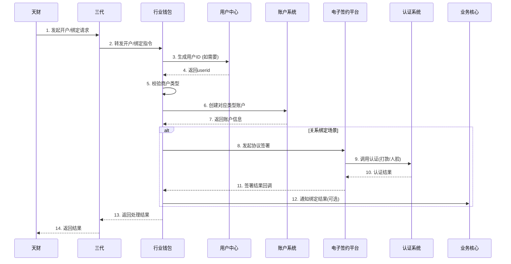
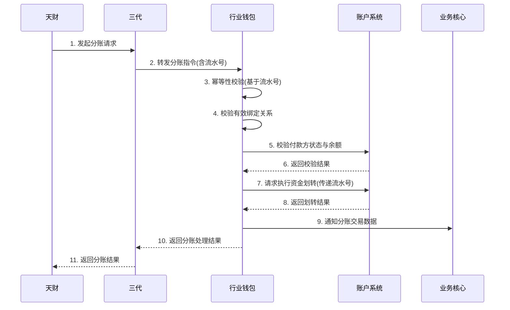

# 模块设计: 行业钱包

生成时间: 2026-01-22 17:47:40
批判迭代: 2

---

# 行业钱包模块设计文档

## 1. 概述
- **目的与范围**：本模块是处理钱包业务逻辑的核心服务层。它接收来自上游业务处理模块（三代）的指令，负责执行用户ID生成、账户开户、关系绑定校验、分账/转账请求处理等核心逻辑，并协调调用下游系统（账户系统、电子签约平台等）完成具体操作。它确保所有资金操作在正确的账户关系和授权下执行，是连接业务指令与底层资金操作的关键枢纽。
- **模块边界澄清**：本模块不负责业务审核、计费配置等业务管理逻辑（由三代负责），也不直接管理底层账户余额或执行会计分录（由账户系统和账务核心负责）。其核心职责是执行业务指令并确保其合规性。

## 2. 接口设计
- **API端点 (REST/GraphQL)**：TBD
- **请求/响应结构**：TBD
- **发布/消费的事件**：TBD

## 3. 数据模型
- **表/集合**：TBD
- **关键字段**：TBD
- **与其他模块的关系**：本模块处理的数据与**账户系统**（账户状态、余额）、**业务核心**（交易数据）、**用户中心**（用户ID）紧密关联。

## 4. 业务逻辑

### 核心工作流
1.  **用户ID生成**：在接收到开户或关系绑定指令时，如需为新商户创建唯一标识，则调用**用户中心**的接口生成用户ID（userid）。本模块负责传递必要的商户信息并存储返回的userid。
2.  **账户开户**：
    *   **输入**：接收来自三代的商户开户指令，包含商户基本信息、机构号、商户类型（收单商户/非收单商户）。
    *   **逻辑**：
        *   校验请求参数完整性。
        *   根据`商户类型`决定账户类型：
            *   若为`收单商户`，则调用**账户系统**创建`天财收款账户`。
            *   若为`非收单商户`，则调用**账户系统**创建`天财接收方账户`。
        *   将开户结果（成功/失败，包含账户ID等信息）返回给三代。
3.  **关系绑定**：
    *   **输入**：接收来自三代的关系绑定指令，包含付款方信息、接收方信息、绑定场景（总部-门店、付款方-一般接收方等）。
    *   **逻辑**：
        *   校验付款方与接收方账户是否存在且状态正常。
        *   根据绑定场景，组装协议签署所需的参数（如双方身份信息、协议模板ID）。
        *   调用**电子签约平台**接口，发起协议签署流程。该流程可能内嵌调用**认证系统**完成打款验证或人脸验证。
        *   监听电子签约平台的回调或轮询签署结果。
        *   若签署成功，在本模块存储绑定关系记录，并标记为“有效”；若失败，记录失败原因并返回。
4.  **分账/转账请求处理**：
    *   **输入**：接收来自三代的分账/转账指令，包含交易流水号、付款方账户、接收方账户、金额、业务场景等。
    *   **逻辑**：
        *   **幂等性校验**：根据交易流水号检查是否已处理过相同请求。
        *   **绑定关系有效性校验**：查询本模块存储的绑定关系，校验付款方与接收方之间是否存在状态为“有效”的绑定记录。`有效绑定关系`的定义为：a) 绑定关系记录存在；b) 关系状态为“已签约”；c) 电子协议在有效期内（如有）；d) 未解除绑定。
        *   **账户状态与余额校验**：调用**账户系统**接口，校验付款方账户状态正常且可用余额充足。
        *   **执行资金划转**：通过调用**账户系统**的资金操作接口执行划转。
        *   **通知业务核心**：将分账交易结果（成功/失败）通知**业务核心**进行数据存储。
        *   返回处理结果给三代。

### 业务规则与验证
1.  开户时需严格校验`商户类型`，以确定创建`天财收款账户`还是`天财接收方账户`。
2.  执行分账前，必须校验付款方账户（必须是`天财收款账户`）与接收方账户（`天财收款账户`或`天财接收方账户`）之间存在`有效绑定关系`（定义见上）。
3.  校验付款方账户状态是否正常、余额是否充足。
4.  所有关键操作（如资金划转）需支持幂等性，通常通过业务唯一流水号实现。

### 数据一致性策略
涉及多个下游系统（账户系统、电子签约平台、业务核心）的操作，采用“最终一致性”策略。
*   **关键操作本地事务**：在本模块数据库内的数据更新（如记录绑定关系、更新请求状态）使用数据库事务保证原子性。
*   **异步补偿与重试**：对于调用下游系统失败的情况：
    *   记录详细日志和操作状态。
    *   对于可重试的错误（如网络超时），采用指数退避策略进行自动重试（例如，最大重试3次，退避间隔2秒、4秒、8秒）。
    *   对于业务性失败或最终重试失败，将操作标记为失败，并可能触发人工干预或通过告警通知运维。
*   **幂等性保障**：下游系统（如账户系统）需提供幂等接口，本模块传递唯一业务流水号，确保重复请求不会导致资金重复划转。

## 5. 时序图

### 账户开户与关系绑定时序图

### 分账请求处理时序图

## 6. 错误处理
- **预期错误情况**：
    1.  **业务规则错误**：绑定关系不存在或无效、付款方账户余额不足、账户状态异常（如冻结）、商户类型错误。
    2.  **系统间调用错误**：调用用户中心、账户系统、电子签约平台、业务核心等下游服务超时、网络错误或返回业务失败。
    3.  **数据一致性错误**：在分布式操作过程中，部分系统成功部分失败。
- **处理策略**：
    1.  **业务错误**：立即中断流程，记录日志，并向调用方（三代）返回明确的业务错误码和提示信息。
    2.  **系统调用失败**：
        *   记录错误日志和上下文。
        *   区分错误类型：对于网络超时等可重试错误，启动**重试机制**（配置化重试次数，如3次；采用指数退避策略）。
        *   所有重试请求必须携带原业务流水号以保证下游幂等性处理。
        *   最终重试失败后，将操作标记为“系统失败”，并触发告警。
    3.  **数据一致性保障**：
        *   依赖**最终一致性**与**补偿机制**。例如，分账时若调用账户系统成功但通知业务核心失败，则记录异常状态，通过定时任务尝试重新通知或人工补单。
        *   关键操作（如资金划转）严格依赖下游系统的幂等性接口，防止重复执行。

## 7. 依赖关系
- **上游模块**：
    *   **三代**：核心上游，提供所有业务指令（开户、绑定、分账）的入口，并负责前置业务审核与配置。
    *   **用户中心**：提供生成全局唯一用户ID（userid）的能力。
- **下游模块**：
    *   **账户系统**：核心下游，负责底层账户的创建、余额查询与变更、状态管理。
    *   **电子签约平台**：负责完成关系绑定过程中的电子协议签署与认证流程。
    *   **业务核心**：用于持久化存储分账等业务交易数据。
    *   **认证系统**：（通过电子签约平台间接依赖）提供身份核验能力。
- **关键依赖说明**：本模块的可用性高度依赖账户系统和电子签约平台。与这些系统的接口需要明确约定超时时间、重试策略和幂等性保证。