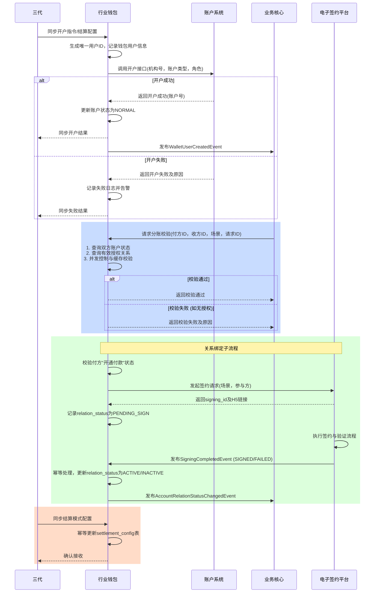

# 模块设计: 行业钱包

生成时间: 2026-01-22 16:15:36
批判迭代: 2

---

# 模块设计: 行业钱包

生成时间: TBD
批判迭代: TBD

---

# 行业钱包模块设计文档

## 1. 概述
- **目的与范围**: 本模块负责处理用户ID生成、账户开户、关系绑定、分账请求校验等核心钱包业务的系统。其核心职责是管理天财收款账户与天财接收方账户的开户流程，建立并维护业务场景（如归集、批量付款、会员结算）下的授权关系，并对分账等资金操作请求进行业务层面的校验。其边界在于处理钱包层面的业务逻辑，驱动账户系统完成底层账户开户，但不直接进行底层资金操作和清结算计算。

## 2. 接口设计
- **API端点 (REST)**:
    - `POST /api/v1/wallet/users`: 创建钱包用户（开户）。
    - `POST /api/v1/wallet/relations`: 发起关系绑定。
    - `GET /api/v1/wallet/relations/{relation_id}`: 查询关系绑定状态。
    - `POST /api/v1/wallet/validations/split`: 校验分账请求。
    - `PUT /api/v1/wallet/settlement-configs`: 更新结算配置。
- **请求/响应结构**:
    - 创建钱包用户 (`POST /api/v1/wallet/users`):
        - 请求体: `{"institution_no": "string", "merchant_type": "ACQUIRING/NON_ACQUIRING", "role": "HEADQUARTERS/STORE/TBD"}`
        - 响应体: `{"user_id": "string", "account_status": "NORMAL"}`
    - 发起关系绑定 (`POST /api/v1/wallet/relations`):
        - 请求体: `{"payer_user_id": "string", "payee_user_id": "string", "business_scene": "COLLECTION/BATCH_PAY/MEMBER_SETTLEMENT"}`
        - 响应体: `{"relation_id": "string", "signing_id": "string", "h5_link": "string"}`
    - 校验分账请求 (`POST /api/v1/wallet/validations/split`):
        - 请求体: `{"payer_user_id": "string", "payee_user_id": "string", "business_scene": "string", "request_id": "string"}`
        - 响应体: `{"is_valid": boolean, "code": "string", "message": "string"}`
- **发布/消费的事件**:
    - 消费来自**三代**的开户审核结果、结算模式配置、账户信息同步等事件。
    - 消费来自**电子签约平台**的`SigningCompletedEvent`，用于更新关系绑定状态。
    - 发布`WalletUserCreatedEvent`（事件内容: `user_id`, `institution_no`, `account_status`），供下游系统（如业务核心）感知。
    - 发布`AccountRelationStatusChangedEvent`（事件内容: `relation_id`, `payer_user_id`, `payee_user_id`, `old_status`, `new_status`）。

## 3. 数据模型
- **表/集合**:
    - `wallet_user` (钱包用户表)
    - `account_relation` (账户关系表)
    - `settlement_config` (结算配置表)
- **关键字段**:
    - `wallet_user` 表:
        - `user_id` (主键): 钱包用户唯一标识，与账户系统的账户号关联。
        - `institution_no`: 机构号，由三代运营分配给天财或其下属商户的唯一标识。
        - `merchant_type`: 商户类型（ACQUIRING: 收单商户 / NON_ACQUIRING: 非收单商户）。
        - `role`: 角色（HEADQUARTERS: 总部 / STORE: 门店 / TBD）。
        - `account_status`: 账户状态（NORMAL: 正常 / FROZEN: 冻结 / CLOSED: 注销）。
        - `created_at`: 创建时间。
        - `updated_at`: 更新时间。
    - `account_relation` 表:
        - `relation_id` (主键): 关系唯一标识。
        - `payer_user_id`: 付方用户ID，外键关联`wallet_user.user_id`。
        - `payee_user_id`: 收方用户ID，外键关联`wallet_user.user_id`。
        - `business_scene`: 业务场景（COLLECTION: 归集 / BATCH_PAY: 批量付款 / MEMBER_SETTLEMENT: 会员结算）。
        - `signing_id`: 关联的电子签约ID，外键关联电子签约平台的签约记录。
        - `relation_status`: 关系状态（PENDING_SIGN: 待签约 / ACTIVE: 已生效 / INACTIVE: 已失效）。
        - `authorized_at`: 授权生效时间。
        - `created_at`: 创建时间。
        - `updated_at`: 更新时间。
    - `settlement_config` 表:
        - `config_id` (主键): 配置ID。
        - `user_id`: 用户ID，外键关联`wallet_user.user_id`。
        - `settlement_mode`: 结算模式（ACTIVE: 主动结算 / PASSIVE: 被动结算）。
        - `settlement_account`: 指定的结算账户信息（JSON格式）。
        - `effective_date`: 生效日期。
        - `created_at`: 创建时间。
        - `updated_at`: 更新时间。
- **与其他模块的关系**: 本模块的`user_id`与**账户系统**的账户号关联；`signing_id`与**电子签约平台**的签约记录关联；结算配置信息源自**三代**的同步。

## 4. 业务逻辑
- **核心工作流/算法**:
    1.  **开户流程**: 接收来自三代的开户指令或业务触发，生成全局唯一的用户ID（如使用分布式ID生成器），根据商户类型（收单/非收单）确定账户类型，调用账户系统的开户接口完成底层账户开户，记录钱包用户信息，并发布`WalletUserCreatedEvent`。
    2.  **关系绑定流程**: 为归集、批量付款、会员结算等场景建立付方与收方的授权关系。首先校验付方用户是否已完成"开通付款"流程（即其账户状态正常且存在有效的签约记录）。校验通过后，调用电子签约平台发起签约流程，记录关系状态为"待签约"。异步消费`SigningCompletedEvent`，根据签约结果更新关系状态为"已生效"或"已失效"，并发布状态变更事件。处理并发请求时，对同一对`payer_user_id`和`payee_user_id`在特定场景下的关系创建请求进行幂等控制。
    3.  **分账请求校验流程**: 接收业务核心的分账校验请求。校验步骤包括：a) 查询付方与收方账户状态，确保付方为正常状态的天财收款账户，收方为正常状态的天财收款账户或天财接收方账户。b) 查询双方在指定业务场景下是否存在状态为"已生效"的授权关系。c) 校验通过则返回成功，否则返回具体失败原因。此流程需支持高并发，对关键数据查询使用缓存优化。
    4.  **结算模式管理**: 接收并处理三代同步的商户结算模式（主动/被动）及指定的结算账户信息，更新`settlement_config`表。此操作为幂等操作，基于`user_id`和`effective_date`进行更新或插入。
- **业务规则与验证**:
    - 开户时，收单商户可开立天财收款账户，非收单商户可开立天财接收方账户。
    - 建立关系绑定前，付方需已完成"开通付款"流程（即完成签约与认证）。
    - 分账校验时，付方账户必须为正常状态的天财收款账户；收方账户可为天财收款账户或天财接收方账户。
    - 校验资金操作是否在已授权的业务场景和关系范围内。
    - 账户状态变更为"冻结"或"注销"时，需将其所有关联的生效关系状态同步置为"已失效"。
- **关键边界情况处理**:
    - 处理电子签约回调超时或失败：实现状态查询补偿机制，定期轮询电子签约平台获取未最终态的关系绑定状态。
    - 处理并发开户请求时的用户ID生成唯一性：使用分布式唯一ID生成器（如雪花算法）。
    - 关系绑定状态与账户状态联动：如账户冻结，通过监听账户状态变更事件，自动将相关绑定关系状态更新为"已失效"。
    - 异步事件处理保证幂等性：通过事件ID或业务唯一键（如`signing_id`）实现。

## 5. 时序图

## 6. 错误处理
- **预期错误情况**:
    - `ERR_INVALID_PARAM`: 开户、关系绑定或校验请求参数不完整或格式错误。
    - `ERR_ACCOUNT_OPEN_FAILED`: 调用账户系统开户失败。
    - `ERR_ACCOUNT_NOT_FOUND`: 分账校验时账户不存在。
    - `ERR_ACCOUNT_STATUS_ABNORMAL`: 分账校验时账户状态异常（冻结、注销）。
    - `ERR_RELATION_NOT_AUTHORIZED`: 分账校验时无有效授权关系。
    - `ERR_SIGNING_INIT_FAILED`: 发起电子签约失败。
    - `ERR_SIGNING_CALLBACK_MISSING`: 接收电子签约事件时签约ID不存在或状态不一致。
    - `ERR_DATA_SYNC_FAILED`: 与三代数据同步失败。
    - `ERR_CONCURRENT_CONFLICT`: 处理并发请求时发生冲突。
- **处理策略**:
    - 参数错误立即返回`ERR_INVALID_PARAM`。
    - 下游服务（账户系统、电子签约）调用失败进行有限次重试（如3次），重试失败后记录错误日志并告警，向上游返回具体错误码。
    - 业务校验失败返回明确的业务错误码（如`ERR_RELATION_NOT_AUTHORIZED`）及原因。
    - 异步事件处理通过唯一键保证幂等性，避免重复更新状态。
    - 对于并发冲突，采用乐观锁或分布式锁机制，返回`ERR_CONCURRENT_CONFLICT`引导重试。
    - 记录所有异常日志，包含请求ID、用户ID等上下文信息，用于排查。

## 7. 依赖关系
- **上游模块**:
    - **三代**: 提供开户审核指令、结算模式配置、账户信息同步。
- **下游模块**:
    - **账户系统**: 驱动底层账户开户。
    - **业务核心**: 提供分账校验服务，并消费本模块发布的事件。
    - **电子签约平台**: 驱动关系绑定签约流程。