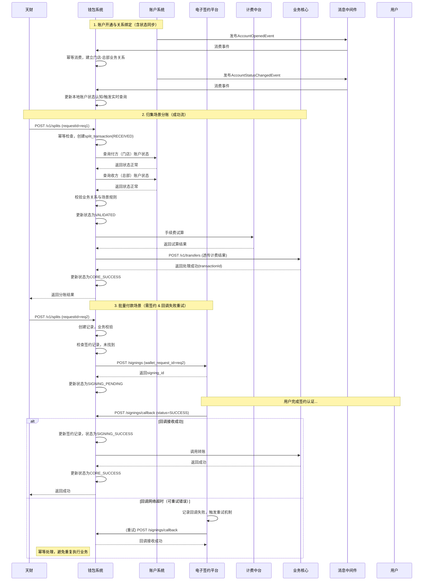

# 模块设计: 行业钱包系统

生成时间: 2026-01-21 18:18:22
批判迭代: 2

---

# 模块设计: 行业钱包系统

生成时间: TBD
批判迭代: TBD

---

# 行业钱包系统模块设计文档

## 1. 概述
- **目的与范围**: 行业钱包系统（亦称钱包系统）是处理天财业务的核心业务逻辑系统。其核心职责包括：处理天财专用账户的开户请求（与账户系统协同）、管理付方与收方之间的业务关系绑定、对天财分账请求进行业务校验、并根据不同业务场景（归集、批量付款、会员结算）调用下游系统完成签约认证及账务处理。其边界在于业务逻辑的编排与校验，不直接管理底层账户（依赖账户系统）和执行账务记账（依赖业务核心）。

## 2. 接口设计
- **API端点 (REST/GraphQL)**:
    - `POST /v1/splits`: 接收分账请求。
    - `GET /v1/splits/{requestId}`: 根据请求ID查询分账处理结果。
    - `POST /v1/signings/callback`: 接收电子签约平台回调。
    - `GET /v1/relationships`: 查询业务关系绑定。
- **鉴权方式**: 调用方需在请求头中携带有效的API Key进行身份认证。
- **接口详情**:
    1.  **分账请求 (`POST /v1/splits`)**:
        - **幂等键**: 请求头 `X-Request-ID`。
        - **请求体**:
            ```json
            {
              "scene": "COLLECTION",
              "payerMerchantId": "store_001",
              "payeeMerchantId": "hq_001",
              "amount": 100.00,
              "currency": "CNY",
              "feeBearer": "PAYER",
              "arrivalMode": "NET",
              "businessRef": "order_20241027001",
              "remark": "门店归集"
            }
            ```
        - **响应体 (成功)**:
            ```json
            {
              "code": "SUCCESS",
              "message": "分账请求已接收",
              "data": {
                "requestId": "wallet_req_20241027001",
                "status": "RECEIVED"
              }
            }
            ```
    2.  **查询分账结果 (`GET /v1/splits/{requestId}`)**:
        - **响应体**:
            ```json
            {
              "code": "SUCCESS",
              "message": "查询成功",
              "data": {
                "requestId": "wallet_req_20241027001",
                "scene": "COLLECTION",
                "payerMerchantId": "store_001",
                "payeeMerchantId": "hq_001",
                "amount": 100.00,
                "status": "CORE_SUCCESS",
                "transactionId": "txn_789012",
                "createdAt": "2023-10-27T10:00:00Z",
                "updatedAt": "2023-10-27T10:05:00Z"
              }
            }
            ```
    3.  **签约回调 (`POST /v1/signings/callback`)**:
        - **鉴权**: 请求头 `X-API-Key` 与 `X-Signature` 验签。
        - **幂等键**: 请求头 `X-Idempotency-Key` (值为 `signing_id`)。
        - **请求体**:
            ```json
            {
              "signing_id": "sign_789012",
              "wallet_request_id": "wallet_req_20241027001",
              "status": "SUCCESS",
              "timestamp": "2023-10-27T10:15:00Z"
            }
            ```
        - **响应体**:
            ```json
            {
              "code": "SUCCESS",
              "message": "回调接收成功"
            }
            ```
    4.  **查询业务关系 (`GET /v1/relationships`)**:
        - **查询参数**: `storeMerchantId`, `hqMerchantId`, `scene`。
        - **响应体**:
            ```json
            {
              "code": "SUCCESS",
              "message": "查询成功",
              "data": [
                {
                  "storeMerchantId": "store_001",
                  "hqMerchantId": "hq_001",
                  "scene": "COLLECTION",
                  "status": "ACTIVE",
                  "createdAt": "2023-10-26T00:00:00Z"
                }
              ]
            }
            ```
- **错误码体系**:
    - `SUCCESS`: 成功。
    - `INVALID_PARAMETER` (400): 请求参数无效。
    - `UNAUTHORIZED` (401): 鉴权失败。
    - `DUPLICATE_REQUEST` (409): 幂等键冲突，请求已处理。
    - `RELATIONSHIP_NOT_FOUND` (404): 业务关系不存在。
    - `ACCOUNT_STATUS_INVALID` (400): 账户状态异常。
    - `SIGNING_REQUIRED` (400): 需要签约认证。
    - `SIGNING_FAILED` (400): 签约失败。
    - `DOWNSTREAM_UNAVAILABLE` (503): 下游系统暂时不可用。
    - `INTERNAL_ERROR` (500): 系统内部错误。
- **发布/消费的事件**:
    - **消费事件**:
        - `AccountOpenedEvent`: 账户开通完成事件。用于建立业务关系绑定。
            - **Payload字段**: `eventId`, `accountId`, `merchantId`, `roleType`, `scene`, `status`, `occurredAt`。
        - `AccountStatusChangedEvent`: 账户状态变更事件。用于同步本地缓存的账户状态或实时查询。
            - **Payload字段**: `eventId`, `accountId`, `merchantId`, `oldStatus`, `newStatus`, `occurredAt`。
    - **发布事件**:
        - `RelationshipBoundEvent`: 业务关系绑定完成事件。用于通知下游或对账。
            - **Payload字段**: `eventId`, `storeMerchantId`, `hqMerchantId`, `scene`, `status`, `occurredAt`。
        - `SplitTransferResultEvent`: 分账处理结果事件。用于异步通知或对账。
            - **Payload字段**: `eventId`, `requestId`, `transactionId`, `status`, `amount`, `payerMerchantId`, `payeeMerchantId`, `occurredAt`。

## 3. 数据模型
- **表/集合**:
    1.  `relationship_binding` (业务关系绑定表):
        - `id` (主键): 自增ID。
        - `store_merchant_id` (VARCHAR): 门店商户ID。
        - `hq_merchant_id` (VARCHAR): 总部商户ID。
        - `scene` (VARCHAR): 业务场景 (`COLLECTION`, `BATCH_PAYMENT`, `MEMBER_SETTLEMENT`)。
        - `status` (VARCHAR): 状态 (`ACTIVE`, `INACTIVE`)。
        - `created_at` (DATETIME): 创建时间。
        - `updated_at` (DATETIME): 更新时间。
        - **唯一约束**: `uniq_store_scene` ON (`store_merchant_id`, `scene`)。(同一门店在同一场景下只能绑定一个总部)
        - **索引**: `idx_hq_merchant_id`。
    2.  `signing_record` (签约记录表):
        - `id` (主键): 自增ID。
        - `wallet_request_id` (VARCHAR, UK): 钱包系统请求ID，关联分账请求。
        - `signing_id` (VARCHAR): 电子签约平台返回的签约ID。
        - `payer_merchant_id` (VARCHAR): 付方商户ID。
        - `payee_merchant_id` (VARCHAR): 收方商户ID。
        - `scene` (VARCHAR): 业务场景。
        - `fund_purpose` (VARCHAR): 资金用途。
        - `status` (VARCHAR): 签约状态 (`INIT`, `SUCCESS`, `FAILED`, `EXPIRED`)。
        - `expires_at` (DATETIME): 签约流程过期时间。
        - `created_at` (DATETIME): 创建时间。
        - `updated_at` (DATETIME): 更新时间。
        - **唯一约束**: `uniq_wallet_request_id` ON (`wallet_request_id`)。
        - **复用索引**: `idx_payer_payee_scene` ON (`payer_merchant_id`, `payee_merchant_id`, `scene`, `fund_purpose`)。(用于检查签约复用)
    3.  `split_transaction` (分账交易表):
        - `id` (主键): 自增ID。
        - `request_id` (VARCHAR, UK): 外部请求ID，幂等键。
        - `scene` (VARCHAR): 业务场景。
        - `payer_merchant_id` (VARCHAR): 付方商户ID。
        - `payee_merchant_id` (VARCHAR): 收方商户ID。
        - `amount` (DECIMAL): 交易金额。
        - `fee_bearer` (VARCHAR): 手续费承担方。
        - `arrival_mode` (VARCHAR): 到账模式。
        - `business_ref` (VARCHAR): 业务关联号。
        - `status` (VARCHAR): 交易状态 (`RECEIVED`, `VALIDATED`, `SIGNING_PENDING`, `SIGNING_SUCCESS`, `CORE_REQUESTED`, `CORE_SUCCESS`, `FAILED`, `SUSPENDED`)。
        - `transaction_id` (VARCHAR): 业务核心返回的交易ID。
        - `error_code` (VARCHAR): 错误码。
        - `error_message` (TEXT): 错误信息。
        - `retry_count` (INT): 重试次数。
        - `next_retry_at` (DATETIME): 下次重试时间。
        - `created_at` (DATETIME): 创建时间。
        - `updated_at` (DATETIME): 更新时间。
        - **唯一约束**: `uniq_request_id` ON (`request_id`)。
        - **索引**: `idx_status_next_retry`, `idx_payer_merchant_id`, `idx_created_at`。
    4.  `processed_event` (已处理事件表):
        - `id` (主键): 自增ID。
        - `event_id` (VARCHAR, UK): 事件唯一ID。
        - `event_type` (VARCHAR): 事件类型 (`AccountOpenedEvent`, `AccountStatusChangedEvent`)。
        - `processed_at` (DATETIME): 处理时间。
        - **唯一约束**: `uniq_event_id` ON (`event_id`)。
- **与其他模块的关系**: 本系统是业务逻辑的枢纽，其数据模型需关联账户系统的账户信息、电子签约平台的签约记录以及业务核心的交易记录。

## 4. 业务逻辑
- **核心工作流/算法**:
    1.  **账户开通与关系绑定**: 消费账户系统发布的 `AccountOpenedEvent`，根据事件中的商户ID、角色类型和场景，建立总部与门店之间的业务绑定关系（如归集关系）。消费 `AccountStatusChangedEvent` 更新本地对账户状态的认知或触发实时查询。
    2.  **分账请求处理**:
        - **接收与幂等**: 接收分账请求，基于 `requestId` 进行幂等校验。
        - **业务校验**: 校验付方与收方账户状态（通过实时查询账户系统接口）、账户角色与场景匹配性、业务关系是否存在（如归集场景下，门店是否已绑定给指定总部）。
        - **场景路由与签约校验**:
            - **归集 (`COLLECTION`)**: 资金从门店流向总部。校验双方已建立归集关系。通常无需额外签约。
            - **批量付款 (`BATCH_PAYMENT`)/会员结算 (`MEMBER_SETTLEMENT`)**: 资金从总部分账给接收方。需确保付方（总部）已完成"开通付款"签约认证流程。签约粒度按 `payerMerchantId` + `payeeMerchantId` + `scene` + `fundPurpose` 组合。若未签约，则发起签约流程。
        - **调用下游**:
            - 对于需要签约认证的场景，调用电子签约平台发起签约流程，并等待回调。
            - 对于无需签约或签约成功后，组装请求调用业务核心执行账务处理。**计费责任边界**: 钱包系统调用计费中台进行手续费试算，并将结果透传给业务核心。业务核心在正式记账时可能再次调用计费中台或使用透传的参数。
    3.  **签约流程驱动**: 作为电子签约平台的上游，发起签约请求（`wallet_request_id`），并处理其回调，根据签约结果决定是否继续后续账务流程。处理签约超时：通过定时任务轮询电子签约平台 `GET /api/v1/signings/{id}` 接口。
- **业务规则与验证**:
    - **关系绑定规则**: 同一门店在同一场景下，通常只能绑定一个总部（归集关系）。通过数据库唯一约束保证。
    - **场景准入规则**:
        - 归集：付方角色必须为`STORE`，收方角色必须为`HEADQUARTERS`。
        - 批量付款/会员结算：付方角色必须为`HEADQUARTERS`。
    - **签约触发与复用规则**: 批量付款和会员结算场景下，付方（总部）在首次向特定收方进行特定场景和资金用途的付款前，必须完成签约。签约记录可复用，避免重复签约。
    - **枚举映射**:
        - 对外API与内部模型统一使用英文枚举：`COLLECTION`, `BATCH_PAYMENT`, `MEMBER_SETTLEMENT`。
        - 角色枚举：`HEADQUARTERS`, `STORE`。
- **交易编排状态机**:
    - 状态: `RECEIVED` -> `VALIDATED` -> (`SIGNING_PENDING` -> `SIGNING_SUCCESS`) -> `CORE_REQUESTED` -> `CORE_SUCCESS`。
    - 失败状态: `FAILED` (最终失败), `SUSPENDED` (悬挂等待人工介入)。
    - 状态迁移动作:
        - `RECEIVED`: 请求接收，持久化。
        - `VALIDATED`: 业务校验通过。
        - `SIGNING_PENDING`: 已发起签约，等待回调。
        - `SIGNING_SUCCESS`: 签约成功。
        - `CORE_REQUESTED`: 已请求业务核心。
        - `CORE_SUCCESS`: 业务核心处理成功。
        - 每个状态转换失败时，根据错误类型决定重试（更新`retry_count`, `next_retry_at`）或直接置为`FAILED`/`SUSPENDED`。
- **关键边界情况处理**:
    - **重复事件消费**: 对 `AccountOpenedEvent` 和 `AccountStatusChangedEvent` 通过 `processed_event` 表进行幂等消费。
    - **签约流程中断**: 处理电子签约平台回调失败或超时，具备重试与状态查询机制。
    - **下游系统异常**: 调用业务核心或账户系统失败时，根据错误码判断是否可重试（如网络超时），采用指数退避策略。重试次数耗尽后置为`SUSPENDED`。
    - **数据不一致**: 定期与账户系统、业务核心进行业务数据对账，发现不一致时触发告警并支持人工或自动补偿。

## 5. 时序图



## 6. 错误处理
- **预期错误情况**:
    - **业务校验失败**: 账户状态异常、业务关系不存在、场景不匹配、未完成必要签约。错误码如 `ACCOUNT_STATUS_INVALID`, `RELATIONSHIP_NOT_FOUND`, `SIGNING_REQUIRED`。
    - **下游调用失败**: 调用账户系统、电子签约平台、业务核心、计费中台的接口超时或返回错误。错误码如 `DOWNSTREAM_UNAVAILABLE`。
    - **事件处理失败**: 消费事件时发生异常。
    - **数据不一致**: 本地业务关系与账户系统状态不一致。
- **处理策略**:
    - **业务错误**: 立即向调用方返回明确的错误信息（包含错误码、`traceId`），终止流程，交易状态置为`FAILED`。此类错误不可重试，需要调用方修改参数。
    - **下游暂时性故障**: 采用指数退避策略进行重试（更新`split_transaction`表的`retry_count`和`next_retry_at`），重试次数可配置。重试耗尽后状态置为`SUSPENDED`，触发告警。此类错误可返回`DOWNSTREAM_UNAVAILABLE`，调用方可稍后通过`requestId`查询结果。
    - **事件消费幂等**: 通过`processed_event`表实现幂等消费，避免重复处理。
    - **对账与补偿**: 定期与账户系统、业务核心进行业务数据对账，基于`requestId`、`transactionId`等关键字段核对。发现不一致时触发告警并支持人工或自动补偿（如重新同步状态、触发冲正）。
    - **对外错误码表**:
        | 错误码 | HTTP状态 | 含义 | 是否可重试 | 客户端动作 |
        | :--- | :--- | :--- | :--- | :--- |
        | `INVALID_PARAMETER` | 400 | 参数错误 | 否 | 检查并修改请求参数 |
        | `DUPLICATE_REQUEST` | 409 | 重复请求 | 是（幂等） | 使用原`requestId`查询结果 |
        | `RELATIONSHIP_NOT_FOUND` | 404 | 业务关系不存在 | 否 | 检查商户ID与场景，或先建立关系 |
        | `ACCOUNT_STATUS_INVALID` | 400 | 账户状态异常 | 否 | 联系运营检查账户 |
        | `SIGNING_REQUIRED` | 400 | 需要签约 | 否 | 引导用户完成签约流程 |
        | `SIGNING_FAILED` | 400 | 签约失败 | 否 | 检查签约失败原因并重试 |
        | `DOWNSTREAM_UNAVAILABLE` | 503 | 下游服务暂时不可用 | 是 | 稍后使用`requestId`查询处理结果 |
        | `INTERNAL_ERROR` | 500 | 系统内部错误 | 是 | 联系技术支持，提供`traceId` |

## 7. 依赖关系
- **上游模块**:
    - **账户系统**: **强依赖**。消费其 `AccountOpenedEvent` 和 `AccountStatusChangedEvent` 以建立业务关系和同步状态，调用其接口实时查询账户状态。
    - **三代/天财**: **强依赖**。接收其分账业务请求。
- **下游模块**:
    - **电子签约平台**: **强依赖**。在批量付款和会员结算场景下，调用其发起签约认证流程，并处理其回调。
    - **业务核心**: **强依赖**。在所有分账场景下，调用其执行最终的账务处理。需透传计费参数。
    - **计费中台**: **强依赖**。在分账请求处理中，调用其进行手续费试算，并将结果透传给业务核心。
    - **清结算**: **弱依赖**。可能接收其结算结果通知或查询退货账户信息。
- **非功能性依赖**:
    - **消息中间件**: 用于可靠的事件消费。
    - **数据库**: 用于持久化业务关系、交易状态等。
    - **定时任务调度**: 用于处理重试、超时查询（如签约状态轮询）、对账任务。