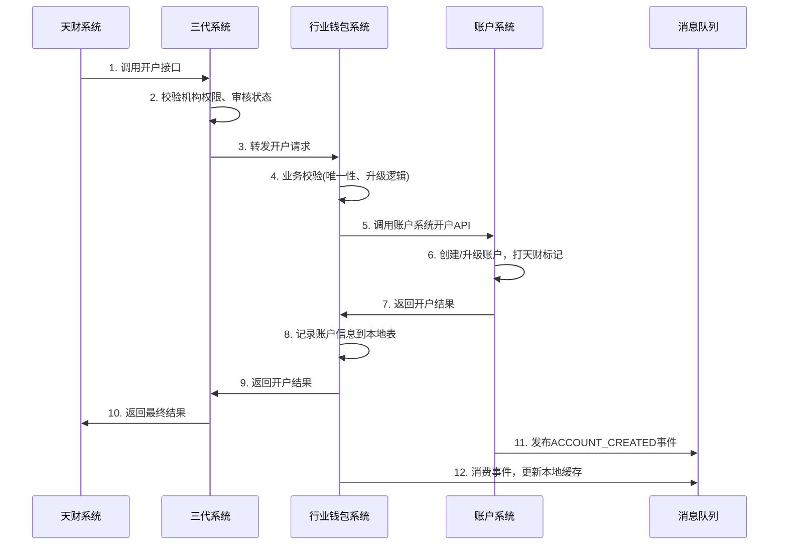
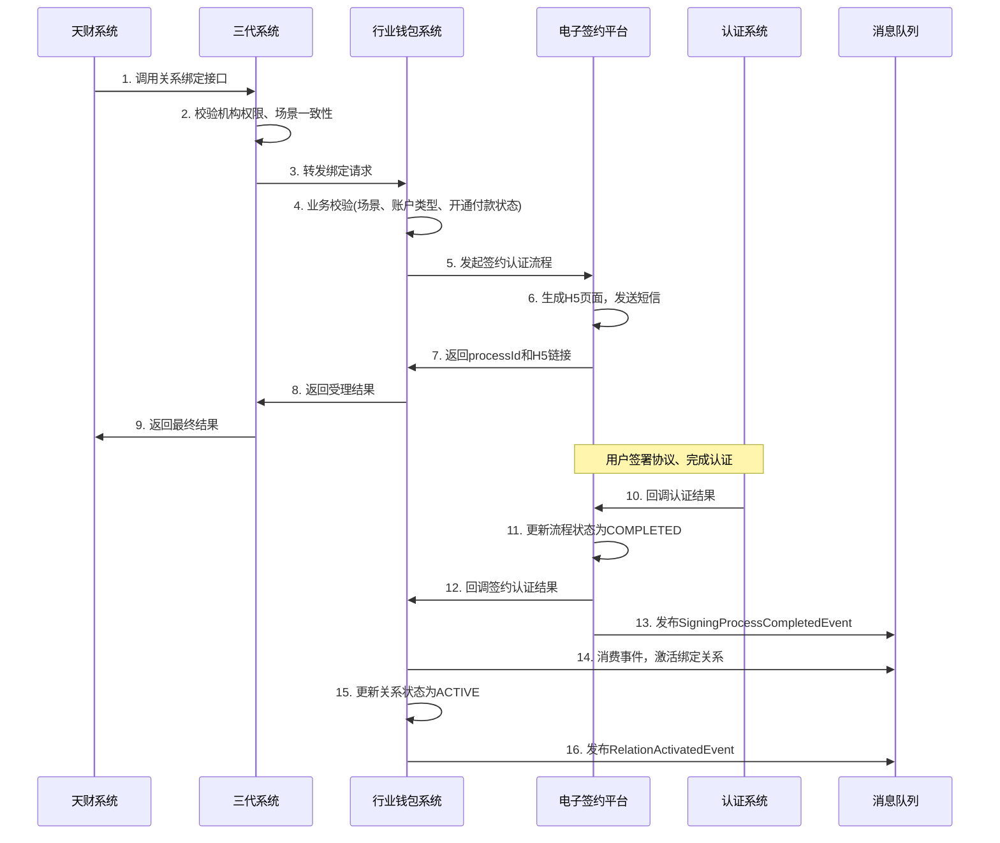
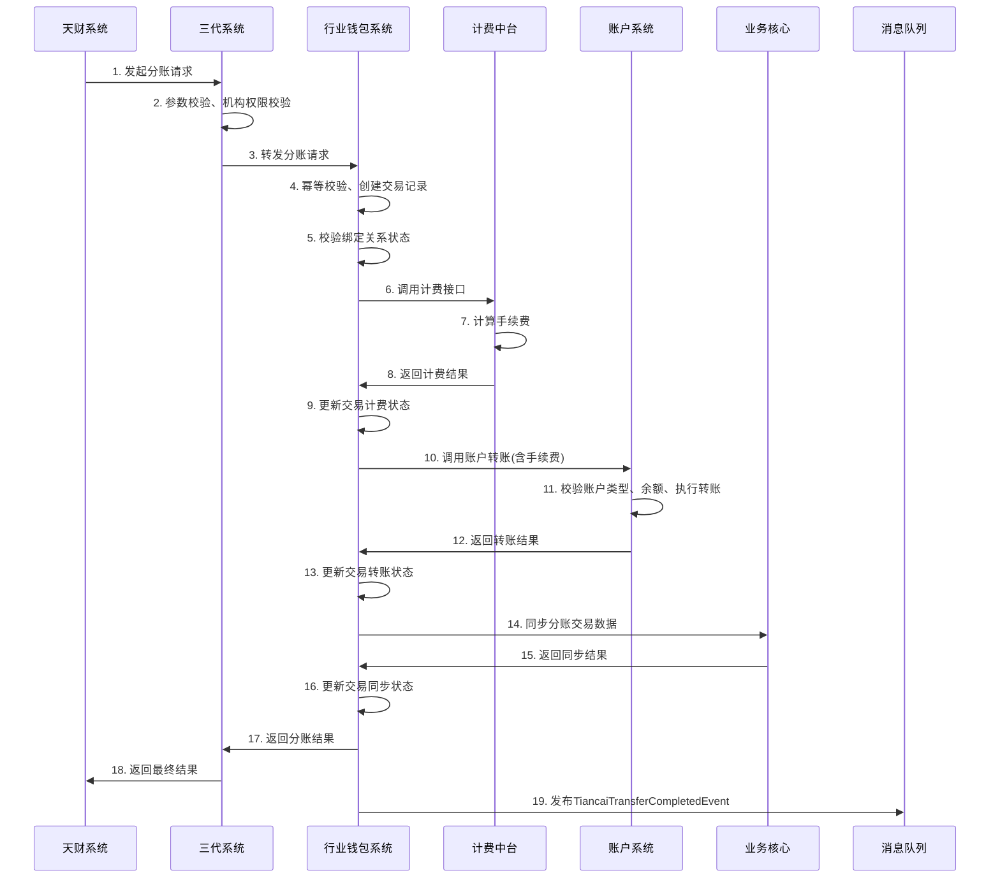

# 模块设计: 行业钱包系统

生成时间: 2026-01-16 17:20:41

---

# 模块设计: 行业钱包系统

生成时间: 2026-01-16

---

# 行业钱包系统模块设计文档

## 1. 概述

### 1.1 目的
行业钱包系统作为“天财商龙”业务场景的核心业务处理与协调模块，负责：
1. **业务处理与协调**：作为天财分账业务的核心处理单元，接收三代系统转发的业务请求（开户、关系绑定、分账），进行业务逻辑校验、流程编排，并协调下游系统（账户系统、电子签约平台、计费中台等）完成业务闭环。
2. **关系绑定管理**：管理归集、批量付款、会员结算场景下的资金收付授权关系，负责校验场景一致性、发起并跟踪电子签约与身份认证流程，确保绑定关系合法有效。
3. **分账交易处理**：处理天财发起的“天财分账”交易，执行计费、账户转账、数据同步等核心操作。
4. **数据同步与一致性**：作为业务核心数据的汇聚点，向业务核心同步分账交易数据，为对账单系统提供账户关系映射，确保业务数据在上下游系统间的一致性。

### 1.2 范围
- **账户管理**：接收三代转发的天财专用账户开户/升级请求，进行业务校验后调用账户系统执行。
- **关系绑定**：
    - 接收三代转发的“关系绑定”与“开通付款”请求。
    - 执行场景一致性、发起方与付方一致性、账户类型等业务规则校验。
    - 调用电子签约平台发起完整的签约认证流程（短信、H5、协议、认证）。
    - 管理绑定关系状态，并在签约认证成功后激活关系。
- **分账交易**：
    - 接收天财发起的“天财分账”请求。
    - 校验绑定关系与协议状态。
    - 调用计费中台计算手续费。
    - 调用账户系统执行转账。
    - 向业务核心同步交易数据。
- **数据提供**：为对账单系统提供商户与账户（收款账户、接收方账户）的映射关系。
- **业务校验**：作为业务规则的集中执行点，确保所有操作符合天财业务规范。

**边界说明**：
- **上游**：三代系统是唯一的外部调用方，负责机构权限、审核状态等前置校验。
- **下游**：账户系统（开户、转账）、电子签约平台（签约认证）、计费中台（手续费）、业务核心（数据同步）、对账单系统（数据提供）。
- **不负责**：机构权限校验（三代负责）、电子协议模板管理（电子签约平台负责）、费率配置（三代负责并同步至计费中台）、账户底层操作（账户系统负责）。

## 2. 接口设计

### 2.1 API端点 (REST)

#### 2.1.1 开户接口（供三代调用）
- **端点**：`POST /api/v1/wallet/tiancai/accounts/open`
- **描述**：接收三代转发的天财专用账户开户或升级请求。执行业务校验后，调用账户系统完成账户创建或升级。
- **调用方**：三代系统
- **认证**：系统间API Key认证（与三代约定）
- **请求头**：
  ```json
  {
    "X-Request-Id": "uuid_v4_from_gen3",
    "X-System-Code": "GEN3"
  }
  ```
- **请求体**：
  ```json
  {
    "requestId": "GEN3_REQ_20240116001", // 三代请求ID，用于幂等
    "operationType": "CREATE | UPGRADE",
    "accountType": "RECEIVE_ACCOUNT | RECEIVER_ACCOUNT",
    "merchantNo": "8888880001",
    "merchantName": "北京天财餐饮总部",
    "roleType": "HEADQUARTERS | STORE", // 仅收款账户必填
    "accountName": "账户名称",
    "certType": "ID_CARD | BUSINESS_LICENSE",
    "certNo": "证件号码",
    "bankCardNo": "默认银行卡号（接收方账户必填）",
    "bankCode": "银行编码",
    "bankName": "银行名称",
    "effectiveTime": "2024-01-02 00:00:00" // 账户生效时间（用于次日生效）
  }
  ```
- **响应体** (成功)：
  ```json
  {
    "code": "SUCCESS",
    "message": "开户请求处理成功",
    "data": {
      "walletRequestId": "WALLET_REQ_20240116001", // 钱包系统请求ID
      "requestId": "GEN3_REQ_20240116001",
      "accountNo": "TTRA888888000001", // 天财专用账户号
      "accountType": "RECEIVE_ACCOUNT",
      "status": "SUCCESS", // PROCESSING, SUCCESS, FAILED
      "processTime": "2024-01-01 10:00:00"
    }
  }
  ```

#### 2.1.2 关系绑定接口（供三代调用）
- **端点**：`POST /api/v1/wallet/tiancai/relations/bind`
- **描述**：接收三代转发的“关系绑定”或“开通付款”请求。执行业务校验后，调用电子签约平台发起签约认证流程。
- **请求体**：
  ```json
  {
    "requestId": "GEN3_REQ_20240116002",
    "scene": "POOLING | BATCH_PAY | MEMBER_SETTLEMENT",
    "processType": "RELATION_BINDING | OPEN_PAYMENT", // 关系绑定 | 开通付款
    "initiatorMerchantNo": "8888880001",
    "initiatorMerchantName": "北京天财餐饮总部",
    "payerMerchantNo": "8888880001",
    "payerAccountNo": "TTRA888888000001",
    "payeeMerchantNo": "8888880002",
    "payeeAccountNo": "TTRA888888000002", // 或接收方账户号
    "fundPurpose": "资金用途枚举值",
    "authorizedPersonMobile": "13800138000" // 归集场景门店联系人手机
  }
  ```
- **响应体** (成功)：
  ```json
  {
    "code": "SUCCESS",
    "message": "关系绑定请求处理成功",
    "data": {
      "walletRequestId": "WALLET_REQ_20240116002",
      "requestId": "GEN3_REQ_20240116002",
      "relationId": "REL_202401160001", // 钱包生成的关系ID
      "processId": "ESIGN_PROC_202401160001", // 电子签约流程ID
      "status": "PROCESSING", // PROCESSING, SUCCESS, FAILED
      "h5PageUrl": "https://esign.example.com/h5?token=abc123" // 仅processType=RELATION_BINDING时返回
    }
  }
  ```

#### 2.1.3 分账接口（供天财通过三代调用）
- **端点**：`POST /api/v1/wallet/tiancai/transfers/split`
- **描述**：处理天财发起的“天财分账”交易。校验绑定关系、计算手续费、执行转账。
- **请求体**：
  ```json
  {
    "requestId": "TIANCAI_REQ_202401160001",
    "scene": "POOLING | BATCH_PAY | MEMBER_SETTLEMENT",
    "initiatorMerchantNo": "8888880001",
    "payerMerchantNo": "8888880001",
    "payerAccountNo": "TTRA888888000001",
    "payeeMerchantNo": "8888880002",
    "payeeAccountNo": "TTRA888888000002",
    "amount": "1000.00",
    "feeBearer": "PAYER | PAYEE", // 手续费承担方
    "remark": "分账备注"
  }
  ```
- **响应体** (成功)：
  ```json
  {
    "code": "SUCCESS",
    "message": "分账成功",
    "data": {
      "walletRequestId": "WALLET_REQ_20240116003",
      "requestId": "TIANCAI_REQ_202401160001",
      "transferNo": "TF202401160001", // 分账交易流水号
      "payerAccountNo": "TTRA888888000001",
      "payeeAccountNo": "TTRA888888000002",
      "amount": "1000.00",
      "feeAmount": "3.00",
      "netAmount": "997.00", // 净额（付方承担手续费时）
      "status": "SUCCESS",
      "transferTime": "2024-01-01 10:30:00"
    }
  }
  ```

#### 2.1.4 查询绑定关系接口（供三代/天财调用）
- **端点**：`GET /api/v1/wallet/tiancai/relations/{relationId}`
- **描述**：查询指定绑定关系的详细信息及状态。
- **响应体**：
  ```json
  {
    "code": "SUCCESS",
    "data": {
      "relationId": "REL_202401160001",
      "scene": "BATCH_PAY",
      "processType": "RELATION_BINDING",
      "payerMerchantNo": "8888880001",
      "payerAccountNo": "TTRA888888000001",
      "payeeMerchantNo": "8888880002",
      "payeeAccountNo": "TTRC888888000001",
      "fundPurpose": "股东分红",
      "bindStatus": "ACTIVE", // INACTIVE, PROCESSING, ACTIVE, FAILED, EXPIRED
      "protocolStatus": "SIGNED", // PENDING, SIGNED, FAILED
      "verificationStatus": "SUCCESS", // PENDING, SUCCESS, FAILED
      "processId": "ESIGN_PROC_202401160001",
      "createTime": "2024-01-01 10:00:00",
      "activeTime": "2024-01-01 10:35:00"
    }
  }
  ```

#### 2.1.5 商户-账户关系查询接口（供对账单系统调用）
- **端点**：`POST /api/v1/wallet/merchant-account/mapping`
- **描述**：为对账单系统提供批量查询商户与账户（收款账户、接收方账户）映射关系。
- **调用方**：对账单系统
- **请求体**：
  ```json
  {
    "merchantNos": ["8888880001", "8888880002"],
    "accountTypes": ["RECEIVE_ACCOUNT", "RECEIVER_ACCOUNT"] // 可选
  }
  ```
- **响应体**：
  ```json
  {
    "code": "SUCCESS",
    "data": {
      "mappings": [
        {
          "merchantNo": "8888880001",
          "merchantName": "北京天财餐饮总部",
          "accountNo": "TTRA888888000001",
          "accountType": "RECEIVE_ACCOUNT",
          "accountSubType": "TIANCAI",
          "roleType": "HEADQUARTERS"
        },
        {
          "merchantNo": "8888880002",
          "merchantName": "上海天财门店",
          "accountNo": "TTRC888888000001",
          "accountType": "RECEIVER_ACCOUNT",
          "accountSubType": "TIANCAI",
          "bankCardNo": "6228480012345678901"
        }
      ]
    }
  }
  ```

### 2.2 回调接口（供电子签约平台调用）

#### 2.2.1 签约认证结果回调
- **端点**：`POST /api/internal/wallet/callback/esign`
- **描述**：电子签约平台在签约认证流程完成后，通过此接口异步通知行业钱包系统结果。
- **认证**：IP白名单 + 签名验证
- **请求体**：
  ```json
  {
    "processId": "ESIGN_PROC_202401160001",
    "status": "COMPLETED | FAILED | EXPIRED",
    "protocolId": "PROTO_202401160001",
    "verificationId": "VER202401160001",
    "failureReason": "认证失败原因",
    "completedAt": "2024-01-01T10:35:00Z"
  }
  ```
- **响应体**：
  ```json
  {
    "code": "SUCCESS",
    "message": "回调处理成功"
  }
  ```

### 2.3 发布/消费的事件

#### 2.3.1 消费的事件
- **`ACCOUNT_CREATED`** (来自账户系统)
    - **用途**：接收天财专用账户创建成功事件，更新本地缓存中的账户信息。
- **`SigningProcessCompletedEvent`** (来自电子签约平台)
    - **用途**：接收签约认证流程完成事件，激活对应的绑定关系。

#### 2.3.2 发布的事件
- **`TiancaiTransferCompletedEvent`**
    - **触发条件**：天财分账交易处理完成（计费、转账成功）。
    - **事件数据**：
    ```json
    {
      "eventId": "EVT_TF_202401160001",
      "eventType": "TIANCAI_TRANSFER_COMPLETED",
      "timestamp": "2024-01-01T10:30:00Z",
      "payload": {
        "transferNo": "TF202401160001",
        "requestId": "TIANCAI_REQ_202401160001",
        "scene": "BATCH_PAY",
        "payerMerchantNo": "8888880001",
        "payerAccountNo": "TTRA888888000001",
        "payeeMerchantNo": "8888880002",
        "payeeAccountNo": "TTRC888888000001",
        "amount": "1000.00",
        "feeAmount": "3.00",
        "feeBearer": "PAYER",
        "status": "SUCCESS",
        "transferTime": "2024-01-01 10:30:00"
      }
    }
    ```
    - **潜在消费者**：业务核心（用于同步分账交易数据）、审计系统。

- **`RelationActivatedEvent`**
    - **触发条件**：绑定关系在签约认证成功后激活。
    - **事件数据**：
    ```json
    {
      "eventId": "EVT_REL_202401160001",
      "eventType": "RELATION_ACTIVATED",
      "timestamp": "2024-01-01T10:35:00Z",
      "payload": {
        "relationId": "REL_202401160001",
        "scene": "BATCH_PAY",
        "processType": "RELATION_BINDING",
        "payerMerchantNo": "8888880001",
        "payerAccountNo": "TTRA888888000001",
        "payeeMerchantNo": "8888880002",
        "payeeAccountNo": "TTRC888888000001",
        "fundPurpose": "股东分红",
        "protocolId": "PROTO_202401160001",
        "verificationId": "VER202401160001",
        "activatedAt": "2024-01-01 10:35:00"
      }
    }
    ```
    - **潜在消费者**：监控系统（用于业务统计）、审计系统。

## 3. 数据模型

### 3.1 数据库表设计

#### 表：`tiancai_account` (天财账户信息表)
| 字段名 | 类型 | 必填 | 默认值 | 说明 |
|--------|------|------|--------|------|
| id | bigint | Y | AUTO_INCREMENT | 主键 |
| account_no | varchar(32) | Y | | 账户号（与账户系统一致） |
| account_type | varchar(20) | Y | | 账户类型：RECEIVE_ACCOUNT, RECEIVER_ACCOUNT |
| merchant_no | varchar(32) | Y | | 所属商户号 |
| merchant_name | varchar(100) | Y | | 商户名称 |
| role_type | varchar(20) | N | | 角色类型：HEADQUARTERS, STORE（仅收款账户） |
| account_status | varchar(20) | Y | NORMAL | 状态：NORMAL, FROZEN, CLOSED（与账户系统同步） |
| default_bank_card_no | varchar(30) | N | | 默认银行卡号（接收方账户） |
| create_time | datetime | Y | CURRENT_TIMESTAMP | 创建时间 |
| update_time | datetime | Y | CURRENT_TIMESTAMP ON UPDATE | 更新时间 |

**索引**：
- 唯一索引：`uk_account_no` (account_no)
- 普通索引：`idx_merchant_no` (merchant_no)
- 复合索引：`idx_type_merchant` (account_type, merchant_no)

#### 表：`tiancai_relation` (天财绑定关系表)
| 字段名 | 类型 | 必填 | 默认值 | 说明 |
|--------|------|------|--------|------|
| id | bigint | Y | AUTO_INCREMENT | 主键 |
| relation_id | varchar(32) | Y | | 关系ID，钱包生成 |
| scene | varchar(30) | Y | | 场景：POOLING, BATCH_PAY, MEMBER_SETTLEMENT |
| process_type | varchar(30) | Y | | 流程类型：RELATION_BINDING, OPEN_PAYMENT |
| initiator_merchant_no | varchar(32) | Y | | 发起方商户号 |
| payer_merchant_no | varchar(32) | Y | | 付款方商户号 |
| payer_account_no | varchar(32) | Y | | 付款方账户号 |
| payee_merchant_no | varchar(32) | Y | | 收款方商户号 |
| payee_account_no | varchar(32) | Y | | 收款方账户号 |
| fund_purpose | varchar(50) | Y | | 资金用途 |
| bind_status | varchar(20) | Y | PROCESSING | 绑定状态：PROCESSING, SUCCESS, FAILED, EXPIRED, ACTIVE |
| protocol_status | varchar(20) | Y | PENDING | 协议状态：PENDING, SIGNED, FAILED |
| verification_status | varchar(20) | Y | PENDING | 认证状态：PENDING, SUCCESS, FAILED |
| process_id | varchar(32) | N | | 电子签约流程ID |
| protocol_id | varchar(32) | N | | 协议ID |
| verification_id | varchar(32) | N | | 认证ID |
| authorized_person_mobile | varchar(16) | N | | 授权联系人手机（归集场景） |
| effective_time | datetime | N | | 生效时间（签约认证完成时间） |
| expired_time | datetime | N | | 过期时间（如有） |
| create_time | datetime | Y | CURRENT_TIMESTAMP | 创建时间 |
| update_time | datetime | Y | CURRENT_TIMESTAMP ON UPDATE | 更新时间 |

**索引**：
- 唯一索引：`uk_relation_id` (relation_id)
- 唯一索引：`uk_process_id` (process_id)（保证一个流程只对应一个关系）
- 复合索引：`idx_payer_payee_scene` (payer_account_no, payee_account_no, scene, bind_status)（用于分账校验）
- 复合索引：`idx_scene_status` (scene, bind_status)

#### 表：`tiancai_transfer` (天财分账交易表)
| 字段名 | 类型 | 必填 | 默认值 | 说明 |
|--------|------|------|--------|------|
| id | bigint | Y | AUTO_INCREMENT | 主键 |
| transfer_no | varchar(32) | Y | | 分账交易流水号，钱包生成 |
| request_id | varchar(64) | Y | | 天财请求ID（用于幂等） |
| scene | varchar(30) | Y | | 场景 |
| initiator_merchant_no | varchar(32) | Y | | 发起方商户号 |
| payer_merchant_no | varchar(32) | Y | | 付款方商户号 |
| payer_account_no | varchar(32) | Y | | 付款方账户号 |
| payee_merchant_no | varchar(32) | Y | | 收款方商户号 |
| payee_account_no | varchar(32) | Y | | 收款方账户号 |
| amount | decimal(15,2) | Y | | 分账金额 |
| fee_bearer | varchar(20) | Y | | 手续费承担方：PAYER, PAYEE |
| fee_amount | decimal(15,2) | Y | 0.00 | 手续费金额 |
| net_amount | decimal(15,2) | Y | | 净额（实际转账金额） |
| relation_id | varchar(32) | Y | | 关联的绑定关系ID |
| transfer_status | varchar(20) | Y | PROCESSING | 状态：PROCESSING, SUCCESS, FAILED |
| fee_calc_status | varchar(20) | Y | PENDING | 计费状态：PENDING, SUCCESS, FAILED |
| account_transfer_status | varchar(20) | Y | PENDING | 账户转账状态：PENDING, SUCCESS, FAILED |
| business_core_sync_status | varchar(20) | Y | PENDING | 业务核心同步状态：PENDING, SUCCESS, FAILED |
| failure_reason | varchar(200) | N | | 失败原因 |
| transfer_time | datetime | Y | | 交易时间 |
| create_time | datetime | Y | CURRENT_TIMESTAMP | 创建时间 |
| update_time | datetime | Y | CURRENT_TIMESTAMP ON UPDATE | 更新时间 |

**索引**：
- 唯一索引：`uk_transfer_no` (transfer_no)
- 唯一索引：`uk_request_id` (request_id)（幂等）
- 普通索引：`idx_relation_id` (relation_id)
- 复合索引：`idx_payer_time` (payer_account_no, transfer_time)
- 复合索引：`idx_status_time` (transfer_status, create_time)

#### 表：`merchant_bank_card` (商户银行卡信息表 - 缓存)
| 字段名 | 类型 | 必填 | 默认值 | 说明 |
|--------|------|------|--------|------|
| id | bigint | Y | AUTO_INCREMENT | 主键 |
| merchant_no | varchar(32) | Y | | 商户号 |
| account_no | varchar(32) | Y | | 账户号 |
| bank_card_no | varchar(30) | Y | | 银行卡号 |
| account_name | varchar(100) | Y | | 账户名 |
| bank_code | varchar(10) | Y | | 银行编码 |
| bank_name | varchar(50) | Y | | 银行名称 |
| is_default | tinyint(1) | Y | 0 | 是否默认卡 |
| source | varchar(20) | Y | | 来源：INITIAL（入网）, UPDATE（更新） |
| create_time | datetime | Y | CURRENT_TIMESTAMP | 创建时间 |

**索引**：
- 唯一索引：`uk_merchant_card` (merchant_no, bank_card_no)
- 普通索引：`idx_account_default` (account_no, is_default)

### 3.2 与其他模块的关系
```mermaid
erDiagram
    TIANCAI_ACCOUNT ||--o{ TIANCAI_RELATION : "作为付方/收方"
    TIANCAI_RELATION ||--o{ TIANCAI_TRANSFER : "授权"
    
    WALLET_SYSTEM }|--|| ACCOUNT_SYSTEM : "调用开户/转账"
    WALLET_SYSTEM }|--|| ELECTRONIC_SIGNING : "调用签约认证"
    WALLET_SYSTEM }|--|| BILLING_CENTER : "调用计费"
    WALLET_SYSTEM }|--|| BUSINESS_CORE : "同步交易数据"
    WALLET_SYSTEM }|--|| BILLING_SYSTEM : "提供账户映射"
    WALLET_SYSTEM }|..|> ACCOUNT_SYSTEM : "监听账户事件"
    WALLET_SYSTEM }|..|> ELECTRONIC_SIGNING : "监听签约事件"
    
    WALLET_SYSTEM {
        varchar system_id PK
    }
    
    ACCOUNT_SYSTEM {
        varchar system_id PK
    }
    
    ELECTRONIC_SIGNING {
        varchar system_id PK
    }
    
    BILLING_CENTER {
        varchar system_id PK
    }
    
    BUSINESS_CORE {
        varchar system_id PK
    }
    
    BILLING_SYSTEM {
        varchar system_id PK
    }
```

## 4. 业务逻辑

### 4.1 核心算法

#### 4.1.1 关系绑定场景一致性校验算法
```java
public void validateRelationScene(TiancaiRelationRequest request) {
    // 1. 获取付方账户信息
    TiancaiAccount payerAccount = accountCacheService.getAccount(request.getPayerAccountNo());
    Validate.notNull(payerAccount, "付方账户不存在");
    
    // 2. 获取收方账户信息
    TiancaiAccount payeeAccount = accountCacheService.getAccount(request.getPayeeAccountNo());
    Validate.notNull(payeeAccount, "收方账户不存在");
    
    // 3. 根据场景进行校验
    switch (request.getScene()) {
        case "POOLING":
            validatePoolingScene(request, payerAccount, payeeAccount);
            break;
        case "BATCH_PAY":
            validateBatchPayScene(request, payerAccount, payeeAccount);
            break;
        case "MEMBER_SETTLEMENT":
            validateMemberSettlementScene(request, payerAccount, payeeAccount);
            break;
        default:
            throw new BusinessException("不支持的场景类型");
    }
    
    // 4. 校验发起方与付方一致性（法务要求）
    if (!request.getInitiatorMerchantNo().equals(request.getPayerMerchantNo())) {
        throw new BusinessException("发起方必须与付款方为同一商户");
    }
}

private void validateBatchPayScene(TiancaiRelationRequest request, 
                                   TiancaiAccount payerAccount, 
                                   TiancaiAccount payeeAccount) {
    // 1. 付方必须是天财收款账户，且角色为总部
    Validate.isTrue("RECEIVE_ACCOUNT".equals(payerAccount.getAccountType()), 
                   "批量付款付方必须是天财收款账户");
    Validate.isTrue("HEADQUARTERS".equals(payerAccount.getRoleType()), 
                   "批量付款付方角色必须是总部");
    
    // 2. 收方必须是天财接收方账户
    Validate.isTrue("RECEIVER_ACCOUNT".equals(payeeAccount.getAccountType()), 
                   "批量付款收方必须是天财接收方账户");
    
    // 3. 校验付方是否已完成"开通付款"
    validatePaymentEnabled(request.getPayerMerchantNo());
}

private void validateMemberSettlementScene(TiancaiRelationRequest request,
                                          TiancaiAccount payerAccount,
                                          TiancaiAccount payeeAccount) {
    // 1. 付方必须是天财收款账户，且角色为总部
    Validate.isTrue("RECEIVE_ACCOUNT".equals(payerAccount.getAccountType()),
                   "会员结算付方必须是天财收款账户");
    Validate.isTrue("HEADQUARTERS".equals(payerAccount.getRoleType()),
                   "会员结算付方角色必须是总部");
    
    // 2. 收方必须是天财收款账户，且角色为门店
    Validate.isTrue("RECEIVE_ACCOUNT".equals(payeeAccount.getAccountType()),
                   "会员结算收方必须是天财收款账户");
    Validate.isTrue("STORE".equals(payeeAccount.getRoleType()),
                   "会员结算收方角色必须是门店");
    
    // 3. 校验付方是否已完成"开通付款"
    validatePaymentEnabled(request.getPayerMerchantNo());
}

private void validatePoolingScene(TiancaiRelationRequest request,
                                 TiancaiAccount payerAccount,
                                 TiancaiAccount payeeAccount) {
    // 1. 付方必须是天财收款账户，且角色为门店
    Validate.isTrue("RECEIVE_ACCOUNT".equals(payerAccount.getAccountType()),
                   "归集付方必须是天财收款账户");
    Validate.isTrue("STORE".equals(payerAccount.getRoleType()),
                   "归集付方角色必须是门店");
    
    // 2. 收方必须是天财收款账户，且角色为总部
    Validate.isTrue("RECEIVE_ACCOUNT".equals(payeeAccount.getAccountType()),
                   "归集收方必须是天财收款账户");
    Validate.isTrue("HEADQUARTERS".equals(payeeAccount.getRoleType()),
                   "归集收方角色必须是总部");
    
    // 3. 校验发起方与收方一致性
    Validate.isTrue(request.getInitiatorMerchantNo().equals(request.getPayeeMerchantNo()),
                   "归集场景发起方必须与收款方为同一商户");
}
```

#### 4.1.2 分账交易处理状态机
```java
public class TiancaiTransferProcessor {
    
    @Transactional(rollbackFor = Exception.class)
    public void processTransfer(TiancaiTransferRequest request) {
        // 1. 幂等校验
        TiancaiTransfer existing = transferDao.selectByRequestId(request.getRequestId());
        if (existing != null) {
            return; // 已处理，直接返回
        }
        
        // 2. 创建交易记录
        TiancaiTransfer transfer = createTransferRecord(request);
        
        try {
            // 3. 校验绑定关系
            validateRelationForTransfer(transfer);
            
            // 4. 调用计费中台计算手续费
            FeeResult feeResult = billingCenter.calculateFee(transfer);
            transfer.setFeeAmount(feeResult.getFeeAmount());
            transfer.setNetAmount(calculateNetAmount(transfer, feeResult));
            transfer.setFeeCalcStatus("SUCCESS");
            transferDao.update(transfer);
            
            // 5. 调用账户系统执行转账
            AccountTransferRequest accountRequest = buildAccountTransferRequest(transfer, feeResult);
            AccountTransferResult accountResult = accountSystem.transfer(accountRequest);
            transfer.setAccountTransferStatus("SUCCESS");
            transferDao.update(transfer);
            
            // 6. 同步数据到业务核心
            businessCore.syncTiancaiTransfer(transfer);
            transfer.setBusinessCoreSyncStatus("SUCCESS");
            transfer.setTransferStatus("SUCCESS");
            transferDao.update(transfer);
            
            // 7. 发布交易完成事件
            eventPublisher.publish(new TiancaiTransferCompletedEvent(transfer));
            
        } catch (Exception e) {
            transfer.setTransferStatus("FAILED");
            transfer.setFailureReason(e.getMessage());
            transferDao.update(transfer);
            throw e;
        }
    }
    
    private BigDecimal calculateNetAmount(TiancaiTransfer transfer, FeeResult feeResult) {
        if ("PAYER".equals(transfer.getFeeBearer())) {
            // 付方承担手续费：净额 = 分账金额 - 手续费
            return transfer.getAmount().subtract(feeResult.getFeeAmount());
        } else {
            // 收方承担手续费：净额 = 分账金额
            return transfer.getAmount();
        }
    }
}
```

### 4.2 业务规则

#### 4.2.1 开户规则
1. **账户类型限制**：
   - 天财收款账户：必须指定角色类型（总部/门店）
   - 天财接收方账户：可绑定多张银行卡，需指定默认卡
2. **唯一性规则**：
   - 一个商户只能有一个天财收款账户
   - 升级操作时，原普通收款账户必须存在且状态正常
3. **业务联动**：
   - 开立天财收款账户时，需记录角色类型
   - 接收方账户开户时，需缓存银行卡信息用于后续签约认证

#### 4.2.2 关系绑定规则
1. **场景与角色匹配**：
   - 归集：门店（付方）→ 总部（收方）
   - 批量付款：总部（付方，收款账户）→ 接收方（收方，接收方账户）
   - 会员结算：总部（付方，收款账户）→ 门店（收方，收款账户）
2. **协议与认证前置**：
   - 批量付款和会员结算场景，付方必须先完成"开通付款"授权
   - 所有关系绑定必须完成协议签署和身份认证
3. **认证方式规则**：
   - 对公企业：打款验证
   - 对私个人/个体户：人脸验证
   - 归集场景例外：付方门店即使是个体户，也使用打款验证

#### 4.2.3 分账交易规则
1. **绑定关系校验**：分账前必须存在已激活的绑定关系
2. **账户类型限制**：天财专用账户只能转账给其他天财专用账户
3. **手续费处理**：
   - 手续费承担方由天财接口指定（付方/收方）
   - 费率规则由三代配置并同步至计费中台
   - 支持净额转账和全额转账模式
4. **数据同步**：分账交易完成后必须同步至业务核心

#### 4.2.4 状态流转规则
1. **绑定关系状态机**：
   ```
   PROCESSING → (SIGNED & VERIFIED) → ACTIVE
            ↘ (FAILED/EXPIRED) → FAILED/EXPIRED
   ```
2. **分账交易状态机**：
   ```
   PROCESSING → FEE_CALC_SUCCESS → ACCOUNT_TRANSFER_SUCCESS → BUSINESS_CORE_SYNC_SUCCESS → SUCCESS
            ↘ (任一环节失败) → FAILED
   ```

### 4.3 验证逻辑

#### 4.3.1 开户请求验证
```java
public void validateAccountOpenRequest(WalletAccountOpenRequest request) {
    // 1. 基础参数非空校验
    Validate.notNull(request.getMerchantNo(), "商户号不能为空");
    Validate.notNull(request.getAccountType(), "账户类型不能为空");
    
    // 2. 账户类型特定校验
    if ("RECEIVE_ACCOUNT".equals(request.getAccountType())) {
        Validate.notNull(request.getRoleType(), "收款账户必须指定角色类型");
        // 检查是否已存在天财收款账户
        checkDuplicateTiancaiReceiveAccount(request.getMerchantNo());
    }
    
    if ("RECEIVER_ACCOUNT".equals(request.getAccountType())) {
        Validate.notNull(request.getBankCardNo(), "接收方账户必须指定银行卡");
    }
    
    // 3. 升级操作校验
    if ("UPGRADE".equals(request.getOperationType())) {
        TiancaiAccount existing = accountDao.selectByMerchantNoAndType(
            request.getMerchantNo(), "RECEIVE_ACCOUNT");
        Validate.notNull(existing, "升级操作需要已存在普通收款账户");
        Validate.isTrue(!"TIANCAI".equals(existing.getAccountSubType()), 
                       "账户已是天财账户，无需升级");
    }
}
```

#### 4.3.2 分账请求验证
```java
public void validateTransferRequest(TiancaiTransferRequest request) {
    // 1. 基础参数校验
    Validate.notNull(request.getPayerAccountNo(), "付款方账户不能为空");
    Validate.notNull(request.getPayeeAccountNo(), "收款方账户不能为空");
    Validate.isTrue(request.getAmount().compareTo(BigDecimal.ZERO) > 0, "分账金额必须大于0");
    
    // 2. 账户存在性校验
    TiancaiAccount payerAccount = accountCacheService.getAccount(request.getPayerAccountNo());
    TiancaiAccount payeeAccount = accountCacheService.getAccount(request.getPayeeAccountNo());
    Validate.notNull(payerAccount, "付款方账户不存在");
    Validate.notNull(payeeAccount, "收款方账户不存在");
    
    // 3. 账户状态校验
    Validate.isTrue("NORMAL".equals(payerAccount.getAccountStatus()), "付款方账户状态异常");
    Validate.isTrue("NORMAL".equals(payeeAccount.getAccountStatus()), "收款方账户状态异常");
    
    // 4. 绑定关系校验
    TiancaiRelation relation = relationDao.selectActiveRelation(
        request.getPayerAccountNo(), 
        request.getPayeeAccountNo(), 
        request.getScene()
    );
    Validate.notNull(relation, "未找到有效的绑定关系");
    Validate.isTrue("ACTIVE".equals(relation.getBindStatus()), "绑定关系未激活");
    
    // 5. 场景一致性校验
    Validate.isTrue(request.getScene().equals(relation.getScene()), "场景不匹配");
}
```

## 5. 时序图

### 5.1 天财专用账户开户时序图


### 5.2 关系绑定时序图（批量付款场景）


### 5.3 天财分账时序图


## 6. 错误处理

### 6.1 预期错误码

| 错误码 | HTTP状态码 | 描述 | 处理建议 |
|--------|------------|------|----------|
| WALLET_400001 | 400 | 请求参数校验失败 | 检查请求参数格式和必填项 |
| WALLET_400002 | 400 | 场景与账户类型不匹配 | 检查场景枚举和收付方账户类型 |
| WALLET_400003 | 400 | 分账金额必须大于0 | 检查分账金额 |
| WALLET_403001 | 403 | 非天财机构账户操作 | 检查账户的天财标记 |
| WALLET_409001 | 409 | 重复请求 | 根据requestId查询原请求结果 |
| WALLET_422001 | 422 | 绑定关系不存在或未激活 | 先完成关系绑定流程 |
| WALLET_422002 | 422 | 付方未开通付款权限 | 先调用"开通付款"接口 |
| WALLET_422003 | 422 | 账户状态异常 | 检查账户是否冻结/注销 |
| WALLET_422004 | 422 | 余额不足 | 检查付款方账户余额 |
| WALLET_500001 | 500 | 下游系统调用失败 | 联系技术支持，查看下游系统状态 |
| WALLET_500002 | 500 | 系统内部错误 | 联系技术支持，查看系统日志 |

### 6.2 重试与补偿策略

1. **下游调用失败重试**：
   - 开户、转账等关键操作：同步调用，配置超时（3s），失败后快速失败。
   - 计费、数据同步等操作：可配置异步重试（最大3次），记录重试日志。

2. **幂等性保证**：
   - 所有接口基于`requestId`保证幂等。
   - 分账交易基于天财的`requestId`，关系绑定基于三代的`requestId`。

3. **分布式事务补偿**：
   - 分账交易采用Saga模式，每个步骤记录状态。
   - 失败时提供人工补偿入口，支持重试或冲正。

4. **消息消费幂等**：
   - 消费账户创建、签约完成等事件时，基于事件ID或业务ID去重。

### 6.3 监控与告警

1. **关键业务指标**：
   - 开户/绑定/分账接口成功率 < 99.9%
   - 分账交易平均处理时间 > 2s
   - 绑定关系激活成功率 < 95%
   - 下游系统（账户、电子签约、计费）平均响应时间 > 500ms

2. **业务健康度**：
   - 处于"处理中"状态超过1小时的交易数量
   - 签约认证超时（24小时）的绑定关系数量
   - 计费失败的分账交易数量

3. **系统监控**：
   - 数据库连接池使用率 > 80%
   - JVM内存使用率 > 80%
   - 接口QPS突增/突降

4. **告警渠道**：企业微信、短信、邮件。

## 7. 依赖说明

### 7.1 上游依赖

#### 7.1.1 三代系统
- **依赖关系**：唯一的外部调用方，业务请求入口
- **交互方式**：同步HTTP API调用
- **关键接口**：开户、关系绑定、分账接口的转发
- **SLA要求**：P99响应时间 < 1s，可用性 > 99.95%
- **流量预估**：峰值QPS约100（假设5000商户，业务集中时段）

#### 7.1.2 电子签约平台（回调）
- **依赖关系**：签约认证结果通知
- **交互方式**：异步HTTP回调
- **关键接口**：签约认证结果回调接口
- **可靠性**：电子签约平台需保证至少一次回调，钱包端需处理幂等

### 7.2 下游依赖

#### 7.2.1 账户系统
- **依赖关系**：核心账户操作依赖
- **交互方式**：同步HTTP API调用
- **关键接口**：
  - 开户接口 (`POST /api/v1/accounts/tiancai-special`)
  - 转账接口
  - 查询接口
- **降级策略**：若账户系统不可用，所有涉及账户操作的业务均不可用。

#### 7.2.2 电子签约平台
- **依赖关系**：签约认证流程执行
- **交互方式**：同步HTTP API调用
- **关键接口**：发起签约认证流程接口
- **降级策略**：若电子签约平台不可用，关系绑定业务不可用。

#### 7.2.3 计费中台
- **依赖关系**：手续费计算
- **交互方式**：同步HTTP API调用
- **关键接口**：计费计算接口
- **降级策略**：若计费中台不可用，分账交易无法计算手续费，业务阻塞。

#### 7.2.4 业务核心
- **依赖关系**：分账交易数据同步
- **交互方式**：同步HTTP API调用
- **关键接口**：分账交易同步接口
- **降级策略**：若业务核心不可用，分账交易可正常完成，但数据不同步，需有补偿机制。

#### 7.2.5 对账单系统
- **依赖关系**：数据提供方
- **交互方式**：同步HTTP API调用（被调用）
- **关键接口**：商户-账户关系查询接口
- **性能要求**：支持批量查询，响应时间 < 200ms。

### 7.3 容错与性能设计

1. **服务降级**：
   - 读操作降级：账户信息、绑定关系查询可读缓存，缓存失效时返回降级数据。
   - 写操作降级：下游系统不可用时，直接失败，避免线程池耗尽。

2. **缓存策略**：
   - 账户信息缓存（Redis）：TTL 5分钟，缓存穿透保护。
   - 绑定关系缓存（Redis）：TTL 10分钟，活跃关系常驻缓存。
   - 商户银行卡信息缓存（本地Caffeine + Redis）：多级缓存。

3. **限流熔断**：
   - 接口级限流：开户50 QPS，绑定100 QPS，分账200 QPS。
   - 下游依赖熔断：配置Hystrix或Resilience4j熔断器，失败率>50%熔断。
   - 慢调用隔离：下游调用超时时间配置，防止级联故障。

4. **数据一致性**：
   - 最终一致性：通过事件驱动保证业务状态最终一致。
   - 关键操作：本地事务+分布式事务补偿（Saga）。
   - 对账机制：每日与账户系统、业务核心对账，确保数据一致。

5. **性能优化**：
   - 数据库分库分表：按商户号哈希分表，`tiancai_transfer`表按时间分表。
   - 异步处理：非实时要求的操作（如数据同步）异步化。
   - 批量操作：支持批量查询接口，减少网络开销。

---
**文档版本**：v1.0  
**最后更新**：2024年1月  
**负责人**：行业钱包系统架构组