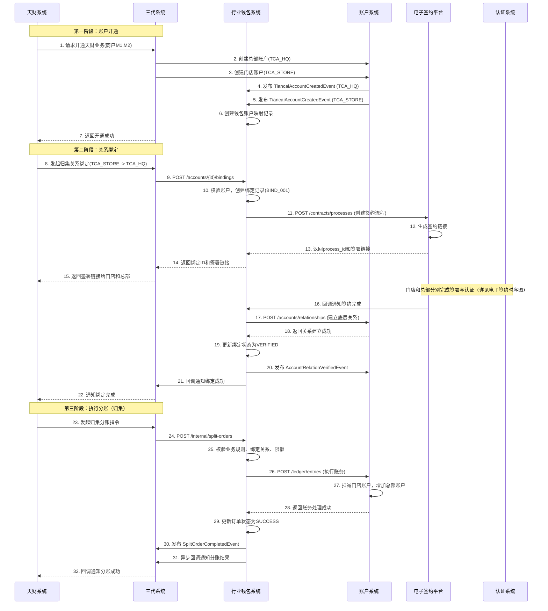
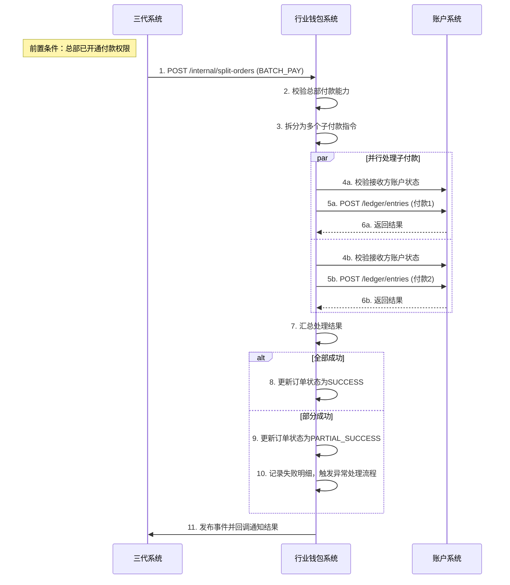

# 模块设计: 行业钱包系统

生成时间: 2026-01-19 15:33:50

---

# 模块设计: 行业钱包系统

生成时间: 2026-01-19

---

# 行业钱包系统模块设计文档

## 1. 概述

### 1.1 目的
行业钱包系统是“天财分账业务”的**核心业务逻辑处理引擎**。它作为连接业务入口（三代系统）、底层账户（账户系统）和法律流程（电子签约平台）的枢纽，负责处理天财专用账户的开通、关系绑定、分账指令执行等核心业务流程。本模块旨在为天财提供一套安全、高效、可扩展的资金分账解决方案，支撑归集、批量付款、会员结算三大核心场景。

### 1.2 范围
- **天财账户开通协调**：接收账户创建事件，协调完成天财专用账户在钱包层的初始化与状态同步。
- **关系绑定流程驱动**：作为关系绑定的发起方和协调者，调用电子签约平台完成协议签署与身份认证，并将结果同步至账户系统。
- **分账指令处理**：接收并处理来自三代系统的分账指令，执行严格的业务规则校验、账户关系验证、账务指令生成与执行。
- **业务场景适配**：针对归集、批量付款、会员结算三种不同场景，定制化处理流程与校验规则。
- **状态管理与对账**：维护分账订单的生命周期状态，提供查询接口，并与对账单系统协同确保账务一致性。
- **异常处理与补偿**：设计健壮的重试、冲正、人工干预机制，保障资金安全与业务连续性。

## 2. 接口设计

### 2.1 API端点 (RESTful)

#### 2.1.1 账户与关系管理接口
- **POST /api/v1/tiancai/accounts/{tiancai_account_id}/bindings**
    - **描述**：发起账户关系绑定流程（如总部与门店的归集关系）。此接口将调用电子签约平台创建签约流程。
    - **路径参数**：
        - `tiancai_account_id`: 付方天财账户ID
    - **请求体**：
      ```json
      {
        "request_id": "bind_req_20231011001",
        "biz_scene": "COLLECTION", // COLLECTION(归集)/BATCH_PAY(批量付款)/MEMBER_SETTLE(会员结算)
        "to_account_id": "TCA_20231011002", // 收方天财账户ID（批量付款时为列表）
        "to_account_ids": ["TCA_RECV_001", "TCA_RECV_002"], // 批量付款场景下收方账户ID列表
        "contract_variables": { // 协议变量
          "effective_date": "2023-11-01",
          "expiry_date": "2024-10-31",
          "daily_limit": "100000.00"
        },
        "operator": "admin_user", // 操作员
        "callback_url": "https://g3.example.com/callback/binding" // 绑定结果回调地址（通知三代系统）
      }
      ```
    - **响应体**：
      ```json
      {
        "code": "SUCCESS",
        "message": "关系绑定流程已发起",
        "data": {
          "binding_id": "BIND_202310110001", // 钱包系统生成的关系绑定流水号
          "process_id": "proc_9k2jhs83la5", // 电子签约平台返回的流程ID
          "status": "SIGNING", // 状态：SIGNING(签约中)/VERIFYING(认证中)/COMPLETED/FAILED
          "sign_urls": [ // 签约链接（按参与方）
            {
              "party_role": "PAYER",
              "party_name": "北京天财科技有限公司",
              "sign_url": "https://h5.e-sign.com/contract?token=eyJhbGciOi..."
            }
          ]
        }
      }
      ```

- **POST /api/v1/tiancai/accounts/{tiancai_account_id}/open-payment**
    - **描述**：为总部开通“付款”权限（用于批量付款和会员结算场景）。此流程仅涉及总部单方签署《代付授权协议》并进行对公认证。
    - **请求体**：
      ```json
      {
        "request_id": "open_pay_req_001",
        "operator": "admin_user",
        "callback_url": "https://g3.example.com/callback/open-payment"
      }
      ```
    - **响应体**：返回开通流程ID及状态。

#### 2.1.2 分账指令处理接口（内部）
- **POST /api/internal/tiancai/split-orders**
    - **描述**：由三代系统调用，处理分账指令。此接口执行核心业务逻辑。
    - **认证**：内部服务间认证（API Key + IP白名单）。
    - **请求体**：
      ```json
      {
        "request_id": "g3_req_20231011001", // 三代请求ID
        "split_order_id": "SO_202310110001", // 三代分账订单号
        "biz_scene": "COLLECTION",
        "payer": {
          "tiancai_account_id": "TCA_20231011001",
          "merchant_no": "M100001"
        },
        "payee_list": [
          {
            "tiancai_account_id": "TCA_20231011002",
            "merchant_no": "M100002",
            "amount": 10000,
            "currency": "CNY",
            "memo": "门店日结归集"
          }
        ],
        "total_amount": 10000,
        "biz_ref_no": "TC_ORDER_001", // 天财业务参考号
        "ext_info": {}
      }
      ```
    - **响应体**：
      ```json
      {
        "code": "SUCCESS",
        "message": "分账指令处理中",
        "data": {
          "wallet_order_id": "WO_202310110001", // 钱包系统分账订单号
          "status": "PROCESSING",
          "estimated_completion_time": 30 // 预计完成秒数
        }
      }
      ```

#### 2.1.3 查询接口
- **GET /api/v1/tiancai/split-orders/{wallet_order_id}**
    - **描述**：查询分账订单详情及处理状态。
    - **响应体**：
      ```json
      {
        "code": "SUCCESS",
        "data": {
          "wallet_order_id": "WO_202310110001",
          "split_order_id": "SO_202310110001",
          "biz_scene": "COLLECTION",
          "status": "SUCCESS", // INIT, PROCESSING, SUCCESS, PARTIAL_SUCCESS, FAILED, REVERSED
          "payer_account_id": "TCA_20231011001",
          "total_amount": 10000,
          "currency": "CNY",
          "details": [
            {
              "payee_account_id": "TCA_20231011002",
              "amount": 10000,
              "status": "SUCCESS",
              "ledger_entry_no": "LE_202310110001", // 账务流水号
              "completed_at": "2023-10-11T10:05:00Z"
            }
          ],
          "created_at": "2023-10-11T10:00:00Z",
          "completed_at": "2023-10-11T10:05:00Z"
        }
      }
      ```

- **GET /api/v1/tiancai/accounts/{tiancai_account_id}/bindings**
    - **描述**：查询账户的绑定关系列表。
- **GET /api/v1/tiancai/bindings/{binding_id}**
    - **描述**：查询特定关系绑定的详情及进度。

#### 2.1.4 回调接口（供电子签约平台调用）
- **POST /api/internal/callback/esign**
    - **描述**：接收电子签约平台的签约结果回调。
    - **请求体**：
      ```json
      {
        "event_type": "CONTRACT_PROCESS_COMPLETED", // 或 FAILED
        "process_id": "proc_9k2jhs83la5",
        "biz_reference_no": "BIND_202310110001", // 即钱包系统的binding_id
        "status": "COMPLETED",
        "contract_document": {
          "document_id": "doc_7s82kja93n2",
          "hash": "a1b2c3d4e5f6..."
        },
        "completion_time": "2023-10-11T10:25:00Z",
        "failure_reason": ""
      }
      ```
    - **响应体**：返回成功接收确认。

### 2.2 发布/消费的事件

#### 2.2.1 消费的事件
1. **TiancaiAccountCreatedEvent** (来自账户系统)
    - **Topic**: `account.events.tiancai.created`
    - **处理逻辑**：接收天财专用账户创建成功事件，在钱包系统创建对应的账户映射记录，初始化状态。
2. **AccountBalanceChangedEvent** (来自账户系统)
    - **Topic**: `account.events.balance.changed`
    - **处理逻辑**：监听关键账户（如天财收款账户）的余额变动，用于监控和风控。
3. **MerchantCreatedEvent** (来自三代系统，可选)
    - **Topic**: `g3.events.merchant.created`
    - **处理逻辑**：感知新商户创建，为后续可能的自动开通天财业务做准备。

#### 2.2.2 发布的事件
1. **AccountRelationVerifiedEvent** (账户关系已验证)
    - **Topic**: `wallet.events.relation.verified`
    - **触发时机**：关系绑定流程（签约+认证）全部完成，且钱包系统已将该关系同步至账户系统后。
    - **Payload**:
    ```json
    {
      "event_id": "evt_wallet_001",
      "event_type": "ACCOUNT_RELATION_VERIFIED",
      "timestamp": "2023-10-11T10:30:00Z",
      "data": {
        "binding_id": "BIND_202310110001",
        "relation_type": "COLLECTION",
        "from_account_id": "TCA_20231011001",
        "to_account_id": "TCA_20231011002",
        "contract_id": "doc_7s82kja93n2",
        "effective_time": "2023-11-01T00:00:00Z",
        "expire_time": "2024-10-31T23:59:59Z"
      }
    }
    ```
2. **SplitOrderCompletedEvent** (分账订单已完成)
    - **Topic**: `wallet.events.split_order.completed`
    - **触发时机**：分账订单（包括批量付款中的子订单）处理完成（成功或失败）。
    - **Payload**:
    ```json
    {
      "event_id": "evt_wallet_002",
      "event_type": "SPLIT_ORDER_COMPLETED",
      "timestamp": "2023-10-11T10:05:00Z",
      "data": {
        "wallet_order_id": "WO_202310110001",
        "split_order_id": "SO_202310110001",
        "biz_scene": "COLLECTION",
        "status": "SUCCESS",
        "total_amount": 10000,
        "details": [...],
        "completed_at": "2023-10-11T10:05:00Z"
      }
    }
    ```
3. **PaymentOpenedEvent** (付款权限已开通)
    - **Topic**: `wallet.events.payment.opened`
    - **触发时机**：总部成功开通付款权限（完成《代付授权协议》签署与认证）。
    - **Payload**:
    ```json
    {
      "event_id": "evt_wallet_003",
      "event_type": "PAYMENT_OPENED",
      "timestamp": "2023-10-11T09:30:00Z",
      "data": {
        "tiancai_account_id": "TCA_HQ_001",
        "merchant_no": "M100001",
        "contract_id": "doc_xxxx",
        "opened_at": "2023-10-11T09:30:00Z"
      }
    }
    ```

## 3. 数据模型

### 3.1 核心表设计

#### 表：`tiancai_wallet_account` (钱包账户映射表)
| 字段名 | 类型 | 必填 | 默认值 | 描述 |
| :--- | :--- | :--- | :--- | :--- |
| `id` | bigint | Y | AUTO_INCREMENT | 主键 |
| `tiancai_account_id` | varchar(32) | Y | | **天财账户ID**，关联账户系统，唯一索引 `uk_tc_account_id` |
| `merchant_no` | varchar(32) | Y | | 收单商户号 |
| `account_role` | varchar(20) | Y | | 角色：`HEADQUARTERS`/`STORE`/`RECEIVER` |
| `account_type` | varchar(20) | Y | | 类型：`TIANCAI_RECEIVE`/`TIANCAI_RECEIVER` |
| `wallet_status` | varchar(20) | Y | `ACTIVE` | 钱包层状态：`ACTIVE`/`FROZEN`/`CLOSED` |
| `payment_capability` | varchar(20) | Y | `CLOSED` | 付款能力：`CLOSED`/`OPENED`，仅总部收款账户有效 |
| `payment_open_contract_id` | varchar(64) | N | | 开通付款的协议ID |
| `payment_opened_at` | datetime | N | | 开通付款时间 |
| `created_at` | datetime | Y | CURRENT_TIMESTAMP | |
| `updated_at` | datetime | Y | CURRENT_TIMESTAMP ON UPDATE | |

#### 表：`account_binding` (账户关系绑定表)
| 字段名 | 类型 | 必填 | 默认值 | 描述 |
| :--- | :--- | :--- | :--- | :--- |
| `id` | bigint | Y | AUTO_INCREMENT | 主键 |
| `binding_id` | varchar(32) | Y | | **绑定流水号**，唯一索引 `uk_binding_id` |
| `relation_type` | varchar(30) | Y | | 关系类型：`COLLECTION`/`BATCH_PAY`/`MEMBER_SETTLE` |
| `from_account_id` | varchar(32) | Y | | 付方天财账户ID，索引 `idx_from_account` |
| `to_account_id` | varchar(32) | Y | | 收方天财账户ID（批量付款时存首个），索引 `idx_to_account` |
| `to_account_ids_json` | json | N | | **批量付款场景**下所有收方账户ID列表 |
| `contract_id` | varchar(64) | Y | | 电子签约协议ID |
| `contract_document_url` | varchar(512) | N | | 协议文件下载地址 |
| `auth_status` | varchar(20) | Y | `PENDING` | 认证状态：`PENDING`/`SIGNING`/`VERIFYING`/`VERIFIED`/`EXPIRED`/`FAILED` |
| `effective_time` | datetime | Y | | 生效时间 |
| `expire_time` | datetime | N | | 过期时间 |
| `daily_limit` | decimal(15,2) | N | | 日限额 |
| `single_limit` | decimal(15,2) | N | | 单笔限额 |
| `process_id` | varchar(32) | N | | 电子签约流程ID |
| `callback_url` | varchar(512) | Y | | 结果回调地址（通知三代） |
| `created_at` | datetime | Y | CURRENT_TIMESTAMP | |
| `updated_at` | datetime | Y | CURRENT_TIMESTAMP ON UPDATE | |

#### 表：`tiancai_split_order` (钱包分账订单表)
| 字段名 | 类型 | 必填 | 默认值 | 描述 |
| :--- | :--- | :--- | :--- | :--- |
| `id` | bigint | Y | AUTO_INCREMENT | 主键 |
| `wallet_order_id` | varchar(32) | Y | | **钱包订单号**，唯一索引 `uk_wallet_order_id` |
| `split_order_id` | varchar(32) | Y | | 三代分账订单号，索引 `idx_split_order_id` |
| `request_id` | varchar(64) | Y | | 三代请求ID，用于幂等 |
| `biz_scene` | varchar(20) | Y | | 业务场景：`COLLECTION`/`BATCH_PAY`/`MEMBER_SETTLE` |
| `payer_account_id` | varchar(32) | Y | | 付方天财账户ID |
| `total_amount` | decimal(15,2) | Y | | 总分账金额 |
| `currency` | varchar(3) | Y | `CNY` | 币种 |
| `status` | varchar(20) | Y | `INIT` | 订单状态：`INIT`/`PROCESSING`/`SUCCESS`/`PARTIAL_SUCCESS`/`FAILED`/`REVERSED` |
| `biz_ref_no` | varchar(64) | N | | 天财业务参考号 |
| `relation_binding_id` | varchar(32) | N | | 关联的关系绑定ID（用于归集、会员结算） |
| `batch_details_json` | json | N | | **批量付款场景**下存储付款明细（账户、金额、备注） |
| `ledger_entries_json` | json | N | | 账务流水号列表（关联账户系统） |
| `error_code` | varchar(50) | N | | 错误码 |
| `error_message` | varchar(500) | N | | 错误信息 |
| `completed_at` | datetime | N | | 完成时间 |
| `created_at` | datetime | Y | CURRENT_TIMESTAMP | |
| `updated_at` | datetime | Y | CURRENT_TIMESTAMP ON UPDATE | |

#### 表：`split_order_detail` (分账订单明细表)
| 字段名 | 类型 | 必填 | 默认值 | 描述 |
| :--- | :--- | :--- | :--- | :--- |
| `id` | bigint | Y | AUTO_INCREMENT | 主键 |
| `wallet_order_id` | varchar(32) | Y | | 关联钱包订单号，索引 `idx_wallet_order_id` |
| `payee_account_id` | varchar(32) | Y | | 收方天财账户ID |
| `amount` | decimal(15,2) | Y | | 分账金额 |
| `currency` | varchar(3) | Y | `CNY` | 币种 |
| `status` | varchar(20) | Y | `INIT` | 状态：`INIT`/`SUCCESS`/`FAILED` |
| `ledger_entry_no` | varchar(32) | N | | 账务流水号 |
| `memo` | varchar(200) | N | | 备注 |
| `error_code` | varchar(50) | N | | 错误码 |
| `completed_at` | datetime | N | | 完成时间 |
| `created_at` | datetime | Y | CURRENT_TIMESTAMP | |

### 3.2 与其他模块的关系
- **账户系统**：
  - 通过`tiancai_account_id`关联`tiancai_account`表。
  - 关系绑定完成后，调用账户系统接口建立底层关系记录。
  - 执行分账时，调用账户系统接口进行账务处理。
- **三代系统**：
  - 通过`split_order_id`关联`tiancai_split_order`表。
  - 通过`callback_url`回调通知三代系统绑定或分账结果。
- **电子签约平台**：
  - 通过`process_id`关联`contract_process`表。
  - 通过`contract_id`关联最终协议文件。
- **对账单系统**：通过监听`SplitOrderCompletedEvent`和账户系统的`AccountBalanceChangedEvent`，生成业务对账单。

## 4. 业务逻辑

### 4.1 核心算法与规则

#### 4.1.1 关系绑定流程驱动算法
```python
def initiate_binding(from_account_id, to_account_id, biz_scene, contract_vars):
    """
    发起关系绑定流程
    1. 校验双方账户存在、状态正常、角色符合场景
    2. 检查是否已存在有效绑定（防重复）
    3. 调用电子签约平台创建签约流程
    4. 记录绑定流程状态，返回签约链接
    """
    # 1. 账户校验
    payer_acc = get_wallet_account(from_account_id)
    payee_acc = get_wallet_account(to_account_id)
    
    validate_accounts_for_binding(payer_acc, payee_acc, biz_scene)
    
    # 2. 重复绑定校验
    existing = find_active_binding(from_account_id, to_account_id, biz_scene)
    if existing:
        return existing.binding_id, existing.sign_urls
    
    # 3. 调用电子签约
    esign_request = build_esign_request(payer_acc, payee_acc, biz_scene, contract_vars)
    esign_response = call_esign_platform(esign_request)
    
    # 4. 创建绑定记录
    binding = create_binding_record(
        from_account_id, to_account_id, biz_scene,
        esign_response.process_id, contract_vars
    )
    
    return binding.binding_id, esign_response.sign_urls
```

#### 4.1.2 分账指令处理状态机
```python
class SplitOrderProcessor:
    
    def process_order(self, wallet_order_id):
        order = get_order(wallet_order_id)
        
        if order.status != 'INIT':
            return  # 幂等处理
        
        order.update_status('PROCESSING')
        
        try:
            # 1. 业务规则校验
            self.validate_business_rules(order)
            
            # 2. 账户关系校验（归集/会员结算需检查绑定关系）
            if order.biz_scene in ['COLLECTION', 'MEMBER_SETTLE']:
                binding = validate_binding_exists(
                    order.payer_account_id, 
                    order.get_payee_account_id(),  # 首个收方
                    order.biz_scene
                )
                order.relation_binding_id = binding.binding_id
            
            # 3. 付款权限校验（批量付款/会员结算需检查总部开通状态）
            if order.biz_scene in ['BATCH_PAY', 'MEMBER_SETTLE']:
                validate_payment_capability(order.payer_account_id)
            
            # 4. 限额校验
            validate_limits(order.payer_account_id, order.total_amount, order.biz_scene)
            
            # 5. 调用账户系统执行账务
            ledger_results = self.execute_ledger_entries(order)
            
            # 6. 更新订单状态
            self.update_order_status(order, ledger_results)
            
            # 7. 发布完成事件
            publish_split_order_completed_event(order)
            
        except BusinessException as e:
            order.update_status('FAILED', e.code, e.message)
            publish_split_order_completed_event(order)
            raise
        except Exception as e:
            order.update_status('FAILED', 'SYSTEM_ERROR', str(e))
            # 触发告警，需人工介入
            raise
```

#### 4.1.3 批量付款拆分与执行算法
```python
def process_batch_payment(order):
    """
    处理批量付款场景
    1. 拆分为多个子分账指令
    2. 并行执行（控制并发）
    3. 汇总结果，部分成功时支持冲正或人工处理
    """
    payee_list = order.batch_details_json  # 从JSON解析出收款方列表
    
    # 1. 创建子订单明细
    details = create_order_details(order.wallet_order_id, payee_list)
    
    # 2. 并发执行（限制并发数，如10个）
    semaphore = Semaphore(10)
    results = []
    
    with ThreadPoolExecutor() as executor:
        futures = []
        for detail in details:
            future = executor.submit(
                process_single_payment,
                order.payer_account_id,
                detail,
                semaphore
            )
            futures.append(future)
        
        for future in as_completed(futures):
            results.append(future.result())
    
    # 3. 汇总结果
    success_count = sum(1 for r in results if r['status'] == 'SUCCESS')
    failed_count = len(results) - success_count
    
    if failed_count == 0:
        order_status = 'SUCCESS'
    elif success_count == 0:
        order_status = 'FAILED'
    else:
        order_status = 'PARTIAL_SUCCESS'
        # 记录失败明细，触发人工对账或自动冲正流程
    
    return order_status, results
```

### 4.2 业务规则

1. **场景与角色匹配规则**：
   - **归集(COLLECTION)**：付方必须是`STORE`(门店)，收方必须是`HEADQUARTERS`(总部)。
   - **批量付款(BATCH_PAY)**：付方必须是`HEADQUARTERS`(总部)且已开通付款权限，收方必须是`RECEIVER`(接收方)。
   - **会员结算(MEMBER_SETTLE)**：付方必须是`HEADQUARTERS`(总部)且已开通付款权限，收方必须是`STORE`(门店)。

2. **关系绑定前置要求**：
   - 归集、会员结算场景：分账前必须完成对应账户间的绑定与认证。
   - 批量付款场景：总部必须完成“开通付款”流程（签署《代付授权协议》+对公认证），但无需与每个接收方单独绑定。

3. **限额控制规则**：
   - **单笔限额**：基于绑定关系中的`single_limit`字段控制。
   - **日累计限额**：基于绑定关系中的`daily_limit`字段控制，按付方账户和关系类型维度统计。
   - **系统级限额**：配置系统级默认限额，防止未设置限额时无限制转账。

4. **幂等性规则**：
   - 所有接口支持基于`request_id`的幂等。
   - 分账指令基于`biz_ref_no`（天财侧）+ `payer_account_id` 保证业务幂等。

5. **时效性规则**：
   - 关系绑定签约链接有效期24小时。
   - 分账指令处理超时时间30分钟，超时后标记为`PROCESSING_TIMEOUT`，触发人工核查。

### 4.3 验证逻辑

#### 4.3.1 分账指令预处理校验
```python
def pre_validate_split_order(order_request):
    """
    分账指令预处理校验（在接收请求时执行）
    """
    errors = []
    
    # 1. 基础校验
    if not order_request.payer or not order_request.payee_list:
        errors.append("付方或收方列表不能为空")
    
    if order_request.total_amount <= 0:
        errors.append("分账金额必须大于0")
    
    # 2. 金额一致性校验
    detail_sum = sum(p['amount'] for p in order_request.payee_list)
    if detail_sum != order_request.total_amount:
        errors.append(f"明细金额之和{detail_sum}与总金额{order_request.total_amount}不符")
    
    # 3. 场景与账户角色校验
    payer_acc = get_account(order_request.payer.tiancai_account_id)
    
    if order_request.biz_scene == 'COLLECTION':
        if payer_acc.account_role != 'STORE':
            errors.append("归集场景付方必须是门店")
        for payee in order_request.payee_list:
            payee_acc = get_account(payee.tiancai_account_id)
            if payee_acc.account_role != 'HEADQUARTERS':
                errors.append("归集场景收方必须是总部")
    
    # 4. 付款能力校验（批量付款/会员结算）
    if order_request.biz_scene in ['BATCH_PAY', 'MEMBER_SETTLE']:
        if payer_acc.payment_capability != 'OPENED':
            errors.append("付方未开通付款权限")
    
    # 5. 幂等校验
    existing = find_order_by_request_id(order_request.request_id)
    if existing:
        return existing  # 返回已存在的订单
    
    if errors:
        raise ValidationError("; ".join(errors))
    
    return None
```

#### 4.3.2 账户关系有效性校验
```python
def validate_binding_for_split(payer_id, payee_id, biz_scene, amount):
    """
    校验分账所需的账户关系是否有效
    """
    # 1. 查询有效绑定关系
    binding = find_active_binding(payer_id, payee_id, biz_scene)
    if not binding:
        raise BusinessError("账户间未建立有效的分账授权关系")
    
    # 2. 检查绑定状态
    if binding.auth_status != 'VERIFIED':
        raise BusinessError(f"绑定关系状态异常: {binding.auth_status}")
    
    # 3. 检查有效期
    now = datetime.now()
    if binding.effective_time > now:
        raise BusinessError("绑定关系尚未生效")
    if binding.expire_time and binding.expire_time < now:
        raise BusinessError("绑定关系已过期")
    
    # 4. 检查限额
    if binding.single_limit and amount > binding.single_limit:
        raise BusinessError(f"单笔金额{amount}超过限额{binding.single_limit}")
    
    # 检查日限额
    daily_used = get_daily_used_amount(payer_id, payee_id, biz_scene)
    if binding.daily_limit and (daily_used + amount) > binding.daily_limit:
        raise BusinessError(f"日累计金额将超过限额{binding.daily_limit}")
    
    return binding
```

## 5. 时序图

### 5.1 归集场景完整流程（开户→绑定→分账）


### 5.2 批量付款场景分账流程


## 6. 错误处理

### 6.1 预期错误码列表
| 错误码 | HTTP状态码 | 描述 | 处理策略 |
| :--- | :--- | :--- | :--- |
| `WALLET_ACCOUNT_NOT_FOUND` | 404 | 天财账户在钱包系统中不存在 | 检查账户ID，或等待账户创建事件同步 |
| `WALLET_ACCOUNT_INACTIVE` | 423 | 钱包账户状态非ACTIVE | 检查账户状态，需解冻或重新开通 |
| `PAYMENT_CAPABILITY_CLOSED` | 403 | 付款权限未开通 | 引导完成开通付款流程 |
| `BINDING_NOT_FOUND` | 404 | 绑定关系不存在 | 检查账户间是否已完成绑定 |
| `BINDING_NOT_VERIFIED` | 403 | 绑定关系未完成认证 | 等待或重新发起绑定流程 |
| `BINDING_EXPIRED` | 403 | 绑定关系已过期 | 重新发起绑定流程 |
| `DAILY_LIMIT_EXCEEDED` | 429 | 超过日累计限额 | 提示限额，次日重试或调整限额 |
| `SINGLE_LIMIT_EXCEEDED` | 400 | 超过单笔限额 | 拆分金额或调整限额 |
| `INSUFFICIENT_BALANCE` | 422 | 付方账户余额不足 | 提示充值或减少金额 |
| `BATCH_PARTIAL_FAILURE` | 207 | 批量付款部分失败 | 返回详细结果，失败项需人工处理 |
| `DUPLICATE_REQUEST` | 409 | 重复请求 | 返回已受理的订单信息 |
| `SCENE_ROLE_MISMATCH` | 400 | 业务场景与账户角色不匹配 | 检查场景配置和账户角色 |
| `ESIGN_SERVICE_UNAVAILABLE` | 503 | 电子签约服务不可用 | 自动重试，超时后标记为失败 |
| `ACCOUNT_SERVICE_UNAVAILABLE` | 503 | 账户服务不可用 | 自动重试，关键操作需保证最终一致性 |

### 6.2 处理策略
1. **业务校验错误 (4xx)**：
   - 立即返回错误，不进行重试。
   - 提供清晰的错误信息，指导调用方修正。
   - 记录错误日志用于业务分析。

2. **依赖服务错误 (5xx)**：
   - **电子签约平台失败**：关系绑定流程中，重试创建签约流程（最多3次），最终失败则标记绑定流程为失败。
   - **账户系统失败**：
     - 账务操作失败：基于`biz_trade_no`幂等重试（最多5次，指数退避）。
     - 关键操作（如关系建立）失败：记录异常状态，触发人工干预流程。
   - **三代系统回调失败**：异步重试队列（1, 5, 15, 30, 60分钟），最多5次，最终失败记录日志并告警。

3. **部分成功处理（批量付款）**：
   - 记录每个子付款的详细结果。
   - 整体订单状态标记为`PARTIAL_SUCCESS`。
   - 提供查询接口获取失败明细。
   - 触发异常处理工作流，支持人工冲正或重新发起失败项。

4. **超时与悬挂订单处理**：
   - 定时任务扫描`PROCESSING`状态超时（>30分钟）的订单。
   - 查询账户系统确认实际账务状态。
   - 根据实际情况更新订单状态（成功/失败/悬挂需人工处理）。
   - 发布相应事件通知相关系统。

5. **监控与告警**：
   - 关键指标监控：订单处理成功率、平均耗时、各场景交易量、失败率。
   - 错误类型监控：针对高频错误进行优化。
   - 依赖服务健康度监控：账户系统、电子签约平台可用性。
   - 设置告警：失败率突增、处理延迟、悬挂订单累积。

## 7. 依赖说明

### 7.1 上游依赖（调用行业钱包系统）

| 依赖系统 | 交互场景 | 接口方式 | 关键要求与注意事项 |
| :--- | :--- | :--- | :--- |
| **三代系统** | 1. 发起关系绑定<br>2. 发起分账指令<br>3. 查询订单状态 | 同步REST API | 1. 需严格校验请求参数与业务规则<br>2. 分账指令处理异步化，需提供回调机制<br>3. 支持幂等，防止重复处理 |
| **电子签约平台** | 1. 接收签约结果回调<br>2. 查询签约流程状态 | Webhook回调 + 同步查询API | 1. 验证回调签名，确保来源可信<br>2. 处理签约超时和失败场景<br>3. 签约成功后方可进行关系同步 |
| **账户系统** | 1. 消费账户创建事件<br>2. 建立底层账户关系<br>3. 执行账务操作<br>4. 查询账户状态 | 异步事件 + 同步REST API | 1. 账务操作必须保证幂等和事务性<br>2. 关系建立是分账的前置条件<br>3. 余额查询用于风控和校验 |

### 7.2 下游依赖（行业钱包系统调用）

| 依赖系统 | 交互场景 | 接口方式 | 关键要求与注意事项 |
| :--- | :--- | :--- | :--- |
| **账户系统** | 1. 同步账户关系<br>2. 执行分账账务<br>3. 查询账户信息 | 同步REST API | 1. 关键操作需有重试和补偿机制<br>2. 关注响应时间，超时需有降级策略<br>3. 账务流水号需妥善记录，用于对账 |
| **电子签约平台** | 1. 创建签约流程<br>2. 查询签约状态 | 同步REST API | 1. 签约流程变量需准确传递<br>2. 处理签约链接过期和用户取消场景<br>3. 签约结果需与本地绑定记录强一致 |
| **消息队列 (Kafka)** | 发布领域事件 | 异步发布 | 1. 事件格式需保持版本兼容<br>2. 保证关键事件至少投递一次<br>3. 事件发布在本地事务完成后进行 |

### 7.3 集成设计原则
1. **异步解耦**：
   - 与三代系统：分账指令处理异步化，通过回调通知结果。
   - 与电子签约平台：签约流程异步执行，通过事件和回调驱动状态流转。
   - 事件驱动：关键状态变更通过事件通知相关系统，降低直接耦合。

2. **幂等与一致性**：
   - 所有写操作（创建绑定、分账）必须支持幂等。
   - 本地状态更新与外部调用在事务中完成，或通过补偿机制保证最终一致性。
   - 分账指令的账务操作必须保证原子性。

3. **容错与降级**：
   - 依赖服务不可用时，应有明确的降级策略（如返回“处理中”状态）。
   - 实现熔断机制，防止级联故障。
   - 关键路径有备用方案（如账户系统短暂不可用时，可基于本地缓存进行基础校验）。

4. **可观测性**：
   - 全链路日志追踪，便于问题定位。
   - 关键业务指标监控（成功率、耗时、限额使用率等）。
   - 提供丰富的查询接口，支持运营和客服查询业务状态。

5. **扩展性**：
   - 支持水平扩展，应对交易高峰。
   - 业务规则可配置化，便于支持新的分账场景。
   - 账户关系模型设计灵活，支持未来可能的多对多关系。