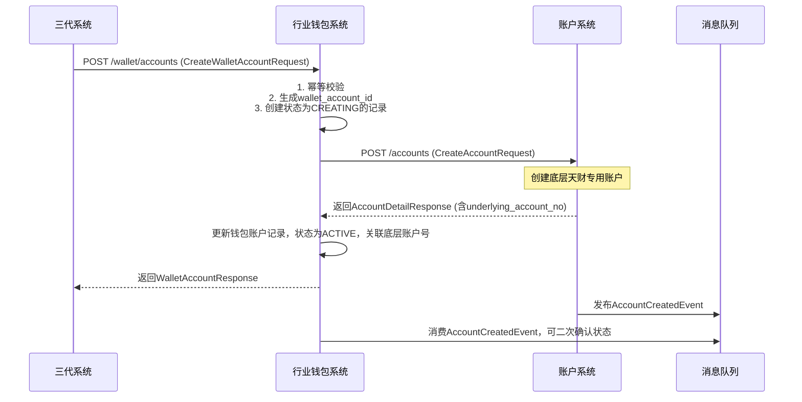
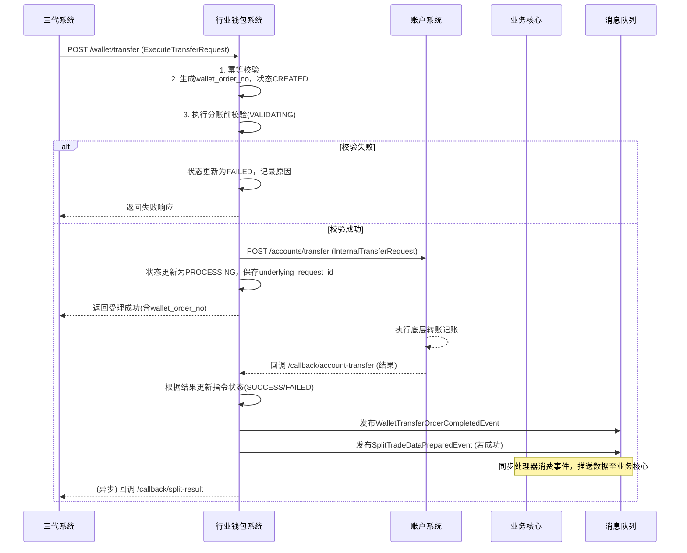
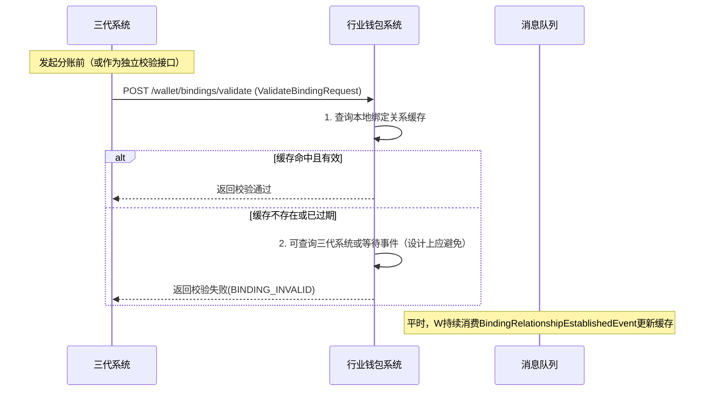

# 模块设计: 行业钱包系统

生成时间: 2026-01-19 14:48:15

---

# 模块设计: 行业钱包系统

生成时间: 2026-01-19 15:00:00

---

# 行业钱包系统模块设计文档

## 1. 概述

### 1.1 目的
本模块是“天财商龙”分账业务的**核心资金处理与业务逻辑中枢**。它作为三代系统与底层账户系统之间的桥梁，负责管理钱包层级的业务实体（账户、关系、分账指令），执行复杂的业务校验与流程编排，并最终驱动底层账户完成资金划转。其核心价值在于封装了天财业务特有的分账规则、状态管理和数据一致性保障。

### 1.2 范围
- **钱包账户管理**：接收三代系统指令，为天财商户开立并管理钱包层级的账户模型，并与底层账户系统（账户系统）的实体进行关联映射。
- **关系绑定校验**：在分账指令执行前，对三代系统发起的绑定关系进行最终的业务逻辑校验，确保付方与收方的关系合法、有效且具备分账权限。
- **分账指令处理**：接收三代系统的分账请求（归集、批量付款、会员结算），执行钱包层级的业务校验、状态流转，并调用账户系统完成资金划转。
- **数据同步**：将分账交易的核心数据同步至业务核心，确保交易流水完整；并响应三代系统的各类查询请求。
- **状态机管理**：维护分账指令在钱包层的完整状态流转，确保业务过程可追溯、可监控。

### 1.3 非范围
- 商户进件、协议签署与身份认证流程编排（由三代系统处理）。
- 底层账户的物理创建、状态标记与原子化记账操作（由账户系统处理）。
- 电子协议的生成、签署与认证服务执行（由电子签约平台处理）。
- 交易资金的清算、结算与计费（由清结算系统、计费中台处理）。
- 对账单的最终生成与提供（由对账单系统处理）。

## 2. 接口设计

### 2.1 REST API 端点（供三代系统调用）

#### 2.1.1 账户管理
- **POST /api/v1/wallet/accounts**：创建天财专用钱包账户
    - **请求体**：`CreateWalletAccountRequest`
    - **响应**：`WalletAccountResponse`
- **GET /api/v1/wallet/accounts/{walletAccountId}**：查询钱包账户详情
    - **响应**：`WalletAccountDetailResponse`
- **GET /api/v1/wallet/accounts/by-merchant/{merchantNo}**：查询商户名下所有钱包账户
    - **响应**：`List<WalletAccountSimpleResponse>`

#### 2.1.2 关系绑定校验
- **POST /api/v1/wallet/bindings/validate**：校验绑定关系有效性（分账前置调用）
    - **请求体**：`ValidateBindingRequest`
    - **响应**：`ValidateBindingResponse`

#### 2.1.3 分账指令执行
- **POST /api/v1/wallet/transfer**：执行分账（资金划转）
    - **请求体**：`ExecuteTransferRequest`
    - **响应**：`ExecuteTransferResponse` (返回钱包侧指令号，结果异步回调)
- **GET /api/v1/wallet/transfer-orders/{walletOrderNo}**：查询分账指令状态
    - **响应**：`WalletTransferOrderDetailResponse`
- **POST /api/v1/wallet/transfer-orders/{walletOrderNo}/query**：主动向下游（账户系统）查询指令状态（用于补偿）
    - **响应**：`BaseResponse`

#### 2.1.4 数据同步
- **POST /api/v1/wallet/sync/split-trade**：同步分账交易数据至业务核心（内部接口，可由业务核心或定时任务触发）
    - **请求体**：`SyncSplitTradeRequest`
    - **响应**：`BaseResponse`

### 2.2 内部接口（供下游系统回调/供本系统调用下游）

- **POST /internal/api/v1/wallet/callback/account-transfer**：账户系统转账结果回调
    - **请求体**：`AccountTransferCallbackRequest`
    - **响应**：`BaseResponse`

### 2.3 数据结构

```json
// CreateWalletAccountRequest (来自三代系统)
{
  "requestId": "WALLET_ACC_REQ_001",
  "merchantNo": "M100001",
  "accountType": "TIANCAI_COLLECT", // COLLECT, RECEIVE
  "accountName": "北京总店天财收款账户",
  "parentMerchantNo": "M100000", // 门店账户时必填
  "settlementMode": "ACTIVE" // 结算模式
}

// WalletAccountResponse
{
  "walletAccountId": "WACC202310270001",
  "merchantNo": "M100001",
  "accountType": "TIANCAI_COLLECT",
  "accountName": "北京总店天财收款账户",
  "underlyingAccountNo": "ACC202310270001", // 底层账户号
  "status": "ACTIVE",
  "createTime": "2023-10-27T10:05:00Z"
}

// ValidateBindingRequest
{
  "requestId": "VALIDATE_BIND_REQ_001",
  "bindingId": "BIND_001",
  "bizType": "COLLECTION",
  "payerWalletAccountId": "WACC_STORE_001",
  "receiverWalletAccountId": "WACC_HQ_001",
  "payerMerchantNo": "M100001",
  "receiverMerchantNo": "M100000"
}

// ExecuteTransferRequest
{
  "requestId": "EXEC_TRANSFER_REQ_001",
  "bizOrderNo": "SPLIT202310270001", // 三代系统分账指令号
  "bizType": "COLLECTION",
  "payerWalletAccountId": "WACC_STORE_001",
  "receiverWalletAccountId": "WACC_HQ_001",
  "amount": "10000.00",
  "currency": "CNY",
  "bindingId": "BIND_001",
  "memo": "2023年10月营业款归集"
}

// AccountTransferCallbackRequest (来自账户系统)
{
  "requestId": "ACC_CALLBACK_001", // 账户系统转账请求的requestId
  "transferStatus": "SUCCESS", // SUCCESS, FAILED
  "walletSystemAccountId": "WACC_STORE_001", // 付方钱包账户ID（用于关联）
  "bizOrderNo": "SPLIT202310270001", // 关联的业务订单号
  "underlyingTransactionNo": "TX202310270001", // 底层流水号
  "failReason": "余额不足",
  "timestamp": "2023-10-27T14:35:00Z"
}
```

### 2.4 发布的事件
行业钱包系统作为事件生产者，发布以下领域事件：

- **WalletTransferOrderCreatedEvent**：钱包分账指令已创建（待执行）。
    ```json
    {
      "eventId": "EVT_WALLET_ORDER_CREATED_001",
      "eventType": "WALLET_TRANSFER_ORDER_CREATED",
      "timestamp": "2023-10-27T14:30:00Z",
      "data": {
        "walletOrderNo": "WTO202310270001",
        "bizOrderNo": "SPLIT202310270001",
        "bizType": "COLLECTION",
        "payerWalletAccountId": "WACC_STORE_001",
        "receiverWalletAccountId": "WACC_HQ_001",
        "amount": "10000.00",
        "status": "CREATED"
      }
    }
    ```
- **WalletTransferOrderCompletedEvent**：钱包分账指令执行完成（成功/失败）。
- **SplitTradeDataPreparedEvent**：分账交易数据已准备就绪，可供业务核心同步。

### 2.5 消费的事件
行业钱包系统作为事件消费者，订阅以下事件以触发或更新业务：

- **BindingRelationshipEstablishedEvent** (来自三代系统)：缓存绑定关系信息，用于后续校验。
- **AccountCreatedEvent** (来自账户系统)：更新本地钱包账户的底层账户号映射及状态。
- **AccountStatusChangedEvent** (来自账户系统)：同步底层账户状态至钱包账户，若账户冻结则可能影响分账。

## 3. 数据模型

### 3.1 核心表设计

#### 表：`wallet_account` (钱包账户表)
| 字段名 | 类型 | 必填 | 描述 | 索引 |
|--------|------|------|------|------|
| id | bigint(20) | Y | 自增主键 | PK |
| wallet_account_id | varchar(32) | Y | 钱包账户ID，全局唯一 | UK |
| merchant_no | varchar(32) | Y | 所属商户号 | IDX |
| account_type | varchar(32) | Y | 账户类型：TIANCAI_COLLECT, TIANCAI_RECEIVE | IDX |
| account_name | varchar(128) | Y | 账户名称 | |
| underlying_account_no | varchar(32) | Y | 底层账户号（账户系统） | UK |
| parent_merchant_no | varchar(32) | N | 上级总部商户号（门店账户时必填） | IDX |
| settlement_mode | varchar(16) | Y | 结算模式：ACTIVE, PASSIVE | |
| status | varchar(16) | Y | 状态：CREATING, ACTIVE, FROZEN, CLOSED | IDX |
| create_time | datetime | Y | 创建时间 | IDX |
| update_time | datetime | Y | 更新时间 | |

#### 表：`wallet_binding_cache` (绑定关系缓存表)
| 字段名 | 类型 | 必填 | 描述 | 索引 |
|--------|------|------|------|------|
| id | bigint(20) | Y | 自增主键 | PK |
| binding_id | varchar(32) | Y | 绑定关系ID | UK |
| biz_type | varchar(32) | Y | 业务类型 | IDX |
| payer_wallet_account_id | varchar(32) | Y | 付方钱包账户ID | IDX |
| receiver_wallet_account_id | varchar(32) | Y | 收方钱包账户ID | IDX |
| status | varchar(16) | Y | 状态：SUCCESS, FAILED, CANCELED | IDX |
| effective_date | date | N | 生效日期 | |
| expiry_date | date | N | 失效日期 | |
| extra_info | json | N | 扩展信息（如归集比例） | |
| last_validated_time | datetime | N | 最后校验时间 | |
| create_time | datetime | Y | 创建时间 | |
| update_time | datetime | Y | 更新时间 | |

#### 表：`wallet_transfer_order` (钱包分账指令表)
| 字段名 | 类型 | 必填 | 描述 | 索引 |
|--------|------|------|------|------|
| id | bigint(20) | Y | 自增主键 | PK |
| wallet_order_no | varchar(32) | Y | 钱包侧分账指令号 | UK |
| biz_order_no | varchar(32) | Y | 三代系统业务订单号 | UK |
| biz_type | varchar(32) | Y | 业务类型 | IDX |
| payer_wallet_account_id | varchar(32) | Y | 付方钱包账户ID | IDX |
| receiver_wallet_account_id | varchar(32) | Y | 收方钱包账户ID | IDX |
| amount | decimal(15,2) | Y | 分账金额 | |
| currency | char(3) | Y | 币种 | |
| binding_id | varchar(32) | Y | 关联的绑定关系ID | IDX |
| status | varchar(16) | Y | 状态：CREATED, VALIDATING, PROCESSING, SUCCESS, FAILED | IDX |
| underlying_request_id | varchar(32) | N | 调用账户系统的请求ID | UK |
| underlying_transaction_no | varchar(32) | N | 底层流水号 | |
| fail_reason | varchar(256) | N | 失败原因 | |
| memo | varchar(256) | N | 备注 | |
| create_time | datetime | Y | 创建时间 | IDX |
| update_time | datetime | Y | 更新时间 | |

#### 表：`split_trade_sync_record` (分账交易同步记录表)
| 字段名 | 类型 | 必填 | 描述 | 索引 |
|--------|------|------|------|------|
| id | bigint(20) | Y | 自增主键 | PK |
| wallet_order_no | varchar(32) | Y | 钱包侧分账指令号 | UK |
| biz_order_no | varchar(32) | Y | 三代系统业务订单号 | IDX |
| sync_status | varchar(16) | Y | 同步状态：PENDING, SUCCESS, FAILED | IDX |
| sync_target | varchar(32) | Y | 同步目标系统：BUSINESS_CORE | |
| retry_count | int(11) | Y | 重试次数 | |
| last_sync_time | datetime | N | 最后同步时间 | |
| fail_reason | varchar(256) | N | 同步失败原因 | |
| create_time | datetime | Y | 创建时间 | |
| update_time | datetime | Y | 更新时间 | |

### 3.2 与其他模块的关系
- **三代系统**：**主要服务调用方**。接收其开户、分账等指令，并异步回调分账结果。两者通过 `biz_order_no` 和 `binding_id` 等字段强关联。
- **账户系统**：**核心下游依赖**。通过同步RPC调用，驱动账户系统完成账户创建和资金划转。通过 `underlying_account_no` 和 `underlying_request_id` 关联。
- **业务核心**：**数据同步下游**。通过异步消息或接口调用，将分账交易数据同步至业务核心，确保交易流水完整。
- **清结算系统**：**配置关联方**。钱包账户的 `settlement_mode` 配置需与清结算系统保持一致，但无直接接口调用。
- **对账单系统**：**间接数据提供方**。通过账户系统发布的动账事件生成明细，本模块不直接交互。
- **电子签约平台**：**无直接交互**。绑定关系信息通过三代系统传递。

## 4. 业务逻辑

### 4.1 核心算法
- **钱包账户ID生成**：`WACC` + `年月日` + `6位序列号` (如 `WACC20231027000001`)。
- **钱包分账指令号生成**：`WTO` + `年月日` + `6位序列号` (如 `WTO20231027000001`)。
- **绑定关系缓存更新策略**：消费 `BindingRelationshipEstablishedEvent` 事件，仅缓存状态为 `SUCCESS` 的关系。定期清理过期和失效的缓存。
- **分账指令状态机**：
    ```
    CREATED -> VALIDATING -> PROCESSING -> SUCCESS
                              |         -> FAILED
                              |-> FAILED (校验失败)
    ```
- **同步重试策略**：向业务核心同步数据失败时，采用指数退避策略重试，最大重试次数可配置（如5次），仍失败则告警人工介入。

### 4.2 业务规则
1. **账户开立规则**：
    - 收到三代系统开户请求后，首先在本地创建 `CREATING` 状态的钱包账户记录。
    - 组装参数调用账户系统创建底层账户，并将返回的 `underlying_account_no` 关联至钱包账户。
    - 若底层账户创建失败，钱包账户状态置为 `CREATING_FAILED`。

2. **分账执行前校验规则（VALIDATING）**：
    - **绑定关系校验**：根据 `binding_id` 查询缓存，确认关系状态为 `SUCCESS` 且在有效期内。
    - **账户状态校验**：付方与收方钱包账户状态必须为 `ACTIVE`，且底层账户状态正常（通过缓存或事件同步得知）。
    - **业务类型校验**：校验付方与收方的账户类型组合是否符合当前 `bizType`（如归集场景，付方应为门店收款账户，收方应为总部收款账户）。
    - **付款权限校验**：对于“批量付款”和“会员结算”，需校验付方商户（总部）是否已开通付款（此信息可从三代系统请求中携带或通过缓存获取）。
    - 任一校验失败，分账指令状态直接转为 `FAILED`。

3. **分账执行规则（PROCESSING）**：
    - 校验通过后，组装 `InternalTransferRequest` 调用账户系统。
    - 必须保存账户系统返回的 `requestId` (`underlying_request_id`)，用于关联回调。
    - 调用账户系统成功后，指令状态转为 `PROCESSING`，等待异步回调。

4. **数据同步规则**：
    - 分账指令成功后 (`SUCCESS`)，生成 `SplitTradeDataPreparedEvent` 事件，并创建 `split_trade_sync_record` 记录。
    - 由独立的同步处理器消费事件，或由定时任务扫描 `PENDING` 记录，调用内部接口将数据推送至业务核心。

### 4.3 验证逻辑
- **开户请求验证**：校验 `requestId` 幂等、商户号是否存在、账户类型是否支持。
- **分账请求验证**：
    - 基础校验：金额>0，币种支持，必要字段齐全。
    - `requestId` 和 `bizOrderNo` 幂等校验，防止重复创建指令。
- **回调验证**：
    - 账户系统回调时，需验证签名（如有）。
    - 根据 `underlying_request_id` 或 `bizOrderNo` 找到对应的 `wallet_transfer_order` 记录，确保状态为 `PROCESSING`，防止重复或错误回调。

## 5. 时序图

### 5.1 天财专用钱包账户开立流程


### 5.2 分账指令执行与回调流程


### 5.3 绑定关系校验流程（分账前置）


## 6. 错误处理

### 6.1 预期错误及HTTP状态码
- **400 Bad Request**：请求参数缺失、格式错误。
- **404 Not Found**：钱包账户或分账指令不存在。
- **409 Conflict**：
    - `DUPLICATE_REQUEST_ID` / `DUPLICATE_BIZ_ORDER_NO`：请求重复。
    - `BINDING_INVALID`：绑定关系无效或过期。
    - `PAYER_PERMISSION_DENIED`：付方无付款权限。
- **422 Unprocessable Entity**：
    - `ACCOUNT_STATUS_INVALID`：付方或收方账户状态异常。
    - `ACCOUNT_TYPE_MISMATCH`：账户类型与业务场景不匹配。
    - `INSUFFICIENT_BALANCE`：付方余额不足（通常由账户系统返回后转换）。
- **502 Bad Gateway**：调用账户系统超时或返回不可用状态。
- **500 Internal Server Error**：系统内部错误。

### 6.2 处理策略
- **同步调用错误**：
    - 调用账户系统开户或转账时，采用有限次数重试（如3次），重试间隔递增。
    - 重试失败后，更新业务状态为失败，并记录详细错误信息。对于开户，钱包账户状态为`CREATING_FAILED`；对于分账，指令状态为`FAILED`。
- **异步回调缺失**：
    - 设置定时任务，扫描长时间处于`PROCESSING`状态的分账指令（如超过5分钟）。
    - 调用账户系统的查询接口（需账户系统提供），或通过`underlying_request_id`主动查询，根据查询结果更新本地状态。
- **数据同步失败**：
    - 同步业务核心失败时，记录于`split_trade_sync_record`，由重试机制处理。
    - 达到最大重试次数后告警，需人工排查业务核心接口或网络问题。
- **状态一致性保障**：
    - 通过消费`AccountStatusChangedEvent`等事件，定期比对钱包账户与底层账户状态，发现不一致时告警。
    - 关键状态变更（如`SUCCESS`）需记录操作日志，便于审计和问题追溯。

## 7. 依赖说明

### 7.1 上游模块交互（调用方）
1. **三代系统**：
    - **调用关系**：**同步RPC调用（HTTP REST）**。
    - **关键接口**：`POST /wallet/accounts`, `POST /wallet/transfer`。
    - **交互要点**：
        - 三代系统是业务的发起方，需携带完整的业务上下文。
        - 本模块需对三代系统的请求做严格幂等和业务校验。
        - 分账执行为异步模式，需立即返回受理结果，并通过回调通知三代系统最终结果。

### 7.2 下游模块交互（被调用方/消费事件）
1. **账户系统**：
    - **调用关系**：**同步RPC调用（HTTP REST）**。
    - **关键接口**：`POST /accounts`, `POST /accounts/transfer`。
    - **交互要点**：
        - 本模块是账户系统的主要调用方之一，调用需保证`requestId`全局唯一。
        - 必须妥善处理账户系统返回的业务错误（如余额不足）和系统错误（超时），并转换为上层业务语义。
        - 依赖账户系统的异步回调来最终确定分账结果，需实现可靠的回调处理接口。

2. **业务核心**：
    - **调用关系**：**异步消息驱动 + 可选同步接口调用**。
    - **关键接口**：`POST /wallet/sync/split-trade` (内部)。
    - **交互要点**：
        - 通过发布`SplitTradeDataPreparedEvent`事件触发同步流程。
        - 同步处理器调用业务核心提供的接口推送数据，需处理失败重试。
        - 目标是确保每一笔成功的分账，在业务核心都有对应的交易流水记录。

3. **消息队列 (MQ)**：
    - **交互关系**：**发布与订阅**。
    - **消费事件**：`BindingRelationshipEstablishedEvent`, `AccountCreatedEvent`, `AccountStatusChangedEvent`。
    - **发布事件**：`WalletTransferOrderCompletedEvent`, `SplitTradeDataPreparedEvent`。
    - **交互要点**：确保消息的可靠投递与消费的幂等性。

### 7.3 内部依赖
- **数据库**：MySQL集群，存储所有钱包层业务数据，要求高可用和事务支持（用于创建指令、更新状态）。
- **缓存**：Redis集群，用于缓存热点账户信息、有效的绑定关系、以及`requestId`幂等校验结果，提升校验性能。
- **配置中心**：管理下游系统（账户系统、业务核心）的接口地址、超时时间、重试策略、开关配置等。

---
**文档版本**：1.0  
**最后更新**：2023-10-27  
**设计者**：软件架构师