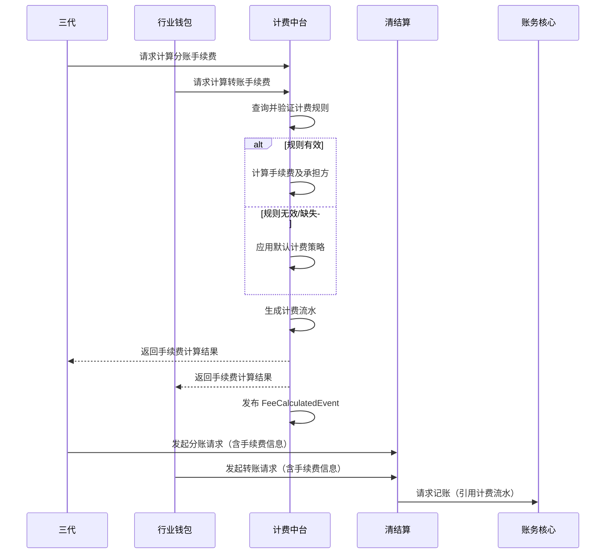

# 模块设计: 计费中台

生成时间: 2026-01-22 17:47:41
批判迭代: 2

---

# 计费中台模块设计文档

## 1. 概述
- **目的与范围**: 本模块提供统一的计费能力，负责根据业务配置生成计费流水，并计算分账/转账交易的手续费。其核心职责是处理与资金划转相关的费用计算，并决定手续费由付款方或收款方承担。模块边界限定于计费规则的执行和计费流水记录，不涉及计费规则的配置管理。

## 2. 接口设计
- **API端点 (REST/GraphQL)**:
    - `POST /api/v1/fee/calculate`: 计算手续费接口。
    - `GET /api/v1/fee/record/{recordId}`: 查询计费流水详情接口。
- **请求/响应结构**:
    - 计算手续费请求 (`POST /api/v1/fee/calculate`):
        - `transactionId`: 交易唯一标识。
        - `transactionType`: 交易类型（如：分账、转账）。
        - `payerId`: 付款方标识。
        - `payeeId`: 收款方标识。
        - `amount`: 交易金额。
        - `institutionCode`: 机构号。
        - `appId`: 应用标识。
    - 计算手续费响应:
        - `feeRecordId`: 计费流水唯一标识。
        - `calculatedFee`: 计算出的手续费金额。
        - `feeBearer`: 手续费承担方（`PAYER` 或 `PAYEE`）。
        - `currency`: 币种。
- **发布/消费的事件**:
    - 发布事件: `FeeCalculatedEvent` (计费完成事件)，包含计费流水ID、交易ID、手续费金额、承担方等信息。
    - 消费事件: TBD。

## 3. 数据模型
- **表/集合**:
    - `fee_rule` (计费规则表): 存储计费规则配置。
    - `fee_record` (计费流水表): 记录每次计费的结果。
- **关键字段**:
    - `fee_rule` 表:
        - `id`: 规则ID。
        - `institution_code`: 机构号。
        - `app_id`: 应用标识。
        - `fee_type`: 计费类型（百分比、固定金额、阶梯费率）。
        - `fee_rate`: 费率值（如百分比为0.01表示1%）。
        - `fixed_fee`: 固定费用。
        - `fee_bearer_logic`: 承担方判定逻辑（如：固定为付方、固定为收方、按规则计算）。
        - `min_fee`: 最低手续费。
        - `max_fee`: 最高手续费。
        - `rounding_rule`: 舍入规则（如：四舍五入、向上取整、向下取整）。
        - `effective_start`: 规则生效时间。
        - `effective_end`: 规则失效时间。
        - `status`: 规则状态（启用/禁用）。
    - `fee_record` 表:
        - `id`: 计费流水ID。
        - `transaction_id`: 关联的交易ID。
        - `transaction_type`: 交易类型。
        - `fee_rule_id`: 应用的计费规则ID。
        - `original_amount`: 原始交易金额。
        - `calculated_fee`: 计算出的手续费金额。
        - `fee_bearer`: 手续费承担方。
        - `currency`: 币种。
        - `calculation_time`: 计算时间。
        - `status`: 流水状态（已计算、已核销）。
- **与其他模块的关系**: 接收来自“三代”或“行业钱包”的计费请求，生成的计费流水被“清结算”用于资金清算，被“账务核心”引用用于记账。

## 4. 业务逻辑
- **核心工作流/算法**:
    1.  **接收请求**: 接收来自上游（三代、行业钱包）的计费请求。
    2.  **规则查询与验证**: 根据请求中的机构号、应用标识、交易类型等信息，查询有效的计费规则。验证规则是否在有效期内且状态为启用。
    3.  **手续费计算**:
        - **算法**:
            - **百分比费率**: `手续费 = 交易金额 * 费率`。
            - **固定费用**: `手续费 = 固定费用`。
            - **阶梯费率**: 根据交易金额所在阶梯区间，应用对应的费率或固定费用。
        - **精度与舍入**: 计算过程中使用高精度小数。最终结果根据规则中的 `rounding_rule` 进行舍入，并遵守 `min_fee` 和 `max_fee` 的限制。
    4.  **承担方判定**:
        - 读取规则中的 `fee_bearer_logic` 字段。
        - 逻辑可能为：
            - `PAYER`: 固定由付款方承担。
            - `PAYEE`: 固定由收款方承担。
            - `CALCULATED`: 根据特定业务规则计算（例如，按交易类型、参与方身份等）。具体计算逻辑 TBD。
    5.  **生成流水**: 将交易信息、应用的规则ID、计算结果、承担方等信息持久化到 `fee_record` 表，并生成唯一流水ID。
    6.  **返回结果**: 将计费结果（含流水ID）返回给调用方。
- **业务规则与验证**:
    - 必须找到一条且仅一条在有效期内的有效计费规则，否则触发默认计费流程。
    - 计算出的手续费不能为负数。
    - 承担方必须明确为 `PAYER` 或 `PAYEE`。
- **关键边界情况处理**:
    - **零手续费场景**: 当计算出的手续费经过舍入和限制后为零时，仍生成一条手续费为零的计费流水。
    - **费率配置缺失或失效**: 触发默认计费策略。默认策略为：手续费为零，承担方为付款方 (`PAYER`)。
    - **金额过小导致计算异常**: 在应用百分比费率前，会检查交易金额和费率，避免因金额过小导致的计算下溢或除零错误。若计算出的手续费低于系统最小货币单位，则按零处理。

## 5. 时序图

## 6. 错误处理
- **预期错误情况**:
    - `FEE_RULE_NOT_FOUND`: 未找到适用的有效计费规则。
    - `FEE_RULE_INVALID`: 找到的计费规则配置无效（如费率格式错误）。
    - `FEE_CALCULATION_ERROR`: 手续费计算过程出现算术异常。
    - `SYSTEM_ERROR`: 数据库连接失败、内部服务异常等系统级错误。
- **处理策略**:
    - 对于 `FEE_RULE_NOT_FOUND` 和 `FEE_RULE_INVALID`，触发默认计费流程（手续费为零，承担方为付款方），并记录警告日志。
    - 对于 `FEE_CALCULATION_ERROR`，记录详细错误日志和上下文信息，向上游返回计算失败错误，交易应被阻断。
    - 对于 `SYSTEM_ERROR`，记录错误日志，触发系统告警，并向上游返回系统暂时不可用错误。

## 7. 依赖关系
- **上游模块**:
    - **三代**: 在处理天财发起的“分账”、“批量付款”等指令时，调用计费中台计算手续费。
    - **行业钱包**: 在处理用户发起的“转账”等钱包内资金划转时，调用计费中台计算手续费。
- **下游模块**:
    - **清结算**: 在执行资金清算时，使用计费中台返回的手续费结果进行净额计算。
    - **账务核心**: 在记录会计分录时，引用计费中台生成的计费流水，记录手续费相关的账务明细。