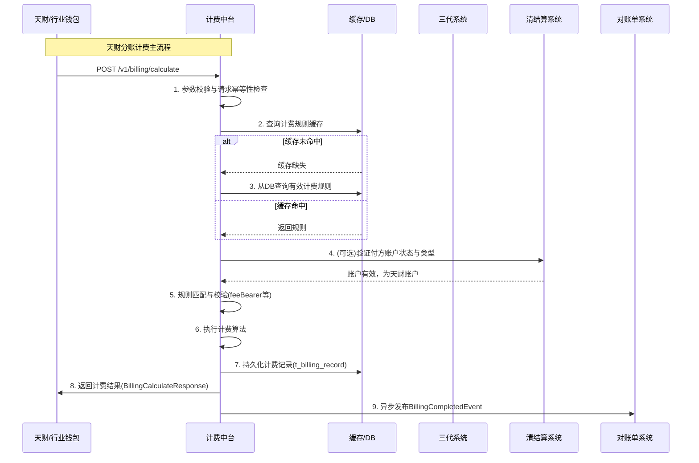

# 模块设计: 计费中台

生成时间: 2026-01-16 17:14:13

---

# 计费中台模块设计文档

## 1. 概述

**模块名称**：计费中台 (Billing Center)
**目的**：计费中台是负责为“天财分账”业务（包括归集、批量付款、会员结算）提供实时、准确、可配置的转账/分账手续费计算与收取服务的核心模块。它确保在资金划转前完成费用计算，并根据配置规则（如承担方、费率、计费模式）进行费用处理，是保障业务合规性与营收能力的关键组件。
**范围**：
- 接收来自行业钱包系统的计费请求。
- 基于三代系统配置的计费规则（费率、承担方、计费模式等）计算手续费。
- 支持按比例、固定金额等多种计费模式。
- 支持净额转账（手续费从转账金额中扣除）和全额转账（手续费额外收取）两种到账模式。
- 将计费结果（成功/失败、手续费金额、实际转账金额等）返回给调用方。
- 与三代系统、清结算系统保持计费配置信息强一致性同步。
- **不负责**：账户资金的实际划扣（由账户系统执行）、协议签署、身份认证、账单生成（由对账单系统负责）。

## 2. 接口设计

### 2.1 API端点 (RESTful)

**1. 计费请求接口**
- **端点**: `POST /v1/billing/calculate`
- **描述**: 行业钱包系统在天财分账交易执行前调用此接口，进行手续费计算与预扣费逻辑处理。
- **请求头**:
    - `X-Request-ID`: 请求唯一标识，用于全链路追踪。
    - `Content-Type`: `application/json`
- **请求体 (BillingCalculateRequest)**:

```json
{
  "requestId": "req_202310271200001",
  "scene": "MEMBER_SETTLEMENT", // 场景枚举: FUND_POOLING(归集), BATCH_PAYMENT(批量付款), MEMBER_SETTLEMENT(会员结算)
  "payerMerchantNo": "M1234567890", // 付方商户号
  "payerAccountNo": "ACC_PAYER_001", // 付方账户号 (天财收款账户)
  "payerAccountType": "TIANCAI_COLLECT", // 付方账户类型: TIANCAI_COLLECT(天财收款账户), TIANCAI_RECEIVE(天财接收方账户)
  "payeeMerchantNo": "M0987654321", // 收方商户号
  "payeeAccountNo": "ACC_PAYEE_001", // 收方账户号
  "payeeAccountType": "TIANCAI_COLLECT", // 收方账户类型
  "transferAmount": 10000, // 转账金额（单位：分）
  "feeBearer": "PAYER_UNIFIED", // 手续费承担方枚举: PAYER_UNIFIED(付方统一承担), PAYEE_UNIFIED(收方统一承担)。由天财接口传入。
  "originalRequest": { // 原始天财请求快照，用于审计和问题排查
    "accessParty": "天财",
    "initiator": "总部_ABC",
    "timestamp": "2023-10-27T12:00:00Z"
  }
}
```

- **响应体 (BillingCalculateResponse)**:
```json
{
  "code": "SUCCESS",
  "message": "计费成功",
  "data": {
    "billingId": "BIL_202310271200001", // 计费流水号，全局唯一
    "requestId": "req_202310271200001",
    "scene": "MEMBER_SETTLEMENT",
    "transferAmount": 10000,
    "feeAmount": 30, // 计算出的手续费（单位：分）
    "actualTransferAmount": 9970, // 实际划转金额（单位：分）。净额转账时 = transferAmount - feeAmount
    "feeRate": "0.003", // 实际应用的费率（如0.3%）
    "feeRuleId": "RULE_TC_001", // 应用的计费规则ID
    "feeBearer": "PAYER_UNIFIED",
    "settlementMode": "NET", // 到账模式: NET(净额转账), GROSS(全额转账)
    "status": "SUCCESS", // 计费状态: SUCCESS, FAILED
    "calculatedAt": "2023-10-27T12:00:05Z"
  }
}
```
- **错误码**:
    - `40001`: 参数校验失败（如金额非正、账户类型不支持）。
    - `40002`: 未找到适用的计费规则。
    - `40003`: 计费规则配置冲突或无效。
    - `50001`: 系统内部错误。
    - `50002`: 依赖服务（如清结算配置查询）不可用。

**2. 计费规则同步回调接口**
- **端点**: `POST /v1/billing/rules/notify`
- **描述**: 由三代系统在计费规则（费率、承担方、生效时间等）发生变更时调用，确保计费中台与三代、清结算数据强一致。
- **请求体**: 包含规则变更的详细信息（增、删、改）。
- **响应体**: 简单的成功/失败确认。

### 2.2 发布/消费的事件

**发布的事件**:
1.  `BillingCompletedEvent`: 计费成功完成后发布，供下游系统（如对账单系统）订阅，用于生成账单。
    - **主题**: `billing.center.billing.completed`
    - **消息体**: 包含 `BillingCalculateResponse.data` 中的核心字段及完整计费上下文。

**消费的事件**:
1.  `MerchantSettlementConfigUpdatedEvent`: 订阅自清结算系统或三代，当商户的结算账户配置（如是否配置为天财收款账户）变更时，可能影响计费规则的适用性，触发本地缓存刷新。

## 3. 数据模型

### 3.1 核心数据库表设计

```sql
-- 计费规则表：存储从三代同步的、针对天财分账的计费规则
CREATE TABLE t_billing_rule (
    id BIGINT PRIMARY KEY AUTO_INCREMENT,
    rule_id VARCHAR(64) NOT NULL UNIQUE COMMENT '规则唯一标识，由三代生成',
    scene VARCHAR(32) NOT NULL COMMENT '业务场景: FUND_POOLING, BATCH_PAYMENT, MEMBER_SETTLEMENT',
    payer_account_type VARCHAR(32) NOT NULL COMMENT '付方账户类型',
    payee_account_type VARCHAR(32) NOT NULL COMMENT '收方账户类型',
    fee_bearer VARCHAR(32) NOT NULL COMMENT '手续费承担方: PAYER_UNIFIED, PAYEE_UNIFIED',
    settlement_mode VARCHAR(32) NOT NULL COMMENT '到账模式: NET, GROSS',
    billing_scope VARCHAR(32) NOT NULL DEFAULT 'TRANSACTION' COMMENT '计费范围: TRANSACTION(按流水金额)',
    billing_mode VARCHAR(32) NOT NULL COMMENT '计费模式: PERCENTAGE(比例), FIXED(固定金额)',
    fee_rate DECIMAL(10,6) COMMENT '费率（当billing_mode为PERCENTAGE时有效），如0.003表示0.3%',
    fixed_amount BIGINT COMMENT '固定手续费（分，当billing_mode为FIXED时有效）',
    payer_merchant_no VARCHAR(64) COMMENT '适用的付方商户号，NULL表示通用规则',
    payer_account_no VARCHAR(64) COMMENT '适用的付方账户号，NULL表示通用规则',
    effective_time DATETIME NOT NULL COMMENT '规则生效时间',
    expiry_time DATETIME COMMENT '规则失效时间',
    status VARCHAR(16) NOT NULL DEFAULT 'ACTIVE' COMMENT '状态: ACTIVE, INACTIVE',
    version BIGINT NOT NULL DEFAULT 1 COMMENT '版本号，用于乐观锁和一致性校验',
    sync_source VARCHAR(32) COMMENT '同步来源: SANDAI',
    sync_time DATETIME COMMENT '最后一次同步时间',
    created_at DATETIME NOT NULL DEFAULT CURRENT_TIMESTAMP,
    updated_at DATETIME NOT NULL DEFAULT CURRENT_TIMESTAMP ON UPDATE CURRENT_TIMESTAMP,
    INDEX idx_scene_payer_payee (scene, payer_account_type, payee_account_type),
    INDEX idx_merchant_account (payer_merchant_no, payer_account_no),
    INDEX idx_effective (effective_time, expiry_time, status)
) COMMENT='天财分账计费规则表';

-- 计费流水表：记录每一次计费请求的结果
CREATE TABLE t_billing_record (
    id BIGINT PRIMARY KEY AUTO_INCREMENT,
    billing_id VARCHAR(64) NOT NULL UNIQUE COMMENT '计费流水号',
    request_id VARCHAR(64) NOT NULL COMMENT '外部请求ID',
    scene VARCHAR(32) NOT NULL,
    payer_merchant_no VARCHAR(64) NOT NULL,
    payer_account_no VARCHAR(64) NOT NULL,
    payee_merchant_no VARCHAR(64) NOT NULL,
    payee_account_no VARCHAR(64) NOT NULL,
    transfer_amount BIGINT NOT NULL COMMENT '原始转账金额(分)',
    fee_amount BIGINT NOT NULL COMMENT '手续费(分)',
    actual_transfer_amount BIGINT NOT NULL COMMENT '实际划转金额(分)',
    fee_bearer VARCHAR(32) NOT NULL,
    settlement_mode VARCHAR(32) NOT NULL,
    applied_rule_id VARCHAR(64) NOT NULL COMMENT '应用的计费规则ID',
    fee_rate DECIMAL(10,6),
    fixed_amount BIGINT,
    billing_mode VARCHAR(32),
    status VARCHAR(16) NOT NULL COMMENT '计费状态: SUCCESS, FAILED',
    error_code VARCHAR(32) COMMENT '失败错误码',
    error_message TEXT COMMENT '失败详情',
    calculated_at DATETIME NOT NULL COMMENT '计费时间',
    created_at DATETIME NOT NULL DEFAULT CURRENT_TIMESTAMP,
    INDEX idx_billing_id (billing_id),
    INDEX idx_request_id (request_id),
    INDEX idx_payer_account (payer_merchant_no, payer_account_no, calculated_at),
    INDEX idx_scene_time (scene, calculated_at)
) COMMENT='计费流水记录表';
```

### 3.2 与其他模块的关系
- **三代系统**: 上游配置源。计费中台从三代系统同步计费规则，并保证数据一致性。计费中台是三代配置的消费者和执行者。
- **行业钱包系统**: 主要调用方。在分账交易前调用计费中台进行费用计算。
- **清结算系统**: 协作方。共享计费配置信息，确保在资金清算结算时费用口径一致。计费中台需要感知清结算中商户的账户配置状态。
- **对账单系统**: 下游数据消费者。计费中台发布`BillingCompletedEvent`，对账单系统订阅后生成包含手续费明细的“天财分账”账单。
- **账户系统**: 间接关联。计费中台计算出的`actualTransferAmount`将作为账户系统执行转账的金额依据。

## 4. 业务逻辑

### 4.1 核心计费算法

**输入**: `BillingCalculateRequest`, 适用的`BillingRule`。
**输出**: `feeAmount`, `actualTransferAmount`。

```python
def calculate_fee(request, rule):
    base_amount = request.transferAmount # 基准金额
    
    # 1. 计算手续费原始值
    if rule.billing_mode == 'PERCENTAGE':
        raw_fee = ceil(base_amount * rule.fee_rate) # 向上取整到分
    elif rule.billing_mode == 'FIXED':
        raw_fee = rule.fixed_amount
    else:
        raise UnsupportedBillingModeError
    
    # 2. 根据到账模式计算实际划转金额和最终手续费
    if rule.settlement_mode == 'NET':
        # 净额转账：手续费从转账金额中扣除，由承担方“承受”费用损失
        actual_transfer_amount = base_amount - raw_fee
        final_fee = raw_fee
        # 确保实际划转金额非负
        if actual_transfer_amount < 0:
            raise InvalidAmountError("转账金额不足以覆盖手续费")
    elif rule.settlement_mode == 'GROSS':
        # 全额转账：手续费额外收取，实际划转金额等于原始金额
        actual_transfer_amount = base_amount
        final_fee = raw_fee
    else:
        raise UnsupportedSettlementModeError
    
    return final_fee, actual_transfer_amount
```

### 4.2 业务规则与验证逻辑

1.  **规则匹配优先级**：
    - 首先匹配 `payer_merchant_no` + `payer_account_no` + `scene` + `payer_account_type` + `payee_account_type` 完全指定的规则。
    - 其次匹配 `payer_merchant_no` + `scene` + `payer_account_type` + `payee_account_type` 的规则（账户号泛化）。
    - 最后匹配 `scene` + `payer_account_type` + `payee_account_type` 的通用规则。
    - 始终选择`status='ACTIVE'`且在`effective_time`和`expiry_time`范围内的、版本最新的规则。

2.  **一致性校验**：
    - 请求中的`feeBearer`必须与匹配到的规则中配置的`fee_bearer`枚举值一致，否则计费失败。
    - 计费前，需通过查询清结算系统或缓存，确认付方账户当前状态有效且确为“天财专用账户”。

3.  **幂等性**：
    - 使用`requestId`实现幂等。对相同`requestId`的请求，返回已存在的计费结果，不重复计算。

4.  **强一致性保障**：
    - 接收三代系统的规则变更通知后，需在事务内更新数据库并刷新本地缓存，并返回确认结果。若同步失败，三代应重试。
    - 定期与三代系统对账，校验规则数据的一致性。

## 5. 时序图



## 6. 错误处理

| 错误场景 | 错误码 | 处理策略 | 是否重试 |
| :--- | :--- | :--- | :--- |
| 请求参数无效（金额、账户类型） | 40001 | 记录日志，返回明确错误信息，请求不会进入计费流程。 | 否，需调用方修正后重试。 |
| 未找到匹配的计费规则 | 40002 | 记录告警（需人工介入配置），返回错误。分账交易应被阻止。 | 否，需运维人员在三代配置规则。 |
| 计费规则配置冲突 | 40003 | 记录错误日志和告警，返回“系统配置错误”。 | 否，需运维人员排查。 |
| 账户状态无效或非天财账户 | 40004 | 返回错误，提示“付方账户状态异常”。 | 否，需行业钱包检查账户绑定与状态。 |
| 系统内部错误（DB、缓存访问失败） | 50001 | 记录详细错误日志，返回“系统繁忙”。 | **是**，行业钱包可进行有限次重试。 |
| 依赖服务（清结算）超时或不可用 | 50002 | 记录日志，可考虑降级（如跳过账户状态强校验，依赖前置校验），若无法降级则失败。 | 是，依赖服务恢复后重试可能成功。 |

**通用策略**：
- 所有错误均需在`t_billing_record`中记录`status='FAILED'`及错误信息。
- 5xx错误应触发监控告警。
- 通过`X-Request-ID`实现全链路错误追踪。

## 7. 依赖说明

1.  **上游依赖**：
    - **三代系统**：**强依赖**。提供计费规则的源数据。通过同步回调接口和定期对账确保一致性。如果规则数据不同步，将导致计费失败或计费错误。
    - **行业钱包系统**：**强依赖**。作为主调用方，提供计费请求。需保证请求参数的准确性，并在收到失败响应时妥善处理分账流程。
    - **清结算系统**：**弱依赖（可降级）**。用于增强校验。在清结算系统不可用时，可依赖行业钱包的前置校验结果，但会引入一定风险。

2.  **下游依赖**：
    - **对账单系统**：**弱依赖**。事件发布采用异步机制，即使对账单系统暂时不可用，不影响核心计费流程，但会导致账单生成延迟。事件需持久化并支持重推。

3.  **交互要点**：
    - 与所有外部系统的交互均需定义清晰的超时时间、重试策略和熔断机制。
    - 与三代系统的配置同步是**关键路径**，必须保证最终一致性，设计上需有对账和补偿机制。
    - 作为资金相关系统，所有接口需具备高安全性，包括IP白名单、接口签名等。