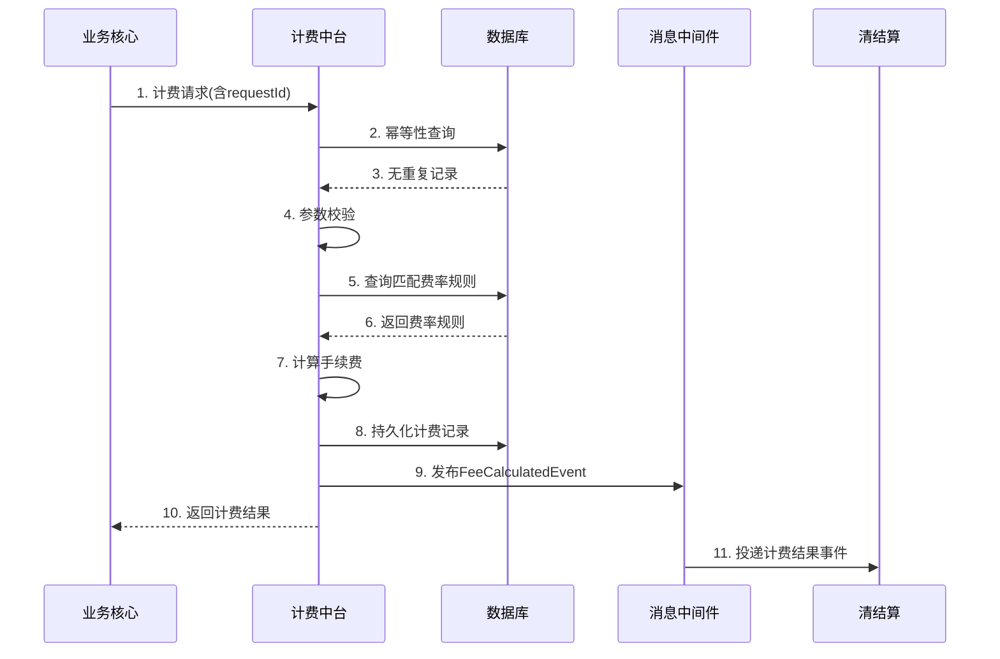

# 模块设计: 计费中台

生成时间: 2026-01-22 16:11:21
批判迭代: 2

---

# 计费中台 模块设计文档

## 1. 概述
- **目的与范围**：本模块负责计算并生成转账、分账等业务手续费。其核心职责是接收业务请求，根据预设的计费规则计算应收手续费，并将计费结果通知相关系统。其边界在于仅负责费用的计算与生成，不涉及资金的扣划、账户余额管理或会计分录记录。
- **与清结算模块的关系澄清**：根据术语表，"清结算"是"清结算/计费中台"的别名，这表明清结算与计费中台在概念上可能是一个复合模块或紧密耦合。在本设计中，我们将"计费中台"视为"清结算"大模块中的一个专注于费用计算的子模块或服务。因此，计费中台为清结算流程提供计费结果，是其内部的一个关键环节。

## 2. 接口设计
- **API端点 (REST)**：
    - `POST /api/v1/fee/calculate`：核心计费接口，接收计费请求，返回计费结果。
    - `GET /api/v1/fee/rules/{ruleId}`：查询特定费率规则详情（供管理或调试用）。
- **请求/响应结构**：
    - **计费请求 (CalculateFeeRequest)**:
        - `requestId` (String): 请求唯一标识，用于幂等性控制。
        - `appId` (String): 调用方应用标识。
        - `bizType` (String): 业务类型，如 `SPLIT_ACCOUNT`（分账）、`TRANSFER`（转账）、`BATCH_PAY`（批量付款）。
        - `payerInstitutionNo` (String): 付方机构号。
        - `payeeInstitutionNo` (String): 收方机构号。
        - `amount` (BigDecimal): 交易金额。
        - `currency` (String): 币种，默认CNY。
        - `extInfo` (Map<String, Object>): 扩展信息，用于传递商户类型、交易场景等。
    - **计费响应 (CalculateFeeResponse)**:
        - `code` (String): 响应码。
        - `message` (String): 响应消息。
        - `data` (FeeDetail): 计费明细数据。
    - **计费明细 (FeeDetail)**:
        - `feeRequestId` (String): 计费记录唯一ID，与请求中的`requestId`关联。
        - `calculatedFee` (BigDecimal): 计算出的手续费金额。
        - `currency` (String): 手续费币种。
        - `ruleId` (String): 所应用的费率规则ID。
        - `calculationTime` (Long): 计费时间戳。
- **发布/消费的事件**：
    - **消费事件**: TBD (例如，可能监听来自业务核心的交易创建事件)。
    - **发布事件**: `FeeCalculatedEvent`，事件体包含 `FeeDetail` 核心信息，供清结算等下游模块消费。

## 3. 数据模型
- **表/集合**：
    - **费率规则表 (fee_rule)**：存储可动态配置的计费规则。
        - `rule_id` (PK): 规则唯一标识。
        - `biz_type`: 适用的业务类型。
        - `payer_type`: 付方类型（如总部、门店）。
        - `payee_type`: 收方类型。
        - `fee_calc_mode`: 计费模式（如百分比、固定额、混合）。
        - `fee_rate`: 费率（百分比值）。
        - `fixed_fee`: 固定费用。
        - `min_fee`: 最低手续费。
        - `max_fee`: 最高手续费。
        - `effective_start`: 规则生效开始时间。
        - `effective_end`: 规则生效结束时间。
        - `status`: 规则状态（启用/禁用）。
    - **计费记录表 (fee_calculation_record)**：记录每一次计费请求和结果，用于对账、审计和幂等。
        - `fee_request_id` (PK): 计费请求ID，具有唯一约束。
        - `original_request_id`: 原始业务请求ID。
        - `app_id`: 调用方APPID。
        - `biz_type`: 业务类型。
        - `payer_inst_no`: 付方机构号。
        - `payee_inst_no`: 收方机构号。
        - `transaction_amount`: 交易金额。
        - `calculated_fee`: 计算出的手续费。
        - `currency`: 币种。
        - `applied_rule_id`: 应用的规则ID。
        - `calculation_status`: 计算状态（成功/失败）。
        - `error_msg`: 失败时的错误信息。
        - `created_at`: 记录创建时间。
- **与其他模块的关系**：本模块生成的计费结果（通过事件或API响应）需要提供给**清结算**模块，用于后续的资金清算与结算处理。计费记录可供**对账单系统**生成费用明细。

## 4. 业务逻辑
- **核心工作流/算法**：
    1. **请求接收与验证**：接收计费请求，校验必填字段（`requestId`, `bizType`, `amount`等）的完整性与合法性（如金额需为正数）。
    2. **幂等性检查**：以 `requestId` 为键，查询`fee_calculation_record`表。若已存在成功记录，则直接返回历史结果；若存在失败记录，根据策略决定是重试还是报错。
    3. **费率规则匹配**：根据 `bizType`、`payerInstitutionNo`、`payeeInstitutionNo` 以及请求中的扩展信息（如商户类型），结合当前时间，查询 `fee_rule` 表，匹配优先级最高（如最具体）的生效规则。
    4. **手续费计算**：根据匹配到的规则中的 `fee_calc_mode`、`fee_rate`、`fixed_fee` 等参数，结合交易 `amount`，计算出手续费。应用 `min_fee` 和 `max_fee` 进行封顶保底处理。
    5. **结果持久化与发布**：将计费请求、结果、所用规则ID持久化到 `fee_calculation_record` 表。发布 `FeeCalculatedEvent` 事件。
    6. **响应**：向调用方返回计费结果。
- **业务规则与验证**：
    - 计费规则支持基于多维度（业务类型、参与方身份、时间）的精细化配置。
    - 验证失败（如无匹配规则、参数非法）应立即失败，阻止交易继续，并返回明确错误码。
- **关键边界情况处理**：
    - **无匹配规则**：视为配置错误，返回"费率规则未配置"错误。
    - **外部依赖（如规则库）不可用**：可降级使用本地缓存的最新规则；若缓存也无数据，则快速失败，避免计算错误费用。
    - **数据一致性**：通过"先持久化记录，后发布事件"的顺序，并在事件发布环节采用可靠消息投递机制（如本地事务消息表），确保下游系统至少能最终一致性消费到计费结果。

## 5. 时序图

## 6. 错误处理
- **预期错误情况**：
    1. **计费规则配置缺失或无效**：无匹配的生效规则。
    2. **请求参数不合法**：如金额为负、必填字段为空、格式错误。
    3. **幂等冲突**：重复的 `requestId` 但业务参数不一致。
    4. **系统依赖异常**：数据库连接失败、缓存服务不可用。
- **处理策略**：
    - 对于错误1和2，立即失败，返回具体的业务错误码和提示，阻断交易。
    - 对于错误3，记录告警，并返回"重复请求"错误，提示调用方检查。
    - 对于错误4，进行服务降级（如使用缓存规则）或快速失败，具体策略根据配置决定。所有系统异常均需记录详细日志并告警。

## 7. 依赖关系
- **上游模块/调用方**：
    - **业务核心**：在发起分账、转账等交易前，调用计费中台计算手续费。
    - **清结算**：在清算处理过程中，可能直接调用计费中台进行费用计算。
- **下游模块/消费者**：
    - **清结算**：作为核心下游，消费 `FeeCalculatedEvent`，将手续费结果纳入清算与结算流程。
    - **对账单系统**：读取 `fee_calculation_record` 数据，生成费用明细对账单。
- **外部依赖**：
    - **数据库**：用于存储费率规则和计费记录。
    - **缓存服务**：用于缓存热点费率规则，提升查询性能与可用性。
    - **消息中间件**：用于可靠地发布计费结果事件。