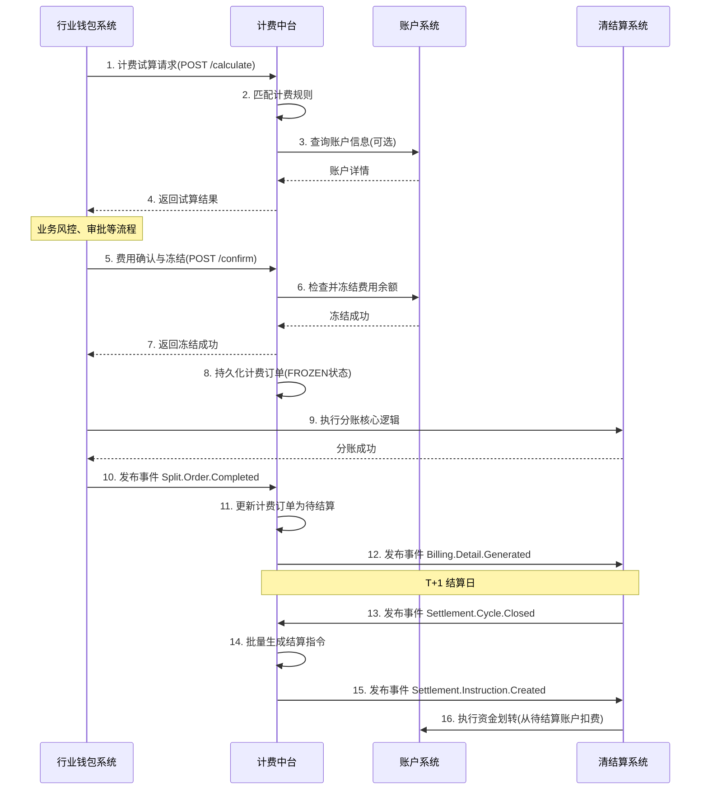

# 模块设计: 计费中台

生成时间: 2026-01-19 15:29:35

---

# 计费中台模块设计文档

## 1. 概述

### 1.1 目的
计费中台模块是天财分账系统的核心计费引擎，负责对各类分账交易、账户管理、资金操作进行精确的费用计算和结算处理。它作为清结算系统的一部分，向上游（行业钱包系统、三代系统）提供标准化的计费服务，向下游（账户系统、对账单系统）输出计费结果和结算指令，确保天财业务的资金流转符合计费规则，并生成准确的计费凭证。

### 1.2 范围
- **计费对象**：天财分账交易（归集、批量付款、会员结算）、天财专用账户的开户/维护、提现/充值操作。
- **核心功能**：
    1. **费率规则管理**：支持为不同业务场景、不同角色（总部/门店）、不同账户类型配置差异化的计费规则（如固定费用、百分比费率、阶梯费率、封顶/保底）。
    2. **实时计费**：在分账指令处理、账户操作等关键节点，实时计算并冻结/扣除相关费用。
    3. **批量结算**：按结算周期（如T+1）对已发生的费用进行汇总、核对，并生成结算指令，驱动资金从待结算账户或指定账户划转至收费方账户。
    4. **费用对账**：生成详细的计费明细和汇总账单，供内部对账和天财机构查询。
    5. **计费豁免与优惠**：支持基于特定条件（如活动期、大客户）的费用减免。
- **非范围**：支付交易本身的清算（由清结算主流程负责）、底层账户的账务记账（由账户系统负责）、电子签约流程。

## 2. 接口设计

### 2.1 API端点 (RESTful)

#### 2.1.1 计费试算接口
- **端点**: `POST /v1/billing/calculate`
- **描述**: 在业务发起前（如分账），预先计算并返回费用明细，用于前端展示或风控校验。
- **请求头**: `X-Biz-Scenario: {场景码}`, `X-Request-ID: {请求ID}`
- **请求体**:
```json
{
  "biz_order_no": "TC202403210001", // 业务订单号
  "scene_code": "TC_COLLECT", // 业务场景码，如 TC_COLLECT(归集), TC_BATCH_PAY(批量付款)
  "payer_info": {
    "account_no": "TC_RCV_1001", // 付方账户号
    "account_role": "HEADQUARTERS" // 付方角色
  },
  "payee_info": {
    "account_no": "TC_RCV_1002", // 收方账户号（批量付款时为数组）
    "account_role": "STORE"
  },
  "amount": 100000, // 分账金额（单位：分）
  "currency": "CNY",
  "extend_info": { // 扩展信息，用于匹配复杂规则
    "industry_type": "catering",
    "merchant_tier": "VIP1"
  }
}
```
- **响应体** (成功):
```json
{
  "code": "SUCCESS",
  "data": {
    "biz_order_no": "TC202403210001",
    "total_fee": 50, // 总费用（分）
    "currency": "CNY",
    "fee_details": [
      {
        "fee_type": "PLATFORM_SERVICE_FEE", // 费用类型
        "fee_name": "平台服务费",
        "calculation_base": 100000, // 计费基数
        "rate": "0.0005", // 费率
        "fee_amount": 50,
        "payer_account_no": "TC_RCV_1001", // 承担方账户
        "payee_account_no": "FEE_ACCOUNT_PLATFORM" // 收费方账户
      }
    ]
  }
}
```

#### 2.1.2 费用确认与冻结接口
- **端点**: `POST /v1/billing/confirm`
- **描述**: 业务正式执行前（如分账指令通过风控后），确认并冻结费用，确保资金可用。
- **请求体**: 包含 `biz_order_no` 和 `calculate_id` (试算返回的标识)。
- **响应体**: 返回 `billing_order_no` (计费订单号) 和费用冻结结果。

#### 2.1.3 费用结算指令生成接口（内部）
- **端点**: `POST /internal/v1/billing/settle`
- **描述**: 由调度任务触发，对已冻结且业务已完成的费用，生成结算指令。
- **请求体**: `{ "settle_date": "2024-03-21", "biz_scenario": "TC_COLLECT" }`
- **响应体**: 返回生成的结算批次号及指令数量。

### 2.2 发布/消费的事件

#### 2.2.1 消费的事件
- **`Tiancai.Split.Order.Completed`** (来自行业钱包系统): 分账订单完成。触发计费模块进行费用确认和结算准备。
- **`Account.Created`** (来自账户系统): 天财专用账户创建成功。可能触发开户手续费计费。
- **`Settlement.Cycle.Closed`** (来自清结算系统): 结算周期关闭。触发批量费用结算作业。

#### 2.2.2 发布的事件
- **`Billing.Fee.Frozen`**: 费用冻结成功。通知相关系统费用已预留。
- **`Billing.Settlement.Instruction.Created`**: 结算指令已生成。清结算系统将消费此事件执行资金划转。
- **`Billing.Detail.Generated`**: 计费明细已生成。对账单系统消费以生成天财机构账单。

## 3. 数据模型

### 3.1 核心表设计

#### 3.1.1 计费规则表 (`billing_rule`)
| 字段名 | 类型 | 必填 | 描述 |
| :--- | :--- | :--- | :--- |
| `rule_id` | bigint | Y | 主键 |
| `rule_code` | varchar(64) | Y | 规则唯一编码 |
| `rule_name` | varchar(128) | Y | 规则名称 |
| `biz_scenario` | varchar(32) | Y | 业务场景码 |
| `payer_role` | varchar(32) | N | 付费方角色 (如 HEADQUARTERS)，NULL表示通用 |
| `payee_role` | varchar(32) | N | 收款方角色 |
| `account_type` | varchar(32) | N | 账户类型 (TC_RCV, TC_RECIPIENT) |
| `fee_type` | varchar(32) | Y | 费用类型 (PLATFORM_SERVICE_FEE, WITHDRAW_FEE) |
| `calculation_mode` | varchar(32) | Y | 计费模式 (PERCENTAGE, FIXED, TIERED) |
| `rate` | decimal(10,6) | N | 费率 (百分比模式) |
| `fixed_amount` | bigint | N | 固定费用 (分) |
| `tier_config` | json | N | 阶梯费率配置 |
| `min_fee` | bigint | N | 最低费用 |
| `max_fee` | bigint | N | 最高费用 |
| `fee_payer` | varchar(32) | Y | 费用承担方 (PAYER, PAYEE, BOTH) |
| `effective_date` | date | Y | 生效日期 |
| `expiry_date` | date | N | 失效日期 |
| `status` | tinyint | Y | 状态 (1生效，0失效) |

#### 3.1.2 计费订单表 (`billing_order`)
| 字段名 | 类型 | 必填 | 描述 |
| :--- | :--- | :--- | :--- |
| `billing_order_no` | varchar(64) | Y | 主键，计费订单号 |
| `biz_order_no` | varchar(64) | Y | 关联的业务订单号 |
| `biz_scenario` | varchar(32) | Y | 业务场景 |
| `total_fee` | bigint | Y | 总费用 (分) |
| `currency` | char(3) | Y | 币种 |
| `fee_status` | varchar(32) | Y | 状态 (CALCULATED, FROZEN, SETTLED, CANCELLED) |
| `payer_account_no` | varchar(64) | Y | 业务付方账户 |
| `settle_date` | date | N | 结算日期 |
| `created_at` | datetime | Y | 创建时间 |

#### 3.1.3 计费明细表 (`billing_detail`)
| 字段名 | 类型 | 必填 | 描述 |
| :--- | :--- | :--- | :--- |
| `id` | bigint | Y | 主键 |
| `billing_order_no` | varchar(64) | Y | 关联计费订单 |
| `fee_type` | varchar(32) | Y | 费用类型 |
| `calculation_base` | bigint | Y | 计费基数 (分) |
| `rate` | decimal(10,6) | N | 适用费率 |
| `fee_amount` | bigint | Y | 费用金额 (分) |
| `payer_account_no` | varchar(64) | Y | 费用承担方账户 |
| `payee_account_no` | varchar(64) | Y | 费用收取方账户 (如平台收入户) |
| `rule_id` | bigint | Y | 关联的计费规则 |

#### 3.1.4 结算指令表 (`settlement_instruction`)
| 字段名 | 类型 | 必填 | 描述 |
| :--- | :--- | :--- | :--- |
| `instruction_id` | varchar(64) | Y | 指令ID |
| `batch_no` | varchar(64) | Y | 结算批次号 |
| `billing_order_no` | varchar(64) | Y | 关联计费订单 |
| `payer_account_no` | varchar(64) | Y | 出款账户 (如待结算账户01) |
| `payee_account_no` | varchar(64) | Y | 入款账户 (平台账户) |
| `amount` | bigint | Y | 金额 |
| `currency` | char(3) | Y | 币种 |
| `status` | varchar(32) | Y | 状态 (PENDING, PROCESSING, SUCCESS, FAILED) |
| `settle_date` | date | Y | 结算日期 |

### 3.2 与其他模块的关系
- **行业钱包系统**: 通过事件和API交互，是计费触发的主要上游。
- **账户系统**: 依赖其查询账户信息、角色、类型，并驱动费用账户的扣款。
- **清结算系统**: 隶属其下，消费结算周期事件，并输出结算指令给清结算执行。
- **对账单系统**: 提供计费明细数据，用于生成天财机构账单。
- **三代系统**: 可能透传商户层级、行业等扩展信息，用于匹配计费规则。

## 4. 业务逻辑

### 4.1 核心计费算法
1. **规则匹配引擎**：根据 `biz_scenario`, `payer_role`, `payee_role`, `account_type` 以及扩展信息（如 `industry_type`），从 `billing_rule` 表中匹配出优先级最高（规则最具体）且处于生效期的计费规则。
2. **费用计算**：
    - **百分比模式**: `fee = calculation_base * rate`。应用 `min_fee` 和 `max_fee` 限制。
    - **固定费用模式**: `fee = fixed_amount`。
    - **阶梯模式**: 根据 `tier_config` (如 `[{“min”:0, “max”:10000, “rate”:0.001}, ...]`) 计算。
3. **费用承担方拆分**：若 `fee_payer` 为 `BOTH`，则按预设比例在付方和收方之间拆分费用，生成两条计费明细。

### 4.2 业务规则
- **归集场景**：通常由门店（付方）承担平台服务费。费用从门店的 **天财收款账户** 中扣除。
- **批量付款/会员结算场景**：通常由总部（付方）承担手续费。费用从总部的 **天财收款账户** 中扣除。
- **账户开户**：可能收取一次性开户费，从对应的 **天财收款账户** 或 **天财接收方账户** 中扣除。
- **提现**：从天财接收方账户提现到银行卡，可能按笔收取固定提现费。
- **退货场景**：关联原交易，计费可能冲正（reverse）或免除。

### 4.3 验证逻辑
- **费用试算验证**：匹配不到有效规则时，返回错误码 `NO_VALID_BILLING_RULE`。
- **费用冻结验证**：检查付方账户状态是否正常、可用余额是否足够覆盖“业务金额+冻结费用”。
- **结算前验证**：检查关联的业务订单状态是否为最终成功状态。

## 5. 时序图

### 5.1 分账业务计费流程



## 6. 错误处理

| 错误码 | HTTP状态码 | 描述 | 处理策略 |
| :--- | :--- | :--- | :--- |
| `BIZ_SCENARIO_INVALID` | 400 | 业务场景码不支持 | 检查请求参数，引导使用白名单内的场景码。 |
| `NO_VALID_BILLING_RULE` | 400 | 未找到适用的计费规则 | 检查计费规则配置，或联系运营人员为该场景配置规则。 |
| `ACCOUNT_NOT_FOUND` | 404 | 账户不存在或状态异常 | 调用方需确保账户已正确开户并处于可用状态。 |
| `INSUFFICIENT_BALANCE` | 409 | 账户余额不足（用于冻结） | 通知业务方充值或调整业务金额。 |
| `FEE_ALREADY_SETTLED` | 409 | 费用已结算，不可重复操作 | 幂等处理，返回已存在的结算结果。 |
| `CALCULATE_ID_EXPIRED` | 410 | 试算结果已过期 | 重新调用试算接口。 |
| `SYSTEM_ERROR` | 500 | 系统内部错误 | 记录详细日志，触发告警，人工介入排查。 |

**通用策略**：
- 所有关键操作（冻结、结算）必须实现**幂等性**，通过唯一业务订单号或计费订单号控制。
- 采用**异步补偿机制**。对于结算失败指令，记录失败原因，由定时任务重试或转人工处理。
- 所有错误均返回结构化的JSON响应，包含 `code`, `message`, `request_id`。

## 7. 依赖说明

### 7.1 上游模块交互
1. **行业钱包系统 (主调用方)**:
    - **交互方式**: 同步API调用（试算、确认）、异步事件监听（`Split.Order.Completed`）。
    - **职责**: 提供准确的业务场景、账户信息、金额，并在业务合适节点触发计费。
    - **契约**: 需保证业务订单号的全局唯一性。

2. **账户系统**:
    - **交互方式**: 同步RPC/API调用。
    - **职责**: 提供账户余额查询、费用冻结/解冻/扣减接口。计费中台不直接操作账户余额，只调用账户系统接口。
    - **关键接口**: `冻结资金`、`解冻并扣款`、`查询账户详情`。

3. **清结算系统 (父系统)**:
    - **交互方式**: 事件总线、内部API。
    - **职责**: 提供结算周期时钟事件，接收并执行计费中台发出的资金结算指令。

### 7.2 下游模块交互
1. **对账单系统**:
    - **交互方式**: 异步事件 (`Billing.Detail.Generated`)、数据库直读（可选）。
    - **职责**: 消费计费明细事件，为天财机构聚合生成费用账单。

### 7.3 配置与数据依赖
- **计费规则配置台**: 需要一个独立的运营管理后台，供业务人员配置和发布计费规则。此配置台可直接操作 `billing_rule` 表或通过管理API与计费中台交互。
- **商户/机构信息**: 依赖三代系统或商户中心提供商户的行业分类、等级等信息，用于精细化的规则匹配。这些信息可通过请求中的 `extend_info` 传入，或由计费中台根据商户号实时查询获取。