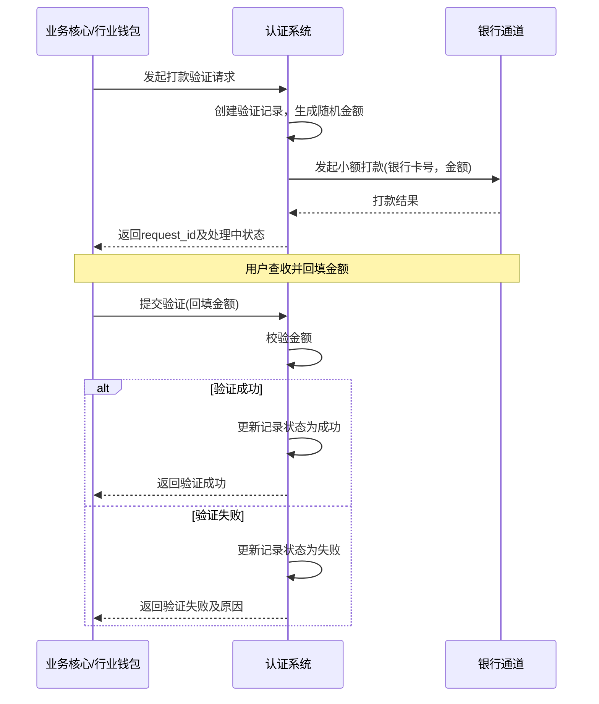
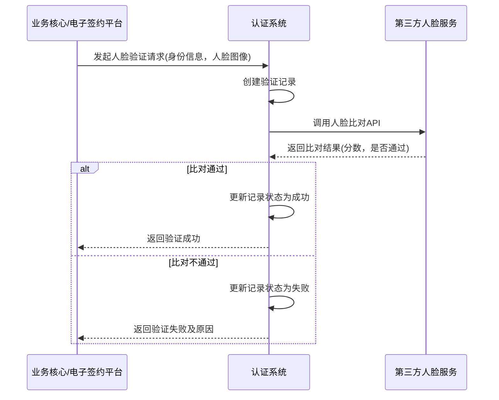

# 模块设计: 认证系统

生成时间: 2026-01-22 16:11:39
批判迭代: 2

---

# 认证系统 模块设计文档

## 1. 概述
- **目的与范围**: 本模块负责在关系绑定、开通付款等业务流程中，对参与方（如总部、门店、个人）进行身份与授权验证。核心职责包括管理打款验证、人脸验证等认证流程，并记录认证结果，为分账、归集、会员结算等业务提供身份核验支持。其边界止于认证行为的发起、执行与结果记录，不涉及具体的电子签约协议生成（协议生成由电子签约平台负责），但会为包含人脸验证的签约流程提供验证服务。不涉及账户资金操作。

## 2. 接口设计
- **API端点 (REST/GraphQL)**:
    - `POST /api/v1/verification/payment`: 发起打款验证请求。
    - `POST /api/v1/verification/payment/confirm`: 提交并验证回填金额。
    - `POST /api/v1/verification/face`: 发起人脸验证请求。
    - `GET /api/v1/verification/{request_id}`: 查询认证结果。
- **请求/响应结构**:
    - 发起打款验证请求 (`POST /api/v1/verification/payment`)
        - 请求体: `{"user_id": "string", "bank_card_no": "string", "bank_name": "string", "business_scene": "string"}`
        - 响应体: `{"request_id": "string", "status": "PROCESSING"}`
    - 提交打款验证 (`POST /api/v1/verification/payment/confirm`)
        - 请求体: `{"request_id": "string", "amount": "string"}`
        - 响应体: `{"request_id": "string", "status": "SUCCESS/FAILED", "result_code": "string"}`
    - 发起人脸验证请求 (`POST /api/v1/verification/face`)
        - 请求体: `{"user_id": "string", "id_card_no": "string", "name": "string", "face_image_data": "string", "business_scene": "string"}`
        - 响应体: `{"request_id": "string", "status": "PROCESSING"}`
- **发布/消费的事件**:
    - 发布事件: `VerificationCompletedEvent` (事件内容: `request_id`, `user_id`, `verification_type`, `result`, `timestamp`)。
    - 消费事件: TBD。

## 3. 数据模型
- **表/集合**:
    - `verification_records` (认证记录表)
- **关键字段**:
    - `request_id` (主键): 认证请求唯一标识。
    - `user_id`: 用户标识。
    - `verification_type`: 认证类型 (PAYMENT, FACE)。
    - `status`: 状态 (INIT, PROCESSING, SUCCESS, FAILED)。
    - `result`: 认证结果 (PASS, REJECT)。
    - `external_ref_id`: 外部关联ID (如银行打款流水号、第三方人脸请求ID)。
    - `request_data`: 请求数据 (JSON格式，存储银行卡号、身份证号等)。
    - `response_data`: 响应数据 (JSON格式，存储第三方服务返回的原始结果)。
    - `created_at`: 创建时间。
    - `updated_at`: 更新时间。
- **与其他模块的关系**: 本模块为**电子签约平台**提供人脸验证服务调用。认证结果记录被**行业钱包**、**业务核心**等模块查询或通过事件订阅，用于判断是否允许进行关系绑定或付款操作。

## 4. 业务逻辑
- **核心工作流/算法**:
    1.  **打款验证流程**：系统向待验证的银行卡打入随机小额款项，用户回填金额，系统校验金额正确性以确认银行卡有效及持有人身份。
    2.  **人脸验证流程**：系统接收由上游（如电子签约平台）提供的用户姓名、身份证信息及人脸图像，调用第三方人脸比对服务进行比对，确认身份信息的一致性。
- **业务规则与验证**:
    - 在关系绑定、开通付款等场景下，根据业务规则和参与方类型，触发相应的认证流程。
    - 验证打款回填金额的准确性。
    - 调用第三方服务校验人脸信息与身份信息的匹配度。
- **关键边界情况处理**:
    - 打款失败或超时未到账的处理：记录失败原因，通知上游业务方，允许重新发起。
    - 用户多次回填错误金额的处理：设置最大重试次数（如3次），超过后标记验证失败。
    - 人脸比对失败或质量过低的重试与降级策略：可允许用户重新采集人脸图像重试。降级策略为：在特定业务场景下，若人脸验证连续失败，可触发人工审核流程作为兜底。

## 5. 时序图

### 打款验证流程

### 人脸验证流程

## 6. 错误处理
- **预期错误情况**:
    - `ERR_BANK_PAYMENT_FAILED`: 银行卡信息错误或通道异常导致打款失败。
    - `ERR_AMOUNT_MISMATCH`: 用户回填金额错误。
    - `ERR_FACE_SERVICE_UNAVAILABLE`: 人脸采集或比对服务异常。
    - `ERR_NETWORK_TIMEOUT`: 与电子签约平台或银行通道的网络超时。
    - `ERR_IDENTITY_VERIFY_FAILED`: 人脸比对失败或身份信息不匹配。
- **处理策略**:
    - 对可重试的错误（如网络超时、第三方服务暂时不可用）进行有限次重试（最多3次，指数退避）。
    - 记录详细的错误日志，包含`request_id`和错误上下文，便于问题追踪。
    - 向调用方返回明确的错误码(`result_code`)和提示信息。
    - 对于认证失败，根据业务规则决定是否允许用户重试，并明确告知用户剩余重试次数。

## 7. 依赖关系
- **上游模块**:
    - **业务核心**/**行业钱包**: 在需要认证的流程中发起认证请求。
    - **电子签约平台**: 在集成人脸验证的签约流程中调用本模块。
- **下游模块**:
    - **银行通道**: 依赖其执行小额打款操作。
    - **第三方人脸比对服务**: 依赖其进行人脸识别（外部服务）。