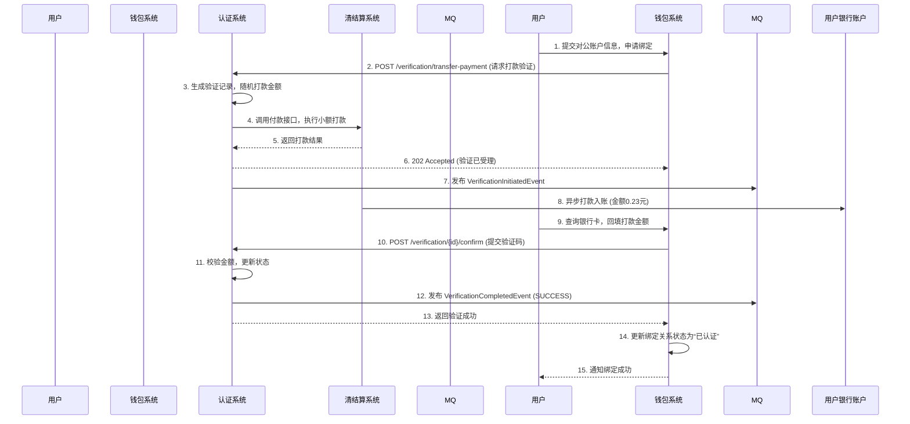
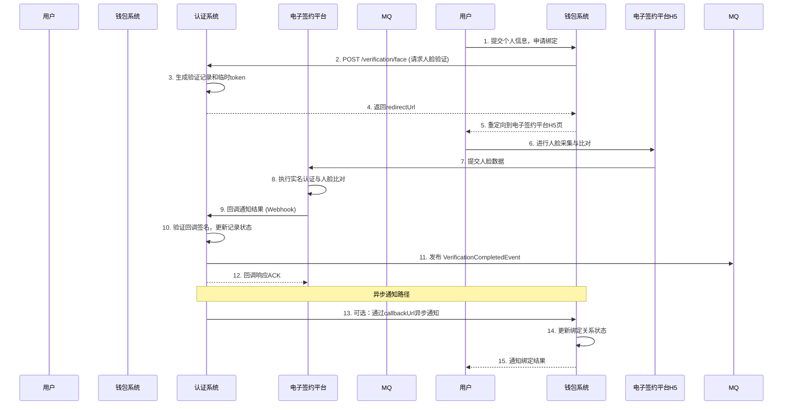

# 模块设计: 认证系统

生成时间: 2026-01-19 15:30:10

---

# 认证系统模块设计文档

## 1. 概述

### 1.1 目的
认证系统作为支付平台的核心身份核验模块，旨在为“天财分账”及其他业务场景提供安全、合规、可靠的身份与账户所有权验证能力。其主要目的是确保资金流转方（如总部、门店、供应商、股东）的身份真实性和账户控制权，为后续的“关系绑定”和“分账”操作提供法律和风控基础。

### 1.2 范围
本模块专注于提供标准化的认证能力，不处理具体的业务签约流程。其核心职责包括：
- **打款验证**：通过对公或对私银行卡打入随机金额，验证账户的有效性和用户控制权。
- **人脸验证**：通过比对姓名、身份证号与人脸生物特征，验证个人身份真实性。
- **认证状态管理**：记录、查询和管理每一次认证尝试的结果与证据。
- **与电子签约平台集成**：作为其底层认证能力提供方，完成关系绑定流程中的关键核验步骤。

### 1.3 设计原则
- **解耦与复用**：认证能力与具体业务逻辑解耦，通过标准API提供服务。
- **安全与合规**：所有验证流程符合金融级安全标准与监管要求，证据链完整可追溯。
- **高可用与性能**：作为关键路径组件，需保证高可用性，验证过程应高效。

## 2. 接口设计

### 2.1 API端点 (RESTful)

#### 2.1.1 发起打款验证
- **端点**: `POST /api/v1/verification/transfer-payment`
- **描述**: 请求系统向指定银行卡打入一笔随机金额的验证款。
- **认证**: 需要调用方（如行业钱包系统）的API密钥认证。
- **请求头**:
    - `X-Client-Id`: 调用方标识
    - `X-Signature`: 请求签名
- **请求体**:
```json
{
  "requestId": "req_202310271200001", // 调用方唯一请求ID，用于幂等
  "bizScene": "TIANCAI_BINDING", // 业务场景：TIANCAI_BINDING(天财关系绑定), WITHDRAW(提现)等
  "bizReferenceNo": "bind_123456", // 关联的业务唯一号（如签约流水号）
  "accountInfo": {
    "accountType": "CORPORATE", // 账户类型：CORPORATE-对公，PERSONAL-对私
    "accountName": "北京天财科技有限公司", // 账户名
    "accountNo": "1101234567890123456", // 银行卡号
    "bankCode": "ICBC", // 银行编码
    "bankBranch": "北京分行海淀支行" // 开户支行（对公建议提供）
  },
  "callbackUrl": "https://wallet.example.com/callback/verification" // 异步结果回调地址（可选）
}
```
- **成功响应** (202 Accepted):
```json
{
  "code": "SUCCESS",
  "message": "打款验证已发起",
  "data": {
    "verificationId": "ver_7x82hjs9a2k", // 本系统生成的唯一验证ID
    "status": "PROCESSING",
    "estimatedCompletionTime": "2023-10-27T12:05:00+08:00" // 预计打款完成时间
  }
}
```

#### 2.1.2 提交打款验证码
- **端点**: `POST /api/v1/verification/transfer-payment/{verificationId}/confirm`
- **描述**: 用户回填收到的打款金额，以完成验证。
- **请求体**:
```json
{
  "amount": "0.23" // 用户回填的金额，单位元，保留两位小数
}
```
- **成功响应**:
```json
{
  "code": "SUCCESS",
  "message": "验证成功",
  "data": {
    "verificationId": "ver_7x82hjs9a2k",
    "status": "SUCCESS",
    "verifiedAt": "2023-10-27T12:08:15+08:00"
  }
}
```

#### 2.1.3 发起人脸验证
- **端点**: `POST /api/v1/verification/face`
- **描述**: 发起一次人脸识别验证请求。
- **请求体**:
```json
{
  "requestId": "req_202310271200002",
  "bizScene": "TIANCAI_BINDING",
  "bizReferenceNo": "bind_123457",
  "userInfo": {
    "name": "张三",
    "idCardNo": "110101199001011234",
    "idCardType": "ID_CARD" // 证件类型：ID_CARD, PASSPORT等
  },
  "callbackUrl": "https://wallet.example.com/callback/verification",
  "redirectUrl": "https://h5.e-sign.com/face?token={token}" // 引导用户完成人脸识别的H5页面，由电子签约平台提供
}
```
- **成功响应**:
```json
{
  "code": "SUCCESS",
  "message": "人脸验证已发起",
  "data": {
    "verificationId": "ver_8k3jhs82na1",
    "status": "WAITING_USER_ACTION",
    "authToken": "eyJhbGciOi...", // 用于H5页面的临时令牌
    "redirectUrl": "https://h5.e-sign.com/face?token=eyJhbGciOi..." // 完整的跳转URL
  }
}
```

#### 2.1.4 查询验证结果
- **端点**: `GET /api/v1/verification/{verificationId}`
- **描述**: 同步查询某次验证的详细状态和结果。
- **成功响应**:
```json
{
  "code": "SUCCESS",
  "data": {
    "verificationId": "ver_7x82hjs9a2k",
    "requestId": "req_202310271200001",
    "bizScene": "TIANCAI_BINDING",
    "bizReferenceNo": "bind_123456",
    "method": "TRANSFER_PAYMENT", // 验证方法：TRANSFER_PAYMENT, FACE
    "status": "SUCCESS", // 状态：PROCESSING, WAITING_USER_ACTION, SUCCESS, FAILED, EXPIRED
    "accountInfo": { ... }, // 发起时的账户信息（打款验证独有）
    "userInfo": { ... }, // 发起时的用户信息（人脸验证独有）
    "evidence": {
      "transferAmount": "0.23", // 打款金额（打款验证成功后有值）
      "transferTime": "2023-10-27T12:03:00+08:00", // 打款时间
      "transactionNo": "txn_202310271203001" // 打款交易流水号
    },
    "failureReason": "AMOUNT_MISMATCH", // 失败原因码（如果失败）
    "failureMessage": "回填金额与打款金额不符",
    "createdAt": "2023-10-27T12:00:00+08:00",
    "updatedAt": "2023-10-27T12:08:15+08:00"
  }
}
```

### 2.2 发布/消费的事件

#### 2.2.1 发布的事件
认证系统在关键节点会向消息中间件（如Kafka）发布领域事件，供其他系统（如行业钱包系统、电子签约平台）订阅。

1. **VerificationInitiatedEvent** (验证已发起)
    - **Topic**: `verification.events.initiated`
    - **触发时机**: 成功受理打款验证或人脸验证请求后。
    - **Payload**:
    ```json
    {
      "eventId": "evt_001",
      "eventType": "VERIFICATION_INITIATED",
      "timestamp": "2023-10-27T12:00:00+08:00",
      "data": {
        "verificationId": "ver_7x82hjs9a2k",
        "bizScene": "TIANCAI_BINDING",
        "bizReferenceNo": "bind_123456",
        "method": "TRANSFER_PAYMENT",
        "status": "PROCESSING"
      }
    }
    ```

2. **VerificationCompletedEvent** (验证已完成)
    - **Topic**: `verification.events.completed`
    - **触发时机**: 验证最终状态确定（成功或失败）。
    - **Payload**:
    ```json
    {
      "eventId": "evt_002",
      "eventType": "VERIFICATION_COMPLETED",
      "timestamp": "2023-10-27T12:08:15+08:00",
      "data": {
        "verificationId": "ver_7x82hjs9a2k",
        "bizScene": "TIANCAI_BINDING",
        "bizReferenceNo": "bind_123456",
        "method": "TRANSFER_PAYMENT",
        "status": "SUCCESS",
        "failureReason": null,
        "evidence": { ... }
      }
    }
    ```

#### 2.2.2 消费的事件
认证系统可能需要消费来自其他系统的事件以触发某些操作（本需求中暂不涉及主动消费，主要为被动API调用）。

## 3. 数据模型

### 3.1 核心表设计

#### 表: `verification_record` (验证记录表)
存储每一次验证请求的完整信息与状态。
| 字段名 | 类型 | 必填 | 默认值 | 说明 |
| :--- | :--- | :--- | :--- | :--- |
| `id` | bigint(20) | 是 | AUTO_INCREMENT | 自增主键 |
| `verification_id` | varchar(32) | 是 | | **业务唯一验证ID**，全局唯一索引 `uk_verification_id` |
| `request_id` | varchar(64) | 是 | | **调用方请求ID**，与`client_id`组成联合唯一索引 `uk_request_client`，用于幂等 |
| `client_id` | varchar(32) | 是 | | **调用方标识** (如 `wallet_system`) |
| `biz_scene` | varchar(32) | 是 | | **业务场景**，如 `TIANCAI_BINDING` |
| `biz_reference_no` | varchar(64) | 是 | | **关联业务流水号** |
| `method` | varchar(20) | 是 | | **验证方法**：`TRANSFER_PAYMENT`, `FACE` |
| `status` | varchar(30) | 是 | `INIT` | **状态**: `INIT`, `PROCESSING`, `WAITING_USER_ACTION`, `SUCCESS`, `FAILED`, `EXPIRED` |
| `account_info_json` | json | 否 | NULL | **账户信息** (打款验证用)，JSON格式存储 `accountInfo` |
| `user_info_json` | json | 否 | NULL | **用户信息** (人脸验证用)，JSON格式存储 `userInfo` |
| `evidence_json` | json | 否 | NULL | **验证证据**，成功后的打款金额、流水号等 |
| `failure_reason` | varchar(50) | 否 | NULL | **失败原因码** |
| `failure_message` | varchar(255) | 否 | NULL | **失败详情** |
| `callback_url` | varchar(512) | 否 | NULL | 异步回调地址 |
| `expires_at` | datetime | 是 | | **验证过期时间**，创建后一定时间（如30分钟）未完成则状态置为`EXPIRED` |
| `created_at` | datetime | 是 | CURRENT_TIMESTAMP | 创建时间 |
| `updated_at` | datetime | 是 | CURRENT_TIMESTAMP ON UPDATE | 更新时间 |

**索引**:
- PRIMARY KEY (`id`)
- UNIQUE KEY `uk_verification_id` (`verification_id`)
- UNIQUE KEY `uk_request_client` (`request_id`, `client_id`)
- KEY `idx_biz_ref` (`biz_scene`, `biz_reference_no`)
- KEY `idx_status_expires` (`status`, `expires_at`) (用于过期扫描任务)

#### 表: `transfer_payment_detail` (打款验证明细表)
为打款验证场景扩展存储打款执行细节，与`verification_record`为一对一关系。
| 字段名 | 类型 | 必填 | 默认值 | 说明 |
| :--- | :--- | :--- | :--- | :--- |
| `id` | bigint(20) | 是 | AUTO_INCREMENT | 主键 |
| `verification_id` | varchar(32) | 是 | | 关联验证ID，外键 `fk_verification_id` |
| `transfer_amount` | decimal(10,2) | 是 | | **打款金额** (随机生成，如0.23) |
| `transfer_status` | varchar(20) | 是 | `PENDING` | **打款执行状态**: `PENDING`, `SUCCESS`, `FAILED` |
| `transaction_no` | varchar(64) | 否 | NULL | **打款交易流水号**，关联支付/清结算系统 |
| `attempt_count` | tinyint | 是 | 0 | **打款尝试次数** |
| `last_attempt_at` | datetime | 否 | NULL | 最后一次尝试打款时间 |
| `confirmed_amount` | decimal(10,2) | 否 | NULL | **用户回填的金额** |
| `created_at` | datetime | 是 | CURRENT_TIMESTAMP | |
| `updated_at` | datetime | 是 | CURRENT_TIMESTAMP ON UPDATE | |

**索引**:
- PRIMARY KEY (`id`)
- UNIQUE KEY `uk_verification_id` (`verification_id`)
- KEY `idx_transfer_status` (`transfer_status`, `last_attempt_at`) (用于重试任务)

### 3.2 与其他模块的关系
- **行业钱包系统**: 是认证系统的主要调用方，在“关系绑定”流程中发起认证请求。
- **电子签约平台**: 在人脸验证场景中，认证系统通过重定向将用户引导至电子签约平台提供的H5页面进行人脸采集与比对。电子签约平台在比对完成后，通过回调通知认证系统结果。
- **支付/清结算系统**: 在执行打款验证时，认证系统需调用支付或清结算系统的付款接口，完成小额打款。
- **账户系统**: 在部分风控场景下，可能需要查询账户状态（非本需求核心）。

## 4. 业务逻辑

### 4.1 核心算法

#### 4.1.1 随机打款金额生成
- **规则**: 生成一个介于 `0.01` 元到 `1.00` 元之间的随机金额。
- **精度**: 人民币分（0.01元）。
- **算法**: `amount = (random.nextInt(100) + 1) / 100.0`。
- **唯一性**: 对于同一`verification_id`，金额生成后固定不变。在极低概率冲突下可重试生成。

#### 4.1.2 验证结果判定
- **打款验证成功**: `abs(confirmed_amount - transfer_amount) < 0.005` (即误差小于半分钱)。
- **人脸验证成功**: 接收电子签约平台回调，比对分数高于预设阈值（如0.8），且姓名、身份证号一致。
- **失败**: 金额不符、超时、人脸比对失败或用户主动取消。

### 4.2 业务规则

1. **幂等性**: 使用 `request_id` + `client_id` 保证同一业务请求不会重复创建验证记录。
2. **有效期**: 每笔验证创建后有效期为 **30分钟**。超时后状态自动更新为 `EXPIRED`，不可再提交验证码。
3. **打款重试**: 打款操作若首次失败（如银行通道问题），系统自动重试，最多 **3次**，间隔指数退避。
4. **验证次数限制**: 同一`biz_reference_no`在24小时内，同一验证方法失败次数不得超过 **5次**，防止暴力破解。
5. **金额保密**: 打款金额在验证成功前，不得在任何日志或接口中明文泄露。
6. **场景适配**:
    - **对公账户绑定**：强制使用 **打款验证**。
    - **对私账户绑定**：优先使用 **人脸验证**；若人脸验证不可用（如用户拒绝），可降级为 **打款验证**。

### 4.3 验证逻辑

#### 4.3.1 发起请求校验
```python
def validate_init_request(request):
    # 1. 基本校验
    if not request.request_id or not request.biz_scene or not request.biz_reference_no:
        raise ValidationError("必要参数缺失")
    
    # 2. 根据method校验特定字段
    if request.method == "TRANSFER_PAYMENT":
        if not request.account_info or not request.account_info.account_no:
            raise ValidationError("打款验证必须提供账户信息")
        # 对公账户名校验规则更严格
        if request.account_info.account_type == "CORPORATE" and not request.account_info.account_name:
            raise ValidationError("对公账户必须提供户名")
    
    elif request.method == "FACE":
        if not request.user_info or not request.user_info.name or not request.user_info.id_card_no:
            raise ValidationError("人脸验证必须提供用户姓名和身份证号")
    
    # 3. 幂等校验：查询是否已有相同的 request_id + client_id 记录
    existing_record = VerificationRecord.find_by_request(request.request_id, request.client_id)
    if existing_record:
        return existing_record # 直接返回已存在的记录
    
    # 4. 风控校验：检查同一业务号是否超过失败次数限制
    if is_failure_limit_exceeded(request.biz_reference_no, request.method):
        raise BusinessError("验证失败次数过多，请稍后再试")
```

#### 4.3.2 确认打款金额校验
```python
def confirm_transfer_payment(verification_id, confirmed_amount):
    record = VerificationRecord.find_by_id(verification_id)
    
    # 1. 状态校验
    if record.status not in ["PROCESSING", "WAITING_USER_ACTION"]:
        raise BusinessError("当前验证状态不允许确认")
    
    # 2. 过期校验
    if record.expires_at < current_time():
        record.update_status("EXPIRED")
        raise BusinessError("验证已过期")
    
    # 3. 金额比对
    detail = TransferPaymentDetail.find_by_verification_id(verification_id)
    if abs(float(confirmed_amount) - float(detail.transfer_amount)) < 0.005:
        record.update_status("SUCCESS", evidence={"transferAmount": detail.transfer_amount, ...})
        publish_verification_completed_event(record)
    else:
        record.update_status("FAILED", failure_reason="AMOUNT_MISMATCH")
        publish_verification_completed_event(record)
        raise BusinessError("验证失败，金额不符")
```

## 5. 时序图

### 5.1 打款验证流程（门店绑定天财收款账户 - 对公场景）


### 5.2 人脸验证流程（供应商绑定天财接收方账户 - 对私场景）


## 6. 错误处理

### 6.1 预期错误码列表
| HTTP状态码 | 错误码 | 描述 | 处理建议 |
| :--- | :--- | :--- | :--- |
| 400 | `INVALID_PARAMETER` | 请求参数缺失或格式错误 | 检查请求体，确保必填字段符合规范 |
| 400 | `UNSUPPORTED_VERIFICATION_METHOD` | 不支持的验证方法 | 检查`method`字段是否为`TRANSFER_PAYMENT`或`FACE` |
| 409 | `DUPLICATE_REQUEST` | 重复的请求ID | 使用原`verificationId`进行后续操作，或更换`requestId` |
| 429 | `RATE_LIMIT_EXCEEDED` | 调用频率超限 | 降低调用频率，遵循限流策略 |
| 429 | `FAILURE_LIMIT_EXCEEDED` | 同一业务验证失败次数超限 | 引导用户24小时后再试 |
| 404 | `VERIFICATION_NOT_FOUND` | 验证记录不存在 | 检查`verificationId`是否正确 |
| 403 | `VERIFICATION_EXPIRED` | 验证已过期 | 重新发起验证请求 |
| 403 | `VERIFICATION_COMPLETED` | 验证已完成（成功/失败） | 根据当前状态决定后续操作，无需重复提交 |
| 500 | `THIRD_PARTY_SERVICE_ERROR` | 下游服务（清结算、电子签）异常 | 系统自动重试，告警通知运维 |
| 503 | `BANK_CHANNEL_UNAVAILABLE` | 打款通道暂时不可用 | 系统自动重试，告警通知运维 |

### 6.2 处理策略
1. **客户端错误 (4xx)**: 调用方需修正请求后重试。系统提供清晰的错误信息。
2. **服务端错误 (5xx)**:
    - **打款失败**: 系统内置重试机制（最多3次），并记录失败原因。最终仍失败则更新验证状态为`FAILED`，原因`TRANSFER_FAILED`。
    - **依赖服务超时/不可用**: 快速失败，返回503，并触发降级策略（如人脸验证不可用时，业务方可选择降级为打款验证）。
3. **异步回调保证**: 向`callbackUrl`发送回调时，实施重试机制（如1, 3, 5分钟间隔，最多5次），确保业务方最终能收到结果。
4. **监控与告警**: 对失败率、延迟、下游服务状态设置监控看板与告警阈值。

## 7. 依赖说明

### 7.1 上游依赖（认证系统调用）

| 依赖系统 | 交互目的 | 接口方式 | 关键要求 |
| :--- | :--- | :--- | :--- |
| **清结算系统** | 执行小额打款 | 同步/异步API | 高可用、支持小额付款（最低0.01元）、返回明确交易流水号 |
| **电子签约平台** | 人脸比对与实名认证 | 异步回调(Webhook) | 提供标准的H5页面集成方式、回调需带签名防篡改 |
| **消息队列 (Kafka)** | 发布领域事件 | 消息发布 | 高吞吐、高可用 |

### 7.2 下游依赖（调用认证系统）

| 调用方 | 交互场景 | 集成方式 | 注意事项 |
| :--- | :--- | :--- | :--- |
| **行业钱包系统** | 关系绑定流程中的身份核验 | 同步REST API + 事件订阅 | 需处理异步回调，实现幂等，关注验证有效期 |
| **（未来）其他业务系统** | 提现验证、敏感操作确认等 | 同步REST API | 遵循统一的API规范与认证方式 |

### 7.3 集成要点
1. **API认证**: 所有调用需通过API Gateway，使用 `X-Client-Id` 和签名 (`X-Signature`) 进行身份验证与防重放。
2. **超时设置**: 调用清结算系统打款接口时，设置合理超时（如5秒），并配置快速失败与重试策略。
3. **回调安全**: 电子签约平台回调需验证签名，确保请求来源可信。
4. **数据一致性**: 依赖分布式事务或最终一致性方案。例如，更新验证状态与发布事件应在一个本地事务中；若回调通知失败，通过定期扫描`PROCESSING`状态超时记录进行补偿。