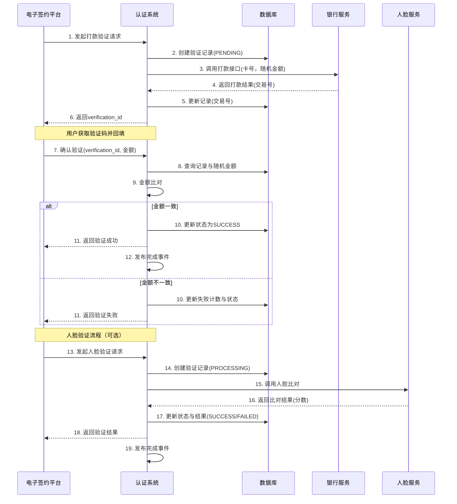

# 模块设计: 认证系统

生成时间: 2026-01-22 17:47:45
批判迭代: 2

---

# 认证系统模块设计文档

## 1. 概述
- **目的与范围**: 本模块负责提供统一的身份核验能力，用于确认用户身份的真实性和银行卡的有效性。核心职责包括处理打款验证和人脸验证，为电子签约、关系绑定、开通付款等业务流程提供认证支持。本模块不负责业务逻辑处理，仅作为认证能力的提供方。

## 2. 接口设计
- **API端点 (REST)**:
    - `POST /api/v1/verification/payment`: 发起打款验证请求。
    - `POST /api/v1/verification/face`: 发起人脸验证请求。
    - `POST /api/v1/verification/{verification_id}/confirm`: 确认打款验证（回填金额）。
    - `GET /api/v1/verification/{verification_id}`: 查询验证状态与结果。
- **请求/响应结构**:
    - **打款验证请求**:
        - 请求体: `{“user_name”: “string”, “id_card_no”: “string”, “bank_card_no”: “string”, “mobile”: “string”, “request_source”: “string”}`
        - 响应体: `{“verification_id”: “string”, “status”: “PENDING”, “message”: “string”}`
    - **人脸验证请求**:
        - 请求体: `{“user_name”: “string”, “id_card_no”: “string”, “face_image_data”: “base64_string”, “request_source”: “string”}`
        - 响应体: `{“verification_id”: “string”, “status”: “PROCESSING”, “score”: “number”, “result”: “boolean”}`
    - **打款确认请求**:
        - 请求体: `{“amount”: “number”}`
        - 响应体: `{“verification_id”: “string”, “status”: “SUCCESS/FAILED”, “message”: “string”}`
- **发布/消费的事件**:
    - 发布事件: `VerificationCompleted` (包含 `verification_id`, `type`, `result`, `user_info`, `timestamp`)。
    - 消费事件: TBD。

## 3. 数据模型
- **表/集合**:
    - `verification_requests`: 存储所有验证请求的主表。
    - `payment_verification_details`: 存储打款验证的详细信息。
    - `face_verification_details`: 存储人脸验证的详细信息。
- **关键字段**:
    - `verification_requests`: `verification_id` (PK), `user_id`, `type` (PAYMENT/FACE), `status` (PENDING, PROCESSING, SUCCESS, FAILED, EXPIRED), `request_source`, `created_at`, `updated_at`。
    - `payment_verification_details`: `verification_id` (FK), `bank_card_no`, `random_amount`, `transaction_id`, `confirmed_amount`, `retry_count`, `bank_response`。
    - `face_verification_details`: `verification_id` (FK), `id_card_no`, `match_score`, `threshold`, `third_party_response`。
- **与其他模块的关系**: 本模块被电子签约平台调用，以完成协议签署前的身份核验。验证结果通过事件或API回调通知调用方。

## 4. 业务逻辑
- **核心工作流/算法**:
    1. **打款验证**:
        - 接收并校验请求参数（姓名、身份证号、银行卡号）。
        - 生成唯一 `verification_id` 并持久化请求记录，状态为 `PENDING`。
        - 调用银行打款接口，传入银行卡号及系统生成的随机小额金额（如0.01-0.99元），记录银行返回的交易流水号。
        - 等待用户回填金额。用户通过确认接口提交金额后，系统比对用户回填金额与系统打款金额。
        - 若金额一致，则更新验证状态为 `SUCCESS`；若不一致，则记录失败并更新状态为 `FAILED`，可配置允许重试次数。
        - 发布 `VerificationCompleted` 事件。
    2. **人脸验证**:
        - 接收并校验请求参数（姓名、身份证号、人脸图像）。
        - 生成唯一 `verification_id` 并持久化请求记录，状态为 `PROCESSING`。
        - 调用第三方人脸比对服务（如公安库或商业服务），传入姓名、身份证号及人脸图像。
        - 接收比对结果（通常包含相似度分数）。根据预设阈值判断验证成功或失败。
        - 更新验证状态为 `SUCCESS` 或 `FAILED`，并记录分数与原始响应。
        - 发布 `VerificationCompleted` 事件。
- **业务规则与验证**:
    - 验证请求必须包含必要的身份信息（如姓名、身份证号、银行卡号/人脸图像），并进行格式与有效性校验。
    - 打款验证的随机金额有效期为24小时，超时后状态置为 `EXPIRED`。
    - 同一用户（身份证号）在短时间内连续验证失败超过N次（如3次），系统将锁定该用户一段时间（如1小时），禁止发起新验证。
    - 所有验证结果、请求参数、第三方响应及证据链需可靠记录，用于审计。
- **关键边界情况处理**:
    - **网络超时或第三方服务不可用**: 设计指数退避重试机制（最多3次）。若最终失败，更新验证状态为 `FAILED`，并记录错误原因。
    - **数据一致性**: 使用数据库事务确保请求记录与详情记录同时创建或更新。
    - **幂等性**: 通过 `verification_id` 保证同一验证请求的重复提交不会产生副作用。

## 5. 时序图

## 6. 错误处理
- **预期错误情况**:
    - **用户信息不完整或格式错误**: 返回400错误，附带具体字段校验失败信息。
    - **银行卡无效或打款失败**: 记录银行返回的具体错误码，返回业务失败响应，状态码为422。
    - **人脸比对失败或非本人**: 返回验证失败结果，包含失败原因（如“比对分数低于阈值”）。
    - **第三方服务（银行、公安库）调用异常**: 记录异常日志，根据重试策略处理，最终返回“系统繁忙，请稍后重试”或服务不可用状态。
    - **验证请求已过期或不存在**: 返回404或410状态码。
- **处理策略**:
    - 对输入参数进行严格校验，返回明确的错误码和提示信息。
    - 记录详细的错误日志，包含 `verification_id`、第三方响应和堆栈信息，便于排查。
    - 对可重试的错误（如网络超时）设计指数退避重试机制。
    - 实现全局异常处理器，将未捕获异常转换为通用的500错误响应，避免泄露内部信息。

## 7. 依赖关系
- **上游模块/调用方**: 电子签约平台（调用本模块进行认证，以完成关系绑定、开通付款等流程）。
- **下游服务/依赖**:
    - 银行系统（或支付通道）: 执行小额打款操作。
    - 第三方人脸比对服务（如公安系统或商业API）: 进行身份生物特征核验。
    - 内部消息队列: 用于发布验证完成事件。
- **数据存储**: 关系型数据库（如MySQL）用于持久化验证记录。