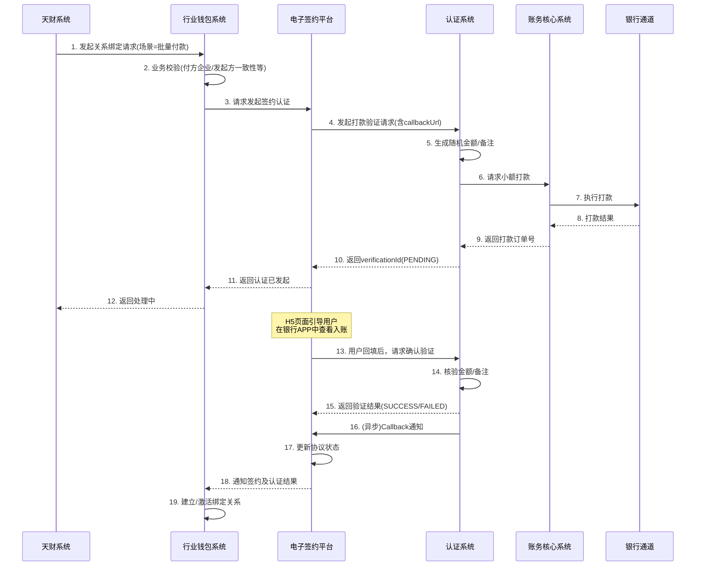

# 模块设计: 认证系统

生成时间: 2026-01-16 17:13:34

---

# 认证系统模块设计文档

## 1. 概述

### 1.1 目的
认证系统作为支付平台的核心安全模块，负责为“天财分账”等业务场景提供可靠的身份验证服务。其主要目的是确保资金流转关系绑定、协议签署等关键操作的主体身份真实有效，满足监管合规要求，并为电子签约平台提供认证证据链。

### 1.2 范围
本模块专注于以下核心功能：
1. **打款验证**：通过向目标银行卡打入随机小额款项，验证用户回填信息是否正确。
2. **人脸验证**：通过比对姓名、身份证和人脸生物特征信息进行身份核验。
3. **认证结果管理**：记录、存储和查询认证过程与结果，为其他系统（如行业钱包、电子签约平台）提供校验依据。
4. **接口封装**：为上游系统（主要是电子签约平台）提供标准化的认证服务接口。

**边界说明**：
- 本模块不负责协议模板管理、短信发送、H5页面生成（由电子签约平台负责）。
- 本模块不负责账户开立、关系绑定等业务逻辑（由行业钱包系统负责）。
- 本模块不直接面向天财或商户，所有请求均通过上游业务系统（如电子签约平台、行业钱包）发起。

## 2. 接口设计

### 2.1 API端点 (RESTful)

#### 2.1.1 发起打款验证
- **端点**: `POST /api/v1/verification/remittance`
- **描述**: 向指定银行卡发起一笔随机金额的打款，并生成一条待验证记录。
- **请求头**:
    - `X-Business-Id`: 业务流水号（由调用方生成，用于幂等）
    - `X-System-Code`: 调用系统编码（如：`WALLET`, `E-SIGN`）
- **请求体**:
```json
{
  "requestId": "REQ202310120001",
  "businessType": "TIANCAI_SPLIT_ACCOUNT",
  "scene": "BATCH_PAYMENT", // 场景：BATCH_PAYMENT, MEMBER_SETTLEMENT, POOLING
  "accountType": "TIANCAI_RECEIVE_ACCOUNT", // 账户类型
  "verifierType": "ENTERPRISE", // 核验方属性：ENTERPRISE, INDIVIDUAL
  "bankCardInfo": {
    "cardNo": "6228480012345678901",
    "accountName": "北京天财餐饮有限公司",
    "bankCode": "ICBC"
  },
  "callbackUrl": "https://e-sign.example.com/callback/verification",
  "extInfo": {
    "merchantNo": "M100001",
    "merchantName": "天财总部",
    "relatedMerchantNo": "M100002"
  }
}
```
- **响应体** (成功):
```json
{
  "code": "SUCCESS",
  "message": "打款验证已发起",
  "data": {
    "verificationId": "VER202310120001",
    "status": "PENDING",
    "estimatedArrivalTime": "2023-10-12T15:30:00Z"
  }
}
```

#### 2.1.2 确认打款验证
- **端点**: `POST /api/v1/verification/remittance/confirm`
- **描述**: 用户回填打款金额和备注后，调用此接口进行核验。
- **请求体**:
```json
{
  "verificationId": "VER202310120001",
  "filledAmount": "0.12",
  "filledRemark": "验证码"
}
```
- **响应体** (成功):
```json
{
  "code": "SUCCESS",
  "message": "验证成功",
  "data": {
    "verificationId": "VER202310120001",
    "status": "SUCCESS",
    "verifiedAt": "2023-10-12T15:35:00Z"
  }
}
```

#### 2.1.3 发起人脸验证
- **端点**: `POST /api/v1/verification/face`
- **描述**: 发起人脸生物特征核验。
- **请求体**:
```json
{
  "requestId": "REQ202310120002",
  "businessType": "TIANCAI_SPLIT_ACCOUNT",
  "scene": "BATCH_PAYMENT",
  "accountType": "TIANCAI_RECEIVE_ACCOUNT",
  "verifierType": "INDIVIDUAL",
  "identityInfo": {
    "name": "张三",
    "idCardNo": "110101199001011234"
  },
  "faceImage": "base64编码的人脸图片数据或图片URL",
  "livenessDetection": true, // 是否进行活体检测
  "callbackUrl": "https://e-sign.example.com/callback/verification",
  "extInfo": {
    "merchantNo": "M100002",
    "merchantName": "某某门店"
  }
}
```
- **响应体** (成功):
```json
{
  "code": "SUCCESS",
  "message": "人脸验证已发起",
  "data": {
    "verificationId": "VER202310120002",
    "status": "PENDING"
  }
}
```
*注：实际实现可能采用同步或异步模式。若接入的第三方人脸服务支持同步返回，则可同步返回结果。*

#### 2.1.4 查询认证结果
- **端点**: `GET /api/v1/verification/{verificationId}`
- **描述**: 根据认证流水号查询认证详情和结果。
- **响应体**:
```json
{
  "code": "SUCCESS",
  "message": "查询成功",
  "data": {
    "verificationId": "VER202310120001",
    "type": "REMITTANCE", // REMITTANCE, FACE
    "status": "SUCCESS", // PENDING, SUCCESS, FAILED, EXPIRED
    "businessType": "TIANCAI_SPLIT_ACCOUNT",
    "scene": "BATCH_PAYMENT",
    "verifierType": "ENTERPRISE",
    "targetInfo": {
      // 打款验证：包含银行卡信息
      // 人脸验证：包含身份信息
    },
    "requestedAt": "2023-10-12T15:25:00Z",
    "verifiedAt": "2023-10-12T15:35:00Z",
    "failureReason": null,
    "evidence": {
      // 证据链信息，如打款金额、备注、第三方人脸服务流水号等
      "remittanceAmount": "0.12",
      "remittanceRemark": "验证码",
      "thirdPartyRef": "TP202310120001"
    }
  }
}
```

### 2.2 发布/消费的事件

#### 2.2.1 消费的事件
- **`AccountCreatedEvent`** (来自账户系统)
    - **用途**: 当新的天财专用账户（收款账户或接收方账户）创建时，认证系统可监听此事件，用于关联后续的认证记录与账户。

#### 2.2.2 发布的事件
- **`VerificationCompletedEvent`**
    - **触发条件**: 任何一笔认证（打款/人脸）完成（成功或失败）。
    - **事件数据**:
    ```json
    {
      "eventId": "EVT_VER_202310120001",
      "type": "VERIFICATION_COMPLETED",
      "timestamp": "2023-10-12T15:35:00Z",
      "payload": {
        "verificationId": "VER202310120001",
        "type": "REMITTANCE",
        "status": "SUCCESS",
        "businessType": "TIANCAI_SPLIT_ACCOUNT",
        "relatedMerchantNo": "M100001",
        "relatedAccountNo": "ACC100001",
        "scene": "BATCH_PAYMENT"
      }
    }
    ```
    - **潜在消费者**: 电子签约平台（用于更新协议状态）、行业钱包系统（用于更新关系绑定状态）、审计系统。

## 3. 数据模型

### 3.1 核心表设计

#### 表: `verification_record` (认证记录主表)
| 字段名 | 类型 | 必填 | 描述 | 索引 |
|--------|------|------|------|------|
| id | BIGINT(自增) | 是 | 主键 | PK |
| verification_id | VARCHAR(32) | 是 | 业务流水号，全局唯一 | UK |
| request_id | VARCHAR(32) | 是 | 调用方请求ID，用于幂等 | IDX |
| type | TINYINT | 是 | 认证类型：1-打款，2-人脸 | |
| status | TINYINT | 是 | 状态：0-待验证，1-成功，2-失败，3-已过期 | IDX |
| business_type | VARCHAR(32) | 是 | 业务类型，如 `TIANCAI_SPLIT_ACCOUNT` | IDX |
| scene | VARCHAR(32) | 是 | 业务场景：`POOLING`, `BATCH_PAYMENT`, `MEMBER_SETTLEMENT` | |
| verifier_type | TINYINT | 是 | 核验方属性：1-企业，2-个人 | |
| target_identity | VARCHAR(64) | 是 | 目标身份标识（打款为卡号，人脸为身份证号） | IDX |
| target_name | VARCHAR(128) | 是 | 目标名称（户名或姓名） | |
| callback_url | VARCHAR(512) | 否 | 回调地址 | |
| requested_by | VARCHAR(32) | 是 | 请求系统编码 | |
| requested_at | DATETIME | 是 | 请求时间 | IDX |
| verified_at | DATETIME | 否 | 验证完成时间 | |
| expired_at | DATETIME | 是 | 过期时间（如打款验证24小时有效） | |
| failure_reason | VARCHAR(256) | 否 | 失败原因 | |
| ext_info | JSON | 否 | 扩展信息，存储商户号、账户号等 | |
| created_at | DATETIME | 是 | 创建时间 | |
| updated_at | DATETIME | 是 | 更新时间 | |

#### 表: `remittance_verification_detail` (打款验证详情表)
| 字段名 | 类型 | 必填 | 描述 | 索引 |
|--------|------|------|------|------|
| id | BIGINT | 是 | 主键，与verification_record.id一对一 | PK, FK |
| bank_card_no | VARCHAR(32) | 是 | 打款银行卡号 | IDX |
| bank_card_name | VARCHAR(128) | 是 | 银行卡户名 | |
| bank_code | VARCHAR(16) | 是 | 银行编码 | |
| expected_amount | DECIMAL(10,2) | 是 | 预期打款金额（随机生成） | |
| expected_remark | VARCHAR(32) | 是 | 预期备注（随机6位数字或2汉字） | |
| actual_amount | DECIMAL(10,2) | 否 | 用户回填金额 | |
| actual_remark | VARCHAR(32) | 否 | 用户回填备注 | |
| remittance_order_no | VARCHAR(32) | 否 | 关联的打款订单号（来自账务核心） | UK |
| remittance_status | TINYINT | 是 | 打款状态：0-待打款，1-打款中，2-打款成功，3-打款失败 | |

#### 表: `face_verification_detail` (人脸验证详情表)
| 字段名 | 类型 | 必填 | 描述 | 索引 |
|--------|------|------|------|------|
| id | BIGINT | 是 | 主键，与verification_record.id一对一 | PK, FK |
| id_card_no | VARCHAR(32) | 是 | 身份证号 | IDX |
| name | VARCHAR(128) | 是 | 姓名 | |
| face_image_url | VARCHAR(512) | 否 | 人脸图片存储地址 | |
| liveness_score | DECIMAL(5,2) | 否 | 活体检测分数 | |
| similarity_score | DECIMAL(5,2) | 否 | 人脸比对相似度分数 | |
| third_party_request_id | VARCHAR(64) | 否 | 第三方人脸服务请求ID | |
| third_party_result | JSON | 否 | 第三方返回的原始结果 | |

### 3.2 与其他模块的关系
- **行业钱包系统**: 消费认证结果，用于判断关系绑定是否满足条件（协议+认证）。
- **电子签约平台**: 主要调用方，在协议签署流程中嵌入认证环节。
- **账务核心系统**: 为打款验证提供小额打款能力，并记录相关分录。
- **账户系统**: 通过事件关联认证记录与账户实体。

## 4. 业务逻辑

### 4.1 核心算法与流程

#### 4.1.1 打款验证流程
1. **接收请求与幂等校验**：根据`requestId`和`businessType`防止重复请求。
2. **参数校验**：校验银行卡号合法性、户名非空等。
3. **生成随机验证信息**：
    - 金额：生成一个随机小数（如0.01-0.99元），精度到分。
    - 备注：生成6位随机数字或2个随机汉字。
4. **调用账务核心发起打款**：生成一笔特殊的打款交易，资金从系统内部账户支出。
5. **保存记录**：将预期金额、备注、打款订单号等信息落库，状态置为`PENDING`。
6. **等待用户回填**：通过电子签约平台的H5页面引导用户查看银行入账信息并回填。
7. **核验回填信息**：
    - 比对`actualAmount`与`expectedAmount`（允许微小浮点误差）。
    - 比对`actualRemark`与`expectedRemark`。
    - 两者均一致则验证成功，否则失败。
8. **回调通知**：通过`callbackUrl`异步通知调用方结果。

#### 4.1.2 人脸验证流程
1. **接收请求与幂等校验**。
2. **参数校验**：校验姓名、身份证号格式，人脸图片质量（如大小、清晰度）。
3. **活体检测（如启用）**：调用第三方服务判断是否为真人活体，防御照片、视频攻击。
4. **人脸比对**：调用第三方服务，将上传的人脸图片与公安库或预留照片进行比对。
5. **结果判定**：根据第三方返回的`liveness_score`和`similarity_score`，结合内部阈值（可配置）判断成功或失败。
6. **保存证据链**：存储第三方请求ID、原始结果、分数等。
7. **回调通知**。

### 4.2 业务规则
1. **认证有效期**：
    - 打款验证：自发起后24小时内有效，超时自动置为`EXPIRED`。
    - 人脸验证：通常为实时验证，无长期有效期。
2. **重试限制**：
    - 同一银行卡号/身份证号在同一业务场景下，24小时内失败次数超过3次，则锁定24小时。
    - 防止暴力破解。
3. **认证结果复用**（根据需求讨论确定）：
    - **方案A（严格）**：每次关系绑定都需要新的认证。
    - **方案B（宽松）**：同一商户/个人在同一业务类型下，认证结果在一定期限内（如90天）可复用。**根据需求片段，倾向于方案A，每次绑定都需要认证。**
4. **打款资金来源与对账**：打款资金从系统指定的内部垫资账户支出，需与账务核心每日对账，确保账实相符。

### 4.3 验证逻辑（作为服务提供方）
本模块主要提供原子化的认证能力，复杂的业务一致性校验（如“付方商户号是否=发起方商户号”）由调用方（行业钱包）负责。
1. **输入参数校验**：确保必填字段齐全、格式正确。
2. **银行卡三/四要素验证**（打款前）：可调用内部风控或银行渠道进行初步校验，但非必须，因为打款本身是最强校验。
3. **身份证号格式校验**：符合国家标准。
4. **人脸图片安全校验**：防止恶意文件上传。

## 5. 时序图

### 5.1 电子签约平台发起的打款验证流程（以批量付款场景为例）



## 6. 错误处理

| 错误类型 | 错误码 | HTTP状态码 | 处理策略 |
|----------|--------|-------------|----------|
| 参数校验失败 | `PARAM_INVALID` | 400 | 返回具体哪个字段不符合规则，调用方修正后重试。 |
| 重复请求 | `REQUEST_DUPLICATE` | 409 | 返回已存在的verificationId及状态，调用方根据业务决定是否使用已有流水。 |
| 认证记录不存在 | `VERIFICATION_NOT_FOUND` | 404 | 检查verificationId是否正确，或认证已过期被清理。 |
| 认证已过期 | `VERIFICATION_EXPIRED` | 410 | 引导用户重新发起认证流程。 |
| 打款失败（银行原因） | `REMITTANCE_FAILED` | 502 | 记录详细原因，通知运营人员，并返回用户友好提示（如“银行处理失败，请稍后重试”）。 |
| 人脸服务不可用 | `FACE_SERVICE_UNAVAILABLE` | 503 | 触发告警，进入降级策略（如提示用户稍后再试或切换认证方式）。 |
| 系统内部错误 | `INTERNAL_ERROR` | 500 | 记录错误日志，触发告警，返回通用错误信息。 |

**重试策略**：
- 对于网络超时等临时性错误，调用方应实现指数退避重试。
- 对于打款验证的确认请求，由于涉及资金核对，应避免自动重试，由用户主动触发。

## 7. 依赖说明

### 7.1 上游依赖模块
1. **电子签约平台**
    - **交互方式**: 同步API调用（发起/确认认证）、异步回调（接收结果）。
    - **职责**: 认证系统的主要调用方，负责在协议签署流程中嵌入认证环节，并展示H5页面。
    - **SLA要求**: 高可用性（99.95%），平均响应时间<200ms。

2. **账务核心系统**
    - **交互方式**: 同步API调用（发起打款）。
    - **职责**: 提供小额打款能力，并确保资金准确划出和记账。
    - **依赖接口**: `POST /internal/transfer/small-remittance` (内部接口，需定义)。

3. **第三方人脸核验服务**
    - **交互方式**: 同步/异步API调用（取决于服务商）。
    - **职责**: 提供活体检测和人脸比对能力。
    - **降级方案**: 若服务不可用，人脸验证功能暂时失效，业务侧需有备选方案（如仅限打款验证）。

### 7.2 下游服务模块
1. **行业钱包系统**
    - **交互方式**: 事件消费 (`VerificationCompletedEvent`)。
    - **职责**: 监听认证完成事件，作为关系绑定生效的条件之一。

2. **审计/日志系统**
    - **交互方式**: 日志输出、事件发布。
    - **职责**: 记录所有认证操作，满足合规审计要求。

### 7.3 配置与治理
- **配置中心**: 管理第三方服务密钥、人脸比对阈值、打款金额范围、有效期等参数。
- **监控告警**: 监控认证成功率、失败率、各环节耗时、第三方服务健康状态。
- **密钥管理**: 安全存储第三方API密钥、人脸服务密钥等敏感信息。